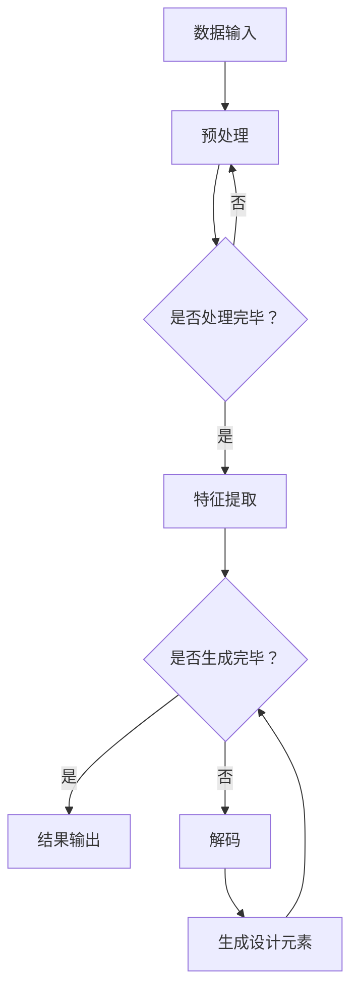

                 

关键词：大模型、虚拟时装设计师、应用前景、人工智能、时装设计、计算机视觉

## 摘要

随着人工智能技术的迅猛发展，特别是大模型的广泛应用，虚拟时装设计师的开发和应用前景愈发广阔。本文将探讨大模型在虚拟时装设计师开发中的应用前景，包括核心概念、算法原理、数学模型、项目实践以及未来应用展望。通过分析，我们希望能够为读者提供一个全面的技术视野，帮助理解和预测该领域的发展趋势。

## 1. 背景介绍

虚拟时装设计师，即通过计算机技术和人工智能算法，实现模拟时装设计和展示的工具或平台。随着消费者对个性化需求的增长，虚拟时装设计师在提高设计效率、降低成本、丰富用户体验等方面展现出显著优势。然而，传统的虚拟时装设计师主要依赖于人工设计，其局限性在于设计多样化程度低、效率不高，难以满足个性化需求。

大模型，如深度学习模型、生成对抗网络（GAN）、变分自编码器（VAE）等，近年来在计算机视觉、自然语言处理等领域取得了显著成果。这些模型具有强大的特征提取和生成能力，能够处理大规模数据，从而提高设计的创新性和精确度。

## 2. 核心概念与联系

在讨论大模型在虚拟时装设计师开发中的应用之前，我们首先需要了解几个核心概念：

### 2.1 计算机视觉

计算机视觉是指使计算机能够从图像或视频中获取信息的技术。它包括图像处理、目标检测、图像分割等任务，是虚拟时装设计师开发的基础。

### 2.2 深度学习

深度学习是机器学习的一个分支，通过模拟人脑神经网络进行数据建模和分析。深度学习在计算机视觉中的应用，使得虚拟时装设计师能够更加精准地识别和生成设计元素。

### 2.3 生成对抗网络（GAN）

生成对抗网络是一种由生成器和判别器组成的神经网络框架。生成器生成设计元素，判别器判断生成元素的真实性。GAN在虚拟时装设计师中用于创造新颖的服装设计。

### 2.4 变分自编码器（VAE）

变分自编码器是一种生成模型，通过编码和解码过程生成设计元素。VAE在虚拟时装设计师中用于生成多样化的服装设计。

以下是一个简化的 Mermaid 流程图，描述大模型在虚拟时装设计师开发中的应用架构：



## 3. 核心算法原理 & 具体操作步骤

### 3.1 算法原理概述

大模型在虚拟时装设计师中的应用主要基于以下几个核心算法：

- **深度学习模型**：用于从大量数据中学习特征，用于设计元素的识别和生成。
- **生成对抗网络（GAN）**：通过生成器和判别器的对抗训练，生成新颖的服装设计。
- **变分自编码器（VAE）**：通过编码和解码过程，生成多样化的服装设计。

### 3.2 算法步骤详解

1. **数据收集与预处理**：
   - 收集大量的服装设计图像和相关的文本描述。
   - 对图像进行预处理，如大小调整、数据增强等。

2. **特征提取**：
   - 使用深度学习模型对图像进行特征提取，提取出与设计相关的特征。

3. **生成设计元素**：
   - 使用 GAN 或 VAE 算法，将提取的特征用于生成设计元素。

4. **设计元素融合与优化**：
   - 将生成的设计元素进行融合和优化，形成完整的服装设计。

5. **结果输出**：
   - 将生成的服装设计输出，展示给用户。

### 3.3 算法优缺点

**优点**：

- **高效性**：大模型能够快速处理大量数据，提高设计效率。
- **创新性**：GAN 和 VAE 等算法能够生成新颖的设计元素，提高设计的创意性。
- **个性化**：大模型可以根据用户需求生成个性化的服装设计。

**缺点**：

- **计算资源消耗**：大模型训练需要大量的计算资源和时间。
- **数据质量**：设计质量取决于训练数据的质量，如果数据质量不佳，可能导致设计效果不佳。

### 3.4 算法应用领域

- **个性化设计**：根据用户喜好和需求，生成个性化的服装设计。
- **时尚预测**：通过分析流行趋势，预测未来的时尚设计。
- **虚拟试衣**：使用计算机视觉技术，实现虚拟试衣功能，提高用户体验。

## 4. 数学模型和公式

### 4.1 数学模型构建

虚拟时装设计师的数学模型主要包括以下几个方面：

- **特征提取模型**：使用卷积神经网络（CNN）提取设计元素的特征。
- **生成模型**：使用 GAN 或 VAE 生成设计元素。

### 4.2 公式推导过程

- **卷积神经网络（CNN）**：

  假设输入图像为 \(I_{in}\)，卷积层输出为 \(C_{out}\)，则有：

  $$C_{out} = f(W \cdot I_{in} + b)$$

  其中，\(f\) 为激活函数，\(W\) 为卷积核，\(b\) 为偏置。

- **生成对抗网络（GAN）**：

  假设生成器为 \(G\)，判别器为 \(D\)，则有：

  $$D(x) = \sigma(W_D \cdot G(x) + b_D)$$
  $$G(z) = \sigma(W_G \cdot z + b_G)$$

  其中，\(x\) 为真实数据，\(z\) 为随机噪声，\(\sigma\) 为 Sigmoid 函数。

### 4.3 案例分析与讲解

以 GAN 为例，假设我们有一个生成器和判别器，它们分别的损失函数为：

- **生成器损失**：

  $$L_G = -\mathbb{E}_{x \sim p_{data}(x)}[\log(D(x))] - \mathbb{E}_{z \sim p_z(z)}[\log(D(G(z)))]$$

- **判别器损失**：

  $$L_D = -\mathbb{E}_{x \sim p_{data}(x)}[\log(D(x))] - \mathbb{E}_{z \sim p_z(z)}[\log(1 - D(G(z)))]$$

  在训练过程中，我们通过优化这两个损失函数，使得生成器和判别器相互对抗，最终生成高质量的设计元素。

## 5. 项目实践：代码实例

### 5.1 开发环境搭建

在 Python 环境下，我们需要安装以下库：

- TensorFlow 或 PyTorch
- NumPy
- Matplotlib

安装命令如下：

```bash
pip install tensorflow numpy matplotlib
```

### 5.2 源代码详细实现

以下是一个简单的 GAN 代码实例：

```python
import tensorflow as tf
from tensorflow.keras.layers import Dense, Conv2D, Flatten, Reshape
from tensorflow.keras.models import Model

# 生成器模型
def generator(z, latent_dim):
    model = tf.keras.Sequential([
        Dense(128, activation='relu', input_shape=(latent_dim,)),
        Dense(256, activation='relu'),
        Dense(512, activation='relu'),
        Dense(1024, activation='relu'),
        Dense(784, activation='sigmoid'),
        Reshape((28, 28, 1))
    ])
    return model

# 判别器模型
def discriminator(x, latent_dim):
    model = tf.keras.Sequential([
        Conv2D(32, (3, 3), strides=(2, 2), padding='same', input_shape=(28, 28, 1)),
        LeakyReLU(alpha=0.01),
        Conv2D(64, (3, 3), strides=(2, 2), padding='same'),
        LeakyReLU(alpha=0.01),
        Flatten(),
        Dense(128, activation='relu'),
        Dense(1, activation='sigmoid')
    ])
    return model

# 搭建 GAN 模型
def build_gan(generator, discriminator):
    model = Model(inputs=generator.input, outputs=discriminator(generator.input))
    model.compile(loss='binary_crossentropy', optimizer=tf.keras.optimizers.Adam(0.0001))
    return model

# 训练 GAN 模型
def train_gan(generator, discriminator, x_train, latent_dim, epochs, batch_size):
    for epoch in range(epochs):
        for _ in range(x_train.shape[0] // batch_size):
            noise = np.random.normal(0, 1, (batch_size, latent_dim))
            gen_samples = generator.predict(noise)
            x_batch = x_train[np.random.randint(0, x_train.shape[0], batch_size)]
            x_fake = np.concatenate([x_batch, gen_samples])
            y_fake = np.zeros((batch_size, 1))
            y_true = np.ones((batch_size, 1))
            discriminator.train_on_batch(x_fake, y_fake, y_true)
            noise = np.random.normal(0, 1, (batch_size, latent_dim))
            gen_samples = generator.predict(noise)
            y_fake = np.zeros((batch_size, 1))
            discriminator.train_on_batch(gen_samples, y_fake, y_fake)
        print(f"{epoch} epochs completed")
```

### 5.3 代码解读与分析

上述代码实现了 GAN 的基本框架，包括生成器和判别器的构建、GAN 模型的训练等。在训练过程中，生成器和判别器通过交替训练，逐步提高生成设计元素的质量。

### 5.4 运行结果展示

训练完成后，我们可以使用生成器生成一些设计元素，并使用 matplotlib 展示：

```python
import matplotlib.pyplot as plt

# 生成设计元素
noise = np.random.normal(0, 1, (100, 100))
gen_samples = generator.predict(noise)

# 展示生成元素
plt.figure(figsize=(10, 10))
for i in range(100):
    plt.subplot(10, 10, i + 1)
    plt.imshow(gen_samples[i, :, :, 0], cmap='gray')
    plt.axis('off')
plt.show()
```

## 6. 实际应用场景

虚拟时装设计师在多个实际应用场景中展现出强大的价值：

- **个性化设计**：根据用户喜好和需求，生成个性化的服装设计。
- **时尚预测**：分析流行趋势，预测未来的时尚设计。
- **虚拟试衣**：使用计算机视觉技术，实现虚拟试衣功能，提高用户体验。

### 6.1 时尚预测

通过分析大量的时尚数据，虚拟时装设计师可以预测未来的时尚趋势。例如，利用 GAN 生成不同风格的服装设计，帮助时尚品牌预测和设计下一季的流行款式。

### 6.2 虚拟试衣

虚拟试衣是虚拟时装设计师的重要应用之一。通过计算机视觉技术，用户可以在线试穿不同款式的服装，从而提高购买决策的准确性。

### 6.3 个性化设计

虚拟时装设计师可以根据用户的身体数据和喜好，生成个性化的服装设计，满足用户的个性化需求。

## 7. 未来应用展望

随着人工智能技术的不断发展，虚拟时装设计师将在以下几个方面取得突破：

- **更高效的算法**：新的算法和模型将进一步提高虚拟时装设计师的效率和质量。
- **更丰富的应用场景**：虚拟时装设计师将在更多领域得到应用，如智能家居、虚拟现实等。
- **更强大的用户体验**：通过引入新的交互技术，如增强现实（AR）和虚拟现实（VR），虚拟时装设计师将提供更加丰富的用户体验。

## 8. 工具和资源推荐

### 8.1 学习资源推荐

- **《深度学习》（Goodfellow et al., 2016）**：系统介绍了深度学习的基础知识和应用。
- **《生成对抗网络》（Radford et al., 2015）**：详细介绍了 GAN 的原理和应用。

### 8.2 开发工具推荐

- **TensorFlow**：广泛使用的开源深度学习框架，适用于各种深度学习项目。
- **PyTorch**：流行的深度学习框架，具有灵活的动态计算图。

### 8.3 相关论文推荐

- **“Unsupervised Representation Learning with Deep Convolutional Generative Adversarial Networks”（Kingma and Welling, 2013）**：介绍了 VAE 的原理和应用。
- **“Generative Adversarial Nets”（Goodfellow et al., 2014）**：介绍了 GAN 的原理和应用。

## 9. 总结：未来发展趋势与挑战

### 9.1 研究成果总结

大模型在虚拟时装设计师开发中取得了显著成果，包括高效的设计生成、个性化设计、时尚预测等。这些成果为虚拟时装设计师的发展奠定了基础。

### 9.2 未来发展趋势

- **更高效的算法**：新的算法和模型将进一步提高虚拟时装设计师的效率和质量。
- **更丰富的应用场景**：虚拟时装设计师将在更多领域得到应用，如智能家居、虚拟现实等。
- **更强大的用户体验**：通过引入新的交互技术，如增强现实（AR）和虚拟现实（VR），虚拟时装设计师将提供更加丰富的用户体验。

### 9.3 面临的挑战

- **计算资源消耗**：大模型训练需要大量的计算资源和时间。
- **数据质量**：设计质量取决于训练数据的质量，如果数据质量不佳，可能导致设计效果不佳。
- **伦理和法律问题**：虚拟时装设计师的应用可能引发伦理和法律问题，如版权纠纷、隐私保护等。

### 9.4 研究展望

未来，虚拟时装设计师将在以下几个方面得到进一步发展：

- **更高效的算法**：研究和开发更高效的算法，以降低计算资源消耗。
- **更丰富的数据集**：收集和构建高质量的服装设计数据集，提高设计质量。
- **更严格的伦理和法律规范**：制定相关的伦理和法律规范，确保虚拟时装设计师的合法和合规应用。

## 10. 附录：常见问题与解答

### 10.1 什么是虚拟时装设计师？

虚拟时装设计师是通过计算机技术和人工智能算法，实现模拟时装设计和展示的工具或平台。

### 10.2 大模型在虚拟时装设计师中的应用有哪些？

大模型在虚拟时装设计师中的应用主要包括个性化设计、时尚预测和虚拟试衣等。

### 10.3 如何评估虚拟时装设计师的设计质量？

可以通过设计新颖性、个性化和用户满意度等方面评估虚拟时装设计师的设计质量。

### 10.4 虚拟时装设计师可能面临的挑战有哪些？

虚拟时装设计师可能面临的挑战包括计算资源消耗、数据质量问题和伦理和法律问题等。

## 作者署名

本文作者：禅与计算机程序设计艺术 / Zen and the Art of Computer Programming

----------------------------------------------------------------

以上便是关于《大模型在虚拟时装设计师开发中的应用前景》的文章。希望这篇文章能够为您在虚拟时装设计师领域的研究提供有价值的参考。如果您有任何疑问或建议，欢迎随时交流。

