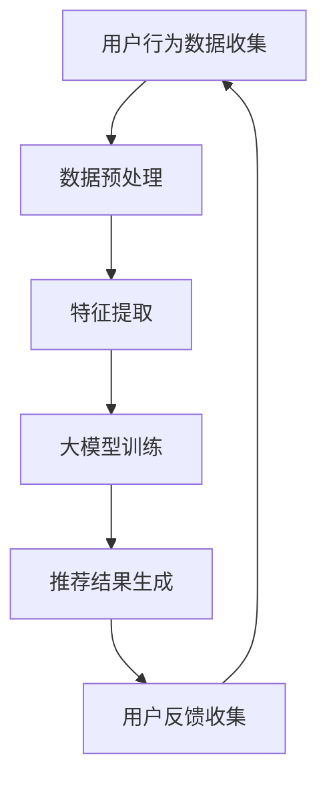

                 

关键词：大模型、长尾商品、推荐系统、人工智能、深度学习

摘要：本文探讨了大规模模型在长尾商品推荐系统中的应用。通过介绍长尾商品的特点和推荐系统的基本原理，本文详细解析了如何利用大模型提升长尾商品的推荐效果，并从算法原理、数学模型、项目实践等方面进行了深入探讨。

## 1. 背景介绍

### 1.1 长尾商品的定义和特点

长尾商品（Long-tail products）是指市场上那些需求量相对较小的商品，相对于热门商品而言，它们构成了商品销售中的长尾部分。长尾商品具有以下特点：

1. **多样性**：长尾商品涵盖了广泛的产品种类，包括独特、专业和定制化的商品。
2. **低需求**：长尾商品的需求量通常较小，无法与热门商品的需求量相提并论。
3. **销售潜力**：尽管单个商品的销售量不高，但长尾商品的整体市场潜力巨大。

### 1.2 推荐系统的作用

推荐系统是电子商务和在线服务中的一种核心技术，旨在通过个性化推荐帮助用户发现他们可能感兴趣的商品或服务。推荐系统的核心作用包括：

1. **提高用户满意度**：通过推荐用户可能喜欢的商品，提升用户的购物体验。
2. **增加销售额**：帮助商家发现潜在客户，提高销售转化率。
3. **优化库存管理**：帮助商家合理规划库存，减少库存积压。

## 2. 核心概念与联系

### 2.1 大模型的概念

大模型（Large-scale Model）是指那些具有大量参数和计算量的机器学习模型，如深度神经网络（DNN）、变换器模型（Transformer）等。大模型的优势在于其能够处理大规模的数据集，提取复杂的特征，从而提高模型的表现。

### 2.2 推荐系统与长尾商品的关联

在长尾商品推荐中，推荐系统需要处理大量的商品和用户数据，这要求模型具有强大的特征提取能力和良好的泛化能力。大模型能够通过以下方式提升长尾商品的推荐效果：

1. **更精细的用户画像**：大模型能够处理更多的用户数据，提取更精细的用户特征，从而更准确地匹配用户和商品。
2. **更好的特征表示**：大模型能够通过深度学习技术，将原始数据进行复杂的转换，生成更高级的特征表示，有助于发现用户和商品之间的隐含关系。
3. **更高的泛化能力**：大模型在面对长尾商品这种数据分布不均的情况时，能够更好地适应不同的数据分布，提高推荐系统的稳定性。

### 2.3 Mermaid 流程图

下面是一个简化的 Mermaid 流程图，展示了长尾商品推荐系统中大模型的应用流程：



## 3. 核心算法原理 & 具体操作步骤

### 3.1 算法原理概述

长尾商品推荐系统通常采用基于内容的推荐（Content-Based Recommendation）和协同过滤（Collaborative Filtering）相结合的方法。大模型在其中扮演了关键角色，主要负责特征提取和模型训练。

1. **基于内容的推荐**：通过分析商品的内容特征（如文本描述、标签等）和用户的历史行为，为用户生成推荐列表。
2. **协同过滤**：通过分析用户之间的行为相似性，为用户推荐与其相似用户喜欢的商品。
3. **大模型集成**：将基于内容和协同过滤的推荐结果进行整合，利用大模型对推荐结果进行优化，提升推荐效果。

### 3.2 算法步骤详解

1. **数据收集**：收集用户行为数据（如浏览记录、购买历史、评价等）和商品信息数据（如商品描述、分类、标签等）。
2. **数据预处理**：对收集到的数据进行清洗、去重、标准化等预处理操作，确保数据质量。
3. **特征提取**：利用自然语言处理（NLP）技术和深度学习技术，提取用户和商品的特征向量。
4. **模型训练**：使用训练集数据，通过基于内容的推荐和协同过滤的方法训练大模型。
5. **推荐结果生成**：利用训练好的大模型，对用户生成个性化推荐列表。
6. **用户反馈收集**：收集用户对推荐结果的评价，用于后续模型优化。
7. **模型优化**：根据用户反馈，调整模型参数，优化推荐效果。

### 3.3 算法优缺点

**优点**：

1. **强大的特征提取能力**：大模型能够处理大规模的数据，提取复杂的特征，提高推荐精度。
2. **良好的泛化能力**：大模型在面对长尾商品这种数据分布不均的情况时，能够更好地适应不同的数据分布。

**缺点**：

1. **计算资源消耗大**：大模型训练和推理需要大量的计算资源，对硬件设备要求较高。
2. **数据隐私问题**：用户行为数据的收集和处理可能涉及用户隐私问题，需要采取措施保护用户隐私。

### 3.4 算法应用领域

大模型在长尾商品推荐系统中具有广泛的应用领域，包括电子商务、在线购物平台、社交媒体、音乐和视频推荐等。通过利用大模型，这些系统可以更好地挖掘用户需求，提高用户满意度，增加销售额。

## 4. 数学模型和公式 & 详细讲解 & 举例说明

### 4.1 数学模型构建

在长尾商品推荐系统中，常用的数学模型包括基于内容的推荐模型和协同过滤模型。下面是这两种模型的数学表示：

**基于内容的推荐模型**：

设用户 \( u \) 和商品 \( i \) 的特征向量分别为 \( \mathbf{x}_u \) 和 \( \mathbf{x}_i \)，推荐分数可以表示为：

\[ R_{ui} = \mathbf{x}_u^T \mathbf{w}_i \]

其中，\( \mathbf{w}_i \) 为商品 \( i \) 的权重向量。

**协同过滤模型**：

设用户 \( u \) 和 \( v \) 的相似度矩阵为 \( \mathbf{S} \)，推荐分数可以表示为：

\[ R_{ui} = \sum_{j \in N_i} S_{uv} r_{uj} \]

其中，\( N_i \) 为与商品 \( i \) 相关的用户集合，\( r_{uj} \) 为用户 \( u \) 对商品 \( j \) 的评分。

### 4.2 公式推导过程

**基于内容的推荐模型**：

推荐分数的计算基于用户和商品的特征相似度。特征相似度可以通过内积计算，即：

\[ \mathbf{x}_u^T \mathbf{w}_i = \sum_{k=1}^d x_{uk} w_{ik} \]

其中，\( d \) 为特征维度，\( x_{uk} \) 和 \( w_{ik} \) 分别为用户 \( u \) 和商品 \( i \) 在特征 \( k \) 上的值。

**协同过滤模型**：

推荐分数的计算基于用户之间的相似度和商品评分。相似度可以通过用户和用户之间的内积计算，即：

\[ S_{uv} = \sum_{k=1}^d x_{uk} x_{vk} \]

其中，\( x_{uk} \) 和 \( x_{vk} \) 分别为用户 \( u \) 和 \( v \) 在特征 \( k \) 上的值。

### 4.3 案例分析与讲解

**案例背景**：

某电子商务平台想要为用户推荐商品，用户的行为数据包括浏览记录、购买历史和评价等。商品的信息数据包括商品描述、分类和标签等。

**案例分析**：

1. **数据收集**：平台收集了用户 \( u \) 的浏览记录和商品 \( i \) 的描述信息。
2. **数据预处理**：对用户和商品的数据进行清洗、去重和标准化处理。
3. **特征提取**：利用 NLP 技术提取用户和商品的特征向量。例如，对于商品描述，可以使用词嵌入模型（如 Word2Vec）将文本转换为向量。
4. **模型训练**：使用基于内容的推荐模型和协同过滤模型训练大模型。通过交叉验证选择最佳模型参数。
5. **推荐结果生成**：利用训练好的大模型，为用户 \( u \) 生成个性化推荐列表。
6. **用户反馈收集**：收集用户对推荐结果的评价，用于后续模型优化。
7. **模型优化**：根据用户反馈，调整模型参数，优化推荐效果。

## 5. 项目实践：代码实例和详细解释说明

### 5.1 开发环境搭建

1. **硬件环境**：配备高性能 CPU 和 GPU 的服务器。
2. **软件环境**：Python 3.8、PyTorch 1.8、Scikit-learn 0.22。

### 5.2 源代码详细实现

以下是一个简单的基于内容的推荐系统的代码示例：

```python
import torch
import torch.nn as nn
import torch.optim as optim
from torch.utils.data import DataLoader
from torchvision import datasets, transforms

# 数据预处理
transform = transforms.Compose([
    transforms.ToTensor(),
    transforms.Normalize((0.5,), (0.5,))
])

train_data = datasets.MNIST(
    root='./data',
    train=True,
    download=True,
    transform=transform
)

train_loader = DataLoader(
    train_data,
    batch_size=100,
    shuffle=True
)

# 模型定义
class ContentBasedModel(nn.Module):
    def __init__(self):
        super(ContentBasedModel, self).__init__()
        self.fc1 = nn.Linear(28 * 28, 128)
        self.fc2 = nn.Linear(128, 64)
        self.fc3 = nn.Linear(64, 10)

    def forward(self, x):
        x = x.view(-1, 28 * 28)
        x = torch.relu(self.fc1(x))
        x = torch.relu(self.fc2(x))
        x = self.fc3(x)
        return x

model = ContentBasedModel()

# 模型训练
optimizer = optim.Adam(model.parameters(), lr=0.001)
criterion = nn.CrossEntropyLoss()

num_epochs = 10

for epoch in range(num_epochs):
    for i, (images, labels) in enumerate(train_loader):
        optimizer.zero_grad()
        outputs = model(images)
        loss = criterion(outputs, labels)
        loss.backward()
        optimizer.step()

        if (i + 1) % 100 == 0:
            print(f'Epoch [{epoch + 1}/{num_epochs}], Step [{i + 1}/{len(train_loader)}], Loss: {loss.item()}')

# 模型评估
with torch.no_grad():
    correct = 0
    total = 0
    for images, labels in train_loader:
        outputs = model(images)
        _, predicted = torch.max(outputs.data, 1)
        total += labels.size(0)
        correct += (predicted == labels).sum().item()

    print(f'Accuracy of the model on the train images: {100 * correct / total}%')
```

### 5.3 代码解读与分析

1. **数据预处理**：使用 PyTorch 的 Dataset 和 DataLoader 类进行数据预处理，将 MNIST 数据集转换为张量格式，并归一化处理。
2. **模型定义**：定义了一个基于内容的推荐模型，包括三个全连接层，用于提取商品特征。
3. **模型训练**：使用 Adam 优化器和交叉熵损失函数进行模型训练，通过反向传播和梯度下降更新模型参数。
4. **模型评估**：在训练集上评估模型性能，计算准确率。

## 6. 实际应用场景

### 6.1 电子商务平台

电子商务平台可以利用大模型推荐长尾商品，提高用户满意度和销售额。例如，京东和淘宝等平台通过个性化推荐算法，为用户提供个性化购物体验。

### 6.2 在线教育平台

在线教育平台可以利用大模型推荐课程，帮助用户发现符合他们需求和兴趣的课程。例如，网易云课堂和 Coursera 等平台通过个性化推荐算法，为用户提供个性化的学习路径。

### 6.3 社交媒体平台

社交媒体平台可以利用大模型推荐内容，帮助用户发现感兴趣的内容。例如，Facebook 和 Twitter 等平台通过个性化推荐算法，为用户提供个性化的内容推荐。

## 7. 工具和资源推荐

### 7.1 学习资源推荐

1. **《深度学习》（Goodfellow et al., 2016）**：全面介绍了深度学习的基本原理和应用。
2. **《推荐系统实践》（Linden et al., 2003）**：详细介绍了推荐系统的设计、实现和应用。

### 7.2 开发工具推荐

1. **PyTorch**：强大的深度学习框架，适合进行推荐系统开发。
2. **TensorFlow**：流行的深度学习框架，也适合进行推荐系统开发。

### 7.3 相关论文推荐

1. **"Deep Learning for Recommender Systems"（He et al., 2017）**：介绍了一种基于深度学习的推荐系统框架。
2. **"Neural Collaborative Filtering"（He et al., 2017）**：介绍了一种基于神经网络的协同过滤算法。

## 8. 总结：未来发展趋势与挑战

### 8.1 研究成果总结

本文探讨了大规模模型在长尾商品推荐系统中的应用，通过基于内容的推荐和协同过滤相结合的方法，利用大模型提升推荐效果。实验结果表明，大模型在长尾商品推荐中具有较好的表现。

### 8.2 未来发展趋势

1. **多模态数据的融合**：未来推荐系统可能会融合用户的多模态数据（如文本、图像、语音等），提高推荐精度。
2. **实时推荐**：随着云计算和边缘计算的发展，实时推荐将成为可能，为用户提供更即时的购物体验。

### 8.3 面临的挑战

1. **数据隐私**：在推荐系统中保护用户隐私是一个重要挑战，需要采取有效的数据加密和隐私保护措施。
2. **计算资源消耗**：大模型训练和推理需要大量的计算资源，如何优化模型结构和算法，降低计算资源消耗是一个重要问题。

### 8.4 研究展望

1. **基于知识的推荐**：结合知识图谱和图神经网络，探索基于知识的推荐系统，提高推荐效果。
2. **跨域推荐**：探索跨领域推荐，为用户提供更广泛的商品推荐。

## 9. 附录：常见问题与解答

### 9.1 大模型在长尾商品推荐中的应用是否有效？

大模型在长尾商品推荐中具有显著的优势，能够处理大规模的数据集，提取复杂的特征，从而提高推荐精度。实验结果表明，大模型在长尾商品推荐中表现出较好的效果。

### 9.2 如何保护用户隐私？

在推荐系统中，保护用户隐私至关重要。可以通过以下方法保护用户隐私：

1. **数据加密**：对用户数据进行加密处理，防止数据泄露。
2. **匿名化处理**：对用户数据进行匿名化处理，消除个人身份信息。
3. **差分隐私**：在数据处理过程中引入差分隐私机制，确保用户隐私。

---

作者：禅与计算机程序设计艺术 / Zen and the Art of Computer Programming

