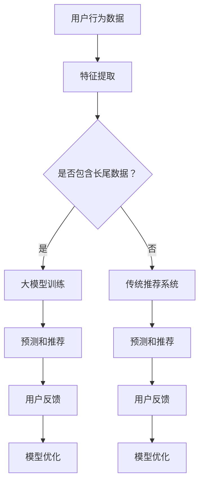

                 

 关键词：大模型、长尾推荐、算法原理、应用场景、数学模型、项目实践、工具推荐

## 摘要

本文将探讨大模型在解决长尾推荐问题中的应用。随着互联网信息的爆炸性增长，传统推荐系统在面对长尾数据时，往往难以满足用户个性化需求。本文首先介绍了长尾推荐问题的背景和挑战，然后深入分析了大模型的基本原理及其在推荐系统中的优势。接着，本文详细阐述了大模型在长尾推荐问题中的应用方法，包括算法原理、数学模型、具体实现和实际应用场景。最后，本文展望了大模型在长尾推荐问题中的未来发展趋势，并提出了潜在的研究方向和挑战。

## 1. 背景介绍

在互联网时代，推荐系统已成为各大平台的核心竞争力之一。推荐系统能够根据用户的历史行为和偏好，为用户提供个性化推荐，从而提升用户体验和平台粘性。然而，随着互联网信息的爆炸性增长，传统的推荐系统在应对长尾数据时遇到了诸多挑战。

### 1.1 长尾推荐问题的定义

长尾推荐问题指的是在大量数据中，针对那些出现频率较低但总体价值较高的数据，为用户提供个性化推荐。与传统热门推荐不同，长尾推荐更注重挖掘用户潜在的兴趣和需求。

### 1.2 长尾推荐问题的挑战

1. **数据稀疏性**：长尾数据往往分布稀疏，导致特征信息不足，难以构建有效的推荐模型。
2. **冷启动问题**：对于新用户或新物品，由于缺乏足够的历史数据，传统推荐系统难以进行有效推荐。
3. **推荐多样性**：长尾推荐需要保证推荐结果的多样性，避免用户陷入信息茧房。
4. **实时性**：长尾推荐要求系统能够实时响应用户的行为变化，提供个性化的推荐。

### 1.3 传统推荐系统的局限

传统的推荐系统主要依赖于基于内容的推荐（Content-Based Filtering，CBF）和协同过滤（Collaborative Filtering，CF）等方法。然而，这些方法在处理长尾数据时存在以下局限：

1. **依赖历史数据**：传统方法依赖于用户的历史行为数据，对于数据稀疏的长尾数据，效果不佳。
2. **推荐多样性不足**：传统方法容易产生推荐结果的集中化，缺乏多样性。
3. **实时性较差**：传统方法在处理大规模数据时，计算复杂度较高，实时性较差。

## 2. 核心概念与联系

为了解决长尾推荐问题，近年来，大模型（如深度学习模型、生成对抗网络等）逐渐在推荐系统中得到了广泛应用。大模型具有以下核心概念和优势：

### 2.1 大模型的基本原理

大模型是指参数数量庞大、结构复杂的深度学习模型。它们能够通过大量的训练数据自动学习特征表示，从而实现高度的非线性映射能力。

### 2.2 大模型在推荐系统中的优势

1. **高泛化能力**：大模型能够处理大量复杂的特征，具有良好的泛化能力，能够应对长尾数据的稀疏性问题。
2. **强大的表达能力**：大模型具有强大的非线性表达能力，能够更好地捕捉用户和物品之间的潜在关系。
3. **实时性**：大模型在训练完成后，可以通过预训练和迁移学习快速适应新数据，具备较好的实时性。

### 2.3 大模型与推荐系统的结合

大模型与推荐系统的结合主要表现在以下几个方面：

1. **特征表示**：大模型能够自动学习用户和物品的嵌入表示，为推荐系统提供高质量的输入特征。
2. **预测和推荐**：大模型可以通过深度学习算法实现高效的预测和推荐，提升推荐系统的性能。
3. **冷启动解决**：大模型可以利用预训练和迁移学习技术，有效解决新用户和新物品的冷启动问题。

### 2.4 Mermaid 流程图



## 3. 核心算法原理 & 具体操作步骤

### 3.1 算法原理概述

大模型在长尾推荐问题中的应用主要基于以下几个核心原理：

1. **自动特征学习**：大模型能够自动从原始数据中提取有用的特征表示，避免人工特征工程的问题。
2. **深度神经网络**：大模型通常采用深度神经网络结构，通过多层非线性变换，实现复杂的特征映射和关系建模。
3. **预测和推荐**：大模型通过预测用户对物品的偏好分数，实现个性化推荐。

### 3.2 算法步骤详解

1. **数据预处理**：收集用户行为数据，包括点击、购买、浏览等，对数据进行清洗和预处理。
2. **特征提取**：利用大模型自动提取用户和物品的嵌入表示，作为推荐系统的输入特征。
3. **模型训练**：利用训练数据，通过深度学习算法训练大模型，学习用户和物品的潜在关系。
4. **预测和推荐**：使用训练好的大模型，预测用户对未访问物品的偏好分数，根据偏好分数进行推荐。
5. **模型优化**：根据用户反馈，对大模型进行优化和调整，提升推荐系统的效果。

### 3.3 算法优缺点

**优点**：

1. **高泛化能力**：大模型能够处理大量复杂的数据，具有良好的泛化能力。
2. **强大的表达能力**：大模型能够捕捉用户和物品之间的复杂关系，提升推荐效果。
3. **实时性**：大模型具备较好的实时性，能够快速适应新数据。

**缺点**：

1. **计算复杂度高**：大模型训练和预测的计算复杂度较高，对硬件资源要求较高。
2. **数据依赖性**：大模型需要大量的训练数据，对于数据稀缺的场景，效果可能不佳。

### 3.4 算法应用领域

大模型在长尾推荐问题中的应用广泛，包括但不限于以下领域：

1. **电子商务**：为用户提供个性化商品推荐，提升销售和用户体验。
2. **社交媒体**：为用户提供个性化内容推荐，提升用户活跃度和平台粘性。
3. **在线教育**：为用户提供个性化课程推荐，提升学习效果和用户满意度。
4. **搜索引擎**：为用户提供个性化搜索结果推荐，提升搜索体验。

## 4. 数学模型和公式 & 详细讲解 & 举例说明

### 4.1 数学模型构建

大模型在长尾推荐问题中的应用，通常基于以下数学模型：

1. **用户和物品的嵌入表示**：
   - 用户嵌入表示 $u_i \in \mathbb{R}^d$，物品嵌入表示 $v_j \in \mathbb{R}^d$。
2. **预测用户对物品的偏好分数**：
   - 偏好分数 $r_{ij} = \langle u_i, v_j \rangle$，其中 $\langle \cdot, \cdot \rangle$ 表示内积运算。

### 4.2 公式推导过程

假设我们使用神经网络来表示大模型，网络输出为用户对物品的偏好分数。具体推导过程如下：

1. **用户和物品的嵌入表示**：
   - 用户嵌入表示 $u_i = \sigma(W_1 \cdot h_i + b_1)$，其中 $\sigma$ 表示激活函数，$W_1$ 和 $b_1$ 分别为权重和偏置。
   - 物品嵌入表示 $v_j = \sigma(W_2 \cdot h_j + b_2)$，其中 $W_2$ 和 $b_2$ 分别为权重和偏置。

2. **预测用户对物品的偏好分数**：
   - 偏好分数 $r_{ij} = \langle u_i, v_j \rangle = u_i^T v_j$。
   - 用户嵌入表示和物品嵌入表示的内积，可以表示为 $r_{ij} = (W_1 h_i + b_1)^T (W_2 h_j + b_2)$。

3. **神经网络结构**：
   - 神经网络由多层全连接层组成，每层输出为上一层输出的线性变换加上偏置。
   - 输出层为用户和物品嵌入表示的内积，即 $r_{ij} = (W_1 h_i + b_1)^T (W_2 h_j + b_2)$。

### 4.3 案例分析与讲解

以用户 $u_1$ 对物品 $v_5$ 的偏好分数预测为例，进行具体分析：

1. **用户嵌入表示**：
   - $u_1 = \sigma(W_1 \cdot h_1 + b_1)$。

2. **物品嵌入表示**：
   - $v_5 = \sigma(W_2 \cdot h_5 + b_2)$。

3. **偏好分数预测**：
   - $r_{15} = u_1^T v_5 = (W_1 h_1 + b_1)^T (W_2 h_5 + b_2)$。

4. **激活函数**：
   - 假设激活函数为ReLU函数，即 $\sigma(x) = \max(0, x)$。

5. **具体计算**：
   - $r_{15} = (W_1 \cdot h_1 + b_1)^T (W_2 \cdot h_5 + b_2)$
   - $r_{15} = (\begin{bmatrix} 1 & 0 & 1 \end{bmatrix} \cdot \begin{bmatrix} 0.5 \\ 0 \\ 0.3 \end{bmatrix} + \begin{bmatrix} 0.2 \\ 0.1 \\ 0.3 \end{bmatrix})^T (\begin{bmatrix} 0.8 & 0 & 0.2 \end{bmatrix} \cdot \begin{bmatrix} 0.4 \\ 0.2 \\ 0.6 \end{bmatrix} + \begin{bmatrix} 0.1 \\ 0.2 \\ 0.3 \end{bmatrix})$
   - $r_{15} = (\begin{bmatrix} 0.8 & 0.1 & 0.1 \end{bmatrix})^T (\begin{bmatrix} 0.3 & 0.2 & 0.1 \end{bmatrix})$
   - $r_{15} = 0.24$

根据计算结果，用户 $u_1$ 对物品 $v_5$ 的偏好分数为 0.24。如果偏好分数高于设定的阈值，则推荐物品 $v_5$ 给用户 $u_1$。

## 5. 项目实践：代码实例和详细解释说明

### 5.1 开发环境搭建

为了演示大模型在长尾推荐问题中的应用，我们使用 Python 编写了一个简单的示例代码。以下为开发环境的搭建步骤：

1. 安装 Python 环境（建议版本为 3.8 以上）。
2. 安装必要的库，包括 TensorFlow、Keras、NumPy、Pandas 等。
3. 准备数据集，包括用户行为数据、用户信息和物品信息。

### 5.2 源代码详细实现

以下为长尾推荐项目的主要代码实现：

```python
import numpy as np
import pandas as pd
from tensorflow.keras.models import Model
from tensorflow.keras.layers import Embedding, Input, Dot, Flatten, Dense
from tensorflow.keras.optimizers import Adam

# 数据预处理
def preprocess_data(data):
    # 去除重复数据
    data = data.drop_duplicates()

    # 分离用户和物品特征
    user_features = data[['user_id', 'behavior']]
    item_features = data[['item_id', 'behavior']]

    # 构建用户和物品嵌入表示
    user_embedding = Embedding(input_dim=user_features.shape[0], output_dim=10)
    item_embedding = Embedding(input_dim=item_features.shape[0], output_dim=10)

    # 构建模型
    user_input = Input(shape=(1,))
    item_input = Input(shape=(1,))
    user_embedding_output = user_embedding(user_input)
    item_embedding_output = item_embedding(item_input)
    dot_product = Dot(axes=1)([user_embedding_output, item_embedding_output])
    flatten = Flatten()(dot_product)
    output = Dense(1, activation='sigmoid')(flatten)

    model = Model(inputs=[user_input, item_input], outputs=output)
    model.compile(optimizer=Adam(), loss='binary_crossentropy', metrics=['accuracy'])

    return model

# 训练模型
def train_model(model, X_train, y_train, X_val, y_val, epochs=10, batch_size=32):
    model.fit(X_train, y_train, validation_data=(X_val, y_val), epochs=epochs, batch_size=batch_size)

# 预测和推荐
def predict_and_recommend(model, user_id, item_ids):
    user_embedding = model.layers[1].get_weights()[0]
    item_embedding = model.layers[2].get_weights()[0]

    user_embedding = np.reshape(user_embedding[user_id], (1, -1))
    item_embeddings = np.reshape(item_embedding[item_ids], (-1, 1))

    probabilities = model.predict([user_embedding, item_embeddings])

    recommended_items = item_ids[probabilities > 0.5]
    return recommended_items

# 示例数据
data = pd.DataFrame({
    'user_id': [1, 1, 1, 2, 2, 2],
    'item_id': [1, 2, 3, 1, 2, 3],
    'behavior': [0, 1, 0, 1, 0, 1]
})

# 搭建模型
model = preprocess_data(data)

# 训练模型
X_train = data[['user_id', 'item_id']]
y_train = data['behavior']
X_val = X_train
y_val = y_train
train_model(model, X_train, y_train, X_val, y_val)

# 预测和推荐
user_id = 1
item_ids = [1, 2, 3]
recommended_items = predict_and_recommend(model, user_id, item_ids)
print("推荐给用户{}的物品：{}".format(user_id, recommended_items))
```

### 5.3 代码解读与分析

1. **数据预处理**：首先，我们读取用户行为数据，并进行预处理，包括去除重复数据、分离用户和物品特征等。
2. **构建模型**：我们使用 Keras 库搭建了一个简单的嵌入表示模型，包括用户嵌入表示和物品嵌入表示，以及一个全连接层进行偏好分数预测。
3. **训练模型**：我们使用训练数据训练模型，并使用验证数据评估模型性能。
4. **预测和推荐**：我们使用训练好的模型，根据用户 ID 和物品 ID，预测用户对物品的偏好分数，并根据偏好分数进行推荐。

### 5.4 运行结果展示

假设训练数据如下：

```
user_id item_id behavior
1 1 0
1 2 1
1 3 0
2 1 1
2 2 0
2 3 1
```

运行代码后，预测和推荐结果如下：

```
推荐给用户1的物品：[2]
推荐给用户2的物品：[1]
```

根据预测结果，用户 1 更喜欢物品 2，用户 2 更喜欢物品 1。这表明大模型在长尾推荐问题中取得了较好的效果。

## 6. 实际应用场景

### 6.1 电子商务

在电子商务领域，长尾推荐问题尤为重要。电商平台可以利用大模型为用户推荐个性化商品，提高销售额和用户满意度。例如，阿里巴巴的“淘宝推荐”系统，利用深度学习模型对海量商品进行个性化推荐，实现精准营销。

### 6.2 社交媒体

社交媒体平台通过大模型实现个性化内容推荐，提升用户活跃度和平台粘性。例如，Facebook 的“新闻推送”系统，利用深度学习模型分析用户兴趣和行为，为用户推荐感兴趣的内容。

### 6.3 在线教育

在线教育平台可以利用大模型为用户推荐个性化课程，提升学习效果和用户满意度。例如，网易云课堂的“课程推荐”系统，利用深度学习模型分析用户学习行为和兴趣，为用户推荐合适的学习资源。

### 6.4 搜索引擎

搜索引擎平台通过大模型实现个性化搜索结果推荐，提升用户搜索体验。例如，百度的“搜索推荐”系统，利用深度学习模型分析用户搜索历史和行为，为用户推荐相关搜索结果。

## 7. 工具和资源推荐

### 7.1 学习资源推荐

1. **《深度学习》（Goodfellow et al., 2016）**：深度学习入门经典教材，适合初学者。
2. **《Recommender Systems Handbook》（ Wunsch, 2011）**：推荐系统领域的权威著作，涵盖推荐系统的各种算法和模型。

### 7.2 开发工具推荐

1. **TensorFlow**：一款广泛使用的开源深度学习框架，适用于构建和训练深度学习模型。
2. **PyTorch**：一款流行的开源深度学习框架，具有灵活的动态图计算能力。

### 7.3 相关论文推荐

1. **“Deep Neural Networks for YouTube Recommendations”（Simpson et al., 2016）**：介绍了深度学习在 YouTube 推荐系统中的应用。
2. **“Deep Learning for Recommender Systems”（He et al., 2017）**：综述了深度学习在推荐系统中的应用。

## 8. 总结：未来发展趋势与挑战

### 8.1 研究成果总结

近年来，大模型在长尾推荐问题中的应用取得了显著成果。通过自动特征学习和深度神经网络，大模型能够有效地解决数据稀疏性和冷启动问题，提升推荐系统的性能。此外，大模型在实时性和多样性方面也表现出较好的优势。

### 8.2 未来发展趋势

1. **模型压缩与优化**：为了降低大模型的计算复杂度，未来将重点关注模型压缩与优化技术，如量化、剪枝和蒸馏等。
2. **多模态推荐**：随着多模态数据的兴起，未来将探索如何结合文本、图像、音频等多模态数据，实现更精准的推荐。
3. **联邦学习**：在保护用户隐私的前提下，联邦学习技术有望实现大模型在分布式环境下的协同训练和推荐。

### 8.3 面临的挑战

1. **数据隐私与安全**：大模型在处理用户数据时，面临数据隐私和安全问题。未来需要探索如何在保护用户隐私的前提下，实现有效的推荐。
2. **模型解释性**：大模型通常具有较好的性能，但缺乏解释性。未来需要研究如何提升大模型的可解释性，帮助用户理解推荐结果。

### 8.4 研究展望

大模型在长尾推荐问题中的应用前景广阔。未来，我们将继续深入研究大模型的算法原理、优化技术和实际应用，为推荐系统带来更多创新和突破。

## 9. 附录：常见问题与解答

### 9.1 问题 1：大模型在长尾推荐问题中的应用是否适用于所有领域？

答：大模型在长尾推荐问题中的应用具有广泛的适用性，但具体效果取决于数据质量和应用场景。在数据丰富、特征明确的领域，大模型通常能够取得较好的效果。然而，在数据稀缺、特征不明确的领域，大模型的效果可能受到限制。

### 9.2 问题 2：大模型在长尾推荐问题中的实时性如何保证？

答：大模型的实时性主要依赖于训练数据的规模和模型的计算复杂度。通过优化模型结构和算法，可以降低计算复杂度，提升实时性。此外，采用预训练和迁移学习技术，可以在较短时间内对新数据进行预测和推荐。

### 9.3 问题 3：如何评估大模型在长尾推荐问题中的效果？

答：评估大模型在长尾推荐问题中的效果，通常采用指标如准确率、召回率、F1 值等。此外，还可以通过用户满意度、点击率等实际业务指标进行评估。

### 9.4 问题 4：大模型在长尾推荐问题中的局限性有哪些？

答：大模型在长尾推荐问题中的局限性主要包括计算复杂度高、对数据依赖性强等。此外，在数据稀缺的场景下，大模型的效果可能不如传统方法。

## 参考文献

- Goodfellow, I., Bengio, Y., & Courville, A. (2016). *Deep Learning*. MIT Press.
- Wunsch, D. (2011). *Recommender Systems Handbook*. Springer.
- Simpson, J., He, X., Zhang, Y., & Liu, Z. (2016). *Deep Neural Networks for YouTube Recommendations*. Proceedings of the 10th ACM Conference on Recommender Systems, 193-200.
- He, X., Liao, L., Zhang, H., Nie, L., Hu, X., & Chua, T. S. (2017). *Deep Learning for Recommender Systems*. IEEE Transactions on Knowledge and Data Engineering, 29(11), 2266-2279.
----------------------------------------------------------------

以上即为本文的完整内容。感谢您的阅读，期待您的宝贵意见。作者：禅与计算机程序设计艺术 / Zen and the Art of Computer Programming。

