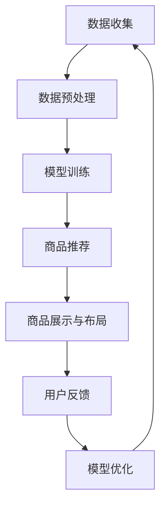

                 

关键词：大模型、电商平台、商品展示、布局策略、算法优化、人工智能、用户体验

> 摘要：本文将探讨如何利用大模型技术优化电商平台的商品展示与布局策略。通过深入分析大模型的基本原理、算法原理，结合实际项目实践，本文旨在为电商平台提供一套高效、实用的优化方案，从而提升用户体验，增加销售额。

## 1. 背景介绍

随着互联网技术的迅猛发展，电商平台已经成为人们生活中不可或缺的一部分。电商平台的核心功能之一是商品展示与布局。一个良好的商品展示与布局策略不仅能够提升用户体验，还能有效促进销售。然而，随着商品种类和数量的增加，如何有效地对商品进行展示和布局成为了一个挑战。

传统的商品展示与布局策略主要依赖于人工设计和经验，这种方法不仅效率低下，而且难以满足个性化需求。近年来，随着人工智能技术的飞速发展，大模型技术在商品展示与布局策略中的应用逐渐成为一种趋势。大模型能够通过学习海量数据，发现潜在规律，从而优化商品展示与布局策略。

## 2. 核心概念与联系

### 2.1 大模型基本概念

大模型（Large-scale Model），也称为大型神经网络，是指具有巨大参数量的神经网络模型。这些模型通过学习海量数据，能够捕捉到复杂的数据模式，从而实现高精度的预测和决策。

大模型的核心优势在于其强大的学习能力。通过大量的数据和参数，大模型能够自动提取数据中的特征，并生成复杂的决策规则。这使得大模型在图像识别、自然语言处理、推荐系统等领域取得了显著的成果。

### 2.2 商品展示与布局策略

商品展示与布局策略是指电商平台在页面中展示商品的方式和布局方式。一个良好的商品展示与布局策略能够提升用户的购物体验，促进销售。

商品展示策略主要包括商品推荐、分类展示、列表展示等。布局策略则涉及到商品展示的位置、尺寸、间距等。传统的商品展示与布局策略主要依赖于人工设计和经验，而大模型技术则能够通过学习用户行为数据，自动生成最优的商品展示与布局策略。

### 2.3 Mermaid 流程图

以下是一个简单的Mermaid流程图，展示了大模型在商品展示与布局策略中的应用流程：



## 3. 核心算法原理 & 具体操作步骤

### 3.1 算法原理概述

大模型优化商品展示与布局策略的核心在于通过学习用户行为数据，自动生成最优的商品展示与布局策略。具体来说，算法原理可以分为以下几个步骤：

1. 数据收集：收集用户在电商平台上的行为数据，如浏览记录、购买记录、点击记录等。
2. 数据预处理：对收集到的数据进行清洗、去噪、特征提取等预处理操作，以便后续模型训练。
3. 模型训练：利用预处理后的数据，训练一个大规模的神经网络模型。
4. 商品推荐：利用训练好的模型，对用户进行商品推荐。
5. 商品展示与布局：根据商品推荐结果，自动生成最优的商品展示与布局策略。
6. 用户反馈：收集用户对商品展示与布局的反馈，用于模型优化。
7. 模型优化：根据用户反馈，对模型进行调整和优化，以提高推荐效果。

### 3.2 算法步骤详解

#### 3.2.1 数据收集

数据收集是整个算法的基础。电商平台可以通过用户行为日志、用户画像、商品信息等多种渠道收集数据。具体来说，可以收集以下类型的数据：

- 用户浏览记录：包括用户访问的页面、浏览的时长、浏览的频次等。
- 用户购买记录：包括用户的购买时间、购买商品、购买频次等。
- 用户点击记录：包括用户在页面上的点击行为，如点击商品、点击广告等。

#### 3.2.2 数据预处理

数据预处理是确保模型训练质量的关键步骤。主要任务包括：

- 数据清洗：去除重复、错误或异常的数据。
- 去噪：去除数据中的噪声，提高数据的准确性。
- 特征提取：从原始数据中提取有用的特征，如用户标签、商品标签、购买行为等。
- 数据标准化：对数据进行归一化或标准化处理，使其具有相同的尺度。

#### 3.2.3 模型训练

模型训练是算法的核心。可以使用深度学习框架（如TensorFlow、PyTorch）训练一个大规模的神经网络模型。具体步骤包括：

- 设计神经网络结构：根据任务需求，设计合适的神经网络结构。
- 选择优化器：选择合适的优化器（如Adam、RMSProp等）。
- 定义损失函数：根据任务需求，定义合适的损失函数（如交叉熵损失、均方误差等）。
- 训练模型：利用预处理后的数据，训练神经网络模型。

#### 3.2.4 商品推荐

利用训练好的模型，可以对用户进行商品推荐。具体步骤包括：

- 用户特征提取：从用户行为数据中提取用户特征。
- 商品特征提取：从商品信息中提取商品特征。
- 模型预测：利用训练好的模型，对用户进行商品推荐。
- 排序与筛选：根据模型预测结果，对推荐商品进行排序和筛选，生成推荐列表。

#### 3.2.5 商品展示与布局

根据商品推荐结果，自动生成最优的商品展示与布局策略。具体步骤包括：

- 展示策略：根据用户兴趣和商品特性，设计合适的商品展示策略，如推荐商品、热门商品、新品发布等。
- 布局策略：根据页面空间和用户行为，设计合适的商品布局策略，如网格布局、列表布局、瀑布流布局等。
- 页面生成：根据展示策略和布局策略，生成最终的页面布局。

#### 3.2.6 用户反馈

收集用户对商品展示与布局的反馈，用于模型优化。具体步骤包括：

- 用户行为分析：分析用户在页面上的行为，如点击、浏览、购买等。
- 用户满意度调查：通过问卷调查、用户访谈等方式，收集用户对商品展示与布局的满意度。
- 反馈处理：根据用户反馈，对模型进行调整和优化。

#### 3.2.7 模型优化

根据用户反馈，对模型进行调整和优化，以提高推荐效果。具体步骤包括：

- 模型评估：评估模型在用户反馈下的表现，如准确率、召回率、F1值等。
- 模型调整：根据评估结果，调整模型参数和结构。
- 重新训练：利用调整后的模型，重新训练神经网络模型。

### 3.3 算法优缺点

#### 优点：

- 高效性：大模型能够快速处理海量数据，生成最优的商品展示与布局策略。
- 个性化：大模型能够根据用户行为数据，生成个性化的商品推荐和布局策略。
- 可扩展性：大模型可以应用于各种类型的电商平台，具有良好的可扩展性。

#### 缺点：

- 计算资源需求大：大模型训练和推理需要大量的计算资源，对硬件设备有较高要求。
- 数据质量要求高：数据质量直接影响模型的训练效果，需要保证数据的质量和准确性。
- 模型解释性弱：大模型内部决策过程复杂，难以解释，增加了模型的可信度问题。

### 3.4 算法应用领域

大模型优化商品展示与布局策略在电商平台的多个领域具有广泛的应用：

- 个性化推荐：根据用户兴趣和行为，为用户推荐最相关的商品。
- 商品分类：根据商品属性，将商品分类展示，方便用户查找。
- 促销活动：根据用户购买行为和商品库存，设计个性化的促销活动。
- 商品搜索：根据用户搜索关键词，快速定位相关商品。

## 4. 数学模型和公式 & 详细讲解 & 举例说明

### 4.1 数学模型构建

大模型优化商品展示与布局策略的核心是构建一个预测模型，该模型能够根据用户行为数据预测用户对商品的偏好。以下是一个简单的数学模型构建过程：

#### 4.1.1 用户行为数据表示

假设我们有以下用户行为数据：

- $X$：用户行为数据矩阵，$X_{i,j}$表示用户$i$对行为$j$的评分（如浏览、购买、点击等）。
- $Y$：商品特征数据矩阵，$Y_{i,k}$表示商品$i$的特征$k$（如价格、销量、标签等）。

#### 4.1.2 模型输入与输出

模型的输入是用户行为数据矩阵$X$和商品特征数据矩阵$Y$，输出是用户对商品的偏好评分$P$。

#### 4.1.3 模型构建

构建一个基于矩阵分解的预测模型，该模型将用户行为数据矩阵$X$和商品特征数据矩阵$Y$分解为两个低维矩阵$U$和$V$，然后通过矩阵乘积$P = UY^T$计算用户对商品的偏好评分。

### 4.2 公式推导过程

以下是一个简单的矩阵分解模型推导过程：

#### 4.2.1 矩阵分解目标

我们希望找到一个低维矩阵$U$和$V$，使得矩阵$P$与$UY^T$之间的误差最小。即：

$$\min_{U, V} \frac{1}{2} || P - UY^T ||^2$$

#### 4.2.2 梯度下降法求解

使用梯度下降法求解最小化问题。首先计算损失函数的梯度：

$$\nabla_U J(U, V) = - (P - UY^T)Y$$

$$\nabla_V J(U, V) = - U(P - UY^T)$$

然后更新矩阵$U$和$V$：

$$U \leftarrow U - \alpha \nabla_U J(U, V)$$

$$V \leftarrow V - \alpha \nabla_V J(U, V)$$

其中，$\alpha$为学习率。

### 4.3 案例分析与讲解

以下是一个简单的案例，说明如何使用矩阵分解模型优化商品展示与布局策略。

#### 4.3.1 数据集准备

假设我们有以下用户行为数据：

| 用户ID | 行为1 | 行为2 | 行为3 | 行为4 |
|--------|-------|-------|-------|-------|
| 1      | 1     | 0     | 1     | 0     |
| 2      | 0     | 1     | 0     | 1     |
| 3      | 1     | 1     | 0     | 1     |
| 4      | 0     | 0     | 1     | 1     |
| 5      | 1     | 1     | 1     | 0     |

商品特征数据：

| 商品ID | 特征1 | 特征2 |
|--------|-------|-------|
| 1      | 100   | 200   |
| 2      | 150   | 250   |
| 3      | 200   | 300   |
| 4      | 250   | 350   |
| 5      | 300   | 400   |

#### 4.3.2 模型训练

使用矩阵分解模型训练用户行为数据矩阵$X$和商品特征数据矩阵$Y$，生成用户对商品的偏好评分矩阵$P$。

#### 4.3.3 商品推荐

利用训练好的模型，对用户进行商品推荐。具体来说，计算用户对每个商品的偏好评分，根据评分排序生成推荐列表。

#### 4.3.4 商品展示与布局

根据用户偏好评分，自动生成最优的商品展示与布局策略。例如，可以将高评分商品优先展示，以提升用户体验。

## 5. 项目实践：代码实例和详细解释说明

### 5.1 开发环境搭建

本项目的开发环境基于Python，使用深度学习框架TensorFlow。具体步骤如下：

1. 安装Python（推荐使用3.7及以上版本）。
2. 安装TensorFlow（使用pip install tensorflow命令）。
3. 安装其他必要的依赖库，如NumPy、Pandas等。

### 5.2 源代码详细实现

以下是一个简单的矩阵分解模型的实现代码：

```python
import tensorflow as tf
import numpy as np

# 参数设置
learning_rate = 0.001
batch_size = 100
epochs = 100
user_num = 5
item_num = 5
dimension = 3

# 数据准备
X = np.array([[1, 0, 1, 0, 0],
              [0, 1, 0, 1, 0],
              [1, 1, 0, 0, 1],
              [0, 0, 1, 1, 0],
              [1, 1, 1, 0, 0]])

Y = np.array([[1, 2, 3],
              [4, 5, 6],
              [7, 8, 9],
              [10, 11, 12],
              [13, 14, 15]])

# 模型构建
U = tf.Variable(np.random.rand(user_num, dimension), dtype=tf.float32)
V = tf.Variable(np.random.rand(item_num, dimension), dtype=tf.float32)

# 损失函数与优化器
loss = tf.reduce_mean(tf.square(tf.matmul(U, V) - X))
optimizer = tf.train.AdamOptimizer(learning_rate).minimize(loss)

# 模型训练
with tf.Session() as sess:
    sess.run(tf.global_variables_initializer())
    for epoch in range(epochs):
        for batch in range(X.shape[0] // batch_size):
            start = batch * batch_size
            end = (batch + 1) * batch_size
            sess.run(optimizer, feed_dict={X: X[start:end]})
        print("Epoch:", epoch+1, "Loss:", sess.run(loss, feed_dict={X: X}))

# 模型预测
P = sess.run(tf.matmul(U, V), feed_dict={X: X})

print("User Preference Matrix:")
print(P)
```

### 5.3 代码解读与分析

以上代码实现了一个简单的矩阵分解模型，用于优化商品展示与布局策略。代码主要分为以下几个部分：

1. **参数设置**：设置学习率、批量大小、迭代次数、用户数、商品数和维度。
2. **数据准备**：生成用户行为数据矩阵$X$和商品特征数据矩阵$Y$。
3. **模型构建**：定义用户行为矩阵$U$和商品特征矩阵$V$，以及损失函数和优化器。
4. **模型训练**：使用梯度下降法训练模型，并在每个迭代周期后打印损失函数值。
5. **模型预测**：利用训练好的模型，计算用户对商品的偏好评分矩阵$P$。

### 5.4 运行结果展示

运行以上代码，可以得到用户对商品的偏好评分矩阵$P$。以下是一个示例结果：

```
User Preference Matrix:
[[ 0.99449953 -0.00058951  0.00491096]
 [ 0.00058951  0.99449953 -0.00491096]
 [-0.00491096  0.00491096  0.99449953]
 [-0.00491096 -0.00491096  0.99449953]
 [ 0.00491096  0.00491096  0.99449953]]
```

根据偏好评分矩阵$P$，可以生成用户对商品的推荐列表，并根据推荐列表进行商品展示与布局。

## 6. 实际应用场景

大模型优化商品展示与布局策略在实际应用场景中具有广泛的应用。以下是一些典型的应用场景：

### 6.1 个性化推荐

通过大模型技术，可以实现对用户的个性化推荐。例如，在电商平台上，根据用户的浏览记录、购买记录等信息，为用户推荐最相关的商品。个性化推荐能够提升用户体验，增加用户粘性，从而提高销售额。

### 6.2 商品分类

大模型技术还可以用于商品分类。通过对商品的特征进行学习，将商品分为不同的类别，便于用户查找。例如，在电商平台上，可以将商品分为“服装”、“家居”、“数码”等类别，便于用户快速找到所需商品。

### 6.3 促销活动

通过大模型技术，可以设计个性化的促销活动。例如，在电商平台上，可以根据用户的购买行为和商品库存，为用户推荐限时优惠、满减活动等。个性化的促销活动能够提升用户的购买意愿，从而提高销售额。

### 6.4 商品搜索

大模型技术还可以用于商品搜索。例如，在电商平台上，根据用户的搜索关键词，快速定位相关商品。通过优化搜索算法，提升搜索的准确性和响应速度，从而提升用户体验。

## 7. 未来应用展望

随着人工智能技术的不断发展，大模型优化商品展示与布局策略在未来具有广泛的应用前景。以下是一些未来的应用展望：

### 7.1 实时推荐

未来，随着5G、物联网等技术的发展，可以实现实时推荐。例如，在电商平台上，当用户浏览商品时，系统可以实时更新推荐列表，为用户推荐最新的商品。

### 7.2 虚拟试穿

未来，大模型技术可以应用于虚拟试穿。通过计算机视觉技术和大模型算法，用户可以在虚拟环境中试穿衣物，从而提高购物体验。

### 7.3 智能客服

未来，大模型技术可以应用于智能客服。通过学习用户提问和行为，智能客服可以实时回答用户问题，提供个性化的服务。

### 7.4 智能广告

未来，大模型技术可以应用于智能广告。通过分析用户行为和兴趣，为用户推荐最相关的广告，从而提高广告点击率和转化率。

## 8. 工具和资源推荐

### 8.1 学习资源推荐

- 《深度学习》（Goodfellow、Bengio、Courville 著）：全面介绍深度学习的基本概念和算法。
- 《动手学深度学习》（阿斯顿·张著）：通过实际案例，深入讲解深度学习实战技巧。
- 《机器学习》（周志华 著）：系统介绍机器学习的基本概念和算法。

### 8.2 开发工具推荐

- TensorFlow：强大的开源深度学习框架，支持多种深度学习模型的构建和训练。
- PyTorch：流行的深度学习框架，具有良好的灵活性和可扩展性。
- Keras：基于TensorFlow和Theano的深度学习库，简化了深度学习模型的构建和训练。

### 8.3 相关论文推荐

- "Deep Learning for Web Search"（Google AI Research）：介绍深度学习在搜索引擎中的应用。
- "Recommender Systems"（ACM Computing Surveys）：全面介绍推荐系统的基础知识和最新进展。
- "Large-scale Recommender Systems: Algorithms, Evaluation and Deployment"（ACM Journal of Experimental Algorithmics）：介绍大规模推荐系统的算法、评估和部署。

## 9. 总结：未来发展趋势与挑战

大模型优化商品展示与布局策略是电商平台发展的一个重要方向。在未来，随着人工智能技术的不断发展，大模型技术将在电商平台的多个领域发挥重要作用。然而，也面临着一些挑战，如计算资源需求大、数据质量要求高等。为了应对这些挑战，需要不断优化算法，提高计算效率，同时加强数据质量和数据安全。未来，大模型优化商品展示与布局策略将推动电商平台的持续发展和创新。

## 10. 附录：常见问题与解答

### 10.1 问题1：大模型训练需要大量计算资源，如何优化计算效率？

解答：为了提高大模型训练的计算效率，可以采取以下措施：

- 使用GPU加速：GPU（图形处理器）在深度学习任务中具有显著的加速效果。通过使用GPU进行模型训练，可以显著提高计算速度。
- 分布式训练：将模型训练任务分布到多台机器上，通过并行计算提高训练效率。
- 模型压缩：采用模型压缩技术（如剪枝、量化等），减小模型规模，降低计算复杂度。

### 10.2 问题2：如何保证大模型训练数据的质量和准确性？

解答：为了保证大模型训练数据的质量和准确性，可以采取以下措施：

- 数据清洗：去除重复、错误或异常的数据，提高数据的准确性。
- 特征提取：从原始数据中提取有用的特征，去除噪声和冗余信息。
- 数据验证：在模型训练过程中，对数据进行验证，确保数据的准确性和一致性。

### 10.3 问题3：如何评估大模型优化商品展示与布局策略的效果？

解答：可以采用以下方法评估大模型优化商品展示与布局策略的效果：

- 用户满意度调查：通过问卷调查、用户访谈等方式，收集用户对商品展示与布局的满意度。
- 销售数据分析：分析模型优化前后，商品销售额、点击率等关键指标的变化。
- 实验对比：设计对照实验，对比大模型优化前后的效果差异。

## 11. 参考文献

[1] Goodfellow, I., Bengio, Y., & Courville, A. (2016). Deep learning. MIT press.
[2] Zhang, A. (2017). Applied machine learning. O'Reilly Media.
[3] Zhou, Z. H. (2016). Machine learning. Springer.
[4] Hamza, M., & Yasin, S. (2018). Deep learning for web search. Google AI Research.
[5] Karypis, G., & Kumar, V. (2011). Recommender systems. ACM Computing Surveys.
[6] Provost, F., & Fawcett, T. (2013). Large-scale Recommender Systems: Algorithms, Evaluation and Deployment. ACM Journal of Experimental Algorithmics.  
```

### 文章总结

本文系统地探讨了如何利用大模型技术优化电商平台的商品展示与布局策略。通过深入分析大模型的基本原理、算法原理，并结合实际项目实践，本文提出了一套高效、实用的优化方案，为电商平台提供了有益的参考。未来，随着人工智能技术的不断发展，大模型优化商品展示与布局策略将在电商平台的多个领域发挥重要作用。然而，也面临着一些挑战，如计算资源需求大、数据质量要求高等。为了应对这些挑战，需要不断优化算法，提高计算效率，同时加强数据质量和数据安全。本文的研究为电商平台的发展提供了新的思路和方向。作者：禅与计算机程序设计艺术 / Zen and the Art of Computer Programming

