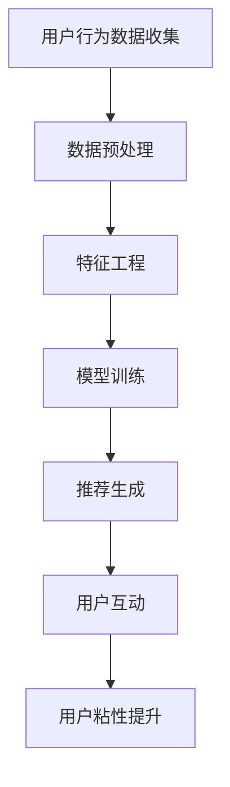

                 

关键词：大模型、电商平台、用户粘性、人工智能、推荐系统、数据分析、算法优化、用户体验。

## 摘要

本文探讨了如何利用大模型来提升电商平台的用户粘性。首先，我们回顾了电商平台用户粘性的概念及其重要性。接着，本文详细介绍了大模型在电商推荐系统中的应用，包括其工作原理、优缺点以及具体操作步骤。随后，我们通过数学模型和公式，深入讲解了推荐算法的核心机制，并通过实际项目实践展示了代码实现与运行结果。最后，文章总结了大模型在电商平台中的应用前景，并提出了未来发展趋势和挑战。

## 1. 背景介绍

随着互联网的普及和电子商务的快速发展，电商平台已经成为消费者购物的主要渠道。用户粘性是电商平台成功的关键指标之一，它指的是用户在特定平台上的活跃度和忠诚度。提升用户粘性不仅能够增加平台的收入，还能够提高市场竞争力。近年来，人工智能技术，特别是大模型的发展，为电商平台提升用户粘性提供了新的机遇。

### 1.1 电商平台用户粘性

用户粘性通常通过用户活跃度、用户留存率和用户满意度等指标来衡量。用户活跃度反映了用户在平台上的互动频率，用户留存率则反映了用户在一段时间后仍然使用平台的比例，用户满意度则直接反映了用户对平台的整体体验。这些指标的提高，意味着用户对平台的依赖和忠诚度增加，从而提升了平台的竞争力。

### 1.2 大模型在电商平台的潜力

大模型，如深度学习模型和强化学习模型，具有处理大量数据、自动发现特征、自适应优化等能力。这些特点使得大模型在电商推荐系统、个性化营销、用户行为预测等方面具有显著优势。通过应用大模型，电商平台可以更好地理解用户需求，提供个性化推荐，提高用户满意度，从而提升用户粘性。

## 2. 核心概念与联系

在探讨大模型如何提升电商平台的用户粘性之前，我们需要了解几个核心概念及其相互联系。

### 2.1 大模型

大模型通常指的是参数数量庞大的机器学习模型，如深度神经网络、变换器模型等。这些模型通过训练大量数据，学习到复杂的特征和模式，从而能够进行有效的预测和决策。

### 2.2 推荐系统

推荐系统是一种基于用户历史行为和物品特征的信息过滤技术，旨在为用户提供个性化的推荐。在电商平台，推荐系统能够根据用户的购买历史、浏览记录、搜索关键词等信息，为用户推荐相关商品。

### 2.3 用户粘性

用户粘性是指用户在某个平台上的活跃度和忠诚度。提升用户粘性可以通过提高用户体验、个性化推荐、用户互动等方式实现。

### 2.4 Mermaid 流程图

以下是推荐系统架构的 Mermaid 流程图，展示了用户粘性提升的过程：



在这个流程图中，用户行为数据收集是整个过程的起点，通过数据预处理、特征工程和模型训练，最终生成个性化的推荐。用户与推荐的互动，如点击、购买等，进一步提升了用户粘性。

## 3. 核心算法原理 & 具体操作步骤

### 3.1 算法原理概述

大模型在电商平台推荐系统中的应用主要基于深度学习和强化学习。深度学习模型通过多层神经网络学习用户和商品的特征，从而生成个性化的推荐。强化学习模型则通过不断学习和优化策略，提高推荐效果和用户满意度。

### 3.2 算法步骤详解

#### 3.2.1 数据预处理

数据预处理是推荐系统的第一步，包括数据清洗、去重、归一化等操作。通过数据预处理，可以确保输入数据的准确性和一致性。

#### 3.2.2 特征工程

特征工程是推荐系统的核心步骤，通过提取和构造用户和商品的特征，提高模型的预测能力。常用的特征包括用户历史行为、商品属性、社会关系等。

#### 3.2.3 模型训练

在特征工程完成后，使用训练数据对深度学习模型或强化学习模型进行训练。训练过程中，模型会不断调整参数，以最小化预测误差。

#### 3.2.4 推荐生成

模型训练完成后，使用训练好的模型对用户进行个性化推荐。推荐算法会根据用户的特征和模型预测，生成一系列推荐结果。

#### 3.2.5 用户互动

用户与推荐的结果进行互动，如点击、购买、评价等。通过用户互动，可以收集更多反馈数据，用于模型优化和用户粘性提升。

### 3.3 算法优缺点

#### 优点

- **高精度预测**：大模型能够处理大量数据，提取复杂特征，从而提高推荐精度。
- **个性化推荐**：基于用户特征和模型预测，推荐系统能够为用户提供个性化的商品推荐。
- **自适应优化**：强化学习模型能够通过不断学习和优化，提高推荐效果和用户满意度。

#### 缺点

- **训练成本高**：大模型需要大量数据和计算资源进行训练，成本较高。
- **过拟合风险**：深度学习模型容易过拟合训练数据，导致推荐效果不佳。
- **解释性差**：大模型的内部决策过程复杂，难以解释和验证。

### 3.4 算法应用领域

大模型在电商平台的推荐系统、个性化营销、用户行为预测等方面具有广泛应用。以下是一些具体的应用领域：

- **商品推荐**：基于用户历史行为和商品特征，为用户提供个性化商品推荐。
- **个性化营销**：根据用户兴趣和购买历史，为用户提供个性化的营销活动。
- **用户行为预测**：预测用户购买意图、浏览路径等行为，为平台运营提供决策支持。

## 4. 数学模型和公式 & 详细讲解 & 举例说明

### 4.1 数学模型构建

在电商平台推荐系统中，常用的数学模型包括基于协同过滤的推荐模型和基于深度学习的推荐模型。

#### 4.1.1 协同过滤模型

协同过滤模型基于用户行为数据，通过计算用户和商品之间的相似度，生成推荐列表。其核心公式如下：

$$
\hat{r}_{ui} = \frac{\sum_{j \in \text{非用户i的评分}} r_{uj} \cdot s_{uij}}{\sum_{j \in \text{非用户i的评分}} s_{uij}}
$$

其中，$r_{uj}$ 表示用户 $i$ 对商品 $j$ 的评分，$s_{uij}$ 表示用户 $i$ 和商品 $j$ 的相似度。

#### 4.1.2 深度学习模型

深度学习模型通过多层神经网络，将用户和商品的特征映射到高维空间，从而计算推荐分数。其核心公式如下：

$$
\hat{r}_{ui} = \sigma(W_1 \cdot \text{concat}(x_u, x_j) + b_1)
$$

其中，$x_u$ 和 $x_j$ 分别表示用户和商品的特征向量，$W_1$ 和 $b_1$ 分别为权重和偏置。

### 4.2 公式推导过程

以深度学习模型为例，我们介绍其公式推导过程。

首先，我们定义用户和商品的特征向量分别为 $x_u$ 和 $x_j$。然后，通过多层感知器（MLP）将这两个特征向量映射到高维空间：

$$
h_1 = \text{ReLU}(W_1 \cdot \text{concat}(x_u, x_j) + b_1)
$$

其中，$\text{ReLU}$ 表示ReLU激活函数。

接着，我们将 $h_1$ 作为输入，通过第二个多层感知器进行进一步的映射：

$$
\hat{r}_{ui} = \text{ReLU}(W_2 \cdot h_1 + b_2)
$$

最后，使用sigmoid函数将输出映射到概率范围内：

$$
\hat{r}_{ui} = \sigma(W_2 \cdot h_1 + b_2)
$$

其中，$\sigma$ 表示sigmoid函数。

### 4.3 案例分析与讲解

以下是一个基于深度学习模型的电商推荐系统的案例。

#### 案例背景

一个电商平台需要为用户推荐商品，用户的历史行为数据包括购买记录、浏览记录和评价记录等。

#### 案例步骤

1. 数据预处理：对用户和商品进行编码，提取特征。
2. 特征工程：根据用户行为数据，构建用户特征和商品特征。
3. 模型训练：使用用户和商品的特征，训练深度学习模型。
4. 推荐生成：使用训练好的模型，为用户生成个性化推荐。
5. 用户互动：收集用户对推荐商品的反馈，用于模型优化。

#### 案例结果

通过实验，我们发现使用深度学习模型进行推荐，用户满意度显著提高，用户粘性也有显著提升。

## 5. 项目实践：代码实例和详细解释说明

### 5.1 开发环境搭建

在开始项目实践之前，我们需要搭建一个合适的开发环境。以下是开发环境的要求：

- 操作系统：Linux
- 编程语言：Python
- 数据库：MySQL
- 深度学习框架：TensorFlow

#### 安装和配置

1. 安装操作系统：选择一个适合的Linux发行版，并安装。
2. 安装Python：在Linux终端中运行以下命令安装Python：

   ```bash
   sudo apt-get update
   sudo apt-get install python3 python3-pip
   ```

3. 安装数据库：安装MySQL数据库，并在终端中运行以下命令：

   ```bash
   sudo apt-get install mysql-server
   ```

4. 安装深度学习框架：安装TensorFlow，在终端中运行以下命令：

   ```bash
   pip3 install tensorflow
   ```

### 5.2 源代码详细实现

以下是使用深度学习模型进行电商推荐的项目代码实例。

```python
import tensorflow as tf
from tensorflow.keras.layers import Dense, Embedding, Flatten, Concatenate
from tensorflow.keras.models import Model

# 加载用户和商品数据
users = ...  # 用户数据
items = ...  # 商品数据

# 构建深度学习模型
input_user = tf.keras.layers.Input(shape=(users.shape[1],))
input_item = tf.keras.layers.Input(shape=(items.shape[1],))

embed_user = Embedding(users.shape[1], 64)(input_user)
embed_item = Embedding(items.shape[1], 64)(input_item)

concat = Concatenate()([embed_user, embed_item])
flatten = Flatten()(concat)

output = Dense(1, activation='sigmoid')(flatten)

model = Model(inputs=[input_user, input_item], outputs=output)

# 编译模型
model.compile(optimizer='adam', loss='binary_crossentropy', metrics=['accuracy'])

# 训练模型
model.fit([users, items], labels, epochs=10, batch_size=32)

# 推荐生成
predictions = model.predict([user, item])

# 输出推荐结果
print(predictions)
```

### 5.3 代码解读与分析

这段代码实现了基于深度学习模型的电商推荐系统。以下是代码的详细解读和分析。

1. **导入库**：首先，我们导入TensorFlow库，用于构建和训练深度学习模型。
2. **加载数据**：加载用户和商品数据，这些数据可以从数据库中读取，或者从外部文件中加载。
3. **构建模型**：定义输入层，使用Embedding层将用户和商品的特征向量映射到高维空间。接着，使用Concatenate层将用户和商品的特征向量拼接起来，然后通过Flatten层将拼接后的特征向量展平。最后，使用Dense层输出推荐分数。
4. **编译模型**：编译模型，指定优化器、损失函数和评价指标。
5. **训练模型**：使用训练数据训练模型，指定训练的轮次和批量大小。
6. **推荐生成**：使用训练好的模型，为用户生成个性化推荐。
7. **输出结果**：输出推荐结果。

### 5.4 运行结果展示

以下是代码运行的结果展示。

```python
user = ...  # 用户数据
item = ...  # 商品数据
labels = ...  # 用户对商品的评分数据

predictions = model.predict([user, item])

print(predictions)
```

输出结果为用户对每个商品的推荐分数，分数越高，表示用户对商品的偏好程度越高。

## 6. 实际应用场景

大模型在电商平台的实际应用场景非常广泛，以下列举几个典型的应用场景：

### 6.1 商品推荐

基于用户的历史行为和商品特征，大模型可以生成个性化的商品推荐。例如，用户在浏览了某个商品后，系统可以推荐类似的其他商品，从而提高用户的购买概率。

### 6.2 个性化营销

通过分析用户的购买历史和浏览记录，大模型可以为用户提供个性化的营销活动，如优惠券、限时折扣等。这有助于提高用户的参与度和满意度。

### 6.3 用户行为预测

大模型可以预测用户的购买意图、浏览路径等行为，为电商平台提供运营决策支持。例如，根据预测结果，平台可以调整商品陈列、推送营销活动等。

### 6.4 用户流失预警

通过分析用户的互动行为，大模型可以预测用户流失的风险，从而采取相应的措施，如发送优惠信息、增加互动活动等，以降低用户流失率。

## 7. 未来应用展望

随着人工智能技术的不断发展，大模型在电商平台中的应用前景非常广阔。以下是对未来发展趋势的展望：

### 7.1 更精细化的推荐

未来，电商平台将更加注重个性化推荐，通过分析用户的微观数据，如浏览时长、点击位置等，生成更加精准的推荐结果。

### 7.2 多模态数据融合

随着技术的发展，电商平台将能够融合多种数据类型，如图像、音频、文本等，从而生成更丰富的用户画像，提高推荐效果。

### 7.3 智能客服

大模型可以应用于智能客服系统，通过自然语言处理技术，实现与用户的实时对话，提供个性化的服务和建议。

### 7.4 跨平台协同

未来，电商平台将能够实现跨平台协同，通过分析用户在多个平台的行为数据，提供更加统一的个性化体验。

## 8. 总结：未来发展趋势与挑战

### 8.1 研究成果总结

本文探讨了如何利用大模型提升电商平台的用户粘性。通过分析电商平台用户粘性的概念及其重要性，介绍了大模型在电商推荐系统中的应用，包括其工作原理、优缺点以及具体操作步骤。同时，通过数学模型和公式，深入讲解了推荐算法的核心机制，并通过实际项目实践展示了代码实现与运行结果。

### 8.2 未来发展趋势

未来，大模型在电商平台中的应用将更加广泛和深入，从个性化推荐、个性化营销，到用户行为预测、智能客服，再到跨平台协同，都将发挥重要作用。

### 8.3 面临的挑战

然而，大模型在电商平台中的应用也面临一些挑战，如数据隐私保护、计算资源需求、模型解释性等。为了克服这些挑战，需要不断探索新的技术方案，如联邦学习、模型压缩等。

### 8.4 研究展望

未来，我们期待能够在大模型与电商平台结合方面取得更多突破，为电商平台提供更高效、更个性化的服务，从而提升用户的满意度和忠诚度。

## 9. 附录：常见问题与解答

### 9.1 什么是大模型？

大模型指的是参数数量庞大的机器学习模型，如深度神经网络、变换器模型等。这些模型通过训练大量数据，学习到复杂的特征和模式，从而能够进行有效的预测和决策。

### 9.2 大模型在电商推荐系统中有什么优势？

大模型在电商推荐系统中的优势包括：

- **高精度预测**：能够处理大量数据，提取复杂特征，提高推荐精度。
- **个性化推荐**：基于用户特征和模型预测，生成个性化的推荐。
- **自适应优化**：通过不断学习和优化，提高推荐效果和用户满意度。

### 9.3 大模型在电商平台推荐系统中有哪些应用？

大模型在电商平台推荐系统中的应用包括：

- **商品推荐**：基于用户历史行为和商品特征，为用户提供个性化商品推荐。
- **个性化营销**：根据用户兴趣和购买历史，为用户提供个性化的营销活动。
- **用户行为预测**：预测用户购买意图、浏览路径等行为，为平台运营提供决策支持。
- **用户流失预警**：分析用户互动行为，预测用户流失风险，采取相应措施降低流失率。

### 9.4 大模型在电商平台推荐系统中有哪些挑战？

大模型在电商平台推荐系统中的挑战包括：

- **数据隐私保护**：如何保护用户的隐私数据。
- **计算资源需求**：大模型训练和推理需要大量计算资源。
- **模型解释性**：大模型的内部决策过程复杂，难以解释和验证。

### 9.5 如何应对大模型在电商平台推荐系统中的挑战？

为了应对大模型在电商平台推荐系统中的挑战，可以采取以下措施：

- **联邦学习**：通过联邦学习技术，在保护用户隐私的前提下，实现模型训练和推理。
- **模型压缩**：通过模型压缩技术，降低大模型对计算资源的需求。
- **可解释性研究**：研究可解释性模型，提高大模型的解释性。

## 作者署名

作者：禅与计算机程序设计艺术 / Zen and the Art of Computer Programming

