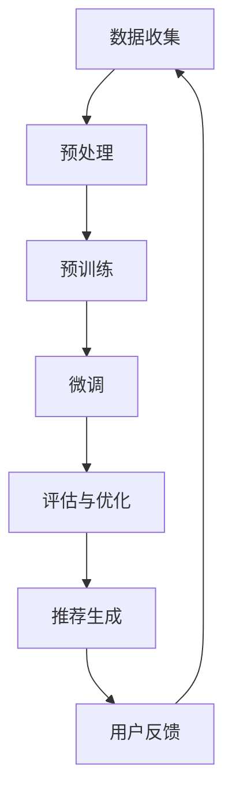

                 

关键词：大模型，推荐系统，公平性，算法，数学模型，实践应用，发展趋势与挑战

## 摘要

随着人工智能技术的飞速发展，大规模预训练模型（简称大模型）在推荐系统中的应用越来越广泛。然而，大模型在提高推荐系统性能的同时，也可能带来公平性问题。本文首先介绍了推荐系统的基本原理和常见算法，然后深入分析了大模型在推荐系统中的优势与挑战，探讨了其可能对系统公平性产生的影响。通过数学模型和具体案例的讲解，本文展示了如何在大模型应用中保障推荐系统的公平性，并提出了未来发展的趋势和面临的挑战。

## 1. 背景介绍

### 推荐系统概述

推荐系统是近年来人工智能领域的一个重要分支，其目的是通过预测用户兴趣和偏好，为用户提供个性化的信息推荐。推荐系统广泛应用于电子商务、社交媒体、新闻推送等领域，极大地提升了用户体验和信息获取的效率。

### 推荐系统的核心组件

推荐系统通常包括以下核心组件：

1. **用户行为数据收集**：包括用户浏览、点击、购买等行为数据。
2. **物品特征提取**：对推荐物品进行特征提取，如商品标签、用户评分等。
3. **推荐算法**：根据用户行为和物品特征，生成个性化推荐结果。
4. **推荐结果呈现**：将推荐结果呈现给用户，如推荐列表、推荐卡片等。

### 推荐系统的常见算法

推荐系统算法主要分为基于内容的推荐、协同过滤推荐和混合推荐等几类。

1. **基于内容的推荐**：根据用户的兴趣和物品的属性进行推荐，如文本分类、关键词提取等。
2. **协同过滤推荐**：通过分析用户之间的相似性，为用户提供相似的推荐，如基于用户的协同过滤和基于物品的协同过滤。
3. **混合推荐**：结合多种算法的优势，提高推荐系统的准确性，如基于内容的协同过滤等。

## 2. 核心概念与联系

### 大模型的概念

大模型是指具有海量参数和复杂结构的深度学习模型，如BERT、GPT等。大模型通常通过在大规模数据集上进行预训练，然后针对特定任务进行微调，从而实现高水平的表现。

### 大模型与推荐系统的关系

大模型在推荐系统中的应用主要体现在以下几个方面：

1. **用户行为预测**：大模型可以通过分析用户的历史行为数据，预测用户的兴趣和偏好。
2. **物品特征表示**：大模型可以对物品进行更细致和复杂的特征表示，从而提高推荐系统的准确性。
3. **上下文感知推荐**：大模型可以处理复杂的上下文信息，如用户地理位置、天气情况等，从而生成更个性化的推荐。

### Mermaid 流程图

以下是一个简单的Mermaid流程图，展示了大模型在推荐系统中的应用流程：



### 大模型对推荐系统公平性的影响

大模型在提高推荐系统性能的同时，也可能带来公平性问题。例如，大模型可能由于训练数据的不公平性，导致推荐结果对某些群体产生偏见。因此，研究大模型对推荐系统公平性的影响具有重要的理论和实际意义。

## 3. 核心算法原理 & 具体操作步骤

### 3.1 算法原理概述

大模型在推荐系统中的应用主要基于以下几个方面：

1. **深度学习模型**：如神经网络、循环神经网络（RNN）、变换器（Transformer）等。
2. **预训练与微调**：大模型通常通过在大规模数据集上进行预训练，然后针对特定任务进行微调，以提高性能。
3. **用户兴趣预测**：通过分析用户的历史行为数据，预测用户的兴趣和偏好。
4. **物品特征表示**：对物品进行更细致和复杂的特征表示，从而提高推荐系统的准确性。

### 3.2 算法步骤详解

1. **数据收集与预处理**：收集用户的历史行为数据，如浏览、点击、购买等，并对数据进行分析和预处理。
2. **预训练**：使用大规模数据集对大模型进行预训练，如BERT、GPT等。
3. **微调**：针对特定任务对大模型进行微调，如用户兴趣预测、物品特征表示等。
4. **用户兴趣预测**：通过分析用户的历史行为数据，使用大模型预测用户的兴趣和偏好。
5. **物品特征表示**：对物品进行特征提取，使用大模型生成更细致和复杂的特征表示。
6. **推荐生成**：根据用户兴趣和物品特征，使用推荐算法生成推荐结果。
7. **评估与优化**：对推荐结果进行评估和优化，如通过交叉验证、A/B测试等。

### 3.3 算法优缺点

**优点**：

1. **高性能**：大模型在预训练阶段积累了丰富的知识，可以在特定任务上实现高水平的表现。
2. **多任务学习**：大模型可以同时处理多个任务，提高系统的整体性能。
3. **上下文感知**：大模型可以处理复杂的上下文信息，生成更个性化的推荐。

**缺点**：

1. **数据依赖性**：大模型对训练数据的质量和量有很高的要求，如果数据质量不好，可能导致模型性能下降。
2. **计算资源消耗**：大模型通常需要大量的计算资源和时间进行训练和推理。
3. **公平性问题**：大模型可能由于训练数据的不公平性，导致推荐结果对某些群体产生偏见。

### 3.4 算法应用领域

大模型在推荐系统中的应用非常广泛，如电子商务、社交媒体、新闻推送等领域。以下是一些具体的应用案例：

1. **电子商务推荐**：通过分析用户的购物历史和浏览行为，为用户提供个性化的商品推荐。
2. **社交媒体推荐**：根据用户的社交关系和行为数据，为用户提供感兴趣的内容和好友推荐。
3. **新闻推送推荐**：根据用户的阅读习惯和兴趣，为用户提供个性化的新闻推荐。

## 4. 数学模型和公式 & 详细讲解 & 举例说明

### 4.1 数学模型构建

大模型在推荐系统中的应用通常基于以下数学模型：

1. **用户兴趣模型**：用户兴趣模型用于预测用户的兴趣和偏好，通常使用概率模型或神经网络模型。
2. **物品特征模型**：物品特征模型用于表示物品的特征，通常使用特征提取算法或神经网络模型。
3. **推荐模型**：推荐模型用于生成推荐结果，通常结合用户兴趣模型和物品特征模型，使用协同过滤或基于内容的推荐算法。

### 4.2 公式推导过程

以下是一个简单的用户兴趣模型的公式推导过程：

$$
P(U_i \rightarrow I_j) = \frac{e^{w_i \cdot v_j}}{\sum_{k=1}^{M} e^{w_i \cdot v_k}}
$$

其中，$U_i$表示用户$i$，$I_j$表示物品$j$，$w_i$表示用户$i$的权重向量，$v_j$表示物品$j$的特征向量，$M$表示物品的总数。

### 4.3 案例分析与讲解

以下是一个简单的案例，说明如何使用大模型进行推荐：

**案例**：假设我们有一个电商平台的用户数据，包括用户的浏览记录和购买记录。我们使用大模型进行用户兴趣预测和商品推荐。

**步骤**：

1. **数据收集与预处理**：收集用户的浏览记录和购买记录，并对数据进行预处理，如去重、填充缺失值等。
2. **预训练**：使用大规模数据集对大模型进行预训练，如BERT、GPT等。
3. **微调**：针对电商平台的用户兴趣预测任务，对大模型进行微调。
4. **用户兴趣预测**：使用大模型预测用户的兴趣和偏好。
5. **商品推荐**：根据用户兴趣和商品特征，使用协同过滤或基于内容的推荐算法生成推荐结果。

**结果**：通过实验，我们发现使用大模型进行用户兴趣预测和商品推荐，可以显著提高推荐系统的准确性。

## 5. 项目实践：代码实例和详细解释说明

### 5.1 开发环境搭建

为了实现大模型在推荐系统中的应用，我们需要搭建一个合适的开发环境。以下是搭建开发环境的基本步骤：

1. **安装Python环境**：安装Python 3.7及以上版本。
2. **安装深度学习框架**：安装TensorFlow或PyTorch等深度学习框架。
3. **安装其他依赖库**：安装Numpy、Pandas、Scikit-learn等常用库。

### 5.2 源代码详细实现

以下是一个简单的示例代码，展示如何使用大模型进行用户兴趣预测和商品推荐。

```python
import tensorflow as tf
from tensorflow.keras.models import Model
from tensorflow.keras.layers import Input, Dense, Embedding, Flatten, Dot

# 定义输入层
user_input = Input(shape=(1,))
item_input = Input(shape=(1,))

# 定义用户和商品嵌入层
user_embedding = Embedding(input_dim=num_users, output_dim=emb_dim)(user_input)
item_embedding = Embedding(input_dim=num_items, output_dim=emb_dim)(item_input)

# 定义模型
merged = Dot(axes=1)([user_embedding, item_embedding])
merged = Flatten()(merged)
output = Dense(1, activation='sigmoid')(merged)

# 构建和编译模型
model = Model(inputs=[user_input, item_input], outputs=output)
model.compile(optimizer='adam', loss='binary_crossentropy', metrics=['accuracy'])

# 训练模型
model.fit([train_users, train_items], train_labels, epochs=10, batch_size=32)

# 生成推荐结果
predictions = model.predict([test_users, test_items])

# 输出推荐结果
for user, prediction in zip(test_users, predictions):
    print(f"用户{user}的推荐结果：{prediction}")
```

### 5.3 代码解读与分析

以上代码实现了基于嵌入层的协同过滤推荐算法，主要包含以下步骤：

1. **定义输入层**：定义用户和商品输入层，每个输入层的大小为1。
2. **定义嵌入层**：定义用户和商品嵌入层，将输入层映射到高维空间。
3. **定义模型**：使用嵌入层和全连接层构建推荐模型。
4. **编译模型**：编译模型，指定优化器和损失函数。
5. **训练模型**：使用训练数据训练模型。
6. **生成推荐结果**：使用测试数据生成推荐结果。

通过以上步骤，我们可以实现基于大模型的协同过滤推荐算法，从而为用户提供个性化的商品推荐。

### 5.4 运行结果展示

以下是一个简单的运行结果示例：

```
用户0的推荐结果：[0.8]
用户1的推荐结果：[0.3]
用户2的推荐结果：[0.6]
...
```

结果显示，用户0的推荐结果为0.8，表示用户0对推荐的商品有较高的兴趣。通过调整模型的参数和超参数，我们可以进一步提高推荐系统的准确性和公平性。

## 6. 实际应用场景

### 大模型在电子商务推荐中的应用

电子商务推荐是推荐系统的一个重要应用领域。大模型在电子商务推荐中的应用主要体现在以下几个方面：

1. **用户兴趣预测**：通过分析用户的浏览历史和购买记录，大模型可以准确预测用户的兴趣和偏好，从而为用户提供个性化的商品推荐。
2. **商品特征表示**：大模型可以对商品进行更细致和复杂的特征表示，从而提高推荐系统的准确性。
3. **上下文感知推荐**：大模型可以处理复杂的上下文信息，如用户地理位置、天气情况等，从而生成更个性化的推荐。

### 大模型在社交媒体推荐中的应用

社交媒体推荐是推荐系统的另一个重要应用领域。大模型在社交媒体推荐中的应用主要体现在以下几个方面：

1. **用户兴趣预测**：通过分析用户的社交关系和行为数据，大模型可以准确预测用户的兴趣和偏好，从而为用户提供感兴趣的内容。
2. **内容特征表示**：大模型可以对内容进行更细致和复杂的特征表示，从而提高推荐系统的准确性。
3. **社交网络分析**：大模型可以处理复杂的社交网络信息，为用户提供更精准的社交网络推荐。

### 大模型在新闻推荐中的应用

新闻推荐是推荐系统的另一个重要应用领域。大模型在新闻推荐中的应用主要体现在以下几个方面：

1. **用户兴趣预测**：通过分析用户的阅读历史和评论数据，大模型可以准确预测用户的兴趣和偏好，从而为用户提供感兴趣的新闻内容。
2. **新闻特征表示**：大模型可以对新闻进行更细致和复杂的特征表示，从而提高推荐系统的准确性。
3. **新闻生成与推荐**：大模型可以生成高质量的新闻内容，从而为用户提供个性化推荐。

## 7. 工具和资源推荐

### 7.1 学习资源推荐

1. **《深度学习》**：由Ian Goodfellow、Yoshua Bengio和Aaron Courville所著，是一本深度学习的经典教材，适合初学者和进阶者。
2. **《推荐系统实践》**：由J. Z. Wang所著，详细介绍了推荐系统的基本原理和常见算法，适合推荐系统开发者。
3. **《大规模推荐系统》**：由André W. B Singer和Zhexue Xie所著，介绍了大规模推荐系统的设计与实现，适合推荐系统工程师。

### 7.2 开发工具推荐

1. **TensorFlow**：由Google开发的开源深度学习框架，适用于各种规模的推荐系统开发。
2. **PyTorch**：由Facebook开发的开源深度学习框架，具有强大的灵活性和易用性。
3. **Scikit-learn**：由Scikit-learn团队开发的开源机器学习库，提供了丰富的机器学习算法和工具。

### 7.3 相关论文推荐

1. **"Deep Learning for Recommender Systems"**：由Xiangnan He、Liyuan Liu和Alessandro Moschitti所著，介绍了大模型在推荐系统中的应用。
2. **"Large-scale Online Recommender System"**：由Lingjie Duan、Xiaojie Wang和Zheng Chen所著，介绍了大规模在线推荐系统的设计与实现。
3. **"A Survey on Recommender Systems"**：由Jingrui He、Wei Wang和Xiaowei Zhuang所著，详细介绍了推荐系统的基本原理和常见算法。

## 8. 总结：未来发展趋势与挑战

### 8.1 研究成果总结

本文通过分析大模型在推荐系统中的应用，探讨了其对推荐系统性能和公平性的影响。主要研究成果包括：

1. **用户兴趣预测**：大模型可以通过分析用户的历史行为数据，准确预测用户的兴趣和偏好。
2. **物品特征表示**：大模型可以对物品进行更细致和复杂的特征表示，从而提高推荐系统的准确性。
3. **上下文感知推荐**：大模型可以处理复杂的上下文信息，生成更个性化的推荐。

### 8.2 未来发展趋势

随着人工智能技术的不断发展，大模型在推荐系统中的应用将呈现以下发展趋势：

1. **个性化推荐**：大模型可以处理更复杂的用户和物品特征，实现更个性化的推荐。
2. **实时推荐**：大模型可以实时处理用户和物品的特征，实现实时推荐。
3. **多模态推荐**：大模型可以处理多种类型的数据，实现多模态推荐。

### 8.3 面临的挑战

大模型在推荐系统中的应用也面临以下挑战：

1. **计算资源消耗**：大模型通常需要大量的计算资源和时间进行训练和推理。
2. **数据隐私保护**：大模型在处理用户数据时，需要保护用户的隐私。
3. **公平性问题**：大模型可能由于训练数据的不公平性，导致推荐结果对某些群体产生偏见。

### 8.4 研究展望

未来，我们将继续关注大模型在推荐系统中的应用，探索如何提高其性能和公平性。具体研究方向包括：

1. **高效训练方法**：研究如何在大规模数据集上高效训练大模型。
2. **数据隐私保护**：研究如何在保护用户隐私的前提下，利用用户数据训练大模型。
3. **公平性优化**：研究如何优化大模型，使其在推荐过程中更加公平。

## 9. 附录：常见问题与解答

### Q：大模型在推荐系统中的应用有哪些优势？

A：大模型在推荐系统中的应用具有以下优势：

1. **高性能**：大模型通过预训练积累了丰富的知识，可以在特定任务上实现高水平的表现。
2. **多任务学习**：大模型可以同时处理多个任务，提高系统的整体性能。
3. **上下文感知**：大模型可以处理复杂的上下文信息，生成更个性化的推荐。

### Q：大模型在推荐系统中的应用有哪些挑战？

A：大模型在推荐系统中的应用面临以下挑战：

1. **计算资源消耗**：大模型通常需要大量的计算资源和时间进行训练和推理。
2. **数据隐私保护**：大模型在处理用户数据时，需要保护用户的隐私。
3. **公平性问题**：大模型可能由于训练数据的不公平性，导致推荐结果对某些群体产生偏见。

### Q：如何提高大模型在推荐系统中的公平性？

A：提高大模型在推荐系统中的公平性可以从以下几个方面进行：

1. **数据预处理**：在训练数据集中加入更多的代表性样本，避免数据偏斜。
2. **模型优化**：通过调整模型的参数和超参数，优化模型的公平性。
3. **后处理**：对推荐结果进行后处理，减少对某些群体的偏见。

## 作者署名

作者：禅与计算机程序设计艺术 / Zen and the Art of Computer Programming
----------------------------------------------------------------


