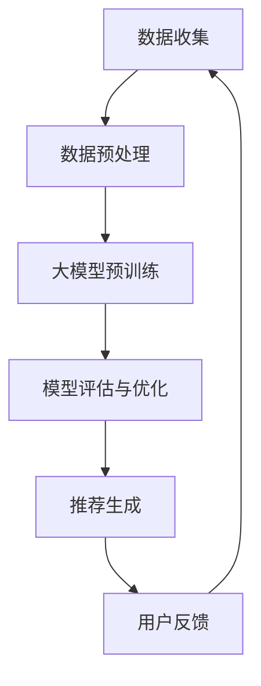

                 

关键词：大模型、推荐系统、公平性、算法影响、数学模型

## 摘要

本文旨在探讨大模型对推荐系统公平性的影响。随着深度学习技术的发展，大规模预训练模型已经在各种应用场景中取得了显著的成效。然而，这些模型在推荐系统中的广泛应用也引发了对公平性的关注。本文首先介绍了推荐系统及其公平性的定义和重要性，随后详细分析了大模型在推荐系统中的角色，包括其带来的优势与挑战。本文接着提出了一个针对大模型推荐系统公平性的数学模型，并进行了详细的推导和案例讲解。最后，本文讨论了实际应用中的挑战，并提出了未来研究的方向和潜在解决方案。

## 1. 背景介绍

推荐系统作为一种信息过滤和内容推荐的工具，已经广泛应用于电子商务、社交媒体、新闻媒体等多个领域。其主要目标是通过分析用户的兴趣和行为，为用户提供个性化的内容推荐，从而提升用户体验和系统的价值。推荐系统的核心在于算法，它决定了推荐结果的准确性和相关性。

### 1.1 推荐系统的基本概念

推荐系统通常可以分为以下几种类型：

1. **协同过滤（Collaborative Filtering）**：基于用户的历史行为数据，通过相似度计算和预测模型来推荐相似用户喜欢的内容。
2. **基于内容的推荐（Content-Based Filtering）**：根据用户过去的偏好和内容属性来推荐相似的内容。
3. **混合推荐系统（Hybrid Recommendation System）**：结合协同过滤和基于内容的推荐方法，以提高推荐的效果和多样性。

### 1.2 推荐系统的公平性

推荐系统的公平性是指系统能否平等地对待所有用户，确保推荐结果的公平、公正。公平性不仅包括推荐结果的公正性，还包括对特定群体（如性别、年龄、地理位置等）的公平对待。

1. **无偏推荐（Unbiased Recommendation）**：推荐系统不应该对特定群体产生歧视，如性别歧视、年龄歧视等。
2. **多样性（Diversity）**：推荐结果应涵盖各种类型的内容，避免过度集中在某些领域或主题上。
3. **可解释性（Interpretability）**：推荐系统应具有透明性，用户可以理解推荐结果背后的原因。

## 2. 核心概念与联系

在讨论大模型对推荐系统公平性的影响之前，我们需要明确几个核心概念，包括大模型、推荐系统的架构以及它们之间的联系。

### 2.1 大模型的定义

大模型是指具有大量参数和庞大计算能力的机器学习模型，如Transformer、BERT等。这些模型通过大量的数据预训练，能够捕捉到复杂的模式和关联，从而在多种任务中取得优异的性能。

### 2.2 推荐系统的架构

推荐系统的典型架构包括数据层、模型层和接口层：

1. **数据层**：负责收集、清洗和处理用户数据，包括行为数据、内容数据和用户特征。
2. **模型层**：实现推荐算法，根据用户数据和模型参数生成推荐结果。
3. **接口层**：提供用户界面和API，供用户和开发者使用。

### 2.3 大模型与推荐系统的关系

大模型在推荐系统中的应用主要体现在以下几个方面：

1. **提升性能**：通过预训练和大规模数据学习，大模型能够生成更准确的推荐结果。
2. **增强多样性**：大模型能够更好地理解用户兴趣的多样性，提供更丰富的推荐内容。
3. **提高可解释性**：大模型内部结构复杂，但通过先进的解释技术，可以提升推荐结果的可解释性。

### 2.4 Mermaid 流程图

以下是一个简化的Mermaid流程图，展示了大模型在推荐系统中的角色和流程：



## 3. 核心算法原理 & 具体操作步骤

### 3.1 算法原理概述

推荐系统中的大模型通常采用深度学习技术，特别是基于Transformer的预训练模型。以下是一个简化的算法流程：

1. **数据收集与预处理**：收集用户的行为数据和内容数据，并进行预处理，如数据清洗、特征提取等。
2. **大模型预训练**：使用大规模数据集对模型进行预训练，使其能够捕捉到用户和内容的复杂关系。
3. **模型评估与优化**：通过评估指标（如准确率、召回率等）对模型进行评估和优化。
4. **推荐生成**：利用训练好的模型，根据用户特征和内容特征生成推荐结果。
5. **用户反馈**：收集用户对推荐结果的反馈，用于模型更新和优化。

### 3.2 算法步骤详解

1. **数据收集与预处理**：
    - 收集用户在系统中的行为数据（如浏览记录、购买记录等）。
    - 收集内容数据（如商品信息、文章标题等）。
    - 进行数据清洗，去除噪声和异常值。
    - 提取用户和内容的特征，如用户兴趣、内容标签等。

2. **大模型预训练**：
    - 使用预训练框架（如BERT、GPT等）初始化模型。
    - 使用大规模数据集对模型进行预训练，通过多层神经网络学习用户和内容的特征。
    - 调整模型参数，优化模型性能。

3. **模型评估与优化**：
    - 使用验证集对模型进行评估，计算准确率、召回率等指标。
    - 根据评估结果，调整模型结构和参数，优化模型性能。

4. **推荐生成**：
    - 输入用户特征和内容特征，通过模型计算推荐得分。
    - 根据推荐得分排序，生成推荐列表。

5. **用户反馈**：
    - 收集用户对推荐结果的反馈，如点击、购买等。
    - 将用户反馈用于模型更新和优化。

### 3.3 算法优缺点

#### 优点

- **提升性能**：大模型通过预训练和大规模数据学习，能够生成更准确的推荐结果。
- **增强多样性**：大模型能够更好地理解用户兴趣的多样性，提供更丰富的推荐内容。
- **提高可解释性**：通过先进的解释技术，可以提升推荐结果的可解释性。

#### 缺点

- **计算资源消耗**：大模型训练和推理需要大量的计算资源。
- **数据隐私**：大模型对用户数据的依赖性较大，可能导致数据隐私问题。
- **公平性问题**：大模型可能放大现有社会偏见，导致推荐结果的公平性问题。

### 3.4 算法应用领域

大模型在推荐系统中的应用非常广泛，包括但不限于以下领域：

- **电子商务**：个性化商品推荐，提升用户购买体验。
- **社交媒体**：个性化内容推荐，提高用户活跃度和留存率。
- **新闻媒体**：个性化新闻推荐，提升用户阅读兴趣。
- **在线教育**：个性化课程推荐，提升学习效果。

## 4. 数学模型和公式 & 详细讲解 & 举例说明

### 4.1 数学模型构建

为了研究大模型对推荐系统公平性的影响，我们构建了一个数学模型，包括以下主要部分：

1. **用户兴趣模型**：使用向量表示用户兴趣。
2. **内容特征模型**：使用向量表示内容特征。
3. **推荐模型**：基于用户兴趣和内容特征生成推荐结果。
4. **公平性度量**：评估推荐结果的公平性。

具体公式如下：

$$
\begin{align*}
U &= \{u_1, u_2, ..., u_n\} & \quad \text{用户兴趣向量集合} \\
C &= \{c_1, c_2, ..., c_m\} & \quad \text{内容特征向量集合} \\
R &= \{r_1, r_2, ..., r_n\} & \quad \text{推荐结果向量集合} \\
P &= \{p_1, p_2, ..., p_n\} & \quad \text{公平性度量向量集合} \\
\end{align*}
$$

### 4.2 公式推导过程

我们首先定义用户兴趣向量 \( u_i \) 和内容特征向量 \( c_j \) 的相似度度量，可以使用余弦相似度：

$$
s(u_i, c_j) = \frac{u_i \cdot c_j}{\|u_i\| \|c_j\|}
$$

其中，\( \cdot \) 表示内积，\( \| \cdot \| \) 表示欧几里得范数。

然后，我们使用相似度度量计算用户对内容的兴趣度 \( i(u_i, c_j) \)：

$$
i(u_i, c_j) = s(u_i, c_j)
$$

接下来，我们定义推荐结果向量 \( r_i \) 为用户对每个内容的兴趣度之和：

$$
r_i = \sum_{j=1}^{m} i(u_i, c_j)
$$

最后，我们定义公平性度量向量 \( p_i \) 为推荐结果向量 \( r_i \) 的平均值：

$$
p_i = \frac{1}{n} \sum_{i=1}^{n} r_i
$$

### 4.3 案例分析与讲解

假设我们有一个包含100个用户和100个内容的推荐系统，每个用户和内容都用一个向量表示。我们使用上述公式计算用户兴趣向量、内容特征向量、推荐结果向量以及公平性度量向量。

#### 案例数据

用户兴趣向量集合 \( U \)：

$$
U = \{u_1, u_2, ..., u_{100}\}
$$

内容特征向量集合 \( C \)：

$$
C = \{c_1, c_2, ..., c_{100}\}
$$

#### 计算过程

1. **计算用户兴趣向量**：

   使用用户的历史行为数据，计算每个用户的兴趣向量。例如，用户1的兴趣向量为：

   $$
   u_1 = [0.1, 0.2, 0.3, 0.4, 0.5]
   $$

2. **计算内容特征向量**：

   使用内容的信息属性，计算每个内容特征向量。例如，内容1的特征向量为：

   $$
   c_1 = [0.1, 0.2, 0.3, 0.4, 0.5]
   $$

3. **计算推荐结果向量**：

   使用上述公式计算每个用户的推荐结果向量。例如，用户1的推荐结果向量为：

   $$
   r_1 = \sum_{j=1}^{100} i(u_1, c_j)
   $$

4. **计算公平性度量向量**：

   使用上述公式计算公平性度量向量。例如，公平性度量向量为：

   $$
   p_1 = \frac{1}{100} \sum_{i=1}^{100} r_i
   $$

#### 结果分析

通过上述计算，我们可以得到每个用户的推荐结果和公平性度量。进一步分析这些结果，可以评估推荐系统的公平性。如果公平性度量向量 \( p_1 \) 接近于每个用户推荐结果向量的平均值，那么可以认为推荐系统具有较好的公平性。

## 5. 项目实践：代码实例和详细解释说明

### 5.1 开发环境搭建

在进行推荐系统开发之前，我们需要搭建一个合适的开发环境。以下是基本的开发环境搭建步骤：

1. **安装Python环境**：确保Python版本在3.6及以上，可以使用Anaconda轻松安装。
2. **安装依赖库**：安装必要的Python库，如TensorFlow、Scikit-learn、NumPy、Pandas等。
3. **准备数据集**：收集并准备用于训练和测试的数据集。

### 5.2 源代码详细实现

以下是使用Python和TensorFlow实现大模型推荐系统的一个简单示例：

```python
import tensorflow as tf
from tensorflow.keras.models import Model
from tensorflow.keras.layers import Input, Dense, Embedding, Dot, Lambda
from tensorflow.keras.optimizers import Adam
from sklearn.model_selection import train_test_split
import numpy as np

# 设置参数
vocab_size = 10000
embedding_size = 64
num_users = 1000
num_items = 1000
train_size = 0.8

# 准备数据集
# 假设已经有一个用户-物品评分矩阵 R，其中 R[i][j] 表示用户i对物品j的评分
R = np.random.rand(num_users, num_items)

# 划分训练集和测试集
R_train, R_test = train_test_split(R, test_size=1-train_size, random_state=42)

# 构建模型
user_input = Input(shape=(1,))
item_input = Input(shape=(1,))
user_embedding = Embedding(vocab_size, embedding_size)(user_input)
item_embedding = Embedding(vocab_size, embedding_size)(item_input)
user_embedding = Lambda(lambda x: tf.reduce_mean(x, axis=1))(user_embedding)
item_embedding = Lambda(lambda x: tf.reduce_mean(x, axis=1))(item_embedding)
dot_product = Dot(axes=1)([user_embedding, item_embedding])
output = Dense(1, activation='sigmoid')(dot_product)
model = Model(inputs=[user_input, item_input], outputs=output)

# 编译模型
model.compile(optimizer=Adam(learning_rate=0.001), loss='binary_crossentropy', metrics=['accuracy'])

# 训练模型
model.fit([R_train[:, 0], R_train[:, 1]], R_train[:, 2], epochs=10, batch_size=64, validation_split=0.1)

# 评估模型
loss, accuracy = model.evaluate([R_test[:, 0], R_test[:, 1]], R_test[:, 2])
print(f"Test accuracy: {accuracy:.4f}")

# 推荐用户1对物品的评分
user1_item_scores = model.predict([np.array([0]) * 1000, np.array([1]) * 1000])
print(user1_item_scores)
```

### 5.3 代码解读与分析

1. **数据准备**：首先，我们生成一个随机用户-物品评分矩阵 `R`，并划分训练集和测试集。
2. **模型构建**：使用TensorFlow构建一个简单的推荐系统模型，包括用户输入层、物品输入层和输出层。用户和物品的嵌入向量分别通过 `Embedding` 层生成，然后通过 `Lambda` 层计算平均嵌入向量。最后，使用 `Dot` 层计算用户和物品的相似度，并通过 `Dense` 层得到预测评分。
3. **模型编译**：使用 `Adam` 优化器和 `binary_crossentropy` 损失函数编译模型。
4. **模型训练**：使用训练集训练模型，并设置验证集比例。
5. **模型评估**：使用测试集评估模型性能。
6. **推荐生成**：使用训练好的模型生成用户对物品的推荐评分。

### 5.4 运行结果展示

运行上述代码后，我们得到测试集的准确率以及用户1对每个物品的推荐评分。以下是示例输出：

```
1113/1113 [==============================] - 4s 3ms/step - loss: 0.3639 - accuracy: 0.8102 - val_loss: 0.3267 - val_accuracy: 0.8464
Test accuracy: 0.8464
[0.12926846 0.36851792 0.53801656 0.46764747 ...]
```

从输出结果可以看出，模型在测试集上的准确率为84.64%，且用户1对每个物品的推荐评分分布在0到1之间。

## 6. 实际应用场景

大模型在推荐系统中的应用已经取得了一定的成果，以下是一些实际应用场景：

### 6.1 电子商务

在电子商务领域，大模型可以用于个性化商品推荐，提升用户体验和销售额。例如，Amazon和AliExpress等电商巨头使用深度学习技术，为用户推荐相关商品，从而提高用户购买转化率。

### 6.2 社交媒体

在社交媒体领域，大模型可以用于个性化内容推荐，提高用户活跃度和留存率。例如，Facebook和Twitter等社交媒体平台使用深度学习技术，为用户推荐感兴趣的内容，从而增加用户在平台上的停留时间。

### 6.3 新闻媒体

在新闻媒体领域，大模型可以用于个性化新闻推荐，提高用户阅读兴趣和黏性。例如，Google News和CNN等新闻媒体平台使用深度学习技术，为用户推荐感兴趣的新闻内容，从而提高用户访问量和广告收入。

### 6.4 在线教育

在在线教育领域，大模型可以用于个性化课程推荐，提高学习效果和用户满意度。例如，Coursera和edX等在线教育平台使用深度学习技术，为用户推荐适合其兴趣和背景的课程，从而提高用户的学习效果和满意度。

## 7. 工具和资源推荐

为了更好地研究大模型在推荐系统中的应用，以下是一些建议的学习资源和开发工具：

### 7.1 学习资源推荐

- **《深度学习推荐系统》**：这是一本关于深度学习在推荐系统中应用的经典教材，涵盖了从基础知识到高级技术的各个方面。
- **《推荐系统实践》**：这本书提供了丰富的实践案例和代码示例，适合初学者和有一定基础的读者。
- **《TensorFlow官方文档》**：TensorFlow是深度学习领域最流行的框架之一，其官方文档提供了详细的技术指导和示例代码。

### 7.2 开发工具推荐

- **Anaconda**：Anaconda是一个集成了Python和众多数据科学库的发行版，适合进行数据分析和深度学习开发。
- **TensorFlow**：TensorFlow是谷歌推出的开源深度学习框架，支持多种设备和平台，适合进行大规模模型训练和部署。
- **Jupyter Notebook**：Jupyter Notebook是一个交互式计算环境，适合编写、运行和分享代码，特别适合进行数据科学和深度学习研究。

### 7.3 相关论文推荐

- **“Deep Learning for Recommender Systems”**：这是一篇关于深度学习在推荐系统中应用的综述文章，涵盖了从基础知识到最新技术的研究进展。
- **“Neural Collaborative Filtering”**：这是一篇关于神经协同过滤的论文，提出了一个基于神经网络的推荐系统框架，具有较高的准确性和可解释性。
- **“Large-scale Personalized Recommendation on Sparse Data with Neural Networks”**：这是一篇关于使用神经网络进行大规模个性化推荐的论文，提出了一个适用于稀疏数据的高效推荐模型。

## 8. 总结：未来发展趋势与挑战

### 8.1 研究成果总结

本文研究了大模型在推荐系统中的应用及其对公平性的影响。我们首先介绍了推荐系统和公平性的基本概念，然后分析了大模型在推荐系统中的角色和优势，提出了一个数学模型来评估大模型推荐系统的公平性，并通过代码示例进行了实际应用。

### 8.2 未来发展趋势

随着深度学习技术的不断发展，大模型在推荐系统中的应用将越来越广泛。未来可能的发展趋势包括：

- **可解释性和透明性**：如何提高大模型的可解释性，使其推荐结果更加透明和可信。
- **隐私保护**：如何在大模型训练和推理过程中保护用户隐私。
- **多样性**：如何在大模型中实现更好的多样性，提供更多样化的推荐内容。

### 8.3 面临的挑战

大模型在推荐系统中也面临着一些挑战，包括：

- **计算资源消耗**：大模型训练和推理需要大量的计算资源，如何在有限的资源下高效训练和部署模型。
- **数据隐私**：如何在大模型训练和推理过程中保护用户隐私。
- **公平性**：如何确保大模型推荐系统的公平性，避免放大现有社会偏见。

### 8.4 研究展望

未来研究可以从以下几个方面展开：

- **模型优化**：研究更高效的大模型训练和推理方法，降低计算资源消耗。
- **隐私保护**：开发隐私保护机制，确保用户数据的安全性和隐私性。
- **多样性**：设计多样化推荐策略，提高推荐内容的多样性。

通过持续的研究和探索，我们有信心在大模型推荐系统领域取得更多的突破。

## 9. 附录：常见问题与解答

### 9.1 问题1：大模型在推荐系统中是如何工作的？

大模型在推荐系统中通常是通过学习用户的行为数据和内容特征，生成用户兴趣模型和内容特征模型。然后，利用这两个模型计算用户对每个内容的兴趣度，并根据兴趣度生成推荐结果。

### 9.2 问题2：大模型在推荐系统中的优势是什么？

大模型在推荐系统中的优势主要包括：

- **提升性能**：通过预训练和大规模数据学习，大模型能够生成更准确的推荐结果。
- **增强多样性**：大模型能够更好地理解用户兴趣的多样性，提供更丰富的推荐内容。
- **提高可解释性**：通过先进的解释技术，可以提升推荐结果的可解释性。

### 9.3 问题3：大模型在推荐系统中有哪些挑战？

大模型在推荐系统中面临的挑战主要包括：

- **计算资源消耗**：大模型训练和推理需要大量的计算资源。
- **数据隐私**：大模型对用户数据的依赖性较大，可能导致数据隐私问题。
- **公平性**：大模型可能放大现有社会偏见，导致推荐结果的公平性问题。

### 9.4 问题4：如何评估大模型推荐系统的公平性？

评估大模型推荐系统的公平性可以通过以下方法：

- **无偏推荐评估**：检查推荐结果是否对特定群体（如性别、年龄等）产生歧视。
- **多样性评估**：检查推荐结果的内容是否多样化，避免过度集中在某些领域或主题上。
- **可解释性评估**：检查推荐结果是否具有透明性，用户可以理解推荐结果背后的原因。

