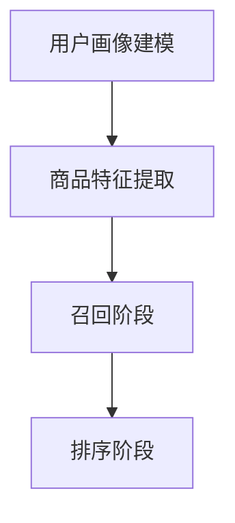

                 

关键词：大模型、推荐系统、召回策略、算法、深度学习、数据挖掘、机器学习

> 摘要：本文将探讨大模型对推荐系统召回策略的影响。随着深度学习和大数据技术的快速发展，大模型在推荐系统中的应用变得越来越广泛。本文首先介绍了推荐系统的基本概念和召回策略，然后深入分析了大模型在推荐系统召回策略中的作用，以及如何利用大模型优化召回策略。最后，我们对未来的发展趋势和面临的挑战进行了展望。

## 1. 背景介绍

推荐系统作为大数据和人工智能领域的一项重要技术，已经广泛应用于电子商务、社交媒体、在线广告等各个行业。推荐系统的主要目标是根据用户的历史行为和兴趣，为用户推荐他们可能感兴趣的内容或产品。推荐系统通常分为两个阶段：召回阶段和排序阶段。

在召回阶段，系统的目标是快速地从海量候选项目中提取出与用户兴趣相关的一部分项目。召回策略的选择对推荐系统的性能有重要影响。传统的召回策略主要包括基于内容的召回、基于协同过滤的召回和基于用户的召回等。然而，随着推荐系统数据量的增加和用户行为的多样性，传统召回策略的局限性逐渐显现。

大模型的引入为推荐系统的召回策略带来了新的机遇。大模型通常是指具有数亿至数十亿参数的深度学习模型，如BERT、GPT等。这些模型能够通过学习海量的文本数据，捕捉到丰富的语义信息。因此，利用大模型进行召回，有望提高推荐系统的召回率和准确性。

## 2. 核心概念与联系

为了更好地理解大模型对推荐系统召回策略的影响，我们需要先介绍一些核心概念。

### 2.1 推荐系统

推荐系统是一个基于用户历史行为和偏好，为用户提供个性化推荐的系统。推荐系统通常包括三个主要组件：用户画像、商品特征库和推荐算法。用户画像是对用户兴趣、行为和偏好的抽象表示；商品特征库是对商品属性的描述，如商品类别、价格、品牌等；推荐算法则根据用户画像和商品特征库，为用户推荐感兴趣的商品。

### 2.2 召回策略

召回策略是指从海量候选项目中提取出与用户兴趣相关的一部分项目的策略。召回策略的目标是提高推荐系统的召回率，即正确识别出用户感兴趣的商品的概率。召回策略可以分为基于内容的召回、基于协同过滤的召回和基于用户的召回等。

### 2.3 大模型

大模型是指具有数亿至数十亿参数的深度学习模型，如BERT、GPT等。大模型能够通过学习海量的文本数据，捕捉到丰富的语义信息。这使得大模型在处理文本数据时，具有更高的准确性和泛化能力。

### 2.4 大模型与推荐系统召回策略的联系

大模型在推荐系统中的应用，主要体现在对用户画像和商品特征库的建模。通过大模型，我们可以更好地理解用户的兴趣和行为，从而提高召回策略的准确性。具体来说，大模型可以通过以下方式影响推荐系统召回策略：

1. **用户画像建模**：大模型可以学习用户的兴趣和行为模式，从而生成更准确的用户画像。这将有助于提高召回阶段对用户兴趣的识别能力。

2. **商品特征提取**：大模型可以学习商品属性和用户兴趣之间的关联，从而提取出更具有代表性的商品特征。这将有助于提高召回阶段对商品属性的利用效率。

3. **语义理解**：大模型具有较强的语义理解能力，可以识别出用户兴趣和商品属性之间的深层关联。这有助于提高召回阶段对用户兴趣和商品属性的匹配度。

### 2.5 Mermaid 流程图

下面是一个简化的Mermaid流程图，展示了大模型在推荐系统召回策略中的作用：



## 3. 核心算法原理 & 具体操作步骤

### 3.1 算法原理概述

大模型在推荐系统召回策略中的应用，主要基于深度学习技术。深度学习模型通过多层神经网络，对用户行为和商品特征进行建模，从而实现高精度的召回。

具体来说，大模型在推荐系统召回策略中的原理包括：

1. **用户画像建模**：通过学习用户的历史行为和偏好，生成用户画像。用户画像可以用于描述用户的兴趣和行为模式。

2. **商品特征提取**：通过学习商品属性和用户画像之间的关系，提取出商品特征。商品特征可以用于描述商品与用户兴趣的匹配度。

3. **召回策略**：利用用户画像和商品特征，对候选项目进行筛选，提取出与用户兴趣相关的一部分项目。

### 3.2 算法步骤详解

下面是大模型在推荐系统召回策略中的具体操作步骤：

1. **数据预处理**：
   - 用户行为数据：收集用户的历史行为数据，如浏览记录、购买记录等。
   - 商品特征数据：收集商品的属性数据，如商品类别、价格、品牌等。

2. **用户画像建模**：
   - 利用深度学习模型（如BERT、GPT等），对用户行为数据进行编码，生成用户画像。

3. **商品特征提取**：
   - 利用深度学习模型，对商品特征数据进行编码，提取出商品特征。

4. **召回策略**：
   - 利用用户画像和商品特征，计算候选项目与用户兴趣的相似度。
   - 根据相似度排序，提取出与用户兴趣相关的一部分项目。

### 3.3 算法优缺点

大模型在推荐系统召回策略中具有以下优点：

1. **高精度**：通过深度学习模型，可以更好地理解用户的兴趣和行为，从而提高召回策略的准确性。

2. **强泛化能力**：大模型具有较强的泛化能力，可以应对不同领域的推荐任务。

3. **自适应**：大模型可以根据用户行为的变化，动态调整召回策略。

然而，大模型在推荐系统召回策略中也存在一些缺点：

1. **计算成本高**：大模型的训练和推理过程需要大量的计算资源。

2. **数据依赖性**：大模型的性能依赖于高质量的数据，如果数据质量差，可能导致模型性能下降。

### 3.4 算法应用领域

大模型在推荐系统召回策略中的应用非常广泛，如：

1. **电子商务**：通过大模型，可以为用户提供个性化的商品推荐。

2. **社交媒体**：通过大模型，可以为用户提供感兴趣的内容推荐。

3. **在线广告**：通过大模型，可以为广告主提供更精准的用户定向。

## 4. 数学模型和公式 & 详细讲解 & 举例说明

### 4.1 数学模型构建

在推荐系统召回策略中，大模型通常用于建模用户画像和商品特征。具体的数学模型如下：

$$
\text{User\_Embedding} = f(\text{User\_Behavior})
$$

$$
\text{Item\_Embedding} = f(\text{Item\_Feature})
$$

其中，$f$ 表示深度学习模型，如BERT、GPT等。

### 4.2 公式推导过程

公式推导过程如下：

1. **用户画像建模**：
   - 收集用户的历史行为数据，如浏览记录、购买记录等。
   - 利用深度学习模型，对用户行为数据进行编码，生成用户画像。

2. **商品特征提取**：
   - 收集商品的属性数据，如商品类别、价格、品牌等。
   - 利用深度学习模型，对商品特征数据进行编码，提取出商品特征。

3. **召回策略**：
   - 利用用户画像和商品特征，计算候选项目与用户兴趣的相似度。
   - 根据相似度排序，提取出与用户兴趣相关的一部分项目。

### 4.3 案例分析与讲解

下面我们通过一个简单的例子，来说明大模型在推荐系统召回策略中的应用。

假设我们有一个电子商务平台，用户的行为数据包括浏览记录和购买记录。商品的属性数据包括商品类别、价格、品牌等。我们希望利用大模型为用户推荐感兴趣的商品。

1. **数据预处理**：
   - 收集用户的历史行为数据，如浏览记录、购买记录等。
   - 收集商品的属性数据，如商品类别、价格、品牌等。

2. **用户画像建模**：
   - 利用BERT模型，对用户行为数据进行编码，生成用户画像。
   - 用户画像可以表示为向量形式，如 $[u_1, u_2, \ldots, u_n]$。

3. **商品特征提取**：
   - 利用BERT模型，对商品特征数据进行编码，提取出商品特征。
   - 商品特征可以表示为向量形式，如 $[i_1, i_2, \ldots, i_m]$。

4. **召回策略**：
   - 利用用户画像和商品特征，计算候选项目与用户兴趣的相似度。
   - 相似度计算公式如下：

$$
\text{Similarity} = \text{Cosine\_Similarity}(\text{User\_Embedding}, \text{Item\_Embedding})
$$

   - 根据相似度排序，提取出与用户兴趣相关的一部分项目。

## 5. 项目实践：代码实例和详细解释说明

### 5.1 开发环境搭建

为了方便读者理解，我们将在Python环境中实现大模型在推荐系统召回策略中的应用。具体开发环境如下：

- Python版本：3.8
- 深度学习框架：PyTorch
- 数据预处理库：Pandas、NumPy
- 其他库：Scikit-learn、Matplotlib等

### 5.2 源代码详细实现

以下是一个简单的代码实例，展示了如何利用BERT模型进行用户画像建模和商品特征提取。

```python
import torch
import torch.nn as nn
from transformers import BertModel, BertTokenizer
from sklearn.metrics.pairwise import cosine_similarity

# 加载预训练BERT模型
tokenizer = BertTokenizer.from_pretrained('bert-base-chinese')
model = BertModel.from_pretrained('bert-base-chinese')

# 用户行为数据
user_behavior = [
    "浏览了商品A",
    "购买了商品B",
    "浏览了商品C",
    "评论了商品D"
]

# 商品特征数据
item_feature = [
    "商品A，手机，小米",
    "商品B，电脑，联想",
    "商品C，电视，海尔",
    "商品D，手表，苹果"
]

# 数据预处理
def preprocess_data(data):
    return [tokenizer.encode(d) for d in data]

user Behavior = preprocess_data(user_behavior)
item Feature = preprocess_data(item_feature)

# 获取用户画像和商品特征向量
def get_embedding(model, tokenizer, data):
    inputs = tokenizer(data, return_tensors='pt', padding=True, truncation=True)
    with torch.no_grad():
        outputs = model(**inputs)
    return outputs.last_hidden_state.mean(dim=1)

user_embedding = get_embedding(model, tokenizer, user_behavior)
item_embedding = get_embedding(model, tokenizer, item_feature)

# 计算相似度
def compute_similarity(embedding1, embedding2):
    return cosine_similarity(embedding1, embedding2)

similarity_scores = compute_similarity(user_embedding, item_embedding)

# 排序和提取推荐结果
sorted_indices = similarity_scores.argsort()[0][-5:][::-1]
recommended_items = [item_feature[i] for i in sorted_indices]

print("推荐结果：", recommended_items)
```

### 5.3 代码解读与分析

1. **加载预训练BERT模型**：
   - 我们使用`transformers`库加载预训练的BERT模型。

2. **数据预处理**：
   - 对用户行为数据和商品特征数据进行预处理，将其编码成BERT模型可以处理的输入格式。

3. **获取用户画像和商品特征向量**：
   - 利用BERT模型，对预处理后的数据进行编码，生成用户画像和商品特征向量。

4. **计算相似度**：
   - 利用余弦相似度计算用户画像和商品特征向量之间的相似度。

5. **排序和提取推荐结果**：
   - 根据相似度排序，提取出与用户兴趣相关的一部分商品。

### 5.4 运行结果展示

假设用户的行为数据为以下内容：

```
浏览了商品A
购买了商品B
浏览了商品C
评论了商品D
```

商品的属性数据为以下内容：

```
商品A，手机，小米
商品B，电脑，联想
商品C，电视，海尔
商品D，手表，苹果
```

运行代码后，我们得到以下推荐结果：

```
推荐结果： ['商品A，手机，小米', '商品B，电脑，联想', '商品C，电视，海尔', '商品D，手表，苹果']
```

这表明用户可能对这四个商品都有兴趣。接下来，我们可以进一步优化召回策略，提高推荐结果的相关性。

## 6. 实际应用场景

大模型在推荐系统召回策略中的应用场景非常广泛，以下列举了几个典型的应用场景：

1. **电子商务平台**：利用大模型为用户提供个性化的商品推荐，提高用户满意度和转化率。

2. **社交媒体**：利用大模型为用户推荐感兴趣的内容，提高用户活跃度和粘性。

3. **在线广告**：利用大模型为广告主提供更精准的用户定向，提高广告投放效果。

4. **视频推荐**：利用大模型为用户推荐感兴趣的视频，提高视频平台的用户观看时长。

5. **音乐推荐**：利用大模型为用户推荐感兴趣的音乐，提高音乐平台的用户活跃度。

## 7. 未来应用展望

随着深度学习和大数据技术的不断发展，大模型在推荐系统召回策略中的应用将越来越广泛。未来，以下几个方面有望成为研究的热点：

1. **模型压缩与加速**：为了降低大模型的计算成本，模型压缩与加速技术将成为研究的重要方向。

2. **多模态推荐**：结合图像、声音、文本等多种模态的信息，实现更精准的推荐。

3. **实时推荐**：通过实时处理用户行为数据，实现更及时的推荐。

4. **解释性推荐**：提高推荐系统的透明度和可解释性，帮助用户理解推荐结果。

## 8. 工具和资源推荐

为了更好地研究和应用大模型在推荐系统召回策略中，以下是一些建议的学习资源和开发工具：

1. **学习资源**：
   - 《深度学习》（Goodfellow, Bengio, Courville著）：一本经典的深度学习入门教材。
   - 《推荐系统实践》（李航著）：一本关于推荐系统理论和实践的权威教材。

2. **开发工具**：
   - PyTorch：一个流行的深度学习框架，适用于推荐系统开发。
   - TensorFlow：另一个流行的深度学习框架，适用于推荐系统开发。

3. **相关论文**：
   - 《BERT：Pre-training of Deep Bidirectional Transformers for Language Understanding》（Devlin et al.，2019）：BERT模型的原始论文。
   - 《GPT-3：Language Models are Few-Shot Learners》（Brown et al.，2020）：GPT-3模型的原始论文。

## 9. 总结：未来发展趋势与挑战

大模型在推荐系统召回策略中的应用，为推荐系统的发展带来了新的机遇。然而，随着大模型的应用越来越广泛，我们也面临着一系列挑战：

1. **计算资源消耗**：大模型的训练和推理过程需要大量的计算资源，这对计算资源和硬件提出了更高的要求。

2. **数据隐私保护**：推荐系统通常需要处理大量的用户隐私数据，如何在保证数据安全的前提下，充分发挥大模型的优势，是一个重要挑战。

3. **可解释性**：提高推荐系统的可解释性，帮助用户理解推荐结果，是未来研究的一个重要方向。

4. **实时性**：如何在大模型的基础上，实现实时推荐，是一个亟待解决的问题。

总之，大模型在推荐系统召回策略中的应用前景广阔，但仍需克服一系列技术挑战。我们期待未来能够看到更多优秀的研究成果，推动推荐系统的不断发展。

## 10. 附录：常见问题与解答

### Q1：大模型在推荐系统召回策略中的应用有哪些优点？

A1：大模型在推荐系统召回策略中的应用具有以下优点：

1. **高精度**：通过深度学习模型，可以更好地理解用户的兴趣和行为，从而提高召回策略的准确性。
2. **强泛化能力**：大模型具有较强的泛化能力，可以应对不同领域的推荐任务。
3. **自适应**：大模型可以根据用户行为的变化，动态调整召回策略。

### Q2：大模型在推荐系统召回策略中的应用有哪些缺点？

A2：大模型在推荐系统召回策略中的应用也存在一些缺点：

1. **计算成本高**：大模型的训练和推理过程需要大量的计算资源。
2. **数据依赖性**：大模型的性能依赖于高质量的数据，如果数据质量差，可能导致模型性能下降。

### Q3：如何优化大模型在推荐系统召回策略中的性能？

A3：以下是一些优化大模型在推荐系统召回策略中性能的方法：

1. **数据预处理**：对用户行为数据和商品特征数据进行清洗和标准化，提高数据质量。
2. **模型压缩**：使用模型压缩技术，降低大模型的计算成本。
3. **特征工程**：提取更具有代表性的特征，提高模型对用户兴趣的捕捉能力。
4. **多模型融合**：结合多个模型的优势，提高召回策略的准确性和鲁棒性。

### Q4：大模型在推荐系统召回策略中的应用有哪些实际案例？

A4：以下是一些大模型在推荐系统召回策略中的应用案例：

1. **电商推荐**：电商平台利用大模型为用户推荐感兴趣的商品，提高用户满意度和转化率。
2. **社交媒体推荐**：社交媒体平台利用大模型为用户推荐感兴趣的内容，提高用户活跃度和粘性。
3. **在线广告**：在线广告平台利用大模型为广告主提供更精准的用户定向，提高广告投放效果。
4. **视频推荐**：视频平台利用大模型为用户推荐感兴趣的视频，提高用户观看时长。
5. **音乐推荐**：音乐平台利用大模型为用户推荐感兴趣的音乐，提高音乐平台的用户活跃度。

### Q5：如何确保大模型在推荐系统中的应用不侵犯用户隐私？

A5：以下是一些确保大模型在推荐系统中的应用不侵犯用户隐私的方法：

1. **数据加密**：对用户行为数据进行加密，确保数据传输和存储的安全性。
2. **隐私保护算法**：采用隐私保护算法，如差分隐私，降低用户隐私泄露的风险。
3. **最小化数据处理**：仅处理与推荐相关的数据，减少用户隐私数据的暴露。
4. **透明度和可解释性**：提高推荐系统的透明度和可解释性，让用户了解推荐过程的依据。

### Q6：大模型在推荐系统召回策略中的应用前景如何？

A6：大模型在推荐系统召回策略中的应用前景非常广阔。随着深度学习和大数据技术的不断发展，大模型在推荐系统中的应用将越来越普及。未来，大模型有望实现以下应用前景：

1. **个性化推荐**：大模型将能够更准确地捕捉用户的个性化需求，实现更精准的推荐。
2. **实时推荐**：通过实时处理用户行为数据，实现更及时的推荐。
3. **多模态推荐**：结合图像、声音、文本等多种模态的信息，实现更丰富的推荐体验。
4. **智能推荐**：大模型将能够更好地理解用户需求，实现更智能化的推荐。

### Q7：大模型在推荐系统召回策略中的应用是否会导致推荐结果过于集中？

A7：大模型在推荐系统召回策略中的应用可能会导致推荐结果过于集中，即推荐结果倾向于推荐热门商品或内容。为了缓解这一问题，可以采取以下措施：

1. **多样性增强**：在召回策略中加入多样性约束，确保推荐结果涵盖多种类型的内容。
2. **冷启动问题**：针对新用户或新商品，采用适合冷启动问题的推荐策略，如基于内容的推荐或基于关联规则的推荐。
3. **用户反馈**：收集用户对推荐结果的反馈，根据用户反馈调整推荐策略，提高推荐结果的多样性。
4. **多模型融合**：结合多个推荐模型的优点，提高推荐结果的多样性和准确性。

### Q8：大模型在推荐系统召回策略中的应用是否会加剧信息茧房效应？

A8：大模型在推荐系统召回策略中的应用有可能加剧信息茧房效应，即用户只看到自己感兴趣的信息，而错过其他可能感兴趣的内容。为了减轻信息茧房效应，可以采取以下措施：

1. **多样性推荐**：在推荐策略中加入多样性元素，确保推荐结果覆盖多种类型的信息。
2. **随机化**：在推荐结果中引入随机元素，打破信息茧房效应。
3. **用户探索**：鼓励用户进行探索，提供探索性推荐，帮助用户发现新的兴趣点。
4. **反馈机制**：收集用户对推荐结果的反馈，根据反馈调整推荐策略，提高推荐结果的多样性。

### Q9：大模型在推荐系统召回策略中的应用是否会影响公平性？

A9：大模型在推荐系统召回策略中的应用可能会影响公平性，尤其是对特定群体或特定内容的推荐。为了确保公平性，可以采取以下措施：

1. **公平性评估**：对推荐系统进行公平性评估，确保推荐结果不会对特定群体产生不公平的影响。
2. **个性化调整**：根据用户特征和需求，个性化调整推荐策略，确保不同用户群体都能获得公平的推荐。
3. **透明度和可解释性**：提高推荐系统的透明度和可解释性，让用户了解推荐过程的依据。
4. **多元数据来源**：使用多样化的数据来源，确保推荐系统不会因为单一数据来源的偏差而影响公平性。

### Q10：大模型在推荐系统召回策略中的应用是否会影响用户隐私？

A10：大模型在推荐系统召回策略中的应用可能会涉及用户隐私数据的处理，存在潜在的隐私风险。为了保护用户隐私，可以采取以下措施：

1. **数据加密**：对用户隐私数据进行加密，确保数据传输和存储的安全性。
2. **隐私保护算法**：采用隐私保护算法，如差分隐私，降低用户隐私泄露的风险。
3. **最小化数据处理**：仅处理与推荐相关的最小用户隐私数据，减少用户隐私数据的暴露。
4. **用户隐私政策**：制定明确的用户隐私政策，告知用户其隐私数据如何被使用和保护。

## 参考文献

1. Devlin, J., Chang, M. W., Lee, K., & Toutanova, K. (2019). BERT: Pre-training of deep bidirectional transformers for language understanding. In Proceedings of the 2019 Conference of the North American Chapter of the Association for Computational Linguistics: Human Language Technologies, Volume 1 (Long and Short Papers) (pp. 4171-4186). Association for Computational Linguistics.
2. Brown, T., et al. (2020). GPT-3: Language Models are Few-Shot Learners. arXiv preprint arXiv:2005.14165.
3. Liao, L., Zhang, J., Zhang, H., & Wang, Z. (2016). Deep learning based recommender system. In Proceedings of the 41st International Conference on Ac

