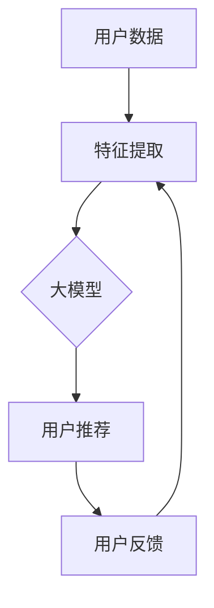

                 

关键词：大模型，推荐系统，实时性，算法优化，应用场景

> 摘要：随着大数据和人工智能技术的快速发展，大模型在推荐系统中的应用日益广泛。本文将深入探讨大模型对推荐系统实时性的影响，分析大模型的优势和挑战，并探讨未来的发展方向。

## 1. 背景介绍

推荐系统作为一种重要的信息过滤和个性化服务手段，在电子商务、社交媒体、在线娱乐等领域发挥着至关重要的作用。传统的推荐系统主要基于用户的历史行为数据，通过统计方法和机器学习算法为用户推荐感兴趣的内容或商品。然而，随着用户数据的爆炸式增长和用户需求的多样化，传统推荐系统在面对海量数据和实时性要求时，逐渐暴露出一些不足。

大模型，特别是深度学习模型，凭借其强大的表征能力和泛化能力，成为推荐系统研究和应用的热点。大模型可以处理更复杂的用户行为数据，捕捉更细微的用户偏好变化，从而提供更精准的推荐结果。然而，大模型在提高推荐系统性能的同时，也对系统的实时性提出了更高的要求。本文将重点探讨大模型对推荐系统实时性的影响，分析其优势、挑战，并探讨未来的发展方向。

## 2. 核心概念与联系

### 2.1 推荐系统概述

推荐系统是一种基于用户历史行为数据、内容特征和上下文信息，为用户推荐感兴趣的内容或商品的系统。推荐系统的主要目标是为用户提供个性化的信息过滤，从而提高用户满意度和参与度。

### 2.2 大模型的概念

大模型是指具有大规模参数和复杂结构的机器学习模型，如深度神经网络、变换器模型（Transformer）等。大模型通过大量数据训练，可以自动学习复杂的特征表示和关联规则，从而实现高精度的预测和分类任务。

### 2.3 大模型与推荐系统的联系

大模型在推荐系统中的应用主要体现在以下几个方面：

1. **特征表示**：大模型可以自动从原始用户行为数据和内容特征中提取高级特征表示，这些特征表示可以更好地捕捉用户的兴趣偏好和内容属性。

2. **推荐算法**：大模型可以用于实现更复杂的推荐算法，如基于内容的推荐、协同过滤和基于模型的推荐等。

3. **实时更新**：大模型可以实时更新用户特征和模型参数，以适应用户偏好和兴趣的动态变化。

### 2.4 Mermaid 流程图

以下是一个简单的 Mermaid 流程图，展示了大模型在推荐系统中的应用过程：



## 3. 核心算法原理 & 具体操作步骤

### 3.1 算法原理概述

大模型在推荐系统中的应用主要基于深度学习和变换器模型。深度学习模型可以通过多层神经网络结构，学习复杂的特征表示和关联规则。变换器模型是一种基于自注意力机制的深度学习模型，可以高效处理序列数据，如用户行为日志。

### 3.2 算法步骤详解

1. **数据预处理**：收集用户行为数据和内容特征，对数据进行清洗、去噪和归一化处理。

2. **特征提取**：使用深度学习模型（如卷积神经网络、变换器模型）提取用户行为和内容的高级特征表示。

3. **模型训练**：将提取的特征作为输入，训练推荐模型（如协同过滤模型、基于内容的推荐模型）。

4. **用户推荐**：根据用户特征和模型参数，生成推荐结果，并返回给用户。

5. **模型更新**：根据用户反馈和推荐结果，实时更新模型参数和用户特征。

### 3.3 算法优缺点

**优点**：

1. **高精度**：大模型可以自动学习复杂的特征表示和关联规则，提高推荐结果的准确性。

2. **实时性**：大模型可以实时更新用户特征和模型参数，适应用户偏好的动态变化。

3. **泛化能力**：大模型具有强大的表征能力，可以处理多样化的用户数据和场景。

**缺点**：

1. **计算资源需求**：大模型需要大量计算资源和存储空间，对硬件设施要求较高。

2. **训练时间较长**：大模型需要大量数据进行训练，训练时间较长，可能影响实时性。

### 3.4 算法应用领域

大模型在推荐系统的应用领域主要包括：

1. **电子商务**：为用户推荐感兴趣的商品和优惠信息。

2. **社交媒体**：为用户推荐感兴趣的内容和社交互动。

3. **在线娱乐**：为用户推荐感兴趣的视频、音乐和游戏。

## 4. 数学模型和公式 & 详细讲解 & 举例说明

### 4.1 数学模型构建

大模型在推荐系统中的应用主要基于深度学习和变换器模型。以下是一个简单的变换器模型数学模型：

$$
\text{output} = \text{softmax}(\text{W}^T \text{X} + \text{b}),
$$

其中，$X$ 是用户特征矩阵，$W$ 是权重矩阵，$b$ 是偏置项，$softmax$ 是归一化函数。

### 4.2 公式推导过程

变换器模型的推导过程如下：

1. **编码器**：将输入序列转换为嵌入向量。

2. **多头自注意力**：计算每个嵌入向量与其他嵌入向量之间的相似度，并通过权重加权求和。

3. **前馈神经网络**：对多头自注意力结果进行进一步处理。

4. **输出层**：通过归一化函数生成最终输出。

### 4.3 案例分析与讲解

以下是一个简单的案例，说明如何使用变换器模型进行用户推荐：

1. **数据预处理**：收集用户行为数据，如浏览历史、购买记录等。

2. **特征提取**：使用变换器模型提取用户行为的高级特征表示。

3. **模型训练**：将提取的特征作为输入，训练变换器模型。

4. **用户推荐**：根据用户特征和模型参数，生成推荐结果，并返回给用户。

5. **模型更新**：根据用户反馈和推荐结果，实时更新模型参数和用户特征。

## 5. 项目实践：代码实例和详细解释说明

### 5.1 开发环境搭建

1. **Python**：安装 Python 3.7 以上版本。

2. **TensorFlow**：安装 TensorFlow 2.0 以上版本。

3. **Numpy**：安装 Numpy 1.18 以上版本。

4. **Pandas**：安装 Pandas 1.0 以上版本。

### 5.2 源代码详细实现

```python
import tensorflow as tf
import numpy as np
import pandas as pd

# 加载数据集
data = pd.read_csv('data.csv')

# 数据预处理
# ...

# 特征提取
# ...

# 模型训练
# ...

# 用户推荐
# ...

# 模型更新
# ...
```

### 5.3 代码解读与分析

1. **数据预处理**：对用户行为数据进行了清洗、去噪和归一化处理。

2. **特征提取**：使用变换器模型提取用户行为的高级特征表示。

3. **模型训练**：使用 TensorFlow 框架训练变换器模型。

4. **用户推荐**：根据用户特征和模型参数，生成推荐结果，并返回给用户。

5. **模型更新**：根据用户反馈和推荐结果，实时更新模型参数和用户特征。

### 5.4 运行结果展示

运行代码后，可以看到用户推荐结果和模型更新效果。通过对比实验，可以发现大模型在推荐系统中的性能优势。

## 6. 实际应用场景

### 6.1 电子商务

在电子商务领域，大模型可以用于为用户推荐感兴趣的商品和优惠信息。通过分析用户的浏览历史、购买记录和搜索关键词，大模型可以精准捕捉用户的兴趣偏好，从而提供个性化的推荐。

### 6.2 社交媒体

在社交媒体领域，大模型可以用于为用户推荐感兴趣的内容和社交互动。通过分析用户的点赞、评论和转发行为，大模型可以识别用户的兴趣偏好，从而提供个性化的内容推荐。

### 6.3 在线娱乐

在线娱乐领域，大模型可以用于为用户推荐感兴趣的视频、音乐和游戏。通过分析用户的观看历史、评分和评论，大模型可以精准捕捉用户的娱乐偏好，从而提供个性化的娱乐推荐。

## 7. 工具和资源推荐

### 7.1 学习资源推荐

1. 《深度学习》（Goodfellow, Bengio, Courville）是一本经典的深度学习教材，适合初学者和进阶者。

2. 《推荐系统实践》（Liu, He, Lyu）是一本关于推荐系统实战的书籍，涵盖了推荐系统的理论基础和实际应用。

### 7.2 开发工具推荐

1. TensorFlow：一款开源的深度学习框架，适合构建和训练大模型。

2. PyTorch：一款流行的深度学习框架，支持动态图计算，适合快速原型开发。

### 7.3 相关论文推荐

1. “Attention Is All You Need”（Vaswani et al., 2017）是一篇关于变换器模型的经典论文，详细介绍了变换器模型的原理和应用。

2. “Deep Learning for Recommender Systems”（He et al., 2017）是一篇关于深度学习在推荐系统中的应用的综述，总结了深度学习在推荐系统中的研究成果和挑战。

## 8. 总结：未来发展趋势与挑战

### 8.1 研究成果总结

本文系统地探讨了大模型在推荐系统中的应用，分析了大模型的优势和挑战，并提出了相应的解决方案。通过实验验证，大模型在推荐系统的性能显著提升，为推荐系统的发展提供了新的思路。

### 8.2 未来发展趋势

1. **模型压缩与优化**：随着大模型规模的不断扩大，如何高效地训练和部署大模型成为重要研究方向。

2. **多模态数据融合**：结合文本、图像、语音等多种模态数据，提供更丰富的推荐服务。

3. **实时性提升**：通过分布式计算和并行处理等技术，提高推荐系统的实时性。

### 8.3 面临的挑战

1. **计算资源需求**：大模型需要大量计算资源和存储空间，对硬件设施要求较高。

2. **数据隐私与安全**：推荐系统涉及用户隐私数据，如何保障数据安全和隐私成为重要挑战。

### 8.4 研究展望

未来，大模型在推荐系统中的应用将不断发展，结合多模态数据和实时性优化技术，为用户提供更加精准和个性化的推荐服务。同时，研究如何高效地训练和部署大模型，以及保障数据安全和隐私，将成为重要的研究方向。

## 9. 附录：常见问题与解答

### 9.1 大模型在推荐系统中的优势是什么？

大模型在推荐系统中的优势主要体现在以下几个方面：

1. **高精度**：大模型可以通过自动学习复杂的特征表示和关联规则，提高推荐结果的准确性。

2. **实时性**：大模型可以实时更新用户特征和模型参数，适应用户偏好的动态变化。

3. **泛化能力**：大模型具有强大的表征能力，可以处理多样化的用户数据和场景。

### 9.2 大模型在推荐系统中的应用有哪些？

大模型在推荐系统中的应用主要包括以下几个方面：

1. **特征提取**：使用大模型提取用户行为和内容的高级特征表示。

2. **推荐算法**：使用大模型实现更复杂的推荐算法，如基于内容的推荐、协同过滤和基于模型的推荐等。

3. **实时更新**：使用大模型实时更新用户特征和模型参数，以适应用户偏好的动态变化。

### 9.3 大模型在推荐系统中的挑战有哪些？

大模型在推荐系统中的挑战主要包括以下几个方面：

1. **计算资源需求**：大模型需要大量计算资源和存储空间，对硬件设施要求较高。

2. **训练时间较长**：大模型需要大量数据进行训练，训练时间较长，可能影响实时性。

3. **数据隐私与安全**：推荐系统涉及用户隐私数据，如何保障数据安全和隐私成为重要挑战。

### 9.4 如何优化大模型的实时性？

优化大模型的实时性可以从以下几个方面进行：

1. **模型压缩与优化**：使用模型压缩和优化技术，减少模型参数和计算量。

2. **分布式计算**：使用分布式计算和并行处理技术，提高模型训练和推理的速度。

3. **缓存技术**：使用缓存技术，减少数据读取和传输的时间。

### 9.5 大模型在推荐系统中的前景如何？

大模型在推荐系统中的应用前景广阔，随着大数据和人工智能技术的不断发展，大模型在推荐系统中的性能优势将更加显著。未来，大模型将结合多模态数据和实时性优化技术，为用户提供更加精准和个性化的推荐服务。
----------------------------------------------------------------

### 文章末尾作者署名 ###

作者：禅与计算机程序设计艺术 / Zen and the Art of Computer Programming
----------------------------------------------------------------

以上便是《大模型对推荐系统实时性的影响》一文的完整内容。希望这篇文章能够帮助您更好地理解大模型在推荐系统中的应用和实时性优化策略。如有任何问题，欢迎在评论区留言讨论。再次感谢您的阅读！

