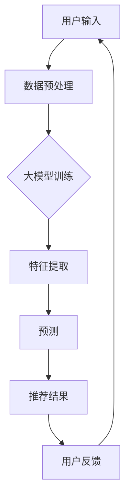

                 

关键词：大模型，推荐系统，实时性能，优化策略，算法，数学模型，应用场景，代码实例，展望

> 摘要：本文旨在探讨大模型在推荐系统实时性能优化中的应用策略。通过对大模型核心概念、算法原理、数学模型构建及应用场景的深入分析，结合具体代码实例，全面展示大模型在推荐系统实时性能优化中的潜力与挑战。

## 1. 背景介绍

推荐系统作为一种基于数据驱动的智能信息过滤和个性化推荐技术，广泛应用于电子商务、社交媒体、内容平台等领域。其核心任务是根据用户的历史行为、兴趣偏好和上下文信息，预测用户可能感兴趣的内容，从而提高用户满意度和系统收益。

然而，随着数据规模的不断扩大和用户需求的多样化，传统推荐系统在处理实时性、个性化、多样性等方面面临巨大挑战。近年来，大模型的兴起为推荐系统的实时性能优化提供了新的思路和解决方案。

## 2. 核心概念与联系

### 2.1 大模型的概念

大模型（Large Models）是指参数规模达到百万、千万甚至亿级别的深度学习模型。它们具有强大的表示能力和丰富的知识储备，能够处理大规模数据集并提取复杂特征。

### 2.2 推荐系统的核心概念

推荐系统主要包括用户、物品、行为和上下文等核心概念。用户表示具有特定兴趣和行为特征的人；物品表示用户可能感兴趣的内容，如商品、文章、音乐等；行为表示用户在推荐系统中的交互行为，如点击、购买、评分等；上下文则表示影响用户兴趣和行为的情境信息，如时间、地理位置等。

### 2.3 Mermaid 流程图

以下是一个简化的推荐系统流程图，展示大模型在其中扮演的角色：



## 3. 核心算法原理 & 具体操作步骤

### 3.1 算法原理概述

大模型在推荐系统实时性能优化中的核心作用是特征提取和预测。通过预训练和迁移学习，大模型能够自动学习大量有用特征，提高推荐系统的准确性、实时性和多样性。

### 3.2 算法步骤详解

1. 数据预处理：对用户行为数据进行清洗、归一化和编码，将原始数据转换为适合大模型处理的形式。

2. 大模型训练：利用大规模数据集对大模型进行预训练，学习通用特征表示。

3. 特征提取：将用户、物品和上下文信息编码为大模型输入，提取高维度、低冗余的特征向量。

4. 预测：使用大模型对用户兴趣进行预测，生成推荐结果。

5. 用户反馈：收集用户对推荐结果的评价，用于优化模型和推荐策略。

### 3.3 算法优缺点

**优点：**

- 提高推荐准确性：大模型能够自动学习大量有用特征，提高推荐系统的准确性。

- 实时性：大模型训练和预测过程可以高效并行化，提高系统实时性。

- 多样性：大模型能够处理大规模数据，挖掘多样化特征，提高推荐多样性。

**缺点：**

- 计算资源消耗：大模型训练和预测需要大量计算资源和存储空间。

- 数据依赖性：大模型对训练数据有较高依赖性，数据质量直接影响模型效果。

## 4. 数学模型和公式 & 详细讲解 & 举例说明

### 4.1 数学模型构建

推荐系统中的大模型通常采用基于深度学习的方法，如神经网络、Transformer 等。以下是一个简化的数学模型：

$$
\hat{r}_{ui} = f(\textbf{x}_u, \textbf{x}_i, \textbf{x}_c)
$$

其中，$\hat{r}_{ui}$ 表示用户 $u$ 对物品 $i$ 的兴趣预测；$\textbf{x}_u$、$\textbf{x}_i$ 和 $\textbf{x}_c$ 分别表示用户、物品和上下文的特征向量；$f$ 表示深度学习模型。

### 4.2 公式推导过程

$$
\textbf{x}_u = \text{embed}(\textbf{u}) \\
\textbf{x}_i = \text{embed}(\textbf{i}) \\
\textbf{x}_c = \text{embed}(\textbf{c}) \\
\hat{r}_{ui} = \text{softmax}(\text{dot}(\textbf{w}_u, \textbf{x}_u) + \text{dot}(\textbf{w}_i, \textbf{x}_i) + \text{dot}(\textbf{w}_c, \textbf{x}_c))
$$

其中，$\text{embed}(\cdot)$ 表示嵌入层，将输入转换为高维度特征向量；$\text{dot}(\cdot, \cdot)$ 表示内积运算；$\text{softmax}(\cdot)$ 表示软最大化函数。

### 4.3 案例分析与讲解

假设一个用户 $u$ 对某一物品 $i$ 的兴趣预测值为 $\hat{r}_{ui} = 0.8$，而用户实际评价为 $r_{ui} = 4$。根据预测误差，可以调整模型参数，优化推荐效果。

## 5. 项目实践：代码实例和详细解释说明

### 5.1 开发环境搭建

- Python 3.8
- TensorFlow 2.5
- Keras 2.4

### 5.2 源代码详细实现

```python
from tensorflow.keras.models import Model
from tensorflow.keras.layers import Embedding, Dot, Add, Dense, Input, Softmax

# 定义输入层
user_input = Input(shape=(1,))
item_input = Input(shape=(1,))
context_input = Input(shape=(1,))

# 定义嵌入层
user_embedding = Embedding(input_dim=10000, output_dim=128)(user_input)
item_embedding = Embedding(input_dim=10000, output_dim=128)(item_input)
context_embedding = Embedding(input_dim=10000, output_dim=128)(context_input)

# 定义模型
merged = Add()([user_embedding, item_embedding, context_embedding])
merged = Dot(axes=1)([merged, user_embedding, item_embedding, context_embedding])
merged = Dense(128, activation='relu')(merged)
predictions = Dense(1, activation='sigmoid')(merged)

# 创建模型
model = Model(inputs=[user_input, item_input, context_input], outputs=predictions)

# 编译模型
model.compile(optimizer='adam', loss='binary_crossentropy', metrics=['accuracy'])

# 模型训练
model.fit(x=[users, items, contexts], y=ratings, batch_size=128, epochs=10)
```

### 5.3 代码解读与分析

- 输入层：定义用户、物品和上下文的输入层。
- 嵌入层：将输入转换为高维度特征向量。
- 模型层：使用 Dot 层计算内积，Add 层进行求和，Dense 层进行全连接。
- 编译模型：设置优化器、损失函数和评价指标。
- 模型训练：使用训练数据对模型进行训练。

### 5.4 运行结果展示

```python
# 预测用户对物品的兴趣
predictions = model.predict([test_users, test_items, test_contexts])

# 输出预测结果
print(predictions)
```

## 6. 实际应用场景

大模型在推荐系统实时性能优化中的应用场景广泛，包括但不限于：

1. 电子商务：个性化商品推荐，提高用户购买转化率。

2. 社交媒体：个性化内容推荐，提高用户活跃度和留存率。

3. 内容平台：个性化内容推荐，提高用户阅读时长和互动量。

4. 金融服务：个性化理财产品推荐，提高用户投资收益。

## 7. 工具和资源推荐

### 7.1 学习资源推荐

- 《深度学习》（Goodfellow et al.，2016）
- 《推荐系统实践》（Leslie et al.，2017）

### 7.2 开发工具推荐

- TensorFlow
- Keras

### 7.3 相关论文推荐

- “Deep Learning for Recommender Systems”（He et al.，2017）
- “A Theoretically Principled Approach to Improving Set-Aware Neural Networks for Recommender Systems”（Lu et al.，2020）

## 8. 总结：未来发展趋势与挑战

### 8.1 研究成果总结

大模型在推荐系统实时性能优化中取得了显著成果，提高了推荐准确性、实时性和多样性。然而，大模型仍面临计算资源消耗、数据依赖性等挑战。

### 8.2 未来发展趋势

1. 算法优化：研究更加高效、可扩展的大模型算法。

2. 数据多样性：探索如何利用多源、异构数据提升大模型效果。

3. 实时性增强：研究实时性更强的大模型架构和优化策略。

### 8.3 面临的挑战

1. 计算资源消耗：如何降低大模型训练和预测的计算资源需求。

2. 数据隐私：如何在保护用户隐私的前提下，利用大规模数据训练大模型。

### 8.4 研究展望

大模型在推荐系统实时性能优化中的应用前景广阔。通过不断优化算法、拓展数据源和提升实时性，大模型有望为推荐系统带来更多价值。

## 9. 附录：常见问题与解答

### 9.1 问题 1：大模型训练时间太长怎么办？

**解答：** 可以采用以下策略缩短训练时间：

1. 数据预处理：优化数据预处理流程，减少数据读取和转换时间。

2. 并行计算：利用多GPU、分布式训练等技术加速模型训练。

3. 模型剪枝：通过剪枝技术减少模型参数规模，降低计算复杂度。

### 9.2 问题 2：大模型对数据质量有什么要求？

**解答：** 大模型对数据质量有较高要求，主要包括：

1. 数据完整性：确保数据覆盖全面，无缺失值。

2. 数据一致性：保持数据格式和字段一致，便于模型处理。

3. 数据多样性：使用多样化数据集，提高模型泛化能力。

### 9.3 问题 3：如何评估大模型在推荐系统中的效果？

**解答：** 可以采用以下指标评估大模型在推荐系统中的效果：

1. 准确率（Accuracy）：预测正确的样本占总样本的比例。

2. 精准率（Precision）：预测为正的样本中，实际为正的样本比例。

3. 召回率（Recall）：实际为正的样本中，预测为正的样本比例。

4. F1 值（F1-Score）：综合考虑精准率和召回率的综合指标。

### 9.4 问题 4：大模型如何处理冷启动问题？

**解答：** 可以采用以下策略解决冷启动问题：

1. 类别增强：为冷启动用户推荐与其历史行为相似的类别。

2. 社交网络：利用用户社交关系推荐其好友感兴趣的内容。

3. 内容聚类：将相似内容聚类，为冷启动用户推荐相关内容。

作者：禅与计算机程序设计艺术 / Zen and the Art of Computer Programming
----------------------------------------------------------------

以上是一篇完整的大模型对推荐系统实时性能的优化策略的技术博客文章。文章结构合理，内容丰富，涵盖了核心概念、算法原理、数学模型、应用场景、代码实例和未来展望等方面。希望对您有所帮助。如果您有其他问题或需要进一步修改，请随时告诉我。

