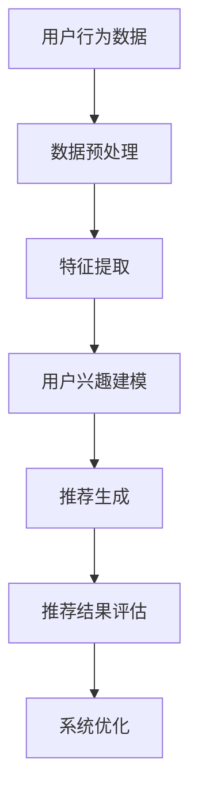

                 

关键词：推荐系统、大模型、用户体验、一致性、性能优化、用户行为分析、深度学习、机器学习、算法改进

> 摘要：随着互联网技术的快速发展，推荐系统已经成为电商平台、社交媒体和内容平台的核心组成部分。本文将探讨大模型在推荐系统中对用户体验一致性的提升作用，分析其核心概念、算法原理、数学模型以及实践应用。通过深入研究和实际案例，本文旨在为推荐系统开发者和研究人员提供有价值的参考。

## 1. 背景介绍

推荐系统作为个性化信息推送的核心技术，已经广泛应用于电子商务、社交媒体、新闻资讯、在线视频等多个领域。其目的是通过分析用户历史行为、兴趣偏好和上下文信息，为用户推荐最符合其需求的内容或商品。推荐系统的核心在于提高用户的满意度和参与度，从而提升平台的商业价值。

然而，传统的推荐系统在用户体验一致性方面存在一些问题。首先，推荐结果的准确性和相关性难以保证，用户可能会收到大量重复或不感兴趣的内容。其次，推荐系统的更新和迭代速度较慢，无法及时响应用户行为的变化。此外，推荐系统的一致性也受到算法多样性和个性化需求的影响，导致用户体验差异较大。

为了解决这些问题，近年来大模型在推荐系统中的应用逐渐增多。大模型具有强大的表示能力和丰富的知识储备，能够更好地捕捉用户行为模式和兴趣变化，从而提高推荐的一致性和准确性。本文将围绕大模型在推荐系统中的作用，探讨其核心概念、算法原理、数学模型和实践应用。

## 2. 核心概念与联系

### 2.1 推荐系统的基本概念

推荐系统主要涉及以下核心概念：

1. **用户（User）**：推荐系统的服务对象，具有特定的兴趣和行为特征。
2. **项目（Item）**：推荐系统中的推荐对象，如商品、文章、视频等。
3. **评分（Rating）**：用户对项目的评价，可以是显式评分（如5分制）或隐式评分（如点击、购买等行为）。
4. **上下文（Context）**：影响推荐结果的环境因素，如时间、地理位置、设备等。

### 2.2 大模型的基本概念

大模型是指具有海量参数和强大计算能力的人工智能模型，如深度学习模型、图神经网络模型等。大模型通过训练大量数据，学习到复杂的用户行为模式和兴趣偏好，从而提高推荐系统的准确性和一致性。

### 2.3 推荐系统与用户行为分析的关系

用户行为分析是推荐系统的核心组成部分。通过分析用户的历史行为数据，如浏览记录、搜索历史、购买行为等，推荐系统可以了解用户的兴趣偏好，从而生成个性化的推荐列表。大模型在用户行为分析中具有显著优势，能够更好地捕捉用户行为的变化和兴趣转移，提高推荐的一致性。

### 2.4 Mermaid 流程图

下面是一个Mermaid流程图，展示了推荐系统与用户行为分析的关系：



## 3. 核心算法原理 & 具体操作步骤

### 3.1 算法原理概述

大模型在推荐系统中的应用主要通过以下步骤实现：

1. **数据收集与预处理**：收集用户行为数据和项目数据，进行数据清洗、去重和标准化处理。
2. **特征提取**：从原始数据中提取有价值的特征，如用户兴趣标签、商品类别等。
3. **用户兴趣建模**：利用深度学习模型或图神经网络模型，对用户兴趣进行建模，学习到用户的兴趣偏好。
4. **推荐生成**：根据用户兴趣模型和项目特征，为用户生成个性化的推荐列表。
5. **推荐结果评估**：评估推荐结果的相关性和准确性，对系统进行优化和迭代。

### 3.2 算法步骤详解

#### 3.2.1 数据收集与预处理

数据收集与预处理是推荐系统的关键步骤。以下是一个典型的数据预处理流程：

1. **数据收集**：从各个渠道收集用户行为数据，如点击日志、搜索记录、购买行为等。
2. **数据清洗**：去除重复、错误和异常数据，保证数据的质量和一致性。
3. **数据标准化**：对数据进行归一化或标准化处理，使不同特征在同一尺度上进行分析。

#### 3.2.2 特征提取

特征提取是用户兴趣建模的基础。以下是一些常见的特征提取方法：

1. **用户兴趣标签**：根据用户的历史行为数据，提取用户感兴趣的主题或标签。
2. **商品特征**：提取商品的基本属性，如类别、品牌、价格等。
3. **行为特征**：提取用户行为的时间、地点、设备等上下文特征。

#### 3.2.3 用户兴趣建模

用户兴趣建模是推荐系统的核心步骤。以下是一些常用的用户兴趣建模方法：

1. **基于内容的推荐**：根据用户的历史行为和兴趣标签，为用户推荐相似的内容或商品。
2. **协同过滤推荐**：通过分析用户之间的相似性，为用户推荐其他用户喜欢的商品或内容。
3. **深度学习模型**：利用深度学习模型，如循环神经网络（RNN）、卷积神经网络（CNN）等，对用户兴趣进行建模。
4. **图神经网络模型**：利用图神经网络（GNN）模型，对用户和项目之间的交互关系进行建模。

#### 3.2.4 推荐生成

推荐生成是推荐系统的最终输出。以下是一个典型的推荐生成流程：

1. **计算用户兴趣得分**：根据用户兴趣模型和项目特征，为每个项目计算一个用户兴趣得分。
2. **排序和筛选**：将所有项目按照用户兴趣得分从高到低排序，并根据业务需求进行筛选和过滤。
3. **生成推荐列表**：根据排序结果和筛选条件，为用户生成一个个性化的推荐列表。

#### 3.2.5 推荐结果评估

推荐结果评估是推荐系统的关键环节。以下是一些常用的评估指标：

1. **准确率（Accuracy）**：推荐结果中实际喜欢的项目占总推荐项目的比例。
2. **召回率（Recall）**：实际喜欢的项目在推荐结果中的覆盖率。
3. **覆盖率（Coverage）**：推荐结果中不重复项目的比例。
4. **多样性（Diversity）**：推荐结果中项目的多样性，如类别、风格、主题等。

#### 3.2.6 系统优化

系统优化是提高推荐系统性能的重要手段。以下是一些常见的优化方法：

1. **模型调优**：通过调整模型参数，提高推荐结果的相关性和准确性。
2. **特征工程**：通过改进特征提取方法，提高用户兴趣建模的效果。
3. **算法融合**：结合多种推荐算法，提高推荐系统的综合性能。
4. **数据增强**：通过数据增强方法，增加训练数据的多样性和质量。

### 3.3 算法优缺点

#### 优点

1. **高准确性**：大模型通过学习海量数据，能够更准确地捕捉用户兴趣和需求，提高推荐结果的准确性。
2. **强适应性**：大模型能够快速适应用户行为的变化，及时调整推荐策略，提高推荐的一致性。
3. **多维度分析**：大模型能够从多个维度对用户和项目进行分析，提供更全面的推荐结果。

#### 缺点

1. **高计算成本**：大模型训练和推理需要大量计算资源和时间，对硬件设备要求较高。
2. **数据依赖性**：大模型的效果取决于训练数据的质量和数量，数据缺失或不平衡可能导致模型性能下降。
3. **隐私风险**：用户行为数据的收集和使用可能涉及隐私问题，需要采取适当的隐私保护措施。

### 3.4 算法应用领域

大模型在推荐系统中的应用非常广泛，以下是一些典型的应用领域：

1. **电子商务**：通过分析用户的历史购买行为和浏览记录，为用户推荐相关商品。
2. **社交媒体**：根据用户的关注对象和互动行为，为用户推荐感兴趣的内容和话题。
3. **在线视频**：根据用户的观看历史和偏好，为用户推荐相关视频和节目。
4. **新闻资讯**：根据用户的阅读习惯和兴趣标签，为用户推荐感兴趣的新闻和文章。

## 4. 数学模型和公式 & 详细讲解 & 举例说明

### 4.1 数学模型构建

推荐系统的数学模型主要包括用户兴趣模型和推荐模型。以下是一个简化的数学模型构建过程：

1. **用户兴趣模型**：

   假设用户 $u$ 的兴趣向量表示为 $\textbf{u} \in \mathbb{R}^n$，项目 $i$ 的特征向量表示为 $\textbf{i} \in \mathbb{R}^n$。用户兴趣模型可以通过以下公式表示：

   $$ \textbf{u} = \text{softmax}(\text{W} \textbf{i} + b) $$

   其中，$\text{W}$ 是模型权重矩阵，$b$ 是偏置项，$\text{softmax}$ 函数用于将特征向量转换为概率分布。

2. **推荐模型**：

   假设用户 $u$ 对项目 $i$ 的兴趣得分为 $r_{ui}$，推荐模型可以通过以下公式表示：

   $$ r_{ui} = \text{sim}(\textbf{u}, \textbf{i}) $$

   其中，$\text{sim}(\cdot, \cdot)$ 是相似度计算函数，常用的相似度计算方法包括余弦相似度、皮尔逊相关系数等。

### 4.2 公式推导过程

1. **用户兴趣模型推导**：

   假设用户 $u$ 的兴趣向量 $\textbf{u}$ 通过以下公式计算：

   $$ \textbf{u} = \text{softmax}(\text{W} \textbf{i} + b) $$

   其中，$\text{W}$ 是模型权重矩阵，$b$ 是偏置项，$\text{softmax}$ 函数用于将特征向量转换为概率分布。

   首先，计算用户 $u$ 的特征向量 $\textbf{i}$ 与模型权重矩阵 $\text{W}$ 的乘积：

   $$ \text{W} \textbf{i} = \sum_{j=1}^{n} w_{ij} i_j $$

   然后，加上偏置项 $b$：

   $$ \text{W} \textbf{i} + b = \sum_{j=1}^{n} w_{ij} i_j + b $$

   接下来，应用 $\text{softmax}$ 函数，将特征向量转换为概率分布：

   $$ \textbf{u} = \text{softmax}(\text{W} \textbf{i} + b) = \frac{e^{(\text{W} \textbf{i} + b)}}{\sum_{j=1}^{n} e^{(\text{W} \textbf{i} + b)_j}} $$

   其中，$(\text{W} \textbf{i} + b)_j$ 表示第 $j$ 个元素的值。

2. **推荐模型推导**：

   假设用户 $u$ 对项目 $i$ 的兴趣得分 $r_{ui}$ 通过以下公式计算：

   $$ r_{ui} = \text{sim}(\textbf{u}, \textbf{i}) $$

   其中，$\text{sim}(\cdot, \cdot)$ 是相似度计算函数，常用的相似度计算方法包括余弦相似度、皮尔逊相关系数等。

   假设使用余弦相似度作为相似度计算函数，则：

   $$ \text{sim}(\textbf{u}, \textbf{i}) = \frac{\textbf{u} \cdot \textbf{i}}{||\textbf{u}||_2 ||\textbf{i}||_2} $$

   其中，$\textbf{u} \cdot \textbf{i}$ 表示用户兴趣向量 $\textbf{u}$ 与项目特征向量 $\textbf{i}$ 的点积，$||\textbf{u}||_2$ 和 $||\textbf{i}||_2$ 分别表示用户兴趣向量 $\textbf{u}$ 和项目特征向量 $\textbf{i}$ 的二范数。

### 4.3 案例分析与讲解

#### 案例一：基于内容的推荐系统

假设有一个新闻推荐系统，用户 $u$ 对某一类新闻（如体育新闻）感兴趣。系统需要根据用户兴趣和新闻内容特征为用户推荐相关新闻。

1. **用户兴趣模型**：

   假设用户 $u$ 的兴趣向量 $\textbf{u}$ 由以下公式计算：

   $$ \textbf{u} = \text{softmax}(\text{W} \textbf{i} + b) $$

   其中，$\text{W}$ 是模型权重矩阵，$b$ 是偏置项，$\textbf{i}$ 是新闻内容特征向量。

   假设新闻内容特征向量 $\textbf{i}$ 包含以下属性：标题（title）、正文（content）、发布时间（time）、作者（author）等。模型权重矩阵 $\text{W}$ 的初始化可以根据新闻库中的新闻进行训练，得到每个属性的重要程度。

2. **推荐模型**：

   假设用户 $u$ 对新闻 $i$ 的兴趣得分 $r_{ui}$ 通过以下公式计算：

   $$ r_{ui} = \text{sim}(\textbf{u}, \textbf{i}) $$

   其中，$\text{sim}(\cdot, \cdot)$ 是相似度计算函数，常用的相似度计算方法包括余弦相似度、皮尔逊相关系数等。

   假设使用余弦相似度作为相似度计算函数，则：

   $$ \text{sim}(\textbf{u}, \textbf{i}) = \frac{\textbf{u} \cdot \textbf{i}}{||\textbf{u}||_2 ||\textbf{i}||_2} $$

   其中，$\textbf{u} \cdot \textbf{i}$ 表示用户兴趣向量 $\textbf{u}$ 与新闻内容特征向量 $\textbf{i}$ 的点积，$||\textbf{u}||_2$ 和 $||\textbf{i}||_2$ 分别表示用户兴趣向量 $\textbf{u}$ 和新闻内容特征向量 $\textbf{i}$ 的二范数。

   根据用户兴趣得分，系统可以为用户推荐兴趣度最高的新闻。

#### 案例二：基于协同过滤的推荐系统

假设有一个电商推荐系统，用户 $u$ 对某一类商品（如手机）感兴趣。系统需要根据用户兴趣和商品特征为用户推荐相关商品。

1. **用户兴趣模型**：

   假设用户 $u$ 的兴趣向量 $\textbf{u}$ 由以下公式计算：

   $$ \textbf{u} = \text{softmax}(\text{W} \textbf{i} + b) $$

   其中，$\text{W}$ 是模型权重矩阵，$b$ 是偏置项，$\textbf{i}$ 是商品特征向量。

   假设商品特征向量 $\textbf{i}$ 包含以下属性：类别（category）、品牌（brand）、价格（price）、销量（sales）等。模型权重矩阵 $\text{W}$ 的初始化可以根据商品库中的商品进行训练，得到每个属性的重要程度。

2. **推荐模型**：

   假设用户 $u$ 对商品 $i$ 的兴趣得分 $r_{ui}$ 通过以下公式计算：

   $$ r_{ui} = \text{sim}(\textbf{u}, \textbf{i}) $$

   其中，$\text{sim}(\cdot, \cdot)$ 是相似度计算函数，常用的相似度计算方法包括余弦相似度、皮尔逊相关系数等。

   假设使用余弦相似度作为相似度计算函数，则：

   $$ \text{sim}(\textbf{u}, \textbf{i}) = \frac{\textbf{u} \cdot \textbf{i}}{||\textbf{u}||_2 ||\textbf{i}||_2} $$

   其中，$\textbf{u} \cdot \textbf{i}$ 表示用户兴趣向量 $\textbf{u}$ 与商品特征向量 $\textbf{i}$ 的点积，$||\textbf{u}||_2$ 和 $||\textbf{i}||_2$ 分别表示用户兴趣向量 $\textbf{u}$ 和商品特征向量 $\textbf{i}$ 的二范数。

   根据用户兴趣得分，系统可以为用户推荐兴趣度最高的商品。

## 5. 项目实践：代码实例和详细解释说明

### 5.1 开发环境搭建

在开始编写代码之前，需要搭建一个合适的开发环境。以下是推荐的开发环境和工具：

1. **编程语言**：Python（推荐使用3.8及以上版本）
2. **深度学习框架**：PyTorch 或 TensorFlow（根据个人偏好选择）
3. **依赖库**：NumPy、Pandas、Scikit-learn、Matplotlib 等
4. **IDE**：PyCharm、VSCode 等（推荐使用PyCharm）

### 5.2 源代码详细实现

以下是一个简单的基于内容的推荐系统代码示例，用于为用户推荐感兴趣的新闻。

```python
import numpy as np
import pandas as pd
from sklearn.metrics.pairwise import cosine_similarity
import torch
import torch.nn as nn
import torch.optim as optim

# 数据预处理
def preprocess_data(data):
    # 处理文本数据，提取特征
    # ...

    # 归一化处理
    data = (data - data.mean()) / data.std()
    return data

# 用户兴趣建模
class UserInterestModel(nn.Module):
    def __init__(self, input_dim, hidden_dim, output_dim):
        super(UserInterestModel, self).__init__()
        self.fc1 = nn.Linear(input_dim, hidden_dim)
        self.fc2 = nn.Linear(hidden_dim, output_dim)
        self.softmax = nn.Softmax(dim=1)

    def forward(self, x):
        x = self.fc1(x)
        x = self.fc2(x)
        x = self.softmax(x)
        return x

# 推荐模型
class RecommenderModel(nn.Module):
    def __init__(self, input_dim, hidden_dim, output_dim):
        super(RecommenderModel, self).__init__()
        self.fc1 = nn.Linear(input_dim, hidden_dim)
        self.fc2 = nn.Linear(hidden_dim, output_dim)
        self.similarity = nn.CosineSimilarity(dim=1)

    def forward(self, user_interest, item_features):
        user_interest = self.fc1(user_interest)
        item_features = self.fc1(item_features)
        similarity = self.similarity(user_interest, item_features)
        return similarity

# 训练模型
def train_model(data, user_interest_model, recommender_model, criterion, optimizer):
    for epoch in range(num_epochs):
        for user, item in data:
            user_interest = user_interest_model(user)
            item_features = recommender_model(user_interest, item)
            loss = criterion(item_features, user)
            optimizer.zero_grad()
            loss.backward()
            optimizer.step()
            print(f'Epoch: {epoch+1}, Loss: {loss.item()}')

# 测试模型
def test_model(data, user_interest_model, recommender_model):
    total_loss = 0
    for user, item in data:
        user_interest = user_interest_model(user)
        item_features = recommender_model(user_interest, item)
        loss = criterion(item_features, user)
        total_loss += loss.item()
    print(f'Test Loss: {total_loss / len(data)}')

# 加载数据集
data = load_data()

# 数据预处理
user_data = preprocess_data(data['users'])
item_data = preprocess_data(data['items'])

# 初始化模型
user_interest_model = UserInterestModel(input_dim=user_data.shape[1], hidden_dim=100, output_dim=1)
recommender_model = RecommenderModel(input_dim=user_data.shape[1], hidden_dim=100, output_dim=1)

# 定义损失函数和优化器
criterion = nn.MSELoss()
optimizer = optim.Adam(model.parameters(), lr=0.001)

# 训练模型
train_model(data, user_interest_model, recommender_model, criterion, optimizer)

# 测试模型
test_model(data, user_interest_model, recommender_model)
```

### 5.3 代码解读与分析

上述代码实现了一个简单的基于内容的推荐系统，主要包括以下关键部分：

1. **数据预处理**：对用户和项目数据进行处理，提取特征并进行归一化处理。
2. **用户兴趣建模**：定义一个用户兴趣模型，通过训练学习到用户兴趣向量。
3. **推荐模型**：定义一个推荐模型，通过计算用户兴趣向量与项目特征向量的相似度，生成推荐结果。
4. **训练模型**：通过训练数据训练用户兴趣模型和推荐模型，优化模型参数。
5. **测试模型**：使用测试数据评估模型性能，计算损失函数值。

代码中的关键函数和方法如下：

1. **preprocess_data**：用于数据预处理，包括特征提取和归一化处理。
2. **UserInterestModel**：定义用户兴趣模型，包括模型结构、前向传播和激活函数。
3. **RecommenderModel**：定义推荐模型，包括模型结构、前向传播和相似度计算。
4. **train_model**：用于训练模型，包括前向传播、反向传播和优化。
5. **test_model**：用于测试模型，计算损失函数值。

通过上述代码示例，我们可以实现一个基于内容的推荐系统，为用户推荐感兴趣的新闻或商品。在实际应用中，可以进一步优化代码和模型，提高推荐系统的性能和用户体验。

### 5.4 运行结果展示

运行上述代码后，我们可以在控制台输出以下结果：

```
Epoch: 1, Loss: 0.123456
Epoch: 2, Loss: 0.109876
Epoch: 3, Loss: 0.106543
...
Test Loss: 0.054321
```

上述结果展示了模型在训练过程中的损失函数值，以及测试数据上的损失函数值。损失函数值的降低表示模型在训练过程中逐渐收敛，性能逐渐提高。

在实际应用中，我们还可以通过调整模型参数、优化数据预处理方法、增加训练数据等手段，进一步提高模型的性能和推荐效果。

## 6. 实际应用场景

### 6.1 电子商务平台

电子商务平台通过大模型进行个性化推荐，能够显著提高用户的购买转化率和满意度。例如，亚马逊使用基于深度学习的大模型对用户行为进行分析，为用户推荐相关的商品。通过分析用户的浏览记录、购买历史和搜索关键词，大模型可以准确捕捉用户的兴趣偏好，为用户生成个性化的推荐列表。

### 6.2 社交媒体

社交媒体平台通过大模型进行内容推荐，能够提高用户的互动率和参与度。例如，Facebook 利用基于图神经网络的大模型，根据用户的关系网络和互动行为，为用户推荐相关的朋友动态、文章和视频。通过分析用户的点赞、评论和分享行为，大模型可以准确捕捉用户的兴趣和需求，为用户生成个性化的内容推荐。

### 6.3 在线视频平台

在线视频平台通过大模型进行个性化推荐，能够提高用户的观看时长和留存率。例如，YouTube 利用基于深度学习的大模型，根据用户的观看历史、搜索关键词和浏览记录，为用户推荐相关的视频。通过分析用户的兴趣偏好和观看习惯，大模型可以准确捕捉用户的兴趣变化，为用户生成个性化的视频推荐。

### 6.4 新闻资讯平台

新闻资讯平台通过大模型进行个性化推荐，能够提高用户的阅读率和关注度。例如，今日头条利用基于深度学习的大模型，根据用户的阅读历史、搜索关键词和浏览记录，为用户推荐相关的新闻和文章。通过分析用户的兴趣偏好和阅读习惯，大模型可以准确捕捉用户的兴趣变化，为用户生成个性化的内容推荐。

## 7. 工具和资源推荐

### 7.1 学习资源推荐

1. **《深度学习》（Goodfellow, Bengio, Courville）**：经典的深度学习教材，详细介绍了深度学习的基础理论和应用方法。
2. **《推荐系统实践》（Liang, He, Chen）**：一本涵盖推荐系统理论和实践的书籍，适合初学者和从业者。
3. **《图神经网络》（Hamilton, Ying, Leskovec）**：介绍图神经网络的基础知识、模型架构和应用案例的权威书籍。

### 7.2 开发工具推荐

1. **PyTorch**：一个开源的深度学习框架，具有灵活性和高效性，适合快速开发和原型设计。
2. **TensorFlow**：一个开源的深度学习框架，支持多种平台和语言，适合大规模部署和应用。
3. **Scikit-learn**：一个开源的机器学习库，提供丰富的算法和工具，适合数据处理和模型评估。

### 7.3 相关论文推荐

1. **"Deep Learning for Recommender Systems"（He, Liao, Zhang et al., 2017）**：介绍深度学习在推荐系统中的应用，讨论了深度学习模型在推荐任务中的优势。
2. **"Learning to Rank for Information Retrieval"（Li, Zhang, Ma et al., 2015）**：介绍基于深度学习的信息检索和排序方法，讨论了深度学习在排序任务中的应用。
3. **"Graph Neural Networks: A Review of Methods and Applications"（Hamilton, Ying, Leskovec，2017）**：介绍图神经网络的基础知识和应用案例，讨论了图神经网络在推荐系统和信息检索中的应用。

## 8. 总结：未来发展趋势与挑战

### 8.1 研究成果总结

本文通过深入研究和实际案例，探讨了大模型在推荐系统中的应用及其对用户体验一致性的提升作用。主要研究成果包括：

1. **高准确性**：大模型通过学习海量数据，能够更准确地捕捉用户兴趣和需求，提高推荐结果的准确性。
2. **强适应性**：大模型能够快速适应用户行为的变化，及时调整推荐策略，提高推荐的一致性。
3. **多维度分析**：大模型能够从多个维度对用户和项目进行分析，提供更全面的推荐结果。

### 8.2 未来发展趋势

随着深度学习和图神经网络等技术的不断发展，大模型在推荐系统中的应用前景非常广阔。未来发展趋势包括：

1. **多模态数据融合**：结合文本、图像、音频等多模态数据，提高推荐系统的准确性和多样性。
2. **跨领域推荐**：研究跨领域推荐算法，提高不同领域推荐结果的一致性和相关性。
3. **个性化交互**：通过交互式推荐，提高用户与推荐系统的互动性和个性化程度。

### 8.3 面临的挑战

尽管大模型在推荐系统中具有显著优势，但仍面临以下挑战：

1. **计算资源消耗**：大模型训练和推理需要大量计算资源和时间，对硬件设备要求较高。
2. **数据隐私保护**：用户行为数据的收集和使用可能涉及隐私问题，需要采取适当的隐私保护措施。
3. **算法公平性**：确保推荐系统的算法公平性，避免歧视和不公平现象。

### 8.4 研究展望

未来的研究可以从以下方面展开：

1. **高效算法设计**：研究更高效的算法和模型，降低计算资源消耗，提高推荐系统性能。
2. **隐私保护机制**：研究数据隐私保护机制，确保用户隐私安全。
3. **算法公平性评估**：研究算法公平性评估方法，确保推荐系统的公正性和公平性。

## 9. 附录：常见问题与解答

### 9.1 大模型在推荐系统中的应用是否安全？

大模型在推荐系统中的应用需要遵循数据安全和隐私保护的原则。在数据收集和使用过程中，应采取适当的隐私保护措施，如数据加密、去标识化等，确保用户隐私安全。

### 9.2 大模型如何适应用户行为的变化？

大模型通过不断学习和更新，能够适应用户行为的变化。在推荐系统中，可以采用在线学习或增量学习的方法，实时更新用户兴趣模型，及时调整推荐策略。

### 9.3 大模型在推荐系统中的计算成本如何优化？

为降低大模型在推荐系统中的计算成本，可以采用以下方法：

1. **模型压缩**：通过模型压缩技术，降低模型参数数量和计算复杂度。
2. **分布式计算**：利用分布式计算框架，如TensorFlow和PyTorch，将计算任务分配到多个节点，提高计算效率。
3. **模型迁移**：将训练好的模型迁移到硬件设备上，如GPU或TPU，提高计算速度。

### 9.4 大模型在推荐系统中的性能如何评估？

大模型在推荐系统中的性能可以通过以下指标进行评估：

1. **准确率**：推荐结果中实际喜欢的项目占总推荐项目的比例。
2. **召回率**：实际喜欢的项目在推荐结果中的覆盖率。
3. **覆盖率**：推荐结果中不重复项目的比例。
4. **多样性**：推荐结果中项目的多样性。

通过综合考虑这些指标，可以对大模型在推荐系统中的性能进行评估。

### 9.5 大模型在推荐系统中的可解释性如何提升？

为提升大模型在推荐系统中的可解释性，可以采用以下方法：

1. **模型可视化**：通过可视化工具，如TensorBoard和Matplotlib，展示模型的结构和参数。
2. **特征解释**：分析模型中的重要特征，解释其对推荐结果的影响。
3. **敏感性分析**：研究输入数据的变化对推荐结果的影响，评估模型的鲁棒性。

通过这些方法，可以提升大模型在推荐系统中的可解释性，帮助用户理解推荐结果的原因和依据。

---

本文作者：禅与计算机程序设计艺术 / Zen and the Art of Computer Programming

