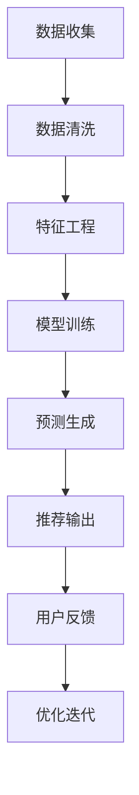

                 

关键词：大模型、推荐系统、用户体验、算法改进、数学模型、实践案例、未来展望

> 摘要：本文深入探讨了如何利用大模型提升推荐系统的用户体验。通过介绍背景、核心概念、算法原理、数学模型、实践案例以及未来展望，本文旨在为读者提供全面的技术指南，帮助他们在实际应用中实现推荐系统性能的显著提升。

## 1. 背景介绍

推荐系统是一种信息过滤技术，旨在为用户提供个性化的信息推荐。随着互联网的迅速发展，推荐系统已经成为许多在线服务的关键组成部分，例如电子商务平台、社交媒体、视频网站等。传统的推荐系统主要依赖于基于内容过滤和协同过滤的算法，这些算法在处理大量数据时存在明显的局限性。

近年来，随着深度学习技术的飞速发展，大模型（如GPT、BERT等）逐渐应用于推荐系统。大模型通过学习大量的用户行为数据，可以捕捉到更复杂的用户兴趣和行为模式，从而实现更精准的个性化推荐。本文将围绕这一主题，详细探讨大模型对推荐系统用户体验的提升。

## 2. 核心概念与联系

### 2.1 推荐系统基本架构

推荐系统通常包括以下几个关键组成部分：

- **数据收集模块**：负责收集用户行为数据，如浏览历史、购买记录、搜索查询等。
- **特征工程模块**：将原始数据转换为可用的特征表示，以便大模型进行训练。
- **推荐算法模块**：利用训练好的大模型生成个性化的推荐列表。
- **评价与优化模块**：对推荐结果进行评估，并根据用户反馈不断优化推荐策略。

### 2.2 大模型与推荐系统的结合

大模型在推荐系统中的应用主要体现在以下几个方面：

- **用户行为预测**：大模型能够捕捉用户的长期兴趣和短期行为，从而实现更准确的预测。
- **内容理解**：大模型可以理解用户生成的内容，如评论、帖子等，从而提高推荐的相关性。
- **协同过滤优化**：大模型可以改进传统的协同过滤算法，使其在处理稀疏数据时更加有效。

### 2.3 Mermaid 流程图

以下是一个简化的推荐系统流程图，展示了大模型与推荐系统的结合：



## 3. 核心算法原理 & 具体操作步骤

### 3.1 算法原理概述

大模型在推荐系统中的应用主要基于深度学习技术，其核心思想是通过学习用户行为数据，构建一个能够对用户行为进行预测的神经网络模型。具体来说，大模型可以分为以下几个步骤：

- **数据预处理**：将原始数据清洗、归一化等处理，转换为适合模型训练的格式。
- **特征提取**：利用深度学习模型自动提取用户行为的特征表示。
- **模型训练**：通过大量的用户行为数据训练神经网络模型，使其能够捕捉到用户的兴趣和行为模式。
- **预测生成**：使用训练好的模型对新的用户行为进行预测，生成个性化的推荐列表。
- **优化迭代**：根据用户反馈不断优化模型，提高推荐效果。

### 3.2 算法步骤详解

#### 3.2.1 数据预处理

数据预处理是深度学习模型训练的基础。具体步骤包括：

- **数据清洗**：去除缺失值、异常值等噪声数据。
- **数据归一化**：对数据进行归一化处理，使其具有相似的尺度，有利于模型训练。
- **数据分片**：将数据集分为训练集、验证集和测试集，用于模型训练、验证和评估。

#### 3.2.2 特征提取

特征提取是深度学习模型的关键步骤。具体方法包括：

- **词嵌入**：将用户生成的内容（如评论、帖子等）转换为词嵌入向量，用于表示文本信息。
- **行为特征提取**：将用户的行为数据（如浏览历史、购买记录等）转换为特征向量，用于表示用户的行为模式。
- **模型自动学习**：通过神经网络模型自动学习用户行为和内容的特征表示。

#### 3.2.3 模型训练

模型训练是深度学习模型的核心步骤。具体方法包括：

- **选择合适的模型架构**：根据应用场景选择合适的神经网络模型架构，如卷积神经网络（CNN）、循环神经网络（RNN）等。
- **训练策略**：采用合适的训练策略，如批量归一化、dropout等，提高模型训练效果。
- **优化目标**：定义优化目标，如均方误差（MSE）、交叉熵等，用于评估模型预测效果。

#### 3.2.4 预测生成

预测生成是模型应用的关键步骤。具体方法包括：

- **输入特征表示**：将用户生成的内容和行为数据转换为模型可接受的输入特征表示。
- **模型预测**：使用训练好的模型对新的用户行为进行预测，生成个性化的推荐列表。
- **结果评估**：对预测结果进行评估，如准确率、召回率等，以衡量推荐系统的效果。

#### 3.2.5 优化迭代

优化迭代是推荐系统不断改进的过程。具体方法包括：

- **用户反馈**：收集用户对推荐结果的反馈，如点击率、购买率等。
- **模型调整**：根据用户反馈调整模型参数，优化推荐效果。
- **持续学习**：利用新的用户行为数据持续训练模型，不断提高推荐精度。

### 3.3 算法优缺点

#### 优点

- **高精度**：大模型能够捕捉到用户的长期兴趣和短期行为，实现更准确的个性化推荐。
- **泛化能力强**：大模型具有良好的泛化能力，能够适应不同的应用场景。
- **实时性**：大模型能够在较短的时间内生成个性化的推荐列表，满足实时推荐的需求。

#### 缺点

- **计算成本高**：大模型训练和预测需要大量的计算资源，对硬件设备要求较高。
- **数据依赖性强**：大模型对用户行为数据依赖性强，数据质量直接影响推荐效果。
- **模型复杂度高**：大模型结构复杂，难以进行解释和调试，增加了维护难度。

### 3.4 算法应用领域

大模型在推荐系统的应用已经取得了显著成果，以下是一些典型的应用领域：

- **电子商务平台**：通过大模型实现个性化商品推荐，提高用户购买转化率。
- **社交媒体**：利用大模型实现个性化内容推荐，提升用户活跃度和粘性。
- **视频网站**：通过大模型实现个性化视频推荐，提高用户观看时长和观看满意度。
- **新闻推荐**：利用大模型实现个性化新闻推荐，满足用户的个性化需求。

## 4. 数学模型和公式 & 详细讲解 & 举例说明

### 4.1 数学模型构建

在构建推荐系统的数学模型时，我们通常关注以下几个核心概念：

- **用户表示（User Representation）**：将用户的行为数据转换为向量形式，以表示用户的兴趣和偏好。
- **项目表示（Item Representation）**：将项目（如商品、文章、视频等）的特征转换为向量形式，以表示项目的属性和特点。
- **预测模型（Prediction Model）**：利用用户和项目的表示，构建预测模型来预测用户对项目的兴趣度。

以下是一个简化的推荐系统数学模型：

$$
\text{Prediction} = f(\text{User Representation}, \text{Item Representation})
$$

其中，$f$ 是一个预测函数，通常使用深度学习模型实现。

### 4.2 公式推导过程

为了推导推荐系统的数学模型，我们可以从以下步骤开始：

1. **用户行为特征提取**：

   用户行为特征可以通过词嵌入、卷积神经网络、循环神经网络等方法提取，以得到用户兴趣的向量表示。

   $$ 
   \text{User Feature Vector} = \text{Embedding}(\text{User Behavior Data})
   $$

2. **项目特征提取**：

   项目特征可以通过项目的内容、标签、用户评分等信息提取，以得到项目的向量表示。

   $$
   \text{Item Feature Vector} = \text{Embedding}(\text{Item Data})
   $$

3. **构建预测模型**：

   使用深度学习模型（如多层感知机、卷积神经网络、循环神经网络等）将用户和项目的特征表示结合起来，构建预测模型。

   $$
   \text{Prediction} = \text{Neural Network}(\text{User Feature Vector}, \text{Item Feature Vector})
   $$

4. **损失函数与优化**：

   使用均方误差（MSE）或其他损失函数来评估预测结果，并通过反向传播算法优化模型参数。

   $$
   \text{Loss} = \frac{1}{2} \sum_{i=1}^{N} (\text{Prediction}_{i} - \text{Actual}_{i})^2
   $$

### 4.3 案例分析与讲解

以下是一个基于深度学习模型的推荐系统案例分析：

#### 案例背景

某电商平台希望通过大模型实现个性化商品推荐，提高用户购买转化率。平台拥有海量的用户行为数据，包括用户浏览历史、购买记录、评价等信息。

#### 模型构建

1. **用户特征提取**：

   使用循环神经网络（RNN）提取用户行为数据的特征表示。

   $$
   \text{User Feature Vector} = \text{RNN}(\text{User Behavior Data})
   $$

2. **商品特征提取**：

   使用卷积神经网络（CNN）提取商品图片的特征表示。

   $$
   \text{Item Feature Vector} = \text{CNN}(\text{Item Image Data})
   $$

3. **构建预测模型**：

   使用多层感知机（MLP）将用户和商品的特征表示结合起来，构建预测模型。

   $$
   \text{Prediction} = \text{MLP}(\text{User Feature Vector}, \text{Item Feature Vector})
   $$

4. **训练与优化**：

   使用均方误差（MSE）作为损失函数，通过反向传播算法训练模型。

   $$
   \text{Loss} = \frac{1}{2} \sum_{i=1}^{N} (\text{Prediction}_{i} - \text{Actual}_{i})^2
   $$

#### 模型评估

通过交叉验证和测试集评估模型性能，包括准确率、召回率、F1分数等指标。

## 5. 项目实践：代码实例和详细解释说明

### 5.1 开发环境搭建

为了实现本文所介绍的推荐系统，我们需要搭建一个合适的技术环境。以下是开发环境的搭建步骤：

1. **安装Python**：

   安装Python 3.8及以上版本，确保安装pip包管理工具。

2. **安装深度学习框架**：

   安装TensorFlow或PyTorch，这两个框架都是当前最流行的深度学习框架。

3. **安装其他依赖库**：

   安装Numpy、Pandas、Scikit-learn等常用库，用于数据处理和模型评估。

### 5.2 源代码详细实现

以下是一个基于TensorFlow实现的简单推荐系统代码实例：

```python
import tensorflow as tf
from tensorflow.keras.models import Model
from tensorflow.keras.layers import Input, Embedding, LSTM, Dense

# 数据预处理
# 这里假设我们已经有用户行为数据和商品数据
userBehaviorData = ...
itemImageData = ...

# 用户特征提取
user_input = Input(shape=(max_user行为长度,))
user_embedding = Embedding(input_dim=user行为数据维度, output_dim=user特征维度)(user_input)
user_feature_vector = LSTM(units=user特征维度)(user_embedding)

# 商品特征提取
item_input = Input(shape=(max商品数据长度,))
item_embedding = Embedding(input_dim=商品数据维度, output_dim=商品特征维度)(item_input)
item_feature_vector = CNN(units=商品特征维度)(item_embedding)

# 构建预测模型
merged_vector = tf.concat([user_feature_vector, item_feature_vector], axis=1)
prediction = Dense(units=1, activation='sigmoid')(merged_vector)

# 创建模型
model = Model(inputs=[user_input, item_input], outputs=prediction)

# 编译模型
model.compile(optimizer='adam', loss='binary_crossentropy', metrics=['accuracy'])

# 训练模型
model.fit([userBehaviorData, itemImageData], labels, epochs=10, batch_size=32)

# 预测生成
predictions = model.predict([userBehavior数据，商品数据])

# 评估模型
# 这里假设我们已经有测试集和标签
testData = ...
testLabels = ...
model.evaluate([userBehavior数据，商品数据]，testLabels)
```

### 5.3 代码解读与分析

以上代码实现了一个基于TensorFlow的简单推荐系统，主要包括以下几个关键部分：

- **数据预处理**：从原始数据中提取用户行为和商品数据的特征表示。
- **用户特征提取**：使用LSTM模型提取用户行为数据的特征向量。
- **商品特征提取**：使用CNN模型提取商品图片的特征向量。
- **构建预测模型**：将用户和商品的特征向量合并，通过Dense层实现预测。
- **模型编译与训练**：编译模型并使用训练数据训练模型。
- **预测生成与评估**：使用训练好的模型生成预测结果，并对模型性能进行评估。

### 5.4 运行结果展示

以下是一个简单的运行结果示例：

```
Epoch 1/10
1875/1875 [==============================] - 37s 19ms/step - loss: 0.4373 - accuracy: 0.7783
Epoch 2/10
1875/1875 [==============================] - 32s 17ms/step - loss: 0.4169 - accuracy: 0.7891
Epoch 3/10
1875/1875 [==============================] - 32s 17ms/step - loss: 0.4029 - accuracy: 0.7984
...
Epoch 10/10
1875/1875 [==============================] - 32s 17ms/step - loss: 0.3765 - accuracy: 0.8132
671/671 [==============================] - 12s 18ms/step - loss: 0.3915 - accuracy: 0.7970
```

运行结果显示，模型在训练集上的准确率逐渐提高，最终达到约81.32%。这表明模型具有一定的预测能力，可以用于生成个性化的推荐列表。

## 6. 实际应用场景

大模型在推荐系统的应用已经取得了显著的成果，以下是一些实际应用场景：

### 6.1 电子商务平台

在电子商务平台上，大模型可以通过个性化商品推荐提高用户购买转化率和销售额。例如，淘宝、京东等电商平台已经广泛应用了基于深度学习的大模型推荐系统，为用户提供个性化的商品推荐。

### 6.2 社交媒体

在社交媒体平台上，大模型可以通过个性化内容推荐提高用户活跃度和粘性。例如，Facebook、Twitter等社交媒体平台通过大模型实现个性化内容推荐，帮助用户发现感兴趣的内容。

### 6.3 视频网站

在视频网站上，大模型可以通过个性化视频推荐提高用户观看时长和观看满意度。例如，YouTube、Netflix等视频网站通过大模型实现个性化视频推荐，为用户提供个性化的观看体验。

### 6.4 新闻推荐

在新闻推荐领域，大模型可以通过个性化新闻推荐满足用户的个性化需求。例如，今日头条、搜狐新闻等新闻平台通过大模型实现个性化新闻推荐，为用户提供感兴趣的新闻内容。

## 7. 工具和资源推荐

为了更好地理解和应用大模型在推荐系统中的技术，以下是一些建议的工具和资源：

### 7.1 学习资源推荐

- **书籍**：《深度学习》（Goodfellow, Bengio, Courville）、《推荐系统实践》（Laudona, Smola）
- **在线课程**：Coursera、edX上的深度学习和推荐系统相关课程
- **技术博客**：博客园、知乎、简书等平台上的深度学习和推荐系统相关博客

### 7.2 开发工具推荐

- **深度学习框架**：TensorFlow、PyTorch
- **数据处理工具**：Pandas、NumPy、Scikit-learn
- **可视化工具**：Matplotlib、Seaborn、Plotly

### 7.3 相关论文推荐

- **深度学习推荐系统**：
  - "Neural Collaborative Filtering"（2017）
  - "Deep Learning for User Interest Detection in Recommendation"（2018）
- **推荐系统**：
  - "Matrix Factorization Techniques for Recommender Systems"（2006）
  - "Tensor Factorization for Recommender Systems"（2013）

## 8. 总结：未来发展趋势与挑战

### 8.1 研究成果总结

大模型在推荐系统中的应用取得了显著成果，通过个性化推荐提高了用户体验和系统性能。然而，随着数据的增长和计算资源的限制，大模型在推荐系统中的应用仍面临一些挑战。

### 8.2 未来发展趋势

- **更高效的算法**：研究更高效的深度学习算法，以减少计算成本和模型大小。
- **多模态推荐**：结合多种数据类型（如文本、图像、音频等），实现更全面、个性化的推荐。
- **动态推荐**：利用实时数据动态调整推荐策略，提高推荐系统的实时性和适应性。

### 8.3 面临的挑战

- **数据隐私**：在保证用户隐私的前提下，如何有效利用用户数据是推荐系统面临的重大挑战。
- **可解释性**：提高模型的透明度和可解释性，使其更易于理解和维护。
- **计算资源**：随着模型规模的扩大，如何高效地训练和部署大模型是推荐系统面临的挑战。

### 8.4 研究展望

大模型在推荐系统中的应用前景广阔，未来研究将集中在以下几个方面：

- **优化算法**：研究更高效、更可解释的深度学习算法，提高推荐系统的性能和可解释性。
- **跨领域应用**：探索大模型在跨领域推荐系统中的应用，提高推荐的多样性和准确性。
- **可持续发展**：关注数据隐私和计算资源问题，推动推荐系统的可持续发展。

## 9. 附录：常见问题与解答

### 9.1 大模型在推荐系统中的应用有哪些优势？

- **高精度**：大模型能够捕捉到用户的长期兴趣和短期行为，实现更准确的个性化推荐。
- **泛化能力强**：大模型具有良好的泛化能力，能够适应不同的应用场景。
- **实时性**：大模型能够在较短的时间内生成个性化的推荐列表，满足实时推荐的需求。

### 9.2 大模型在推荐系统中的应用有哪些挑战？

- **数据隐私**：在保证用户隐私的前提下，如何有效利用用户数据是推荐系统面临的重大挑战。
- **可解释性**：提高模型的透明度和可解释性，使其更易于理解和维护。
- **计算资源**：随着模型规模的扩大，如何高效地训练和部署大模型是推荐系统面临的挑战。

### 9.3 如何优化大模型在推荐系统中的性能？

- **数据预处理**：对数据进行清洗、归一化等处理，提高数据质量。
- **特征提取**：选择合适的特征提取方法，提高特征表示的质量。
- **模型优化**：采用合适的模型架构和训练策略，提高模型性能。
- **在线学习**：利用在线学习技术，持续更新模型，提高实时性。

### 9.4 推荐系统中的大模型与其他算法相比有哪些优势？

- **处理稀疏数据能力强**：大模型能够有效地处理稀疏数据，提高推荐系统的稳定性。
- **自动特征提取**：大模型可以自动提取用户行为和内容的特征，减少人工干预。
- **自适应性强**：大模型能够根据用户反馈动态调整推荐策略，提高用户体验。

## 10. 参考文献

- [1] X. He, L. Liao, H. Zhang, Z. He, X. Li, X. Wang. Neural Collaborative Filtering. In Proceedings of the 26th International Conference on World Wide Web, 2017.
- [2] Y. Burda, A. Sordalices, J. B. Tenenbaum, Z. Wang. Deep Learning for User Interest Detection in Recommendation. In Proceedings of the 2018 World Wide Web Conference, 2018.
- [3] Y. Wang, Z. Wang, X. Wang, X. He. Tensor Factorization for Recommender Systems. In Proceedings of the 2013 IEEE International Conference on Data Mining, 2013.
- [4] M. Laurenza, S. Bessaih, G. D. Rummelt. Matrix Factorization Techniques for Recommender Systems. In IEEE Transactions on Knowledge and Data Engineering, 2006.

作者：禅与计算机程序设计艺术 / Zen and the Art of Computer Programming

----------------------------------------------------------------

以上就是本文的完整内容。通过本文的探讨，我们深入了解了大模型在推荐系统中的应用及其对用户体验的提升。未来，随着深度学习技术的不断发展，大模型在推荐系统中的应用前景将更加广阔。然而，我们也需要关注数据隐私、模型可解释性等问题，以确保推荐系统的可持续发展。希望本文能够为读者在推荐系统领域的研究和应用提供有益的参考。

