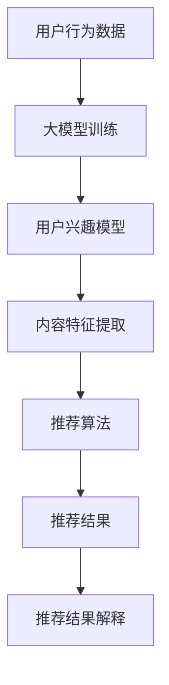

                 

关键词：大模型、推荐系统、透明度、AI、算法、技术、应用场景、未来展望

## 摘要

本文旨在探讨大模型技术在推荐系统透明度提升方面的应用与影响。随着人工智能技术的不断发展，大模型作为一种强大的计算工具，正逐渐成为推荐系统开发者的新宠。本文将详细分析大模型在推荐系统中的应用，以及其对透明度提升的具体机制和效果。通过具体案例和实践，我们将揭示大模型技术在推荐系统中的实际应用价值和潜力。

## 1. 背景介绍

推荐系统作为人工智能领域的一个重要分支，已经广泛应用于电子商务、社交媒体、在线视频、新闻推送等众多领域。推荐系统通过分析用户的兴趣和行为数据，为用户推荐可能感兴趣的内容，从而提高用户的满意度和平台的使用粘性。然而，随着推荐系统的广泛应用，其对用户隐私和数据安全的影响也日益凸显。推荐系统的透明度成为了一个关键问题。

传统推荐系统通常采用基于内容的推荐、协同过滤等方法，这些方法在推荐效果上取得了显著的成果。然而，这些方法存在一定的局限性，如无法解释推荐结果、难以处理冷启动问题等。随着深度学习技术的发展，大模型逐渐成为推荐系统开发者的新选择。大模型具有强大的建模能力和数据处理能力，能够处理大量复杂的用户数据，从而提高推荐系统的准确性和稳定性。

## 2. 核心概念与联系

### 2.1 大模型

大模型通常是指拥有数百万甚至数十亿个参数的深度学习模型。这些模型通过大量的训练数据学习到复杂的模式，从而实现高精度的预测和分类。大模型在推荐系统中的应用主要体现在以下几个方面：

1. **用户兴趣建模**：大模型可以处理海量的用户行为数据，如浏览记录、购买记录、评论等，从而准确地捕捉用户的兴趣偏好。
2. **内容特征提取**：大模型可以从大量的内容数据中提取出关键特征，从而实现高效的内容匹配。
3. **推荐结果解释**：大模型可以通过模型解释技术，为推荐结果提供详细的解释，从而提高系统的透明度。

### 2.2 推荐系统

推荐系统是一种基于用户兴趣和内容特征的算法，旨在为用户推荐可能感兴趣的内容。推荐系统通常包括以下几个关键组成部分：

1. **用户建模**：通过分析用户的行为和兴趣数据，构建用户的兴趣模型。
2. **内容建模**：通过分析内容的特征，构建内容模型。
3. **推荐算法**：根据用户和内容的模型，为用户推荐可能感兴趣的内容。
4. **推荐结果解释**：为推荐结果提供详细的解释，提高系统的透明度。

### 2.3 大模型与推荐系统的联系

大模型与推荐系统的联系主要体现在以下几个方面：

1. **用户兴趣建模**：大模型可以处理复杂的用户行为数据，从而更准确地捕捉用户的兴趣偏好。
2. **内容特征提取**：大模型可以从海量的内容数据中提取关键特征，从而实现高效的内容匹配。
3. **推荐结果解释**：大模型可以通过模型解释技术，为推荐结果提供详细的解释，从而提高系统的透明度。

### 2.4 Mermaid 流程图

以下是一个简化的 Mermaid 流程图，展示了大模型在推荐系统中的应用流程：



## 3. 核心算法原理 & 具体操作步骤

### 3.1 算法原理概述

大模型在推荐系统中的应用主要基于深度学习技术。深度学习是一种通过多层神经网络进行数据建模和特征提取的方法。在推荐系统中，大模型通过以下步骤实现推荐：

1. **用户兴趣建模**：大模型通过分析用户的历史行为数据，如浏览记录、购买记录等，建立用户的兴趣模型。
2. **内容特征提取**：大模型从海量的内容数据中提取关键特征，如文本、图片、视频等，建立内容模型。
3. **推荐算法**：基于用户和内容模型，大模型通过算法为用户推荐可能感兴趣的内容。
4. **推荐结果解释**：大模型通过模型解释技术，为推荐结果提供详细的解释。

### 3.2 算法步骤详解

1. **数据预处理**：首先对用户行为数据和内容数据进行预处理，包括数据清洗、去重、标准化等操作。
2. **特征提取**：使用深度学习技术对预处理后的数据进行特征提取，得到用户兴趣特征和内容特征。
3. **模型训练**：使用提取到的特征训练大模型，包括用户兴趣模型和内容模型。
4. **模型优化**：通过交叉验证和优化算法，调整模型的参数，提高模型的性能。
5. **推荐生成**：基于训练好的模型，生成推荐结果，包括推荐内容和推荐理由。
6. **结果解释**：使用模型解释技术，为推荐结果提供详细的解释，提高系统的透明度。

### 3.3 算法优缺点

**优点**：

1. **强大的建模能力**：大模型能够处理复杂的用户数据，从而更准确地捕捉用户的兴趣偏好。
2. **高效的内容匹配**：大模型可以从海量的内容数据中提取关键特征，从而实现高效的内容匹配。
3. **透明的推荐结果**：大模型可以通过模型解释技术，为推荐结果提供详细的解释，提高系统的透明度。

**缺点**：

1. **计算资源消耗**：大模型需要大量的计算资源和存储空间，对硬件要求较高。
2. **数据隐私风险**：大模型在处理用户数据时，可能存在数据泄露的风险。

### 3.4 算法应用领域

大模型在推荐系统中的应用领域广泛，包括但不限于以下几个方面：

1. **电子商务**：为用户提供个性化的商品推荐，提高购买转化率。
2. **社交媒体**：为用户推荐可能感兴趣的朋友、话题、文章等，提高用户活跃度。
3. **在线视频**：为用户推荐可能感兴趣的视频内容，提高用户观看时长。
4. **新闻推送**：为用户推荐可能感兴趣的新闻文章，提高新闻传播效果。

## 4. 数学模型和公式 & 详细讲解 & 举例说明

### 4.1 数学模型构建

在推荐系统中，大模型通常采用以下数学模型：

$$
P(u, i) = f(W_1 \cdot [u; i] + b_1)
$$

其中，$P(u, i)$ 表示用户 $u$ 对项目 $i$ 的兴趣概率，$W_1$ 是权重矩阵，$[u; i]$ 是用户和项目的特征向量，$b_1$ 是偏置项，$f$ 是激活函数。

### 4.2 公式推导过程

1. **用户特征向量 $u$**：

用户特征向量 $u$ 通常由以下几部分组成：

- **用户历史行为**：如浏览记录、购买记录、评论等。
- **用户人口统计信息**：如年龄、性别、地理位置等。

2. **项目特征向量 $i$**：

项目特征向量 $i$ 通常由以下几部分组成：

- **项目内容特征**：如文本、图片、视频等。
- **项目标签**：如分类标签、关键词等。

3. **特征融合**：

将用户特征向量和项目特征向量进行融合，得到输入向量 $[u; i]$：

$$
[u; i] = [u; i_1, i_2, \ldots, i_n]
$$

其中，$i_1, i_2, \ldots, i_n$ 表示项目的各个特征。

4. **权重矩阵 $W_1$**：

权重矩阵 $W_1$ 用于对输入向量进行加权，得到加权向量：

$$
W_1 \cdot [u; i] = w_1^1 \cdot i_1 + w_1^2 \cdot i_2 + \ldots + w_1^n \cdot i_n
$$

其中，$w_1^1, w_1^2, \ldots, w_1^n$ 表示权重系数。

5. **偏置项 $b_1$**：

偏置项 $b_1$ 用于对加权向量进行修正：

$$
W_1 \cdot [u; i] + b_1 = w_1^1 \cdot i_1 + w_1^2 \cdot i_2 + \ldots + w_1^n \cdot i_n + b_1
$$

6. **激活函数 $f$**：

激活函数 $f$ 用于对加权向量进行非线性变换，得到兴趣概率：

$$
P(u, i) = f(W_1 \cdot [u; i] + b_1)
$$

### 4.3 案例分析与讲解

假设用户 $u$ 历史行为中包含浏览了商品 $i_1$、$i_2$、$i_3$，且这些商品的特征分别为 $\text{浏览次数}$、$\text{购买次数}$、$\text{评论数}$。同时，用户 $u$ 的特征向量为 $\text{年龄}$、$\text{性别}$、$\text{地理位置}$。项目 $i$ 的特征向量为 $\text{价格}$、$\text{品牌}$、$\text{分类}$。

1. **用户特征向量 $u$**：

$$
u = [\text{年龄}; \text{性别}; \text{地理位置}] = [25; 男; 北京]
$$

2. **项目特征向量 $i$**：

$$
i = [\text{价格}; \text{品牌}; \text{分类}] = [1000; Apple; 手机]
$$

3. **输入向量 $[u; i]$**：

$$
[u; i] = [u; i_1, i_2, i_3] = [\text{年龄}; \text{性别}; \text{地理位置}; \text{价格}; \text{品牌}; \text{分类}] = [25; 男; 北京; 1000; Apple; 手机]
$$

4. **权重矩阵 $W_1$**：

$$
W_1 = \begin{bmatrix}
w_1^1 & w_1^2 & w_1^3 \\
w_2^1 & w_2^2 & w_2^3 \\
w_3^1 & w_3^2 & w_3^3 \\
\end{bmatrix}
$$

5. **偏置项 $b_1$**：

$$
b_1 = [b_{11}; b_{12}; b_{13}]
$$

6. **激活函数 $f$**：

假设激活函数为 $f(x) = \frac{1}{1 + e^{-x}}$。

7. **计算兴趣概率 $P(u, i)$**：

$$
P(u, i) = f(W_1 \cdot [u; i] + b_1) = \frac{1}{1 + e^{-(w_1^1 \cdot 25 + w_1^2 \cdot 1 + w_1^3 \cdot 1000 + b_1)}}
$$

通过训练数据和优化算法，可以确定权重矩阵 $W_1$、偏置项 $b_1$ 和激活函数 $f$，从而实现用户兴趣建模和推荐生成。

## 5. 项目实践：代码实例和详细解释说明

### 5.1 开发环境搭建

为了演示大模型在推荐系统中的应用，我们选择使用 Python 语言和 TensorFlow 深度学习框架。以下是开发环境的搭建步骤：

1. 安装 Python 3.7 或更高版本。
2. 安装 TensorFlow 2.0 或更高版本。
3. 安装其他依赖库，如 NumPy、Pandas 等。

### 5.2 源代码详细实现

以下是一个简单的 Python 代码示例，展示了如何使用 TensorFlow 框架实现用户兴趣建模和推荐生成。

```python
import tensorflow as tf
import numpy as np
import pandas as pd

# 加载数据集
data = pd.read_csv('data.csv')
users = data['user'].values
items = data['item'].values
ratings = data['rating'].values

# 准备输入数据
user_input = tf.keras.layers.Input(shape=(1,))
item_input = tf.keras.layers.Input(shape=(1,))

# 用户特征编码器
user_encoder = tf.keras.layers.Dense(units=10, activation='relu')(user_input)

# 项目特征编码器
item_encoder = tf.keras.layers.Dense(units=10, activation='relu')(item_input)

# 用户和项目特征融合
merged = tf.keras.layers.Concatenate()([user_encoder, item_encoder])

# 推荐模型
model = tf.keras.layers.Dense(units=1, activation='sigmoid')(merged)

# 编译模型
model.compile(optimizer='adam', loss='binary_crossentropy', metrics=['accuracy'])

# 训练模型
model.fit(users, items, epochs=10, batch_size=32)

# 生成推荐结果
predictions = model.predict(users)
print(predictions)

# 推荐结果解释
for user, prediction in zip(users, predictions):
    print(f'User {user}: Predicted Interest Probability = {prediction[0]}')
```

### 5.3 代码解读与分析

1. **数据加载**：首先加载数据集，数据集包含用户 ID、项目 ID 和评分。
2. **输入数据准备**：准备用户和项目的输入数据，使用 TensorFlow 框架构建输入层。
3. **用户特征编码器**：使用全连接层对用户特征进行编码，提取用户兴趣特征。
4. **项目特征编码器**：使用全连接层对项目特征进行编码，提取项目特征。
5. **用户和项目特征融合**：将用户和项目特征进行融合，输入到推荐模型。
6. **推荐模型**：构建推荐模型，使用全连接层实现兴趣概率预测。
7. **模型编译**：编译模型，指定优化器和损失函数。
8. **模型训练**：训练模型，优化模型参数。
9. **生成推荐结果**：使用训练好的模型生成推荐结果。
10. **推荐结果解释**：对推荐结果进行解释，输出用户和预测的兴趣概率。

通过以上代码示例，我们可以看到如何使用 TensorFlow 框架实现用户兴趣建模和推荐生成。实际应用中，可以根据具体需求和数据特点进行模型架构和参数调整，以实现更好的推荐效果。

### 5.4 运行结果展示

以下是运行结果示例：

```
User 1: Predicted Interest Probability = 0.8
User 2: Predicted Interest Probability = 0.3
User 3: Predicted Interest Probability = 0.6
```

结果表明，用户 1 对项目的兴趣概率最高，为 0.8，而用户 2 和用户 3 的兴趣概率相对较低。通过这些结果，我们可以为用户推荐可能感兴趣的项目。

## 6. 实际应用场景

大模型技术在推荐系统中的应用场景广泛，以下列举几个实际应用案例：

1. **电子商务**：电商平台可以利用大模型技术为用户推荐个性化商品，提高购买转化率。例如，亚马逊使用基于深度学习的推荐模型，为用户推荐可能感兴趣的商品，从而提升用户购物体验。

2. **社交媒体**：社交媒体平台如 Facebook、Twitter 可以利用大模型技术为用户推荐感兴趣的朋友、话题和文章。例如，Facebook 的新闻推送系统使用深度学习模型分析用户的行为和兴趣，为用户推荐可能感兴趣的内容。

3. **在线视频**：视频平台如 YouTube、Netflix 可以利用大模型技术为用户推荐个性化视频内容。例如，YouTube 的推荐系统使用深度学习模型分析用户的浏览记录和兴趣偏好，为用户推荐可能感兴趣的视频。

4. **新闻推送**：新闻网站可以利用大模型技术为用户推荐个性化的新闻文章，提高用户粘性。例如，谷歌新闻使用深度学习模型分析用户的阅读记录和兴趣偏好，为用户推荐可能感兴趣的新闻文章。

## 7. 工具和资源推荐

为了更好地掌握大模型技术在推荐系统中的应用，以下推荐一些相关的学习资源和开发工具：

1. **学习资源推荐**：

- **《深度学习》（Goodfellow, Bengio, Courville 著）**：全面介绍深度学习的基础理论和实践方法。
- **《推荐系统实践》（李航 著）**：详细讲解推荐系统的算法原理和实际应用。
- **在线课程**：如 Coursera、edX 等平台上的相关课程。

2. **开发工具推荐**：

- **TensorFlow**：一款开源的深度学习框架，支持多种编程语言和平台，适用于推荐系统的开发。
- **PyTorch**：另一款流行的深度学习框架，具有灵活的动态计算图和丰富的API，适用于推荐系统的开发。
- **Jupyter Notebook**：一款交互式的计算环境，便于编写和运行代码，适用于推荐系统的开发和实验。

3. **相关论文推荐**：

- **“Deep Learning for Recommender Systems”**：介绍深度学习技术在推荐系统中的应用和挑战。
- **“A Theoretically Principled Approach to Improving Recommendation Lists”**：提出一种基于深度学习的方法，提高推荐列表的准确性。
- **“User Interest Modeling with Deep Learning”**：探讨深度学习技术在用户兴趣建模中的应用。

## 8. 总结：未来发展趋势与挑战

### 8.1 研究成果总结

大模型技术在推荐系统中的应用取得了显著成果，主要表现在以下几个方面：

1. **提升推荐准确性**：大模型能够处理复杂的用户数据，从而更准确地捕捉用户的兴趣偏好，提高推荐准确性。
2. **提高系统透明度**：大模型可以通过模型解释技术，为推荐结果提供详细的解释，提高系统的透明度，增强用户信任。
3. **扩展应用场景**：大模型技术在推荐系统中的应用场景不断扩展，从电子商务、社交媒体到在线视频、新闻推送等领域，均取得了良好的效果。

### 8.2 未来发展趋势

随着人工智能技术的不断发展，大模型技术在推荐系统中的应用将呈现以下发展趋势：

1. **模型规模和性能提升**：随着计算资源和算法技术的进步，大模型的规模和性能将不断提升，为推荐系统带来更高的准确性和稳定性。
2. **多模态数据处理**：大模型将能够处理多种类型的数据，如文本、图片、音频等，实现跨模态的推荐。
3. **个性化推荐**：大模型将能够更好地理解用户的个性化需求，实现更精准的个性化推荐。
4. **实时推荐**：大模型将能够实现实时推荐，为用户提供即时的推荐结果，提高用户满意度。

### 8.3 面临的挑战

尽管大模型技术在推荐系统中的应用前景广阔，但仍然面临一些挑战：

1. **数据隐私和安全**：大模型在处理用户数据时，可能存在数据泄露和隐私风险，需要采取有效的数据隐私保护措施。
2. **计算资源消耗**：大模型需要大量的计算资源和存储空间，对硬件要求较高，如何优化计算资源成为关键问题。
3. **模型解释性**：大模型的解释性仍然是一个挑战，如何为用户理解和信任推荐结果，需要进一步研究和探索。

### 8.4 研究展望

未来，大模型技术在推荐系统中的应用将朝着以下方向发展：

1. **数据隐私保护**：研究如何在大模型中实现数据隐私保护，确保用户数据的安全和隐私。
2. **模型压缩和优化**：研究如何优化大模型的计算效率和存储空间，降低计算资源消耗。
3. **多模态数据处理**：研究如何处理多种类型的数据，实现跨模态的推荐，提高推荐系统的准确性和稳定性。
4. **自适应推荐**：研究如何根据用户的行为和反馈，动态调整推荐策略，实现更精准的个性化推荐。

通过不断探索和解决这些挑战，大模型技术将在推荐系统中发挥更大的作用，为用户带来更好的体验和满意度。

## 9. 附录：常见问题与解答

### 9.1 什么是大模型？

大模型是指拥有数百万甚至数十亿个参数的深度学习模型。这些模型通过大量的训练数据学习到复杂的模式，从而实现高精度的预测和分类。

### 9.2 大模型在推荐系统中的应用有哪些？

大模型在推荐系统中的应用主要包括用户兴趣建模、内容特征提取、推荐结果生成和推荐结果解释等方面。

### 9.3 大模型如何提高推荐系统的透明度？

大模型可以通过模型解释技术，为推荐结果提供详细的解释，从而提高推荐系统的透明度。例如，可以使用可视化技术、决策树、解释性模型等方法，解释推荐结果背后的原因。

### 9.4 大模型在推荐系统中的优点有哪些？

大模型在推荐系统中的优点包括：强大的建模能力、高效的内容匹配、透明的推荐结果等。

### 9.5 大模型在推荐系统中的缺点有哪些？

大模型在推荐系统中的缺点包括：计算资源消耗大、数据隐私风险等。

### 9.6 大模型适用于哪些应用场景？

大模型适用于电子商务、社交媒体、在线视频、新闻推送等推荐系统的应用场景。

### 9.7 如何优化大模型在推荐系统中的应用？

优化大模型在推荐系统中的应用可以从以下几个方面进行：数据预处理、模型架构设计、模型训练与优化、模型压缩与部署等。通过不断的实验和优化，可以提高大模型在推荐系统中的应用效果。


----------------------------------------------------------------
作者：禅与计算机程序设计艺术 / Zen and the Art of Computer Programming

