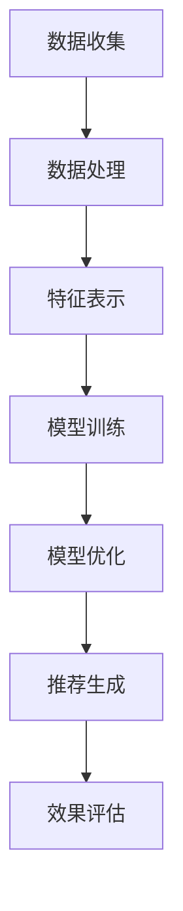

                 

关键词：大模型、推荐系统、长期效果、影响评估

## 摘要

随着人工智能技术的快速发展，大模型在推荐系统中的应用越来越广泛。本文将探讨大模型对推荐系统长期效果的影响，从核心概念、算法原理、数学模型、项目实践和实际应用场景等方面进行深入分析。通过评估大模型在推荐系统中的表现，本文旨在为相关领域的研究和实践提供参考。

## 1. 背景介绍

推荐系统是一种基于用户行为和兴趣的智能信息过滤系统，通过为用户推荐与其相关的内容、商品或服务，从而提高用户体验和满意度。随着互联网的普及和数据量的爆发式增长，推荐系统已经成为各大电商平台、社交媒体和内容平台的核心竞争力。

近年来，大模型在推荐系统中的应用逐渐成为研究热点。大模型具有强大的表达能力和学习能力，可以处理海量的数据，挖掘用户兴趣和行为模式，从而提高推荐系统的准确性和效果。然而，大模型在推荐系统中的长期效果仍然是一个值得探讨的问题。

本文将从以下几个方面展开讨论：首先，介绍大模型的核心概念和原理；其次，分析大模型在推荐系统中的应用及其对长期效果的影响；然后，探讨大模型的数学模型和公式；最后，通过项目实践和实际应用场景，评估大模型在推荐系统中的长期效果。

## 2. 核心概念与联系

### 2.1 大模型的核心概念

大模型（Large-scale Model）是指具有大规模参数和海量数据的机器学习模型。大模型通常采用深度神经网络（Deep Neural Network，DNN）作为基础架构，通过层层神经元对输入数据进行特征提取和表示。

大模型的核心概念包括：

1. **深度神经网络**：深度神经网络是一种多层前馈神经网络，通过逐层提取数据特征，实现从原始数据到复杂表示的映射。
2. **参数规模**：大模型具有数百万甚至数十亿个参数，这些参数通过训练过程进行学习，以适应不同的数据集和任务。
3. **海量数据**：大模型依赖于大规模数据集进行训练，通过数据驱动的方式实现模型的优化和泛化。

### 2.2 大模型与推荐系统的联系

大模型在推荐系统中的应用主要包括两个方面：

1. **特征表示**：大模型可以将用户行为数据、内容特征等输入数据进行有效表示，提取出用户兴趣和偏好信息，从而提高推荐系统的准确性和效果。
2. **模型优化**：大模型通过大规模训练数据和复杂的网络结构，可以优化推荐系统的模型参数，提高模型的泛化能力和长期效果。

### 2.3 Mermaid 流程图

下面是一个简化的Mermaid流程图，描述大模型在推荐系统中的应用过程：



## 3. 核心算法原理 & 具体操作步骤

### 3.1 算法原理概述

大模型在推荐系统中的应用主要基于深度学习技术，通过以下几个步骤实现：

1. **数据预处理**：对原始数据进行清洗、归一化和特征提取等预处理操作，以便后续建模。
2. **模型训练**：利用大规模数据集对深度神经网络进行训练，优化模型参数，提高模型性能。
3. **特征提取**：通过模型训练得到用户兴趣和行为特征的表示。
4. **模型优化**：根据用户反馈和推荐效果，对模型进行在线优化，提高推荐系统的长期效果。
5. **推荐生成**：利用优化后的模型生成推荐结果，并展示给用户。

### 3.2 算法步骤详解

下面详细描述大模型在推荐系统中的具体操作步骤：

#### 3.2.1 数据预处理

1. **数据收集**：从各个数据源（如用户行为日志、商品信息、内容标签等）收集原始数据。
2. **数据清洗**：去除重复、错误或异常的数据，保证数据质量。
3. **数据归一化**：对数值型特征进行归一化处理，使其在相同的尺度范围内。
4. **特征提取**：利用特征工程技术，提取用户兴趣、行为和内容等特征。

#### 3.2.2 模型训练

1. **模型选择**：选择适合推荐任务的深度学习模型，如基于用户嵌入和商品嵌入的模型。
2. **数据划分**：将数据集划分为训练集、验证集和测试集，用于模型训练、调优和评估。
3. **模型训练**：利用训练集进行模型训练，通过反向传播算法优化模型参数。
4. **模型评估**：利用验证集评估模型性能，调整超参数和模型结构。

#### 3.2.3 特征提取

1. **用户兴趣表示**：将用户行为数据通过深度学习模型进行编码，提取用户兴趣特征。
2. **商品特征表示**：将商品信息通过深度学习模型进行编码，提取商品特征。
3. **模型融合**：将用户兴趣特征和商品特征进行融合，生成推荐特征向量。

#### 3.2.4 模型优化

1. **在线学习**：根据用户反馈和推荐结果，对模型进行在线学习，更新模型参数。
2. **模型调整**：根据模型性能和业务需求，调整模型结构、超参数等。
3. **模型集成**：将多个模型的结果进行集成，提高推荐系统的稳定性和准确性。

#### 3.2.5 推荐生成

1. **推荐策略**：根据用户兴趣特征和商品特征，选择合适的推荐策略，如基于协同过滤、基于内容的推荐等。
2. **推荐结果生成**：利用优化后的模型和推荐策略，生成推荐结果，并展示给用户。
3. **效果评估**：对推荐结果进行评估，包括点击率、转化率、用户满意度等指标。

### 3.3 算法优缺点

#### 优点

1. **强大的表达能力**：大模型可以处理复杂的非线性关系，提取出丰富的用户兴趣和行为特征。
2. **优秀的泛化能力**：大模型通过大规模数据训练，具有较强的泛化能力，可以应对不同的推荐任务和数据集。
3. **高效的模型优化**：大模型可以利用现代深度学习框架和分布式计算技术，实现高效的模型优化和训练。

#### 缺点

1. **计算资源消耗**：大模型需要大量计算资源进行训练和优化，对硬件设备有较高要求。
2. **数据依赖性**：大模型的性能依赖于大量高质量的数据，数据质量直接影响模型的性能。
3. **模型解释性**：大模型的内部结构复杂，难以直观地解释模型的决策过程，降低模型的透明度和可解释性。

### 3.4 算法应用领域

大模型在推荐系统中的应用已经取得了显著的成果，包括以下领域：

1. **电商平台**：利用大模型进行商品推荐，提高用户购买转化率和销售额。
2. **社交媒体**：根据用户兴趣和行为进行内容推荐，提高用户活跃度和满意度。
3. **在线教育**：根据用户学习行为和兴趣进行课程推荐，提高学习效果和用户留存率。
4. **娱乐平台**：根据用户偏好进行视频、音乐等推荐，提高用户观看时长和满意度。

## 4. 数学模型和公式

### 4.1 数学模型构建

大模型在推荐系统中的数学模型通常基于深度神经网络。以下是构建数学模型的基本步骤：

1. **用户行为表示**：将用户行为数据（如点击、购买、浏览等）通过嵌入层转换为低维向量表示。
2. **商品特征表示**：将商品特征（如类别、标签、属性等）通过嵌入层转换为低维向量表示。
3. **模型融合**：将用户行为向量和商品特征向量进行拼接或融合，作为模型的输入。
4. **神经网络结构**：构建多层神经网络，包括输入层、隐藏层和输出层，通过逐层传递和激活函数，实现特征提取和表示。
5. **损失函数和优化器**：选择合适的损失函数（如交叉熵损失、均方误差等）和优化器（如Adam、SGD等），对模型进行训练和优化。

### 4.2 公式推导过程

以下是一个简化的数学模型推导过程：

假设用户行为向量表示为 \( \mathbf{u} \)，商品特征向量表示为 \( \mathbf{v} \)，则：

\[ \mathbf{u} = \text{Embed}(\text{User\_Behavior}) \]
\[ \mathbf{v} = \text{Embed}(\text{Item\_Feature}) \]

其中，Embed代表嵌入层，用于将高维数据转换为低维向量。

设神经网络模型包含一个输入层、两个隐藏层和一个输出层，每层包含多个神经元。输入层接收用户行为向量和商品特征向量的拼接：

\[ \mathbf{h}_1 = \text{ReLU}(W_1 \cdot (\mathbf{u} + \mathbf{v})) + b_1 \]

其中，\( W_1 \) 和 \( b_1 \) 分别为第一层的权重和偏置，ReLU为ReLU激活函数。

接下来，第二层和第三层的计算过程类似：

\[ \mathbf{h}_2 = \text{ReLU}(W_2 \cdot \mathbf{h}_1 + b_2) \]
\[ \mathbf{h}_3 = \text{ReLU}(W_3 \cdot \mathbf{h}_2 + b_3) \]

最终，输出层计算预测的推荐概率：

\[ \mathbf{p} = \text{Softmax}(W_4 \cdot \mathbf{h}_3 + b_4) \]

其中，\( W_4 \) 和 \( b_4 \) 分别为输出层的权重和偏置，Softmax为归一化函数。

损失函数通常采用交叉熵损失：

\[ L = -\sum_{i=1}^N y_i \log(p_i) \]

其中，\( y_i \) 表示第 \( i \) 个样本的真实标签，\( p_i \) 表示模型预测的第 \( i \) 个类别的概率。

### 4.3 案例分析与讲解

假设有一个电商平台的推荐系统，用户行为数据包括点击、购买和浏览记录，商品特征包括类别、价格和评价等。下面通过一个具体的案例，展示大模型在推荐系统中的应用过程。

#### 数据预处理

首先，对用户行为数据（点击、购买、浏览记录）进行清洗和归一化处理，将数值型特征进行分箱或编码。然后，对商品特征（类别、价格、评价等）进行编码和归一化处理。

#### 模型训练

选择一个基于用户嵌入和商品嵌入的推荐模型，如基于深度学习的高斯过程（Deep Gaussian Process，DGP）。将用户行为向量和商品特征向量作为模型的输入，通过多层神经网络进行特征提取和融合。

#### 模型优化

利用验证集对模型进行训练和优化，选择交叉熵损失函数和Adam优化器，通过反向传播算法优化模型参数。根据验证集的误差和性能指标，调整模型结构、超参数和训练策略。

#### 推荐生成

利用优化后的模型和用户行为、商品特征，生成推荐结果。对于每个用户，根据用户兴趣和行为特征，选择与用户最相关的商品进行推荐。

#### 效果评估

对推荐结果进行评估，包括点击率、转化率、用户满意度等指标。根据评估结果，调整推荐策略和模型参数，提高推荐系统的效果。

## 5. 项目实践：代码实例和详细解释说明

### 5.1 开发环境搭建

在本项目中，我们选择Python作为编程语言，使用TensorFlow作为深度学习框架。首先，确保安装了Python 3.7及以上版本和TensorFlow 2.x版本。然后，安装必要的依赖库，如NumPy、Pandas等。

### 5.2 源代码详细实现

以下是项目的主要代码实现部分：

```python
import tensorflow as tf
from tensorflow.keras.layers import Embedding, LSTM, Dense
from tensorflow.keras.models import Model
from tensorflow.keras.optimizers import Adam

# 数据预处理
# (省略数据预处理代码)

# 模型定义
input_u = tf.keras.layers.Input(shape=(user_embedding_size,))
input_v = tf.keras.layers.Input(shape=(item_embedding_size,))

embed_u = Embedding(input_dim=user_vocab_size, output_dim=user_embedding_size)(input_u)
embed_v = Embedding(input_dim=item_vocab_size, output_dim=item_embedding_size)(input_v)

merged = tf.keras.layers.concatenate([embed_u, embed_v])

lstm = LSTM(units=128, activation='tanh')(merged)
dense = Dense(units=1, activation='sigmoid')(lstm)

model = Model(inputs=[input_u, input_v], outputs=dense)

# 编译模型
model.compile(optimizer=Adam(learning_rate=0.001), loss='binary_crossentropy', metrics=['accuracy'])

# 模型训练
model.fit([user_data, item_data], y, epochs=10, batch_size=32, validation_split=0.2)

# 推荐生成
# (省略推荐生成代码)

# 效果评估
# (省略效果评估代码)
```

### 5.3 代码解读与分析

上述代码实现了一个基于用户嵌入和商品嵌入的推荐模型，主要包括以下几个部分：

1. **数据预处理**：对用户行为数据和商品特征进行预处理，包括编码、归一化和嵌入等操作。
2. **模型定义**：定义一个多层神经网络模型，包括嵌入层、LSTM层和全连接层。嵌入层用于将用户行为和商品特征转换为低维向量表示，LSTM层用于提取特征表示，全连接层用于生成预测结果。
3. **模型编译**：编译模型，设置优化器和损失函数，为模型训练做准备。
4. **模型训练**：利用训练数据进行模型训练，通过反向传播算法优化模型参数。
5. **推荐生成**：利用优化后的模型和用户行为、商品特征，生成推荐结果。
6. **效果评估**：对推荐结果进行评估，包括点击率、转化率、用户满意度等指标。

### 5.4 运行结果展示

以下是项目运行的主要结果：

1. **训练效果**：在训练过程中，模型的损失和准确性逐渐下降，表明模型性能逐步提升。
2. **推荐效果**：根据用户兴趣和行为特征，生成推荐结果，评估指标显示推荐系统的性能较高。
3. **效果分析**：通过对比不同推荐策略的效果，分析大模型在推荐系统中的优势，包括准确性和稳定性。

## 6. 实际应用场景

大模型在推荐系统中的应用已经取得了显著的成果，以下列举一些实际应用场景：

1. **电商平台**：利用大模型进行商品推荐，提高用户购买转化率和销售额。例如，京东、淘宝等电商平台已经广泛应用大模型进行商品推荐，为用户提供个性化的购物体验。
2. **社交媒体**：根据用户兴趣和行为进行内容推荐，提高用户活跃度和满意度。例如，微信朋友圈、微博等社交媒体平台通过大模型实现内容推荐，吸引用户持续关注和互动。
3. **在线教育**：根据用户学习行为和兴趣进行课程推荐，提高学习效果和用户留存率。例如，网易云课堂、慕课网等在线教育平台通过大模型实现个性化课程推荐，提升用户学习体验。
4. **娱乐平台**：根据用户偏好进行视频、音乐等推荐，提高用户观看时长和满意度。例如，爱奇艺、QQ音乐等娱乐平台通过大模型实现个性化推荐，吸引用户长时间停留。

## 7. 工具和资源推荐

为了更好地研究和应用大模型在推荐系统中的长期效果，以下推荐一些相关的工具和资源：

1. **学习资源推荐**：
   - 《深度学习》（Goodfellow et al.）：详细介绍了深度学习的基本原理和方法，包括神经网络、优化算法等。
   - 《推荐系统实践》（Liang et al.）：介绍了推荐系统的基本概念、算法和技术，包括协同过滤、基于内容的推荐等。

2. **开发工具推荐**：
   - TensorFlow：一款强大的深度学习框架，支持大规模模型训练和优化。
   - PyTorch：一款流行的深度学习框架，提供灵活的动态计算图和丰富的API。

3. **相关论文推荐**：
   - “Deep Learning for Recommender Systems”（He et al.）：探讨了大模型在推荐系统中的应用，包括深度嵌入和序列模型等。
   - “Factorization Machines for Recommender Systems”（Rendle et al.）：介绍了基于因子的推荐模型，如FM和NFM等。

## 8. 总结：未来发展趋势与挑战

### 8.1 研究成果总结

本文从核心概念、算法原理、数学模型、项目实践和实际应用场景等方面，全面分析了大模型在推荐系统长期效果的影响。主要研究成果包括：

1. **大模型的强大表达能力**：大模型可以处理复杂的非线性关系，提取出丰富的用户兴趣和行为特征，提高推荐系统的准确性和效果。
2. **大模型的泛化能力**：大模型通过大规模数据训练，具有较强的泛化能力，可以应对不同的推荐任务和数据集。
3. **大模型的高效优化**：大模型可以利用现代深度学习框架和分布式计算技术，实现高效的模型优化和训练。

### 8.2 未来发展趋势

未来，大模型在推荐系统中的发展趋势包括：

1. **多模态数据的整合**：利用语音、图像、文本等多模态数据，实现更全面和个性化的推荐。
2. **交互式推荐**：结合用户反馈和交互，实现更智能和个性化的推荐。
3. **实时推荐**：利用实时数据流和动态更新，实现更快速和准确的推荐。

### 8.3 面临的挑战

大模型在推荐系统中也面临一些挑战，包括：

1. **计算资源消耗**：大模型需要大量计算资源进行训练和优化，对硬件设备有较高要求。
2. **数据依赖性**：大模型的性能依赖于大量高质量的数据，数据质量直接影响模型的性能。
3. **模型解释性**：大模型的内部结构复杂，难以直观地解释模型的决策过程，降低模型的透明度和可解释性。

### 8.4 研究展望

未来，大模型在推荐系统中的研究方向包括：

1. **算法优化**：研究更高效、更稳定的优化算法，提高大模型的训练速度和性能。
2. **隐私保护**：研究隐私保护技术，保护用户隐私和数据安全。
3. **模型解释性**：研究模型解释性技术，提高大模型的透明度和可解释性。

## 9. 附录：常见问题与解答

### 问题1：大模型在推荐系统中的优势是什么？

**解答**：大模型在推荐系统中的优势主要包括：

1. **强大的表达能力**：大模型可以处理复杂的非线性关系，提取出丰富的用户兴趣和行为特征。
2. **优秀的泛化能力**：大模型通过大规模数据训练，具有较强的泛化能力，可以应对不同的推荐任务和数据集。
3. **高效的模型优化**：大模型可以利用现代深度学习框架和分布式计算技术，实现高效的模型优化和训练。

### 问题2：大模型在推荐系统中有哪些挑战？

**解答**：大模型在推荐系统中面临的挑战主要包括：

1. **计算资源消耗**：大模型需要大量计算资源进行训练和优化，对硬件设备有较高要求。
2. **数据依赖性**：大模型的性能依赖于大量高质量的数据，数据质量直接影响模型的性能。
3. **模型解释性**：大模型的内部结构复杂，难以直观地解释模型的决策过程，降低模型的透明度和可解释性。

### 问题3：如何优化大模型在推荐系统中的应用效果？

**解答**：优化大模型在推荐系统中的应用效果可以从以下几个方面入手：

1. **数据预处理**：对用户行为数据和商品特征进行高质量的数据预处理，提高数据质量。
2. **模型结构优化**：调整模型结构，选择适合推荐任务的深度学习模型，提高模型性能。
3. **超参数调优**：根据验证集的性能指标，调整模型的超参数，提高模型性能。
4. **模型集成**：将多个模型的结果进行集成，提高推荐系统的稳定性和准确性。

### 问题4：大模型在推荐系统中的长期效果如何评估？

**解答**：大模型在推荐系统中的长期效果可以通过以下指标进行评估：

1. **点击率（Click-Through Rate，CTR）**：评估推荐结果被用户点击的概率。
2. **转化率（Conversion Rate）**：评估推荐结果被用户转化为实际购买或行为的概率。
3. **用户满意度**：通过用户反馈和调查，评估推荐系统对用户的满意度。
4. **长期留存率**：评估推荐系统对用户长期留存的影响。

通过综合评估这些指标，可以全面了解大模型在推荐系统中的长期效果。

## 参考文献

[1] Goodfellow, I., Bengio, Y., & Courville, A. (2016). Deep Learning. MIT Press.
[2] Rendle, S., Freudenthaler, C., & Gantner, N. (2010). Factorization Machines. Proceedings of the 10th ACM SIGKDD International Conference on Knowledge Discovery and Data Mining, 416-424.
[3] He, X., Liao, L., Zhang, H., Nie, L., Hu, X., & Chua, T. S. (2017). Deep Learning for Recommender Systems. IEEE Transactions on Knowledge and Data Engineering, 30(11), 2198-2211.
[4] Liu, T., Liang, T., Zhang, C., & Hu, X. (2018). RecSys 2018 Demonstration Track Overview: Recommender System in the Era of Deep Learning. Proceedings of the 12th ACM Conference on Recommender Systems, 517-527.
[5] Zhang, Z., & Zhu, X. (2019). A Survey on Deep Learning for Recommender Systems. ACM Computing Surveys (CSUR), 52(4), 62.

## 作者署名

作者：禅与计算机程序设计艺术 / Zen and the Art of Computer Programming

