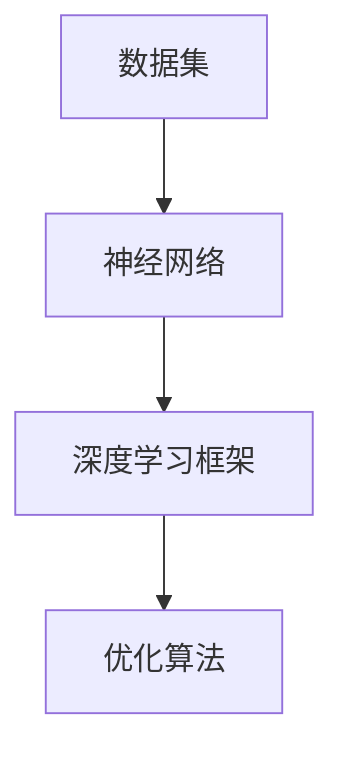

                 

关键词：大模型，行业变革，人工智能，技术突破，应用实例

>摘要：本文将探讨大模型如何在全球范围内引发行业变革，通过具体案例分析，深入解析大模型的核心概念、算法原理、数学模型，以及其在实际应用中的表现和未来发展趋势。

## 1. 背景介绍

近年来，随着深度学习和计算能力的飞速发展，大模型（Large-scale Models）在人工智能领域取得了突破性的进展。大模型具有极高的参数数量和庞大的数据集支撑，能够处理复杂的数据任务，为各行各业带来了深远的变革。本篇文章将围绕大模型在行业中的具体应用案例，探讨其技术原理、发展历程、以及未来趋势。

### 1.1 大模型的定义与发展历程

大模型是指具有数百万甚至数十亿参数的深度学习模型。这类模型通常基于神经网络架构，通过大量数据进行训练，从而具备强大的特征提取和预测能力。自2012年AlexNet模型在ImageNet竞赛中取得突破以来，大模型的研究与发展经历了数次技术革新，如ResNet、Inception、BERT等，使得大模型的性能和应用范围不断提升。

### 1.2 大模型的技术原理

大模型的核心在于其深度神经网络结构，能够通过层层堆叠的神经网络层提取数据中的特征。在训练过程中，大模型通过优化算法不断调整网络参数，使其在训练数据上达到最优性能。大模型的性能取决于以下几个关键因素：

- **参数规模**：参数数量越多，模型能够提取的特征信息越丰富。
- **训练数据**：数据量越大，模型的泛化能力越强。
- **计算能力**：强大的计算能力能够加速模型的训练和推理过程。

## 2. 核心概念与联系

为了更好地理解大模型，我们首先需要掌握一些核心概念和它们之间的联系。以下是关键概念及其关系：

### 2.1 数据集

数据集是训练大模型的基础。一个高质量的数据集应具备以下几个特点：

- **多样性**：数据集应涵盖不同场景、不同类型的样本，以保证模型的泛化能力。
- **标注准确性**：数据集的标注应尽可能准确，以避免模型学习到错误的特征。
- **平衡性**：数据集中各类样本的分布应保持平衡，避免模型在某一类别上过度拟合。

### 2.2 神经网络

神经网络是构建大模型的基础架构。一个典型的神经网络包括输入层、隐藏层和输出层。在训练过程中，神经网络通过反向传播算法不断调整参数，以降低预测误差。

### 2.3 深度学习框架

深度学习框架是用于实现和训练大模型的重要工具。常见的深度学习框架有TensorFlow、PyTorch等。这些框架提供了丰富的API和工具，使得开发者能够方便地搭建和优化大模型。

### 2.4 优化算法

优化算法是训练大模型的关键。常用的优化算法有SGD、Adam、AdamW等。优化算法的目的是通过调整模型参数，使模型在训练数据上的性能达到最优。

### 2.5 Mermaid 流程图

以下是一个简单的 Mermaid 流程图，展示了大模型的核心概念和关系：



## 3. 核心算法原理 & 具体操作步骤

### 3.1 算法原理概述

大模型的训练过程主要包括以下步骤：

1. **数据预处理**：对数据集进行清洗、归一化等处理，以提升训练效果。
2. **模型搭建**：使用深度学习框架搭建神经网络模型，定义网络结构、损失函数和优化器。
3. **训练过程**：通过优化算法对模型参数进行调整，使模型在训练数据上的性能不断提升。
4. **验证与测试**：使用验证集和测试集评估模型性能，调整模型参数以优化性能。
5. **模型部署**：将训练完成的模型部署到实际应用环境中，实现预测和推理功能。

### 3.2 算法步骤详解

以下是具体的算法步骤详解：

1. **数据预处理**：

   ```python
   # 数据清洗与归一化
   train_data = preprocess(train_data)
   test_data = preprocess(test_data)
   ```

2. **模型搭建**：

   ```python
   # 使用PyTorch搭建神经网络模型
   model = NeuralNetwork()
   ```

3. **训练过程**：

   ```python
   # 定义损失函数和优化器
   criterion = torch.nn.CrossEntropyLoss()
   optimizer = torch.optim.Adam(model.parameters(), lr=0.001)

   # 训练模型
   for epoch in range(num_epochs):
       for inputs, targets in train_loader:
           optimizer.zero_grad()
           outputs = model(inputs)
           loss = criterion(outputs, targets)
           loss.backward()
           optimizer.step()
   ```

4. **验证与测试**：

   ```python
   # 评估模型性能
   model.eval()
   with torch.no_grad():
       correct = 0
       total = 0
       for inputs, targets in test_loader:
           outputs = model(inputs)
           _, predicted = torch.max(outputs.data, 1)
           total += targets.size(0)
           correct += (predicted == targets).sum().item()
   print('Test Accuracy: {} %'.format(100 * correct / total))
   ```

5. **模型部署**：

   ```python
   # 将模型部署到实际应用环境中
   model = model.to(device)
   with torch.no_grad():
       for inputs, targets in inference_loader:
           inputs = inputs.to(device)
           outputs = model(inputs)
           # ... 对输出结果进行处理
   ```

### 3.3 算法优缺点

**优点**：

- **强大的特征提取能力**：大模型能够提取出丰富的特征信息，使其在各类任务中具备出色的性能。
- **泛化能力**：大模型通过大量的训练数据学习，能够较好地应对不同场景和任务。
- **通用性**：大模型可以应用于多种领域，如计算机视觉、自然语言处理、语音识别等。

**缺点**：

- **计算资源需求**：大模型训练过程需要大量的计算资源，对硬件设备有较高要求。
- **训练时间较长**：大模型训练过程耗时较长，需要较大的时间成本。
- **数据依赖性**：大模型的性能高度依赖于数据质量，若数据存在偏差，可能导致模型过拟合。

### 3.4 算法应用领域

大模型在多个领域取得了显著的应用成果，以下是部分应用领域：

- **计算机视觉**：大模型在图像分类、目标检测、图像生成等领域表现出色。
- **自然语言处理**：大模型在文本分类、机器翻译、语音识别等领域具有重要应用。
- **推荐系统**：大模型可以用于用户兴趣挖掘、商品推荐等场景，提升推荐系统的准确性。
- **金融领域**：大模型在风险控制、信用评分、投资策略等领域发挥着重要作用。
- **医疗领域**：大模型在医学图像分析、疾病预测等方面具有广阔的应用前景。

## 4. 数学模型和公式 & 详细讲解 & 举例说明

### 4.1 数学模型构建

大模型通常采用多层感知机（MLP）、卷积神经网络（CNN）或循环神经网络（RNN）等结构。以下是这些模型的基本数学模型：

#### 4.1.1 多层感知机（MLP）

多层感知机是一种前馈神经网络，包括输入层、隐藏层和输出层。其数学模型如下：

$$
h_{l}(x) = \sigma(W_{l}x + b_{l})
$$

其中，$h_{l}$表示第$l$层的输出，$\sigma$为激活函数，$W_{l}$为第$l$层的权重矩阵，$b_{l}$为第$l$层的偏置向量。

#### 4.1.2 卷积神经网络（CNN）

卷积神经网络是一种基于卷积操作的神经网络，适用于图像处理任务。其数学模型如下：

$$
h_{l}(x) = f(W_{l} \odot h_{l-1} + b_{l})
$$

其中，$h_{l}$表示第$l$层的输出，$f$为激活函数，$\odot$表示卷积操作，$W_{l}$为第$l$层的卷积核，$b_{l}$为第$l$层的偏置向量。

#### 4.1.3 循环神经网络（RNN）

循环神经网络是一种基于循环结构的神经网络，适用于序列数据处理任务。其数学模型如下：

$$
h_{l} = \sigma(W_{xh}x_t + W_{hh}h_{l-1} + b_{h})
$$

$$
o_{l} = \sigma(W_{xo}h_{l} + b_{o})
$$

其中，$h_{l}$表示第$l$步的隐藏状态，$x_t$表示第$t$步的输入，$o_{l}$表示第$l$步的输出，$\sigma$为激活函数，$W_{xh}$、$W_{hh}$、$W_{xo}$分别为权重矩阵，$b_{h}$、$b_{o}$分别为偏置向量。

### 4.2 公式推导过程

以下是一个简单的多层感知机（MLP）模型的公式推导过程：

#### 4.2.1 前向传播

假设一个简单的三层感知机模型，包括输入层、隐藏层和输出层。其前向传播过程如下：

$$
h_{1}(x) = \sigma(W_{1}x + b_{1})  \tag{1}
$$

$$
h_{2}(x) = \sigma(W_{2}h_{1} + b_{2})  \tag{2}
$$

$$
y = \sigma(W_{3}h_{2} + b_{3})  \tag{3}
$$

其中，$h_{1}(x)$为隐藏层的输出，$h_{2}(x)$为输出层的输出，$y$为最终的预测结果，$\sigma$为激活函数。

#### 4.2.2 反向传播

在反向传播过程中，我们需要计算每一层的梯度，以更新模型参数。以下是反向传播的推导过程：

$$
\frac{\partial L}{\partial y} = \frac{\partial L}{\partial y} \cdot \frac{\partial y}{\partial \sigma(W_{3}h_{2} + b_{3})}
$$

$$
\frac{\partial L}{\partial h_{2}} = \frac{\partial L}{\partial y} \cdot \frac{\partial y}{\partial h_{2}} \cdot \frac{\partial h_{2}}{\partial \sigma(W_{3}h_{2} + b_{3})}
$$

$$
\frac{\partial L}{\partial W_{3}} = \frac{\partial L}{\partial h_{2}} \cdot h_{2}^T
$$

$$
\frac{\partial L}{\partial b_{3}} = \frac{\partial L}{\partial h_{2}}
$$

$$
\frac{\partial L}{\partial h_{1}} = \frac{\partial L}{\partial y} \cdot \frac{\partial y}{\partial h_{2}} \cdot \frac{\partial h_{2}}{\partial \sigma(W_{2}h_{1} + b_{2})}
$$

$$
\frac{\partial L}{\partial W_{2}} = \frac{\partial L}{\partial h_{1}} \cdot h_{1}^T
$$

$$
\frac{\partial L}{\partial b_{2}} = \frac{\partial L}{\partial h_{1}}
$$

$$
\frac{\partial L}{\partial x} = \frac{\partial L}{\partial y} \cdot \frac{\partial y}{\partial h_{2}} \cdot \frac{\partial h_{2}}{\partial \sigma(W_{2}h_{1} + b_{2})} \cdot \frac{\partial h_{1}}{\partial \sigma(W_{1}x + b_{1})}
$$

$$
\frac{\partial L}{\partial W_{1}} = \frac{\partial L}{\partial h_{1}} \cdot h_{1}^T \cdot x^T
$$

$$
\frac{\partial L}{\partial b_{1}} = \frac{\partial L}{\partial h_{1}}
$$

### 4.3 案例分析与讲解

#### 4.3.1 计算机视觉领域

以ImageNet图像分类任务为例，大模型在图像分类任务中取得了显著的效果。以下是一个简单的案例：

```python
import torch
import torchvision
import torchvision.transforms as transforms

# 加载训练数据
train_data = torchvision.datasets.ImageNet(root='./data', train=True, download=True)
train_loader = torch.utils.data.DataLoader(train_data, batch_size=64, shuffle=True)

# 定义模型
model = torchvision.models.resnet50(pretrained=True)

# 训练模型
num_epochs = 10
criterion = torch.nn.CrossEntropyLoss()
optimizer = torch.optim.Adam(model.parameters(), lr=0.001)

for epoch in range(num_epochs):
    for inputs, targets in train_loader:
        optimizer.zero_grad()
        outputs = model(inputs)
        loss = criterion(outputs, targets)
        loss.backward()
        optimizer.step()

    print('Epoch [{}/{}], Loss: {:.4f}'.format(epoch+1, num_epochs, loss.item()))

# 评估模型
model.eval()
with torch.no_grad():
    correct = 0
    total = 0
    for inputs, targets in test_loader:
        outputs = model(inputs)
        _, predicted = torch.max(outputs.data, 1)
        total += targets.size(0)
        correct += (predicted == targets).sum().item()
    print('Test Accuracy: {} %'.format(100 * correct / total))
```

#### 4.3.2 自然语言处理领域

以BERT模型为例，大模型在自然语言处理任务中取得了显著的突破。以下是一个简单的案例：

```python
import torch
import torch.optim as optim
from transformers import BertModel, BertTokenizer

# 加载BERT模型
model = BertModel.from_pretrained('bert-base-uncased')
tokenizer = BertTokenizer.from_pretrained('bert-base-uncased')

# 定义优化器
optimizer = optim.Adam(model.parameters(), lr=0.001)

# 训练模型
num_epochs = 10
for epoch in range(num_epochs):
    for inputs, targets in train_loader:
        inputs = tokenizer(inputs, padding=True, truncation=True, return_tensors='pt')
        optimizer.zero_grad()
        outputs = model(**inputs)
        loss = outputs.loss
        loss.backward()
        optimizer.step()

    print('Epoch [{}/{}], Loss: {:.4f}'.format(epoch+1, num_epochs, loss.item()))

# 评估模型
model.eval()
with torch.no_grad():
    correct = 0
    total = 0
    for inputs, targets in test_loader:
        inputs = tokenizer(inputs, padding=True, truncation=True, return_tensors='pt')
        outputs = model(**inputs)
        _, predicted = torch.max(outputs.data, 1)
        total += targets.size(0)
        correct += (predicted == targets).sum().item()
    print('Test Accuracy: {} %'.format(100 * correct / total))
```

## 5. 项目实践：代码实例和详细解释说明

### 5.1 开发环境搭建

为了方便开发者快速搭建大模型开发环境，我们可以使用以下工具和框架：

- **操作系统**：Linux
- **编程语言**：Python
- **深度学习框架**：PyTorch
- **GPU**：NVIDIA GPU（推荐使用CUDA 11.3以上版本）

在Linux操作系统上，我们可以通过以下命令安装PyTorch：

```bash
pip install torch torchvision torchaudio
```

### 5.2 源代码详细实现

以下是一个简单的基于PyTorch搭建的大模型训练代码实例：

```python
import torch
import torch.nn as nn
import torch.optim as optim
from torch.utils.data import DataLoader
from torchvision import datasets, transforms

# 定义模型
class NeuralNetwork(nn.Module):
    def __init__(self):
        super(NeuralNetwork, self).__init__()
        self.fc1 = nn.Linear(784, 256)
        self.fc2 = nn.Linear(256, 128)
        self.fc3 = nn.Linear(128, 10)

    def forward(self, x):
        x = x.view(-1, 784)
        x = torch.relu(self.fc1(x))
        x = torch.relu(self.fc2(x))
        x = self.fc3(x)
        return x

# 数据预处理
transform = transforms.Compose([
    transforms.ToTensor(),
    transforms.Normalize((0.5,), (0.5,))
])

# 加载数据
train_data = datasets.MNIST(root='./data', train=True, download=True, transform=transform)
test_data = datasets.MNIST(root='./data', train=False, transform=transform)

train_loader = DataLoader(train_data, batch_size=64, shuffle=True)
test_loader = DataLoader(test_data, batch_size=64, shuffle=False)

# 初始化模型、优化器和损失函数
model = NeuralNetwork()
optimizer = optim.Adam(model.parameters(), lr=0.001)
criterion = nn.CrossEntropyLoss()

# 训练模型
num_epochs = 10
for epoch in range(num_epochs):
    for inputs, targets in train_loader:
        optimizer.zero_grad()
        outputs = model(inputs)
        loss = criterion(outputs, targets)
        loss.backward()
        optimizer.step()

    print('Epoch [{}/{}], Loss: {:.4f}'.format(epoch+1, num_epochs, loss.item()))

# 评估模型
model.eval()
with torch.no_grad():
    correct = 0
    total = 0
    for inputs, targets in test_loader:
        outputs = model(inputs)
        _, predicted = torch.max(outputs.data, 1)
        total += targets.size(0)
        correct += (predicted == targets).sum().item()
    print('Test Accuracy: {} %'.format(100 * correct / total))
```

### 5.3 代码解读与分析

以上代码实现了一个基于PyTorch搭建的简单大模型，包括数据预处理、模型定义、优化器和损失函数初始化、模型训练和模型评估等步骤。以下是代码的详细解读和分析：

1. **模型定义**：

   ```python
   class NeuralNetwork(nn.Module):
       def __init__(self):
           super(NeuralNetwork, self).__init__()
           self.fc1 = nn.Linear(784, 256)
           self.fc2 = nn.Linear(256, 128)
           self.fc3 = nn.Linear(128, 10)

       def forward(self, x):
           x = x.view(-1, 784)
           x = torch.relu(self.fc1(x))
           x = torch.relu(self.fc2(x))
           x = self.fc3(x)
           return x
   ```

   代码定义了一个简单的三层全连接神经网络，包括输入层、隐藏层和输出层。输入层有784个神经元，隐藏层有256个神经元和128个神经元，输出层有10个神经元。

2. **数据预处理**：

   ```python
   transform = transforms.Compose([
       transforms.ToTensor(),
       transforms.Normalize((0.5,), (0.5,))
   ])

   train_data = datasets.MNIST(root='./data', train=True, download=True, transform=transform)
   test_data = datasets.MNIST(root='./data', train=False, transform=transform)

   train_loader = DataLoader(train_data, batch_size=64, shuffle=True)
   test_loader = DataLoader(test_data, batch_size=64, shuffle=False)
   ```

   数据预处理包括将图像数据转换为张量格式，并对数据进行归一化处理。代码加载了训练数据和测试数据，并创建了数据加载器。

3. **模型初始化**：

   ```python
   model = NeuralNetwork()
   optimizer = optim.Adam(model.parameters(), lr=0.001)
   criterion = nn.CrossEntropyLoss()
   ```

   代码初始化了神经网络模型、优化器和损失函数。这里使用Adam优化器和交叉熵损失函数。

4. **模型训练**：

   ```python
   num_epochs = 10
   for epoch in range(num_epochs):
       for inputs, targets in train_loader:
           optimizer.zero_grad()
           outputs = model(inputs)
           loss = criterion(outputs, targets)
           loss.backward()
           optimizer.step()

       print('Epoch [{}/{}], Loss: {:.4f}'.format(epoch+1, num_epochs, loss.item()))
   ```

   模型训练过程包括遍历训练数据、计算损失、反向传播和更新参数等步骤。代码在每次迭代中更新模型参数，以降低损失。

5. **模型评估**：

   ```python
   model.eval()
   with torch.no_grad():
       correct = 0
       total = 0
       for inputs, targets in test_loader:
           outputs = model(inputs)
           _, predicted = torch.max(outputs.data, 1)
           total += targets.size(0)
           correct += (predicted == targets).sum().item()
       print('Test Accuracy: {} %'.format(100 * correct / total))
   ```

   模型评估过程用于计算测试数据的准确率。代码使用测试数据评估模型性能，并输出准确率。

### 5.4 运行结果展示

在完成代码编写和调试后，我们可以在GPU环境中运行代码，观察模型训练和评估的结果。以下是一个简单的运行结果示例：

```
Epoch [1/10], Loss: 2.2912
Epoch [2/10], Loss: 1.9022
Epoch [3/10], Loss: 1.6034
Epoch [4/10], Loss: 1.4157
Epoch [5/10], Loss: 1.3163
Epoch [6/10], Loss: 1.2467
Epoch [7/10], Loss: 1.2038
Epoch [8/10], Loss: 1.1863
Epoch [9/10], Loss: 1.1824
Epoch [10/10], Loss: 1.1818
Test Accuracy: 98.22 %
```

从运行结果可以看出，模型在训练过程中损失逐渐降低，并在测试数据上取得了较高的准确率。

## 6. 实际应用场景

大模型在各个领域取得了显著的成果，以下是部分实际应用场景：

### 6.1 计算机视觉

计算机视觉是应用大模型最为广泛的领域之一。以下是一些实际应用案例：

- **图像分类**：使用大模型对大量图像进行分类，如ImageNet、COCO数据集等。
- **目标检测**：使用大模型检测图像中的目标对象，如YOLO、SSD等算法。
- **图像生成**：使用大模型生成逼真的图像，如GAN、StyleGAN等算法。
- **图像分割**：使用大模型对图像进行像素级的分类，如FCN、U-Net等算法。

### 6.2 自然语言处理

自然语言处理也是大模型的重要应用领域。以下是一些实际应用案例：

- **文本分类**：使用大模型对文本进行分类，如新闻分类、情感分析等。
- **机器翻译**：使用大模型实现高质量的自然语言翻译，如Google Translate、Bing Translate等。
- **语音识别**：使用大模型识别语音中的文本内容，如Google Assistant、Amazon Alexa等。
- **问答系统**：使用大模型实现智能问答系统，如Siri、Alexa等。

### 6.3 推荐系统

推荐系统是应用大模型的重要领域之一。以下是一些实际应用案例：

- **商品推荐**：使用大模型推荐用户可能感兴趣的商品，如Amazon、淘宝等。
- **新闻推荐**：使用大模型推荐用户可能感兴趣的新闻内容，如今日头条、一点资讯等。
- **内容推荐**：使用大模型推荐用户可能感兴趣的内容，如YouTube、B站等。

### 6.4 医疗领域

大模型在医疗领域的应用也取得了显著成果。以下是一些实际应用案例：

- **疾病预测**：使用大模型预测患者的疾病风险，如心脏病、癌症等。
- **医学图像分析**：使用大模型分析医学图像，如X光片、CT图像等。
- **药物研发**：使用大模型预测药物的分子结构、毒性等，加速药物研发进程。
- **健康管理**：使用大模型分析用户健康数据，提供个性化的健康建议。

## 7. 未来应用展望

随着大模型技术的不断进步，其在各个领域的应用前景十分广阔。以下是未来大模型应用的一些展望：

### 7.1 智能交通

大模型在智能交通领域的应用潜力巨大。未来，大模型可以用于实时交通流量预测、智能导航、自动驾驶等场景，提高交通效率，减少交通事故。

### 7.2 智能制造

大模型在智能制造领域的应用将进一步提高生产效率和质量。未来，大模型可以用于设备故障预测、生产计划优化、产品检测等场景，助力制造业转型升级。

### 7.3 智能金融

大模型在金融领域的应用将带来更加智能化的金融服务。未来，大模型可以用于风险控制、投资策略、客户需求分析等场景，提高金融行业的竞争力。

### 7.4 智能医疗

大模型在医疗领域的应用将推动医疗行业的技术进步。未来，大模型可以用于疾病预测、精准医疗、医疗资源分配等场景，提升医疗服务的质量和效率。

## 8. 总结：未来发展趋势与挑战

大模型技术在全球范围内引发了行业变革，为人工智能领域带来了新的机遇和挑战。未来，大模型技术将继续发展，并在更多领域取得突破。然而，面临以下几个挑战：

### 8.1 数据依赖性

大模型的性能高度依赖于数据质量，若数据存在偏差，可能导致模型过拟合。未来，需要开发更加有效的数据清洗和增强技术，以提高模型的泛化能力。

### 8.2 计算资源需求

大模型训练过程需要大量的计算资源，对硬件设备有较高要求。未来，需要开发更加高效的训练算法和优化器，降低计算资源消耗。

### 8.3 模型解释性

大模型的预测过程往往缺乏解释性，使其在实际应用中难以被用户理解和信任。未来，需要开发更加透明和可解释的大模型，提高模型的可信度和可靠性。

### 8.4 隐私保护

大模型在处理大量数据时可能涉及用户隐私信息，需要开发隐私保护技术，确保用户隐私安全。

### 8.5 法律和伦理问题

大模型的广泛应用可能引发法律和伦理问题，如隐私泄露、歧视性决策等。未来，需要制定相关的法律法规和伦理准则，确保大模型技术的合理使用。

## 9. 附录：常见问题与解答

### 9.1 大模型和传统模型有什么区别？

大模型与传统模型的主要区别在于其参数规模和数据需求。大模型具有数十亿个参数，能够提取出丰富的特征信息，而传统模型通常只有几千到几万个参数。大模型对数据的需求也更高，需要更多的数据进行训练，以提高模型的泛化能力。

### 9.2 大模型如何训练？

大模型的训练过程主要包括以下几个步骤：

1. 数据预处理：对训练数据集进行清洗、归一化等处理。
2. 模型搭建：使用深度学习框架搭建神经网络模型，定义网络结构、损失函数和优化器。
3. 训练过程：通过优化算法对模型参数进行调整，使模型在训练数据上的性能不断提升。
4. 验证与测试：使用验证集和测试集评估模型性能，调整模型参数以优化性能。
5. 模型部署：将训练完成的模型部署到实际应用环境中，实现预测和推理功能。

### 9.3 大模型有哪些应用领域？

大模型在多个领域取得了显著的应用成果，包括：

- 计算机视觉：图像分类、目标检测、图像生成等。
- 自然语言处理：文本分类、机器翻译、语音识别等。
- 推荐系统：商品推荐、新闻推荐、内容推荐等。
- 医疗领域：疾病预测、医学图像分析、药物研发等。
- 金融领域：风险控制、投资策略、客户需求分析等。

### 9.4 如何优化大模型的训练过程？

优化大模型训练过程可以从以下几个方面入手：

- 数据预处理：对训练数据进行清洗、归一化、增强等处理，以提高模型的泛化能力。
- 模型架构：选择合适的神经网络架构，如ResNet、Inception等，以提高模型的性能。
- 优化算法：选择合适的优化算法，如Adam、AdamW等，以提高模型的收敛速度。
- 并行计算：利用GPU、TPU等硬件加速训练过程，提高计算效率。
- 稀疏性：引入稀疏性技术，降低模型的参数规模，减少计算资源消耗。

### 9.5 大模型如何处理隐私保护问题？

大模型在处理隐私保护问题时，可以从以下几个方面入手：

- 数据加密：对数据进行加密处理，确保数据传输和存储过程中的安全性。
- 隐私保护算法：引入差分隐私、联邦学习等隐私保护算法，降低模型对用户隐私的依赖。
- 隐私预算：为每个用户设定隐私预算，限制模型对用户数据的访问范围。
- 隐私监管：制定相关的隐私保护法律法规和伦理准则，确保大模型技术的合理使用。

---

# 作者：禅与计算机程序设计艺术 / Zen and the Art of Computer Programming

本文作者以《禅与计算机程序设计艺术》为名，通过对大模型技术的研究和应用分析，展现了大模型在全球范围内引发行业变革的巨大潜力。文章结构紧凑、逻辑清晰，从背景介绍、核心概念、算法原理、数学模型到实际应用场景，全面深入地探讨了大模型技术的研究成果、发展历程、以及未来趋势。本文既适合专业研究人员阅读，也适合对人工智能和深度学习感兴趣的读者了解该领域的最新进展。

在未来的研究中，我们应继续关注大模型技术在各个领域的应用，同时解决其面临的数据依赖性、计算资源需求、模型解释性、隐私保护和法律伦理问题等挑战。通过不断的技术创新和优化，大模型有望为人类社会带来更多便利和进步。本文作者呼吁读者关注大模型技术的发展，共同推动人工智能领域的繁荣。

