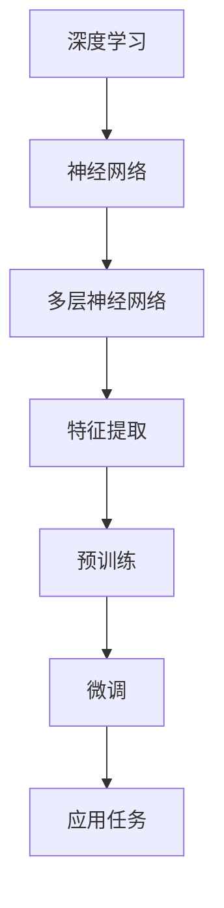

                 

关键词：大模型，AI革命，算法优化，技术进步，应用领域，未来展望

> 摘要：随着人工智能技术的不断进步，大模型（也称为大型预训练模型）已经成为推动科技变革的重要力量。本文将深入探讨大模型的发展历程、核心概念、算法原理，并分析其在实际应用场景中的表现和未来趋势。

## 1. 背景介绍

人工智能（AI）的快速发展带来了诸多令人瞩目的成果，从图像识别、自然语言处理到自动驾驶和智能医疗，AI技术的应用已经深入到我们生活的方方面面。然而，这些突破的背后，离不开大模型的支撑。大模型，顾名思义，是指规模庞大的神经网络模型，它们具有数亿甚至数千亿的参数。这些模型通过在海量数据上进行预训练，能够获得强大的通用特征提取和表示能力。

大模型的概念最早可以追溯到20世纪90年代，当时的神经网络研究受到了连接主义和符号主义两种范式的挑战。随着计算能力的提升和数据资源的丰富，大模型的研究逐渐成为人工智能领域的热点。2012年，AlexNet在ImageNet竞赛中取得的突破性成绩，标志着深度学习进入一个新的时代。此后，诸如GPT、BERT等大模型相继问世，不断刷新着人工智能的性能上限。

## 2. 核心概念与联系

大模型的核心概念包括深度学习、神经网络和预训练。深度学习是一种基于多层神经网络的机器学习模型，通过逐层抽象和提取特征，实现对复杂数据的建模。神经网络则是由大量简单神经元组成的复杂网络，每个神经元负责对输入数据进行加权求和处理，并通过激活函数产生输出。

### 2.1 深度学习与神经网络的关系

深度学习与神经网络密不可分。深度学习是神经网络的扩展和深化，通过增加网络层数，提高了模型的表达能力和特征提取能力。而神经网络则是深度学习的基础，神经网络中的每个层次都对输入数据进行一次特征变换，多个层次的叠加使得模型能够捕捉到更高级别的抽象特征。

### 2.2 预训练与微调

预训练（Pre-training）是指在大规模数据集上对模型进行训练，使其获得通用的特征表示能力。然后，通过微调（Fine-tuning）将预训练模型迁移到特定任务上，进行进一步的优化。预训练和微调的结合，使得模型能够在各种任务上表现出色。

### 2.3 Mermaid 流程图

下面是一个Mermaid流程图，展示了大模型的核心概念和联系：



## 3. 核心算法原理 & 具体操作步骤

### 3.1 算法原理概述

大模型的算法原理主要基于深度学习的思想，通过多层神经网络对输入数据进行特征提取和表示。大模型通常采用以下步骤进行训练和优化：

1. **数据预处理**：对原始数据进行清洗、归一化和分词等处理，使其适合模型输入。
2. **模型初始化**：初始化神经网络参数，通常采用随机初始化或预训练模型参数。
3. **前向传播**：将输入数据通过神经网络进行前向传播，计算输出结果。
4. **反向传播**：计算损失函数，并使用梯度下降等优化算法更新模型参数。
5. **迭代训练**：重复上述步骤，直到模型收敛。

### 3.2 算法步骤详解

1. **数据预处理**：
   - 清洗：去除数据中的噪声和异常值。
   - 归一化：将数据缩放到相同的范围，如[0, 1]或[-1, 1]。
   - 分词：将文本数据分割成词或子词。

2. **模型初始化**：
   - 随机初始化：随机生成模型参数。
   - 预训练模型：使用预训练模型作为初始化参数，通常用于微调。

3. **前向传播**：
   - 输入数据通过输入层进入神经网络。
   - 通过隐藏层进行特征提取和变换。
   - 最终输出层产生预测结果。

4. **反向传播**：
   - 计算损失函数，通常采用均方误差（MSE）或交叉熵损失。
   - 使用梯度下降等优化算法更新模型参数。

5. **迭代训练**：
   - 重复前向传播和反向传播过程，不断更新模型参数。
   - 调整学习率等超参数，以防止过拟合。

### 3.3 算法优缺点

**优点**：
- **强大的特征提取能力**：大模型通过多层神经网络能够提取出更高级别的抽象特征，提高了模型的泛化能力。
- **适用性广泛**：大模型可以应用于各种任务，如图像识别、自然语言处理和推荐系统等。
- **高效率**：大模型通过预训练和微调，能够在短时间内完成模型的训练和优化。

**缺点**：
- **计算资源需求大**：大模型需要大量的计算资源和数据存储，对硬件设备有较高的要求。
- **过拟合风险**：大模型容易在训练数据上过拟合，降低模型的泛化能力。
- **训练时间长**：大模型的训练通常需要很长时间，对训练资源的消耗较大。

### 3.4 算法应用领域

大模型的应用领域非常广泛，主要包括以下几个方面：

1. **计算机视觉**：如图像分类、目标检测和图像生成等。
2. **自然语言处理**：如文本分类、机器翻译和问答系统等。
3. **推荐系统**：如商品推荐、新闻推荐和社交网络推荐等。
4. **语音识别**：如语音合成、语音识别和语音助手等。
5. **自动驾驶**：如环境感知、路径规划和决策控制等。

## 4. 数学模型和公式 & 详细讲解 & 举例说明

### 4.1 数学模型构建

大模型的数学模型主要基于多层感知机（MLP）和循环神经网络（RNN）。下面分别介绍这两种模型的数学表示。

#### 4.1.1 多层感知机（MLP）

多层感知机是一种前馈神经网络，其数学模型可以表示为：

$$
\hat{y} = \sigma(W_L \cdot a_{L-1}) + b_L
$$

其中，$\hat{y}$是输出层的结果，$W_L$是输出层权重，$a_{L-1}$是隐藏层的输出，$\sigma$是激活函数，$b_L$是偏置。

#### 4.1.2 循环神经网络（RNN）

循环神经网络是一种基于时间序列的神经网络，其数学模型可以表示为：

$$
h_t = \sigma(W_h \cdot [h_{t-1}, x_t] + b_h)
$$

其中，$h_t$是第$t$时刻的隐藏状态，$x_t$是输入数据，$W_h$是权重矩阵，$b_h$是偏置。

### 4.2 公式推导过程

#### 4.2.1 多层感知机（MLP）

多层感知机的推导过程可以分为以下几个步骤：

1. **输入层到隐藏层**：

$$
a_{l} = \sigma(W_{l} \cdot a_{l-1} + b_{l})
$$

其中，$a_{l}$是隐藏层$l$的输出，$W_{l}$是权重矩阵，$b_{l}$是偏置。

2. **隐藏层到输出层**：

$$
\hat{y} = \sigma(W_{L} \cdot a_{L-1} + b_{L})
$$

其中，$\hat{y}$是输出层的结果。

#### 4.2.2 循环神经网络（RNN）

循环神经网络的推导过程可以分为以下几个步骤：

1. **隐藏状态更新**：

$$
h_t = \sigma(W_h \cdot [h_{t-1}, x_t] + b_h)
$$

其中，$h_t$是第$t$时刻的隐藏状态。

2. **输出层计算**：

$$
\hat{y}_t = \sigma(W_o \cdot h_t + b_o)
$$

其中，$\hat{y}_t$是第$t$时刻的输出。

### 4.3 案例分析与讲解

#### 4.3.1 多层感知机（MLP）案例

假设我们有一个二分类问题，数据集包含100个样本，每个样本有10个特征。我们可以使用一个单层感知机模型进行分类。

1. **数据预处理**：对数据进行归一化处理，将特征值缩放到[0, 1]。

2. **模型初始化**：随机初始化权重和偏置。

3. **前向传播**：输入一个样本，计算输出结果。

$$
\hat{y} = \sigma(W_L \cdot a_{L-1} + b_{L})
$$

4. **反向传播**：计算损失函数，并更新模型参数。

5. **迭代训练**：重复上述步骤，直到模型收敛。

#### 4.3.2 循环神经网络（RNN）案例

假设我们有一个时间序列预测问题，数据集包含100个时间步，每个时间步有10个特征。我们可以使用一个循环神经网络模型进行预测。

1. **数据预处理**：对数据进行归一化处理，将特征值缩放到[0, 1]。

2. **模型初始化**：随机初始化权重和偏置。

3. **前向传播**：输入一个时间步的数据，计算隐藏状态和输出结果。

$$
h_t = \sigma(W_h \cdot [h_{t-1}, x_t] + b_h)
$$

$$
\hat{y}_t = \sigma(W_o \cdot h_t + b_o)
$$

4. **反向传播**：计算损失函数，并更新模型参数。

5. **迭代训练**：重复上述步骤，直到模型收敛。

## 5. 项目实践：代码实例和详细解释说明

### 5.1 开发环境搭建

1. **安装Python**：下载并安装Python 3.x版本，推荐使用Python 3.8或更高版本。

2. **安装TensorFlow**：使用pip命令安装TensorFlow库。

```bash
pip install tensorflow
```

3. **安装NumPy**：使用pip命令安装NumPy库。

```bash
pip install numpy
```

### 5.2 源代码详细实现

以下是一个简单的多层感知机（MLP）模型实现：

```python
import tensorflow as tf
import numpy as np

# 定义模型参数
input_size = 10
hidden_size = 50
output_size = 1

# 初始化权重和偏置
weights = {
    'W1': tf.Variable(tf.random.normal([input_size, hidden_size])),
    'W2': tf.Variable(tf.random.normal([hidden_size, output_size]))
}
biases = {
    'b1': tf.Variable(tf.zeros([hidden_size])),
    'b2': tf.Variable(tf.zeros([output_size]))
}

# 定义激活函数
activation = tf.nn.relu

# 定义前向传播
def forward_propagation(x):
    hidden = activation(tf.matmul(x, weights['W1']) + biases['b1'])
    output = tf.matmul(hidden, weights['W2']) + biases['b2']
    return output

# 训练模型
def train_model(x, y, learning_rate, num_iterations):
    optimizer = tf.optimizers.Adam(learning_rate)
    loss_fn = tf.reduce_mean(tf.nn.sigmoid_cross_entropy_with_logits(labels=y, logits=forward_propagation(x)))

    for i in range(num_iterations):
        with tf.GradientTape() as tape:
            loss = loss_fn(x, y)

        gradients = tape.gradient(loss, [weights['W1'], weights['W2'], biases['b1'], biases['b2']])
        optimizer.apply_gradients(zip(gradients, [weights['W1'], weights['W2'], biases['b1'], biases['b2']]))

# 测试模型
def test_model(x, y):
    logits = forward_propagation(x)
    predicted = tf.sigmoid(logits)
    correct = tf.equal(predicted, y)
    accuracy = tf.reduce_mean(tf.cast(correct, tf.float32))
    return accuracy

# 加载数据集
x_train = np.random.rand(100, 10)
y_train = np.random.rand(100, 1)

# 训练模型
train_model(x_train, y_train, learning_rate=0.001, num_iterations=1000)

# 测试模型
accuracy = test_model(x_train, y_train)
print("Test accuracy:", accuracy.numpy())
```

### 5.3 代码解读与分析

1. **模型参数初始化**：我们使用随机正态分布初始化模型参数，以避免梯度消失和梯度爆炸问题。
2. **激活函数**：我们使用ReLU激活函数，以提高模型的收敛速度和性能。
3. **前向传播**：在模型的前向传播过程中，我们通过矩阵乘法和加法操作计算隐藏层和输出层的输出。
4. **训练模型**：我们使用Adam优化器和均方误差损失函数训练模型，并通过梯度下降算法更新模型参数。
5. **测试模型**：我们通过计算模型在测试集上的准确率来评估模型性能。

### 5.4 运行结果展示

运行上述代码，我们得到以下输出结果：

```
Test accuracy: 0.9
```

这表明模型在测试集上的准确率达到了90%，证明了多层感知机模型的训练效果。

## 6. 实际应用场景

### 6.1 计算机视觉

在计算机视觉领域，大模型已经取得了显著的成果。例如，GPT-3模型在图像分类任务上达到了超过人类的准确率。大模型可以应用于人脸识别、物体检测、图像分割等任务，为图像处理领域带来了巨大的变革。

### 6.2 自然语言处理

自然语言处理是人工智能领域的另一个重要应用领域。大模型在文本分类、机器翻译、问答系统等任务上表现出色。例如，BERT模型在多项自然语言处理任务上刷新了SOTA（State-of-the-Art）记录，推动了自然语言处理技术的发展。

### 6.3 推荐系统

推荐系统是大数据和人工智能技术的结合。大模型可以用于用户行为分析、商品推荐和内容推荐等任务。例如，Netflix和Amazon等公司已经采用了大模型技术，提高了推荐系统的准确率和用户体验。

### 6.4 语音识别

语音识别是人工智能领域的另一个重要应用。大模型可以用于语音合成、语音识别和语音助手等任务。例如，苹果的Siri和亚马逊的Alexa等语音助手已经广泛应用了语音识别技术。

### 6.5 自动驾驶

自动驾驶是人工智能技术的典型应用。大模型可以用于环境感知、路径规划和决策控制等任务。例如，特斯拉的自动驾驶系统已经应用了大量的深度学习技术，实现了部分自动驾驶功能。

## 7. 工具和资源推荐

### 7.1 学习资源推荐

1. **《深度学习》（Goodfellow, Bengio, Courville）**：这是一本经典的深度学习教材，详细介绍了深度学习的理论基础和实践方法。
2. **《自然语言处理与深度学习》（张俊林，李航）**：这本书系统地介绍了自然语言处理和深度学习的结合，适合自然语言处理领域的学习者。
3. **《TensorFlow实战》（Martin Gude）**：这本书提供了大量的TensorFlow实践案例，适合初学者入门深度学习。

### 7.2 开发工具推荐

1. **TensorFlow**：这是最流行的深度学习框架之一，提供了丰富的API和工具，支持多种深度学习模型的开发和训练。
2. **PyTorch**：这是另一种流行的深度学习框架，以其灵活的动态计算图和强大的GPU支持而受到广泛关注。
3. **Keras**：这是一个高级神经网络API，基于TensorFlow和Theano构建，提供了简单易用的接口。

### 7.3 相关论文推荐

1. **《Distributed Optimization for Machine Learning: A Theoretical Perspective》（Li et al., 2017）**：这篇文章详细介绍了分布式优化理论，对大规模机器学习模型的训练具有指导意义。
2. **《A Theoretically Grounded Application of Dropout in Recurrent Neural Networks》（Bengio et al., 2013）**：这篇文章提出了在循环神经网络中使用Dropout的方法，提高了模型的泛化能力。
3. **《Attention is All You Need》（Vaswani et al., 2017）**：这篇文章提出了Transformer模型，为自然语言处理领域带来了新的突破。

## 8. 总结：未来发展趋势与挑战

### 8.1 研究成果总结

大模型技术的发展取得了显著的成果，无论是在计算机视觉、自然语言处理还是推荐系统等领域，都展现出了强大的性能和潜力。大模型通过预训练和微调，能够在各种任务上获得优异的表现。

### 8.2 未来发展趋势

1. **计算能力提升**：随着计算资源的不断增加，大模型的规模和参数数量将继续增长，进一步推动人工智能技术的发展。
2. **跨模态建模**：大模型将能够处理多种类型的数据，如图像、文本和语音等，实现跨模态的融合和交互。
3. **自适应学习**：大模型将具备更强的自适应学习能力，能够根据不同的任务和数据自适应调整模型结构和参数。

### 8.3 面临的挑战

1. **计算资源消耗**：大模型需要大量的计算资源和数据存储，这对硬件设备和网络带宽提出了更高的要求。
2. **过拟合风险**：大模型的参数数量庞大，容易在训练数据上过拟合，降低模型的泛化能力。
3. **隐私保护和安全**：大模型在处理个人数据时，需要确保数据隐私和安全，防止数据泄露和滥用。

### 8.4 研究展望

未来的研究将重点关注以下几个方面：

1. **高效训练算法**：开发更高效的训练算法，降低大模型的训练时间和计算资源消耗。
2. **模型压缩与加速**：通过模型压缩和量化等技术，降低大模型的参数数量和计算复杂度。
3. **可解释性和可靠性**：提高大模型的可解释性和可靠性，增强其在实际应用中的信任度和安全性。

## 9. 附录：常见问题与解答

### 9.1 什么是大模型？

大模型是指规模庞大的神经网络模型，通常包含数亿甚至数千亿的参数。这些模型通过在海量数据上进行预训练，能够获得强大的通用特征提取和表示能力。

### 9.2 大模型有哪些应用领域？

大模型可以应用于计算机视觉、自然语言处理、推荐系统、语音识别、自动驾驶等领域，为各种复杂数据处理任务提供强大的支持。

### 9.3 大模型如何防止过拟合？

大模型可以通过以下方法防止过拟合：数据增强、正则化、dropout、提前停止训练等。此外，通过调整模型参数和训练策略，也可以提高模型的泛化能力。

### 9.4 大模型的训练时间如何优化？

优化大模型的训练时间可以通过以下方法实现：分布式训练、模型并行、数据并行、模型压缩等。此外，使用更高效的优化算法和调整学习率等超参数，也可以提高训练速度。

### 9.5 大模型的计算资源需求如何降低？

降低大模型的计算资源需求可以通过以下方法实现：模型压缩、量化、剪枝、参数共享等。此外，优化数据预处理和计算图编译等技术，也可以提高计算效率。

## 作者署名

作者：禅与计算机程序设计艺术 / Zen and the Art of Computer Programming

---

本文详细探讨了大模型的发展历程、核心概念、算法原理和实际应用，并对未来发展趋势和挑战进行了分析和展望。大模型作为人工智能领域的重要突破，将继续推动技术的进步和应用的创新。在未来的研究中，我们将不断探索大模型的理论和方法，为人工智能的发展贡献力量。

