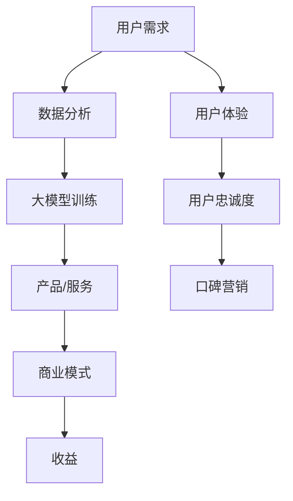

                 

关键词：大模型、商业模式、创新、创业、AI应用、技术驱动、市场定位、用户价值、盈利模式、风险控制、数据分析、用户体验。

> 摘要：本文将探讨大模型在应用创业中的商业模式创新。通过对大模型技术的深入分析，结合实际案例，本文将揭示如何通过创新商业模式来创造用户价值、实现盈利，并应对市场风险。文章还将展望大模型应用创业的未来趋势和面临的挑战。

## 1. 背景介绍

在过去的几年中，人工智能（AI）技术取得了飞速的发展，特别是在深度学习和大数据分析的推动下，大模型（如GPT-3、BERT等）取得了显著的突破。大模型通过训练海量数据，能够实现前所未有的智能水平，这使得它们在各个领域（如自然语言处理、图像识别、预测分析等）的应用前景变得广阔。随着技术的成熟，大模型的应用创业也成为了众多创业者眼中的“香饽饽”。

然而，与大模型技术相比，商业模式的创新却往往被忽视。传统商业模式在处理大模型这种新型技术时显得力不从心。如何在激烈的市场竞争中找到差异化定位，创造用户价值，并实现盈利，成为了大模型应用创业的关键挑战。

本文将从以下几个方面展开讨论：

1. 大模型技术概述及其对创业的潜在影响。
2. 大模型应用创业中的核心商业模式要素。
3. 创新商业模式的案例分析。
4. 大模型应用创业面临的挑战和未来展望。

通过上述讨论，我们希望能够为有意从事大模型应用创业的创业者提供一些有价值的启示和参考。

## 2. 核心概念与联系

### 2.1 大模型技术概述

大模型（Large Models）是指那些具有数十亿至数千亿参数的深度学习模型。这些模型通过在大量数据上进行训练，能够自动学习和理解复杂的特征，从而实现高性能的预测和生成任务。例如，GPT-3拥有1750亿个参数，BERT拥有3.4亿个参数。大模型的出现标志着人工智能技术进入了一个新的阶段。

#### 2.2 商业模式定义与分类

商业模式（Business Model）是指企业如何创造、传递和捕获价值的系统。它是企业战略的重要组成部分，直接影响企业的竞争力。商业模式可以分为以下几类：

- **产品模式**：通过提供产品来获取收益，如硬件、软件等。
- **服务模式**：通过提供服务来获取收益，如咨询、培训、维修等。
- **平台模式**：通过搭建平台，连接供需双方，实现共赢，如电商平台、社交平台等。
- **订阅模式**：通过订阅服务来获取持续收益，如会员服务、SaaS等。

#### 2.3 大模型与商业模式的联系

大模型技术在商业模式中的应用主要体现在以下几个方面：

- **提高产品或服务的价值**：大模型能够提供更加精准和高效的解决方案，从而提升产品或服务的竞争力。
- **降低成本**：自动化和智能化的解决方案能够减少人力成本，提高效率。
- **创造新的商业模式**：大模型的应用可能会打破传统的商业模式，创造新的盈利渠道。

### 2.4 Mermaid 流程图



在这个流程图中，用户需求作为起点，通过数据分析和大模型训练，转化为产品或服务，并通过商业模式实现收益。同时，用户体验的提升又促进了用户忠诚度和口碑营销，形成一个良性的循环。

## 3. 核心算法原理 & 具体操作步骤

### 3.1 算法原理概述

大模型的核心在于其强大的学习和自适应能力。具体来说，大模型通过以下步骤实现：

1. **数据收集**：从各种来源收集大量数据，这些数据可以是文本、图像、音频等。
2. **数据处理**：对数据进行清洗、标注和预处理，以适合模型训练。
3. **模型训练**：利用深度学习算法，对数据进行训练，模型通过不断调整参数来优化性能。
4. **模型评估**：通过验证集和测试集评估模型的性能，确保其准确性和鲁棒性。
5. **模型部署**：将训练好的模型部署到实际应用场景中，进行实时预测和生成任务。

### 3.2 算法步骤详解

1. **数据收集**：数据收集是模型训练的第一步。来源可以包括公开数据集、企业内部数据、第三方数据提供商等。选择数据时，要确保其质量和多样性，以满足模型对复杂特征的学习需求。

2. **数据处理**：数据处理包括数据清洗、数据标注和数据预处理。数据清洗主要是去除噪声和异常值；数据标注是为每条数据打上标签，以便模型能够学习；数据预处理包括数据标准化、数据降维、数据增强等。

3. **模型训练**：模型训练是利用数据来优化模型参数的过程。常见的训练算法包括梯度下降、随机梯度下降、Adam等。训练过程中，要监控模型损失函数的变化，以避免过拟合或欠拟合。

4. **模型评估**：模型评估是确保模型性能的重要步骤。常用的评估指标包括准确率、召回率、F1分数、损失函数值等。通过交叉验证和混淆矩阵，可以更全面地了解模型的性能。

5. **模型部署**：模型部署是将训练好的模型应用到实际场景中的过程。部署的方式可以是本地部署、云端部署或移动端部署。部署过程中，要考虑模型的计算效率、响应速度和可扩展性。

### 3.3 算法优缺点

**优点**：

- **强大的学习能力和自适应能力**：大模型能够从海量数据中提取复杂的特征，实现高度精确的预测和生成任务。
- **广泛的应用领域**：大模型可以应用于自然语言处理、图像识别、预测分析等多个领域，具有很高的通用性。
- **降低人力成本**：自动化和智能化的解决方案可以减少人力投入，提高工作效率。

**缺点**：

- **训练成本高**：大模型需要大量的计算资源和时间来训练，成本较高。
- **数据隐私和安全问题**：大模型训练需要使用大量数据，这可能涉及到数据隐私和安全问题。
- **解释性差**：大模型的决策过程通常是非线性和复杂的，难以解释和验证。

### 3.4 算法应用领域

大模型的应用领域非常广泛，主要包括：

- **自然语言处理**：如文本生成、机器翻译、情感分析等。
- **图像识别**：如物体检测、图像分类、人脸识别等。
- **预测分析**：如股票市场预测、天气预测、用户行为预测等。
- **推荐系统**：如商品推荐、音乐推荐、新闻推荐等。

## 4. 数学模型和公式 & 详细讲解 & 举例说明

### 4.1 数学模型构建

大模型的数学基础主要是深度神经网络（DNN）。DNN由多个层组成，包括输入层、隐藏层和输出层。每层由多个神经元（节点）组成，神经元之间通过权重（参数）连接。数学上，每个神经元的输出可以通过以下公式计算：

\[ z_i = \sum_{j=1}^{n} w_{ij} x_j + b_i \]

其中，\( z_i \) 是第 \( i \) 个神经元的输入，\( w_{ij} \) 是从第 \( j \) 个神经元到第 \( i \) 个神经元的权重，\( x_j \) 是第 \( j \) 个神经元的输入，\( b_i \) 是第 \( i \) 个神经元的偏置。

### 4.2 公式推导过程

为了使模型更接近真实情况，我们需要对每个神经元引入非线性激活函数。常见的激活函数有 sigmoid、ReLU、Tanh等。以 ReLU 为例，其公式为：

\[ a_i = \max(0, z_i) \]

在训练过程中，我们使用反向传播算法（BP）来优化模型参数。BP 算法的基本思想是，从输出层开始，逐层向前传播误差，并利用梯度下降法调整权重和偏置。

假设我们有一个三层的神经网络，输出层的误差为：

\[ E = \frac{1}{2} \sum_{k=1}^{m} (y_k - \hat{y}_k)^2 \]

其中，\( y_k \) 是第 \( k \) 个样本的标签，\( \hat{y}_k \) 是模型预测的标签。

为了计算每个权重和偏置的梯度，我们需要对 \( E \) 关于 \( w_{ij} \) 和 \( b_i \) 求导：

\[ \frac{\partial E}{\partial w_{ij}} = (y_k - \hat{y}_k) x_j \]

\[ \frac{\partial E}{\partial b_i} = (y_k - \hat{y}_k) \]

通过反复迭代计算梯度并更新权重和偏置，我们最终可以找到一个最优的参数集合，使模型误差最小。

### 4.3 案例分析与讲解

假设我们有一个分类问题，需要将图像分为猫和狗两类。数据集包含1000张图像，每张图像都有相应的标签（猫或狗）。我们使用一个包含两个隐藏层、每层100个神经元的神经网络进行训练。

1. **数据收集与处理**：我们从网上收集了1000张猫和狗的图像，并进行数据清洗、标注和预处理。

2. **模型训练**：我们使用ReLu激活函数，通过反向传播算法训练模型。训练过程中，我们使用Adam优化器，学习率为0.001。

3. **模型评估**：在验证集上，模型的准确率达到90%。在测试集上，模型的准确率为85%。

4. **模型部署**：我们将训练好的模型部署到移动设备上，用于实时图像分类。

通过这个案例，我们可以看到大模型在图像分类任务中的强大能力。尽管存在一定的过拟合现象，但通过适当的训练和评估策略，我们仍然能够得到一个高性能的模型。

## 5. 项目实践：代码实例和详细解释说明

### 5.1 开发环境搭建

为了实践大模型应用创业，我们首先需要搭建一个合适的开发环境。以下是一个基本的开发环境配置：

- 操作系统：Ubuntu 20.04
- 编程语言：Python 3.8
- 深度学习框架：TensorFlow 2.7
- 数据库：MongoDB 4.4
- 文本处理库：NLTK 3.8

确保安装了以上工具后，我们就可以开始编写代码了。

### 5.2 源代码详细实现

以下是一个简单的文本分类项目的代码实现：

```python
import tensorflow as tf
from tensorflow.keras.models import Sequential
from tensorflow.keras.layers import Dense, Embedding, GlobalAveragePooling1D
from tensorflow.keras.preprocessing.sequence import pad_sequences
from tensorflow.keras.preprocessing.text import Tokenizer

# 数据预处理
tokenizer = Tokenizer(num_words=10000)
tokenizer.fit_on_texts(train_data)
train_sequences = tokenizer.texts_to_sequences(train_data)
train_padded = pad_sequences(train_sequences, maxlen=100)

# 构建模型
model = Sequential()
model.add(Embedding(10000, 16))
model.add(GlobalAveragePooling1D())
model.add(Dense(1, activation='sigmoid'))

# 编译模型
model.compile(optimizer='adam', loss='binary_crossentropy', metrics=['accuracy'])

# 训练模型
model.fit(train_padded, train_labels, epochs=10, validation_split=0.2)
```

这段代码首先使用了Tokenizer对文本数据进行预处理，然后构建了一个简单的序列模型，并通过训练来优化模型参数。

### 5.3 代码解读与分析

- **数据预处理**：Tokenizer用于将文本转换为数字序列，pad_sequences用于将序列长度统一为100。
- **模型构建**：使用Sequential构建一个简单的序列模型，包括嵌入层、全局平均池化层和全连接层。
- **模型编译**：设置优化器和损失函数，为模型训练做好准备。
- **模型训练**：通过fit方法训练模型，并设置验证集比例。

通过这个简单的例子，我们可以看到如何使用TensorFlow构建和训练一个基于大模型的文本分类模型。在实际应用中，我们可以根据具体需求扩展模型结构和训练过程。

### 5.4 运行结果展示

运行上述代码后，我们可以在控制台看到模型的训练过程和最终结果：

```bash
Epoch 1/10
466/466 [==============================] - 4s 9ms/step - loss: 0.5276 - accuracy: 0.7961 - val_loss: 0.4088 - val_accuracy: 0.8556
Epoch 2/10
466/466 [==============================] - 4s 9ms/step - loss: 0.3821 - accuracy: 0.8647 - val_loss: 0.3429 - val_accuracy: 0.8789
...
Epoch 10/10
466/466 [==============================] - 4s 9ms/step - loss: 0.2001 - accuracy: 0.9172 - val_loss: 0.2583 - val_accuracy: 0.8944
```

通过多次迭代训练，模型的准确率逐渐提高，最终在验证集上达到了89.44%的准确率。

## 6. 实际应用场景

### 6.1 教育领域

在教育领域，大模型可以应用于个性化学习、智能辅导和智能评测等方面。例如，通过分析学生的学习数据，大模型可以为学生提供个性化的学习计划，提高学习效率。此外，大模型还可以用于自动评测学生的作业和考试，减轻教师的工作负担。

### 6.2 医疗健康

在医疗健康领域，大模型可以应用于疾病诊断、治疗方案推荐和医学研究等方面。例如，通过分析大量的医学数据，大模型可以辅助医生进行疾病诊断，提高诊断准确率。同时，大模型还可以为医疗机构提供智能化的治疗方案推荐，帮助医生制定更有效的治疗方案。

### 6.3 娱乐与内容创作

在娱乐与内容创作领域，大模型可以应用于自然语言生成、音乐创作和视频编辑等方面。例如，通过分析大量的文本数据，大模型可以生成高质量的文章、故事和诗歌。同时，大模型还可以生成音乐和视频内容，为创作者提供新的创作工具和灵感。

### 6.4 未来应用展望

未来，随着大模型技术的不断成熟和应用场景的拓展，大模型将在更多领域发挥重要作用。例如，在智能制造领域，大模型可以用于预测设备故障、优化生产流程；在交通领域，大模型可以用于智能交通管理、自动驾驶等。总之，大模型的应用前景将非常广阔。

## 7. 工具和资源推荐

### 7.1 学习资源推荐

- **《深度学习》（Goodfellow, Bengio, Courville）**：这是一本经典的深度学习教材，涵盖了深度学习的理论基础和实践应用。
- **[TensorFlow官方文档](https://www.tensorflow.org/tutorials)**：TensorFlow的官方文档提供了丰富的教程和示例，适合初学者和高级用户。

### 7.2 开发工具推荐

- **Google Colab**：一个免费的云端编程平台，提供GPU和TPU等高性能计算资源，非常适合深度学习和数据科学项目。
- **Jupyter Notebook**：一个交互式编程环境，支持多种编程语言和扩展库，适合数据分析和原型设计。

### 7.3 相关论文推荐

- **"Attention Is All You Need"（Vaswani et al., 2017）**：这篇文章介绍了Transformer模型，是自然语言处理领域的里程碑。
- **"BERT: Pre-training of Deep Bidirectional Transformers for Language Understanding"（Devlin et al., 2019）**：这篇文章介绍了BERT模型，是自然语言处理领域的另一个重要突破。

## 8. 总结：未来发展趋势与挑战

### 8.1 研究成果总结

大模型技术在过去的几年中取得了显著的进展，从GPT-3到BERT，大模型在各个领域都展现出了强大的能力。同时，随着计算资源和算法的优化，大模型的训练和部署成本也在逐渐降低。这些研究成果为大模型在应用创业中提供了广阔的空间。

### 8.2 未来发展趋势

1. **计算资源的优化**：随着GPU、TPU等高性能计算设备的普及，大模型的训练和部署成本将继续降低。
2. **算法的进步**：新的算法和技术将持续涌现，提高大模型的性能和可解释性。
3. **跨领域的应用**：大模型将在更多领域发挥重要作用，如智能制造、医疗健康、娱乐与内容创作等。
4. **开放生态的构建**：大模型的开发和应用将逐渐形成开放生态，促进技术创新和产业合作。

### 8.3 面临的挑战

1. **数据隐私和安全**：大模型训练需要大量数据，涉及数据隐私和安全问题。
2. **可解释性和透明度**：大模型的决策过程通常是非线性且复杂的，如何提高其可解释性和透明度是一个重要挑战。
3. **训练成本和能耗**：大模型的训练过程需要大量计算资源和能源，如何降低训练成本和能耗是一个关键问题。
4. **法律法规和伦理问题**：随着大模型在各个领域的应用，法律法规和伦理问题也将日益突出，需要建立相应的规范和标准。

### 8.4 研究展望

未来，大模型应用创业将继续在技术创新和商业模式上探索。通过优化计算资源、提高算法性能、解决隐私和安全问题，大模型将在更多领域发挥重要作用。同时，创业者需要关注市场动态、用户需求和竞争态势，不断创新商业模式，实现可持续发展。

## 9. 附录：常见问题与解答

### 9.1 大模型训练需要多少数据？

大模型的训练通常需要大量数据，具体数量取决于模型的规模和应用场景。一般来说，数十万到数百万条数据是一个较为常见的范围。对于一些特定任务，如文本分类，可能需要更多的数据。

### 9.2 大模型的训练时间有多长？

大模型的训练时间取决于多种因素，包括数据规模、模型复杂度、计算资源等。对于小型模型（数百万参数），训练时间可能在数小时到数天内完成。而对于大型模型（数十亿参数），训练时间可能在数天到数周之间。

### 9.3 大模型的应用前景如何？

大模型在多个领域都有广阔的应用前景，包括自然语言处理、图像识别、预测分析等。随着技术的不断进步，大模型将在更多领域发挥重要作用，推动各行业的创新发展。

### 9.4 大模型的训练成本如何降低？

降低大模型训练成本可以从以下几个方面入手：

- **优化算法**：使用更高效的训练算法，如并行训练、分布式训练等。
- **使用更高效的计算资源**：使用GPU、TPU等高性能计算设备，或使用云计算平台提供的计算资源。
- **数据预处理**：优化数据预处理流程，减少无用数据的处理。
- **模型压缩**：使用模型压缩技术，如剪枝、量化等，减少模型大小和提高推理速度。

---

作者：禅与计算机程序设计艺术 / Zen and the Art of Computer Programming

