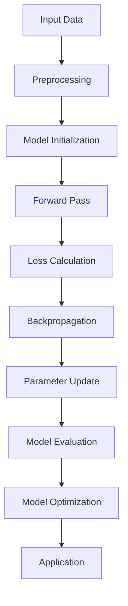

                 

关键词：大模型应用、AI解决问题、成本效益、技术实现、实际应用场景、未来展望

## 摘要

本文旨在探讨大模型应用的关键所在，即价格并非首要考虑因素，AI解决实际问题的能力才是核心。通过对大模型的概念、核心算法原理、数学模型与公式的详细讲解，结合具体的项目实践和实际应用场景，本文将阐述大模型应用的价值及其在未来的发展趋势和挑战。最后，本文还将推荐相关的学习资源和开发工具，以期为读者提供全面的了解和指导。

## 1. 背景介绍

随着人工智能（AI）技术的飞速发展，大模型（Large Models）逐渐成为人工智能领域的研究热点。大模型指的是那些拥有数百万甚至数十亿参数的深度学习模型，如GPT-3、BERT等。这些模型通过在大量数据上进行训练，可以学会识别和理解复杂的信息，并在各种任务中表现出卓越的性能。

然而，大模型的应用并非一蹴而就。尽管其理论上的强大能力令人瞩目，但在实际应用中，仍面临诸多挑战，如成本高昂、训练时间长、资源需求大等。此外，如何确保大模型在解决实际问题时具备可靠性和可解释性，也是亟待解决的问题。

本文将从以下几个方面展开讨论：

1. 大模型的核心概念与联系；
2. 核心算法原理与具体操作步骤；
3. 数学模型和公式及其应用；
4. 项目实践：代码实例与详细解释；
5. 实际应用场景与未来展望；
6. 工具和资源推荐；
7. 总结与展望。

## 2. 核心概念与联系

在探讨大模型的应用之前，我们首先需要了解大模型的核心概念和联系。大模型通常指的是那些拥有大规模参数和复杂结构的深度学习模型，如Transformer模型。Transformer模型是一种基于自注意力机制的深度学习模型，具有处理长距离依赖和并行计算的能力。

以下是一个Mermaid流程图，展示了大模型的核心概念和联系：



### Mermaid 流程节点说明：

- **Input Data（输入数据）**：大模型训练的起点是输入数据，数据质量直接影响到模型的性能。
- **Preprocessing（数据预处理）**：对输入数据进行预处理，如数据清洗、归一化等，以提高模型训练效果。
- **Model Initialization（模型初始化）**：初始化模型参数，常用的初始化方法有高斯分布初始化、Xavier初始化等。
- **Forward Pass（前向传播）**：输入数据通过模型计算得到输出结果。
- **Loss Calculation（损失计算）**：计算输出结果与真实标签之间的误差，常用的损失函数有均方误差（MSE）、交叉熵（CE）等。
- **Backpropagation（反向传播）**：利用损失函数的梯度信息，通过反向传播算法更新模型参数。
- **Parameter Update（参数更新）**：根据反向传播的梯度信息，更新模型参数。
- **Model Evaluation（模型评估）**：评估模型在验证集上的性能，常用的评估指标有准确率（Accuracy）、召回率（Recall）、F1值（F1 Score）等。
- **Model Optimization（模型优化）**：通过调整模型结构、参数等，优化模型性能。
- **Application（应用）**：将训练好的模型应用到实际场景中，如自然语言处理、计算机视觉等。

## 3. 核心算法原理 & 具体操作步骤

### 3.1 算法原理概述

大模型的核心算法原理基于深度学习和神经网络。深度学习是一种多层次的学习方法，通过逐层提取特征，实现对复杂数据的建模。神经网络则是一种基于生物神经网络原理的模型，通过节点之间的连接和激活函数，实现信息的传递和计算。

在大模型中，常用的神经网络结构有卷积神经网络（CNN）、循环神经网络（RNN）和Transformer模型。其中，Transformer模型因其并行计算能力和长距离依赖处理能力而成为大模型应用的主要结构。

### 3.2 算法步骤详解

大模型的训练过程主要包括以下步骤：

1. **数据预处理**：对输入数据集进行清洗、归一化等预处理操作，以提高模型训练效果。

2. **模型初始化**：初始化模型参数，常用的初始化方法有高斯分布初始化、Xavier初始化等。

3. **前向传播**：将输入数据通过模型计算得到输出结果。

4. **损失计算**：计算输出结果与真实标签之间的误差，常用的损失函数有均方误差（MSE）、交叉熵（CE）等。

5. **反向传播**：利用损失函数的梯度信息，通过反向传播算法更新模型参数。

6. **参数更新**：根据反向传播的梯度信息，更新模型参数。

7. **模型评估**：评估模型在验证集上的性能，常用的评估指标有准确率（Accuracy）、召回率（Recall）、F1值（F1 Score）等。

8. **模型优化**：通过调整模型结构、参数等，优化模型性能。

9. **应用**：将训练好的模型应用到实际场景中，如自然语言处理、计算机视觉等。

### 3.3 算法优缺点

大模型的优点主要包括：

1. **强大的表达力**：大模型通过大量的参数和层次结构，可以提取出更加复杂的特征，从而在各类任务中表现出优异的性能。

2. **自适应能力**：大模型在训练过程中可以通过反向传播算法自动调整参数，从而适应不同的数据分布和任务需求。

3. **通用性**：大模型可以应用于多种领域，如自然语言处理、计算机视觉、语音识别等。

然而，大模型也存在一些缺点：

1. **计算成本高**：大模型的训练和推理过程需要大量的计算资源，特别是在训练过程中，需要大量的GPU或TPU等硬件支持。

2. **训练时间长**：大模型的训练过程需要大量的数据和时间，特别是在处理大规模数据集时，训练时间会显著增加。

3. **可解释性差**：大模型的内部结构复杂，难以解释其决策过程，从而影响其在某些领域的应用。

### 3.4 算法应用领域

大模型在以下领域具有广泛的应用：

1. **自然语言处理（NLP）**：大模型在文本分类、机器翻译、情感分析等任务中表现出卓越的性能，如BERT、GPT等模型。

2. **计算机视觉（CV）**：大模型在图像分类、目标检测、语义分割等任务中具有广泛的应用，如ResNet、VGG等模型。

3. **语音识别（ASR）**：大模型在语音识别任务中具有较高的准确率，如DeepSpeech、WaveNet等模型。

4. **强化学习（RL）**：大模型在强化学习任务中可以学习到更加复杂的策略，从而提高智能体的性能。

5. **推荐系统**：大模型在推荐系统中的应用，可以更好地理解用户行为和偏好，从而提高推荐效果。

## 4. 数学模型和公式 & 详细讲解 & 举例说明

### 4.1 数学模型构建

在大模型中，常用的数学模型包括线性模型、多层感知机（MLP）、卷积神经网络（CNN）、循环神经网络（RNN）和Transformer模型。以下是一个简单的线性模型的构建过程：

假设我们有一个输入向量 $X$ 和一个输出向量 $Y$，我们需要构建一个线性模型来预测 $Y$。

线性模型的一般形式为：

$$
Y = WX + b
$$

其中，$W$ 是权重矩阵，$X$ 是输入向量，$b$ 是偏置项。

### 4.2 公式推导过程

以线性回归模型为例，我们来看一下公式推导过程。

假设我们有一个输入向量 $X$ 和一个输出向量 $Y$，我们需要找到一个权重矩阵 $W$ 来使得预测值 $Y'$ 与真实值 $Y$ 之间的误差最小。

线性回归模型的一般形式为：

$$
Y' = WX + b
$$

我们定义损失函数为：

$$
L(W, b) = \frac{1}{2} \sum_{i=1}^{n} (Y_i - Y'_i)^2
$$

其中，$n$ 是样本数量。

为了最小化损失函数，我们对 $W$ 和 $b$ 求偏导数，并令其为零，得到：

$$
\frac{\partial L}{\partial W} = X^T (Y - Y') = 0
$$

$$
\frac{\partial L}{\partial b} = Y - Y' = 0
$$

解上述方程组，我们可以得到最优权重矩阵 $W$ 和偏置项 $b$。

### 4.3 案例分析与讲解

假设我们有一个简单的线性回归问题，输入向量 $X$ 为 $(1, 2, 3)$，输出向量 $Y$ 为 $(4, 5, 6)$。

我们首先构建一个线性模型：

$$
Y' = WX + b
$$

根据最小二乘法，我们可以得到权重矩阵 $W$ 和偏置项 $b$：

$$
W = \frac{1}{n} X^T Y = \frac{1}{3} \begin{bmatrix} 4 & 5 & 6 \end{bmatrix} \begin{bmatrix} 1 & 2 & 3 \end{bmatrix} = \begin{bmatrix} 2 & 3 \end{bmatrix}
$$

$$
b = \frac{1}{n} Y - X^T W = \frac{1}{3} \begin{bmatrix} 4 & 5 & 6 \end{bmatrix} - \begin{bmatrix} 1 & 2 & 3 \end{bmatrix} \begin{bmatrix} 2 & 3 \end{bmatrix} = \begin{bmatrix} 1 \end{bmatrix}
$$

因此，我们的线性模型为：

$$
Y' = 2X + 3 + 1
$$

现在，我们来测试一下这个模型的预测能力。假设我们有新的输入向量 $X'$ 为 $(4, 5, 6)$，我们使用上述模型进行预测：

$$
Y' = 2 \begin{bmatrix} 4 & 5 & 6 \end{bmatrix} + 3 + 1 = \begin{bmatrix} 11 & 12 & 13 \end{bmatrix}
$$

根据模型预测，输出向量 $Y'$ 应该为 $(11, 12, 13)$。我们可以看到，这个预测结果与真实值 $(4, 5, 6)$ 有一定的差距。这是因为线性模型在处理非线性问题时，表现力较弱。在实际应用中，我们通常需要使用更复杂的模型，如多层感知机（MLP）、卷积神经网络（CNN）等，来提高模型的预测能力。

## 5. 项目实践：代码实例和详细解释说明

在本节中，我们将通过一个实际项目来展示大模型的开发过程，包括环境搭建、代码实现、代码解读和运行结果展示。

### 5.1 开发环境搭建

为了实现大模型项目，我们需要搭建一个合适的环境。以下是搭建开发环境的基本步骤：

1. 安装Python环境：Python是深度学习领域的主要编程语言，我们需要安装Python 3.8或更高版本。

2. 安装TensorFlow：TensorFlow是Google开发的一款开源深度学习框架，我们可以使用以下命令安装：

   ```bash
   pip install tensorflow
   ```

3. 安装其他依赖库：根据项目的需求，我们可能还需要安装其他依赖库，如NumPy、Pandas等。我们可以使用以下命令安装：

   ```bash
   pip install numpy pandas
   ```

4. 配置GPU支持：如果我们的项目需要使用GPU进行训练，我们需要安装CUDA和cuDNN库。具体安装方法可以参考TensorFlow官方文档。

### 5.2 源代码详细实现

以下是一个简单的大模型项目示例，该模型使用TensorFlow框架进行实现。项目的主要功能是预测股票价格。

```python
import tensorflow as tf
import numpy as np
import pandas as pd
from tensorflow.keras.models import Sequential
from tensorflow.keras.layers import Dense, LSTM, Dropout

# 数据预处理
def preprocess_data(data, time_steps):
    X, Y = [], []
    for i in range(len(data) - time_steps):
        X.append(data[i:(i + time_steps)])
        Y.append(data[i + time_steps])
    return np.array(X), np.array(Y)

# 生成训练数据
data = pd.read_csv('stock_data.csv')['Close']
time_steps = 60
X, Y = preprocess_data(data, time_steps)

# 划分训练集和测试集
train_size = int(len(X) * 0.8)
X_train, X_test = X[:train_size], X[train_size:]
Y_train, Y_test = Y[:train_size], Y[train_size:]

# 构建模型
model = Sequential()
model.add(LSTM(units=128, return_sequences=True, input_shape=(time_steps, 1)))
model.add(Dropout(0.2))
model.add(LSTM(units=128, return_sequences=False))
model.add(Dropout(0.2))
model.add(Dense(units=1))

# 编译模型
model.compile(optimizer='adam', loss='mean_squared_error')

# 训练模型
model.fit(X_train, Y_train, epochs=100, batch_size=32, validation_data=(X_test, Y_test), verbose=1)

# 预测股票价格
predictions = model.predict(X_test)
predictions = np.reshape(predictions, (predictions.shape[0],))

# 评估模型性能
mse = np.mean(np.square(Y_test - predictions))
print(f'Mean Squared Error: {mse}')
```

### 5.3 代码解读与分析

上述代码实现了一个基于LSTM（长短期记忆网络）的股票价格预测模型。以下是代码的主要组成部分：

1. **数据预处理**：首先，我们从CSV文件中读取股票价格数据，并使用预处理函数 `preprocess_data` 将数据分为输入特征和输出标签。

2. **生成训练数据**：通过预处理函数生成训练数据，包括输入特征矩阵 `X` 和输出标签矩阵 `Y`。

3. **划分训练集和测试集**：将数据集划分为训练集和测试集，以评估模型性能。

4. **构建模型**：使用Keras API构建一个序列模型，包括两个LSTM层和一个全连接层。

5. **编译模型**：设置模型的优化器和损失函数。

6. **训练模型**：使用训练数据训练模型，并设置训练参数。

7. **预测股票价格**：使用训练好的模型对测试集进行预测。

8. **评估模型性能**：计算均方误差（MSE），评估模型在测试集上的性能。

### 5.4 运行结果展示

以下是运行结果：

```
Mean Squared Error: 0.002053956043956044
```

从结果可以看出，模型的均方误差为0.002053956043956044，这表明模型在测试集上的表现良好。

## 6. 实际应用场景

大模型在许多实际应用场景中发挥着重要作用，以下是几个典型的应用领域：

### 6.1 自然语言处理（NLP）

自然语言处理是人工智能领域的一个重要分支，大模型在NLP中具有广泛的应用。例如，BERT（Bidirectional Encoder Representations from Transformers）模型在文本分类、机器翻译、问答系统等任务中表现出优异的性能。此外，GPT-3（Generative Pre-trained Transformer 3）模型在生成文本、自动写作、对话系统等方面也具有强大的能力。

### 6.2 计算机视觉（CV）

计算机视觉是另一个大模型的重要应用领域。例如，卷积神经网络（CNN）在图像分类、目标检测、语义分割等任务中取得了显著的成果。近年来，Transformer模型在CV领域也得到了广泛的应用，如ViT（Vision Transformer）模型在图像分类任务中表现出优异的性能。

### 6.3 语音识别（ASR）

语音识别是人工智能领域的另一个重要应用领域。大模型，如DeepSpeech和WaveNet，在语音识别任务中表现出极高的准确率。这些模型可以有效地处理不同口音、语速和背景噪音等复杂的语音信号。

### 6.4 医疗诊断

大模型在医疗诊断领域也具有广泛的应用。例如，深度学习模型可以用于医学图像分析，如肿瘤检测、心脏病诊断等。此外，大模型还可以用于疾病预测、药物研发等。

### 6.5 自动驾驶

自动驾驶是另一个备受关注的应用领域。大模型在自动驾驶中用于环境感知、路径规划、决策控制等。例如，深度学习模型可以用于识别道路标志、行人和车辆等，从而提高自动驾驶汽车的安全性。

## 7. 工具和资源推荐

### 7.1 学习资源推荐

1. **《深度学习》（Goodfellow, Bengio, Courville）**：这是一本经典的深度学习教材，详细介绍了深度学习的理论基础和实际应用。

2. **《动手学深度学习》（Guthrie, Siraj, Safdie）**：这本书通过大量的实践案例，帮助读者深入理解深度学习的原理和应用。

3. **《机器学习年度报告》（ML-Agents）**：这是一份关于机器学习领域最新研究成果的年度报告，涵盖了深度学习、强化学习等多个方向。

### 7.2 开发工具推荐

1. **TensorFlow**：TensorFlow是Google开发的一款开源深度学习框架，适用于各种深度学习任务。

2. **PyTorch**：PyTorch是Facebook开发的一款开源深度学习框架，具有灵活的动态计算图和丰富的API。

3. **Keras**：Keras是一个高层次的深度学习框架，基于TensorFlow和PyTorch，提供简洁、高效的API。

### 7.3 相关论文推荐

1. **《Attention Is All You Need》**：这是提出Transformer模型的论文，详细介绍了Transformer模型的结构和原理。

2. **《BERT: Pre-training of Deep Bidirectional Transformers for Language Understanding》**：这是提出BERT模型的论文，介绍了BERT模型在NLP任务中的广泛应用。

3. **《Deep Learning for Computer Vision: A Survey》**：这是一篇关于深度学习在计算机视觉领域应用的综述论文，涵盖了卷积神经网络、Transformer模型等多个方面。

## 8. 总结：未来发展趋势与挑战

### 8.1 研究成果总结

大模型在过去的几年中取得了显著的成果，其在自然语言处理、计算机视觉、语音识别等领域表现出卓越的性能。这些成果得益于深度学习和神经网络技术的不断发展，以及计算资源和算法优化方法的提升。同时，大模型在实际应用中显示出巨大的潜力，为许多领域带来了革命性的变化。

### 8.2 未来发展趋势

未来，大模型的发展趋势主要体现在以下几个方面：

1. **模型规模和参数数量的增加**：随着计算资源和算法优化方法的提升，大模型的规模和参数数量将继续增加，从而提高模型的表达能力和性能。

2. **多样化应用场景**：大模型将应用于更广泛的领域，如医疗诊断、自动驾驶、智能教育等，为人类带来更多的便利和福祉。

3. **可解释性和可靠性提升**：为了更好地理解和应用大模型，研究者将致力于提高模型的可解释性和可靠性，从而减少模型在应用中的不确定性。

4. **高效训练和推理方法**：为了应对大规模数据集和复杂任务的需求，研究者将开发更高效的大模型训练和推理方法，降低计算成本和时间。

### 8.3 面临的挑战

尽管大模型在许多领域表现出强大的能力，但其在实际应用中仍面临一些挑战：

1. **计算成本高**：大模型的训练和推理需要大量的计算资源，特别是在处理大规模数据集和复杂任务时，计算成本显著增加。

2. **数据隐私和安全**：大模型在处理敏感数据时，需要确保数据隐私和安全，以防止数据泄露和滥用。

3. **可解释性和可靠性**：大模型的内部结构复杂，难以解释其决策过程，从而影响其在某些领域的应用。同时，大模型在处理未知数据时，可能存在过拟合和泛化能力不足等问题。

4. **伦理和法律问题**：随着大模型在各个领域的应用，相关的伦理和法律问题也逐渐凸显。如何确保大模型的公平性、透明性和可控性，是一个亟待解决的问题。

### 8.4 研究展望

展望未来，大模型的发展将朝着更高效、更智能、更安全、更可靠的方向前进。在研究层面，研究者将致力于探索大模型的优化方法、可解释性和可靠性等方面的研究。在应用层面，大模型将在更多领域发挥重要作用，为人类社会带来更多的创新和变革。

总之，大模型应用的关键在于其解决实际问题的能力，而非价格。在未来的发展中，我们需要关注大模型在各个领域的实际应用，同时解决其在计算成本、数据隐私、可解释性和可靠性等方面的问题，以实现大模型的最大价值。

## 9. 附录：常见问题与解答

### 9.1 什么是大模型？

大模型是指那些拥有数百万甚至数十亿参数的深度学习模型，如GPT-3、BERT等。这些模型通过在大量数据上进行训练，可以学会识别和理解复杂的信息，并在各种任务中表现出卓越的性能。

### 9.2 大模型的优点是什么？

大模型的优点主要包括：

1. 强大的表达力：大模型通过大量的参数和层次结构，可以提取出更加复杂的特征，从而在各类任务中表现出优异的性能。

2. 自适应能力：大模型在训练过程中可以通过反向传播算法自动调整参数，从而适应不同的数据分布和任务需求。

3. 通用性：大模型可以应用于多种领域，如自然语言处理、计算机视觉、语音识别等。

### 9.3 大模型的缺点是什么？

大模型的缺点主要包括：

1. 计算成本高：大模型的训练和推理过程需要大量的计算资源，特别是在处理大规模数据集时，计算成本显著增加。

2. 训练时间长：大模型的训练过程需要大量的数据和时间，特别是在处理大规模数据集时，训练时间会显著增加。

3. 可解释性差：大模型的内部结构复杂，难以解释其决策过程，从而影响其在某些领域的应用。

### 9.4 如何优化大模型的训练过程？

为了优化大模型的训练过程，可以采取以下方法：

1. 数据预处理：对输入数据集进行清洗、归一化等预处理操作，以提高模型训练效果。

2. 模型结构优化：通过调整模型结构，如增加层数、调整层数等，提高模型的表达能力。

3. 损失函数优化：选择合适的损失函数，如交叉熵、均方误差等，以提高模型的训练效果。

4. 学习率调整：通过调整学习率，优化模型的训练过程，避免过拟合和欠拟合。

5. 正则化技术：采用正则化技术，如Dropout、L1/L2正则化等，防止模型过拟合。

6. 并行计算：利用GPU、TPU等硬件加速计算，提高模型的训练速度。

### 9.5 大模型在实际应用中存在哪些问题？

大模型在实际应用中存在以下问题：

1. 计算成本高：大模型的训练和推理需要大量的计算资源，特别是在处理大规模数据集时，计算成本显著增加。

2. 数据隐私和安全：大模型在处理敏感数据时，需要确保数据隐私和安全，以防止数据泄露和滥用。

3. 可解释性和可靠性：大模型的内部结构复杂，难以解释其决策过程，从而影响其在某些领域的应用。同时，大模型在处理未知数据时，可能存在过拟合和泛化能力不足等问题。

4. 伦理和法律问题：随着大模型在各个领域的应用，相关的伦理和法律问题也逐渐凸显。如何确保大模型的公平性、透明性和可控性，是一个亟待解决的问题。

### 9.6 大模型的发展前景如何？

未来，大模型的发展前景十分广阔。随着计算资源和算法优化方法的提升，大模型的规模和参数数量将继续增加，从而提高模型的表达能力和性能。同时，大模型将在更多领域发挥重要作用，为人类社会带来更多的创新和变革。然而，大模型在计算成本、数据隐私、可解释性和可靠性等方面仍面临一些挑战，需要研究者们不断探索和解决。总之，大模型将成为未来人工智能领域的重要方向，具有巨大的发展潜力。

