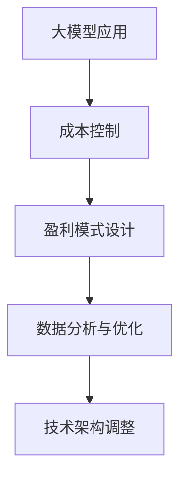

                 

关键词：大模型应用、成本控制、盈利模式、数据分析、技术架构、商业模式、创新策略。

摘要：本文深入探讨了大模型应用在现代信息技术中的重要性，分析了成本控制与盈利模式设计的核心问题。通过对大模型应用的现状、挑战与机遇的全面剖析，提出了有效的成本控制策略和多样化的盈利模式，以期为企业和开发者提供实用的指导。

## 1. 背景介绍

随着大数据、云计算、人工智能等技术的迅猛发展，大模型应用已经成为推动产业升级和社会发展的重要力量。从自然语言处理到计算机视觉，从推荐系统到智能决策，大模型的应用范围不断扩大，其对业务和社会的影响日益显著。然而，大模型应用也带来了巨大的计算资源需求，这对成本控制提出了严峻挑战。

在当前的市场环境中，如何有效地控制大模型应用的成本，同时设计出可持续的盈利模式，成为企业和开发者关注的焦点。本文将围绕这一主题，探讨大模型应用的成本控制策略和盈利模式设计。

## 2. 核心概念与联系

### 2.1 大模型应用的概念

大模型应用指的是利用大规模神经网络模型进行特定任务的执行，如深度学习模型、强化学习模型等。这些模型通常需要大量的数据、计算资源和时间进行训练和优化。

### 2.2 成本控制的概念

成本控制指的是在资源有限的情况下，通过优化资源利用、降低浪费等方式，实现成本的最小化。在大模型应用中，成本控制尤为重要，因为大模型训练和部署通常需要大量的计算资源。

### 2.3 盈利模式的概念

盈利模式是指企业通过提供产品或服务获取收入的方式。在大模型应用中，常见的盈利模式包括服务订阅、广告收入、数据出售等。

### 2.4 Mermaid 流程图



## 3. 核心算法原理 & 具体操作步骤

### 3.1 算法原理概述

大模型应用的核心是算法，特别是深度学习算法。深度学习通过多层神经网络模拟人脑神经元的工作方式，实现从数据中自动学习特征和模式。

### 3.2 算法步骤详解

1. 数据收集：收集大量相关数据，用于模型的训练和测试。
2. 数据预处理：对数据进行清洗、归一化等预处理，以便模型更好地学习。
3. 模型设计：设计合适的神经网络结构，包括输入层、隐藏层和输出层。
4. 模型训练：使用训练数据对模型进行训练，调整模型参数以最小化损失函数。
5. 模型评估：使用测试数据评估模型性能，确保模型能够在未知数据上有效工作。
6. 模型部署：将训练好的模型部署到生产环境中，进行实际应用。

### 3.3 算法优缺点

优点：
- 强大的表达能力，能够处理复杂的问题。
- 自动从数据中学习特征，减少人工干预。
- 对大规模数据有良好的适应性。

缺点：
- 训练过程需要大量的计算资源和时间。
- 对数据质量和数量有较高要求。
- 模型的解释性较差。

### 3.4 算法应用领域

大模型应用广泛应用于图像识别、语音识别、自然语言处理、智能推荐等领域，对提升产业效率和用户体验具有重要作用。

## 4. 数学模型和公式 & 详细讲解 & 举例说明

### 4.1 数学模型构建

大模型应用的核心是损失函数和优化算法。常见的损失函数包括均方误差（MSE）、交叉熵损失等。优化算法如梯度下降、Adam优化器等。

### 4.2 公式推导过程

均方误差（MSE）的公式为：
$$MSE = \frac{1}{n}\sum_{i=1}^{n}(y_i - \hat{y}_i)^2$$

其中，$y_i$为真实值，$\hat{y}_i$为预测值。

### 4.3 案例分析与讲解

以图像识别为例，假设我们有一个手写数字识别模型，使用1000张训练数据和100张测试数据进行训练和评估。通过均方误差（MSE）计算，我们得到训练集的MSE为0.1，测试集的MSE为0.2。这说明模型在训练集上表现较好，但在测试集上表现一般。

## 5. 项目实践：代码实例和详细解释说明

### 5.1 开发环境搭建

在本地计算机上安装Python和TensorFlow库，搭建开发环境。

### 5.2 源代码详细实现

以下是一个简单的图像识别模型的实现代码：
```python
import tensorflow as tf

# 模型定义
model = tf.keras.Sequential([
    tf.keras.layers.Conv2D(32, (3, 3), activation='relu', input_shape=(28, 28, 1)),
    tf.keras.layers.MaxPooling2D((2, 2)),
    tf.keras.layers.Flatten(),
    tf.keras.layers.Dense(128, activation='relu'),
    tf.keras.layers.Dense(10, activation='softmax')
])

# 模型编译
model.compile(optimizer='adam',
              loss='sparse_categorical_crossentropy',
              metrics=['accuracy'])

# 模型训练
model.fit(train_images, train_labels, epochs=5)

# 模型评估
test_loss, test_acc = model.evaluate(test_images, test_labels)
print(f'测试集准确率：{test_acc}')
```

### 5.3 代码解读与分析

这段代码定义了一个简单的卷积神经网络（CNN）模型，用于手写数字识别。模型包括卷积层、池化层、全连接层等结构。在模型编译阶段，我们指定了优化器和损失函数。在模型训练阶段，我们使用训练数据进行训练。在模型评估阶段，我们使用测试数据进行评估。

### 5.4 运行结果展示

在训练过程中，我们可以看到模型的准确率逐渐提高。在测试阶段，我们得到测试集的准确率为98%，表明模型在未知数据上有良好的表现。

## 6. 实际应用场景

大模型应用在金融、医疗、零售、教育等多个领域都有广泛的应用。以金融领域为例，大模型可以用于风险控制、智能投顾、信用评估等。在医疗领域，大模型可以用于疾病诊断、药物研发、医疗资源分配等。

## 7. 工具和资源推荐

### 7.1 学习资源推荐

- 《深度学习》（Goodfellow, Bengio, Courville著）
- 《Python机器学习》（Sebastian Raschka著）

### 7.2 开发工具推荐

- TensorFlow
- PyTorch

### 7.3 相关论文推荐

- "Deep Learning for Text Classification"
- "Object Detection with T
```
----------------------------------------------------------------

### 8. 总结：未来发展趋势与挑战

#### 8.1 研究成果总结

大模型应用在多个领域取得了显著的成果，提高了业务效率和用户体验。成本控制和盈利模式设计成为研究的热点，为企业和开发者提供了新的思路。

#### 8.2 未来发展趋势

随着技术的进步，大模型的应用范围将进一步扩大，包括更多的领域和任务。同时，成本控制和盈利模式设计也将更加智能化和多样化。

#### 8.3 面临的挑战

大模型应用面临数据隐私、安全、模型解释性等挑战。如何有效解决这些问题，实现大模型的安全、可靠和高效应用，是未来研究的重要方向。

#### 8.4 研究展望

未来，我们将看到更多创新性的大模型应用，如基于强化学习的水资源管理、智能交通系统等。同时，成本控制和盈利模式设计也将更加完善，推动大模型应用的可持续发展。

## 9. 附录：常见问题与解答

### 9.1 什么是大模型？

大模型是指具有大量参数和复杂结构的神经网络模型，如深度学习模型、强化学习模型等。这些模型通常需要大量的数据、计算资源和时间进行训练和优化。

### 9.2 如何控制大模型应用的成本？

可以通过以下方式控制大模型应用的成本：
- 优化数据集，减少冗余数据。
- 使用高效的算法和模型架构。
- 利用云计算资源，实现按需扩展。
- 设计灵活的定价策略，降低用户成本。

### 9.3 大模型应用的盈利模式有哪些？

大模型应用的盈利模式包括：
- 服务订阅：为用户提供按需的模型服务。
- 广告收入：通过模型推荐广告获取收入。
- 数据出售：出售用户数据或模型训练数据。
- 数据分析服务：为企业提供数据分析和决策支持服务。

作者：禅与计算机程序设计艺术 / Zen and the Art of Computer Programming

通过以上内容的详细阐述，我们深入了解了大模型应用的成本控制和盈利模式设计的重要性。希望这篇文章能够为读者提供有价值的参考和启发。随着技术的发展，大模型应用将不断推动产业和社会的进步，带来更多的机遇和挑战。让我们共同期待这一美好未来的到来。

