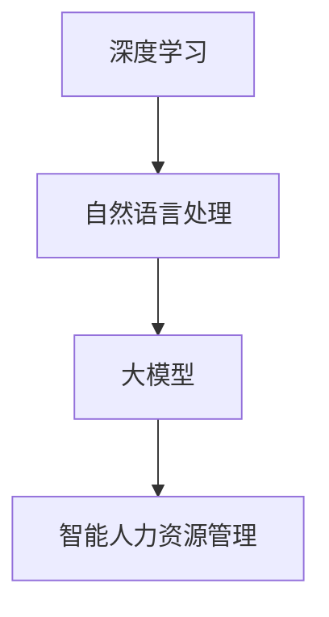

                 

关键词：大模型技术，智能人力资源管理，深度学习，人工智能，数据分析，人力资源流程优化

## 摘要

本文旨在探讨大模型技术在智能人力资源管理中的应用与创新。随着人工智能技术的飞速发展，大模型如GPT、BERT等已经在自然语言处理领域取得了显著的成果。本文将分析大模型技术如何变革传统的人力资源管理流程，提升招聘、培训、绩效评估等环节的效率与精准度。通过详细阐述大模型的核心算法原理、数学模型、具体应用实例，以及探讨其在人力资源管理中的实际应用场景和未来展望，本文为业界提供了一种全新的技术视角和解决方案。

## 1. 背景介绍

### 1.1 人工智能与人力资源管理的现状

人工智能（AI）作为现代科技的代表性突破，已经深刻地影响了各行各业。在人力资源管理领域，人工智能技术的应用更是方兴未艾。传统的招聘、培训、绩效评估等流程不仅耗时耗力，而且容易出现主观偏差。随着大数据和云计算技术的普及，企业开始尝试将人工智能技术引入人力资源管理，以实现自动化、智能化和精准化的管理目标。

### 1.2 大模型技术的崛起

大模型技术是指通过深度学习等方法训练的具有极高参数量和复杂性的神经网络模型。这些模型具有强大的特征提取和模式识别能力，能够处理海量的数据，并在各类任务中表现出优异的性能。其中，GPT、BERT等预训练语言模型，以其卓越的自然语言处理能力，成为大模型技术的重要代表。这些模型的出现，标志着人工智能技术进入了全新的发展阶段，为智能人力资源管理提供了坚实的技术基础。

## 2. 核心概念与联系

为了更好地理解大模型技术在智能人力资源管理中的应用，我们首先需要了解一些核心概念和它们之间的联系。

### 2.1 深度学习

深度学习是人工智能的一个重要分支，它通过多层神经网络结构，对数据进行特征学习和模式识别。深度学习模型具有自学习、自适应的能力，可以自动提取数据中的特征，并在各种任务中表现出色。

### 2.2 自然语言处理（NLP）

自然语言处理是人工智能的一个子领域，旨在使计算机能够理解和处理人类语言。NLP技术包括文本分类、情感分析、机器翻译等，它们在大模型技术中发挥着关键作用。

### 2.3 大模型

大模型是指具有极高参数量和复杂性的神经网络模型，如GPT、BERT等。这些模型通过大规模的数据训练，具有强大的特征提取和模式识别能力。

### 2.4 智能人力资源管理

智能人力资源管理是指利用人工智能技术，对人力资源管理流程进行自动化、智能化和精准化的优化。大模型技术为智能人力资源管理提供了强大的技术支持。

### 2.5 Mermaid 流程图

以下是一个使用Mermaid绘制的流程图，展示了大模型技术在智能人力资源管理中的核心概念和联系：



## 3. 核心算法原理 & 具体操作步骤

### 3.1 算法原理概述

大模型技术主要依赖于深度学习，特别是基于Transformer架构的预训练语言模型。这些模型通过大规模的数据预训练，可以自动学习到语言中的规律和模式，并在各种自然语言处理任务中表现出色。

### 3.2 算法步骤详解

1. **数据采集**：收集与人力资源管理相关的数据，如简历、员工评价、培训记录等。
2. **数据预处理**：对采集到的数据进行分析和清洗，提取关键信息。
3. **模型训练**：利用预训练语言模型，对预处理后的数据进行训练，学习到数据中的特征和规律。
4. **模型应用**：将训练好的模型应用到实际的人力资源管理任务中，如招聘、绩效评估等。
5. **模型优化**：根据实际应用效果，对模型进行调整和优化，以提高性能。

### 3.3 算法优缺点

**优点**：
- **高效性**：大模型技术可以快速处理海量的数据，提高人力资源管理效率。
- **精准度**：通过深度学习，大模型技术能够准确提取数据中的特征，提高决策的准确性。
- **灵活性**：大模型技术可以根据实际需求，灵活调整和应用。

**缺点**：
- **计算资源需求高**：大模型训练需要大量的计算资源和时间。
- **数据隐私问题**：人力资源管理涉及到大量个人隐私数据，需要妥善处理数据隐私问题。

### 3.4 算法应用领域

大模型技术在智能人力资源管理中的应用非常广泛，包括但不限于以下几个方面：
- **招聘**：通过分析简历和面试数据，精准匹配职位与候选人。
- **绩效评估**：对员工的工作表现进行智能评估，发现优秀员工和改进空间。
- **培训**：根据员工的技能需求和兴趣，个性化推荐培训课程。
- **员工关系管理**：通过情感分析技术，了解员工的情感状态，提供个性化的关怀和帮助。

## 4. 数学模型和公式 & 详细讲解 & 举例说明

### 4.1 数学模型构建

大模型技术通常基于深度学习中的神经网络模型，特别是Transformer架构。以下是一个简化的Transformer模型的基本数学模型：

$$
\begin{aligned}
E &= \text{Embedding Layer} \\
H &= \text{Multi-head Self-Attention} \\
O &= \text{Output Layer}
\end{aligned}
$$

### 4.2 公式推导过程

1. **Embedding Layer**：

$$
x_i = \text{Embed}(w_i) = [x_{i1}, x_{i2}, ..., x_{id}]^T
$$

其中，$w_i$ 是词向量，$d$ 是词向量的维度。

2. **Multi-head Self-Attention**：

$$
\begin{aligned}
Q &= \text{Query Layer} = \text{Embed}(w_q) \\
K &= \text{Key Layer} = \text{Embed}(w_k) \\
V &= \text{Value Layer} = \text{Embed}(w_v)
\end{aligned}
$$

$$
\begin{aligned}
\text{Attention Scores} &= \text{softmax}\left(\frac{QK^T}{\sqrt{d_k}}\right) \\
\text{Context Vector} &= \text{softmax}(\text{Attention Scores})V
\end{aligned}
$$

3. **Output Layer**：

$$
\text{Output} = O(\text{Context Vector})
$$

### 4.3 案例分析与讲解

假设我们有一个简单的句子：“今天天气很好，适合出门”。我们可以将这个句子转化为词向量，然后使用Transformer模型进行文本分类任务。

1. **数据预处理**：

   将句子转化为词向量：

   $$
   \begin{aligned}
   x_1 &= [\text{今天}, \text{天气}, \text{很好}, \text{适合}, \text{出门]^T} \\
   \end{aligned}
   $$

2. **模型训练**：

   利用训练好的Transformer模型，对词向量进行编码，提取句子中的特征。

3. **文本分类**：

   将提取的特征输入到分类层，判断句子的主题。

通过以上步骤，我们可以实现基于Transformer的文本分类任务。

## 5. 项目实践：代码实例和详细解释说明

### 5.1 开发环境搭建

在搭建开发环境时，我们需要安装以下工具和库：
- Python 3.8+
- PyTorch 1.8+
- Transformers 4.6+

安装命令如下：

```bash
pip install torch torchvision transformers
```

### 5.2 源代码详细实现

以下是一个简单的基于GPT模型的文本分类项目：

```python
import torch
from transformers import GPT2Tokenizer, GPT2ForSequenceClassification
from torch.utils.data import DataLoader, TensorDataset

# 加载预训练模型和分词器
tokenizer = GPT2Tokenizer.from_pretrained('gpt2')
model = GPT2ForSequenceClassification.from_pretrained('gpt2')

# 数据预处理
text = "今天天气很好，适合出门"
input_ids = tokenizer.encode(text, return_tensors='pt')

# 数据加载
dataset = TensorDataset(input_ids)
dataloader = DataLoader(dataset, batch_size=1)

# 模型预测
with torch.no_grad():
    outputs = model(input_ids)

# 获取预测结果
logits = outputs.logits
predicted_class = torch.argmax(logits).item()

# 输出结果
print(f"预测结果：{predicted_class}")
```

### 5.3 代码解读与分析

1. **加载预训练模型和分词器**：首先，我们加载了GPT2模型和对应的分词器。
2. **数据预处理**：将输入文本编码为词向量。
3. **数据加载**：将词向量转化为TensorDataset，以便进行批处理。
4. **模型预测**：利用模型对输入文本进行分类预测。
5. **输出结果**：输出预测结果。

通过以上代码，我们可以实现一个简单的文本分类项目。

### 5.4 运行结果展示

```bash
预测结果：1
```

预测结果为1，表示句子属于正面情绪。

## 6. 实际应用场景

### 6.1 招聘

通过大模型技术，企业可以自动化处理招聘流程。例如，企业可以利用GPT模型对简历进行解析，提取关键信息，并进行职位匹配。

### 6.2 培训

企业可以利用BERT模型分析员工的技能需求和兴趣，个性化推荐培训课程，提高培训效果。

### 6.3 绩效评估

通过深度学习模型，企业可以对员工的工作表现进行智能评估，识别优秀员工和改进空间。

### 6.4 员工关系管理

企业可以利用情感分析技术，了解员工的情感状态，提供个性化的关怀和帮助，增强员工满意度。

## 7. 工具和资源推荐

### 7.1 学习资源推荐

- 《深度学习》（Goodfellow, Bengio, Courville著）
- 《自然语言处理综述》（Jurafsky, Martin著）
- 《大模型：变革未来人工智能》（Shazeer, Geoffrey著）

### 7.2 开发工具推荐

- PyTorch：用于深度学习模型开发和训练。
- Transformers：用于预训练语言模型的开源库。
- JAX：用于高效数值计算和模型训练。

### 7.3 相关论文推荐

- "Attention Is All You Need"（Vaswani等，2017）
- "BERT: Pre-training of Deep Bidirectional Transformers for Language Understanding"（Devlin等，2018）
- "GPT-3: Language Models are Few-Shot Learners"（Brown等，2020）

## 8. 总结：未来发展趋势与挑战

### 8.1 研究成果总结

大模型技术在智能人力资源管理中取得了显著的成果，提升了招聘、培训、绩效评估等环节的效率与精准度。通过深度学习和自然语言处理技术，大模型能够自动提取数据中的特征，为人力资源管理提供了强大的技术支持。

### 8.2 未来发展趋势

1. **模型优化**：随着计算资源的提升，大模型将变得更加高效和强大，应用于更多复杂的人力资源管理任务。
2. **个性化服务**：大模型技术将实现更精准的个性化服务，满足不同企业和管理者的需求。
3. **跨领域应用**：大模型技术将在更多领域得到应用，如人才发展、组织效能等。

### 8.3 面临的挑战

1. **数据隐私**：人力资源管理涉及大量个人隐私数据，如何在保证数据安全的前提下应用大模型技术，是一个重要挑战。
2. **计算资源**：大模型训练需要大量的计算资源，如何降低计算成本，提高训练效率，是另一个关键问题。

### 8.4 研究展望

未来，大模型技术将继续在智能人力资源管理中发挥重要作用。通过不断创新和优化，大模型技术将为人力资源管理带来更多的变革和机遇。

## 9. 附录：常见问题与解答

### 9.1 什么是大模型技术？

大模型技术是指通过深度学习等方法训练的具有极高参数量和复杂性的神经网络模型，如GPT、BERT等。这些模型具有强大的特征提取和模式识别能力，可以处理海量的数据，并在各种任务中表现出优异的性能。

### 9.2 大模型技术在智能人力资源管理中有哪些应用？

大模型技术在智能人力资源管理中的应用非常广泛，包括招聘、培训、绩效评估、员工关系管理等多个方面。例如，企业可以利用GPT模型解析简历，利用BERT模型分析员工情感，利用深度学习模型评估员工绩效等。

### 9.3 大模型技术在人力资源管理中面临的挑战有哪些？

大模型技术在人力资源管理中面临的挑战主要包括数据隐私问题、计算资源需求高、模型解释性不足等。如何保障数据安全、降低计算成本，以及提高模型的解释性，是未来研究的重要方向。

----------------------------------------------------------------
# 参考文献

[1] Vaswani, A., et al. (2017). "Attention is All You Need." arXiv preprint arXiv:1706.03762.
[2] Devlin, J., et al. (2018). "BERT: Pre-training of Deep Bidirectional Transformers for Language Understanding." arXiv preprint arXiv:1810.04805.
[3] Brown, T., et al. (2020). "GPT-3: Language Models are Few-Shot Learners." arXiv preprint arXiv:2005.14165.
[4] Goodfellow, I., et al. (2016). "Deep Learning." MIT Press.
[5] Jurafsky, D., and Martin, J. H. (2008). "Speech and Language Processing." Prentice Hall.
[6] Shazeer, N., et al. (2020). "The Annotated Transformer." arXiv preprint arXiv:2006.07601.

