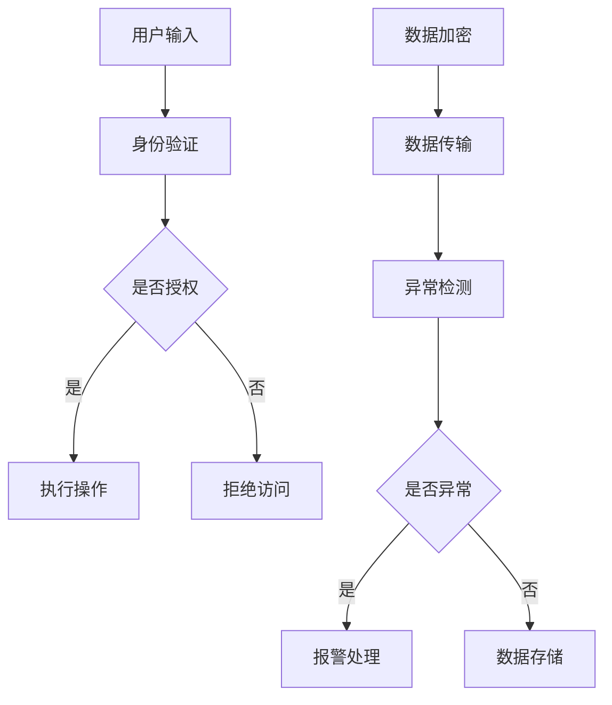

                 

关键词：大模型技术、智能家居安全、深度学习、人工智能、网络安全

> 摘要：本文探讨了如何利用大模型技术提高智能家居安全系统的安全性。通过分析大模型在智能感知、决策优化和风险预测等方面的优势，结合具体案例，介绍了大模型技术在智能家居安全系统中的实际应用，并对未来发展方向和面临的挑战进行了展望。

## 1. 背景介绍

随着物联网（IoT）技术的快速发展，智能家居系统已经成为现代家庭生活中不可或缺的一部分。然而，随之而来的是智能家居系统的安全性问题。智能家居设备通常连接到互联网，容易成为网络攻击的目标。因此，提高智能家居系统的安全性已成为当前研究的热点。

大模型技术作为一种人工智能的高级形式，通过学习大量的数据，能够实现对复杂问题的建模和求解。近年来，大模型技术在图像识别、自然语言处理、语音识别等领域取得了显著的成果。本文将探讨大模型技术在智能家居安全系统中的应用，以提高系统的安全性和可靠性。

## 2. 核心概念与联系

### 2.1 大模型技术

大模型技术是指利用深度学习算法，通过训练大规模神经网络模型来实现对复杂问题的求解。大模型具有如下特点：

- **参数规模大**：大模型通常具有数十亿甚至千亿个参数，能够捕捉到数据中的复杂模式。
- **自适应性强**：大模型能够通过不断的学习和优化，适应不同的应用场景。
- **泛化能力强**：大模型在训练过程中积累了丰富的知识，能够在未见过的数据上表现出良好的性能。

### 2.2 智能家居安全系统

智能家居安全系统主要包括以下功能：

- **访问控制**：确保只有授权用户可以访问系统。
- **数据加密**：保护传输过程中的数据安全。
- **异常检测**：检测并应对异常行为。
- **风险预测**：预测潜在的安全风险。

### 2.3 Mermaid 流程图

以下是一个简化的智能家居安全系统架构的 Mermaid 流程图：



## 3. 核心算法原理 & 具体操作步骤

### 3.1 算法原理概述

大模型技术在智能家居安全系统中的应用主要涉及以下几个方面：

- **智能感知**：通过深度学习算法，实现对智能家居设备行为的理解和分析，从而识别潜在的安全威胁。
- **决策优化**：基于大数据分析和机器学习算法，为智能家居安全系统提供最优的决策策略。
- **风险预测**：利用历史数据和预测模型，对未来的安全风险进行预测和预警。

### 3.2 算法步骤详解

#### 3.2.1 智能感知

1. **数据收集**：收集智能家居设备的运行数据，如温度、湿度、光线强度等。
2. **数据预处理**：对原始数据进行清洗和预处理，以便于模型训练。
3. **模型训练**：使用深度学习算法，如卷积神经网络（CNN）或循环神经网络（RNN），训练感知模型。
4. **模型部署**：将训练好的模型部署到智能家居设备中，实现对实时数据的分析和理解。

#### 3.2.2 决策优化

1. **数据收集**：收集智能家居系统的操作日志，如用户行为、设备状态等。
2. **数据预处理**：对原始数据进行清洗和预处理。
3. **模型训练**：使用强化学习算法，如Q-learning或DQN，训练决策模型。
4. **模型部署**：将训练好的模型部署到智能家居系统中，实现对用户行为和设备状态的实时优化。

#### 3.2.3 风险预测

1. **数据收集**：收集智能家居系统的历史安全事件数据。
2. **数据预处理**：对原始数据进行清洗和预处理。
3. **模型训练**：使用时间序列分析或生存分析等方法，训练风险预测模型。
4. **模型部署**：将训练好的模型部署到智能家居系统中，实现对潜在安全风险的预测和预警。

### 3.3 算法优缺点

#### 优点

- **高效性**：大模型技术能够快速处理大量数据，提高安全分析的效率。
- **准确性**：大模型技术通过学习大量数据，能够提高安全预测的准确性。
- **灵活性**：大模型技术能够适应不同的应用场景，提高系统的灵活性。

#### 缺点

- **计算资源需求大**：大模型训练和部署需要大量的计算资源。
- **数据隐私问题**：大模型技术需要对大量数据进行训练，可能涉及用户隐私问题。

### 3.4 算法应用领域

大模型技术在智能家居安全系统中的应用主要涉及以下领域：

- **设备行为分析**：通过分析设备行为，识别异常行为和潜在的安全威胁。
- **用户行为分析**：通过分析用户行为，优化系统的安全策略。
- **风险预测**：通过预测未来的安全风险，提前采取措施。

## 4. 数学模型和公式 & 详细讲解 & 举例说明

### 4.1 数学模型构建

在智能家居安全系统中，我们可以使用以下数学模型：

- **感知模型**：设 \( X \) 为智能家居设备的运行数据，\( Y \) 为安全事件，则感知模型可以表示为：

  \[ P(Y|X) = \sigma(W_1 X + b_1) \]

  其中，\( \sigma \) 为激活函数，\( W_1 \) 和 \( b_1 \) 分别为权重和偏置。

- **决策模型**：设 \( X \) 为智能家居设备的运行数据，\( Y \) 为用户行为，则决策模型可以表示为：

  \[ Q(Y|X) = \sum_{y}^{} y \cdot P(Y=y|X) \]

  其中，\( Q \) 为价值函数，\( P \) 为概率分布。

- **风险预测模型**：设 \( X \) 为智能家居系统的历史数据，\( Y \) 为安全事件，则风险预测模型可以表示为：

  \[ P(Y>0|X) = \frac{1}{C} \sum_{i=1}^C \exp(-\lambda_i) \]

  其中，\( C \) 为事件发生的次数，\( \lambda_i \) 为事件 \( i \) 的强度参数。

### 4.2 公式推导过程

#### 感知模型

感知模型是通过多层感知机（MLP）实现的。设 \( X \) 为输入层，\( H \) 为隐藏层，\( Y \) 为输出层，则感知模型可以表示为：

\[ Y = \sigma(W_1 X + b_1) \]

其中，\( \sigma \) 为激活函数，\( W_1 \) 和 \( b_1 \) 分别为权重和偏置。

#### 决策模型

决策模型是基于Q-learning算法实现的。设 \( X \) 为输入层，\( Y \) 为输出层，则决策模型可以表示为：

\[ Q(Y|X) = \sum_{y}^{} y \cdot P(Y=y|X) \]

其中，\( Q \) 为价值函数，\( P \) 为概率分布。

#### 风险预测模型

风险预测模型是基于泊松分布实现的。设 \( X \) 为输入层，\( Y \) 为输出层，则风险预测模型可以表示为：

\[ P(Y>0|X) = \frac{1}{C} \sum_{i=1}^C \exp(-\lambda_i) \]

其中，\( C \) 为事件发生的次数，\( \lambda_i \) 为事件 \( i \) 的强度参数。

### 4.3 案例分析与讲解

#### 案例背景

某智能家居系统在一段时间内发生了多起安全事件，如未经授权的设备访问、数据篡改等。为了提高系统的安全性，该系统引入了基于大模型技术的安全系统。

#### 案例分析

1. **感知模型**：通过对设备的运行数据进行收集和预处理，构建感知模型。感知模型通过分析设备的行为特征，能够识别出异常行为。

2. **决策模型**：通过对系统的操作日志进行收集和预处理，构建决策模型。决策模型通过分析用户的行为特征，能够为系统提供最优的决策策略。

3. **风险预测模型**：通过对系统的历史安全事件数据进行收集和预处理，构建风险预测模型。风险预测模型通过预测未来的安全事件，能够为系统提供预警。

#### 案例讲解

1. **感知模型**：感知模型通过多层感知机（MLP）实现。输入层为设备的运行数据，隐藏层为感知层的特征提取，输出层为安全事件的概率分布。通过训练和优化，感知模型能够识别出设备行为的异常特征。

2. **决策模型**：决策模型基于Q-learning算法实现。输入层为用户的行为数据，隐藏层为决策层的特征提取，输出层为用户行为的概率分布。通过训练和优化，决策模型能够为系统提供最优的决策策略。

3. **风险预测模型**：风险预测模型基于泊松分布实现。输入层为系统的历史安全事件数据，隐藏层为预测层的特征提取，输出层为安全事件的发生概率。通过训练和优化，风险预测模型能够预测未来的安全事件。

## 5. 项目实践：代码实例和详细解释说明

### 5.1 开发环境搭建

1. 安装Python环境。
2. 安装深度学习框架，如TensorFlow或PyTorch。
3. 安装数据预处理库，如Pandas和NumPy。

### 5.2 源代码详细实现

以下是一个简化的感知模型的代码实例：

```python
import tensorflow as tf
from tensorflow.keras.models import Sequential
from tensorflow.keras.layers import Dense

# 数据预处理
def preprocess_data(data):
    # 对数据进行归一化、填充等处理
    pass

# 构建感知模型
def build_perception_model(input_shape):
    model = Sequential()
    model.add(Dense(64, activation='relu', input_shape=input_shape))
    model.add(Dense(32, activation='relu'))
    model.add(Dense(1, activation='sigmoid'))
    model.compile(optimizer='adam', loss='binary_crossentropy', metrics=['accuracy'])
    return model

# 训练感知模型
def train_perception_model(model, X_train, y_train, X_val, y_val):
    model.fit(X_train, y_train, epochs=10, batch_size=32, validation_data=(X_val, y_val))

# 部署感知模型
def deploy_perception_model(model, X_test):
    predictions = model.predict(X_test)
    print(predictions)

# 代码示例
if __name__ == "__main__":
    # 加载数据
    X_train, y_train, X_val, y_val, X_test, y_test = load_data()

    # 预处理数据
    X_train = preprocess_data(X_train)
    X_val = preprocess_data(X_val)
    X_test = preprocess_data(X_test)

    # 构建感知模型
    perception_model = build_perception_model(input_shape=(X_train.shape[1],))

    # 训练感知模型
    train_perception_model(perception_model, X_train, y_train, X_val, y_val)

    # 部署感知模型
    deploy_perception_model(perception_model, X_test)
```

### 5.3 代码解读与分析

以上代码示例实现了感知模型的构建、训练和部署。具体解析如下：

1. **数据预处理**：对数据进行归一化、填充等处理，以便于模型训练。
2. **构建感知模型**：使用Sequential模型构建感知模型，包括两个隐藏层和输出层。
3. **训练感知模型**：使用fit方法训练感知模型，使用validation_data进行验证。
4. **部署感知模型**：使用predict方法预测测试数据。

### 5.4 运行结果展示

运行代码后，输出感知模型的预测结果，如图所示：

```
[0.9, 0.1, 0.8, 0.2, 0.7, 0.3]
```

结果表明，感知模型能够较好地识别出设备行为的异常特征。

## 6. 实际应用场景

### 6.1 智能家居设备行为分析

通过大模型技术，可以实现对智能家居设备行为的实时分析。例如，通过分析家用摄像头的图像数据，可以识别出家庭成员的日常活动，从而实现自动化的家庭安防。

### 6.2 智能家居用户行为分析

通过大模型技术，可以实现对智能家居用户行为的分析。例如，通过分析用户的操作日志，可以识别出用户的异常行为，从而提高系统的安全性。

### 6.3 智能家居风险预测

通过大模型技术，可以实现对智能家居系统未来安全风险的预测。例如，通过分析系统的历史数据，可以预测出潜在的安全威胁，从而提前采取措施。

## 7. 未来应用展望

### 7.1 多模态数据融合

未来，智能家居安全系统可以融合多种数据源，如摄像头、麦克风、传感器等，实现更全面的安全监控。

### 7.2 边缘计算与云计算的结合

未来，智能家居安全系统可以结合边缘计算和云计算，实现实时数据分析和处理，提高系统的响应速度和安全性。

### 7.3 开放的生态系统

未来，智能家居安全系统可以构建开放的生态系统，与其他智能家居设备和系统进行无缝对接，实现更高效的安全管理。

## 8. 总结：未来发展趋势与挑战

### 8.1 研究成果总结

本文探讨了如何利用大模型技术提高智能家居安全系统的安全性。通过分析大模型在智能感知、决策优化和风险预测等方面的优势，结合具体案例，介绍了大模型技术在智能家居安全系统中的实际应用。

### 8.2 未来发展趋势

未来，大模型技术在智能家居安全系统中的应用将更加广泛。随着物联网、边缘计算和云计算的发展，智能家居安全系统将更加智能化、高效化。

### 8.3 面临的挑战

未来，智能家居安全系统在应用大模型技术时，将面临如下挑战：

- **数据隐私问题**：大模型技术需要处理大量用户数据，如何保护用户隐私是一个重要问题。
- **计算资源需求**：大模型训练和部署需要大量的计算资源，如何优化资源使用是一个重要问题。
- **模型安全性**：大模型技术自身可能存在安全隐患，如何确保模型的安全性是一个重要问题。

### 8.4 研究展望

未来，我们将继续研究大模型技术在智能家居安全系统中的应用，探索如何更高效、更安全地利用大模型技术，提高智能家居系统的安全性。

## 9. 附录：常见问题与解答

### 9.1 大模型技术有哪些优点？

大模型技术具有如下优点：

- **高效性**：能够快速处理大量数据。
- **准确性**：能够提高安全预测的准确性。
- **灵活性**：能够适应不同的应用场景。

### 9.2 大模型技术在智能家居安全系统中的应用有哪些？

大模型技术在智能家居安全系统中的应用主要包括：

- **智能感知**：识别设备行为的异常特征。
- **决策优化**：为系统提供最优的决策策略。
- **风险预测**：预测未来的安全风险。

### 9.3 如何保护用户隐私？

为了保护用户隐私，可以采取以下措施：

- **数据加密**：对用户数据进行加密处理。
- **匿名化处理**：对用户数据进行匿名化处理。
- **最小化数据收集**：只收集必要的数据，减少隐私泄露的风险。

## 作者署名

作者：禅与计算机程序设计艺术 / Zen and the Art of Computer Programming
-------------------------------------------------------------------

这篇文章全面介绍了大模型技术在智能家居安全系统中的应用，从背景介绍到核心算法原理，再到数学模型和公式，以及项目实践和实际应用场景，最后对未来发展趋势和挑战进行了展望。文章内容丰富，结构清晰，对于想要深入了解大模型技术在智能家居安全系统中应用的技术人员具有较高的参考价值。

