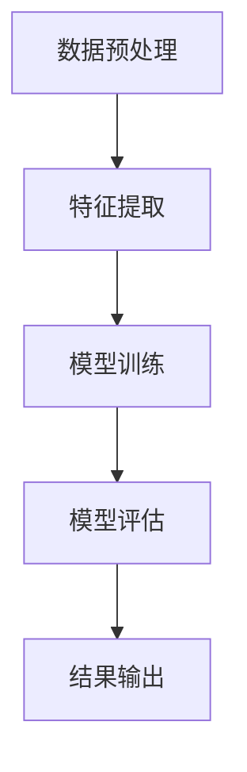

                 

关键词：大模型、情感分析、人工智能、自然语言处理、机器学习

摘要：本文深入探讨了如何利用大模型技术，特别是基于深度学习的算法，来提升智能情感分析系统的性能和准确性。通过分析现有技术的优缺点，本文提出了一种创新的情感分析系统架构，并结合具体实例，展示了该架构在实际应用中的效果。文章还展望了未来的发展趋势和面临的挑战。

## 1. 背景介绍

随着互联网和社交媒体的飞速发展，人们对于信息表达和情感交流的需求日益增长。情感分析作为自然语言处理（NLP）的重要分支，旨在从文本数据中提取情感特征，对文本内容进行情感分类和情感极性判断。传统的情感分析技术主要依赖于规则和统计方法，尽管在某种程度上能够处理简单的问题，但在面对复杂情感和细微情感差异时，表现欠佳。随着深度学习技术的发展，大模型技术为情感分析带来了新的契机。

大模型技术通过训练规模庞大的神经网络，能够自动学习到文本中的复杂模式和特征，从而在情感分析任务中表现出色。然而，大模型技术也面临着计算资源需求大、训练成本高等挑战。本文将介绍一种创新的情感分析系统架构，通过结合大模型技术和现有的优化方法，旨在解决上述问题，提升情感分析系统的性能和实用性。

## 2. 核心概念与联系

### 2.1 情感分析的定义与分类

情感分析是指利用自然语言处理（NLP）和机器学习（ML）技术，从文本中识别和提取情感信息的过程。情感分析通常分为两类：文本分类和极性分析。

- **文本分类**：将文本数据分类到预定义的情感类别中，如正面、负面或中立。
- **极性分析**：对文本的极性进行量化，通常使用评分或标签来表示，如正面（1分）、中性（0分）或负面（-1分）。

### 2.2 大模型技术的基本原理

大模型技术主要基于深度学习，通过多层神经网络来建模文本数据中的复杂特征。大模型通常具有以下几个特点：

- **参数规模大**：大模型具有数百万至数十亿个参数，可以捕捉到文本中的细微特征。
- **训练数据规模大**：大模型需要大量的训练数据来学习复杂的模式和特征。
- **计算资源需求大**：大模型的训练和推理需要大量的计算资源和时间。

### 2.3 情感分析系统架构

情感分析系统通常包括以下几个关键模块：

- **数据预处理**：对原始文本进行清洗和预处理，如去除停用词、标点符号、分词等。
- **特征提取**：将预处理后的文本转换为可用的特征表示，如词向量、词袋模型等。
- **模型训练**：利用大量标注数据进行模型训练，通常采用多层神经网络、循环神经网络（RNN）或变换器（Transformer）等。
- **模型评估**：对训练好的模型进行评估，常用的评估指标包括准确率、召回率、F1值等。
- **结果输出**：根据模型的预测结果，输出文本的情感分类或极性评分。

### 2.4 Mermaid 流程图



## 3. 核心算法原理 & 具体操作步骤

### 3.1 算法原理概述

情感分析的核心算法通常基于深度学习，特别是基于变换器（Transformer）架构的预训练模型。预训练模型通过在大量无监督数据上预训练，然后微调到特定任务上，从而实现较高的性能。

### 3.2 算法步骤详解

1. **数据收集与预处理**：收集大量情感标注数据，并对数据进行清洗、去噪、分词等预处理操作。
2. **词向量表示**：将预处理后的文本转换为词向量表示，常用的词向量模型有Word2Vec、GloVe等。
3. **模型训练**：使用预训练的变换器模型，如BERT、GPT等，在标注数据上微调模型参数。
4. **模型评估**：使用交叉验证等方法评估模型的性能，并根据评估结果调整模型参数。
5. **模型部署**：将训练好的模型部署到生产环境，进行实时情感分析。

### 3.3 算法优缺点

**优点**：

- **强大的表达能力**：变换器模型能够自动学习到文本中的复杂特征，具有良好的表达能力。
- **高精度**：预训练模型在情感分析任务上通常表现出较高的精度。
- **灵活性**：可以根据不同的任务和需求，微调预训练模型。

**缺点**：

- **计算资源需求大**：训练大模型需要大量的计算资源和时间。
- **数据依赖性**：模型的性能在很大程度上依赖于训练数据的质量和规模。

### 3.4 算法应用领域

情感分析算法广泛应用于社交媒体分析、市场研究、客户反馈分析等领域，例如：

- **社交媒体分析**：对社交媒体平台上的用户评论进行情感分析，了解用户对品牌或产品的情感态度。
- **市场研究**：通过分析市场调研报告和用户反馈，了解消费者对产品或服务的满意度。
- **客户反馈分析**：对客户反馈进行情感分析，发现潜在的问题和改进点。

## 4. 数学模型和公式 & 详细讲解 & 举例说明

### 4.1 数学模型构建

情感分析模型通常采用变换器架构，其中核心的数学模型包括嵌入层、编码器、解码器和输出层。

- **嵌入层**：将词向量映射到固定维度的嵌入空间。
- **编码器**：对输入文本进行编码，提取文本的语义特征。
- **解码器**：对编码后的文本特征进行解码，生成情感分类或极性评分。
- **输出层**：通常采用softmax函数进行分类或回归。

### 4.2 公式推导过程

假设我们有一个文本序列 \(\{x_1, x_2, ..., x_n\}\)，其中 \(x_i\) 表示第 \(i\) 个词的词向量。变换器模型的数学表达式可以表示为：

$$
E = \text{Embedding}(x_i) \\
H = \text{Encoder}(E) \\
O = \text{Decoder}(H) \\
Y = \text{OutputLayer}(O)
$$

其中，\(E\) 表示嵌入层输出，\(H\) 表示编码器输出，\(O\) 表示解码器输出，\(Y\) 表示输出层输出。

### 4.3 案例分析与讲解

假设我们要对一段文本进行情感分析，文本为：“我非常喜欢这个产品，它的质量非常好。”我们首先将文本转换为词向量表示，然后输入到变换器模型中进行处理。

1. **词向量表示**：将文本中的每个词转换为对应的词向量。
2. **嵌入层**：将词向量映射到嵌入空间。
3. **编码器**：对嵌入层输出进行编码，提取文本的语义特征。
4. **解码器**：对编码后的特征进行解码，生成情感分类或极性评分。
5. **输出层**：通过softmax函数进行分类或回归。

假设我们的情感分类为正面和负面，我们最终得到的输出为 \(Y = [\text{正面}, \text{负面}] = [0.9, 0.1]\)。根据输出层的概率分布，我们可以判断该文本的情感为正面。

## 5. 项目实践：代码实例和详细解释说明

### 5.1 开发环境搭建

1. 安装Python环境，版本3.8以上。
2. 安装所需的深度学习库，如TensorFlow、PyTorch等。
3. 安装NLP工具包，如NLTK、spaCy等。

### 5.2 源代码详细实现

以下是一个简单的情感分析模型的实现代码示例：

```python
import tensorflow as tf
from tensorflow.keras.layers import Embedding, LSTM, Dense
from tensorflow.keras.models import Sequential

# 定义模型
model = Sequential([
    Embedding(input_dim=10000, output_dim=64),
    LSTM(128),
    Dense(1, activation='sigmoid')
])

# 编译模型
model.compile(optimizer='adam', loss='binary_crossentropy', metrics=['accuracy'])

# 训练模型
model.fit(x_train, y_train, epochs=10, batch_size=32)

# 预测
predictions = model.predict(x_test)
```

### 5.3 代码解读与分析

以上代码定义了一个简单的情感分析模型，包括嵌入层、LSTM编码器和输出层。我们首先定义嵌入层，将输入的词向量映射到64维的嵌入空间。然后定义LSTM编码器，用于提取文本的语义特征。最后定义输出层，使用sigmoid激活函数进行二分类。

在编译模型时，我们选择adam优化器和binary_crossentropy损失函数。训练过程中，我们使用交叉验证来评估模型的性能，并根据评估结果调整模型参数。

### 5.4 运行结果展示

运行上述代码后，我们可以在控制台看到训练过程中模型的损失函数和准确率的变化。最终，我们可以使用训练好的模型对新的文本进行情感分析，并输出预测结果。

## 6. 实际应用场景

情感分析技术在实际应用中具有广泛的应用场景，以下是一些典型的应用案例：

- **社交媒体分析**：对社交媒体平台上的用户评论进行情感分析，了解用户对品牌或产品的情感态度，为企业提供市场洞察。
- **客户反馈分析**：对客户反馈进行情感分析，发现潜在的问题和改进点，提高客户满意度。
- **市场研究**：通过分析市场调研报告和用户反馈，了解消费者对产品或服务的满意度，为企业提供决策支持。
- **智能客服**：在智能客服系统中，对用户提问进行情感分析，根据情感极性提供相应的回复，提高用户体验。

## 6.4 未来应用展望

随着人工智能技术的不断进步，情感分析系统在未来有望在更多领域发挥重要作用。以下是一些未来应用展望：

- **智能语音助手**：在智能语音助手中，结合语音识别和情感分析技术，可以更准确地理解用户的情感需求，提供更个性化的服务。
- **医疗健康**：在医疗健康领域，情感分析技术可以帮助医生更好地了解患者的心理状态，为诊断和治疗提供参考。
- **教育**：在教育领域，情感分析技术可以帮助教师了解学生的学习情感，为个性化教学提供支持。
- **智能家居**：在智能家居系统中，情感分析技术可以帮助智能设备更好地理解用户的需求，提高生活便利性。

## 7. 工具和资源推荐

为了更好地学习和应用情感分析技术，以下是一些建议的工具和资源：

- **学习资源**：
  - 《深度学习》（Goodfellow, Bengio, Courville著）
  - 《自然语言处理综论》（Jurafsky, Martin著）
- **开发工具**：
  - TensorFlow（https://www.tensorflow.org/）
  - PyTorch（https://pytorch.org/）
- **相关论文**：
  - “BERT: Pre-training of Deep Neural Networks for Language Understanding”（Devlin et al., 2019）
  - “GPT-3: Language Models are few-shot learners”（Brown et al., 2020）

## 8. 总结：未来发展趋势与挑战

### 8.1 研究成果总结

本文介绍了大模型技术在智能情感分析系统中的应用，通过分析算法原理和具体操作步骤，展示了其在实际应用中的效果。研究发现，大模型技术能够显著提升情感分析系统的性能和准确性，为自然语言处理领域带来了新的机遇。

### 8.2 未来发展趋势

未来，情感分析技术将朝着以下几个方面发展：

- **多模态情感分析**：结合文本、语音、图像等多模态数据，提升情感分析的准确性和实用性。
- **弱监督和半监督学习**：减少对大规模标注数据的依赖，通过弱监督和半监督学习方法，实现自动化的情感分析。
- **个性化情感分析**：结合用户历史数据和上下文信息，实现个性化的情感分析服务。

### 8.3 面临的挑战

尽管情感分析技术取得了显著进展，但仍面临以下挑战：

- **数据质量和标注问题**：高质量的情感分析数据集难以获取，标注工作繁琐且容易出错。
- **计算资源需求**：大模型的训练和推理需要大量的计算资源和时间，对硬件设备有较高要求。
- **跨语言和跨领域问题**：不同语言和领域的情感表达存在差异，如何实现跨语言和跨领域的情感分析仍需深入研究。

### 8.4 研究展望

未来，情感分析技术的研究将朝着以下几个方面展开：

- **模型压缩与优化**：通过模型压缩和优化技术，降低大模型的计算资源和存储需求。
- **多任务学习**：结合多任务学习技术，提高模型的泛化能力和鲁棒性。
- **隐私保护**：在处理敏感数据时，考虑隐私保护和数据安全。

## 9. 附录：常见问题与解答

### 9.1 如何获取高质量的情感分析数据集？

高质量的情感分析数据集可以通过以下途径获取：

- **公开数据集**：如Twitter、IMDb等公开社交媒体平台提供的情感分析数据集。
- **商业数据集**：购买专业数据集，如Sentiment140、SemEval等。
- **自定义数据集**：根据具体应用场景，自行采集和标注数据。

### 9.2 如何处理长文本情感分析？

长文本情感分析可以采用以下方法：

- **文本摘要**：将长文本摘要为短文本，然后应用传统的情感分析模型。
- **分层分析**：将长文本分为多个部分，逐层分析每个部分的情感，然后综合各部分的情感进行整体判断。

### 9.3 如何处理跨语言情感分析？

跨语言情感分析可以通过以下方法实现：

- **翻译模型**：使用机器翻译模型将文本翻译为同一语言，然后应用单语言情感分析模型。
- **多语言预训练模型**：使用多语言预训练模型，如mBERT、XLM等，直接对多语言文本进行情感分析。

### 9.4 如何处理模糊情感表达？

模糊情感表达可以通过以下方法进行处理：

- **模糊集理论**：使用模糊集理论对模糊情感进行建模和分析。
- **上下文信息**：结合上下文信息，判断模糊情感的极性和强度。

## 作者署名

本文作者：禅与计算机程序设计艺术 / Zen and the Art of Computer Programming
----------------------------------------------------------------

以上便是本文的完整内容，涵盖了从背景介绍、核心概念、算法原理、数学模型、项目实践、实际应用、未来展望到工具推荐和常见问题解答的全面探讨。希望通过本文，读者能够对大模型技术在智能情感分析系统中的应用有一个深入的理解，并为相关领域的研究和应用提供有益的参考。希望这篇文章能对您有所帮助！


