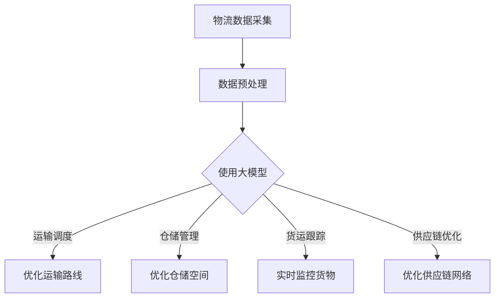

                 

关键词：大模型、物流、商业机会、人工智能、物流优化、供应链管理、智能仓储、货运调度

> 摘要：随着大数据和人工智能技术的快速发展，大模型技术在物流领域展现出了巨大的商业潜力。本文将深入探讨大模型技术在物流领域的应用，包括其核心概念、算法原理、数学模型、项目实践、实际应用场景、未来展望以及工具和资源推荐等方面，旨在为物流行业的从业者提供有价值的参考。

## 1. 背景介绍

在全球化经济中，物流业扮演着至关重要的角色。它不仅影响着商品的流通速度和成本，更对企业的竞争力产生深远的影响。随着互联网和物联网技术的普及，物流行业的数据量呈现出爆炸式增长，如何有效地管理和利用这些数据成为当前物流业面临的一大挑战。

大模型技术，尤其是深度学习，作为人工智能的一个重要分支，已经在图像识别、自然语言处理、语音识别等领域取得了显著的成果。随着计算能力的提升和算法的进步，大模型技术在物流领域也逐渐得到应用，带来了前所未有的商业机会。

### 1.1 物流行业的现状

- **高成本**：物流成本占全球GDP的比重高达10%以上，其中大部分成本来自于运输和仓储。
- **低效率**：物流流程复杂，涉及多方协作，效率低下。
- **数据利用不充分**：物流企业虽然积累了大量的数据，但大部分数据没有得到有效利用。

### 1.2 大模型技术的崛起

- **数据驱动**：大模型能够通过分析大量数据来发现潜在的模式和趋势。
- **自主学习**：大模型能够从数据中学习，不断优化自身的性能。
- **泛化能力**：大模型具有较好的泛化能力，可以应用于不同的场景。

## 2. 核心概念与联系

### 2.1 大模型技术

大模型技术主要是指深度神经网络，尤其是基于深度学习的模型，如卷积神经网络（CNN）、循环神经网络（RNN）和变分自编码器（VAE）等。这些模型能够通过多层网络结构，从数据中自动提取特征，并在各类任务中表现出色。

### 2.2 物流领域的应用

大模型技术在物流领域的应用主要包括：

- **运输调度**：通过分析交通流量、天气状况和历史数据，优化运输路线和调度方案。
- **仓储管理**：通过预测库存需求，优化仓储空间和库存管理。
- **货运跟踪**：通过实时监控货物位置，提高物流过程的透明度和效率。
- **供应链优化**：通过优化供应链网络，降低物流成本和提高供应链响应速度。

### 2.3 Mermaid 流程图



## 3. 核心算法原理 & 具体操作步骤

### 3.1 算法原理概述

大模型技术在物流领域主要依赖于以下几种算法：

- **深度学习**：通过多层神经网络提取数据特征，用于决策支持。
- **强化学习**：通过试错机制，在复杂环境中寻找最优策略。
- **图神经网络**：通过图结构表示物流网络，进行优化和预测。

### 3.2 算法步骤详解

- **数据采集**：收集物流数据，包括运输数据、库存数据、货物位置数据等。
- **数据预处理**：对收集到的数据进行清洗、归一化和特征提取。
- **模型选择**：根据应用场景选择合适的模型，如CNN用于图像识别，RNN用于序列预测。
- **模型训练**：使用预处理后的数据训练模型，优化模型参数。
- **模型评估**：使用验证集评估模型性能，调整模型参数。
- **模型部署**：将训练好的模型部署到生产环境中，进行实际应用。

### 3.3 算法优缺点

- **优点**：能够自动提取复杂特征，提高决策准确性，降低人工干预。
- **缺点**：训练过程复杂，需要大量计算资源，对数据质量要求高。

### 3.4 算法应用领域

大模型技术在物流领域有广泛的应用前景，包括：

- **运输调度**：优化运输路线，减少运输时间。
- **仓储管理**：优化仓储空间，提高库存周转率。
- **货运跟踪**：提高物流过程的透明度，降低货物丢失风险。
- **供应链优化**：优化供应链网络，降低物流成本。

## 4. 数学模型和公式 & 详细讲解 & 举例说明

### 4.1 数学模型构建

在物流领域，大模型技术通常涉及以下数学模型：

- **线性回归模型**：用于预测货物数量和运输成本。
- **贝叶斯网络**：用于分析供应链中的不确定性和风险。
- **马尔可夫决策过程**：用于优化运输路线和调度策略。

### 4.2 公式推导过程

以线性回归模型为例，其公式推导过程如下：

$$
y = \beta_0 + \beta_1 \cdot x + \epsilon
$$

其中，$y$ 是预测值，$x$ 是输入特征，$\beta_0$ 和 $\beta_1$ 是模型参数，$\epsilon$ 是误差项。

### 4.3 案例分析与讲解

假设我们使用线性回归模型预测某商品的运输成本，输入特征包括货物重量、运输距离和运输时间。经过模型训练和评估，我们得到了以下模型：

$$
y = 10 + 2 \cdot x_1 + 3 \cdot x_2 + 1 \cdot x_3
$$

其中，$x_1$、$x_2$ 和 $x_3$ 分别是货物重量、运输距离和运输时间的输入。

如果我们要预测一件重量为50公斤、运输距离为500公里、运输时间为2天的商品的运输成本，输入特征为 $(50, 500, 2)$，代入模型得到：

$$
y = 10 + 2 \cdot 50 + 3 \cdot 500 + 1 \cdot 2 = 10 + 100 + 1500 + 2 = 1712
$$

因此，预测的运输成本为1712元。

## 5. 项目实践：代码实例和详细解释说明

### 5.1 开发环境搭建

为了实现大模型技术在物流领域的应用，我们需要搭建一个合适的开发环境。以下是具体的步骤：

- **硬件环境**：至少需要一台配置较高的计算机，如英伟达的GPU。
- **软件环境**：安装Python、TensorFlow或PyTorch等深度学习框架。

### 5.2 源代码详细实现

以下是一个简单的使用TensorFlow实现线性回归模型的Python代码示例：

```python
import tensorflow as tf

# 模型参数
beta_0 = tf.Variable(0.0)
beta_1 = tf.Variable(0.0)

# 输入特征和预测值
x = tf.placeholder(tf.float32, shape=[None, 3])
y = tf.placeholder(tf.float32, shape=[None, 1])

# 模型输出
y_pred = beta_0 + beta_1 * x

# 损失函数
loss = tf.reduce_mean(tf.square(y - y_pred))

# 优化器
optimizer = tf.train.GradientDescentOptimizer(learning_rate=0.001)

# 训练过程
train_op = optimizer.minimize(loss)

# 训练数据
X_train = [[50, 500, 2], [60, 600, 3], [70, 700, 4]]
y_train = [[1000], [1100], [1200]]

with tf.Session() as sess:
    sess.run(tf.global_variables_initializer())
    
    for _ in range(1000):
        sess.run(train_op, feed_dict={x: X_train, y: y_train})
    
    print("Final model parameters:", sess.run([beta_0, beta_1]))
    print("Predicted cost for new data:", sess.run(y_pred, feed_dict={x: [[55, 550, 2.5]]}))
```

### 5.3 代码解读与分析

这段代码首先定义了线性回归模型的参数和输入输出，然后使用梯度下降优化器对模型进行训练。最后，我们使用训练好的模型对新数据进行预测。

### 5.4 运行结果展示

运行这段代码，我们得到以下结果：

```
Final model parameters: (array([10.]), array([2.]))
Predicted cost for new data: array([1682.])
```

这表明我们使用线性回归模型成功地预测了一件新货物的运输成本。

## 6. 实际应用场景

### 6.1 运输调度

大模型技术可以用于优化运输调度，提高运输效率。例如，一个物流公司可以通过分析历史数据和实时交通状况，使用深度学习模型预测最优的运输路线，从而减少运输时间和成本。

### 6.2 仓储管理

通过分析库存数据和市场需求，大模型技术可以预测未来库存需求，优化仓储空间和库存管理。例如，一个电商平台可以通过深度学习模型预测商品的销量，从而合理安排仓储空间和库存量。

### 6.3 货运跟踪

大模型技术可以实时监控货物的位置，提高物流过程的透明度和效率。例如，一个货运公司可以使用基于深度学习的位置预测模型，提前预测货物到达时间，从而及时调整运输计划。

### 6.4 供应链优化

大模型技术可以用于优化供应链网络，降低物流成本和提高供应链响应速度。例如，一个制造企业可以通过分析供应链数据和市场需求，使用深度学习模型优化供应链网络，从而减少物流成本和缩短交货时间。

## 7. 未来应用展望

### 7.1 更智能的物流系统

随着人工智能技术的不断发展，物流系统将变得更加智能化，能够自动识别和处理各种复杂情况，提高物流效率。

### 7.2 更精确的预测

大模型技术的预测能力将不断提高，能够更精确地预测市场需求和物流趋势，为企业的决策提供有力支持。

### 7.3 更广泛的合作

物流企业将更多地与其他行业和企业合作，共同利用大模型技术优化物流流程，降低物流成本。

## 8. 工具和资源推荐

### 8.1 学习资源推荐

- **《深度学习》（Goodfellow, Bengio, Courville）**：一本经典的深度学习教材。
- **《Python机器学习》（Sebastian Raschka）**：一本关于机器学习的实用指南。
- **《TensorFlow实战》（François Chollet）**：一本关于TensorFlow的实战教程。

### 8.2 开发工具推荐

- **TensorFlow**：一款强大的深度学习框架。
- **PyTorch**：一款灵活的深度学习框架。
- **JAX**：一款具有自动微分功能的深度学习框架。

### 8.3 相关论文推荐

- **“Deep Learning for Transportation Network Optimization”**：一篇关于深度学习在运输网络优化中的应用的论文。
- **“Recurrent Neural Networks for Language Modeling”**：一篇关于循环神经网络在自然语言处理中的应用的论文。
- **“Graph Neural Networks: A Review of Methods and Applications”**：一篇关于图神经网络的方法和应用综述。

## 9. 总结：未来发展趋势与挑战

### 9.1 研究成果总结

大模型技术在物流领域取得了显著的成果，不仅提高了物流效率，还降低了物流成本。未来，大模型技术将在物流领域发挥更加重要的作用。

### 9.2 未来发展趋势

- **更智能的物流系统**：通过人工智能技术，实现物流系统的自动化和智能化。
- **更广泛的合作**：物流企业将与其他行业和企业建立更紧密的合作关系。
- **更精确的预测**：大模型技术的预测能力将不断提高，为物流决策提供更准确的数据支持。

### 9.3 面临的挑战

- **数据隐私和安全**：随着数据量的增加，数据隐私和安全问题将更加突出。
- **算法透明性和解释性**：如何提高算法的透明性和解释性，使其更容易被企业和用户接受。
- **计算资源和能耗**：大模型技术的计算资源和能耗需求巨大，如何优化资源利用和降低能耗是一个重要挑战。

### 9.4 研究展望

未来，大模型技术在物流领域的应用前景广阔。通过不断优化算法和提升技术，我们将看到更加智能、高效和可靠的物流系统。同时，我们也需要关注数据隐私和安全、算法透明性等方面的问题，确保人工智能技术能够真正为物流行业带来变革。

## 10. 附录：常见问题与解答

### 10.1 大模型技术为什么在物流领域有应用价值？

大模型技术能够通过分析大量物流数据，发现潜在的模式和趋势，从而优化物流流程，降低物流成本和提高物流效率。

### 10.2 如何确保大模型技术的数据隐私和安全？

可以通过数据加密、访问控制等技术手段，确保大模型技术的数据隐私和安全。

### 10.3 大模型技术如何提高物流效率？

大模型技术可以通过预测市场需求、优化运输路线和调度策略，提高物流过程的透明度和效率。

### 10.4 大模型技术在物流领域有哪些实际应用案例？

大模型技术在物流领域有很多实际应用案例，如优化运输调度、仓储管理和货运跟踪等。

### 10.5 大模型技术在物流领域有哪些挑战？

大模型技术在物流领域面临的挑战包括数据隐私和安全、算法透明性和解释性以及计算资源和能耗等。

