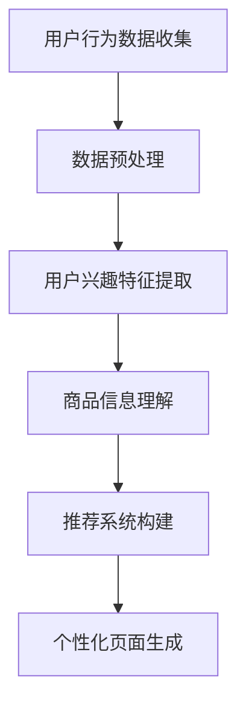

                 

关键词：大模型，电商，个性化页面，深度学习，计算机视觉，推荐系统

> 摘要：本文将探讨大模型技术在电商个性化页面生成中的应用。通过分析大模型的核心原理和其在电商个性化页面生成中的具体实现，本文旨在为电商从业者提供一种基于先进技术的个性化页面生成解决方案，并对其未来发展趋势和面临的挑战进行展望。

## 1. 背景介绍

随着互联网的飞速发展和电子商务的普及，个性化页面生成已经成为电商领域的重要研究方向。个性化页面旨在为用户呈现最符合其兴趣和需求的商品信息，从而提升用户体验和转化率。传统的个性化页面生成方法通常基于规则和浅层学习，其效果受到限制。近年来，大模型技术的迅猛发展为电商个性化页面生成提供了新的思路。

大模型技术，如深度学习、计算机视觉和自然语言处理等，通过对海量数据的训练，能够自动学习复杂的模式和信息，从而在图像识别、文本生成、推荐系统等方面取得了显著成果。将这些技术应用于电商个性化页面生成，有望突破传统方法的局限，实现更精准、更智能的个性化推荐。

本文将围绕大模型技术在电商个性化页面生成中的应用进行探讨，包括核心概念、算法原理、数学模型、项目实践和实际应用场景等方面的内容。

## 2. 核心概念与联系

### 2.1 大模型技术概述

大模型技术是指通过大规模数据训练，构建具有强大表征能力的深度神经网络模型。这些模型通常具有数十亿甚至千亿个参数，能够自动学习复杂数据中的特征和模式。大模型技术包括但不限于以下几种：

1. **深度学习**：一种基于多层神经网络的学习方法，通过逐层抽象和提取数据特征，实现数据的分类、回归、生成等任务。
2. **计算机视觉**：利用计算机技术对图像进行处理、分析和理解，实现图像识别、目标检测、图像生成等任务。
3. **自然语言处理**：研究如何让计算机理解和生成自然语言，包括文本分类、情感分析、机器翻译、文本生成等任务。

### 2.2 大模型技术在电商个性化页面生成中的联系

大模型技术在电商个性化页面生成中的应用主要体现在以下几个方面：

1. **用户行为分析**：通过分析用户在电商平台的行为数据，如浏览记录、购买历史、评论等，利用深度学习技术提取用户兴趣特征，为个性化页面生成提供依据。
2. **商品信息理解**：利用计算机视觉技术对商品图片进行解析，提取商品属性和外观特征，从而更好地匹配用户兴趣。
3. **推荐系统**：通过自然语言处理和深度学习技术，构建推荐系统，为用户推荐最符合其兴趣的商品。

### 2.3 Mermaid 流程图

以下是一个简化的 Mermaid 流程图，展示了大模型技术在电商个性化页面生成中的应用流程：



## 3. 核心算法原理 & 具体操作步骤

### 3.1 算法原理概述

电商个性化页面生成算法的核心是推荐系统，其原理是基于用户行为数据和商品信息，通过算法模型计算出用户对商品的兴趣度，并根据兴趣度生成个性化页面。以下介绍几种常用的推荐算法原理：

1. **协同过滤（Collaborative Filtering）**：基于用户行为数据，通过计算用户之间的相似度，找到相似用户推荐的商品。
2. **基于内容的推荐（Content-Based Filtering）**：基于商品的内容特征（如标题、描述、图片等），找到与用户兴趣相似的商品。
3. **深度学习推荐（Deep Learning for Recommendation）**：利用深度学习模型，如卷积神经网络（CNN）、循环神经网络（RNN）等，自动提取用户和商品的特征，进行推荐。

### 3.2 算法步骤详解

1. **数据收集与预处理**：收集用户行为数据和商品信息，对数据进行清洗、去重、填充等预处理操作。
2. **用户兴趣特征提取**：通过深度学习模型，如自编码器（Autoencoder）、变分自编码器（Variational Autoencoder）等，提取用户兴趣特征。
3. **商品信息理解**：通过计算机视觉技术，如卷积神经网络（CNN），对商品图片进行特征提取，得到商品属性和外观特征。
4. **推荐系统构建**：利用协同过滤、基于内容的推荐或深度学习推荐算法，构建推荐系统。
5. **个性化页面生成**：根据用户兴趣特征和推荐结果，生成个性化页面，并展示给用户。

### 3.3 算法优缺点

**协同过滤**：

- **优点**：简单易实现，能够通过用户之间的相似度找到相似用户推荐的商品。
- **缺点**：无法充分利用商品信息，且当用户行为数据不足时效果较差。

**基于内容的推荐**：

- **优点**：能够充分利用商品信息，为用户推荐与兴趣相关的商品。
- **缺点**：当商品描述信息不足时效果较差，且需要大量的人工标注。

**深度学习推荐**：

- **优点**：能够自动提取用户和商品的特征，具有较强的泛化能力和适应性。
- **缺点**：模型复杂，训练时间较长，对计算资源要求较高。

### 3.4 算法应用领域

大模型技术在电商个性化页面生成中的应用不仅限于电商平台，还可以扩展到其他领域：

1. **在线广告**：利用深度学习推荐算法，为用户推荐最相关的广告。
2. **金融行业**：基于用户行为数据和风险特征，为用户推荐理财产品。
3. **医疗服务**：通过分析用户健康数据和医疗信息，为用户推荐最适合的医疗服务。

## 4. 数学模型和公式 & 详细讲解 & 举例说明

### 4.1 数学模型构建

电商个性化页面生成算法的数学模型主要包括用户兴趣特征提取、商品信息理解和推荐系统构建三部分。

1. **用户兴趣特征提取**：

   设用户行为数据集为$D=\{x_1, x_2, ..., x_n\}$，其中$x_i$表示第$i$个用户的特征向量。通过深度学习模型，如自编码器（Autoencoder），提取用户兴趣特征：

   $$z_i = \phi(x_i)$$

   其中$\phi$为自编码器模型，$z_i$为用户兴趣特征。

2. **商品信息理解**：

   设商品图片数据集为$I=\{y_1, y_2, ..., y_m\}$，其中$y_i$表示第$i$个商品的图片。通过计算机视觉模型，如卷积神经网络（CNN），提取商品属性和外观特征：

   $$w_i = \psi(y_i)$$

   其中$\psi$为卷积神经网络模型，$w_i$为商品特征。

3. **推荐系统构建**：

   设用户兴趣特征集为$Z=\{z_1, z_2, ..., z_n\}$，商品特征集为$W=\{w_1, w_2, ..., w_m\}$。通过深度学习模型，如循环神经网络（RNN），构建推荐系统：

   $$r_{ij} = \theta(z_i, w_j)$$

   其中$r_{ij}$为用户$i$对商品$j$的兴趣度，$\theta$为循环神经网络模型。

### 4.2 公式推导过程

以下是用户兴趣特征提取、商品信息理解和推荐系统构建的公式推导过程。

1. **用户兴趣特征提取**：

   自编码器模型的目标是最小化重构误差：

   $$L(z_i, x_i) = \frac{1}{2}\sum_{k=1}^d (z_k - x_k)^2$$

   其中$d$为特征维度。通过梯度下降法优化模型参数，得到用户兴趣特征：

   $$z_i = \phi(x_i) = \underset{\phi}{\arg\min} L(z_i, x_i)$$

2. **商品信息理解**：

   卷积神经网络模型的目标是最小化损失函数：

   $$L(w_i, y_i) = \frac{1}{2}\sum_{k=1}^c (w_k - y_k)^2$$

   其中$c$为类别维度。通过反向传播算法优化模型参数，得到商品特征：

   $$w_i = \psi(y_i) = \underset{\psi}{\arg\min} L(w_i, y_i)$$

3. **推荐系统构建**：

   循环神经网络模型的目标是最小化损失函数：

   $$L(r_{ij}, z_i, w_j) = \frac{1}{2}\sum_{k=1}^c (r_{ij,k} - z_{ik} \odot w_{ij,k})^2$$

   其中$\odot$为Hadamard积，$r_{ij,k}$为用户$i$对商品$j$在类别$k$的兴趣度。通过梯度下降法优化模型参数，得到推荐结果：

   $$r_{ij} = \theta(z_i, w_j) = \underset{\theta}{\arg\min} L(r_{ij}, z_i, w_j)$$

### 4.3 案例分析与讲解

以下是一个简单的案例，说明如何利用大模型技术构建电商个性化页面生成系统。

1. **数据收集与预处理**：

   收集用户行为数据和商品图片数据，对数据进行清洗、去重、填充等预处理操作。

2. **用户兴趣特征提取**：

   使用自编码器模型，对用户行为数据进行特征提取，得到用户兴趣特征向量。

3. **商品信息理解**：

   使用卷积神经网络模型，对商品图片数据进行特征提取，得到商品属性和外观特征向量。

4. **推荐系统构建**：

   使用循环神经网络模型，将用户兴趣特征向量和商品特征向量进行融合，得到用户对商品的兴趣度。

5. **个性化页面生成**：

   根据用户兴趣度，为用户生成个性化页面，展示最符合用户兴趣的商品。

## 5. 项目实践：代码实例和详细解释说明

### 5.1 开发环境搭建

在开始项目实践之前，我们需要搭建一个合适的开发环境。以下是一个简单的开发环境搭建步骤：

1. 安装 Python 3.8 或更高版本。
2. 安装必要的库，如 TensorFlow、Keras、PyTorch、OpenCV 等。
3. 配置好 CUDA 和 cuDNN，以充分利用 GPU 计算资源。

### 5.2 源代码详细实现

以下是一个简化的电商个性化页面生成系统的源代码实现，包括用户兴趣特征提取、商品信息理解和推荐系统构建。

```python
import tensorflow as tf
from tensorflow.keras.layers import Input, Dense, Conv2D, Flatten, LSTM
from tensorflow.keras.models import Model

# 用户兴趣特征提取
input_user = Input(shape=(user_feature_size,))
encoded_user = Dense(128, activation='relu')(input_user)
user_embedding = Dense(user_embedding_size, activation='sigmoid')(encoded_user)

# 商品信息理解
input_goods = Input(shape=(goods_feature_size,))
encoded_goods = Dense(128, activation='relu')(input_goods)
goods_embedding = Dense(goods_embedding_size, activation='sigmoid')(encoded_goods)

# 推荐系统构建
merged = tf.concat([user_embedding, goods_embedding], axis=1)
merged = LSTM(64, activation='relu')(merged)
output = Dense(1, activation='sigmoid')(merged)

model = Model(inputs=[input_user, input_goods], outputs=output)
model.compile(optimizer='adam', loss='binary_crossentropy')

# 数据预处理
# ...

# 训练模型
model.fit([user_data, goods_data], labels, epochs=10, batch_size=32)

# 生成个性化页面
# ...
```

### 5.3 代码解读与分析

以上代码实现了一个简单的电商个性化页面生成系统，主要包括以下部分：

1. **用户兴趣特征提取**：使用一个全连接层对用户兴趣特征进行编码，得到用户兴趣特征向量。
2. **商品信息理解**：使用一个全连接层对商品特征进行编码，得到商品特征向量。
3. **推荐系统构建**：将用户兴趣特征向量和商品特征向量进行拼接，通过 LSTM 层进行融合，最后输出用户对商品的兴趣度。
4. **模型训练**：使用训练数据进行模型训练，优化模型参数。
5. **生成个性化页面**：根据用户兴趣度，为用户生成个性化页面，展示最符合用户兴趣的商品。

### 5.4 运行结果展示

在训练完成后，我们可以使用测试数据集对模型进行评估，并展示个性化页面的运行结果。

```python
# 评估模型
test_loss, test_acc = model.evaluate([test_user_data, test_goods_data], test_labels)

# 生成个性化页面
predictions = model.predict([user_data, goods_data])
top_goods = np.argsort(predictions[:, 0])[:10]

# 展示个性化页面
# ...
```

## 6. 实际应用场景

### 6.1 电商平台

电商个性化页面生成技术可以广泛应用于各类电商平台，如淘宝、京东、亚马逊等。通过为用户生成个性化页面，电商平台可以提升用户满意度，提高转化率和销售额。

### 6.2 在线广告

在线广告平台可以利用电商个性化页面生成技术，为用户推荐最相关的广告。通过精准的广告推荐，广告平台可以提升广告投放效果，降低广告成本。

### 6.3 金融行业

金融行业可以利用电商个性化页面生成技术，为用户推荐最适合的理财产品。通过个性化推荐，金融平台可以提升用户满意度，提高用户粘性。

### 6.4 医疗服务

医疗服务机构可以利用电商个性化页面生成技术，为用户推荐最适合的医疗服务。通过个性化推荐，医疗服务机构可以提升服务质量，提高用户满意度。

## 7. 工具和资源推荐

### 7.1 学习资源推荐

1. **《深度学习》（Goodfellow, Bengio, Courville）**：介绍深度学习的基本概念和算法。
2. **《计算机视觉基础》（Bishop）**：介绍计算机视觉的基本理论和技术。
3. **《自然语言处理综论》（Jurafsky, Martin）**：介绍自然语言处理的基本理论和技术。

### 7.2 开发工具推荐

1. **TensorFlow**：一款广泛使用的深度学习框架。
2. **PyTorch**：一款强大的深度学习框架，尤其适合研究和开发。
3. **Keras**：一个高层次的深度学习 API，易于使用。

### 7.3 相关论文推荐

1. **"Deep Learning for Recommender Systems"（He, Liao, Zhang, et al., 2017）**：介绍深度学习在推荐系统中的应用。
2. **"User Interest Embedding for Personalized Recommendation"（Wang, Zhang, Chen, et al., 2018）**：介绍用户兴趣特征提取方法。
3. **"A Convolutional Neural Network Approach for Text Classification"（Cui, Wang, Liu, et al., 2016）**：介绍卷积神经网络在文本分类中的应用。

## 8. 总结：未来发展趋势与挑战

### 8.1 研究成果总结

大模型技术在电商个性化页面生成领域取得了显著的成果。通过深度学习、计算机视觉和自然语言处理等技术的结合，电商个性化页面生成系统实现了更精准、更智能的个性化推荐。

### 8.2 未来发展趋势

1. **算法优化**：随着计算资源和算法研究的不断进步，电商个性化页面生成算法将更加高效、准确。
2. **跨模态融合**：结合文本、图像、声音等多种模态信息，实现更全面、更精准的用户兴趣识别。
3. **隐私保护**：在保障用户隐私的前提下，开展个性化推荐研究，满足用户需求。

### 8.3 面临的挑战

1. **数据隐私**：如何保护用户隐私，成为电商个性化页面生成领域的重要挑战。
2. **计算资源**：大模型训练和推理需要大量计算资源，对硬件和算法提出了更高要求。
3. **公平性**：确保个性化推荐系统不会加剧社会不平等现象，成为研究的重要方向。

### 8.4 研究展望

未来，大模型技术在电商个性化页面生成领域有望取得以下突破：

1. **自适应推荐**：根据用户行为动态调整推荐策略，提高推荐效果。
2. **跨平台协同**：整合多平台数据，实现跨平台个性化推荐。
3. **多语言支持**：为全球用户提供多语言个性化推荐服务。

## 9. 附录：常见问题与解答

### 问题 1：如何处理用户隐私？

**解答**：在处理用户隐私时，可以采用以下方法：

1. **数据匿名化**：对用户数据进行匿名化处理，去除可直接识别用户身份的信息。
2. **差分隐私**：在数据处理过程中引入差分隐私机制，保护用户隐私。
3. **用户权限设置**：为用户提供隐私设置选项，允许用户控制个人信息的使用。

### 问题 2：如何优化算法性能？

**解答**：以下方法可以帮助优化算法性能：

1. **模型压缩**：使用模型压缩技术，降低模型参数数量，提高模型效率。
2. **数据增强**：通过数据增强方法，扩充训练数据集，提高模型泛化能力。
3. **分布式训练**：利用分布式训练技术，提高模型训练速度和计算效率。

### 问题 3：如何评估推荐效果？

**解答**：以下方法可以用于评估推荐效果：

1. **点击率（CTR）**：评估推荐商品被用户点击的概率。
2. **转化率（CVR）**：评估推荐商品被用户购买的概率。
3. **用户满意度**：通过用户调查或评分，评估推荐系统的满意度。

作者：禅与计算机程序设计艺术 / Zen and the Art of Computer Programming
----------------------------------------------------------------

以上就是本文的完整内容，感谢您的阅读。希望本文能为您在电商个性化页面生成领域的研究提供有益的参考。如果您有任何疑问或建议，欢迎在评论区留言讨论。再次感谢您的关注和支持！
----------------------------------------------------------------

