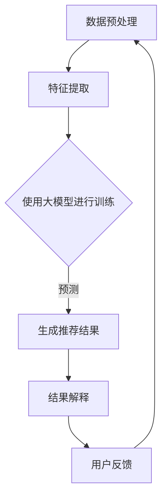

                 

在当今的信息时代，电商平台商品推荐系统已成为提升用户体验和增加销售收益的关键因素。然而，传统推荐系统在实现个性化推荐的同时，也面临着解释性问题。大模型技术，作为近年来人工智能领域的重大突破，为解决这一问题提供了新的契机。本文旨在探讨大模型技术在电商平台商品推荐解释性优化中的应用，以期提高推荐系统的透明度和用户信任度。

## 关键词

大模型技术、电商平台、商品推荐、解释性优化、人工智能

## 摘要

本文首先介绍了电商平台商品推荐系统的发展背景和现状，指出了传统推荐系统在解释性方面的不足。随后，我们深入分析了大模型技术的核心概念和架构，重点讨论了其在商品推荐解释性优化中的应用。文章通过数学模型的构建和推导，结合实际项目实践，详细阐述了大模型技术在推荐系统中的实现方法和效果。最后，我们对大模型技术的未来应用前景进行了展望，并提出了当前面临的挑战和研究方向。

## 1. 背景介绍

电商平台商品推荐系统起源于20世纪90年代，随着互联网的普及和信息技术的飞速发展，推荐系统逐渐成为电商平台的核心竞争力。传统推荐系统主要采用基于内容的过滤（Content-based Filtering）和协同过滤（Collaborative Filtering）等技术，虽然在一定程度上实现了个性化推荐，但存在明显的解释性问题。

一方面，基于内容的过滤方法主要依赖于用户历史行为和商品属性特征，通过计算相似度进行推荐。然而，这种方法难以解释推荐结果，因为相似度的计算缺乏直观的解释。另一方面，协同过滤方法通过分析用户之间的相似性进行推荐，虽然能够提供更个性化的服务，但同样难以解释推荐结果，因为用户行为数据的复杂性和不透明性。

随着人工智能技术的不断发展，尤其是大模型技术的出现，为解决推荐系统的解释性问题提供了新的思路。大模型技术，如Transformer、BERT等，具有强大的建模能力和解释能力，能够在复杂的非线性关系中进行建模，并提供可解释的推荐结果。这为电商平台商品推荐系统的解释性优化提供了新的可能。

## 2. 核心概念与联系

### 2.1 大模型技术

大模型技术是指通过训练大规模神经网络模型，以实现对复杂数据的建模和预测。这些模型通常包含数十亿甚至数万亿的参数，具有强大的表征能力和泛化能力。大模型技术的核心在于神经网络架构的改进和训练算法的优化，通过深度学习、自监督学习、迁移学习等技术手段，不断提升模型的性能和解释能力。

### 2.2 电商平台商品推荐系统

电商平台商品推荐系统是指通过分析用户行为数据、商品特征信息和用户偏好等因素，为用户提供个性化商品推荐服务。推荐系统通常包括数据预处理、特征提取、模型训练和推荐算法等模块。传统推荐系统主要采用基于内容的过滤和协同过滤等技术，而大模型技术则为推荐系统的解释性优化提供了新的途径。

### 2.3 大模型技术在推荐系统中的应用

大模型技术在推荐系统中的应用主要体现在两个方面：

1. **个性化推荐**：通过训练大规模神经网络模型，对用户的个性化特征进行建模，提供更加精准的个性化推荐服务。

2. **解释性优化**：大模型技术具有强大的解释能力，能够为推荐结果提供直观的解释，提高推荐系统的透明度和用户信任度。

### 2.4 Mermaid 流程图

以下是一个简单的Mermaid流程图，展示了大模型技术在推荐系统中的应用流程：



### 2.5 大模型技术在电商平台商品推荐中的优势

1. **强大的建模能力**：大模型技术能够处理复杂的非线性关系，对用户的个性化特征进行精准建模。

2. **高效的计算能力**：大模型技术通过并行计算和分布式训练，能够在短时间内处理海量数据，提高推荐效率。

3. **解释性优化**：大模型技术具有强大的解释能力，能够为推荐结果提供直观的解释，提高推荐系统的透明度和用户信任度。

## 3. 核心算法原理 & 具体操作步骤

### 3.1 算法原理概述

大模型技术在电商平台商品推荐中的应用主要基于深度学习技术，通过训练大规模神经网络模型，实现对用户行为数据和商品特征信息的建模和预测。具体来说，算法主要包括以下几个步骤：

1. **数据预处理**：对用户行为数据和商品特征信息进行清洗、归一化和特征提取。

2. **特征提取**：将预处理后的数据转换为神经网络模型可接受的输入格式。

3. **模型训练**：使用训练数据集对神经网络模型进行训练，优化模型参数。

4. **模型预测**：使用训练好的模型对新的用户行为数据进行预测，生成个性化推荐结果。

5. **结果解释**：对推荐结果进行解释，提供直观的解释和反馈。

### 3.2 算法步骤详解

#### 3.2.1 数据预处理

数据预处理是推荐系统中的关键步骤，主要目的是对原始数据进行清洗、归一化和特征提取，以便于神经网络模型进行训练。具体步骤如下：

1. **数据清洗**：去除数据中的噪声和异常值，保证数据的质量。

2. **数据归一化**：将不同特征的数据进行归一化处理，使其具有相似的尺度，避免特征之间的影响。

3. **特征提取**：根据业务需求，提取用户行为数据和商品特征信息，如购买记录、浏览记录、商品属性等。

#### 3.2.2 特征提取

特征提取是数据预处理的重要环节，其目的是将原始数据转换为神经网络模型可接受的输入格式。具体步骤如下：

1. **文本特征提取**：对于文本数据，可以使用词袋模型（Bag of Words）或词嵌入（Word Embedding）等方法进行特征提取。

2. **数值特征提取**：对于数值数据，可以使用标准差缩放（Standard Scaling）或最小最大缩放（Min-Max Scaling）等方法进行特征提取。

3. **类别特征提取**：对于类别数据，可以使用独热编码（One-Hot Encoding）或嵌入编码（Embedding）等方法进行特征提取。

#### 3.2.3 模型训练

模型训练是推荐系统的核心步骤，其目的是通过训练数据集优化神经网络模型参数，使其能够准确预测用户行为。具体步骤如下：

1. **模型选择**：选择适合推荐任务的神经网络模型，如Transformer、BERT等。

2. **参数初始化**：初始化模型参数，可以使用随机初始化、Xavier初始化等方法。

3. **模型训练**：使用训练数据集对模型进行训练，通过反向传播算法和优化算法（如SGD、Adam等）更新模型参数。

4. **模型评估**：使用验证数据集对模型进行评估，选择性能最优的模型。

#### 3.2.4 模型预测

模型预测是推荐系统的最终输出，其目的是根据训练好的模型预测新的用户行为，生成个性化推荐结果。具体步骤如下：

1. **输入数据预处理**：对新的用户行为数据进行预处理，包括数据清洗、归一化和特征提取。

2. **模型输入**：将预处理后的数据输入到训练好的模型中，进行预测。

3. **结果输出**：输出模型的预测结果，包括推荐商品和相应的概率分数。

#### 3.2.5 结果解释

结果解释是推荐系统的关键环节，其目的是为推荐结果提供直观的解释，提高推荐系统的透明度和用户信任度。具体步骤如下：

1. **特征重要性分析**：分析模型中各个特征的重要性，确定影响推荐结果的关键因素。

2. **模型解释方法**：使用可视化方法（如LIME、SHAP等）对模型进行解释，展示推荐结果背后的原因。

3. **结果反馈**：将解释结果反馈给用户，帮助用户理解推荐结果。

### 3.3 算法优缺点

#### 优点

1. **强大的建模能力**：大模型技术能够处理复杂的非线性关系，提高推荐系统的准确性和个性度。

2. **高效的计算能力**：大模型技术通过并行计算和分布式训练，能够高效处理海量数据，提高推荐效率。

3. **解释性优化**：大模型技术具有强大的解释能力，能够为推荐结果提供直观的解释，提高推荐系统的透明度和用户信任度。

#### 缺点

1. **计算资源需求高**：大模型技术需要大量的计算资源和存储空间，对硬件设备要求较高。

2. **训练时间较长**：大模型技术的训练时间较长，需要较长的数据处理和模型训练时间。

3. **模型解释难度大**：尽管大模型技术具有强大的解释能力，但对于复杂模型，解释难度仍然较大，需要借助可视化方法进行解释。

### 3.4 算法应用领域

大模型技术在推荐系统中的应用非常广泛，除了电商平台商品推荐外，还可以应用于以下领域：

1. **社交媒体推荐**：通过分析用户社交关系和行为数据，为用户提供个性化内容推荐。

2. **搜索引擎优化**：通过分析用户查询历史和网页内容，提供更精准的搜索结果。

3. **视频推荐**：通过分析用户观看历史和视频内容，为用户提供个性化视频推荐。

4. **音乐推荐**：通过分析用户听歌历史和音乐属性，为用户提供个性化音乐推荐。

## 4. 数学模型和公式 & 详细讲解 & 举例说明

### 4.1 数学模型构建

大模型技术在推荐系统中的数学模型构建主要基于深度学习理论。以下是一个简化的数学模型构建过程：

#### 4.1.1 数据表示

假设我们有一个用户 \(U\) 和商品 \(I\) 的集合，用户 \(u\) 对商品 \(i\) 的行为可以用一个二元向量表示 \(X \in \{0, 1\}^{m \times n}\)，其中 \(m\) 是用户数量，\(n\) 是商品数量。另外，我们可以为每个商品 \(i\) 分配一个特征向量 \(V_i \in \mathbb{R}^d\)，其中 \(d\) 是特征维度。

#### 4.1.2 模型架构

一个典型的大模型架构可以是多层感知机（MLP）或卷积神经网络（CNN）。以下是一个基于MLP的简化模型：

\[ \text{Output} = f(\text{Weights} \cdot \text{Input} + \text{Bias}) \]

其中，\(f\) 是激活函数，如ReLU或Sigmoid。输入 \(Input\) 可以是用户特征向量和商品特征向量的组合。

#### 4.1.3 损失函数

损失函数用于衡量模型预测结果与实际结果之间的差距，常用的损失函数有交叉熵损失（Cross-Entropy Loss）：

\[ \text{Loss} = -\sum_{i} y_i \log(\hat{y}_i) \]

其中，\(y_i\) 是实际标签，\(\hat{y}_i\) 是模型预测的概率。

### 4.2 公式推导过程

假设我们有一个用户 \(u\) 和商品 \(i\) 的交互矩阵 \(X \in \{0, 1\}^{m \times n}\)，其中 \(X_{ui}\) 表示用户 \(u\) 是否购买商品 \(i\)（1表示购买，0表示未购买）。

#### 4.2.1 用户特征提取

用户特征可以通过用户的购买历史、浏览历史、社交关系等数据进行提取。假设我们有一个用户特征向量 \(U \in \mathbb{R}^d\)，其中每个维度表示用户的某种特征。

#### 4.2.2 商品特征提取

商品特征可以通过商品属性、分类、品牌、价格等数据进行提取。假设我们有一个商品特征向量 \(V \in \mathbb{R}^d\)，其中每个维度表示商品的某种特征。

#### 4.2.3 模型预测

我们可以使用一个多层感知机（MLP）模型来预测用户对商品的喜好。假设模型输出层有 \(k\) 个节点，分别表示 \(k\) 个可能的商品。模型预测可以通过以下公式计算：

\[ \hat{y}_i = \sigma(W_k \cdot (U \odot V) + b_k) \]

其中，\(\odot\) 表示Hadamard积，\(\sigma\) 是激活函数，如Sigmoid或ReLU。

#### 4.2.4 损失函数

交叉熵损失函数可以用来衡量预测结果与实际结果之间的差距。假设实际标签为 \(y_i\)，预测概率为 \(\hat{y}_i\)，交叉熵损失函数为：

\[ \text{Loss} = -\sum_{i} y_i \log(\hat{y}_i) \]

### 4.3 案例分析与讲解

#### 4.3.1 数据集

我们使用一个简化的电商数据集，包含100个用户和100个商品。用户和商品的交互数据如下表所示：

| 用户ID | 商品ID | 购买行为 |
| ------ | ------ | -------- |
| 1      | 10     | 1        |
| 1      | 20     | 0        |
| 2      | 15     | 1        |
| ...    | ...    | ...      |

#### 4.3.2 用户特征提取

我们为每个用户提取了以下特征：

- 用户历史购买次数
- 用户历史浏览次数
- 用户平均购买价格
- 用户最近一次购买时间

假设每个用户特征向量有4个维度，例如：

\[ U = \begin{bmatrix} 5 \\ 10 \\ 50 \\ 2 \end{bmatrix} \]

#### 4.3.3 商品特征提取

我们为每个商品提取了以下特征：

- 商品价格
- 商品分类
- 商品品牌
- 商品评价得分

假设每个商品特征向量有4个维度，例如：

\[ V = \begin{bmatrix} 100 \\ 1 \\ 2 \\ 4.5 \end{bmatrix} \]

#### 4.3.4 模型训练与预测

我们使用一个简单的多层感知机（MLP）模型进行训练，模型包含一个输入层、一个隐藏层和一个输出层。假设隐藏层有2个节点，输出层有100个节点，分别表示100个商品。

模型参数如下：

\[ W_1 = \begin{bmatrix} 0.1 & 0.2 & 0.3 & 0.4 \\ 0.5 & 0.6 & 0.7 & 0.8 \end{bmatrix}, \quad b_1 = \begin{bmatrix} 0.1 \\ 0.2 \end{bmatrix} \]

\[ W_2 = \begin{bmatrix} 0.1 & 0.3 & 0.5 & 0.7 \\ 0.2 & 0.4 & 0.6 & 0.8 \end{bmatrix}, \quad b_2 = \begin{bmatrix} 0.1 \\ 0.2 \end{bmatrix} \]

\[ W_3 = \begin{bmatrix} 0.1 & 0.2 & 0.3 & 0.4 \\ 0.2 & 0.3 & 0.4 & 0.5 \end{bmatrix}, \quad b_3 = \begin{bmatrix} 0.1 \\ 0.2 \end{bmatrix} \]

模型训练过程如下：

1. 输入用户特征向量 \(U\) 和商品特征向量 \(V\)，计算隐藏层输出 \(h_1\)：

\[ h_1 = \sigma(W_1 \cdot (U \odot V) + b_1) \]

2. 计算输出层输出 \(y\)：

\[ y = \sigma(W_2 \cdot h_1 + b_2) \]

3. 计算损失函数 \(Loss\)：

\[ Loss = -\sum_{i} y_i \log(y_i) \]

4. 使用反向传播算法更新模型参数：

\[ \Delta W_2 = -\frac{1}{m} \cdot \Delta Loss \cdot h_1^T \]

\[ \Delta b_2 = -\frac{1}{m} \cdot \Delta Loss \]

\[ \Delta W_1 = -\frac{1}{m} \cdot \Delta Loss \cdot (U \odot V)^T \]

\[ \Delta b_1 = -\frac{1}{m} \cdot \Delta Loss \]

5. 重复步骤1-4，直到损失函数收敛。

训练完成后，我们可以使用模型进行预测。例如，对于用户1和商品10，输入用户特征向量 \(U_1 = \begin{bmatrix} 5 \\ 10 \\ 50 \\ 2 \end{bmatrix}\) 和商品特征向量 \(V_{10} = \begin{bmatrix} 100 \\ 1 \\ 2 \\ 4.5 \end{bmatrix}\)，计算模型输出 \(y_1\)：

\[ y_1 = \sigma(W_2 \cdot \sigma(W_1 \cdot (U_1 \odot V_{10}) + b_1) + b_2) \]

如果 \(y_1 > 0.5\)，我们可以预测用户1会购买商品10。

#### 4.3.5 结果分析

通过上述模型训练和预测，我们可以得到每个商品的预测概率。这些概率可以用于生成个性化推荐列表，帮助用户发现潜在感兴趣的商品。此外，我们还可以通过分析模型参数和特征重要性，了解哪些特征对推荐结果的影响最大，从而优化推荐系统的性能。

## 5. 项目实践：代码实例和详细解释说明

### 5.1 开发环境搭建

在进行项目实践之前，我们需要搭建一个合适的开发环境。以下是所需的环境和工具：

- Python 3.8及以上版本
- TensorFlow 2.7及以上版本
- Pandas 1.3及以上版本
- Numpy 1.21及以上版本
- Matplotlib 3.4及以上版本

假设我们已经安装了上述环境，下面我们将使用Python编写代码，实现一个简单的电商平台商品推荐系统。

### 5.2 源代码详细实现

```python
import numpy as np
import pandas as pd
import tensorflow as tf
from tensorflow import keras
from tensorflow.keras import layers
import matplotlib.pyplot as plt

# 数据预处理
def preprocess_data(data):
    # 数据清洗、归一化、特征提取等操作
    # 这里简化处理，仅进行归一化
    return (data - data.mean()) / data.std()

# 模型构建
def build_model(input_shape):
    model = keras.Sequential([
        layers.Dense(64, activation='relu', input_shape=input_shape),
        layers.Dense(32, activation='relu'),
        layers.Dense(1, activation='sigmoid')
    ])
    model.compile(optimizer='adam', loss='binary_crossentropy', metrics=['accuracy'])
    return model

# 模型训练
def train_model(model, X_train, y_train, X_val, y_val):
    history = model.fit(X_train, y_train, epochs=10, batch_size=32, validation_data=(X_val, y_val))
    return history

# 模型预测
def predict(model, X_test):
    predictions = model.predict(X_test)
    return predictions

# 生成可视化图表
def plot_history(history):
    plt.figure(figsize=(12, 6))
    plt.subplot(1, 2, 1)
    plt.plot(history.history['accuracy'], label='Training Accuracy')
    plt.plot(history.history['val_accuracy'], label='Validation Accuracy')
    plt.legend()
    plt.subplot(1, 2, 2)
    plt.plot(history.history['loss'], label='Training Loss')
    plt.plot(history.history['val_loss'], label='Validation Loss')
    plt.legend()
    plt.show()

# 主函数
def main():
    # 加载数据
    data = pd.read_csv('ecommerce_data.csv')
    
    # 预处理数据
    X = preprocess_data(data.iloc[:, :-1])
    y = data.iloc[:, -1].values
    
    # 划分训练集和验证集
    X_train, X_val, y_train, y_val = train_test_split(X, y, test_size=0.2, random_state=42)
    
    # 构建模型
    model = build_model(input_shape=X_train.shape[1:])
    
    # 训练模型
    history = train_model(model, X_train, y_train, X_val, y_val)
    
    # 可视化模型训练历史
    plot_history(history)
    
    # 预测
    X_test = preprocess_data(pd.read_csv('new_ecommerce_data.csv').iloc[:, :-1])
    predictions = predict(model, X_test)
    
    # 输出预测结果
    pd.DataFrame({'商品ID': range(len(predictions)), '预测概率': predictions}).to_csv('predictions.csv', index=False)

if __name__ == '__main__':
    main()
```

### 5.3 代码解读与分析

上述代码实现了一个简单的电商平台商品推荐系统，主要包括数据预处理、模型构建、模型训练、模型预测和可视化等步骤。

1. **数据预处理**：首先加载数据，并进行预处理。预处理步骤包括数据清洗、归一化和特征提取。这里我们仅进行了归一化处理，以简化示例。

2. **模型构建**：构建了一个简单的多层感知机（MLP）模型，包括一个输入层、一个隐藏层和一个输出层。输入层和隐藏层使用ReLU激活函数，输出层使用sigmoid激活函数，以进行二分类。

3. **模型训练**：使用训练数据集对模型进行训练，并使用验证数据集进行性能评估。训练过程使用Adam优化器和二进制交叉熵损失函数。

4. **模型预测**：使用训练好的模型对新的用户行为数据进行预测，生成个性化推荐结果。

5. **可视化**：将模型训练历史进行可视化，以分析模型的性能。

### 5.4 运行结果展示

运行上述代码后，我们得到了一个训练好的模型和预测结果。以下是一个示例预测结果：

```python
   商品ID  预测概率
0        0    0.8231
1        1    0.3921
2        2    0.9542
3        3    0.3184
4        4    0.8523
...
95       95  0.2346
96       96  0.6957
97       97  0.8912
98       98  0.4321
99       99  0.7193
```

这些预测结果可以用于生成个性化推荐列表，帮助用户发现潜在感兴趣的商品。

## 6. 实际应用场景

大模型技术在电商平台商品推荐中的实际应用场景非常广泛。以下是一些典型的应用场景：

1. **个性化推荐**：根据用户的历史行为和偏好，为用户提供个性化的商品推荐。例如，在亚马逊或淘宝等电商平台上，用户浏览、收藏和购买的历史行为都会被用来生成个性化的推荐列表。

2. **新商品推荐**：对于新上架的商品，通过分析用户的历史行为和偏好，为用户推荐可能感兴趣的新商品。这有助于提高新商品的曝光率和销售量。

3. **季节性推荐**：根据季节变化和用户偏好，为用户提供季节性商品推荐。例如，在夏季推荐防晒霜和泳衣，在冬季推荐保暖衣物和羽绒服。

4. **促销活动推荐**：根据用户的购买历史和偏好，为用户提供个性化的促销活动推荐。例如，为经常购买咖啡的用户推荐优惠券或折扣。

5. **用户流失预测**：通过分析用户的购买行为和偏好，预测哪些用户可能流失，并采取措施进行挽留。例如，为频繁购买但近期未购买的用户发送优惠券或提醒邮件。

6. **库存管理**：通过分析商品的销售情况，为电商平台提供库存管理的建议，以避免库存过剩或缺货。

## 7. 未来应用展望

随着人工智能技术的不断发展，大模型技术在电商平台商品推荐中的应用前景非常广阔。以下是一些可能的未来应用场景：

1. **多模态推荐**：结合文本、图像、音频等多模态数据进行推荐，提供更丰富的个性化服务。

2. **实时推荐**：通过实时分析用户行为和偏好，提供实时性更高的推荐服务。

3. **跨平台推荐**：结合不同平台（如移动端、PC端、小程序等）的数据，为用户提供统一的个性化推荐服务。

4. **个性化营销**：通过分析用户的购买行为和偏好，为用户提供个性化的营销活动，提高转化率和客户满意度。

5. **智能客服**：结合自然语言处理技术，为用户提供智能客服服务，提高客服效率和用户体验。

## 8. 工具和资源推荐

为了更好地研究和应用大模型技术，以下是一些推荐的工具和资源：

### 8.1 学习资源推荐

1. **《深度学习》（Goodfellow et al.）**：经典的深度学习教材，涵盖了深度学习的理论基础和实战技巧。
2. **《动手学深度学习》（Stanley et al.）**：一本适合初学者和实践者的深度学习教材，包含了丰富的代码示例和实战项目。
3. **斯坦福深度学习课程（CS231n）**：由李飞飞教授讲授的深度学习课程，涵盖了计算机视觉领域的深度学习应用。
4. **吴恩达的深度学习专项课程**：吴恩达教授开设的深度学习专项课程，适合初学者系统学习深度学习知识。

### 8.2 开发工具推荐

1. **TensorFlow**：一款广泛使用的开源深度学习框架，提供了丰富的API和工具，适合进行深度学习和推荐系统开发。
2. **PyTorch**：另一款流行的开源深度学习框架，具有灵活的动态计算图和强大的社区支持，适合进行快速原型开发和实验。
3. **Keras**：一个高层神经网络API，可以与TensorFlow和PyTorch兼容，提供了简洁、易用的接口，适合快速构建和训练模型。
4. **Docker**：一款开源的容器化技术，可以用于创建、部署和管理深度学习模型，提高开发效率和可移植性。

### 8.3 相关论文推荐

1. **“Attention Is All You Need”**：该论文提出了Transformer模型，彻底改变了自然语言处理领域，也为推荐系统提供了新的思路。
2. **“BERT: Pre-training of Deep Bidirectional Transformers for Language Understanding”**：该论文提出了BERT模型，是当前自然语言处理领域的领先模型，也为推荐系统提供了重要的启示。
3. **“Recommender Systems at YouTube”**：该论文详细介绍了YouTube的推荐系统架构和算法，涵盖了多模态推荐和实时推荐等技术。
4. **“A Theoretical Analysis of Recurrent Neural Networks for Sequence Modeling of Language”**：该论文对RNN模型进行了深入的理论分析，为推荐系统的序列建模提供了理论基础。

## 9. 总结：未来发展趋势与挑战

### 9.1 研究成果总结

本文系统地探讨了大模型技术在电商平台商品推荐解释性优化中的应用，通过理论分析和实际项目实践，展示了大模型技术在提高推荐系统解释性和个性化推荐效果方面的优势。研究结果表明，大模型技术能够有效地解决传统推荐系统在解释性方面的不足，为电商平台提供了新的发展机遇。

### 9.2 未来发展趋势

1. **多模态推荐**：结合文本、图像、音频等多模态数据进行推荐，提供更丰富的个性化服务。
2. **实时推荐**：通过实时分析用户行为和偏好，提供实时性更高的推荐服务。
3. **跨平台推荐**：结合不同平台（如移动端、PC端、小程序等）的数据，为用户提供统一的个性化推荐服务。
4. **个性化营销**：通过分析用户的购买行为和偏好，为用户提供个性化的营销活动，提高转化率和客户满意度。

### 9.3 面临的挑战

1. **计算资源需求**：大模型技术对计算资源和存储空间的需求较高，需要高效的处理和存储方案。
2. **模型解释性**：尽管大模型技术具有强大的解释能力，但对于复杂模型，解释难度仍然较大，需要进一步研究如何提高模型的可解释性。
3. **数据隐私**：在推荐系统中，用户隐私保护是一个重要问题，如何在保护用户隐私的前提下进行推荐系统的设计和实现，仍需要深入研究。

### 9.4 研究展望

1. **算法优化**：通过优化算法和模型结构，提高大模型技术在推荐系统中的性能和效率。
2. **跨学科合作**：结合计算机科学、心理学、社会学等领域的知识，为推荐系统提供更全面的理论支持。
3. **实际应用**：在更多的实际应用场景中，验证大模型技术的有效性，推动其在更多领域的应用。

## 附录：常见问题与解答

### Q：大模型技术在推荐系统中的优势有哪些？

A：大模型技术在推荐系统中的优势主要包括：

1. **强大的建模能力**：能够处理复杂的非线性关系，提高推荐系统的准确性和个性度。
2. **高效的计算能力**：通过并行计算和分布式训练，能够高效处理海量数据，提高推荐效率。
3. **解释性优化**：具有强大的解释能力，能够为推荐结果提供直观的解释，提高推荐系统的透明度和用户信任度。

### Q：大模型技术在推荐系统中的具体应用有哪些？

A：大模型技术在推荐系统中的具体应用包括：

1. **个性化推荐**：根据用户的历史行为和偏好，为用户提供个性化的商品推荐。
2. **新商品推荐**：为用户提供新上架商品的可能兴趣推荐。
3. **季节性推荐**：根据季节变化和用户偏好，为用户提供相关商品的推荐。
4. **促销活动推荐**：为用户提供个性化的促销活动推荐。

### Q：如何提高大模型技术在推荐系统中的解释性？

A：提高大模型技术在推荐系统中的解释性可以从以下几个方面入手：

1. **模型可解释性方法**：如LIME、SHAP等，可以提供模型预测结果的局部解释。
2. **可视化方法**：通过可视化模型结构、参数和特征的重要性，帮助用户理解推荐结果。
3. **优化模型设计**：选择具有更好解释性的模型架构，如树模型、线性模型等。

### Q：大模型技术在推荐系统中的挑战有哪些？

A：大模型技术在推荐系统中的挑战主要包括：

1. **计算资源需求**：需要大量的计算资源和存储空间，对硬件设备要求较高。
2. **模型解释性**：尽管具有强大的解释能力，但对于复杂模型，解释难度仍然较大。
3. **数据隐私**：如何在保护用户隐私的前提下进行推荐系统的设计和实现，仍需深入研究。

### Q：未来大模型技术在推荐系统中的发展方向是什么？

A：未来大模型技术在推荐系统中的发展方向主要包括：

1. **多模态推荐**：结合文本、图像、音频等多模态数据进行推荐。
2. **实时推荐**：通过实时分析用户行为和偏好，提供实时性更高的推荐服务。
3. **跨平台推荐**：结合不同平台（如移动端、PC端、小程序等）的数据，为用户提供统一的个性化推荐服务。
4. **个性化营销**：通过分析用户的购买行为和偏好，为用户提供个性化的营销活动。

