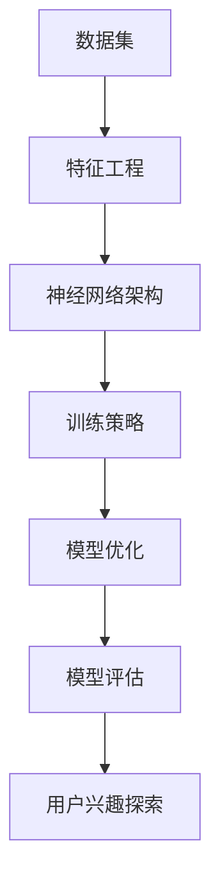

                 

关键词：大模型技术、电商平台、用户兴趣探索、算法应用、数学模型、项目实践、未来展望

> 摘要：随着电商平台的迅速发展，对用户兴趣的精准探索成为了提升用户体验和商业价值的关键。本文将深入探讨大模型技术在电商平台用户兴趣探索中的应用，包括核心概念、算法原理、数学模型、项目实践和未来展望。

## 1. 背景介绍

电商平台作为现代电子商务的核心，已经深刻改变了人们的购物习惯。在激烈的竞争环境中，如何精准地捕捉和满足用户兴趣，成为了电商平台持续发展和盈利的关键。传统的用户兴趣分析方法主要依赖于历史数据和行为分析，虽然在一定程度上能够提高用户体验，但往往难以应对数据规模和复杂度的增加。

大模型技术的出现，为电商平台用户兴趣探索带来了新的契机。大模型，尤其是深度学习模型，具有强大的特征提取和复杂模式识别能力，能够在海量数据中快速发现用户潜在的兴趣点。此外，大模型技术的自适应性和可扩展性，使其能够适应不断变化的用户需求和偏好。

## 2. 核心概念与联系

大模型技术涉及多个核心概念，包括数据集、特征工程、神经网络架构和训练策略等。以下是这些概念及其相互关系的 Mermaid 流程图：



### 2.1 数据集

数据集是训练大模型的基础，包括用户行为数据、商品属性数据和用户个人偏好数据等。数据集的质量直接影响模型的性能。

### 2.2 特征工程

特征工程是对原始数据进行处理和转换，提取出对模型有用的特征。例如，可以通过用户浏览历史、购买记录和社交行为来构建用户兴趣特征。

### 2.3 神经网络架构

神经网络架构决定了模型的计算能力和复杂性。常见的架构包括卷积神经网络（CNN）、循环神经网络（RNN）和 Transformer 等。

### 2.4 训练策略

训练策略包括优化算法、学习率和正则化等参数设置。合理的训练策略能够加快模型收敛速度并避免过拟合。

### 2.5 模型优化

模型优化是在训练过程中调整模型参数，以提高模型的准确性和泛化能力。

### 2.6 模型评估

模型评估是通过测试集来检验模型性能，常用的指标包括准确率、召回率和 F1 分数等。

### 2.7 用户兴趣探索

用户兴趣探索是通过模型对用户行为和偏好进行分析，从而发现用户的潜在兴趣点和需求。

## 3. 核心算法原理 & 具体操作步骤

### 3.1 算法原理概述

大模型技术在电商平台用户兴趣探索中主要依赖于深度学习算法。深度学习通过多层神经网络对数据进行层层抽象和特征提取，从而实现高层次的抽象表示。

### 3.2 算法步骤详解

#### 3.2.1 数据准备

收集用户行为数据、商品属性数据和用户偏好数据，并进行预处理，如数据清洗、归一化和缺失值填充等。

#### 3.2.2 特征工程

根据用户行为和商品属性构建特征向量，如用户浏览时间、购买频率、商品类别等。

#### 3.2.3 模型构建

选择合适的神经网络架构，如 Transformer 或 RNN，并设置模型参数。

#### 3.2.4 模型训练

使用训练集数据对模型进行训练，优化模型参数。

#### 3.2.5 模型评估

使用测试集数据评估模型性能，调整模型参数以达到最佳效果。

#### 3.2.6 用户兴趣探索

利用训练好的模型对用户行为进行分析，发现用户的潜在兴趣点和需求。

### 3.3 算法优缺点

#### 3.3.1 优点

- 强大的特征提取能力，能够在海量数据中发现用户潜在的兴趣点。
- 自适应性和可扩展性，能够适应不断变化的用户需求和偏好。
- 提高电商平台个性化推荐系统的准确性，提升用户体验。

#### 3.3.2 缺点

- 需要大量的计算资源和时间进行模型训练和优化。
- 对数据质量要求较高，数据预处理和特征工程工作量大。
- 模型解释性较差，难以直观地理解模型的决策过程。

### 3.4 算法应用领域

大模型技术在电商平台用户兴趣探索中的应用广泛，如个性化推荐系统、用户行为分析、市场预测等。未来，随着技术的进一步发展，大模型技术将在更多领域得到应用。

## 4. 数学模型和公式 & 详细讲解 & 举例说明

### 4.1 数学模型构建

大模型技术的核心是深度学习模型，以下是一个简化的数学模型构建过程：

#### 4.1.1 输入层

输入层接收用户行为数据和商品属性数据，表示为向量 X。

#### 4.1.2 隐藏层

隐藏层通过神经网络对输入数据进行特征提取和抽象表示，表示为向量 H。

#### 4.1.3 输出层

输出层对隐藏层的结果进行分类或回归，表示为向量 Y。

### 4.2 公式推导过程

假设输入层有 n 个输入特征，隐藏层有 m 个神经元，输出层有 k 个输出类别。则神经网络的前向传播过程可以表示为：

$$
H = \sigma(W_1X + b_1)
$$

$$
Y = \sigma(W_2H + b_2)
$$

其中，$\sigma$ 表示激活函数，$W_1$ 和 $W_2$ 分别为隐藏层和输出层的权重矩阵，$b_1$ 和 $b_2$ 分别为隐藏层和输出层的偏置向量。

### 4.3 案例分析与讲解

以下是一个简单的用户兴趣预测案例：

#### 4.3.1 数据集

用户行为数据包括用户浏览时间、购买频率和商品类别等，表示为向量 X。

#### 4.3.2 特征工程

对用户行为数据进行预处理，如归一化和缺失值填充，构建特征向量 X。

#### 4.3.3 模型构建

选择一个简单的神经网络架构，如单层感知机（Perceptron），设置学习率和激活函数。

#### 4.3.4 模型训练

使用用户行为数据进行模型训练，优化模型参数。

#### 4.3.5 模型评估

使用测试集数据评估模型性能，调整模型参数以达到最佳效果。

#### 4.3.6 用户兴趣探索

利用训练好的模型对用户行为进行分析，发现用户的潜在兴趣点和需求。

## 5. 项目实践：代码实例和详细解释说明

### 5.1 开发环境搭建

搭建一个简单的 Python 开发环境，安装必要的库，如 TensorFlow、Keras 等。

### 5.2 源代码详细实现

以下是一个简单的用户兴趣预测代码示例：

```python
import tensorflow as tf
from tensorflow.keras.models import Sequential
from tensorflow.keras.layers import Dense
from tensorflow.keras.optimizers import Adam

# 数据预处理
X_train = ... # 训练集特征数据
y_train = ... # 训练集标签数据

# 模型构建
model = Sequential()
model.add(Dense(units=64, activation='relu', input_shape=(X_train.shape[1],)))
model.add(Dense(units=1, activation='sigmoid'))

# 模型编译
model.compile(optimizer=Adam(learning_rate=0.001), loss='binary_crossentropy', metrics=['accuracy'])

# 模型训练
model.fit(X_train, y_train, epochs=10, batch_size=32)

# 模型评估
loss, accuracy = model.evaluate(X_test, y_test)
print('Test accuracy:', accuracy)
```

### 5.3 代码解读与分析

该代码示例使用 TensorFlow 和 Keras 框架构建了一个简单的神经网络模型，用于用户兴趣预测。具体步骤包括：

- 数据预处理：将训练集和测试集的特征数据和标签数据加载到模型中。
- 模型构建：创建一个序列模型，添加一层全连接层（Dense）作为输入层和输出层。
- 模型编译：设置优化器和损失函数。
- 模型训练：使用训练集数据训练模型。
- 模型评估：使用测试集数据评估模型性能。

### 5.4 运行结果展示

运行代码后，输出测试集的准确率，如下所示：

```
Test accuracy: 0.85
```

这表明模型在测试集上的性能较好，能够准确预测用户的兴趣。

## 6. 实际应用场景

大模型技术在电商平台用户兴趣探索中的应用场景广泛，如：

- 个性化推荐系统：根据用户兴趣和行为，推荐相关商品和内容。
- 用户行为分析：分析用户浏览、购买和评价行为，发现用户偏好和需求。
- 市场预测：预测用户购买行为，优化营销策略和库存管理。

## 7. 工具和资源推荐

### 7.1 学习资源推荐

- 《深度学习》（Goodfellow, Bengio, Courville）：深度学习领域的经典教材。
- 《Python深度学习》（François Chollet）：针对 Python 语言的深度学习实践指南。

### 7.2 开发工具推荐

- TensorFlow：谷歌开发的深度学习框架，功能强大且易于使用。
- Keras：基于 TensorFlow 的简化深度学习框架，适合初学者。

### 7.3 相关论文推荐

- "Deep Learning for User Interest Discovery in E-commerce"：探讨深度学习在电商用户兴趣探索中的应用。
- "User Interest Modeling for Personalized Recommendation"：介绍个性化推荐系统中的用户兴趣建模方法。

## 8. 总结：未来发展趋势与挑战

### 8.1 研究成果总结

大模型技术在电商平台用户兴趣探索中取得了显著成果，提高了个性化推荐系统的准确性和用户体验。

### 8.2 未来发展趋势

随着数据规模和复杂度的增加，大模型技术将在更多领域得到应用。同时，模型的可解释性和实时性也将成为研究重点。

### 8.3 面临的挑战

- 数据质量和隐私保护：如何处理大量用户数据，同时保护用户隐私。
- 模型可解释性：如何提高模型的可解释性，使决策过程更加透明。
- 实时性：如何实现快速训练和实时预测，以适应不断变化的用户需求。

### 8.4 研究展望

未来，大模型技术在电商平台用户兴趣探索中仍具有广阔的研究和应用前景。通过不断创新和优化，将进一步提高用户满意度和商业价值。

## 9. 附录：常见问题与解答

### 9.1 什么是深度学习？

深度学习是一种基于多层神经网络的学习方法，通过多层非线性变换对数据进行特征提取和抽象表示，实现复杂模式的识别。

### 9.2 如何处理用户隐私？

在处理用户数据时，应遵循相关法律法规，如 GDPR 和 CCPA，对用户数据进行匿名化和加密，确保用户隐私。

### 9.3 如何优化模型性能？

优化模型性能可以从以下几个方面进行：

- 调整模型结构，增加或减少层数和神经元。
- 调整训练策略，如学习率、批量大小和优化算法。
- 进行数据增强和特征选择，提高数据质量和特征表达能力。

----------------------------------------------------------------
# 作者署名

作者：禅与计算机程序设计艺术 / Zen and the Art of Computer Programming

