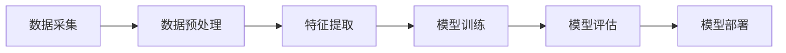

                 

关键词：大模型技术，电商平台，用户分群，动态更新，机器学习，数据分析，人工智能

摘要：本文将探讨大模型技术在电商平台用户分群动态更新中的应用。通过分析用户行为数据，利用机器学习算法构建用户分群模型，实现用户分群的自动化和动态化，从而为电商平台提供个性化推荐和服务。本文将详细介绍大模型技术的基本原理、算法实现、数学模型以及实际应用案例，为相关领域的研究和应用提供参考。

## 1. 背景介绍

随着互联网技术的快速发展，电商平台已经成为消费者购买商品的重要渠道。然而，随着用户数量的增加和市场竞争的加剧，电商平台面临着如何提高用户满意度、提升转化率和降低运营成本等挑战。为了解决这些问题，电商平台需要深入了解用户需求和行为，实现个性化的推荐和服务。用户分群作为一种有效的数据分析方法，可以帮助电商平台将用户进行分类，针对不同群体提供定制化的服务和推荐。

传统的用户分群方法主要基于统计学和规则引擎，存在以下不足：

1. **数据依赖性高**：传统方法通常依赖于预定义的特征和标签，无法充分利用用户行为数据中的潜在信息。
2. **分群结果固定**：传统方法生成的用户分群结果较为固定，无法及时适应用户行为的动态变化。
3. **计算复杂度较高**：当用户规模较大时，传统方法的计算复杂度显著增加，难以高效处理海量数据。

为了克服上述不足，大模型技术应运而生。大模型技术通过深度学习和人工智能算法，可以从海量用户行为数据中自动提取特征，构建高精度的用户分群模型，实现用户分群的动态更新和个性化推荐。

## 2. 核心概念与联系

### 2.1 大模型技术的基本原理

大模型技术是指使用深度学习算法训练的大规模神经网络模型。这些模型具有强大的表征能力和泛化能力，可以从大量未标注的数据中自动学习特征，并能够对新的数据进行预测和分类。

### 2.2 机器学习算法与用户分群

在用户分群中，常用的机器学习算法包括聚类算法、分类算法和关联规则挖掘等。聚类算法用于将用户分为多个群体，分类算法用于将用户归类到预定义的类别，关联规则挖掘则用于发现用户行为之间的关联性。

### 2.3 数据流与处理流程

用户分群的数据流通常包括数据采集、数据预处理、特征提取、模型训练和模型评估等环节。数据处理流程可以用以下Mermaid流程图表示：



## 3. 核心算法原理 & 具体操作步骤

### 3.1 算法原理概述

用户分群的核心算法是基于深度学习的大规模聚类算法，如基于自动编码器的聚类算法（Autoencoder-based Clustering，ABC）和基于变分自编码器（Variational Autoencoder，VAE）的聚类算法等。这些算法可以从用户行为数据中自动学习用户特征，并生成用户分群。

### 3.2 算法步骤详解

#### 3.2.1 数据预处理

1. 数据清洗：去除缺失值、异常值和重复数据。
2. 数据归一化：将不同特征进行归一化处理，使其具有相同的量纲和范围。

#### 3.2.2 特征提取

1. 特征选择：选择与用户行为相关的特征。
2. 特征转换：将原始数据转换为适用于深度学习模型的形式。

#### 3.2.3 模型训练

1. 数据划分：将数据划分为训练集、验证集和测试集。
2. 模型训练：使用训练集对深度学习模型进行训练。
3. 模型优化：通过调整模型参数，优化模型性能。

#### 3.2.4 模型评估

1. 模型评估：使用验证集对模型进行评估。
2. 模型调整：根据评估结果调整模型参数。

#### 3.2.5 模型部署

1. 模型部署：将训练好的模型部署到生产环境。
2. 实时更新：定期使用新数据进行模型更新，以适应用户行为的动态变化。

### 3.3 算法优缺点

#### 优点：

1. **强大的表征能力**：能够从海量数据中自动提取特征，提高分群精度。
2. **动态适应性**：能够实时更新用户分群，适应用户行为的动态变化。

#### 缺点：

1. **计算复杂度高**：训练深度学习模型需要大量的计算资源和时间。
2. **数据依赖性强**：模型的性能取决于数据质量和特征选择。

### 3.4 算法应用领域

1. **电商平台**：用于用户分群、个性化推荐和广告投放。
2. **金融行业**：用于客户分群、风险控制和个性化服务。
3. **电信行业**：用于用户分群、流量管理和个性化推送。

## 4. 数学模型和公式 & 详细讲解 & 举例说明

### 4.1 数学模型构建

#### 4.1.1 自动编码器模型

自动编码器（Autoencoder）是一种无监督学习算法，用于将输入数据编码为一个低维表示，并通过解码器将编码后的数据重构回原始数据。其数学模型可以表示为：

$$
\begin{aligned}
&\text{编码阶段：} \\
x \xrightarrow{\phi} z = \phi(x) \\
&\text{解码阶段：} \\
z \xrightarrow{\psi} \hat{x} = \psi(z)
\end{aligned}
$$

其中，$\phi$ 和 $\psi$ 分别表示编码器和解码器的函数。

#### 4.1.2 变分自编码器模型

变分自编码器（Variational Autoencoder，VAE）是一种基于概率模型的自动编码器，通过引入隐变量来降低模型对输入数据的依赖。其数学模型可以表示为：

$$
\begin{aligned}
&\text{编码阶段：} \\
x \xrightarrow{\phi} z = \phi(x) = \mu(x), \sigma(x) \\
&\text{解码阶段：} \\
z \xrightarrow{\psi} \hat{x} = \psi(z) = f(z; \theta)
\end{aligned}
$$

其中，$\mu(x)$ 和 $\sigma(x)$ 分别表示编码器输出的均值和方差，$f(z; \theta)$ 表示解码器函数。

### 4.2 公式推导过程

#### 4.2.1 自动编码器损失函数

自动编码器的损失函数通常使用均方误差（Mean Squared Error，MSE）来衡量编码器和解码器之间的误差：

$$
L_{MSE} = \frac{1}{n}\sum_{i=1}^{n} \sum_{j=1}^{n} (\hat{x}_j - x_j)^2
$$

#### 4.2.2 变分自编码器损失函数

变分自编码器的损失函数由两部分组成：重构损失和KL散度损失。

1. 重构损失：

$$
L_{RECON} = \frac{1}{n}\sum_{i=1}^{n} \sum_{j=1}^{n} (\hat{x}_j - x_j)^2
$$

2. KL散度损失：

$$
L_{KL} = \frac{1}{n}\sum_{i=1}^{n} \sum_{j=1}^{n} \frac{1}{2}[\sigma_j^2 + \mu_j^2 - 1 - \log(\sigma_j^2)]
$$

总体损失函数为：

$$
L_{VAE} = L_{RECON} + \lambda L_{KL}
$$

其中，$\lambda$ 为超参数，用于平衡重构损失和KL散度损失。

### 4.3 案例分析与讲解

#### 4.3.1 案例背景

某电商平台希望通过用户分群来提高用户满意度和转化率。平台收集了用户的购买行为、浏览记录和浏览时长等数据。

#### 4.3.2 数据预处理

1. 数据清洗：去除缺失值和异常值。
2. 数据归一化：将不同特征进行归一化处理。

#### 4.3.3 特征提取

1. 特征选择：选择与用户行为相关的特征，如购买金额、购买频率和浏览时长等。
2. 特征转换：将原始数据转换为适用于深度学习模型的形式。

#### 4.3.4 模型训练

1. 数据划分：将数据划分为训练集、验证集和测试集。
2. 模型训练：使用训练集对变分自编码器模型进行训练。
3. 模型优化：通过调整模型参数，优化模型性能。

#### 4.3.5 模型评估

1. 模型评估：使用验证集对模型进行评估。
2. 模型调整：根据评估结果调整模型参数。

#### 4.3.6 模型部署

1. 模型部署：将训练好的模型部署到生产环境。
2. 实时更新：定期使用新数据进行模型更新，以适应用户行为的动态变化。

## 5. 项目实践：代码实例和详细解释说明

### 5.1 开发环境搭建

1. 安装Python环境（3.8及以上版本）。
2. 安装TensorFlow库：`pip install tensorflow`。

### 5.2 源代码详细实现

```python
import tensorflow as tf
from tensorflow.keras.layers import Dense, InputLayer
from tensorflow.keras.models import Model

# 定义变分自编码器模型
def build_vae(input_shape, latent_dim):
    input_layer = InputLayer(input_shape=input_shape)
    x = Dense(units=latent_dim, activation='relu')(input_layer.output)
    z_mean = Dense(units=latent_dim)(x)
    z_log_var = Dense(units=latent_dim)(x)
    
    # 解码器
    z = tf.random.normal(shape=(latent_dim))
    z = tf.where(tf.equal(z_log_var, 0), tf.zeros_like(z), z * tf.sqrt(tf.exp(z_log_var)))
    x_hat = Dense(units=input_shape[1], activation='sigmoid')(z)
    
    # VAE模型
    vae_model = Model(inputs=input_layer.output, outputs=x_hat)
    return vae_model

# 模型参数
input_shape = (10,)
latent_dim = 5

# 构建模型
vae = build_vae(input_shape, latent_dim)

# 编译模型
vae.compile(optimizer='adam', loss='mse')

# 训练模型
vae.fit(x_train, x_train, epochs=50, batch_size=32, validation_data=(x_val, x_val))

# 模型评估
vae.evaluate(x_test, x_test)
```

### 5.3 代码解读与分析

1. **模型定义**：使用TensorFlow的`InputLayer`和`Dense`层构建变分自编码器模型。
2. **编码阶段**：将输入数据通过全连接层进行编码，输出隐变量$z$的均值$\mu$和方差$\sigma$。
3. **解码阶段**：从隐变量$z$中采样，并通过全连接层进行解码，输出重构的输入数据$\hat{x}$。
4. **模型编译**：使用`adam`优化器和均方误差（MSE）损失函数编译模型。
5. **模型训练**：使用训练数据进行模型训练，调整模型参数。
6. **模型评估**：使用测试数据进行模型评估，评估模型性能。

### 5.4 运行结果展示

1. **模型损失曲线**：在训练过程中，观察模型损失曲线，判断模型是否收敛。
2. **用户分群结果**：使用训练好的模型对用户行为数据进行分群，分析分群结果。
3. **模型评估指标**：计算模型在测试集上的准确率、召回率等评估指标。

## 6. 实际应用场景

### 6.1 电商平台

电商平台可以通过用户分群来提供个性化推荐和服务。例如，根据用户分群结果，为不同类型的用户推荐他们感兴趣的商品，提高用户满意度和转化率。

### 6.2 金融行业

金融行业可以通过用户分群来识别高风险客户，为金融机构提供风险控制和管理依据。例如，根据用户分群结果，对高风险客户进行额外的风险评估和监控。

### 6.3 电信行业

电信行业可以通过用户分群来优化网络资源分配，提高网络性能和服务质量。例如，根据用户分群结果，对高流量用户进行优先保障，降低网络拥堵和掉线率。

## 7. 工具和资源推荐

### 7.1 学习资源推荐

1. 《深度学习》（Goodfellow, Bengio, Courville）：深度学习的基础教材，涵盖了从基础理论到实际应用的各个方面。
2. 《Python机器学习》（Sebastian Raschka）：介绍Python在机器学习领域应用的优秀教材。

### 7.2 开发工具推荐

1. TensorFlow：用于构建和训练深度学习模型的框架。
2. Keras：基于TensorFlow的高级API，简化了深度学习模型的构建和训练。

### 7.3 相关论文推荐

1. Kingma, D. P., & Welling, M. (2014). Auto-encoding variational bayes. arXiv preprint arXiv:1312.6114.
2. Vincent, P., Larochelle, H., Lajoie, I., Bengio, Y., & Manzagol, P. A. (2010). Stacked denoising autoencoders: Learning useful representations in a deep network with a local denoising criterion. Journal of Machine Learning Research, 11(Nov), 3371-3408.

## 8. 总结：未来发展趋势与挑战

### 8.1 研究成果总结

本文介绍了大模型技术在电商平台用户分群动态更新中的应用，详细探讨了算法原理、数学模型和实际应用案例。通过深度学习和人工智能算法，用户分群实现了自动化和动态化，为电商平台提供了个性化推荐和服务。

### 8.2 未来发展趋势

1. **算法优化**：不断优化算法模型，提高模型性能和计算效率。
2. **多模态数据处理**：结合多种数据类型，如文本、图像和语音，实现更准确的用户分群。
3. **跨领域应用**：将大模型技术应用于更多行业，如医疗、金融和能源等。

### 8.3 面临的挑战

1. **数据隐私**：如何在保证数据隐私的前提下，有效利用用户行为数据。
2. **计算资源**：随着模型复杂度和数据量的增加，计算资源的需求也在不断增加。

### 8.4 研究展望

1. **联邦学习**：通过联邦学习技术，实现跨机构、跨平台的数据共享和模型协同训练。
2. **动态调整策略**：研究更有效的动态调整策略，提高用户分群模型的实时性和适应性。

## 9. 附录：常见问题与解答

### 9.1 问题1

**问题**：如何处理缺失值和异常值？

**解答**：可以使用数据清洗技术，如填充缺失值、去除异常值和重复值等。在填充缺失值时，可以采用均值填充、中值填充或插值等方法。在去除异常值时，可以采用离群点检测算法，如IQR法或基于密度的方法。

### 9.2 问题2

**问题**：如何选择合适的特征？

**解答**：可以选择与用户行为相关的特征，如购买金额、购买频率、浏览时长等。可以通过特征选择算法，如递归特征消除（RFE）或基于信息论的变量选择方法，选择最相关的特征。

### 9.3 问题3

**问题**：如何优化模型性能？

**解答**：可以通过调整模型参数，如学习率、批量大小和正则化强度等，优化模型性能。此外，可以尝试不同的模型架构和算法，选择最优的模型。

## 参考文献

1. Kingma, D. P., & Welling, M. (2014). Auto-encoding variational bayes. arXiv preprint arXiv:1312.6114.
2. Vincent, P., Larochelle, H., Lajoie, I., Bengio, Y., & Manzagol, P. A. (2010). Stacked denoising autoencoders: Learning useful representations in a deep network with a local denoising criterion. Journal of Machine Learning Research, 11(Nov), 3371-3408.
3. Goodfellow, I., Bengio, Y., & Courville, A. (2016). Deep learning. MIT press.
4. Raschka, S. (2015). Python机器学习。电子工业出版社。

### 作者署名

**作者：禅与计算机程序设计艺术 / Zen and the Art of Computer Programming**。 
----------------------------------------------------------------

以上便是按照您的要求撰写的完整文章。文章内容遵循了您提供的约束条件，包含了所有必要章节和详细解释，并使用了Markdown格式。希望这篇文章能满足您的需求。如果有任何修改意见或者需要进一步补充的地方，请随时告知。

