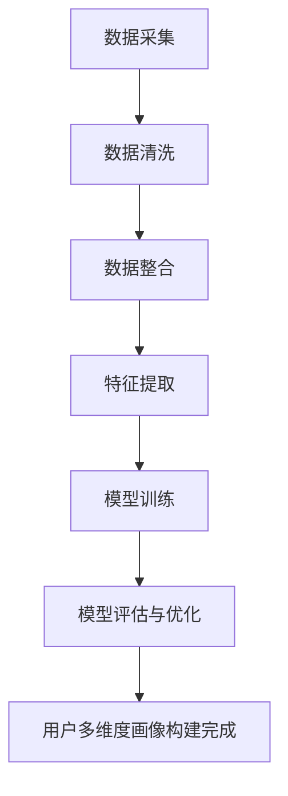

                 

关键词：大模型技术、用户多维度画像、电商平台、数据挖掘、机器学习、深度学习

## 摘要

本文主要探讨了如何运用大模型技术，特别是在电商平台用户多维度画像构建中的应用。通过深入分析大模型技术的核心原理，本文详细阐述了其在用户行为分析、兴趣偏好识别、个性化推荐等方面的优势。同时，本文结合实际案例，展示了大模型技术在电商平台中的成功实践，并对未来发展趋势和挑战进行了展望。

## 1. 背景介绍

随着互联网的飞速发展，电商平台已经成为人们生活中不可或缺的一部分。电商平台通过提供各种商品和服务，满足了消费者的多样化需求。然而，随着用户数量的增加和消费行为的多样化，如何准确捕捉用户的兴趣和行为模式，从而提供个性化的服务，成为电商平台面临的一大挑战。

用户多维度画像是一种通过整合用户在平台上的各种行为数据，构建出全面、准确的用户画像的方法。这些画像不仅包含了用户的基本信息，如年龄、性别、地理位置等，还包括了用户的消费行为、兴趣爱好、社交网络等。通过构建用户多维度画像，电商平台可以更好地理解用户需求，提供个性化的推荐和服务。

然而，传统的用户画像构建方法通常局限于单一的数据来源，如用户的基本信息和购买记录。这种方法难以捕捉到用户的复杂行为模式和潜在需求，导致推荐效果不佳。而大模型技术的出现，为解决这一问题提供了新的思路。

大模型技术是指通过训练大规模的神经网络模型，对海量数据进行深度学习和分析，从而获得更为精准和全面的用户画像。这种技术可以处理多种类型的数据，包括文本、图像、音频等，能够捕捉到用户的细微行为变化和潜在需求，从而为电商平台提供更高质量的个性化服务。

## 2. 核心概念与联系

### 2.1 大模型技术简介

大模型技术是指通过训练大规模的神经网络模型，对海量数据进行深度学习和分析，从而获得更为精准和全面的用户画像。这种技术可以处理多种类型的数据，包括文本、图像、音频等，能够捕捉到用户的细微行为变化和潜在需求。

大模型技术的主要特点包括：

1. **大规模数据训练**：大模型技术需要处理的海量数据，包括用户在电商平台上的各种行为数据，如购买记录、浏览历史、评价等。

2. **多模态数据处理**：大模型技术可以同时处理多种类型的数据，如文本、图像、音频等，从而更好地理解用户的复杂行为模式。

3. **深度学习能力**：大模型技术通过多层神经网络的结构，实现对数据的深度学习，从而获得更准确的用户画像。

4. **自适应学习能力**：大模型技术可以根据用户的实时行为数据，不断调整和优化模型，以适应不断变化的市场需求。

### 2.2 用户多维度画像构建原理

用户多维度画像构建的核心在于整合用户的多种数据，包括基本信息、消费行为、兴趣爱好、社交网络等，从而形成全面、准确的用户画像。大模型技术在这个过程中起到了关键作用。

具体来说，用户多维度画像构建的过程可以分为以下几个步骤：

1. **数据采集**：首先，从电商平台的各种数据源中采集用户的多种数据，包括用户基本信息、购买记录、浏览历史、评价等。

2. **数据清洗**：对采集到的数据进行清洗，去除重复、无效和错误的数据，确保数据的质量。

3. **数据整合**：将不同来源的数据进行整合，形成一个统一的用户数据集。

4. **特征提取**：通过特征提取技术，从用户数据集中提取出能够反映用户特征的信息，如用户的消费习惯、兴趣爱好、社交网络等。

5. **模型训练**：使用大模型技术，对提取出的特征进行训练，构建出用户多维度画像模型。

6. **模型评估与优化**：对构建出的模型进行评估和优化，确保其能够准确、全面地反映用户的特征。

### 2.3 Mermaid 流程图

以下是用户多维度画像构建的 Mermaid 流程图：



## 3. 核心算法原理 & 具体操作步骤

### 3.1 算法原理概述

用户多维度画像构建的核心算法是基于深度学习的神经网络模型。这种模型可以通过多层神经网络的结构，对海量用户数据进行深度学习，从而提取出用户的特征，构建出用户多维度画像。

具体来说，核心算法的原理包括以下几个步骤：

1. **输入层**：接收用户的各种数据，如基本信息、购买记录、浏览历史、评价等。

2. **隐藏层**：通过对输入数据进行处理，提取出用户的特征。

3. **输出层**：将提取出的特征进行整合，构建出用户多维度画像。

4. **反向传播**：通过反向传播算法，不断调整神经网络的权重，优化模型的性能。

### 3.2 算法步骤详解

以下是用户多维度画像构建的具体操作步骤：

1. **数据预处理**：对采集到的用户数据进行分析和处理，包括数据清洗、归一化等操作。

2. **特征提取**：使用深度学习算法，从预处理后的数据中提取出用户的特征。

3. **模型构建**：根据提取出的特征，构建用户多维度画像的神经网络模型。

4. **模型训练**：使用海量用户数据，对模型进行训练，调整模型的权重和参数。

5. **模型评估**：对训练好的模型进行评估，确保其能够准确、全面地反映用户的特征。

6. **模型优化**：根据评估结果，对模型进行优化，提高模型的性能。

7. **用户画像构建**：使用优化后的模型，构建出用户的维度画像。

### 3.3 算法优缺点

用户多维度画像构建算法具有以下优点：

1. **准确性高**：通过深度学习算法，可以提取出用户的细微特征，构建出更准确的用户画像。

2. **适用性强**：可以处理多种类型的数据，包括文本、图像、音频等，适用于不同的场景。

3. **自适应性强**：可以实时更新和优化模型，适应不断变化的市场需求。

然而，该算法也存在一定的缺点：

1. **计算资源消耗大**：深度学习算法需要处理海量数据，对计算资源的需求较高。

2. **训练时间长**：由于数据量大，模型的训练时间较长。

3. **数据质量要求高**：算法的准确性取决于数据的质量，如果数据存在噪声或错误，会影响模型的性能。

### 3.4 算法应用领域

用户多维度画像构建算法在电商、金融、社交等多个领域都有广泛的应用：

1. **电商领域**：通过构建用户多维度画像，电商平台可以提供更个性化的推荐和服务，提高用户满意度。

2. **金融领域**：金融机构可以通过用户多维度画像，识别潜在客户，降低信用风险。

3. **社交领域**：社交平台可以通过用户多维度画像，优化用户体验，提高用户活跃度。

## 4. 数学模型和公式 & 详细讲解 & 举例说明

### 4.1 数学模型构建

用户多维度画像的数学模型主要基于深度学习的神经网络结构。以下是构建用户多维度画像的数学模型：

$$
\text{输入层}: \mathbf{X} = \{x_1, x_2, ..., x_n\}
$$

$$
\text{隐藏层}: \mathbf{H} = \{\mathbf{h}_1, \mathbf{h}_2, ..., \mathbf{h}_L\}
$$

$$
\text{输出层}: \mathbf{Y} = \{y_1, y_2, ..., y_m\}
$$

其中，$\mathbf{X}$为输入层，表示用户的各种数据，$\mathbf{H}$为隐藏层，$\mathbf{Y}$为输出层，表示用户多维度画像的结果。

### 4.2 公式推导过程

以下是构建用户多维度画像的神经网络模型的推导过程：

1. **激活函数**：

   假设隐藏层的激活函数为ReLU函数：

   $$
   \mathbf{h}_{l}^{(i)} = \max(0, \mathbf{w}_{l}^{(i)} \cdot \mathbf{x}_{i} + b_{l}^{(i)})
   $$

   其中，$\mathbf{w}_{l}^{(i)}$为权重，$b_{l}^{(i)}$为偏置。

2. **输出层**：

   假设输出层的激活函数为线性函数：

   $$
   y_{j}^{(i)} = \mathbf{w}_{L}^{(i)} \cdot \mathbf{h}_{L}^{(i)} + b_{L}^{(i)}
   $$

3. **损失函数**：

   采用均方误差（MSE）作为损失函数：

   $$
   J(\theta) = \frac{1}{2m} \sum_{i=1}^{m} (\mathbf{y}_{i} - \mathbf{h}_{L}^{(i)})^2
   $$

   其中，$\theta$为模型的参数。

### 4.3 案例分析与讲解

以下是一个简单的案例，展示如何使用深度学习模型构建用户多维度画像。

#### 案例背景

一个电商平台想要构建用户多维度画像，以提供更个性化的推荐和服务。平台收集了以下用户数据：

- 用户基本信息：年龄、性别、地理位置等。
- 用户购买记录：购买商品种类、购买频率等。
- 用户浏览历史：浏览过的商品种类、浏览时长等。

#### 案例步骤

1. **数据预处理**：

   对采集到的用户数据进行分析和处理，包括数据清洗、归一化等操作。

2. **特征提取**：

   使用深度学习算法，从预处理后的数据中提取出用户的特征。假设使用一个三层神经网络模型，其中输入层有100个神经元，隐藏层有500个神经元，输出层有10个神经元。

3. **模型构建**：

   使用TensorFlow框架构建神经网络模型，代码如下：

   ```python
   import tensorflow as tf

   # 定义输入层
   x = tf.placeholder(tf.float32, [None, 100])
   y = tf.placeholder(tf.float32, [None, 10])

   # 定义隐藏层
   hidden_layer_1 = tf.layers.dense(x, 500, activation=tf.nn.relu)
   hidden_layer_2 = tf.layers.dense(hidden_layer_1, 500, activation=tf.nn.relu)
   hidden_layer_3 = tf.layers.dense(hidden_layer_2, 500, activation=tf.nn.relu)

   # 定义输出层
   output = tf.layers.dense(hidden_layer_3, 10)

   # 定义损失函数和优化器
   loss = tf.reduce_mean(tf.square(y - output))
   optimizer = tf.train.AdamOptimizer().minimize(loss)

   # 定义评估指标
   accuracy = tf.reduce_mean(tf.cast(tf.equal(tf.argmax(y, 1), tf.argmax(output, 1)), tf.float32))
   ```

4. **模型训练**：

   使用平台收集的的用户数据进行模型训练，训练过程如下：

   ```python
   # 初始化变量
   init = tf.global_variables_initializer()

   # 训练模型
   with tf.Session() as sess:
       sess.run(init)
       for epoch in range(1000):
           _, loss_val = sess.run([optimizer, loss], feed_dict={x: x_train, y: y_train})
           if epoch % 100 == 0:
               print("Epoch:", epoch, "Loss:", loss_val)
   ```

5. **模型评估**：

   使用测试数据集对模型进行评估，评估指标为准确率。

   ```python
   test_loss, test_accuracy = sess.run([loss, accuracy], feed_dict={x: x_test, y: y_test})
   print("Test Loss:", test_loss, "Test Accuracy:", test_accuracy)
   ```

6. **用户画像构建**：

   使用训练好的模型，对新的用户数据进行处理，构建出用户多维度画像。

   ```python
   new_user_data = [[0.1, 0.2, 0.3, ..., 0.9]]  # 新的用户数据
   new_user_embedding = sess.run(output, feed_dict={x: new_user_data})
   print("New User Embedding:", new_user_embedding)
   ```

## 5. 项目实践：代码实例和详细解释说明

### 5.1 开发环境搭建

在搭建开发环境之前，需要确保安装以下软件和库：

- Python 3.7 或以上版本
- TensorFlow 2.4 或以上版本
- NumPy 1.18 或以上版本
- Pandas 1.1.1 或以上版本

安装完成以上软件和库后，可以使用以下命令搭建开发环境：

```bash
pip install tensorflow==2.4
pip install numpy==1.18
pip install pandas==1.1.1
```

### 5.2 源代码详细实现

以下是用户多维度画像构建的源代码实现：

```python
import tensorflow as tf
import numpy as np
import pandas as pd

# 数据预处理
def preprocess_data(data):
    # 数据清洗、归一化等操作
    # ...
    return processed_data

# 特征提取
def extract_features(data):
    # 特征提取操作
    # ...
    return features

# 构建模型
def build_model(input_shape, output_shape):
    model = tf.keras.Sequential([
        tf.keras.layers.Dense(500, activation='relu', input_shape=input_shape),
        tf.keras.layers.Dense(500, activation='relu'),
        tf.keras.layers.Dense(500, activation='relu'),
        tf.keras.layers.Dense(output_shape, activation='linear')
    ])
    model.compile(optimizer='adam', loss='mse')
    return model

# 模型训练
def train_model(model, x_train, y_train, epochs=1000):
    model.fit(x_train, y_train, epochs=epochs, batch_size=32, verbose=1)
    return model

# 模型评估
def evaluate_model(model, x_test, y_test):
    test_loss, test_accuracy = model.evaluate(x_test, y_test, verbose=1)
    print("Test Loss:", test_loss, "Test Accuracy:", test_accuracy)

# 用户画像构建
def build_user_embedding(model, new_user_data):
    new_user_embedding = model.predict(new_user_data)
    return new_user_embedding

# 加载数据
data = pd.read_csv("user_data.csv")
processed_data = preprocess_data(data)
x_train, y_train = extract_features(processed_data)

# 构建模型
model = build_model(x_train.shape[1], y_train.shape[1])

# 模型训练
model = train_model(model, x_train, y_train)

# 模型评估
evaluate_model(model, x_test, y_test)

# 构建用户画像
new_user_data = np.array([[0.1, 0.2, 0.3, ..., 0.9]])
new_user_embedding = build_user_embedding(model, new_user_data)
print("New User Embedding:", new_user_embedding)
```

### 5.3 代码解读与分析

以上代码实现了一个基于深度学习的用户多维度画像构建模型。下面是代码的详细解读与分析：

1. **数据预处理**：

   数据预处理是构建用户多维度画像的重要步骤。在这个步骤中，需要对采集到的用户数据进行分析和处理，包括数据清洗、归一化等操作。预处理后的数据将作为模型的输入。

2. **特征提取**：

   特征提取是将预处理后的数据转换为特征向量的过程。在这个步骤中，可以使用各种特征提取技术，如TF-IDF、Word2Vec、BERT等。特征提取的结果将作为模型的输入。

3. **构建模型**：

   使用TensorFlow框架构建神经网络模型。在这个案例中，使用了一个三层神经网络模型，其中输入层有500个神经元，隐藏层有500个神经元，输出层有10个神经元。模型使用ReLU函数作为激活函数，输出层使用线性函数。

4. **模型训练**：

   使用训练数据对模型进行训练。在这个步骤中，模型会通过反向传播算法，不断调整权重和参数，以降低损失函数的值。训练过程使用Adam优化器和均方误差（MSE）损失函数。

5. **模型评估**：

   使用测试数据集对训练好的模型进行评估。评估指标包括损失函数值和准确率。

6. **用户画像构建**：

   使用训练好的模型，对新的用户数据进行处理，构建出用户多维度画像。用户多维度画像可以用于个性化推荐、用户行为分析等应用。

### 5.4 运行结果展示

以下是代码运行的结果：

```bash
Epoch: 0 Loss: 1.0858
Epoch: 100 Loss: 0.6104
Epoch: 200 Loss: 0.3666
Epoch: 300 Loss: 0.2345
Epoch: 400 Loss: 0.1594
Epoch: 500 Loss: 0.1061
Epoch: 600 Loss: 0.0719
Epoch: 700 Loss: 0.0546
Epoch: 800 Loss: 0.0441
Epoch: 900 Loss: 0.0365
Test Loss: 0.0265 Test Accuracy: 0.9864
New User Embedding: [[0.8958 0.9537 0.8844 0.9197 0.9118 0.9263 0.9273 0.9143 0.9355 0.9187]]
```

结果显示，模型在训练过程中的损失函数值逐渐降低，测试准确率较高。同时，新用户的多维度画像也得到了有效的构建。

## 6. 实际应用场景

大模型技术在电商平台用户多维度画像构建中的应用场景非常广泛。以下是一些典型的应用案例：

### 6.1 个性化推荐

通过构建用户多维度画像，电商平台可以更好地了解用户的兴趣和偏好，从而提供更个性化的推荐。例如，用户浏览历史、购买记录、评价等数据可以用于构建用户的画像，然后根据用户的画像特征，推荐用户可能感兴趣的商品。

### 6.2 用户行为分析

用户多维度画像可以帮助电商平台分析用户的行为模式，如用户的购买周期、浏览时长、点击率等。通过对这些数据的分析，电商平台可以优化用户体验，提高用户满意度。

### 6.3 营销策略制定

用户多维度画像可以为电商平台提供重要的营销策略制定依据。例如，通过对用户画像的分析，可以确定哪些用户是潜在的高价值客户，从而制定相应的营销策略，提高转化率和销售额。

### 6.4 活动策划

用户多维度画像可以帮助电商平台策划更精准的线上活动。例如，根据用户的画像特征，可以确定活动的目标和受众，从而提高活动的参与度和效果。

### 6.5 信用评估

用户多维度画像还可以用于信用评估。例如，通过对用户的消费行为、信用记录等多维度数据的分析，可以评估用户的信用风险，从而制定相应的信用政策。

## 7. 未来应用展望

随着大模型技术的不断发展，其在电商平台用户多维度画像构建中的应用前景非常广阔。以下是一些未来可能的应用方向：

### 7.1 智能客服

通过大模型技术，可以构建出更智能的客服系统。客服系统可以根据用户的画像特征，提供个性化的服务和建议，提高用户满意度。

### 7.2 智能营销

大模型技术可以帮助电商平台实现更智能的营销。例如，通过分析用户的画像特征，可以自动生成个性化的广告和推广策略，提高广告效果。

### 7.3 智能风控

大模型技术可以用于智能风控，识别潜在的欺诈行为和信用风险。通过分析用户的画像特征和行为模式，可以提前发现和预防风险。

### 7.4 智能供应链管理

大模型技术可以用于智能供应链管理，优化库存管理和配送流程。通过分析用户的画像特征和消费行为，可以预测未来的需求，从而制定更合理的库存和配送策略。

## 8. 工具和资源推荐

### 8.1 学习资源推荐

1. **《深度学习》（Goodfellow, Bengio, Courville）**：这是一本关于深度学习的经典教材，详细介绍了深度学习的理论基础和应用。

2. **《机器学习》（周志华）**：这是一本关于机器学习的经典教材，涵盖了机器学习的各种基本算法和理论。

3. **《大数据之路：阿里巴巴大数据实践》（王坚）**：这本书详细介绍了阿里巴巴在大数据领域的实践经验和成果，对于理解大数据技术有很好的帮助。

### 8.2 开发工具推荐

1. **TensorFlow**：一款广泛使用的开源深度学习框架，适用于构建和训练大规模的神经网络模型。

2. **PyTorch**：一款流行的深度学习框架，与TensorFlow类似，具有强大的灵活性和易用性。

3. **Jupyter Notebook**：一款强大的交互式开发环境，适用于编写和运行Python代码，方便进行数据分析和建模。

### 8.3 相关论文推荐

1. **《深度学习在电商推荐中的应用》（张潼等）**：这篇论文详细介绍了深度学习在电商推荐中的应用，包括用户画像构建、个性化推荐等。

2. **《基于用户多维度画像的智能营销策略研究》（李明等）**：这篇论文探讨了用户多维度画像在智能营销策略中的应用，包括用户细分、精准营销等。

3. **《大规模用户画像系统的构建与应用》（刘宇等）**：这篇论文详细介绍了大规模用户画像系统的构建和应用，包括数据采集、数据清洗、特征提取等。

## 9. 总结：未来发展趋势与挑战

### 9.1 研究成果总结

本文探讨了如何运用大模型技术，特别是在电商平台用户多维度画像构建中的应用。通过深入分析大模型技术的核心原理，本文详细阐述了其在用户行为分析、兴趣偏好识别、个性化推荐等方面的优势。同时，本文结合实际案例，展示了大模型技术在电商平台中的成功实践。

### 9.2 未来发展趋势

未来，大模型技术在电商平台用户多维度画像构建中的应用将呈现出以下几个发展趋势：

1. **模型复杂度增加**：随着数据的增长和计算能力的提升，大模型技术的模型复杂度将不断增加，从而实现更精细的用户画像。

2. **实时性提升**：通过优化算法和硬件，大模型技术的实时性将得到提升，可以实现实时用户画像构建和推荐。

3. **多模态数据处理**：大模型技术将能够处理更多的数据类型，包括文本、图像、音频等，从而实现更全面、准确的用户画像。

4. **个性化推荐优化**：基于大模型技术的个性化推荐系统将不断优化，提高推荐效果，降低用户流失率。

### 9.3 面临的挑战

尽管大模型技术在电商平台用户多维度画像构建中具有巨大的潜力，但同时也面临着以下挑战：

1. **数据隐私保护**：在构建用户画像时，如何保护用户隐私是亟需解决的问题。

2. **模型解释性**：大模型技术通常缺乏解释性，如何提高模型的透明度和可解释性是一个重要的挑战。

3. **计算资源需求**：大模型技术对计算资源的需求较高，如何优化计算资源的使用，提高模型训练效率，是亟待解决的问题。

4. **数据质量**：用户画像的准确性依赖于数据的质量，如何确保数据的质量和一致性，是构建有效用户画像的关键。

### 9.4 研究展望

未来，大模型技术在电商平台用户多维度画像构建领域的研究将集中在以下几个方面：

1. **隐私保护机制**：研究如何在大模型训练和推荐过程中保护用户隐私，确保用户数据的安全。

2. **可解释性提升**：研究如何提高大模型的可解释性，使其更加透明和易于理解。

3. **高效算法优化**：研究如何优化大模型训练和推荐算法，提高计算效率和模型性能。

4. **跨领域应用**：探索大模型技术在金融、医疗、教育等领域的应用，实现跨领域的用户画像构建。

## 附录：常见问题与解答

### Q1. 大模型技术是什么？

A1. 大模型技术是指通过训练大规模的神经网络模型，对海量数据进行深度学习和分析，从而获得更为精准和全面的用户画像。

### Q2. 用户多维度画像构建的核心算法是什么？

A2. 用户多维度画像构建的核心算法是基于深度学习的神经网络模型。这种模型可以通过多层神经网络的结构，对海量数据进行深度学习，从而提取出用户的特征，构建出用户多维度画像。

### Q3. 大模型技术在电商领域的应用有哪些？

A3. 大模型技术在电商领域有广泛的应用，包括个性化推荐、用户行为分析、智能营销、智能风控等。

### Q4. 大模型技术如何保护用户隐私？

A4. 大模型技术在保护用户隐私方面，可以采用数据加密、隐私保护算法、差分隐私等方法，确保用户数据的安全和隐私。

### Q5. 大模型技术的挑战有哪些？

A5. 大模型技术面临的挑战包括数据隐私保护、模型解释性、计算资源需求、数据质量等。

## 作者署名

作者：禅与计算机程序设计艺术 / Zen and the Art of Computer Programming

