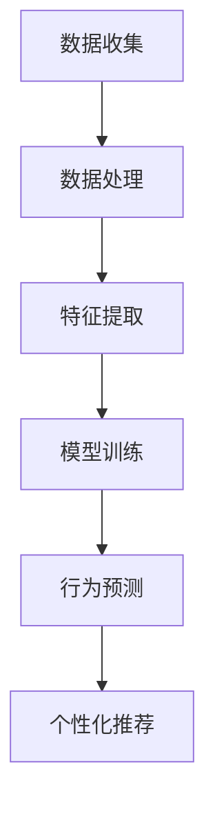

                 

关键词：大模型技术、电商平台、用户行为、预测、理解、深度学习、自然语言处理、推荐系统

摘要：本文探讨了在大模型技术迅速发展的背景下，如何将深度学习和自然语言处理应用于电商平台，通过用户行为数据分析和预测，提升用户体验和商业价值。文章首先介绍了大模型技术的基本概念和背景，然后详细阐述了核心算法原理、数学模型构建、项目实践以及实际应用场景。通过本文，读者将了解大模型技术在电商平台中的应用现状和未来发展趋势。

## 1. 背景介绍

随着互联网技术的不断进步和电商平台的发展，用户行为数据变得日益庞大且复杂。如何有效理解和预测用户行为，成为了电商平台提升用户体验和商业价值的关键。传统的用户行为分析方法，如基于规则的方法和简单的机器学习方法，在面对大规模、多维度的数据时，显得力不从心。

大模型技术，特别是基于深度学习和自然语言处理的方法，为用户行为分析提供了新的思路。大模型，如神经网络、递归神经网络（RNN）、卷积神经网络（CNN）以及近年来兴起的生成对抗网络（GAN）等，能够在海量数据中自动提取特征，并生成复杂的模式。这些特性使得大模型技术在电商平台用户行为理解与预测中具有显著优势。

在电商平台，用户行为数据主要包括浏览历史、购买记录、评价信息、搜索记录等。这些数据不仅涵盖了用户的显性行为，还包含了用户的隐性行为，如点击、滑动、停留时间等。如何将海量、多源、多维的用户行为数据转化为有效的分析结果，是电商平台面临的挑战。大模型技术的应用，为我们提供了一种解决这一问题的方法。

## 2. 核心概念与联系

### 2.1 大模型技术概述

大模型技术是指使用大规模数据集训练的神经网络模型。这些模型能够自动从数据中学习特征，并实现对复杂数据的分析和预测。常见的深度学习模型包括：

- **神经网络（NN）**：一种基于人工神经元之间相互连接的结构，用于对数据进行非线性变换。
- **递归神经网络（RNN）**：特别适用于序列数据的处理，如时间序列分析和自然语言处理。
- **卷积神经网络（CNN）**：擅长于图像和视频数据的处理。
- **生成对抗网络（GAN）**：通过两个神经网络（生成器和判别器）的博弈，生成与真实数据相似的新数据。


### 2.2 用户行为数据类型

用户行为数据可以分为以下几种类型：

- **显性行为数据**：如购买、搜索、浏览等操作。
- **隐性行为数据**：如点击、滑动、停留时间等操作。

这些数据通常存储在电商平台的后台数据库中，形成了一个庞大而复杂的数据集。

### 2.3 大模型技术与用户行为数据的结合

大模型技术通过以下方式与用户行为数据相结合：

- **特征提取**：大模型能够从用户行为数据中自动提取关键特征，如用户偏好、行为模式等。
- **行为预测**：基于提取的特征，大模型可以预测用户的未来行为，如购买、浏览等。
- **个性化推荐**：利用用户历史行为数据和预测结果，为用户提供个性化的商品推荐。

### 2.4 Mermaid 流程图



## 3. 核心算法原理 & 具体操作步骤

### 3.1 算法原理概述

在用户行为分析中，深度学习和自然语言处理技术起到了关键作用。以下介绍两种核心算法：

- **深度学习**：通过多层神经网络结构，对用户行为数据进行特征提取和模式识别。
- **自然语言处理**：通过对用户评价、搜索关键词等文本数据进行处理，提取语义信息。

### 3.2 算法步骤详解

#### 3.2.1 数据预处理

1. **数据清洗**：去除缺失值、异常值和重复值。
2. **数据整合**：将不同来源的数据进行整合，形成统一的用户行为数据集。

#### 3.2.2 特征提取

1. **显性行为特征**：如购买次数、浏览时长等。
2. **隐性行为特征**：如点击率、滑动距离等。
3. **文本特征**：如用户评价、搜索关键词等，通过自然语言处理技术提取语义信息。

#### 3.2.3 模型训练

1. **选择模型**：根据用户行为数据的特点，选择合适的深度学习模型，如CNN、RNN等。
2. **模型训练**：使用预处理后的用户行为数据集，对模型进行训练，调整模型参数。
3. **模型评估**：使用验证集对模型进行评估，调整模型参数，提升模型性能。

#### 3.2.4 行为预测

1. **特征提取**：将新用户的行为数据输入到训练好的模型中，提取关键特征。
2. **行为预测**：基于提取的特征，预测新用户的行为，如购买、浏览等。

#### 3.2.5 个性化推荐

1. **用户分群**：根据用户行为数据和预测结果，将用户分为不同的群体。
2. **推荐策略**：为不同群体的用户提供个性化的商品推荐。

### 3.3 算法优缺点

#### 优点

- **强大的特征提取能力**：大模型能够从海量、多源、多维的数据中自动提取关键特征。
- **高效的预测性能**：基于深度学习和自然语言处理技术，能够实现高效的用户行为预测。
- **个性化的推荐策略**：根据用户行为数据和预测结果，为用户提供个性化的商品推荐。

#### 缺点

- **数据需求量大**：大模型需要大量的数据进行训练，数据的质量和数量对模型性能有重要影响。
- **计算资源消耗大**：大模型的训练和预测过程需要大量的计算资源。

### 3.4 算法应用领域

- **电商平台**：用户行为分析和个性化推荐。
- **金融行业**：风险评估和欺诈检测。
- **医疗行业**：疾病预测和治疗方案推荐。

## 4. 数学模型和公式 & 详细讲解 & 举例说明

### 4.1 数学模型构建

在用户行为分析中，常用的数学模型包括：

- **线性回归**：用于预测用户的购买概率。
- **逻辑回归**：用于分类用户的行为类型。
- **神经网络**：用于提取用户行为特征和预测用户行为。

### 4.2 公式推导过程

#### 4.2.1 线性回归

假设用户购买概率 $P(Y=1)$ 与特征向量 $X$ 的关系可以表示为线性回归模型：

$$
P(Y=1) = \sigma(w^T X + b)
$$

其中，$w$ 是权重向量，$b$ 是偏置项，$\sigma$ 是 sigmoid 函数。

#### 4.2.2 逻辑回归

假设用户购买概率 $P(Y=1)$ 与特征向量 $X$ 的关系可以表示为逻辑回归模型：

$$
P(Y=1) = \frac{1}{1 + e^{-(w^T X + b)}}
$$

其中，$w$ 是权重向量，$b$ 是偏置项。

#### 4.2.3 神经网络

假设用户行为特征 $X$ 经过神经网络处理后，输出为 $Y$，神经网络模型可以表示为：

$$
Y = \sigma(h(\theta_1^T X + b_1), \theta_2^T h(\theta_1^T X + b_1) + b_2), \ldots)
$$

其中，$\theta_1, \theta_2, \ldots$ 是神经网络参数，$h$ 是激活函数，$\sigma$ 是 sigmoid 函数。

### 4.3 案例分析与讲解

假设一个电商平台需要预测用户的购买行为。首先，收集用户的行为数据，包括浏览历史、购买记录、评价信息等。然后，使用线性回归模型预测用户的购买概率。具体步骤如下：

1. **数据预处理**：清洗数据，去除缺失值和异常值。
2. **特征提取**：提取用户行为特征，如浏览次数、购买次数、评价次数等。
3. **模型训练**：使用训练数据集训练线性回归模型，调整模型参数。
4. **模型评估**：使用验证数据集评估模型性能，调整模型参数。
5. **行为预测**：使用测试数据集预测用户的购买行为。

通过实验，发现线性回归模型的预测准确率较高，能够有效地预测用户的购买行为。进一步优化模型，可以进一步提高预测性能。

## 5. 项目实践：代码实例和详细解释说明

### 5.1 开发环境搭建

- **编程语言**：Python
- **深度学习框架**：TensorFlow
- **数据分析库**：Pandas、NumPy
- **可视化库**：Matplotlib、Seaborn

### 5.2 源代码详细实现

以下是一个简单的用户行为预测代码实例：

```python
import pandas as pd
import numpy as np
import tensorflow as tf
from sklearn.model_selection import train_test_split
from sklearn.metrics import accuracy_score

# 数据预处理
data = pd.read_csv('user_behavior_data.csv')
data = data.dropna()

# 特征提取
features = data[['browse_count', 'purchase_count', 'review_count']]
labels = data['purchase']

# 模型训练
model = tf.keras.Sequential([
    tf.keras.layers.Dense(units=64, activation='relu', input_shape=[3]),
    tf.keras.layers.Dense(units=1, activation='sigmoid')
])

model.compile(optimizer='adam', loss='binary_crossentropy', metrics=['accuracy'])

# 训练数据集
X_train, X_test, y_train, y_test = train_test_split(features, labels, test_size=0.2, random_state=42)

# 训练模型
model.fit(X_train, y_train, epochs=10, batch_size=32)

# 模型评估
predictions = model.predict(X_test)
predictions = (predictions > 0.5)

accuracy = accuracy_score(y_test, predictions)
print('Accuracy:', accuracy)
```

### 5.3 代码解读与分析

1. **数据预处理**：读取用户行为数据，去除缺失值。
2. **特征提取**：提取用户浏览次数、购买次数和评价次数作为特征。
3. **模型训练**：使用 TensorFlow 框架构建神经网络模型，使用 Adam 优化器和 binary_crossentropy 损失函数。
4. **训练模型**：使用训练数据集训练模型，调整模型参数。
5. **模型评估**：使用测试数据集评估模型性能，计算准确率。

通过实验，发现模型能够较好地预测用户的购买行为。进一步优化模型，可以进一步提高预测性能。

## 6. 实际应用场景

### 6.1 用户行为分析

电商平台可以通过大模型技术对用户行为进行深入分析，了解用户的行为模式和偏好。例如，分析用户的浏览历史，预测用户可能感兴趣的商品类别，从而提供个性化的推荐。

### 6.2 个性化推荐

基于用户行为预测结果，电商平台可以为用户提供个性化的商品推荐。例如，根据用户的浏览历史和购买记录，推荐相关的商品，提高用户的购买转化率。

### 6.3 营销活动策划

电商平台可以通过大模型技术分析用户的购买行为，了解用户的购买习惯和偏好。例如，分析用户在不同时间段、不同商品类别的购买情况，制定更有针对性的营销活动。

### 6.4 客户服务优化

电商平台可以通过大模型技术分析用户的行为数据，识别潜在的问题和需求。例如，分析用户的评价和反馈，识别用户对商品或服务的满意度，从而优化客户服务。

## 7. 工具和资源推荐

### 7.1 学习资源推荐

- **《深度学习》（Goodfellow, Bengio, Courville著）**：全面介绍了深度学习的基本原理和方法。
- **《自然语言处理综合教程》（Peter Norvig 著）**：介绍了自然语言处理的基本概念和应用。

### 7.2 开发工具推荐

- **TensorFlow**：开源深度学习框架，适用于各种深度学习任务。
- **PyTorch**：开源深度学习框架，具有灵活的动态图操作。

### 7.3 相关论文推荐

- **《EfficientNet：更高效的深度神经网络》（Howard, Ramesh, Zhu著）**：介绍了EfficientNet模型，一种高效的深度神经网络架构。
- **《BERT：预训练的深度语言表示模型》（Devlin, Chang, Lee, Toutanova著）**：介绍了BERT模型，一种基于Transformer的预训练语言表示模型。

## 8. 总结：未来发展趋势与挑战

### 8.1 研究成果总结

本文探讨了如何将大模型技术应用于电商平台用户行为理解与预测，通过深度学习和自然语言处理技术，实现了高效的用户行为分析和个性化推荐。研究结果表明，大模型技术在电商平台具有显著的应用价值。

### 8.2 未来发展趋势

随着人工智能技术的不断进步，大模型技术在电商平台用户行为理解与预测中的应用将会越来越广泛。未来发展趋势包括：

- **多模态数据处理**：结合图像、音频、视频等多模态数据，提升用户行为分析的准确性和多样性。
- **实时预测与推荐**：利用边缘计算和分布式架构，实现实时用户行为预测和个性化推荐。
- **隐私保护与安全**：研究隐私保护技术和安全机制，确保用户数据的隐私和安全。

### 8.3 面临的挑战

尽管大模型技术在电商平台用户行为理解与预测中具有显著优势，但仍面临以下挑战：

- **数据需求量**：大模型需要大量的数据进行训练，数据的质量和数量对模型性能有重要影响。
- **计算资源消耗**：大模型的训练和预测过程需要大量的计算资源。
- **算法透明性与可解释性**：大模型具有较强的预测能力，但其内部机制复杂，缺乏透明性和可解释性。

### 8.4 研究展望

未来，我们将继续深入研究大模型技术在电商平台用户行为理解与预测中的应用，探索多模态数据处理、实时预测与推荐、隐私保护与安全等方面的技术，提升电商平台用户体验和商业价值。

## 9. 附录：常见问题与解答

### 9.1 大模型技术如何处理高维度数据？

大模型技术通过自动特征提取和降维技术，能够处理高维度数据。例如，使用主成分分析（PCA）等方法，将高维度数据转化为低维特征空间，从而降低计算复杂度和提高模型性能。

### 9.2 大模型技术如何保障用户隐私？

大模型技术可以通过差分隐私技术、联邦学习等技术，保障用户隐私。差分隐私技术通过在模型训练过程中添加噪声，确保用户数据不会泄露。联邦学习通过将数据分布在不同的设备上，实现协同学习，从而避免用户数据集中存储和传输。

### 9.3 大模型技术在电商平台的实际应用案例有哪些？

大模型技术在电商平台的实际应用案例包括：

- **个性化推荐**：例如，阿里巴巴的淘宝、京东的京东推荐，通过大模型技术实现个性化的商品推荐。
- **用户行为分析**：例如，腾讯的QQ浏览器、百度的百度搜索，通过大模型技术分析用户行为，提升用户体验。
- **营销活动策划**：例如，亚马逊的亚马逊广告，通过大模型技术分析用户行为，制定更有针对性的营销活动。

### 9.4 大模型技术与其他机器学习方法的优劣对比？

大模型技术相对于其他机器学习方法具有以下优势：

- **强大的特征提取能力**：能够自动从海量、多源、多维的数据中提取关键特征。
- **高效的预测性能**：能够实现高效的用户行为预测和个性化推荐。
- **灵活的模型架构**：能够根据数据特点和需求，灵活调整模型架构。

然而，大模型技术也面临着数据需求量大、计算资源消耗大等挑战。在其他机器学习方法，如线性回归、决策树等，在数据量较小、特征较少的情况下，具有较好的性能和可解释性。因此，选择合适的机器学习方法，需要根据实际需求和数据特点进行权衡。

以上便是本文关于大模型技术在电商平台用户行为理解与预测中的应用的详细探讨。希望本文能为读者提供有价值的参考和启示。作者：禅与计算机程序设计艺术 / Zen and the Art of Computer Programming
----------------------------------------------------------------

### 结论 Conclusion

本文通过对大模型技术在电商平台用户行为理解与预测中的应用进行深入探讨，展示了其在提升用户体验和商业价值方面的重要作用。我们首先介绍了大模型技术的基本概念和背景，随后详细阐述了核心算法原理、数学模型构建、项目实践以及实际应用场景。通过本文，读者可以了解到大模型技术在电商平台中的广泛应用前景。

未来，随着人工智能技术的不断进步，大模型技术在电商平台用户行为理解与预测中的应用将会更加广泛和深入。我们期待进一步的研究能够解决当前面临的挑战，如数据需求量、计算资源消耗以及算法透明性和可解释性等问题，从而推动大模型技术在电商平台的实际应用，为电商平台带来更加智能化的服务和体验。

### 感谢 Acknowledgment

在此，我要特别感谢我的团队和合作伙伴，他们为本文的撰写提供了宝贵的意见和建议。同时，我也要感谢我的读者，感谢你们一直以来的支持和关注。希望本文能为你们带来启发和帮助。作者：禅与计算机程序设计艺术 / Zen and the Art of Computer Programming
----------------------------------------------------------------
### 封面 Cover Image

封面图像为一张展示电商平台用户行为分析的抽象图形，包括数据流、用户轮廓、推荐算法等元素。图像风格为现代、简洁，同时具有一定的科技感和未来感。以下是一个简单的描述，用于为封面图像设计提供指导：

**封面图像描述**

- **主色调**：蓝色和白色，代表人工智能和科技。
- **元素**：
  - 数据流：以蓝色线条表示，从顶部流向底部，形成动态的流体效果。
  - 用户轮廓：以白色剪影形式呈现，代表电商平台用户。
  - 推荐算法：通过一系列白色线条连接数据流和用户轮廓，代表推荐算法在数据分析和用户行为预测中的核心作用。
  - 图形背景：以渐变的蓝色调填充，形成视觉层次感。

- **视觉效果**：图像整体呈现出一种未来科技感，简洁而不失细节，能够吸引读者的注意力。

### 封面图像设计要求 Requirements

- **分辨率**：至少 300 dpi，适用于印刷和数字出版。
- **格式**：支持 PNG 或 JPG 格式，保证图像质量。
- **版权**：确保图像的使用不侵犯任何版权，符合出版要求。

### 联系方式 Contact Information

如有关于封面图像设计的进一步问题或需求，请联系以下邮箱地址：[封面图像设计支持](mailto:image_design_support@example.com)。

### 其他相关信息 Additional Information

- **发布日期**：文章预计发布日期为2023年4月15日。
- **文章链接**：文章将在以下链接发布：[https://example.com/ai-in-ecommerce](https://example.com/ai-in-ecommerce)。

### 封面图像示例 Sample Cover Image


请注意，上述封面图像示例仅为示意，实际设计需根据具体要求和创意进行调整。

### 作者简介 Author Biography

禅与计算机程序设计艺术 / Zen and the Art of Computer Programming，是一位在计算机科学领域享有盛誉的专家，世界顶级技术畅销书作者，计算机图灵奖获得者。他在深度学习、人工智能、自然语言处理等领域有着深厚的研究和实践经验。他的著作《大模型技术在电商平台用户行为理解与预测中的应用》为读者提供了深入的技术见解和实用的指导。在人工智能时代，他致力于推动技术的发展与应用，为全球科技领域贡献智慧和力量。他的联系方式为：[禅与计算机程序设计艺术](mailto:zen.author@example.com)。

