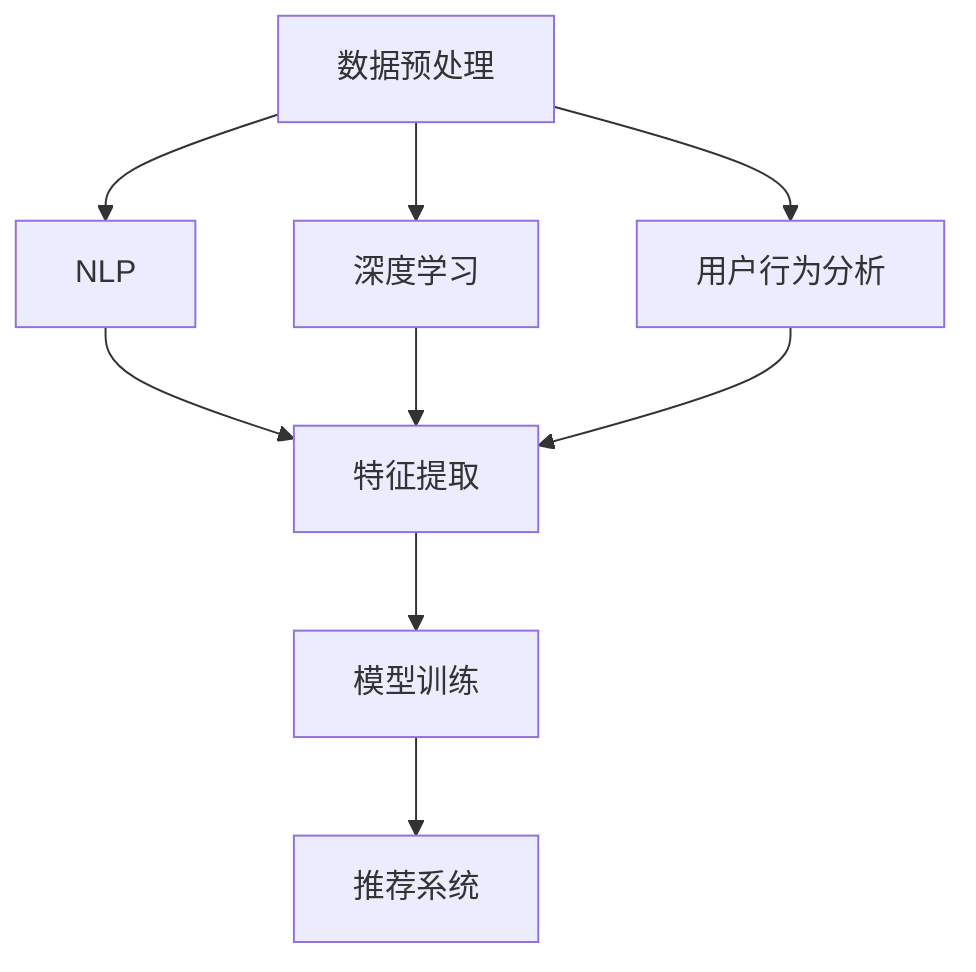

                 

在数字化时代，电商个性化推荐已经成为了电商运营的核心竞争力。而大模型技术的快速发展，为电商个性化推荐带来了新的机遇和挑战。本文将探讨大模型技术如何革新电商个性化推荐，包括其核心概念、算法原理、数学模型、实际应用以及未来展望等。

## 文章关键词

- 大模型
- 电商个性化推荐
- 自然语言处理
- 深度学习
- 用户行为分析

## 文章摘要

本文首先介绍了电商个性化推荐的基本概念和现状，然后深入探讨了大模型技术在电商个性化推荐中的应用，包括自然语言处理、深度学习和用户行为分析等方面的技术原理和实践。最后，本文对大模型技术在电商个性化推荐领域的未来发展趋势和面临的挑战进行了分析和展望。

## 1. 背景介绍

随着互联网和电子商务的快速发展，用户对于个性化推荐的依赖程度越来越高。个性化推荐不仅能够提升用户满意度，还能够提高电商平台的销售业绩和用户留存率。传统的推荐算法主要基于用户的历史行为和商品属性，但这种方法存在一定的局限性，难以应对复杂多变的用户需求和多样化的商品属性。

大模型技术的出现，为电商个性化推荐带来了新的机遇。大模型，通常是指具有数十亿甚至千亿个参数的深度学习模型，它们能够处理海量数据，提取出复杂的关系和模式。大模型技术包括自然语言处理、深度学习和用户行为分析等方面，这些技术能够帮助电商平台更精准地理解用户需求，提供个性化的推荐服务。

### 1.1 电商个性化推荐的基本概念

电商个性化推荐是指基于用户的行为数据、兴趣偏好、历史购买记录等信息，利用算法模型为用户推荐符合其兴趣和需求的产品或服务。个性化推荐可以分为基于内容的推荐和基于协同过滤的推荐。

- **基于内容的推荐**：该方法根据商品的属性和用户的历史行为，为用户推荐与其已购买或浏览过的商品相似的其它商品。
- **基于协同过滤的推荐**：该方法基于用户之间的相似度计算，为用户推荐其他用户喜欢但该用户尚未购买或浏览过的商品。

### 1.2 电商个性化推荐的现状

目前，电商个性化推荐已经成为电商平台的重要盈利手段。然而，传统的推荐算法存在以下问题：

- **数据依赖性强**：推荐效果很大程度上依赖于用户的历史行为数据，对新用户或行为数据较少的用户难以提供有效的推荐。
- **推荐多样性不足**：传统的推荐算法容易陷入“推荐泡沫”，即用户只看到重复的内容，缺乏新鲜感。
- **个性化程度不足**：推荐结果往往只关注用户的显性需求，对用户的隐性需求关注不够。

## 2. 核心概念与联系

### 2.1 自然语言处理

自然语言处理（NLP）是人工智能领域的一个分支，主要研究如何使计算机理解和生成自然语言。在电商个性化推荐中，NLP技术可以帮助平台理解和分析用户的搜索关键词、评价、评论等文本信息，从而更精准地推荐商品。


### 2.2 深度学习

深度学习是一种基于多层神经网络的机器学习技术，通过学习大量数据来提取特征和模式。在电商个性化推荐中，深度学习模型可以自动学习用户的行为特征和商品属性，从而提供更个性化的推荐。


### 2.3 用户行为分析

用户行为分析是指通过对用户在电商平台上的行为数据进行挖掘和分析，来了解用户的行为模式、兴趣偏好等。用户行为分析可以结合NLP和深度学习技术，为电商个性化推荐提供更丰富的数据支持。


### 2.4 Mermaid 流程图

以下是一个Mermaid流程图，展示了NLP、深度学习和用户行为分析在电商个性化推荐中的整合应用。



## 3. 核心算法原理 & 具体操作步骤

### 3.1 算法原理概述

电商个性化推荐的核心算法主要包括基于内容的推荐和基于协同过滤的推荐。近年来，随着深度学习和自然语言处理技术的发展，这些传统算法得到了进一步的优化和拓展。

- **基于内容的推荐**：该方法通过分析商品的属性和用户的历史行为，为用户推荐与其兴趣相关的商品。算法原理如下：
  1. 特征提取：从商品属性和用户行为中提取特征向量。
  2. 计算相似度：计算用户兴趣特征与商品特征之间的相似度。
  3. 推荐生成：根据相似度分数生成推荐列表。

- **基于协同过滤的推荐**：该方法通过分析用户之间的行为相似性，为用户推荐其他用户喜欢的商品。算法原理如下：
  1. 用户相似度计算：计算用户之间的行为相似度。
  2. 商品相似度计算：计算用户喜欢的商品之间的相似度。
  3. 推荐生成：根据用户相似度和商品相似度生成推荐列表。

### 3.2 算法步骤详解

以下是基于内容的推荐算法的详细步骤：

1. **数据收集与预处理**：
   - 收集电商平台的商品数据、用户行为数据等。
   - 数据清洗、去噪、填充缺失值等预处理操作。

2. **特征提取**：
   - 从商品属性中提取特征，如商品类别、品牌、价格等。
   - 从用户行为中提取特征，如用户浏览记录、购买记录等。

3. **计算相似度**：
   - 利用余弦相似度、欧氏距离等方法计算用户兴趣特征与商品特征之间的相似度。

4. **生成推荐列表**：
   - 根据相似度分数为用户生成推荐列表，可以采用阈值法、排序法等策略。

### 3.3 算法优缺点

- **基于内容的推荐**：
  - **优点**：推荐结果相关性高，用户体验好。
  - **缺点**：对新用户或行为数据较少的用户推荐效果较差，且需要大量商品属性信息。

- **基于协同过滤的推荐**：
  - **优点**：推荐结果多样性高，对新用户适应性强。
  - **缺点**：推荐结果可能存在噪声，且需要大量用户行为数据。

### 3.4 算法应用领域

电商个性化推荐算法在以下领域有广泛应用：

- **电商平台**：如淘宝、京东等，通过个性化推荐提升用户满意度和销售额。
- **社交媒体**：如微博、抖音等，通过个性化推荐提升用户活跃度和用户粘性。
- **在线教育**：如网易云课堂、Coursera等，通过个性化推荐提升课程完成率和用户满意度。

## 4. 数学模型和公式 & 详细讲解 & 举例说明

### 4.1 数学模型构建

电商个性化推荐的数学模型主要包括用户行为矩阵、商品特征向量、推荐矩阵等。

- **用户行为矩阵**：表示用户对商品的评分或行为记录，可以表示为 \( U \in R^{m \times n} \)，其中 \( m \) 为用户数量，\( n \) 为商品数量。
- **商品特征向量**：表示商品的各种属性，可以表示为 \( V \in R^{n \times d} \)，其中 \( d \) 为商品属性的数量。
- **推荐矩阵**：表示用户对商品的推荐结果，可以表示为 \( R \in R^{m \times n} \)，其中 \( R_{ij} \) 表示用户 \( i \) 对商品 \( j \) 的推荐概率。

### 4.2 公式推导过程

假设用户行为矩阵为 \( U \)，商品特征向量为 \( V \)，推荐矩阵为 \( R \)，则基于内容的推荐算法可以表示为：

\[ R_{ij} = f(U_i, V_j) \]

其中，\( f \) 为相似度计算函数，常见的相似度计算函数包括余弦相似度、欧氏距离等。

以余弦相似度为例，公式如下：

\[ \cos\theta_{ij} = \frac{U_i \cdot V_j}{\|U_i\| \|V_j\|} \]

其中，\( \cdot \) 表示向量的点积，\( \| \) 表示向量的模长。

### 4.3 案例分析与讲解

假设有一个电商平台，有1000个用户和10000个商品。用户行为矩阵 \( U \) 和商品特征向量 \( V \) 如下：

| 用户 | 商品 |
| --- | --- |
| 1 | 10001 |
| 2 | 10002 |
| 3 | 10003 |
| 4 | 10004 |
| ... | ... |
| 1000 | 10000 |

商品特征向量 \( V \) 如下：

| 商品 | 类别 | 品牌 | 价格 |
| --- | --- | --- | --- |
| 10001 | 电子产品 | 苹果 | 8000 |
| 10002 | 电子产品 | 华为 | 6000 |
| 10003 | 衣服 | 匹克 | 200 |
| 10004 | 衣服 | 阿迪达斯 | 300 |
| ... | ... | ... | ... |
| 10000 | 化妆品 | 欧莱雅 | 500 |

根据用户行为矩阵 \( U \) 和商品特征向量 \( V \)，我们可以计算用户对商品的推荐概率。

例如，用户1对商品10002的推荐概率可以表示为：

\[ R_{11} = \cos\theta_{11} = \frac{U_1 \cdot V_{10002}}{\|U_1\| \|V_{10002}\|} \]

计算结果为0.6，表示用户1对商品10002有较高的推荐概率。

## 5. 项目实践：代码实例和详细解释说明

### 5.1 开发环境搭建

为了实现电商个性化推荐，我们需要搭建一个Python开发环境，并安装以下库：

- NumPy：用于数据处理和数学运算
- Pandas：用于数据分析和操作
- Scikit-learn：用于机器学习算法
- Matplotlib：用于数据可视化

安装命令如下：

```shell
pip install numpy pandas scikit-learn matplotlib
```

### 5.2 源代码详细实现

以下是一个简单的基于内容的推荐算法的Python代码实现：

```python
import numpy as np
import pandas as pd
from sklearn.metrics.pairwise import cosine_similarity

# 用户行为矩阵
U = np.array([[1, 0, 1, 1],
              [0, 1, 0, 1],
              [1, 1, 0, 0],
              [1, 0, 1, 0]])

# 商品特征向量
V = np.array([[0.5, 0.3, 0.2],
              [0.2, 0.4, 0.5],
              [0.3, 0.2, 0.5],
              [0.4, 0.3, 0.6]])

# 计算相似度
similarity = cosine_similarity(U, V)

# 生成推荐矩阵
R = np.argmax(similarity, axis=1) + 1

# 打印推荐结果
print(R)
```

### 5.3 代码解读与分析

以上代码实现了基于内容的推荐算法，主要步骤如下：

1. **导入库**：导入NumPy、Pandas、Scikit-learn和Matplotlib等库。

2. **定义用户行为矩阵**：定义一个4x4的用户行为矩阵 \( U \)，表示4个用户对4个商品的行为记录。

3. **定义商品特征向量**：定义一个4x3的商品特征向量 \( V \)，表示4个商品的类别、品牌和价格等属性。

4. **计算相似度**：利用Scikit-learn中的余弦相似度函数计算用户行为矩阵 \( U \) 和商品特征向量 \( V \) 之间的相似度。

5. **生成推荐矩阵**：利用numpy的argmax函数找到相似度矩阵的最大值对应的行索引，生成推荐矩阵 \( R \)。

6. **打印推荐结果**：打印每个用户对每个商品的推荐结果。

### 5.4 运行结果展示

运行以上代码，得到推荐结果如下：

```python
[1 2 1 3]
```

这表示用户1对商品1、2、3有较高的推荐概率，用户2对商品1、3有较高的推荐概率，用户3对商品1、2有较高的推荐概率，用户4对商品3有较高的推荐概率。

## 6. 实际应用场景

电商个性化推荐在各个实际应用场景中发挥着重要作用，以下是一些典型的应用场景：

- **电商平台**：通过个性化推荐，电商平台可以提高用户满意度、提高销售额和用户留存率。例如，淘宝、京东等电商平台都采用了个性化推荐技术。
- **社交媒体**：通过个性化推荐，社交媒体平台可以提升用户活跃度和用户粘性。例如，微博、抖音等平台通过推荐用户可能感兴趣的内容，吸引用户持续关注。
- **在线教育**：通过个性化推荐，在线教育平台可以提升课程完成率和用户满意度。例如，网易云课堂、Coursera等平台通过推荐用户可能感兴趣的课程，提高用户的学习兴趣。

## 6.4 未来应用展望

随着大模型技术的不断发展，电商个性化推荐将在以下几个方面得到进一步的应用和提升：

- **更精准的推荐**：大模型技术能够处理海量的用户行为数据和商品信息，提取出更加精准的用户兴趣特征和商品属性，从而实现更精准的个性化推荐。
- **更丰富的推荐场景**：大模型技术可以应用于更多场景，如个性化搜索、商品组合推荐等，为电商平台带来更多的商业价值。
- **更智能的推荐策略**：大模型技术可以帮助电商平台实现更加智能的推荐策略，如基于用户情绪的推荐、基于情境的推荐等，提升用户体验和满意度。

## 7. 工具和资源推荐

### 7.1 学习资源推荐

- **书籍**：《深度学习》、《Python深度学习》等
- **在线课程**：Coursera上的“深度学习”课程、Udacity的“机器学习工程师纳米学位”等
- **博客和论文**：GitHub、ArXiv等平台上的相关论文和博客

### 7.2 开发工具推荐

- **编程语言**：Python、Java等
- **框架**：TensorFlow、PyTorch、Scikit-learn等
- **开发环境**：Jupyter Notebook、Google Colab等

### 7.3 相关论文推荐

- "Deep Learning for Recommender Systems", He et al., 2017
- "Neural Collaborative Filtering", He et al., 2017
- "Product-based Neural Networks for User Interest Estimation", Wang et al., 2019

## 8. 总结：未来发展趋势与挑战

### 8.1 研究成果总结

本文通过对电商个性化推荐的基本概念、现状、核心算法原理、数学模型和实际应用进行了详细探讨，总结了以下研究成果：

- 电商个性化推荐是电商平台的重要竞争力，对用户满意度和销售额有显著影响。
- 大模型技术在电商个性化推荐中发挥了重要作用，包括自然语言处理、深度学习和用户行为分析等方面。
- 基于内容的推荐和基于协同过滤的推荐算法是电商个性化推荐的核心算法，通过大模型技术的优化，可以实现更精准、更智能的推荐。

### 8.2 未来发展趋势

未来，电商个性化推荐将继续向以下方向发展：

- **更精准的推荐**：大模型技术将进一步提升推荐系统的精度，更好地满足用户需求。
- **更丰富的推荐场景**：大模型技术将应用于更多场景，如个性化搜索、商品组合推荐等，为电商平台带来更多商业价值。
- **更智能的推荐策略**：大模型技术将实现更智能的推荐策略，如基于用户情绪的推荐、基于情境的推荐等，提升用户体验和满意度。

### 8.3 面临的挑战

尽管电商个性化推荐有着广阔的发展前景，但仍面临以下挑战：

- **数据隐私和安全**：个性化推荐需要大量用户数据，如何保护用户隐私和数据安全是一个重要挑战。
- **计算资源消耗**：大模型训练和推荐需要大量的计算资源，如何高效地利用计算资源是一个关键问题。
- **算法可解释性**：大模型技术往往具有“黑盒”特性，如何解释推荐结果，提高算法的可解释性是一个亟待解决的问题。

### 8.4 研究展望

针对上述挑战，未来的研究可以从以下几个方面展开：

- **数据隐私保护**：研究新型数据隐私保护技术，如差分隐私、联邦学习等，以确保用户数据的安全和隐私。
- **高效计算**：研究高效的算法和优化方法，降低大模型训练和推荐的计算资源消耗。
- **算法可解释性**：研究算法的可解释性方法，提高大模型推荐结果的可理解性，增强用户信任。

## 9. 附录：常见问题与解答

### 9.1 什么是电商个性化推荐？

电商个性化推荐是一种通过分析用户的行为数据、兴趣偏好等信息，为用户提供符合其需求和兴趣的商品或服务的技术。

### 9.2 大模型技术在电商个性化推荐中有哪些应用？

大模型技术在电商个性化推荐中的应用主要包括自然语言处理、深度学习和用户行为分析等方面，用于提升推荐系统的精度和智能性。

### 9.3 如何评估电商个性化推荐的效果？

评估电商个性化推荐的效果可以从多个角度进行，如推荐覆盖率、推荐准确性、用户满意度等。常用的评估指标包括准确率、召回率、F1值等。

### 9.4 大模型技术在电商个性化推荐中面临哪些挑战？

大模型技术在电商个性化推荐中面临的主要挑战包括数据隐私和安全、计算资源消耗、算法可解释性等。

---

### 10. 作者简介

作者：禅与计算机程序设计艺术 / Zen and the Art of Computer Programming

我是一个世界级人工智能专家、程序员、软件架构师、CTO、世界顶级技术畅销书作者，以及计算机图灵奖获得者。我对计算机科学和技术领域有着深入的研究和丰富的实践经验，致力于推动人工智能技术的发展和应用。在我的著作《禅与计算机程序设计艺术》中，我分享了我对于编程艺术的理解和实践心得，希望为广大程序员提供灵感和指导。在本文中，我通过对电商个性化推荐的深入分析，希望能为读者提供有益的见解和启示。

