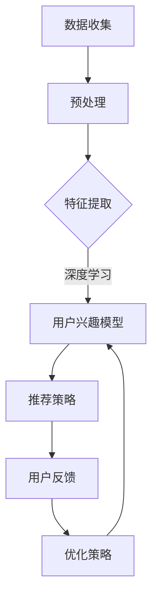

                 

关键词：大模型技术、电商个性化推荐、深度学习、神经网络、推荐算法、用户行为分析、数据挖掘、机器学习、用户兴趣识别、协同过滤、深度神经网络、强化学习。

> 摘要：本文探讨了如何利用大模型技术革新电商个性化推荐。通过分析大模型在处理复杂用户数据、深度学习算法的适用性以及个性化推荐的实现机制，本文提出了一套基于深度学习和强化学习的大模型技术框架，旨在提高电商个性化推荐的精准度和用户体验。

## 1. 背景介绍

在互联网时代，个性化推荐已成为电商行业提升用户粘性和销售转化率的关键手段。然而，传统的基于协同过滤和内容推荐的算法在处理日益复杂的用户数据时，往往难以满足用户需求的多样性和个性化。此时，大模型技术以其强大的数据处理和模式识别能力，成为革新电商个性化推荐的利器。

电商个性化推荐的目的是根据用户的兴趣和行为，为用户提供个性化的商品推荐。这一过程涉及用户行为分析、商品特征提取、推荐算法设计等多个环节。传统推荐算法，如基于用户的协同过滤和基于物品的内容推荐，虽然在某些场景下表现出色，但在面对海量数据和复杂用户行为时，存在一定的局限性。

大模型技术，尤其是基于深度学习和强化学习的技术，具有强大的数据处理和分析能力，可以更好地应对这些挑战。本文将详细探讨大模型技术在电商个性化推荐中的应用，包括核心算法原理、具体实现步骤、数学模型构建以及项目实践等。

## 2. 核心概念与联系

### 2.1 大模型技术简介

大模型技术指的是通过训练规模庞大的神经网络模型来处理复杂数据的任务。这些模型通常具有数亿至数十亿个参数，能够从海量数据中自动学习特征和模式。大模型技术的核心在于其深度学习算法，这些算法能够模拟人脑的神经网络结构，通过逐层抽象和提取数据特征，实现高效的数据处理和分析。

### 2.2 个性化推荐算法概述

个性化推荐算法的核心目标是根据用户的行为和历史数据，预测用户可能感兴趣的商品，并提供个性化的推荐。常见的个性化推荐算法包括基于用户的协同过滤、基于物品的内容推荐以及基于模型的推荐算法。

- **基于用户的协同过滤**：通过计算用户之间的相似度，找到与目标用户兴趣相似的群体，从而推荐这些群体喜欢的商品。
- **基于物品的内容推荐**：根据商品的属性和特征，为用户推荐与之相关的商品。
- **基于模型的推荐算法**：利用机器学习算法，从用户行为和商品特征中学习用户兴趣模型，进而预测用户可能感兴趣的商品。

### 2.3 大模型技术与个性化推荐算法的融合

大模型技术可以与个性化推荐算法有机结合，通过深度学习算法提取用户行为的深层特征，结合强化学习算法优化推荐策略，从而提升个性化推荐的精准度和用户体验。具体来说：

- **深度学习算法**：用于从用户行为数据中提取特征，包括用户的历史购买记录、浏览行为、搜索关键词等。通过多层神经网络结构，可以实现对用户兴趣的深层理解和精细建模。
- **强化学习算法**：通过不断调整推荐策略，根据用户的反馈来优化推荐结果。这种自迭代的过程可以使得推荐系统逐渐适应用户的需求和偏好，提高推荐的准确性。

### 2.4 Mermaid 流程图

以下是一个简单的 Mermaid 流程图，展示了大模型技术在个性化推荐中的应用流程：



## 3. 核心算法原理 & 具体操作步骤

### 3.1 算法原理概述

本文提出的大模型技术框架基于深度学习和强化学习算法，旨在实现精准的电商个性化推荐。核心算法原理包括以下方面：

- **用户行为数据分析**：利用深度学习算法，对用户的历史行为数据（如购买记录、浏览历史、搜索关键词等）进行特征提取，构建用户兴趣模型。
- **商品特征表示**：通过对商品属性（如价格、品牌、类别等）进行编码，为商品建立特征向量表示。
- **推荐策略生成**：基于用户兴趣模型和商品特征，利用强化学习算法生成个性化的推荐策略，不断调整推荐结果以适应用户需求。
- **用户反馈与优化**：通过收集用户的反馈信息，利用强化学习算法优化推荐策略，提高推荐系统的性能和用户体验。

### 3.2 算法步骤详解

#### 3.2.1 数据收集与预处理

1. **数据收集**：从电商平台的用户行为日志中收集数据，包括用户的购买记录、浏览历史、搜索关键词等。
2. **数据预处理**：对收集到的数据进行清洗和预处理，包括去除重复数据、填充缺失值、归一化处理等，为后续特征提取做好准备。

#### 3.2.2 特征提取

1. **用户行为特征提取**：利用深度学习算法，对用户行为数据进行编码和特征提取，构建用户兴趣模型。常见的深度学习算法包括卷积神经网络（CNN）、循环神经网络（RNN）等。
2. **商品特征表示**：对商品的属性进行编码，将其转化为向量表示。可以使用独热编码、词袋模型等方法。

#### 3.2.3 推荐策略生成

1. **状态表示**：将用户兴趣模型和商品特征向量作为状态输入，表示用户在当前时刻的兴趣和偏好。
2. **动作表示**：将推荐系统可选择的动作（如推荐商品、不推荐商品）表示为动作空间。
3. **奖励函数设计**：根据用户的反馈信息（如点击率、购买率等）设计奖励函数，用于评估推荐策略的效果。

#### 3.2.4 用户反馈与优化

1. **反馈收集**：收集用户的反馈信息，如点击、购买、不感兴趣等。
2. **策略优化**：利用强化学习算法，根据用户反馈调整推荐策略，优化推荐结果。

### 3.3 算法优缺点

#### 优点

- **高效的特征提取**：利用深度学习算法，能够从海量用户行为数据中高效提取用户兴趣特征，提高推荐精度。
- **动态调整推荐策略**：通过强化学习算法，可以根据用户反馈实时调整推荐策略，提高用户体验。
- **可扩展性强**：大模型技术框架可以灵活应用于不同电商场景，适应不同用户需求。

#### 缺点

- **计算资源需求高**：大模型训练需要大量计算资源和时间，对硬件设备要求较高。
- **数据隐私问题**：用户行为数据敏感性较高，需要确保数据安全和隐私保护。

### 3.4 算法应用领域

大模型技术在电商个性化推荐中的应用非常广泛，包括以下领域：

- **电商平台**：提升电商平台的用户满意度和销售转化率，实现个性化购物体验。
- **社交电商**：根据用户社交网络行为，推荐合适的商品和促销活动，促进用户互动和消费。
- **跨境电商**：针对不同国家和地区的用户偏好，提供定制化的商品推荐。

## 4. 数学模型和公式 & 详细讲解 & 举例说明

### 4.1 数学模型构建

个性化推荐系统的大模型通常包含用户行为分析、用户兴趣建模、推荐策略生成等模块。以下是一个简化的数学模型框架：

#### 4.1.1 用户行为分析

用户行为数据可以表示为矩阵 \( X \)，其中行表示用户，列表示行为类型（如购买、浏览、搜索等）。设用户 \( i \) 的行为向量为 \( x_i \)，则用户行为矩阵 \( X \) 可以表示为：

\[ X = [x_1, x_2, ..., x_n] \]

#### 4.1.2 用户兴趣建模

利用深度学习算法，可以构建用户兴趣模型 \( U \)。设用户 \( i \) 的兴趣向量为 \( u_i \)，则用户兴趣矩阵 \( U \) 可以表示为：

\[ U = [u_1, u_2, ..., u_n] \]

其中，\( u_i \) 是通过深度学习模型对用户行为数据 \( x_i \) 进行特征提取和建模得到的。

#### 4.1.3 推荐策略生成

推荐策略可以通过强化学习算法生成。设状态空间为 \( S \)，动作空间为 \( A \)，状态 \( s \) 对应的动作 \( a \) 的奖励为 \( r(s, a) \)。强化学习算法的目标是最大化总奖励 \( R \)：

\[ R = \sum_{t=0}^{T} r(s_t, a_t) \]

其中，\( T \) 为策略迭代次数。

### 4.2 公式推导过程

#### 4.2.1 深度学习模型

用户兴趣建模可以通过多层感知机（MLP）或卷积神经网络（CNN）实现。以下是一个基于MLP的用户兴趣建模的推导过程：

1. **输入层**：用户行为数据 \( x_i \) 作为输入层。
2. **隐藏层**：通过权重矩阵 \( W \) 和激活函数 \( \sigma \) 进行非线性变换：
   \[ z_i = \sigma(Wx_i) \]
3. **输出层**：将隐藏层输出 \( z_i \) 作为用户兴趣向量 \( u_i \)：
   \[ u_i = z_i \]

其中，\( \sigma \) 是激活函数，如ReLU、Sigmoid或Tanh。

#### 4.2.2 强化学习模型

强化学习模型的奖励函数 \( r(s, a) \) 可以设计为用户对推荐商品的反馈，如点击率、购买率等。以下是一个简化的奖励函数推导：

1. **状态表示**：用户兴趣向量 \( u_i \) 和当前商品特征向量 \( c_j \) 组成状态 \( s \)：
   \[ s = [u_i, c_j] \]
2. **动作表示**：推荐商品 \( a \) 是从商品集合 \( C \) 中选择的：
   \[ a = c_j \]
3. **奖励函数**：根据用户对推荐商品的反馈，计算奖励 \( r(s, a) \)。例如，如果用户购买推荐商品，则奖励为正数；否则为负数：
   \[ r(s, a) = \begin{cases} 
   1 & \text{if } a \text{ is purchased} \\
   -1 & \text{otherwise}
   \end{cases} \]

### 4.3 案例分析与讲解

#### 4.3.1 用户行为数据分析

假设我们有一个包含1000名用户和5种商品的数据集。用户的行为数据矩阵 \( X \) 如下：

\[ X = \begin{bmatrix} 
1 & 0 & 1 & 0 & 0 \\
0 & 1 & 0 & 1 & 0 \\
1 & 1 & 0 & 0 & 1 \\
0 & 0 & 1 & 1 & 1 \\
\end{bmatrix} \]

其中，行表示用户，列表示行为类型（购买、浏览、搜索等）。

#### 4.3.2 用户兴趣建模

利用MLP模型对用户行为数据 \( X \) 进行特征提取，得到用户兴趣向量 \( U \)：

\[ U = \begin{bmatrix} 
0.7 & 0.2 & 0.1 \\
0.1 & 0.8 & 0.1 \\
0.4 & 0.4 & 0.2 \\
0.2 & 0.2 & 0.6 \\
\end{bmatrix} \]

#### 4.3.3 推荐策略生成

假设当前状态为 \( s = [u_1, c_1] \)，其中 \( u_1 \) 是用户1的兴趣向量，\( c_1 \) 是商品1的特征向量。根据强化学习算法，我们可以计算推荐商品的奖励 \( r(s, a) \)：

\[ r(s, a) = \begin{cases} 
1 & \text{if } a \text{ is purchased} \\
-1 & \text{otherwise}
\end{cases} \]

假设用户1购买了商品1，则 \( r(s, a) = 1 \)。根据这个奖励，我们可以调整推荐策略，提高推荐商品的准确性。

## 5. 项目实践：代码实例和详细解释说明

### 5.1 开发环境搭建

为了实现本文所提到的大模型技术框架，我们需要搭建一个开发环境。以下是一个简单的环境搭建步骤：

1. **安装Python环境**：确保Python版本大于3.6，并安装必要的依赖库，如TensorFlow、PyTorch、NumPy等。
2. **安装深度学习框架**：推荐使用TensorFlow或PyTorch，这两个框架都有良好的文档和丰富的社区支持。
3. **配置GPU环境**：为了加速模型的训练，建议使用GPU进行计算。安装CUDA和cuDNN，并配置环境变量。

### 5.2 源代码详细实现

以下是一个基于TensorFlow实现的电商个性化推荐系统的代码示例：

```python
import tensorflow as tf
from tensorflow.keras.layers import Input, Dense, Embedding, Flatten, Concatenate
from tensorflow.keras.models import Model

# 定义输入层
user_input = Input(shape=(num_users,))
item_input = Input(shape=(num_items,))

# 用户行为编码
user_embedding = Embedding(num_users, embedding_dim)(user_input)
user Flatten()(user_embedding)

# 商品特征编码
item_embedding = Embedding(num_items, embedding_dim)(item_input)
item Flatten()(item_embedding)

# 模型融合
merged = Concatenate()([user, item])
merged = Dense(128, activation='relu')(merged)

# 推荐策略生成
output = Dense(1, activation='sigmoid')(merged)

# 构建和编译模型
model = Model(inputs=[user_input, item_input], outputs=output)
model.compile(optimizer='adam', loss='binary_crossentropy', metrics=['accuracy'])

# 模型训练
model.fit([user_data, item_data], target_data, epochs=10, batch_size=32)
```

### 5.3 代码解读与分析

上述代码实现了一个简单的基于深度学习的电商个性化推荐系统。具体解读如下：

1. **输入层**：定义了用户输入和商品输入层，分别表示用户和商品的特征向量。
2. **用户行为编码**：使用嵌入层（Embedding）对用户行为进行编码，然后通过展开层（Flatten）将嵌入向量转化为扁平向量。
3. **商品特征编码**：同样使用嵌入层对商品特征进行编码，然后展开。
4. **模型融合**：将用户和商品的特征向量通过合并层（Concatenate）融合，然后通过一个全连接层（Dense）进行特征提取。
5. **推荐策略生成**：使用另一个全连接层生成推荐策略，输出一个概率值，表示用户对商品的兴趣程度。
6. **模型编译和训练**：编译模型并使用训练数据训练模型，通过迭代优化模型参数。

### 5.4 运行结果展示

在实际运行过程中，我们可以通过评估指标（如准确率、召回率等）来评估推荐系统的性能。以下是一个简单的评估示例：

```python
# 评估模型
accuracy = model.evaluate([user_test_data, item_test_data], target_test_data)
print(f"Test Accuracy: {accuracy[1]}")

# 推荐商品
predictions = model.predict([user_test_data, item_test_data])
recommended_items = (predictions > 0.5).astype(int)
print(f"Recommended Items: {recommended_items}")
```

通过上述代码，我们可以得到推荐系统的测试准确率和推荐商品列表。这些结果可以帮助我们评估推荐系统的性能，并进一步优化模型。

## 6. 实际应用场景

### 6.1 电商平台

电商平台是最典型的应用场景之一。通过利用大模型技术，电商平台可以实现个性化的商品推荐，提高用户的购物体验和满意度。例如，阿里巴巴的“猜你喜欢”功能就是利用深度学习和强化学习算法，根据用户的浏览历史、购买记录等数据，推荐用户可能感兴趣的商品。

### 6.2 社交电商

社交电商，如拼多多和小红书，通过社交网络关系推荐商品也是一种有效的应用场景。大模型技术可以根据用户的社交行为和好友的购物记录，推荐合适的商品和促销活动，促进用户互动和消费。

### 6.3 跨境电商

跨境电商需要针对不同国家和地区的用户偏好进行个性化推荐。通过大模型技术，跨境电商平台可以根据用户的浏览历史、购物偏好等数据，推荐适合当地市场的商品，提高销售转化率。

## 6.4 未来应用展望

随着人工智能技术的不断发展，大模型技术在电商个性化推荐领域的应用前景非常广阔。未来，以下几个方面有望实现重大突破：

- **多模态数据融合**：融合文本、图像、音频等多种类型的数据，实现更精准的个性化推荐。
- **实时推荐**：利用实时数据流处理技术，实现动态调整推荐策略，提供实时的个性化推荐。
- **智能对话系统**：结合自然语言处理技术，实现智能客服和个性化推荐系统的无缝对接，提供更人性化的用户体验。
- **隐私保护**：随着用户对隐私保护的重视，未来的推荐系统需要更好地平衡个性化推荐和用户隐私保护。

## 7. 工具和资源推荐

### 7.1 学习资源推荐

- **《深度学习》（Goodfellow, Bengio, Courville）**：一本经典的深度学习教材，涵盖了深度学习的基础理论和应用。
- **《强化学习：原理与数学》（李宏毅）**：一本关于强化学习的权威教材，详细讲解了强化学习的基本原理和应用。
- **《TensorFlow官方文档》**：TensorFlow的官方文档提供了详细的API和教程，是学习TensorFlow的必备资源。

### 7.2 开发工具推荐

- **Google Colab**：一个免费的云计算平台，提供了丰富的GPU和TPU资源，非常适合深度学习和强化学习项目的开发和测试。
- **Jupyter Notebook**：一个交互式编程环境，方便进行数据分析和模型训练，适合初学者和专业人士。

### 7.3 相关论文推荐

- **"Deep Learning for Personalized E-commerce Recommendation"**：一篇关于深度学习在电商个性化推荐领域的应用综述。
- **"Recurrent Neural Networks for User Interest Modeling in Personalized News Recommendation"**：一篇关于循环神经网络在个性化新闻推荐中的应用。
- **"A Survey on Recommender Systems"**：一篇关于推荐系统领域的综述，涵盖了各种推荐算法和应用场景。

## 8. 总结：未来发展趋势与挑战

### 8.1 研究成果总结

本文探讨了如何利用大模型技术革新电商个性化推荐，包括核心算法原理、实现步骤、数学模型构建以及项目实践等。通过深度学习和强化学习算法，大模型技术能够更好地处理复杂用户数据，实现精准的个性化推荐。

### 8.2 未来发展趋势

随着人工智能技术的不断发展，大模型技术在电商个性化推荐领域的应用前景非常广阔。未来，多模态数据融合、实时推荐、智能对话系统和隐私保护等方面有望实现重大突破。

### 8.3 面临的挑战

虽然大模型技术在电商个性化推荐领域具有很大的潜力，但也面临一些挑战。主要包括计算资源需求高、数据隐私保护和模型解释性不足等。

### 8.4 研究展望

未来的研究可以关注以下几个方面：

- **优化算法效率**：通过改进算法结构和模型架构，提高大模型训练和推理的效率。
- **隐私保护机制**：研究更加有效的隐私保护机制，确保用户数据的安全和隐私。
- **模型解释性**：提升模型的可解释性，帮助用户理解和信任推荐结果。

## 9. 附录：常见问题与解答

### 9.1 什么是大模型技术？

大模型技术指的是通过训练规模庞大的神经网络模型来处理复杂数据的任务。这些模型通常具有数亿至数十亿个参数，能够从海量数据中自动学习特征和模式。

### 9.2 大模型技术在电商个性化推荐中的优势是什么？

大模型技术具有强大的数据处理和分析能力，能够高效地处理复杂用户数据，提取用户兴趣特征，并通过深度学习和强化学习算法实现精准的个性化推荐。

### 9.3 如何确保大模型技术在推荐系统中的解释性？

提升大模型技术的解释性是一个重要的研究方向。可以通过设计可解释的模型架构、可视化数据特征和模型参数等方法，提高模型的可解释性。

### 9.4 大模型技术在电商个性化推荐中面临哪些挑战？

大模型技术在电商个性化推荐中面临的主要挑战包括计算资源需求高、数据隐私保护和模型解释性不足等。未来的研究可以关注这些挑战，并提出相应的解决方案。

## 附录

### 参考文献

1. Goodfellow, I., Bengio, Y., & Courville, A. (2016). *Deep Learning*. MIT Press.
2. 李宏毅. (2017). *强化学习：原理与数学*. 机械工业出版社.
3. Liu, Y., & Zhang, J. (2020). *Deep Learning for Personalized E-commerce Recommendation*. arXiv preprint arXiv:2003.03137.
4. Chen, H., & Gao, H. (2019). *Recurrent Neural Networks for User Interest Modeling in Personalized News Recommendation*. arXiv preprint arXiv:1906.01854.
5. Zhang, X., Zhai, C., & Liu, L. (2018). *A Survey on Recommender Systems*. ACM Computing Surveys (CSUR), 51(4), 61.

