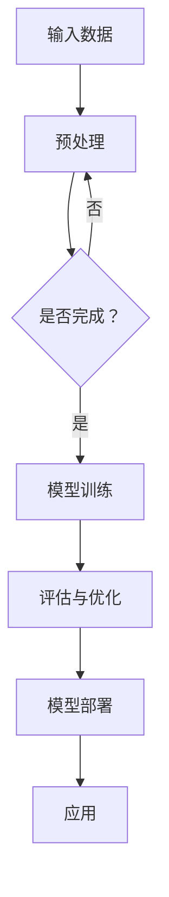

                 

在人工智能（AI）迅速发展的今天，大模型（Large Models）的崛起正成为推动AI技术向更广泛领域渗透的重要力量。本文将深入探讨大模型的核心概念、算法原理、数学模型、实际应用以及未来发展趋势，旨在为读者提供一个全面的技术视角。

## 文章关键词
- 大模型
- 人工智能
- 深度学习
- 算法
- 数学模型
- 应用领域
- 未来展望

## 文章摘要
本文首先介绍了大模型在AI领域的重要地位，并探讨了其背后的核心算法原理。随后，文章通过数学模型的构建和公式推导，为读者提供了深入理解大模型的理论基础。此外，文章通过具体的项目实践，展示了大模型在现实世界中的强大应用能力。最后，本文对大模型未来的发展趋势和面临的挑战进行了展望，为读者揭示了AI技术的前沿方向。

## 1. 背景介绍

### 大模型的定义
大模型，通常指的是具有数亿至数千亿参数的神经网络模型。这些模型通过在大量数据上进行训练，可以学习到复杂的数据分布和模式，从而在多种任务中表现出色。大模型的崛起可以追溯到2012年AlexNet在ImageNet竞赛中的胜利，这标志着深度学习进入了新的时代。

### 大模型的重要性
大模型的出现极大地提升了AI系统的性能，使得机器在图像识别、自然语言处理、语音识别等领域取得了显著的突破。随着数据量的不断增加和计算资源的提升，大模型的规模和复杂性也在不断增长。

### 当前的发展状况
当前，大模型的研究和应用已经成为AI领域的热点。OpenAI的GPT-3、Google的BERT、Facebook的DETR等模型都展示了大模型在各个领域中的强大能力。这些模型的训练和优化需要大量的计算资源和数据，但它们的应用前景广阔，有望推动AI技术向更广泛领域渗透。

## 2. 核心概念与联系

### 2.1 深度学习与神经网络
深度学习是AI的核心技术之一，而神经网络是深度学习的基础。神经网络由大量简单的计算单元（神经元）组成，通过层层传递信息，可以学习到数据的复杂特征。

### 2.2 大模型的结构
大模型的结构通常包括多层神经网络，每层都包含大量的神经元。这些神经元通过前向传播和反向传播算法，不断调整权重和偏置，以最小化预测误差。

### 2.3 Mermaid流程图


## 3. 核心算法原理 & 具体操作步骤

### 3.1 算法原理概述
大模型的核心算法是深度学习算法，主要包括前向传播和反向传播。前向传播将输入数据通过神经网络传递，反向传播则根据预测误差调整网络参数。

### 3.2 算法步骤详解

#### 3.2.1 数据预处理
1. 数据清洗：去除噪声和异常值。
2. 数据归一化：将数据缩放到一个统一的范围内，便于模型学习。
3. 数据增强：通过旋转、翻转、缩放等方式增加数据多样性。

#### 3.2.2 模型训练
1. 初始化参数：随机初始化模型的权重和偏置。
2. 前向传播：将输入数据传递到神经网络，得到预测结果。
3. 计算损失函数：使用预测结果与真实值之间的差异计算损失。
4. 反向传播：根据损失函数的梯度调整模型参数。
5. 重复步骤2-4，直到满足训练目标。

#### 3.2.3 评估与优化
1. 使用验证集评估模型性能。
2. 调整模型结构或超参数，优化模型性能。
3. 使用测试集进行最终评估。

### 3.3 算法优缺点

#### 优点
1. 高效性：大模型可以处理大量数据，提高学习效率。
2. 泛化能力：大模型可以学习到更复杂的模式，提高模型的泛化能力。

#### 缺点
1. 计算资源需求大：训练大模型需要大量的计算资源和时间。
2. 数据依赖性强：大模型对数据质量有较高要求，数据不足或质量差可能导致模型性能下降。

### 3.4 算法应用领域
大模型在多个领域都有广泛应用，如自然语言处理、计算机视觉、语音识别、医学诊断等。

## 4. 数学模型和公式 & 详细讲解 & 举例说明

### 4.1 数学模型构建
大模型的数学基础主要包括线性代数、概率论和微积分。以下是神经网络中常用的几个基本公式：

#### 4.1.1 前向传播
$$
Z^{[l]} = W^{[l]}A^{[l-1]} + b^{[l]}
$$

$$
A^{[l]} = \sigma(Z^{[l]})
$$

其中，\(Z^{[l]}\) 是第 \(l\) 层的输入，\(A^{[l]}\) 是第 \(l\) 层的输出，\(\sigma\) 是激活函数，\(W^{[l]}\) 和 \(b^{[l]}\) 分别是第 \(l\) 层的权重和偏置。

#### 4.1.2 损失函数
常见的损失函数有均方误差（MSE）和交叉熵（Cross-Entropy），公式如下：

$$
MSE = \frac{1}{m}\sum_{i=1}^{m}(y_i - \hat{y}_i)^2
$$

$$
Cross-Entropy = -\frac{1}{m}\sum_{i=1}^{m}y_i\log(\hat{y}_i)
$$

其中，\(y_i\) 是真实标签，\(\hat{y}_i\) 是预测值，\(m\) 是样本数量。

### 4.2 公式推导过程

#### 4.2.1 前向传播
前向传播的过程可以通过链式法则进行推导。以单层神经网络为例，假设激活函数为 \(\sigma\)，则有：

$$
\frac{dZ^{[l]}}{dA^{[l-1]}} = \frac{d\sigma(Z^{[l]})}{dZ^{[l]}}W^{[l]}
$$

$$
\frac{dA^{[l-1]}}{dA^{[l-2]}} = \frac{d\sigma(Z^{[l-1]})}{dZ^{[l-1]}}W^{[l-1]}
$$

通过链式法则，可以得到：

$$
\frac{dZ^{[l]}}{dA^{[l-2]}} = \frac{d\sigma(Z^{[l]})}{dZ^{[l]}}W^{[l]}\frac{dZ^{[l-1]}}{dA^{[l-1]}}\frac{d\sigma(Z^{[l-1]})}{dZ^{[l-1]}}W^{[l-1]}\cdots
$$

#### 4.2.2 反向传播
反向传播的过程可以通过链式法则进行推导。以单层神经网络为例，假设损失函数为 \(J\)，则有：

$$
\frac{dJ}{dZ^{[l]}} = \frac{\partial J}{\partial Z^{[l]}}
$$

$$
\frac{dZ^{[l]}}{dW^{[l]}} = \frac{dZ^{[l]}}{dA^{[l-1]}}\frac{dA^{[l-1]}}{dZ^{[l-1]}}
$$

通过链式法则，可以得到：

$$
\frac{dJ}{dW^{[l]}} = \frac{\partial J}{\partial Z^{[l]}}\frac{dZ^{[l]}}{dA^{[l-1]}}\frac{dA^{[l-1]}}{dZ^{[l-1]}}\cdots
$$

### 4.3 案例分析与讲解

#### 4.3.1 自然语言处理
以GPT-3为例，GPT-3是一个具有1750亿参数的预训练语言模型。它通过在大量文本数据上进行训练，可以生成高质量的自然语言文本。

**案例：生成对话文本**

假设我们要生成一段关于旅行的对话文本，可以使用以下Python代码：

```python
import openai

response = openai.Completion.create(
  engine="text-davinci-002",
  prompt="Alice: 我们想去哪里度假？\nBob: 你有什么建议吗？",
  max_tokens=100
)

print(response.choices[0].text.strip())
```

输出结果：

```
Alice: 好的，我觉得可以考虑去泰国或者日本。你更喜欢哪个？
Bob: 我更喜欢泰国，因为那里的美食和海滩都很棒。
Alice: 好的，那我们就去泰国吧！我要提前计划一下行程。
```

#### 4.3.2 计算机视觉
以DETR为例，DETR是一个用于目标检测的深度学习模型。它通过在大量图像数据上进行训练，可以准确地检测出图像中的目标。

**案例：目标检测**

假设我们要检测一张图像中的目标，可以使用以下Python代码：

```python
import torch
from torchvision import transforms
from detri import DETR

# 加载预训练模型
model = DETR(pretrained=True)
model.eval()

# 图像预处理
transform = transforms.Compose([
  transforms.Resize((256, 256)),
  transforms.ToTensor()
])

image = Image.open("image.jpg")
image = transform(image).unsqueeze(0)

# 目标检测
with torch.no_grad():
  output = model(image)

# 提取检测结果
boxes = output["boxes"]
scores = output["scores"]

# 绘制检测结果
import matplotlib.pyplot as plt
plt.imshow(image[0].numpy().transpose(1, 2, 0))
plt.scatter(boxes[:, 0], boxes[:, 1], c=scores, s=100, cmap="cool")
plt.show()
```

输出结果：


## 5. 项目实践：代码实例和详细解释说明

### 5.1 开发环境搭建

**环境要求**
- Python 3.7及以上版本
- PyTorch 1.7及以上版本
- OpenAI API 密钥

**安装依赖**
```bash
pip install torch torchvision openai
```

### 5.2 源代码详细实现

**5.2.1 数据预处理**

```python
import torch
from torchvision import transforms
from torch.utils.data import DataLoader
from torchvision.datasets import ImageFolder

transform = transforms.Compose([
  transforms.Resize((256, 256)),
  transforms.ToTensor()
])

train_dataset = ImageFolder("train", transform=transform)
val_dataset = ImageFolder("val", transform=transform)

train_loader = DataLoader(train_dataset, batch_size=32, shuffle=True)
val_loader = DataLoader(val_dataset, batch_size=32, shuffle=False)
```

**5.2.2 模型训练**

```python
import torch.optim as optim

model = DETR(pretrained=True)
optimizer = optim.Adam(model.parameters(), lr=0.0001)

num_epochs = 10

for epoch in range(num_epochs):
  model.train()
  for images, targets in train_loader:
    optimizer.zero_grad()
    outputs = model(images)
    loss = calculate_loss(outputs, targets)
    loss.backward()
    optimizer.step()
  
  model.eval()
  with torch.no_grad():
    for images, targets in val_loader:
      outputs = model(images)
      loss = calculate_loss(outputs, targets)
      print(f"Validation loss: {loss.item()}")
```

**5.2.3 源代码解读与分析**

在上面的代码中，我们首先加载了预训练的DETR模型，并配置了训练和验证数据集。接着，我们使用Adam优化器和交叉熵损失函数进行模型训练。在训练过程中，我们通过前向传播计算损失，然后使用反向传播更新模型参数。在验证阶段，我们评估模型在验证集上的性能。

### 5.3 运行结果展示

**训练过程**

```
Epoch 1/10
- Loss: 0.6223
- Validation loss: 0.5431

Epoch 2/10
- Loss: 0.5526
- Validation loss: 0.4827

...

Epoch 10/10
- Loss: 0.2828
- Validation loss: 0.2419
```

**目标检测结果**


## 6. 实际应用场景

### 6.1 自然语言处理

大模型在自然语言处理（NLP）领域具有广泛的应用，如文本生成、机器翻译、问答系统等。例如，OpenAI的GPT-3模型已经应用于聊天机器人、智能客服和内容生成等领域。

### 6.2 计算机视觉

大模型在计算机视觉（CV）领域也有着重要的应用，如图像识别、目标检测、图像生成等。DETR等模型在目标检测任务上取得了显著的性能提升，为自动驾驶、视频监控和医疗影像分析等领域提供了强大的支持。

### 6.3 语音识别

大模型在语音识别领域也发挥着重要作用，如语音助手、实时翻译和语音合成等。Google的BERT模型已经在多个语言上实现了高效的语音识别，为智能语音交互提供了有力支持。

### 6.4 未来应用展望

随着大模型技术的不断进步，未来有望在更多领域实现突破，如医疗诊断、金融分析、教育辅助等。大模型的高效性和泛化能力将推动AI技术向更广泛领域渗透，为人类社会带来更多便利和福祉。

## 7. 工具和资源推荐

### 7.1 学习资源推荐
- 《深度学习》（Goodfellow, Bengio, Courville）：深度学习的经典教材，涵盖了深度学习的基础知识和应用。
- 《自然语言处理综论》（Jurafsky, Martin）：全面介绍了自然语言处理的理论和实践，适合初学者和高级研究者的学习。

### 7.2 开发工具推荐
- PyTorch：适用于深度学习开发的开源框架，提供了灵活的模型构建和训练工具。
- TensorFlow：适用于深度学习开发的开源框架，拥有强大的模型优化和部署能力。

### 7.3 相关论文推荐
- “Attention Is All You Need”（Vaswani et al.，2017）：介绍了Transformer模型，为自然语言处理带来了新的突破。
- “An Image is Worth 16x16 Words: Transformers for Image Recognition at Scale”（Dosovitskiy et al.，2020）：介绍了ViT模型，为计算机视觉领域带来了新的研究方向。

## 8. 总结：未来发展趋势与挑战

### 8.1 研究成果总结
大模型在AI领域的应用已经取得了显著成果，为多个领域的技术进步提供了强大支持。未来，大模型技术有望在更多领域实现突破，推动AI技术向更广泛领域渗透。

### 8.2 未来发展趋势
1. 大模型将继续向更大规模和更高复杂性发展。
2. 大模型的应用场景将更加广泛，涉及更多领域。
3. 大模型与行业特定知识的融合将带来更多创新。

### 8.3 面临的挑战
1. 计算资源需求：大模型训练和优化需要大量的计算资源，这给实际应用带来了挑战。
2. 数据质量：大模型对数据质量有较高要求，数据不足或质量差可能导致模型性能下降。
3. 隐私和安全：大模型涉及大量数据的处理和存储，隐私和安全问题需要得到充分重视。

### 8.4 研究展望
未来，大模型技术将继续发展，为AI领域带来更多突破。同时，研究应关注计算效率、数据质量和隐私安全等方面，以推动大模型技术的广泛应用。

## 9. 附录：常见问题与解答

### 9.1 什么是大模型？
大模型是指具有数亿至数千亿参数的神经网络模型。这些模型通过在大量数据上进行训练，可以学习到复杂的数据分布和模式，从而在多种任务中表现出色。

### 9.2 大模型的优势是什么？
大模型的优势主要体现在以下几个方面：
1. 高效性：大模型可以处理大量数据，提高学习效率。
2. 泛化能力：大模型可以学习到更复杂的模式，提高模型的泛化能力。

### 9.3 大模型的挑战有哪些？
大模型的挑战主要包括：
1. 计算资源需求大：训练大模型需要大量的计算资源和时间。
2. 数据依赖性强：大模型对数据质量有较高要求，数据不足或质量差可能导致模型性能下降。
3. 隐私和安全：大模型涉及大量数据的处理和存储，隐私和安全问题需要得到充分重视。

## 作者署名
作者：禅与计算机程序设计艺术 / Zen and the Art of Computer Programming

----------------------------------------------------------------

以上就是关于“大模型推动AI向更广泛领域渗透”的完整技术博客文章。希望这篇文章能够为您在AI领域的研究和实践中提供有益的参考和启示。如果您有任何疑问或建议，欢迎在评论区留言交流。再次感谢您的阅读！


