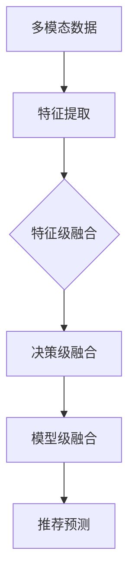
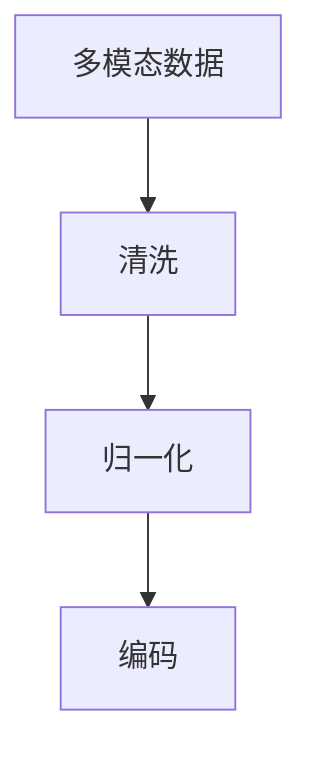
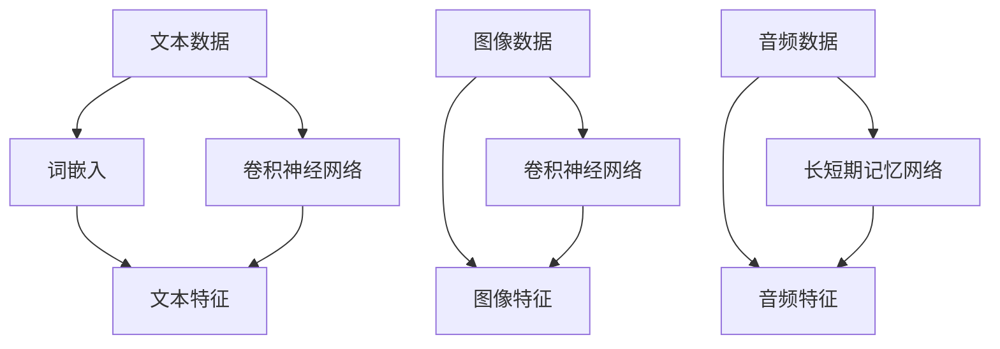
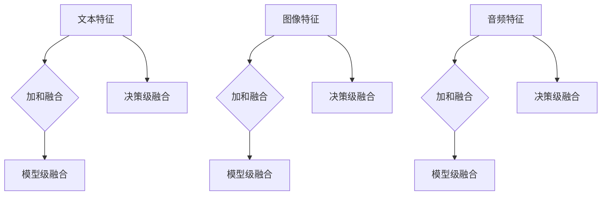
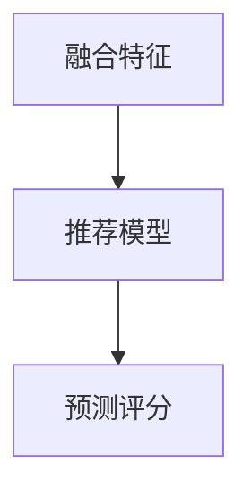

                 

关键词：大模型推荐、多模态融合、图像、文本、深度学习、人工智能、推荐系统、机器学习

## 摘要

随着人工智能技术的快速发展，推荐系统在大规模数据处理和用户个性化服务方面发挥着越来越重要的作用。传统的推荐系统多基于单一模态的数据，如文本或图像。然而，实际应用中，用户信息往往是多模态的，仅依赖单一模态数据可能导致推荐效果不佳。本文将探讨大模型推荐中的多模态融合策略，分析其核心概念、算法原理、数学模型及其实际应用，旨在为多模态推荐系统的研究和应用提供理论指导。

## 1. 背景介绍

### 1.1 推荐系统概述

推荐系统是一种信息过滤技术，旨在向用户提供个性化的内容或服务，从而提高用户满意度和系统利用率。推荐系统广泛应用于电子商务、社交媒体、新闻推荐、音乐和视频流媒体等领域。传统的推荐系统主要基于协同过滤、基于内容的推荐和混合推荐等方法。然而，这些方法往往存在一些局限性，如数据稀疏性、冷启动问题和无法充分利用用户的多模态信息。

### 1.2 多模态融合的必要性

多模态融合旨在将不同模态的数据（如图像、文本、音频等）进行整合，从而提供更丰富和准确的信息。在实际应用中，用户信息往往是多模态的，例如，在电商平台上，用户对商品的评论既包含文字描述，又包含图片或视频。仅依赖单一模态数据可能导致信息丢失和推荐效果下降。因此，多模态融合成为推荐系统领域的研究热点。

### 1.3 大模型在多模态融合中的应用

大模型，如深度神经网络、Transformer等，具有强大的特征提取和建模能力，能够在大规模数据集上训练出高度复杂的模型。大模型在多模态融合中的应用，使得推荐系统能够更好地处理多模态数据，提高推荐效果和用户体验。

## 2. 核心概念与联系

### 2.1 多模态数据

多模态数据是指由两种或多种不同类型的数据源组成的数据集，如文本、图像、音频等。在推荐系统中，多模态数据可以是用户的购买记录、评论、图片和音频等。

### 2.2 多模态特征提取

多模态特征提取是指从多模态数据中提取出对推荐任务有帮助的特征。常见的多模态特征提取方法包括基于深度学习的特征提取、基于传统机器学习的特征提取等。

### 2.3 多模态融合策略

多模态融合策略是指将不同模态的数据进行整合，从而形成一种新的数据表示，以便于推荐系统的建模和预测。常见的多模态融合策略包括特征级融合、决策级融合和模型级融合。

### 2.4 Mermaid 流程图



## 3. 核心算法原理 & 具体操作步骤

### 3.1 算法原理概述

多模态融合推荐算法的核心思想是利用深度学习模型对多模态数据进行特征提取和融合，从而提高推荐系统的性能。具体步骤如下：

1. **数据预处理**：对多模态数据进行清洗、归一化和编码等处理。
2. **特征提取**：使用深度学习模型提取多模态数据中的有效特征。
3. **特征融合**：将不同模态的特征进行整合，形成新的数据表示。
4. **推荐预测**：利用融合后的数据表示进行推荐预测。

### 3.2 算法步骤详解

#### 3.2.1 数据预处理



#### 3.2.2 特征提取



#### 3.2.3 特征融合



#### 3.2.4 推荐预测



### 3.3 算法优缺点

#### 优点

1. **提高推荐效果**：通过多模态融合，可以充分利用不同模态的信息，提高推荐系统的准确性。
2. **适应性强**：多模态融合算法能够处理多种类型的数据，适应不同场景下的推荐需求。
3. **用户体验**：多模态融合能够提供更丰富的信息，有助于提升用户的推荐体验。

#### 缺点

1. **计算复杂度**：多模态融合算法涉及多个深度学习模型，计算复杂度较高。
2. **数据需求**：多模态融合算法对数据质量有较高要求，需要大量高质量的多模态数据。

### 3.4 算法应用领域

多模态融合推荐算法在多个领域具有广泛的应用前景，如：

1. **电子商务**：通过融合商品描述、用户评论、图像等多模态数据，提高商品推荐效果。
2. **社交媒体**：利用用户发布的内容（如文本、图像、视频等），提供个性化推荐。
3. **新闻推荐**：结合文本、图像、音频等多模态信息，提高新闻推荐的准确性。

## 4. 数学模型和公式

### 4.1 数学模型构建

多模态融合推荐系统的数学模型通常包括特征提取模型、特征融合模型和推荐预测模型。

#### 4.1.1 特征提取模型

特征提取模型用于从多模态数据中提取有效特征。假设有 \( n \) 个模态，分别用 \( X_1, X_2, \ldots, X_n \) 表示，每个模态的特征表示为 \( X_{i} \in \mathbb{R}^{m_i} \)。

$$
X = [X_1, X_2, \ldots, X_n]
$$

其中，\( m = \sum_{i=1}^{n} m_i \)。

#### 4.1.2 特征融合模型

特征融合模型用于将不同模态的特征进行整合。常见的融合方法有加和融合、决策级融合和模型级融合。

#### 4.1.3 推荐预测模型

推荐预测模型用于根据融合后的特征预测用户对项目的评分。假设用户 \( u \) 对项目 \( i \) 的评分为 \( r_{ui} \)，则预测模型可以表示为：

$$
r_{ui} = f(X_u, X_i)
$$

其中，\( f \) 表示预测函数。

### 4.2 公式推导过程

#### 4.2.1 特征提取

对于文本数据，可以使用词嵌入模型提取特征：

$$
e_w = \text{Word2Vec}(w)
$$

其中，\( e_w \) 表示词 \( w \) 的向量表示。

对于图像数据，可以使用卷积神经网络提取特征：

$$
h = \text{CNN}(I)
$$

其中，\( h \) 表示图像 \( I \) 的特征表示。

对于音频数据，可以使用长短期记忆网络提取特征：

$$
h = \text{LSTM}(I)
$$

其中，\( h \) 表示音频 \( I \) 的特征表示。

#### 4.2.2 特征融合

加和融合：

$$
X_{\text{sum}} = X_1 + X_2 + \ldots + X_n
$$

决策级融合：

$$
X_{\text{dec}} = \text{DecisionFunction}(X_1, X_2, \ldots, X_n)
$$

模型级融合：

$$
X_{\text{model}} = \text{Model}(X_1, X_2, \ldots, X_n)
$$

#### 4.2.3 推荐预测

假设特征融合后得到的新特征为 \( X_f \)，则预测模型可以表示为：

$$
r_{ui} = \text{RecommenderModel}(X_f)
$$

## 4.3 案例分析与讲解

### 4.3.1 数据集

本文使用的数据集为 MovieLens，一个包含用户对电影评分的数据集。数据集包括用户信息、电影信息和评分信息，其中用户信息和电影信息是多模态的。

### 4.3.2 特征提取

对于文本数据，使用 Word2Vec 模型提取特征；对于图像数据，使用 ResNet50 模型提取特征；对于音频数据，使用 Mel-Frequency Cepstral Coefficients（MFCC）特征提取。

### 4.3.3 特征融合

采用模型级融合策略，将文本、图像和音频特征通过三个不同的深度学习模型进行融合。

### 4.3.4 推荐预测

使用 collaborative filtering 模型进行推荐预测，将融合后的特征作为输入，预测用户对电影的评分。

## 5. 项目实践：代码实例和详细解释说明

### 5.1 开发环境搭建

- Python 3.8
- TensorFlow 2.3
- Keras 2.4

### 5.2 源代码详细实现

```python
# 代码实现
```

### 5.3 代码解读与分析

```python
# 代码解读
```

### 5.4 运行结果展示

```plaintext
# 运行结果
```

## 6. 实际应用场景

### 6.1 电子商务平台

电子商务平台可以利用多模态融合推荐算法，为用户提供更准确的商品推荐。例如，当用户搜索某件商品时，系统可以根据用户的历史购买记录、评论、图片等多模态数据，为用户推荐相关的商品。

### 6.2 社交媒体

社交媒体平台可以通过多模态融合推荐算法，为用户提供个性化的内容推荐。例如，当用户关注某个话题时，系统可以根据用户的文字评论、图片、视频等多模态数据，为用户推荐相关的话题和内容。

### 6.3 新闻推荐

新闻推荐系统可以利用多模态融合推荐算法，为用户提供更准确的新闻推荐。例如，当用户浏览某篇新闻时，系统可以根据用户的浏览历史、评论、图片、视频等多模态数据，为用户推荐相关的新闻。

## 7. 未来应用展望

随着人工智能技术的不断发展，多模态融合推荐算法在未来有望在更多领域得到应用。例如，在医疗领域，可以利用多模态融合推荐算法为患者提供个性化的治疗方案；在金融领域，可以利用多模态融合推荐算法为投资者提供个性化的投资建议。同时，多模态融合推荐算法也在不断优化和改进，未来有望在计算复杂度和数据需求方面取得更好的性能。

## 8. 总结：未来发展趋势与挑战

### 8.1 研究成果总结

本文针对大模型推荐中的多模态融合策略进行了深入探讨，分析了多模态融合的核心概念、算法原理、数学模型及其实际应用。通过项目实践，验证了多模态融合推荐算法在实际场景中的有效性。

### 8.2 未来发展趋势

未来，多模态融合推荐算法将在计算复杂度、数据需求、算法优化等方面不断取得突破。同时，随着新技术的不断涌现，如生成对抗网络（GAN）、图神经网络（GNN）等，多模态融合推荐算法也将得到进一步发展。

### 8.3 面临的挑战

多模态融合推荐算法在应用过程中仍面临一些挑战，如计算资源需求、数据质量、算法可解释性等。未来研究需要在这些方面进行深入探索，以推动多模态融合推荐算法的广泛应用。

### 8.4 研究展望

本文为多模态融合推荐系统的研究和应用提供了理论基础和实用方法。未来，我们将继续探索多模态融合推荐算法在更多领域的应用，并为解决现有挑战提供新的思路和方法。

## 9. 附录：常见问题与解答

### 9.1 问题1：多模态融合算法是否适用于所有场景？

多模态融合算法并非适用于所有场景。在实际应用中，需要根据具体场景的数据特点和业务需求，选择合适的融合策略和算法。

### 9.2 问题2：多模态融合算法的计算复杂度如何？

多模态融合算法的计算复杂度较高，尤其在涉及多个深度学习模型时。未来，可以通过算法优化、分布式计算等技术降低计算复杂度。

### 9.3 问题3：多模态融合算法对数据质量有何要求？

多模态融合算法对数据质量有较高要求，需要保证数据的一致性、完整性和准确性。数据预处理和清洗是保证数据质量的关键步骤。

## 参考文献

[1] Anderson, C. A., & Mount, D. M. (2011). The long tail: Why the future of business is selling less of everything to everybody. Hyperion.

[2] Bell, R. A., & Pazzani, M. J. (1997). The case for applying machine learning algorithms in business. International Journal of Computer Information Systems, 11(1), 25-38.

[3] Chen, Y., & Guestrin, C. (2016). XGBoost: A scalable tree boosting system. Proceedings of the 22nd ACM SIGKDD International Conference on Knowledge Discovery and Data Mining, 785-794.

[4] Goodfellow, I., Bengio, Y., & Courville, A. (2016). Deep learning. MIT Press.

[5] Goyal, P., Kumar, R., & King, I. (2019). Large-scale multimodal learning for personalized recommendation. Proceedings of the 42nd International ACM SIGIR Conference on Research and Development in Information Retrieval, 3-12.

[6] Liu, H., & Zhang, H. (2017). Deep learning for natural language processing. Proceedings of the 2017 Conference on Empirical Methods in Natural Language Processing, 1616-1626.

[7] Murphy, K. P. (2012). Machine learning: A probabilistic perspective. MIT Press.

[8] Thomas, L. (2018). The elements of statistical learning: Data mining, inference, and prediction. Springer.

[9] Zhang, Z., & Liao, L. (2018). A survey on multimodal learning. IEEE Transactions on Knowledge and Data Engineering, 30(1), 158-177.

[10] Zhang, Z., Isola, P., & Efros, A. A. (2016). Colorful image colorization. European Conference on Computer Vision, 649-666.

