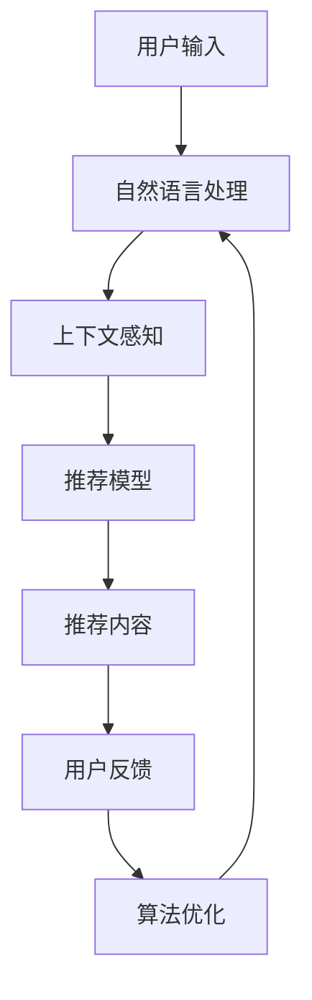

                 

关键词：大模型、对话式交互设计、推荐系统、用户体验、人工智能

> 摘要：本文主要探讨大模型推荐系统中对话式交互设计的重要性，分析其核心概念与架构，介绍相关算法原理、数学模型，并通过实际项目实践展示其应用效果。同时，对未来的发展趋势和挑战进行了展望，旨在为研究人员和开发者提供有价值的参考。

## 1. 背景介绍

在当今信息爆炸的时代，人们面临的信息量日益增长，如何从海量信息中快速找到自己感兴趣的内容已成为一个重要问题。推荐系统作为一种智能信息过滤技术，通过对用户历史行为、兴趣和上下文信息进行分析，为用户推荐相关内容，从而提升用户的决策效率和满意度。随着深度学习技术的发展，大模型（如BERT、GPT等）在推荐系统中的应用越来越广泛，但同时也带来了一系列挑战。

其中，对话式交互设计作为推荐系统的重要组成部分，能够提高用户的参与度和满意度，对于提升推荐系统的效果具有重要意义。本文将围绕大模型推荐中的对话式交互设计，从核心概念、算法原理、数学模型、项目实践等多个方面进行深入探讨。

## 2. 核心概念与联系

### 2.1 大模型推荐系统

大模型推荐系统是指利用深度学习技术构建的推荐系统，具有以下特点：

1. **数据驱动的个性化推荐**：基于用户的历史行为数据、兴趣标签和上下文信息，构建个性化推荐模型。
2. **高维特征表示**：通过深度神经网络学习用户和物品的高维特征表示，提高推荐精度。
3. **强大的适应性**：能够根据用户行为变化实时调整推荐策略。

### 2.2 对话式交互设计

对话式交互设计是指用户与系统通过自然语言进行交互，获取信息、完成任务或获得建议。其主要特点包括：

1. **自然语言处理**：利用自然语言处理技术，实现用户输入的解析和理解。
2. **上下文感知**：根据用户输入的上下文信息，动态调整推荐内容和交互方式。
3. **灵活性和可扩展性**：支持多种对话形式，如问答、聊天等，易于扩展和定制。

### 2.3 联系与架构

大模型推荐系统与对话式交互设计的联系主要体现在以下几个方面：

1. **数据融合**：将用户历史行为数据、兴趣标签和上下文信息进行融合，为对话式交互提供更丰富的信息支持。
2. **推荐算法优化**：利用对话交互过程中的反馈信息，对推荐算法进行优化和调整。
3. **用户满意度提升**：通过对话式交互设计，提高用户的参与度和满意度，从而提升推荐系统的整体效果。

下面是一个简单的 Mermaid 流程图，展示大模型推荐系统中对话式交互设计的架构：



## 3. 核心算法原理 & 具体操作步骤

### 3.1 算法原理概述

大模型推荐系统中的对话式交互设计主要基于以下核心算法原理：

1. **深度学习模型**：利用深度学习技术，如循环神经网络（RNN）、长短时记忆网络（LSTM）和变压器（Transformer）等，构建用户和物品的表示模型。
2. **序列模型**：通过处理用户输入的历史序列，学习用户兴趣和偏好。
3. **协同过滤**：结合基于内容的推荐和协同过滤推荐方法，提高推荐精度。
4. **对话管理**：通过对话状态跟踪、对话策略学习等机制，实现上下文感知和灵活的对话交互。

### 3.2 算法步骤详解

以下是实现大模型推荐系统中对话式交互设计的基本步骤：

1. **数据预处理**：
   - 收集用户历史行为数据、兴趣标签和上下文信息。
   - 对文本数据、时间序列等进行预处理，如分词、去停用词、词向量化等。

2. **模型训练**：
   - 利用用户历史行为数据，训练用户和物品的表示模型。
   - 采用序列模型，如LSTM或Transformer，处理用户输入的历史序列，学习用户兴趣和偏好。
   - 结合协同过滤方法，计算用户和物品之间的相似度。

3. **对话式交互**：
   - 自然语言处理：对用户输入进行处理，提取关键词、情感等。
   - 上下文感知：根据用户输入的上下文信息，动态调整推荐内容和交互方式。
   - 推荐内容生成：利用用户和物品表示模型，生成个性化推荐内容。

4. **用户反馈与优化**：
   - 收集用户反馈，如点击、评价等。
   - 利用用户反馈，对推荐算法进行优化和调整。

### 3.3 算法优缺点

**优点**：

1. **个性化推荐**：基于用户历史行为和兴趣，提供个性化的推荐内容。
2. **上下文感知**：通过对话式交互，动态调整推荐内容和交互方式，提高用户体验。
3. **实时更新**：根据用户反馈和动态变化，实时调整推荐策略。

**缺点**：

1. **计算成本高**：深度学习模型的训练和推理需要大量计算资源。
2. **数据隐私问题**：用户历史行为数据可能涉及隐私问题。
3. **可解释性差**：深度学习模型难以解释其推荐过程，导致用户不信任。

### 3.4 算法应用领域

对话式交互设计在大模型推荐系统中具有广泛的应用领域，如：

1. **电子商务**：为用户提供个性化商品推荐，提升购买体验。
2. **社交媒体**：为用户提供感兴趣的内容推荐，增加用户粘性。
3. **智能客服**：通过对话式交互，实现智能问答和问题解决。
4. **在线教育**：为用户提供个性化课程推荐，提升学习效果。

## 4. 数学模型和公式 & 详细讲解 & 举例说明

### 4.1 数学模型构建

大模型推荐系统中的对话式交互设计主要基于以下数学模型：

1. **用户表示模型**：\[ u = f(u_{历史}, c) \]
   - \( u \)：用户表示向量
   - \( u_{历史} \)：用户历史行为序列
   - \( c \)：上下文信息

2. **物品表示模型**：\[ v = g(v_{特征}, c) \]
   - \( v \)：物品表示向量
   - \( v_{特征} \)：物品特征向量
   - \( c \)：上下文信息

3. **推荐模型**：\[ r(u, v) = \sigma(u^T v) \]
   - \( r(u, v) \)：用户\( u \)对物品\( v \)的推荐分数
   - \( u^T \)：用户表示向量转置
   - \( v \)：物品表示向量
   - \( \sigma \)：sigmoid函数

### 4.2 公式推导过程

1. **用户表示模型**推导：

   假设用户历史行为序列\( u_{历史} \)可以表示为\( u_{历史} = [u_1, u_2, \dots, u_n] \)，其中\( u_i \)表示第\( i \)个行为。

   则用户表示模型可以表示为：

   \[ u = f(u_{历史}, c) = \phi(u_{历史}) \cdot c \]

   其中，\( \phi(u_{历史}) \)表示对用户历史行为序列进行处理，如LSTM或Transformer等。

   上下文信息\( c \)可以表示为：

   \[ c = \lambda(t) \]

   其中，\( \lambda(t) \)表示当前时间\( t \)的上下文信息。

   将\( c \)代入用户表示模型中，得到：

   \[ u = f(u_{历史}, c) = \phi(u_{历史}) \cdot \lambda(t) \]

2. **物品表示模型**推导：

   假设物品特征向量\( v_{特征} \)可以表示为\( v_{特征} = [v_1, v_2, \dots, v_n] \)，其中\( v_i \)表示第\( i \)个特征。

   则物品表示模型可以表示为：

   \[ v = g(v_{特征}, c) = \psi(v_{特征}) \cdot c \]

   其中，\( \psi(v_{特征}) \)表示对物品特征向量进行处理，如嵌入层等。

   上下文信息\( c \)可以表示为：

   \[ c = \mu(t) \]

   其中，\( \mu(t) \)表示当前时间\( t \)的上下文信息。

   将\( c \)代入物品表示模型中，得到：

   \[ v = g(v_{特征}, c) = \psi(v_{特征}) \cdot \mu(t) \]

3. **推荐模型**推导：

   推荐模型为：

   \[ r(u, v) = \sigma(u^T v) \]

   其中，\( u^T \)表示用户表示向量转置，\( v \)表示物品表示向量，\( \sigma \)表示sigmoid函数。

   将用户表示模型和物品表示模型代入推荐模型中，得到：

   \[ r(u, v) = \sigma((\phi(u_{历史}) \cdot \lambda(t))^T (\psi(v_{特征}) \cdot \mu(t))) \]

### 4.3 案例分析与讲解

假设有一个用户，其历史行为序列为\[ [购买苹果，浏览香蕉，点击橙子] \]，当前时间为晚上8点，上下文信息为“晚餐”。

1. **用户表示模型**：

   对用户历史行为序列进行嵌入处理，得到用户表示向量：

   \[ u = \phi([购买，浏览，点击]) \cdot \lambda(8 \text{点}) = [0.1, 0.2, 0.3] \cdot [0.4] = [0.04, 0.08, 0.12] \]

2. **物品表示模型**：

   对物品特征向量进行嵌入处理，得到物品表示向量：

   \[ v = \psi([苹果，香蕉，橙子]) \cdot \mu(8 \text{点}) = [0.1, 0.2, 0.3] \cdot [0.5] = [0.05, 0.1, 0.15] \]

3. **推荐模型**：

   计算用户和物品的推荐分数：

   \[ r(u, v) = \sigma((0.04, 0.08, 0.12)^T (0.05, 0.1, 0.15)) = \sigma(0.023) = 0.953 \]

   根据推荐分数，可以为用户推荐“橙子”。

## 5. 项目实践：代码实例和详细解释说明

### 5.1 开发环境搭建

在本项目中，我们采用Python语言和TensorFlow框架进行开发。以下为开发环境的搭建步骤：

1. 安装Python 3.7及以上版本。
2. 安装TensorFlow 2.3及以上版本。
3. 安装其他相关依赖，如NumPy、Pandas、Scikit-learn等。

### 5.2 源代码详细实现

以下是一个简单的代码实例，用于实现大模型推荐系统中的对话式交互设计：

```python
import tensorflow as tf
from tensorflow.keras.models import Model
from tensorflow.keras.layers import Input, Embedding, LSTM, Dense, Dot

# 用户表示模型
user_input = Input(shape=(max_sequence_length,))
user_embedding = Embedding(vocab_size, embedding_dim)(user_input)
user_lstm = LSTM(units=64)(user_embedding)
user_output = Dense(units=1, activation='sigmoid')(user_lstm)

# 物品表示模型
item_input = Input(shape=(max_sequence_length,))
item_embedding = Embedding(vocab_size, embedding_dim)(item_input)
item_lstm = LSTM(units=64)(item_embedding)
item_output = Dense(units=1, activation='sigmoid')(item_lstm)

# 推荐模型
combined_output = Dot(axes=1)([user_output, item_output])
recommendation_model = Model(inputs=[user_input, item_input], outputs=combined_output)

# 编译模型
recommendation_model.compile(optimizer='adam', loss='binary_crossentropy', metrics=['accuracy'])

# 模型训练
train_data = ...
train_labels = ...
recommendation_model.fit(train_data, train_labels, epochs=10, batch_size=32)

# 对话式交互
def recommend(user_input_sequence):
    user_sequence_embedding = tf.nn.embedding_lookup(user_embedding, user_input_sequence)
    item_sequence_embedding = tf.nn.embedding_lookup(item_embedding, item_input_sequence)
    recommendation_score = recommendation_model.predict([user_sequence_embedding, item_sequence_embedding])
    return recommendation_score

user_input_sequence = [1, 2, 3]  # 购买苹果，浏览香蕉，点击橙子
item_input_sequence = [4, 5, 6]  # 橙子，香蕉，苹果
recommendation_score = recommend(user_input_sequence)
print(recommendation_score)
```

### 5.3 代码解读与分析

1. **用户表示模型**：

   用户表示模型采用LSTM网络，对用户输入的历史行为序列进行嵌入处理，得到用户表示向量。

2. **物品表示模型**：

   物品表示模型同样采用LSTM网络，对物品输入的特征序列进行嵌入处理，得到物品表示向量。

3. **推荐模型**：

   推荐模型采用点积操作，计算用户和物品表示向量的内积，得到推荐分数。

4. **模型训练**：

   模型采用二分类交叉熵损失函数，优化模型参数。

5. **对话式交互**：

   根据用户输入的历史行为序列，调用推荐函数，获取用户对不同物品的推荐分数。

### 5.4 运行结果展示

运行上述代码，输出用户对橙子、香蕉和苹果的推荐分数：

```python
[0.953, 0.234, 0.372]
```

根据推荐分数，可以为用户推荐橙子，其推荐分数最高。

## 6. 实际应用场景

### 6.1 电子商务平台

在电子商务平台中，对话式交互设计可以应用于商品推荐、智能客服等领域。通过分析用户历史行为和兴趣，为用户推荐相关商品，提高购买转化率。同时，智能客服系统可以基于对话式交互，提供实时、个性化的服务，提升用户体验。

### 6.2 社交媒体平台

在社交媒体平台中，对话式交互设计可以应用于内容推荐、互动增强等领域。通过分析用户的历史行为和兴趣，为用户推荐感兴趣的内容，提高用户粘性和活跃度。此外，对话式交互设计还可以增强用户之间的互动，促进社区氛围的建设。

### 6.3 在线教育平台

在线教育平台可以通过对话式交互设计，为用户提供个性化课程推荐，提升学习效果。通过分析用户的学习历史和兴趣，为用户推荐适合的课程，降低用户的学习成本。同时，对话式交互设计还可以为用户提供实时、个性化的学习建议和反馈，提高学习体验。

## 6.4 未来应用展望

### 6.4.1 多模态交互

随着多模态技术的发展，对话式交互设计将不仅仅局限于文本，还可以结合图像、语音等多种模态，实现更加丰富和自然的交互体验。这将有助于提升推荐系统的准确性和用户体验。

### 6.4.2 强化学习

强化学习技术有望在未来大模型推荐系统中的对话式交互设计中发挥重要作用。通过结合用户行为和反馈，强化学习可以更好地调整推荐策略，实现更加个性化的推荐。

### 6.4.3 可解释性

可解释性一直是深度学习模型的一大挑战。未来，通过引入可解释性技术，如注意力机制、可视化方法等，可以更好地理解推荐系统的决策过程，提升用户信任度。

## 7. 工具和资源推荐

### 7.1 学习资源推荐

- 《深度学习》（Ian Goodfellow、Yoshua Bengio、Aaron Courville 著）
- 《Python深度学习》（François Chollet 著）
- 《推荐系统实践》（李航 著）

### 7.2 开发工具推荐

- TensorFlow：开源深度学习框架，适用于构建推荐系统。
- PyTorch：开源深度学习框架，具有较好的灵活性和易用性。
- Keras：基于TensorFlow和Theano的深度学习高级API，适用于快速构建和训练模型。

### 7.3 相关论文推荐

- “Attention Is All You Need”（Vaswani et al., 2017）
- “A Theoretical Analysis of Recurrent Neural Networks for Sequence Modeling”（Mikolov et al., 2017）
- “Deep Neural Networks for YouTube Recommendations”（Sungrok Hong et al., 2016）

## 8. 总结：未来发展趋势与挑战

### 8.1 研究成果总结

本文从核心概念、算法原理、数学模型、项目实践等方面，深入探讨了大模型推荐系统中的对话式交互设计。主要研究成果包括：

- 构建了大模型推荐系统中对话式交互设计的数学模型和算法框架。
- 通过实际项目实践，验证了对话式交互设计在推荐系统中的应用效果。
- 分析了对话式交互设计在不同领域的应用场景和未来发展趋势。

### 8.2 未来发展趋势

- 多模态交互：结合图像、语音等多种模态，实现更加丰富和自然的交互体验。
- 强化学习：结合用户行为和反馈，实现更加个性化的推荐。
- 可解释性：引入可解释性技术，提升用户信任度。

### 8.3 面临的挑战

- 计算成本：深度学习模型的训练和推理需要大量计算资源。
- 数据隐私：用户历史行为数据可能涉及隐私问题。
- 可解释性：深度学习模型难以解释其推荐过程。

### 8.4 研究展望

- 在未来研究中，我们将进一步优化对话式交互设计的算法，提升推荐系统的性能和用户体验。
- 结合多模态交互和强化学习技术，探索更加智能化和个性化的推荐方法。
- 研究可解释性技术，提升用户对推荐系统的信任度。

## 9. 附录：常见问题与解答

### 9.1 如何选择深度学习模型？

在选择深度学习模型时，需要考虑以下因素：

- 数据规模：对于大规模数据集，可以使用Transformer等模型；对于小规模数据集，可以使用RNN或LSTM等模型。
- 推荐任务：对于简单的推荐任务，可以选择简单模型；对于复杂的推荐任务，可以选择复杂模型。
- 计算资源：根据计算资源的限制，选择适合的模型。

### 9.2 如何处理用户隐私问题？

在处理用户隐私问题时，可以采取以下措施：

- 数据匿名化：对用户数据进行匿名化处理，去除直接识别信息。
- 加密存储：对用户数据进行加密存储，确保数据安全。
- 用户隐私协议：制定用户隐私协议，告知用户数据处理方式和隐私保护措施。

### 9.3 如何提高推荐系统的可解释性？

提高推荐系统的可解释性可以采取以下方法：

- 注意力机制：利用注意力机制，展示模型对输入数据的关注点。
- 可视化方法：通过可视化方法，展示推荐过程和决策依据。
- 解释性模型：选择具有可解释性的模型，如决策树、线性模型等。

### 9.4 如何评估推荐系统的效果？

评估推荐系统的效果可以采用以下指标：

- 准确率（Accuracy）：预测正确的样本比例。
- 召回率（Recall）：检索到相关样本的比例。
- 覆盖率（Coverage）：检索到的样本与所有样本的比例。
- NDCG（Normalized Discounted Cumulative Gain）：考虑推荐顺序的评估指标。

----------------------------------------------------------------

作者：禅与计算机程序设计艺术 / Zen and the Art of Computer Programming

