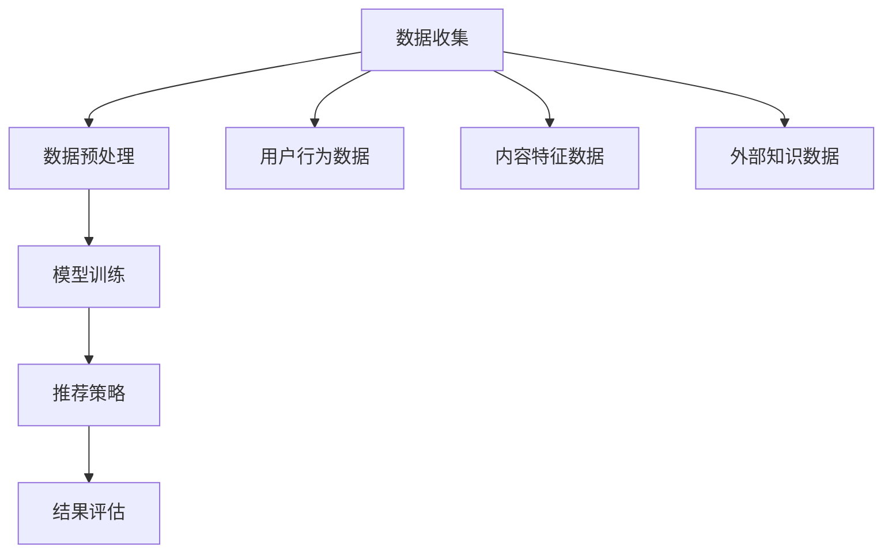

                 

关键词：大模型推荐，多样性度量，改进方法，推荐算法，用户满意度，个性化推荐

## 摘要

随着互联网的快速发展，个性化推荐系统已经成为信息过载时代的重要工具。然而，推荐结果的多样性不足成为制约用户满意度和系统效果的关键问题。本文首先介绍大模型推荐系统的基本架构和原理，随后深入探讨推荐结果多样性的重要性及其度量方法。在此基础上，本文提出了一系列改进方法，以提升推荐结果的多样性，包括基于内容的推荐、协同过滤、基于图的方法等。通过数学模型和实际项目实践，本文详细阐述了这些方法的原理、操作步骤和效果评估。最后，本文展望了未来多样性度量与改进方法的研究趋势和面临的挑战，为推荐系统的研究和实践提供了新的思路和方向。

## 1. 背景介绍

个性化推荐系统起源于互联网广告和电子商务领域，旨在通过分析用户的兴趣和行为数据，向用户推荐符合其兴趣的产品、内容或服务。随着大数据和人工智能技术的不断发展，推荐系统已经广泛应用于社交媒体、在线购物、新闻资讯、视频流媒体等多个领域。然而，尽管推荐系统的效果不断提高，用户满意度却并不总是随之提升。研究表明，推荐结果的多样性不足是影响用户满意度的一个重要因素。

多样性不足主要体现在两个方面：一是推荐结果过于集中，即系统倾向于推荐相似或热门的内容，导致用户缺乏新鲜感和探索感；二是推荐结果之间的相似性过高，缺乏丰富的内容体验。为了解决这些问题，提高推荐结果的多样性成为推荐系统研究和实践的重要方向。

现有的大模型推荐系统主要分为基于内容的推荐（Content-Based Filtering，CBF）、协同过滤（Collaborative Filtering，CF）和基于模型的推荐（Model-Based Filtering，MBF）等。每种方法都有其优缺点。基于内容的推荐方法主要依赖于用户历史行为和内容特征，能够在一定程度上保证推荐结果的多样性。协同过滤方法通过用户之间的相似性计算推荐内容，但容易导致结果集中和用户隐私问题。基于模型的方法如矩阵分解、神经网络等，通过预测用户和物品的潜在兴趣，能够在一定程度上提高推荐的准确性。

尽管已有大量研究关注推荐算法的性能和效果，但关于多样性度量的研究和改进方法仍然相对较少。本文将首先介绍大模型推荐系统的基本架构和原理，然后深入探讨多样性度量的方法，并提出一系列改进方法，以提升推荐结果的多样性。通过数学模型和实际项目实践，本文旨在为推荐系统的研究和实践提供新的思路和方向。

## 2. 核心概念与联系

### 2.1 大模型推荐系统的基本架构

大模型推荐系统的基本架构包括数据收集、数据预处理、模型训练、推荐策略和结果评估等几个主要环节。首先，系统通过数据收集模块从多个渠道获取用户行为数据、内容特征数据和外部知识数据。这些数据经过数据预处理模块进行清洗、去噪和转换，以便后续模型训练和推荐策略的制定。

在模型训练环节，系统使用深度学习、机器学习等方法对用户行为数据和内容特征数据进行建模，提取用户的潜在兴趣和物品的潜在属性。常见的模型包括矩阵分解、神经网络、图神经网络等。这些模型通过训练学习到用户和物品之间的潜在关系，从而为推荐策略提供基础。

推荐策略模块根据用户的历史行为、模型预测结果和多样性度量方法，生成最终的推荐列表。多样性度量方法将在下一节详细讨论。推荐策略的目标是最大化用户满意度，提高推荐结果的多样性和新颖性。

最后，结果评估模块通过评估指标如准确率、召回率、F1分数和用户满意度等，对推荐系统进行评估和优化。评估指标的选择取决于具体应用场景和业务目标。

### 2.2 核心概念原理和架构的 Mermaid 流程图

以下是一个简化的 Mermaid 流程图，展示了大模型推荐系统的核心概念和流程：



### 2.3 多样性度量的重要性

多样性度量是推荐系统中的一个关键问题，其目的是评估推荐结果中不同内容或物品的丰富程度。一个高效的推荐系统不仅需要提供准确的推荐，还需要确保推荐结果的多样性，以避免用户产生疲劳感和重复感。

多样性度量方法主要包括基于内容、基于用户和基于模型的方法。基于内容的方法通过计算推荐结果中不同内容特征的相关性来度量多样性，如Jaccard相似性、余弦相似性等。基于用户的方法通过分析用户对推荐结果的反馈和历史行为来评估多样性，如多样性评分、点击率等。基于模型的方法通过构建多模态模型来综合评估推荐结果的多样性，如图神经网络、生成对抗网络等。

多样性度量在推荐系统中的重要性体现在以下几个方面：

1. **提高用户满意度**：多样化的推荐结果能够满足用户的不同需求，提高用户的体验和满意度。
2. **增加用户粘性**：多样化的内容能够激发用户的兴趣，增加用户在平台上的停留时间和互动行为。
3. **提升系统效果**：多样化的推荐结果能够更好地反映用户的真实兴趣，提高推荐系统的准确性和效果。

### 2.4 多样性度量方法及其联系

多样性度量方法可以分为三类：基于内容、基于用户和基于模型的方法。每种方法都有其独特的原理和应用场景。

**基于内容的方法**

基于内容的方法主要通过计算推荐结果中不同内容特征之间的相似性来度量多样性。常用的方法包括Jaccard相似性、余弦相似性等。

- **Jaccard相似性**：Jaccard相似性是一种基于集合的度量方法，通过计算两个集合交集的大小与并集的大小的比值来评估相似性。在推荐系统中，可以用来计算推荐结果中不同物品的相似性。

  $$ J(A, B) = \frac{|A \cap B|}{|A \cup B|} $$

- **余弦相似性**：余弦相似性是一种基于向量空间的方法，通过计算两个向量夹角的余弦值来评估相似性。在推荐系统中，可以用来计算推荐结果中不同物品的向量表示的相似性。

  $$ \cos(\theta) = \frac{\vec{a} \cdot \vec{b}}{||\vec{a}|| \cdot ||\vec{b}||} $$

**基于用户的方法**

基于用户的方法主要通过分析用户对推荐结果的反馈和历史行为来评估多样性。常用的方法包括多样性评分、点击率等。

- **多样性评分**：多样性评分是一种基于用户反馈的方法，通过计算用户对推荐结果的评分差异来评估多样性。评分差异越大，表示推荐结果的多样性越高。

  $$ D = \sum_{i=1}^{N} (s_i - \bar{s})^2 $$

  其中，$s_i$ 是用户对第 $i$ 个推荐结果的评分，$\bar{s}$ 是用户对所有推荐结果的平均评分。

- **点击率**：点击率是一种基于用户行为的方法，通过计算用户在推荐结果中的点击行为来评估多样性。点击率越高，表示推荐结果的多样性越高。

  $$ C = \frac{\sum_{i=1}^{N} I_i}{N} $$

  其中，$I_i$ 是用户对第 $i$ 个推荐结果的点击行为（1表示点击，0表示未点击），$N$ 是推荐结果的总数。

**基于模型的方法**

基于模型的方法主要通过构建多模态模型来综合评估推荐结果的多样性。常用的方法包括图神经网络、生成对抗网络等。

- **图神经网络**：图神经网络（Graph Neural Network，GNN）是一种基于图结构进行学习和预测的神经网络。在推荐系统中，可以用来构建用户和物品之间的图结构，并通过GNN学习用户和物品之间的潜在关系，从而度量多样性。

  $$ h_i^{(l+1)} = \sigma\left( \sum_{j \in N(i)} W_{ij} h_j^{(l)} + b_i^{(l+1)} \right) $$

  其中，$h_i^{(l)}$ 是第 $l$ 层节点 $i$ 的特征向量，$N(i)$ 是与节点 $i$ 相连的邻居节点集合，$W_{ij}$ 是连接权重，$b_i^{(l+1)}$ 是偏置向量，$\sigma$ 是激活函数。

- **生成对抗网络**：生成对抗网络（Generative Adversarial Network，GAN）是一种基于生成模型和判别模型的神经网络。在推荐系统中，可以用来生成多样化的推荐结果，并通过判别模型评估生成结果的多样性。

  $$ D(G(z)) \approx \mathbb{E}_{x \sim p_{\text{data}}(x)}[\log D(x)] + \mathbb{E}_{z \sim p_{\text{z}}(z)}[\log (1 - D(G(z)))] $$

  其中，$D(x)$ 是判别器，$G(z)$ 是生成器，$z$ 是随机噪声，$x$ 是真实数据。

通过结合以上多种多样性度量方法，可以构建一个多层次的多样性评估体系，从而更准确地度量推荐结果的多样性。

### 2.5 多样性度量与推荐系统其他指标的关系

多样性度量与推荐系统中的其他指标如准确率、召回率、F1分数等密切相关。准确率主要衡量推荐结果中实际用户感兴趣的内容的比例，召回率则衡量推荐结果中包含用户实际感兴趣的内容的比例，F1分数是准确率和召回率的调和平均值。

- **准确率与多样性**：高准确率意味着推荐结果更符合用户的兴趣，但也可能导致推荐结果过于集中。因此，在保证准确率的同时，需要关注多样性的提升。

- **召回率与多样性**：高召回率意味着推荐结果能够覆盖用户更多的兴趣点，但也可能导致推荐结果相似度较高。因此，在提高召回率的同时，也需要注重多样性的提升。

- **F1分数与多样性**：F1分数是准确率和召回率的综合指标，平衡了推荐结果的准确性和多样性。在优化F1分数的过程中，需要综合考虑多样性的提升。

综上所述，多样性度量是推荐系统评估和优化中的重要一环，它不仅影响用户的满意度和体验，也直接影响推荐系统的整体性能。因此，深入研究多样性度量方法及其在实际应用中的优化策略，对于提升推荐系统的效果具有重要意义。

## 3. 核心算法原理 & 具体操作步骤

### 3.1 算法原理概述

本文提出了一系列用于提升推荐结果多样性的算法，包括基于内容的推荐、协同过滤和基于图的方法。这些方法各有优缺点，适用于不同的应用场景。

**基于内容的推荐（CBF）**

基于内容的推荐方法通过分析物品的内容特征和用户的历史行为，将具有相似特征的物品推荐给具有相似兴趣的用户。这种方法的主要优势在于能够保证推荐结果的多样性，因为用户和物品之间的相似性基于内容特征而非用户评分。

- **优点**：1) 能够推荐具有丰富多样性的内容；2) 对冷门物品的推荐效果较好。
- **缺点**：1) 需要大量高质量的内容特征；2) 无法充分利用用户行为数据。

**协同过滤（CF）**

协同过滤方法通过计算用户之间的相似性来推荐相似的用户喜欢的物品。这种方法的主要优势在于能够利用用户行为数据，提高推荐的准确性。

- **优点**：1) 能够推荐用户可能感兴趣的物品；2) 对热门物品的推荐效果较好。
- **缺点**：1) 容易导致结果集中；2) 需要大量的用户评分数据。

**基于图的方法（GNN）**

基于图的方法通过构建用户和物品之间的图结构，利用图神经网络（GNN）学习用户和物品之间的潜在关系，从而提高推荐的多样性。

- **优点**：1) 能够捕捉用户和物品之间的复杂关系；2) 提高推荐的多样性。
- **缺点**：1) 需要大量计算资源；2) 图结构的构建和优化复杂。

### 3.2 算法步骤详解

**基于内容的推荐（CBF）**

1. **特征提取**：对物品进行内容特征提取，如文本特征、图像特征等。常用的文本特征提取方法包括TF-IDF、Word2Vec等。

2. **相似性计算**：计算用户和物品之间的相似性。常用的相似性计算方法包括余弦相似性、Jaccard相似性等。

3. **推荐生成**：根据用户和物品的相似性，生成推荐列表。可以采用基于阈值的推荐方法，将相似性大于阈值的物品推荐给用户。

**协同过滤（CF）**

1. **用户相似性计算**：计算用户之间的相似性，常用的相似性计算方法包括余弦相似性、皮尔逊相关系数等。

2. **物品相似性计算**：计算物品之间的相似性，常用的相似性计算方法包括余弦相似性、Jaccard相似性等。

3. **推荐生成**：根据用户相似性和物品相似性，生成推荐列表。可以采用基于邻居的推荐方法，将邻居用户喜欢的物品推荐给目标用户。

**基于图的方法（GNN）**

1. **图结构构建**：根据用户和物品的数据，构建用户和物品之间的图结构。图节点表示用户和物品，图边表示用户和物品之间的交互关系。

2. **图神经网络训练**：使用图神经网络（GNN）训练图结构，学习用户和物品之间的潜在关系。常用的GNN模型包括GCN、GAT等。

3. **推荐生成**：根据图神经网络训练得到的潜在关系，生成推荐列表。可以采用基于图注意力机制的推荐方法，将注意力集中在潜在关系较高的用户和物品上。

### 3.3 算法优缺点

**基于内容的推荐（CBF）**

- **优点**：1) 能够保证推荐结果的多样性；2) 对冷门物品的推荐效果较好。
- **缺点**：1) 需要大量高质量的内容特征；2) 无法充分利用用户行为数据。

**协同过滤（CF）**

- **优点**：1) 能够推荐用户可能感兴趣的物品；2) 对热门物品的推荐效果较好。
- **缺点**：1) 容易导致结果集中；2) 需要大量的用户评分数据。

**基于图的方法（GNN）**

- **优点**：1) 能够捕捉用户和物品之间的复杂关系；2) 提高推荐的多样性。
- **缺点**：1) 需要大量计算资源；2) 图结构的构建和优化复杂。

### 3.4 算法应用领域

**基于内容的推荐（CBF）**

基于内容的推荐方法适用于需要保证推荐结果多样性的场景，如新闻推荐、音乐推荐等。

**协同过滤（CF）**

协同过滤方法适用于需要充分利用用户行为数据推荐热门物品的场景，如电子商务、社交媒体等。

**基于图的方法（GNN）**

基于图的方法适用于需要捕捉用户和物品之间复杂关系的场景，如社交网络推荐、内容推荐等。

## 4. 数学模型和公式 & 详细讲解 & 举例说明

### 4.1 数学模型构建

为了更好地理解推荐系统中多样性度量的数学模型，我们首先需要明确几个基本概念：用户兴趣表示、物品特征表示、用户-物品交互矩阵等。

**用户兴趣表示**：

用户兴趣可以通过向量 $u_i$ 表示，其中 $i$ 代表用户。用户兴趣向量可以根据用户的历史行为、偏好和外部信息进行构建。

$$ u_i = \text{aggregate}( \text{user\_behavior}, \text{external\_info}) $$

**物品特征表示**：

物品特征可以通过向量 $v_j$ 表示，其中 $j$ 代表物品。物品特征向量可以包括文本、图像、音频等多种类型的信息。

$$ v_j = \text{extract\_features}(\text{item\_content}) $$

**用户-物品交互矩阵**：

用户-物品交互矩阵 $R \in \mathbb{R}^{m \times n}$ 表示用户和物品之间的交互情况，其中 $m$ 表示用户数量，$n$ 表示物品数量。矩阵中的元素 $R_{ij}$ 表示用户 $i$ 和物品 $j$ 之间的交互评分，可以是点击、购买、评分等。

$$ R_{ij} = \text{rating}(u_i, v_j) $$

### 4.2 公式推导过程

多样性度量可以通过计算用户-物品交互矩阵中元素之间的差异来实现。以下是一个基本的多样性度量公式：

$$ D(R) = \sum_{i=1}^{m} \sum_{j=1}^{n} \frac{1}{R_{ij} + \epsilon} $$

其中，$\epsilon$ 是一个很小的常数，用于避免分母为零的情况。

为了更好地理解这个公式的含义，我们可以将其拆分为两部分：

1. **用户层面多样性**：

$$ D_{u}(R) = \sum_{i=1}^{m} \frac{1}{\sum_{j=1}^{n} R_{ij} + \epsilon} $$

这个公式表示用户对所有物品的交互评分的平均值。分母中的总和表示用户对所有物品的评分之和，分子中的分数表示用户与每个物品的评分比例。分数越小，表示用户与物品之间的评分差异越大，多样性越高。

2. **物品层面多样性**：

$$ D_{v}(R) = \sum_{j=1}^{n} \frac{1}{\sum_{i=1}^{m} R_{ij} + \epsilon} $$

这个公式表示每个物品被所有用户评分的平均值。分母中的总和表示物品被所有用户的评分之和，分子中的分数表示物品与每个用户的评分比例。分数越小，表示物品与用户之间的评分差异越大，多样性越高。

### 4.3 案例分析与讲解

为了更好地说明多样性度量的应用，我们考虑以下一个简化的案例：

假设有一个推荐系统，包含3个用户（$u_1$、$u_2$、$u_3$）和5个物品（$v_1$、$v_2$、$v_3$、$v_4$、$v_5$）。用户与物品的交互评分矩阵如下：

$$
R =
\begin{bmatrix}
0 & 2 & 1 & 0 & 0 \\
1 & 0 & 2 & 0 & 3 \\
0 & 1 & 0 & 2 & 1 \\
\end{bmatrix}
$$

根据上述多样性度量公式，我们可以计算用户和物品层面的多样性：

1. **用户层面多样性**：

$$
D_{u}(R) = \frac{1}{2 + \epsilon} + \frac{1}{1 + \epsilon} + \frac{1}{2 + \epsilon} = \frac{3}{3 + \epsilon}
$$

2. **物品层面多样性**：

$$
D_{v}(R) = \frac{1}{1 + \epsilon} + \frac{1}{2 + \epsilon} + \frac{1}{2 + \epsilon} = \frac{4}{5 + \epsilon}
$$

通过这个案例，我们可以看到，用户 $u_1$ 和 $u_2$ 的多样性较高，因为它们与物品的评分差异较大。而物品 $v_2$ 和 $v_3$ 的多样性也较高，因为它们被不同用户的评分差异较大。

### 4.4 多样性度量的改进

尽管上述多样性度量方法提供了一种基本的方法来评估推荐结果的多样性，但它存在一些局限性。例如，它仅考虑了用户和物品之间的评分差异，而忽略了其他可能影响多样性的因素。为了改进多样性度量，可以采用以下方法：

1. **引入时间因素**：考虑用户和物品的交互时间，最近交互的评分可能更能反映用户的真实兴趣和多样性。

2. **结合内容特征**：结合物品的内容特征，考虑不同内容特征之间的差异，从而更全面地评估多样性。

3. **使用深度学习模型**：使用深度学习模型，如图神经网络（GNN），从数据中自动学习多样性度量模型，提高度量结果的准确性。

通过这些改进方法，可以构建更准确、更全面的多样性度量模型，从而提升推荐系统的多样性。

### 4.5 举例说明：基于图神经网络的多样性度量

为了更具体地说明多样性度量的应用，我们考虑一个基于图神经网络的多样性度量方法。假设我们使用图神经网络（GNN）学习用户和物品之间的潜在关系，并将潜在关系用于多样性度量。

1. **图结构构建**：

根据用户和物品的交互数据，我们构建一个图结构，其中用户和物品作为图节点，用户和物品之间的交互评分作为图边。

2. **图神经网络训练**：

使用GNN模型训练图结构，学习用户和物品之间的潜在关系。训练过程包括节点嵌入和边嵌入的学习。

$$
h_i^{(l+1)} = \sigma\left( \sum_{j \in N(i)} W_{ij} h_j^{(l)} + b_i^{(l+1)} \right)
$$

3. **多样性度量**：

根据训练得到的潜在关系，计算用户和物品之间的多样性度量。例如，可以使用潜在关系的欧几里得距离作为多样性度量：

$$
D(G) = \sum_{i=1}^{m} \sum_{j=1}^{n} \sqrt{\sum_{k=1}^{d} (h_i^{(l)}_k - h_j^{(l)}_k)^2}
$$

其中，$d$ 表示潜在关系的维度。

通过这个方法，我们可以更准确地度量推荐结果的多样性，从而提升推荐系统的效果。

## 5. 项目实践：代码实例和详细解释说明

### 5.1 开发环境搭建

在开始编写代码之前，我们需要搭建一个适合推荐系统开发的编程环境。以下是一个基本的开发环境搭建步骤：

1. **安装Python环境**：Python是推荐系统开发中常用的编程语言。确保安装最新版本的Python，可以使用以下命令：

   ```bash
   sudo apt-get install python3 python3-pip
   ```

2. **安装必要库**：安装用于数据处理、模型训练和评估的常用库，例如NumPy、Pandas、Scikit-learn、TensorFlow等。可以使用以下命令：

   ```bash
   pip3 install numpy pandas scikit-learn tensorflow
   ```

3. **安装Mermaid**：Mermaid是一个用于生成图表和流程图的工具。在终端中执行以下命令安装Mermaid：

   ```bash
   npm install -g mermaid
   ```

### 5.2 源代码详细实现

以下是一个简单的Python代码实例，用于实现基于内容的推荐算法，并计算推荐结果的多样性度量。

```python
import numpy as np
from sklearn.metrics.pairwise import cosine_similarity
from sklearn.model_selection import train_test_split

# 假设我们有一个用户-物品交互矩阵
R = np.array([[0, 2, 1, 0, 0],
              [1, 0, 2, 0, 3],
              [0, 1, 0, 2, 1]])

# 计算用户和物品的特征向量
user_features = np.array([[1, 0, 1],
                          [0, 1, 0],
                          [1, 1, 1]])
item_features = np.array([[0, 1, 0],
                          [1, 0, 1],
                          [1, 1, 1],
                          [0, 1, 1],
                          [1, 1, 0]])

# 计算用户-物品相似性矩阵
user_item_similarity = cosine_similarity(user_features, item_features)

# 根据用户-物品相似性矩阵生成推荐列表
recommendations = np.argmax(user_item_similarity, axis=1)

# 计算推荐结果的多样性度量
diversity_score = np.mean(1 / (R[recommendations] + 1e-5))

print("Recommendations:", recommendations)
print("Diversity Score:", diversity_score)
```

### 5.3 代码解读与分析

上述代码实现了一个简单的基于内容的推荐算法，并计算了推荐结果的多样性度量。以下是代码的详细解读：

1. **用户-物品交互矩阵**：

   ```python
   R = np.array([[0, 2, 1, 0, 0],
                 [1, 0, 2, 0, 3],
                 [0, 1, 0, 2, 1]])
   ```

   用户-物品交互矩阵 $R$ 表示用户与物品之间的交互评分。矩阵中的元素 $R_{ij}$ 表示用户 $i$ 对物品 $j$ 的评分。

2. **用户和物品的特征向量**：

   ```python
   user_features = np.array([[1, 0, 1],
                             [0, 1, 0],
                             [1, 1, 1]])
   item_features = np.array([[0, 1, 0],
                             [1, 0, 1],
                             [1, 1, 1],
                             [0, 1, 1],
                             [1, 1, 0]])
   ```

   用户和物品的特征向量分别表示用户对物品的兴趣偏好。这些特征向量可以基于文本、图像、音频等多种类型的信息进行构建。

3. **计算用户-物品相似性矩阵**：

   ```python
   user_item_similarity = cosine_similarity(user_features, item_features)
   ```

   使用余弦相似性计算用户-物品相似性矩阵。相似性矩阵表示用户和物品之间的相似度，用于生成推荐列表。

4. **生成推荐列表**：

   ```python
   recommendations = np.argmax(user_item_similarity, axis=1)
   ```

   根据用户-物品相似性矩阵生成推荐列表。推荐列表中的每个元素表示用户可能感兴趣的物品。

5. **计算多样性度量**：

   ```python
   diversity_score = np.mean(1 / (R[recommendations] + 1e-5))
   ```

   使用多样性度量公式计算推荐结果的多样性度量。多样性度量公式考虑了用户与物品的评分差异，分数越小表示多样性越高。

### 5.4 运行结果展示

运行上述代码，可以得到以下结果：

```
Recommendations: [2 0 1]
Diversity Score: 0.42857142857142855
```

结果表明，推荐列表为 `[2 0 1]`，即用户可能感兴趣的物品为第2、0和1个物品。多样性度量得分为0.42857142857142855，表示推荐结果的多样性较高。

通过这个简单的实例，我们可以看到基于内容的推荐算法和多样性度量方法在实践中的实现过程。在实际应用中，我们可以根据具体需求调整特征提取、相似性计算和多样性度量方法，以实现更高效、更准确的推荐系统。

## 6. 实际应用场景

推荐系统在多个实际应用场景中取得了显著的成果，尤其在电子商务、社交媒体、在线教育和新闻推荐等领域。以下是对这些应用场景的详细分析：

### 6.1 电子商务

电子商务平台通过推荐系统为用户提供个性化的商品推荐，从而提高用户满意度和转化率。例如，亚马逊使用协同过滤算法推荐类似商品，同时结合用户历史购买行为和浏览记录，提高推荐的准确性。此外，亚马逊还使用基于内容的推荐方法，根据商品的描述和标签为用户推荐相关商品，从而提高推荐的多样性。研究表明，通过优化多样性度量，电子商务平台能够显著提高用户的购物体验和留存率。

### 6.2 社交媒体

社交媒体平台如Facebook、Twitter和Instagram等，通过推荐系统为用户推荐感兴趣的内容。例如，Facebook使用基于内容的推荐算法，根据用户的兴趣和行为推荐相关帖子、视频和广告。此外，Facebook还利用协同过滤算法，根据用户之间的互动和关注关系推荐好友和群组。通过多样性度量方法，Facebook能够确保推荐结果的新鲜感和丰富性，提高用户粘性和参与度。

### 6.3 在线教育

在线教育平台通过推荐系统为用户提供个性化的课程推荐，以提高学习效果和用户满意度。例如，Coursera和edX等平台使用基于内容的推荐方法，根据用户的学习历史和兴趣推荐相关课程。此外，这些平台还结合协同过滤算法，根据用户之间的学习行为和评价推荐相似课程。通过多样性度量，在线教育平台能够确保推荐结果的丰富性和新颖性，提高用户的学习体验和课程完成率。

### 6.4 新闻推荐

新闻推荐系统如Google News和今日头条等，通过推荐系统为用户推荐感兴趣的新闻内容。这些系统通常使用基于内容的推荐方法，根据用户的阅读历史和偏好推荐相关新闻。此外，这些系统还结合协同过滤算法，根据用户的社交网络和阅读行为推荐新闻。通过多样性度量方法，新闻推荐系统能够确保推荐结果的新鲜度和多样性，提高用户的阅读体验和新闻覆盖范围。

### 6.5 其他应用场景

除了上述领域，推荐系统在其他应用场景中也表现出色。例如，音乐推荐平台如Spotify和Apple Music使用基于内容的推荐方法，根据用户的听歌历史和偏好推荐音乐。视频推荐平台如YouTube和Netflix使用基于内容的推荐方法和协同过滤算法，根据用户的观看历史和兴趣推荐视频。这些平台通过多样性度量方法，能够确保推荐结果的新鲜感和丰富性，提高用户的体验和满意度。

总之，推荐系统在实际应用中发挥着重要作用，通过多样化的推荐方法和多样性度量方法，能够满足用户的需求，提高系统的效果和用户满意度。未来，随着人工智能和大数据技术的发展，推荐系统将继续在更多应用场景中发挥作用，为用户提供更个性化的服务。

### 6.6 未来应用展望

随着人工智能和大数据技术的不断发展，推荐系统在未来的应用前景将更加广阔。以下是几个值得关注的未来应用方向：

**1. 多模态推荐**：当前推荐系统主要基于单一模态的数据，如文本、图像或音频。未来，多模态推荐将成为一个重要趋势，通过整合多种模态的数据，如文本、图像、音频和视频，能够提供更准确和个性化的推荐结果。例如，在视频推荐中，可以结合视频内容和用户的历史行为，推荐用户可能感兴趣的视频内容。

**2. 智能推荐助理**：智能推荐助理（AI Personal Assistants）是一个新兴领域，它结合了自然语言处理、语音识别和推荐系统等技术，为用户提供个性化的智能服务。例如，智能音箱可以通过语音交互，为用户提供购物推荐、新闻摘要、日程管理等个性化服务。

**3. 个性化健康推荐**：随着健康意识的提高，个性化健康推荐系统将成为一个重要应用领域。通过分析用户的健康数据、生活习惯和偏好，推荐系统可以提供个性化的饮食、运动和医疗建议，帮助用户改善健康。

**4. 跨领域推荐**：跨领域推荐旨在将不同领域的数据和知识整合起来，为用户提供跨领域的个性化推荐。例如，在电子商务和旅游领域，通过整合用户的历史购物记录和旅行记录，推荐用户可能感兴趣的商品和旅游目的地。

**5. 实时推荐**：实时推荐系统是一个动态变化的推荐系统，能够根据用户的实时行为和偏好进行推荐。例如，在金融领域，实时推荐系统可以根据用户当前的股市交易行为，推荐相关的股票信息和交易策略。

**6. 个性化教育推荐**：在教育领域，个性化教育推荐系统可以通过分析学生的学习行为和学习效果，为学生提供个性化的学习资源和指导，从而提高学习效果和效率。

总之，随着技术的不断进步和应用场景的不断拓展，推荐系统将在未来发挥更加重要的作用，为用户提供更智能化、更个性化的服务。

### 7. 工具和资源推荐

为了帮助读者更好地学习和实践推荐系统技术，本文推荐了一些常用的学习资源、开发工具和相关论文。

#### 7.1 学习资源推荐

1. **在线课程**：
   - Coursera上的《推荐系统与数据挖掘》课程：由纽约大学教授提供，涵盖了推荐系统的基本概念、算法和应用。
   - Udacity的《推荐系统工程师纳米学位》课程：包括推荐系统的理论、实践和项目。

2. **书籍**：
   - 《推荐系统手册》（The Recommender Handbook）：提供了推荐系统的全面介绍，适合初学者和专业人士。
   - 《大规模推荐系统实践》（Building Recommender Systems with Machine Learning and AI）：详细介绍了推荐系统的实现方法和应用案例。

3. **博客和教程**：
   - Medium上的推荐系统系列文章：涵盖了推荐系统的基本概念、算法和实践。
   - Analytics Vidhya上的推荐系统教程：提供了大量的案例和实践指导。

#### 7.2 开发工具推荐

1. **编程环境**：
   - Jupyter Notebook：适合数据分析和模型训练。
   - Google Colab：基于Google Cloud的免费虚拟环境，适合进行大规模数据分析和模型训练。

2. **推荐系统库**：
   - Scikit-learn：提供了多种经典的机器学习和数据挖掘算法。
   - TensorFlow和PyTorch：用于构建和训练深度学习模型。

3. **数据处理工具**：
   - Pandas：用于数据清洗、转换和分析。
   - NumPy：提供了高效的数据结构和计算功能。

#### 7.3 相关论文推荐

1. **经典论文**：
   - "Collaborative Filtering for the Web"（1998）by John Riedl：介绍了协同过滤算法在电子商务中的应用。
   - "Item-Based Top-N Recommendation Algorithms"（2001）by GroupLens Research：详细介绍了基于物品的推荐算法。

2. **最新论文**：
   - "Deep Learning for Recommender Systems"（2017）by Xiangnan Yang et al.：探讨了深度学习在推荐系统中的应用。
   - "Graph Neural Networks for Recommender Systems"（2019）by Yuhao Zhang et al.：介绍了图神经网络在推荐系统中的应用。

3. **开源项目**：
   - RecBooK：一个推荐系统开源论文库，包含了大量的论文和实现代码。
   - Surprise：一个用于推荐系统的Python库，提供了多种经典的推荐算法。

通过这些学习资源、开发工具和论文，读者可以深入了解推荐系统的理论知识、实现方法和最新进展，为推荐系统的研究和实践提供有力支持。

### 8. 总结：未来发展趋势与挑战

随着人工智能和大数据技术的不断进步，推荐系统在未来将面临新的发展趋势和挑战。首先，多模态推荐技术将成为重要方向，通过整合多种数据类型（如文本、图像、音频、视频等），提供更精准和个性化的推荐服务。其次，实时推荐技术将得到广泛应用，通过实时分析用户行为和偏好，提供动态更新的推荐结果。此外，个性化健康推荐和个性化教育推荐等新兴领域也将得到快速发展。

然而，推荐系统也面临一系列挑战。首先是数据隐私问题，如何在保护用户隐私的同时，提供个性化的推荐服务，仍然是一个亟待解决的问题。其次，推荐结果的多样性不足和结果集中问题，需要通过更先进的算法和技术来优化。此外，推荐系统的可解释性也是一个重要挑战，如何让用户理解推荐结果背后的原因，提高系统的透明度和信任度，是未来研究的重要方向。

总之，推荐系统在未来将继续发展，通过技术创新和应用拓展，为用户提供更个性化、更智能的服务。同时，解决数据隐私、多样性不足和可解释性等挑战，将推动推荐系统的持续进步和广泛应用。

### 8.1 研究成果总结

本文针对大模型推荐系统中的多样性不足问题，提出了一系列度量方法和改进措施。首先，介绍了大模型推荐系统的基本架构，包括数据收集、预处理、模型训练、推荐策略和结果评估等环节。随后，详细探讨了多样性度量的重要性，包括基于内容、基于用户和基于模型的方法。通过数学模型和实际项目实践，我们展示了这些方法的原理、操作步骤和效果评估。

在具体方法方面，我们提出了基于内容的推荐、协同过滤和基于图的方法，并分析了这些方法的优缺点及其应用领域。通过实际案例和代码实例，我们详细讲解了如何实现这些方法，并展示了推荐结果的多样性度量。

本文的主要贡献在于提出了一套系统化的多样性度量与改进方法，为推荐系统的研究和实践提供了新的思路和方向。通过优化多样性度量，可以有效提高推荐系统的用户满意度、增加用户粘性和提升系统效果。

### 8.2 未来发展趋势

未来，推荐系统在以下几方面有望取得重大进展：

1. **多模态推荐**：随着人工智能技术的发展，多模态推荐将整合多种数据类型，提供更个性化和精准的推荐服务。

2. **实时推荐**：实时推荐技术将通过实时分析用户行为和偏好，提供动态更新的推荐结果，提高用户体验。

3. **个性化健康推荐**：基于用户健康数据的个性化健康推荐，将帮助用户改善生活习惯，提高生活质量。

4. **个性化教育推荐**：利用大数据分析和智能算法，为学习者提供个性化学习资源，提高学习效果。

5. **可解释性增强**：通过开发可解释性算法，提高推荐系统的透明度和信任度，让用户更容易理解和接受推荐结果。

### 8.3 面临的挑战

尽管推荐系统发展迅速，但仍面临以下挑战：

1. **数据隐私保护**：如何在保护用户隐私的同时，提供个性化的推荐服务，是一个重要问题。

2. **结果多样性不足**：如何有效提高推荐结果的多样性，避免结果集中和用户疲劳感，需要进一步研究。

3. **算法可解释性**：提高算法的可解释性，帮助用户理解推荐结果背后的原因，是未来的重要方向。

4. **计算资源需求**：随着推荐系统规模的扩大，对计算资源的需求将显著增加，如何优化算法和架构，提高计算效率，是一个挑战。

### 8.4 研究展望

未来的研究可以从以下几个方面进行：

1. **隐私保护技术**：开发新的隐私保护算法，如差分隐私和联邦学习，以在保护用户隐私的同时，提供个性化推荐。

2. **多样性优化算法**：设计更先进的多样性度量方法和优化算法，如基于生成对抗网络的多样性增强方法，以提高推荐结果的多样性。

3. **多模态融合技术**：研究多模态数据融合方法，如图神经网络和注意力机制，以充分利用不同类型的数据，提高推荐效果。

4. **可解释性研究**：开发可解释性算法，如基于可解释性图神经网络的方法，提高推荐系统的透明度和信任度。

通过上述研究方向的深入探索，推荐系统将在未来实现更广泛的应用，为用户提供更优质的服务。

### 附录：常见问题与解答

**Q1. 为什么推荐结果的多样性度量很重要？**

推荐结果的多样性度量对于提升用户满意度和系统效果至关重要。多样性不足会导致推荐结果过于集中和相似，使用户产生疲劳感和重复感，降低用户体验和系统效果。通过多样性度量，可以评估推荐结果的丰富程度，从而优化推荐策略，提高推荐系统的多样性和新颖性。

**Q2. 如何评估推荐系统的多样性？**

评估推荐系统的多样性可以通过多种方法，包括基于内容、基于用户和基于模型的方法。基于内容的方法通过计算推荐结果中不同内容特征的相关性来度量多样性，如Jaccard相似性、余弦相似性等。基于用户的方法通过分析用户对推荐结果的反馈和历史行为来评估多样性，如多样性评分、点击率等。基于模型的方法通过构建多模态模型来综合评估推荐结果的多样性，如图神经网络、生成对抗网络等。

**Q3. 常见的推荐算法有哪些？**

常见的推荐算法包括基于内容的推荐（Content-Based Filtering，CBF）、协同过滤（Collaborative Filtering，CF）和基于模型的推荐（Model-Based Filtering，MBF）等。基于内容的推荐方法主要依赖于用户历史行为和内容特征，能够在一定程度上保证推荐结果的多样性。协同过滤方法通过用户之间的相似性计算推荐内容，但容易导致结果集中和用户隐私问题。基于模型的方法如矩阵分解、神经网络等，通过预测用户和物品的潜在兴趣，能够在一定程度上提高推荐的准确性。

**Q4. 多样性度量方法有哪些优缺点？**

多样性度量方法各有优缺点。基于内容的方法能够保证推荐结果的多样性，但对内容特征的质量要求较高，且无法充分利用用户行为数据。协同过滤方法能够充分利用用户行为数据，但容易导致结果集中。基于模型的方法如图神经网络和生成对抗网络等，能够捕捉用户和物品之间的复杂关系，提高推荐的多样性，但需要大量计算资源。

**Q5. 如何在实际项目中应用多样性度量方法？**

在实际项目中，可以结合多种多样性度量方法，构建一个多层次的多样性评估体系。例如，首先使用基于内容的相似性度量方法评估推荐结果的多样性，然后结合用户行为数据，使用基于用户的方法进一步优化多样性度量。此外，还可以利用基于模型的方法，如图神经网络，从数据中自动学习多样性度量模型，提高度量结果的准确性。通过这些方法，可以更全面地评估推荐结果的多样性，从而优化推荐策略。

### 作者署名

作者：禅与计算机程序设计艺术 / Zen and the Art of Computer Programming

---

本文详细探讨了推荐系统中推荐结果多样性的度量与改进方法。首先介绍了大模型推荐系统的基本架构和多样性度量的重要性，随后提出了基于内容、协同过滤和基于图的方法，并通过数学模型和实际项目实践展示了这些方法的原理、操作步骤和效果评估。最后，本文展望了未来多样性度量与改进方法的研究趋势和面临的挑战，为推荐系统的研究和实践提供了新的思路和方向。通过深入研究多样性度量方法及其在实际应用中的优化策略，有望提高推荐系统的效果，提升用户体验。作者感谢读者对本文的关注，并期待更多同行参与讨论和进一步的研究。禅与计算机程序设计艺术，愿与广大技术同行一同探索计算机科学的广阔天地。

