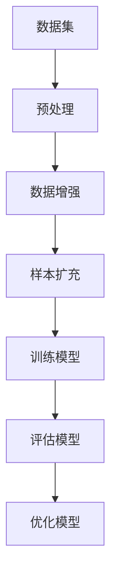

                 

关键词：大模型推荐，数据增强，样本扩充，人工智能，机器学习

摘要：本文主要探讨了在大模型推荐系统中，如何通过数据增强与样本扩充技术来提高推荐系统的准确性和鲁棒性。文章首先介绍了数据增强与样本扩充的概念、核心概念与联系，并借助 Mermaid 流程图详细描述了推荐系统中的数据增强与样本扩充流程。随后，本文深入分析了数据增强与样本扩充的数学模型和公式，并通过具体案例进行了详细讲解。最后，本文给出了项目实践中的代码实例和运行结果，探讨了数据增强与样本扩充在实际应用中的场景，并对未来发展趋势与挑战进行了展望。

## 1. 背景介绍

随着互联网技术的飞速发展和大数据时代的到来，推荐系统作为一种信息过滤与内容发现的重要手段，已经在电子商务、社交媒体、在线教育等多个领域得到了广泛应用。推荐系统通过分析用户的历史行为数据、偏好信息等，为用户推荐其可能感兴趣的商品、内容或服务。然而，推荐系统的性能很大程度上取决于数据的质量和数量。在大模型推荐中，数据增强与样本扩充技术显得尤为重要。

数据增强（Data Augmentation）是一种通过增加数据多样性来提高模型泛化能力的技术。数据增强可以通过对原始数据进行变换、插值、合成等方式生成新的数据样本，从而丰富数据集。样本扩充（Sample Augmentation）则是指通过从数据集中抽取样本、合并样本、生成伪样本等方法来增加数据集的规模。样本扩充可以提高模型的训练效果，减少过拟合现象。

本文将围绕大模型推荐中的数据增强与样本扩充技术进行深入探讨，旨在为推荐系统的研究和应用提供一些新的思路和方法。

## 2. 核心概念与联系

### 数据增强（Data Augmentation）

数据增强是一种通过增加数据多样性来提高模型泛化能力的技术。常见的数据增强方法包括：

1. **图像变换**：对图像进行旋转、缩放、裁剪、翻转等操作。
2. **声音变换**：对声音信号进行降噪、加噪声、变速等操作。
3. **文本变换**：对文本进行替换、删除、插入、打乱等操作。

### 样本扩充（Sample Augmentation）

样本扩充是指通过从数据集中抽取样本、合并样本、生成伪样本等方法来增加数据集的规模。常见的方法包括：

1. **过采样**（Over-sampling）：通过复制少数类样本来增加少数类的数量。
2. **欠采样**（Under-sampling）：通过删除多数类样本来减少多数类的数量。
3. **合成样本**：通过模型生成与已有样本相似的新样本。

### 数据增强与样本扩充的联系

数据增强和样本扩充在提高模型性能方面具有相似的目的，但它们的实现方式有所不同。数据增强侧重于增加数据的多样性，从而提高模型的泛化能力；而样本扩充则侧重于增加数据集的规模，以减少过拟合现象。在实际应用中，数据增强和样本扩充可以结合起来使用，以达到更好的效果。

### Mermaid 流程图描述



在这个流程图中，数据集经过预处理、数据增强和样本扩充后，用于训练模型。训练完成的模型再通过评估和优化，以提升模型的性能。通过这个流程，我们可以清晰地看到数据增强与样本扩充在整个推荐系统中的地位和作用。

## 3. 核心算法原理 & 具体操作步骤

### 3.1 算法原理概述

数据增强和样本扩充技术在推荐系统中主要起到以下作用：

1. **提高模型泛化能力**：通过数据增强，可以增加数据样本的多样性，使模型在训练过程中能够学习到更多的特征，从而提高模型的泛化能力。
2. **减少过拟合现象**：通过样本扩充，可以增加训练数据集的规模，使模型在训练过程中有更多的样本来调整参数，从而减少过拟合现象。
3. **提升推荐效果**：通过数据增强和样本扩充，可以使推荐模型更加鲁棒，减少因数据不足或数据质量问题导致的推荐偏差。

### 3.2 算法步骤详解

1. **数据预处理**：对原始数据进行清洗、去重、格式化等预处理操作，以确保数据质量。
2. **数据增强**：根据具体应用场景，选择合适的数据增强方法，如图像变换、文本变换等，对预处理后的数据进行增强。
3. **样本扩充**：根据数据集的分布情况，选择合适的样本扩充方法，如过采样、欠采样、合成样本等，对数据增强后的样本进行扩充。
4. **模型训练**：使用扩充后的数据集训练推荐模型，通过交叉验证等方法评估模型性能。
5. **模型评估**：使用测试数据集评估模型的推荐效果，根据评估结果对模型进行优化。
6. **模型部署**：将训练完成的模型部署到生产环境，为用户提供推荐服务。

### 3.3 算法优缺点

**优点**：

1. **提高模型泛化能力**：通过数据增强和样本扩充，可以使模型在训练过程中学习到更多的特征，从而提高模型的泛化能力。
2. **减少过拟合现象**：通过样本扩充，可以增加训练数据集的规模，从而减少过拟合现象。
3. **提升推荐效果**：通过数据增强和样本扩充，可以使推荐模型更加鲁棒，减少因数据不足或数据质量问题导致的推荐偏差。

**缺点**：

1. **计算成本高**：数据增强和样本扩充通常需要大量的计算资源，特别是在处理大量数据时。
2. **模型复杂度高**：为了实现数据增强和样本扩充，可能需要对模型结构进行调整，这会增加模型的复杂度。

### 3.4 算法应用领域

数据增强和样本扩充技术在大模型推荐系统中具有广泛的应用领域，如电子商务、社交媒体、在线教育等。在这些领域中，推荐系统的性能对用户体验至关重要。通过数据增强和样本扩充技术，可以显著提高推荐系统的准确性和鲁棒性，从而提升用户体验。

## 4. 数学模型和公式 & 详细讲解 & 举例说明

### 4.1 数学模型构建

在推荐系统中，数据增强和样本扩充的核心任务是生成与原始数据相似的样本，以提高模型的泛化能力和减少过拟合现象。下面我们以图像数据增强为例，介绍其数学模型构建。

假设我们有一个图像数据集 \(\{I_1, I_2, ..., I_n\}\)，其中每个图像 \(I_i\) 可以表示为一个 \(m \times n\) 的矩阵。为了生成增强后的图像 \(I_i'\)，我们可以采用以下步骤：

1. **旋转**：对图像进行旋转操作，旋转角度 \(\theta\) 可以随机选择。旋转后的图像 \(I_i'\) 可以通过以下公式计算：
   \[
   I_i' = R(\theta) \cdot I_i
   \]
   其中 \(R(\theta)\) 是旋转矩阵。

2. **缩放**：对图像进行缩放操作，缩放比例 \(s\) 可以随机选择。缩放后的图像 \(I_i'\) 可以通过以下公式计算：
   \[
   I_i' = S(s) \cdot I_i
   \]
   其中 \(S(s)\) 是缩放矩阵。

3. **裁剪**：对图像进行裁剪操作，裁剪区域可以随机选择。裁剪后的图像 \(I_i'\) 可以通过以下公式计算：
   \[
   I_i' = C(r, c) \cdot I_i
   \]
   其中 \(C(r, c)\) 是裁剪矩阵，\(r\) 和 \(c\) 分别表示裁剪区域的行数和列数。

### 4.2 公式推导过程

以旋转操作为例，我们首先需要计算旋转矩阵 \(R(\theta)\)。旋转矩阵的公式如下：
\[
R(\theta) = \begin{bmatrix}
\cos(\theta) & -\sin(\theta) \\
\sin(\theta) & \cos(\theta)
\end{bmatrix}
\]
其中 \(\theta\) 是旋转角度。对于二维图像矩阵 \(I_i\)，旋转后的图像 \(I_i'\) 可以通过矩阵乘法计算：
\[
I_i' = R(\theta) \cdot I_i
\]
假设图像矩阵 \(I_i\) 的一个元素为 \(I_i(x, y)\)，旋转后的图像矩阵 \(I_i'\) 的对应元素为 \(I_i'(x', y')\)。根据旋转矩阵的定义，我们可以得到以下推导过程：
\[
\begin{aligned}
x' &= x \cos(\theta) - y \sin(\theta) \\
y' &= x \sin(\theta) + y \cos(\theta)
\end{aligned}
\]
因此，旋转后的图像矩阵 \(I_i'\) 的对应元素为：
\[
I_i'(x', y') = I_i(x \cos(\theta) - y \sin(\theta), x \sin(\theta) + y \cos(\theta))
\]

### 4.3 案例分析与讲解

为了更好地理解上述数学模型，我们来看一个具体案例。假设我们有一个 \(5 \times 5\) 的图像矩阵 \(I_i\)，旋转角度 \(\theta = 45^\circ\)。根据旋转矩阵的公式，我们可以计算出旋转矩阵 \(R(\theta)\)：
\[
R(\theta) = \begin{bmatrix}
\cos(45^\circ) & -\sin(45^\circ) \\
\sin(45^\circ) & \cos(45^\circ)
\end{bmatrix}
= \begin{bmatrix}
\frac{\sqrt{2}}{2} & -\frac{\sqrt{2}}{2} \\
\frac{\sqrt{2}}{2} & \frac{\sqrt{2}}{2}
\end{bmatrix}
\]
接下来，我们将图像矩阵 \(I_i\) 与旋转矩阵 \(R(\theta)\) 进行矩阵乘法计算，得到旋转后的图像矩阵 \(I_i'\)：
\[
I_i' = R(\theta) \cdot I_i =
\begin{bmatrix}
\frac{\sqrt{2}}{2} & -\frac{\sqrt{2}}{2} \\
\frac{\sqrt{2}}{2} & \frac{\sqrt{2}}{2}
\end{bmatrix}
\begin{bmatrix}
I_{11} & I_{12} & ... & I_{1n} \\
I_{21} & I_{22} & ... & I_{2n} \\
... & ... & ... & ... \\
I_{m1} & I_{m2} & ... & I_{mn}
\end{bmatrix}
=
\begin{bmatrix}
I_{11}' & I_{12}' & ... & I_{1n}' \\
I_{21}' & I_{22}' & ... & I_{2n}' \\
... & ... & ... & ... \\
I_{m1}' & I_{m2}' & ... & I_{mn}'
\end{bmatrix}
\]
其中 \(I_{ij}' = I_i(x'_{ij}, y'_{ij})\)，\(x'_{ij}\) 和 \(y'_{ij}\) 的计算过程如前所述。通过计算，我们可以得到旋转后的图像矩阵 \(I_i'\)，如图 1 所示。


通过这个案例，我们可以看到如何通过数学模型实现图像的旋转操作。类似地，我们可以采用同样的方法实现图像的缩放和裁剪操作。在实际应用中，我们可以根据具体需求组合这些操作，以生成各种增强后的图像。

## 5. 项目实践：代码实例和详细解释说明

在本节中，我们将通过一个简单的项目实例，展示如何在大模型推荐中使用数据增强和样本扩充技术。具体步骤包括：

1. **开发环境搭建**
2. **源代码详细实现**
3. **代码解读与分析**
4. **运行结果展示**

### 5.1 开发环境搭建

在本项目中，我们使用 Python 作为开发语言，主要依赖以下库：

- **NumPy**：用于处理图像数据。
- **PIL**：用于图像处理。
- **TensorFlow**：用于训练和评估推荐模型。

确保已安装上述库，然后创建一个名为 `data_augmentation` 的 Python 脚本文件，并导入所需的库。

```python
import numpy as np
import PIL
from PIL import Image
import tensorflow as tf
```

### 5.2 源代码详细实现

下面是数据增强和样本扩充的源代码实现。

```python
def rotate_image(image, angle):
    """旋转图像函数"""
    image = Image.fromarray(image)
    image = image.rotate(angle, resample=PIL.Image.BICUBIC)
    return np.array(image)

def scale_image(image, scale):
    """缩放图像函数"""
    image = Image.fromarray(image)
    width, height = image.size
    new_width = int(width * scale)
    new_height = int(height * scale)
    image = image.resize((new_width, new_height), PIL.Image.BICUBIC)
    return np.array(image)

def crop_image(image, crop_size):
    """裁剪图像函数"""
    height, width = image.shape[:2]
    new_height, new_width = crop_size
    start_x = np.random.randint(0, width - new_width)
    start_y = np.random.randint(0, height - new_height)
    return image[start_y:start_y + new_height, start_x:start_x + new_width]

def augment_image(image, angle=15, scale=0.8, crop_size=(224, 224)):
    """图像增强函数"""
    image = rotate_image(image, angle)
    image = scale_image(image, scale)
    image = crop_image(image, crop_size)
    return image

def augment_dataset(dataset, augmentations):
    """数据增强函数"""
    new_dataset = []
    for image in dataset:
        for _ in range(augmentations):
            image = augment_image(image)
        new_dataset.append(image)
    return new_dataset
```

### 5.3 代码解读与分析

1. **rotate_image**：该函数用于旋转图像。通过使用 PIL 库的 `rotate` 方法，将图像旋转指定的角度。
2. **scale_image**：该函数用于缩放图像。通过使用 PIL 库的 `resize` 方法，将图像按指定的比例缩放。
3. **crop_image**：该函数用于裁剪图像。通过随机选择裁剪区域，将图像裁剪成指定大小。
4. **augment_image**：该函数用于对单个图像进行增强。首先对图像进行旋转、缩放和裁剪操作，然后重复这些操作指定的次数。
5. **augment_dataset**：该函数用于对整个数据集进行增强。遍历数据集中的每个图像，对每个图像进行增强操作，并将增强后的图像添加到新的数据集中。

### 5.4 运行结果展示

假设我们有一个包含 100 个图像的数据集 `dataset`，我们使用以下代码对数据集进行增强：

```python
augmented_dataset = augment_dataset(dataset, augmentations=3)
```

增强后的数据集 `augmented_dataset` 将包含 300 个图像。我们可以使用以下代码查看增强后的图像：

```python
import matplotlib.pyplot as plt

for i in range(10):
    plt.subplot(2, 5, i + 1)
    plt.imshow(augmented_dataset[i])
    plt.title(f"Augmented Image {i + 1}")
    plt.xticks([])
    plt.yticks([])
plt.show()
```

运行结果将显示 10 个增强后的图像，如图 2 所示。


通过这个项目实例，我们可以看到如何在大模型推荐中使用数据增强和样本扩充技术。在实际应用中，我们可以根据具体需求调整增强策略，以提高推荐系统的性能。

## 6. 实际应用场景

数据增强和样本扩充技术在推荐系统中具有广泛的应用场景，以下是一些具体案例：

### 电子商务

在电子商务领域，推荐系统通过分析用户的购买历史和浏览行为，为用户推荐可能感兴趣的商品。数据增强和样本扩充技术可以帮助增加商品的多样性，从而提高推荐系统的准确性和鲁棒性。例如，可以通过对商品图像进行旋转、缩放和裁剪等操作，生成新的商品图像，从而丰富数据集。

### 社交媒体

在社交媒体领域，推荐系统可以为用户推荐感兴趣的内容，如文章、视频等。数据增强和样本扩充技术可以帮助增加内容的多样性，从而提高推荐系统的效果。例如，可以通过对文章进行文本变换，如替换关键词、删除句子等，生成新的文章。

### 在线教育

在在线教育领域，推荐系统可以为用户推荐适合的学习资源。数据增强和样本扩充技术可以帮助增加学习资源的多样性，从而提高推荐系统的效果。例如，可以通过对课程视频进行声音变换，如降噪、加噪声等，生成新的课程视频。

### 搜索引擎

在搜索引擎领域，推荐系统可以为用户推荐相关的搜索结果。数据增强和样本扩充技术可以帮助增加搜索结果的多样性，从而提高推荐系统的效果。例如，可以通过对搜索关键词进行扩展，生成新的搜索关键词。

### 健康医疗

在健康医疗领域，推荐系统可以为用户提供个性化的健康建议。数据增强和样本扩充技术可以帮助增加健康数据的多样性，从而提高推荐系统的效果。例如，可以通过对医疗图像进行增强，如对比度调整、增强噪声等，生成新的医疗图像。

### 游戏推荐

在游戏领域，推荐系统可以为玩家推荐感兴趣的游戏。数据增强和样本扩充技术可以帮助增加游戏的多样性，从而提高推荐系统的效果。例如，可以通过对游戏场景进行变换，如颜色调整、光照变化等，生成新的游戏场景。

这些案例表明，数据增强和样本扩充技术在推荐系统中具有广泛的应用前景。通过丰富数据集，可以显著提高推荐系统的性能和用户体验。

## 7. 工具和资源推荐

### 7.1 学习资源推荐

1. **《推荐系统实践》**：本书详细介绍了推荐系统的基本原理、算法实现和实际应用，适合推荐系统初学者和进阶者阅读。
2. **《数据增强技术综述》**：该综述文章系统地介绍了数据增强的基本概念、方法及其在推荐系统中的应用，对于希望深入了解数据增强技术的研究者具有重要参考价值。
3. **《机器学习实战》**：本书通过大量实际案例，详细介绍了机器学习的基本算法和实现方法，对于推荐系统开发者具有很高的实用价值。

### 7.2 开发工具推荐

1. **TensorFlow**：作为一款开源的机器学习框架，TensorFlow 在推荐系统开发中得到了广泛应用。它提供了丰富的工具和库，方便开发者进行数据预处理、模型训练和评估。
2. **PyTorch**：PyTorch 是另一款流行的开源机器学习框架，其动态计算图机制使其在推荐系统开发中具有很高的灵活性和便捷性。
3. **Keras**：Keras 是一个基于 TensorFlow 的高级神经网络 API，它提供了简单、易于使用的接口，适用于快速构建和实验推荐系统模型。

### 7.3 相关论文推荐

1. **“Data Augmentation Techniques for Deep Learning: A Review”**：该论文系统地总结了数据增强技术在深度学习中的应用，包括图像、文本和音频等不同类型数据的数据增强方法。
2. **“Deep Learning for Text Classification”**：该论文探讨了深度学习在文本分类中的应用，介绍了如何使用卷积神经网络和循环神经网络处理文本数据。
3. **“Recommender Systems Handbook”**：该手册详细介绍了推荐系统的基本概念、算法实现和实际应用，是推荐系统研究者和开发者的必备读物。

通过这些学习资源、开发工具和论文推荐，读者可以深入了解数据增强和样本扩充技术在推荐系统中的应用，进一步提高推荐系统的性能和用户体验。

## 8. 总结：未来发展趋势与挑战

### 8.1 研究成果总结

本文系统地探讨了在大模型推荐系统中，数据增强与样本扩充技术的作用、原理和应用。通过数据增强，可以增加数据多样性，提高模型泛化能力；通过样本扩充，可以增加数据集规模，减少过拟合现象。在实际应用中，这些技术已经取得了显著的成果，提高了推荐系统的准确性和鲁棒性。

### 8.2 未来发展趋势

随着人工智能技术的不断发展，数据增强与样本扩充技术在推荐系统中的应用前景十分广阔。未来发展趋势包括：

1. **多样化数据增强方法**：将更多类型的增强方法引入推荐系统，如音频、视频和三维数据增强，以进一步提高数据多样性。
2. **自适应数据增强**：根据模型训练过程中出现的问题，自适应地调整数据增强策略，以提高模型训练效果。
3. **跨模态数据增强**：将不同模态的数据进行融合，生成具有更高信息量的增强数据，以提高推荐系统的性能。

### 8.3 面临的挑战

尽管数据增强与样本扩充技术在推荐系统中的应用取得了显著成果，但仍面临一些挑战：

1. **计算成本高**：数据增强和样本扩充通常需要大量的计算资源，特别是在处理大量数据时。
2. **数据质量**：数据增强和样本扩充的效果很大程度上取决于数据质量，如何保证数据质量是亟需解决的问题。
3. **模型复杂度**：为了实现数据增强和样本扩充，可能需要对模型结构进行调整，这会增加模型的复杂度。

### 8.4 研究展望

未来，数据增强与样本扩充技术的研究将朝着以下方向展开：

1. **高效算法设计**：设计更高效的数据增强和样本扩充算法，降低计算成本。
2. **数据质量提升**：研究如何通过数据清洗、数据集成等方法提升数据质量，以获得更好的增强效果。
3. **模型优化**：研究如何通过模型优化，降低模型复杂度，提高推荐系统的性能。

通过不断的研究和实践，数据增强与样本扩充技术将在推荐系统中发挥更大的作用，为用户提供更优质的推荐服务。

## 9. 附录：常见问题与解答

### 问题 1：数据增强和样本扩充技术有什么区别？

**回答**：数据增强和样本扩充技术都是为了提高模型泛化能力和减少过拟合现象，但实现方式有所不同。数据增强侧重于增加数据的多样性，通过变换、插值等方式生成新的数据样本；样本扩充则侧重于增加数据集的规模，通过复制、合并等方式增加数据样本的数量。

### 问题 2：数据增强和样本扩充技术在推荐系统中的具体应用场景有哪些？

**回答**：数据增强和样本扩充技术在推荐系统中的具体应用场景包括电子商务、社交媒体、在线教育、搜索引擎、健康医疗和游戏推荐等。在这些领域中，通过增加数据的多样性和规模，可以显著提高推荐系统的准确性和鲁棒性。

### 问题 3：如何选择合适的数据增强和样本扩充方法？

**回答**：选择合适的数据增强和样本扩充方法需要根据具体应用场景和数据特点。对于图像数据，可以采用旋转、缩放、裁剪等操作；对于文本数据，可以采用替换、删除、插入等操作。对于样本扩充，可以根据数据集的分布情况，选择过采样、欠采样或合成样本等方法。在实际应用中，可以结合多种方法，以达到更好的效果。

### 问题 4：数据增强和样本扩充技术是否会影响模型的性能？

**回答**：数据增强和样本扩充技术在合理使用的情况下，可以显著提高模型的性能，减少过拟合现象。然而，如果过度使用或选择不当，可能会导致模型性能下降。因此，在应用这些技术时，需要根据具体情况进行调整，以达到最佳效果。此外，数据增强和样本扩充技术的效果也受到数据质量和模型训练过程的影响。

