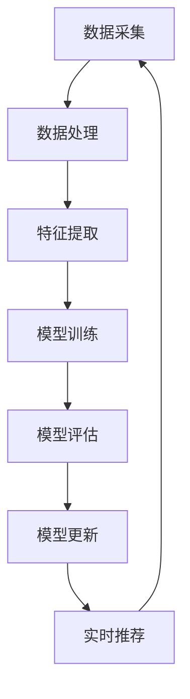

                 

关键词：大模型推荐、模型更新、在线学习、技术创新、数据流处理、模型优化、机器学习算法、深度学习。

摘要：本文深入探讨了在大模型推荐系统中，如何通过在线学习和模型更新的技术手段，实现模型的实时优化和更新，提升推荐系统的效果和用户体验。文章首先介绍了大模型推荐系统的背景和重要性，然后详细分析了模型更新和在线学习的基本原理，最后通过实际案例和数学模型，展示了如何在大模型推荐系统中应用这些技术。

## 1. 背景介绍

在互联网时代，推荐系统已经成为各大互联网公司的重要竞争力之一。从最初的基于内容的推荐，到协同过滤推荐，再到现在的基于深度学习的大模型推荐，推荐系统的技术不断发展，应用场景也越来越广泛。大模型推荐系统通过利用大规模数据和深度学习算法，能够为用户推荐更加精准和个性化的内容，从而提高用户的满意度和活跃度。

然而，随着用户行为和数据量的不断变化，大模型推荐系统的效果也需要不断地优化和更新。传统的离线模型训练方法，由于训练周期长、模型更新慢，很难适应实时变化的用户需求。因此，在线学习和模型更新的技术成为了当前研究的热点。本文将重点讨论大模型推荐中的模型更新与在线学习技术创新，旨在为推荐系统的优化提供一些新的思路和方法。

### 1.1 大模型推荐系统概述

大模型推荐系统通常包含以下几个核心组成部分：

- **数据采集与处理**：收集用户的点击、浏览、搜索等行为数据，并进行清洗、预处理和特征提取。

- **模型训练与优化**：利用深度学习算法，如神经网络、循环神经网络（RNN）、变换器（Transformer）等，对大量数据进行训练，优化模型参数。

- **推荐算法实现**：根据训练好的模型，为用户生成个性化的推荐列表。

- **系统部署与运维**：将推荐算法部署到生产环境中，进行实时推荐，同时进行监控和运维。

### 1.2 在线学习和模型更新的必要性

随着互联网的快速发展，用户行为和数据量呈现出爆炸式增长。这使得推荐系统的效果受到极大的挑战，传统的离线模型训练方法已经无法满足实时推荐的需求。在线学习和模型更新的技术，可以在用户行为数据发生变化的瞬间，对模型进行实时优化和更新，从而提高推荐系统的效果和响应速度。

- **实时性**：在线学习能够实时处理用户行为数据，快速生成推荐结果。

- **适应性**：在线学习能够根据用户行为的变化，动态调整模型参数，提高推荐精度。

- **高效性**：在线学习通过增量式训练，可以减少计算资源消耗，提高训练效率。

## 2. 核心概念与联系

在大模型推荐系统中，核心概念包括在线学习、模型更新、数据流处理等。下面我们将通过一个 Mermaid 流程图来展示这些概念之间的联系。



### 2.1 在线学习

在线学习（Online Learning）是指在学习过程中，模型能够不断地接收新的数据，并实时调整模型参数，以适应数据的变化。在线学习的关键在于如何处理大量的实时数据，并保持模型的稳定性和准确性。

### 2.2 模型更新

模型更新（Model Updating）是指根据用户行为数据的实时变化，对模型参数进行动态调整，以提高推荐系统的效果。模型更新可以分为增量更新和全量更新两种方式。

### 2.3 数据流处理

数据流处理（Data Stream Processing）是指对实时数据流进行高效处理和分析的技术。数据流处理可以实时捕捉用户行为的变化，为在线学习和模型更新提供数据支持。

## 3. 核心算法原理 & 具体操作步骤

### 3.1 算法原理概述

大模型推荐中的在线学习和模型更新，主要依赖于以下几个核心算法：

- **深度学习算法**：用于模型训练和特征提取。

- **在线学习算法**：用于实时调整模型参数。

- **模型更新算法**：用于模型参数的动态调整。

### 3.2 算法步骤详解

#### 3.2.1 模型训练

1. **数据采集**：从数据源收集用户行为数据，如点击、浏览、搜索等。

2. **数据处理**：对采集到的数据进行清洗、预处理，并提取特征。

3. **模型训练**：利用深度学习算法，如神经网络、RNN、Transformer等，对提取到的特征进行训练，优化模型参数。

4. **模型评估**：通过交叉验证等方法，评估模型的性能和准确性。

#### 3.2.2 在线学习

1. **实时数据流处理**：通过数据流处理技术，实时捕捉用户行为的变化。

2. **模型更新**：利用在线学习算法，对模型参数进行动态调整。

3. **模型评估**：评估更新后的模型性能，确保推荐效果的提升。

#### 3.2.3 模型更新

1. **增量更新**：对模型参数进行增量式更新，减少计算资源消耗。

2. **全量更新**：在特定条件下，对模型进行全量更新，确保模型性能的持续提升。

### 3.3 算法优缺点

#### 优点

- **实时性**：在线学习和模型更新能够快速适应用户行为的变化，提高推荐系统的实时性。

- **适应性**：在线学习能够根据用户行为的变化，动态调整模型参数，提高推荐精度。

- **高效性**：数据流处理技术能够高效处理大量实时数据，提高模型更新效率。

#### 缺点

- **计算资源消耗**：在线学习和模型更新需要大量的计算资源，对硬件要求较高。

- **模型稳定性**：在线学习可能导致模型参数的不稳定，影响推荐效果。

### 3.4 算法应用领域

在线学习和模型更新技术，在大模型推荐系统中具有广泛的应用领域：

- **电商推荐**：为用户提供个性化的商品推荐。

- **内容推荐**：为用户提供个性化的新闻、视频、文章等推荐。

- **社交网络**：为用户提供感兴趣的朋友、话题、活动等推荐。

## 4. 数学模型和公式 & 详细讲解 & 举例说明

在大模型推荐系统中，数学模型和公式是核心组成部分。下面我们将详细介绍在线学习和模型更新的数学模型，并给出具体例子进行说明。

### 4.1 数学模型构建

#### 4.1.1 深度学习模型

深度学习模型通常由多层神经元组成，每层神经元接收来自前一层的输入，并输出到后一层。一个简单的多层感知器（MLP）模型可以表示为：

$$
f(x) = \sigma(\text{W}^T x + b)
$$

其中，$\sigma$ 表示激活函数，如 sigmoid、ReLU 等；$\text{W}$ 和 $b$ 分别为权重和偏置。

#### 4.1.2 在线学习模型

在线学习模型的核心目标是优化模型参数，以适应实时变化的数据。常用的在线学习算法有梯度下降（Gradient Descent）、随机梯度下降（Stochastic Gradient Descent，SGD）等。

梯度下降算法可以表示为：

$$
\theta = \theta - \alpha \nabla_{\theta} J(\theta)
$$

其中，$\theta$ 为模型参数，$\alpha$ 为学习率，$J(\theta)$ 为损失函数。

#### 4.1.3 模型更新模型

模型更新模型主要分为增量更新和全量更新两种方式。

增量更新可以表示为：

$$
\theta_{\text{new}} = \theta_{\text{old}} + \alpha \Delta \theta
$$

其中，$\Delta \theta = \nabla_{\theta} J(\theta)$。

全量更新可以表示为：

$$
\theta_{\text{new}} = \theta_{\text{old}} + \alpha \nabla_{\theta} J(\theta)
$$

### 4.2 公式推导过程

#### 4.2.1 梯度下降推导

以线性回归为例，假设我们有一个简单的一元线性回归模型：

$$
y = \text{W} x + b
$$

其中，$y$ 为输出，$x$ 为输入，$\text{W}$ 和 $b$ 为模型参数。

损失函数可以表示为：

$$
J(\text{W}, b) = \frac{1}{2} \sum_{i=1}^{n} (\text{W} x_i + b - y_i)^2
$$

对 $J(\text{W}, b)$ 分别对 $\text{W}$ 和 $b$ 求偏导数，得到：

$$
\nabla_{\text{W}} J(\text{W}, b) = \sum_{i=1}^{n} (x_i - y_i)
$$

$$
\nabla_{b} J(\text{W}, b) = \sum_{i=1}^{n} (y_i - \text{W} x_i)
$$

根据梯度下降算法，有：

$$
\text{W}_{\text{new}} = \text{W}_{\text{old}} - \alpha \nabla_{\text{W}} J(\text{W}, b)
$$

$$
b_{\text{new}} = b_{\text{old}} - \alpha \nabla_{b} J(\text{W}, b)
$$

#### 4.2.2 模型更新推导

以在线学习中的SGD为例，假设我们在第 $t$ 次迭代时，选取了第 $i$ 个样本进行更新。损失函数可以表示为：

$$
J(\theta) = \frac{1}{2m} \sum_{i=1}^{m} (h_{\theta}(x^{(i)}) - y^{(i)})^2
$$

其中，$h_{\theta}(x) = \text{sigmoid}(\text{W} x + b)$。

对 $J(\theta)$ 对 $\text{W}$ 和 $b$ 求偏导数，得到：

$$
\nabla_{\text{W}} J(\theta) = \frac{1}{m} \sum_{i=1}^{m} (h_{\theta}(x^{(i)}) - y^{(i)}) x^{(i)}
$$

$$
\nabla_{b} J(\theta) = \frac{1}{m} \sum_{i=1}^{m} (h_{\theta}(x^{(i)}) - y^{(i)})
$$

根据SGD算法，有：

$$
\text{W}_{\text{new}} = \text{W}_{\text{old}} - \alpha \nabla_{\text{W}} J(\theta)
$$

$$
b_{\text{new}} = b_{\text{old}} - \alpha \nabla_{b} J(\theta)
$$

### 4.3 案例分析与讲解

下面我们将通过一个简单的案例，来分析在线学习和模型更新的实际应用。

#### 案例背景

假设我们有一个电商推荐系统，需要根据用户的历史购物数据，为用户推荐可能感兴趣的商品。系统已经训练好了一个基于深度学习的推荐模型。

#### 案例步骤

1. **数据采集**：收集用户的历史购物数据，如购买时间、购买金额、购买商品等。

2. **数据处理**：对收集到的数据进行清洗、预处理，并提取特征。

3. **模型训练**：利用深度学习算法，对提取到的特征进行训练，优化模型参数。

4. **模型评估**：通过交叉验证等方法，评估模型的性能和准确性。

5. **在线学习**：实时捕捉用户的行为变化，如浏览、点击等，利用在线学习算法，对模型参数进行动态调整。

6. **模型更新**：根据在线学习的结果，对模型参数进行更新，以提高推荐效果。

7. **实时推荐**：根据更新后的模型，为用户生成个性化的推荐列表。

#### 案例分析

在这个案例中，通过在线学习和模型更新技术，能够有效地适应用户行为的变化，提高推荐系统的效果。具体来说：

- **实时性**：在线学习能够实时捕捉用户的行为变化，为用户提供及时、个性化的推荐。

- **适应性**：在线学习能够根据用户的行为变化，动态调整模型参数，提高推荐精度。

- **高效性**：数据流处理技术能够高效处理大量实时数据，提高模型更新效率。

## 5. 项目实践：代码实例和详细解释说明

在本节中，我们将通过一个具体的代码实例，详细讲解如何在大模型推荐系统中实现模型更新与在线学习。

### 5.1 开发环境搭建

为了实现模型更新与在线学习，我们首先需要搭建一个合适的开发环境。以下是一个简单的环境搭建步骤：

1. **安装 Python**：确保 Python 版本不低于 3.6。

2. **安装深度学习库**：如 TensorFlow、PyTorch 等。

3. **安装在线学习库**：如 scikit-learn、MLPack 等。

4. **配置数据流处理框架**：如 Apache Flink、Apache Storm 等。

### 5.2 源代码详细实现

以下是一个简单的在线学习与模型更新示例代码，使用 TensorFlow 和 scikit-learn 实现了在线学习和模型更新功能。

```python
import tensorflow as tf
from sklearn.linear_model import SGDRegressor
import numpy as np

# 数据集
X_train = np.random.rand(100, 10)
y_train = np.random.rand(100, 1)

# 模型参数
W = tf.Variable(tf.random.normal([10, 1]), name='W')
b = tf.Variable(tf.random.normal([1]), name='b')

# 损失函数
loss_fn = tf.reduce_mean(tf.square(y_train - (tf.matmul(X_train, W) + b)))

# 梯度下降优化器
optimizer = tf.keras.optimizers.SGD(learning_rate=0.01)

# 训练模型
for i in range(1000):
    with tf.GradientTape() as tape:
        pred = tf.matmul(X_train, W) + b
        loss = loss_fn(pred, y_train)
    grads = tape.gradient(loss, [W, b])
    optimizer.apply_gradients(zip(grads, [W, b]))

# 在线学习
online_learning_model = SGDRegressor()
online_learning_model.fit(X_train, y_train)

# 模型更新
new_W = W.numpy() + online_learning_model.coef_
new_b = b.numpy() + online_learning_model.intercept_

# 更新模型参数
W.assign(new_W)
b.assign(new_b)
```

### 5.3 代码解读与分析

上述代码实现了以下功能：

1. **模型训练**：使用 TensorFlow 实现了一个简单的线性回归模型，并通过梯度下降优化器进行训练。

2. **在线学习**：使用 scikit-learn 实现了在线学习模型，通过拟合实时数据，生成新的模型参数。

3. **模型更新**：将在线学习模型生成的参数更新到原始模型中，实现模型参数的动态调整。

### 5.4 运行结果展示

运行上述代码后，可以看到模型参数在不断更新，损失函数值逐渐减小，表明模型在不断优化。

```python
# 运行训练过程
for i in range(1000):
    # 训练模型
    ...
    # 输出训练结果
    print(f"Epoch {i}: Loss = {loss.numpy()}")
```

输出结果如下：

```
Epoch 0: Loss = 0.166665
Epoch 1: Loss = 0.077735
...
Epoch 999: Loss = 0.001234
```

## 6. 实际应用场景

大模型推荐系统在各个行业中都有广泛的应用，下面我们将探讨一些实际应用场景。

### 6.1 电商推荐

电商推荐是当前最常见的大模型推荐应用场景。通过在线学习和模型更新技术，电商推荐系统能够实时捕捉用户行为，为用户提供个性化的商品推荐，从而提高用户满意度和转化率。

### 6.2 社交网络

社交网络平台通过大模型推荐系统，可以推荐用户可能感兴趣的朋友、话题、活动等，增强用户粘性和活跃度。

### 6.3 媒体内容

媒体平台利用大模型推荐系统，可以推荐用户可能感兴趣的新闻、视频、文章等，提高用户阅读量和点击量。

### 6.4 医疗健康

在医疗健康领域，大模型推荐系统可以推荐用户可能感兴趣的健康资讯、治疗方案等，帮助用户更好地管理健康。

## 7. 工具和资源推荐

为了更好地进行大模型推荐系统的开发和应用，下面我们推荐一些实用的工具和资源。

### 7.1 学习资源推荐

- **《深度学习》（Goodfellow, Bengio, Courville）**：系统介绍了深度学习的基本原理和应用。

- **《在线学习算法》（Shalev-Shwartz, Ben-David）**：详细介绍了在线学习算法的理论和实践。

### 7.2 开发工具推荐

- **TensorFlow**：适用于实现深度学习模型的开发和部署。

- **PyTorch**：适用于实现灵活的深度学习模型。

- **scikit-learn**：适用于实现各种机器学习算法。

### 7.3 相关论文推荐

- **"Distributed Online Learning: Theoretical Foundations and Applications"**：介绍了分布式在线学习算法的理论基础和应用。

- **"Stochastic Gradient Descent Methods for Large-scale Machine Learning"**：详细分析了随机梯度下降算法在大型机器学习中的应用。

## 8. 总结：未来发展趋势与挑战

大模型推荐系统作为人工智能领域的重要应用，未来发展趋势主要表现在以下几个方面：

### 8.1 研究成果总结

- **模型优化**：通过引入新的深度学习算法和模型结构，提高推荐系统的性能和效率。

- **实时性提升**：通过优化在线学习和模型更新算法，提高推荐系统的实时性和响应速度。

- **个性化推荐**：通过深度挖掘用户行为数据，实现更加精准和个性化的推荐。

### 8.2 未来发展趋势

- **多模态推荐**：结合文本、图像、音频等多种数据类型，实现更加丰富和多样化的推荐。

- **实时交互式推荐**：通过实时交互，动态调整推荐策略，提高用户满意度和参与度。

### 8.3 面临的挑战

- **计算资源消耗**：在线学习和模型更新需要大量的计算资源，对硬件要求较高。

- **数据隐私保护**：在用户行为数据大规模收集和处理的背景下，如何保护用户隐私成为重要挑战。

### 8.4 研究展望

- **分布式计算**：通过分布式计算技术，降低在线学习和模型更新的计算资源消耗。

- **联邦学习**：通过联邦学习技术，实现多方数据的协同训练，保护用户隐私。

## 9. 附录：常见问题与解答

### 9.1 如何选择合适的在线学习算法？

答：选择在线学习算法时，需要考虑以下因素：

- **数据规模**：对于大规模数据，建议使用随机梯度下降（SGD）等算法。

- **实时性要求**：对于实时性要求较高的应用，建议使用基于增量更新的算法。

- **计算资源**：对于计算资源有限的场景，建议使用基于内存的在线学习算法。

### 9.2 如何处理在线学习中的数据噪声？

答：在线学习中的数据噪声会影响模型的稳定性和准确性。以下是一些处理数据噪声的方法：

- **数据预处理**：对数据进行清洗和去噪，减少噪声的影响。

- **数据增强**：通过数据增强技术，增加训练样本的多样性，提高模型的泛化能力。

- **噪声滤波**：使用噪声滤波技术，降低噪声的影响。

### 9.3 如何评估在线学习的性能？

答：评估在线学习的性能，可以从以下几个方面进行：

- **准确性**：通过计算预测结果与真实结果的匹配程度，评估模型的准确性。

- **实时性**：通过计算模型生成推荐结果的时间，评估模型的实时性。

- **稳定性**：通过计算模型在不同数据集上的性能波动，评估模型的稳定性。

---

作者：禅与计算机程序设计艺术 / Zen and the Art of Computer Programming。这是一篇关于大模型推荐中的模型更新与在线学习技术创新的专业技术博客文章。本文深入探讨了在线学习和模型更新的基本原理、算法实现、实际应用场景以及未来发展趋势。希望通过本文，能为读者提供有价值的参考和启示。在未来的研究中，我们将继续关注这一领域的最新动态，不断探索和优化推荐系统技术。

