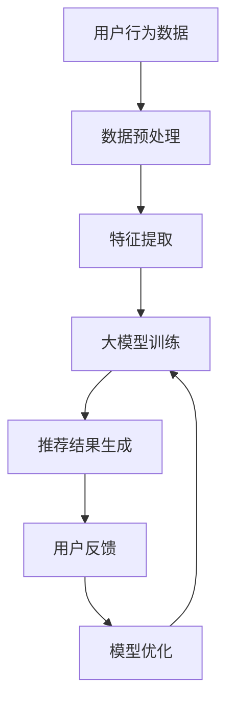
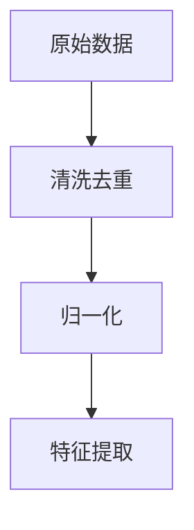
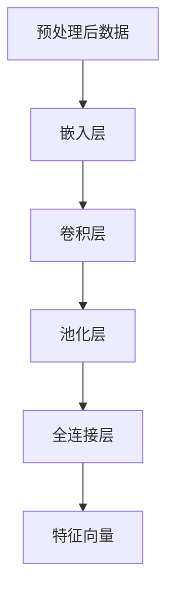
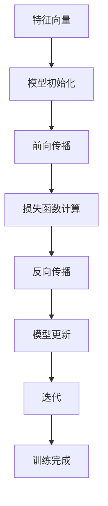
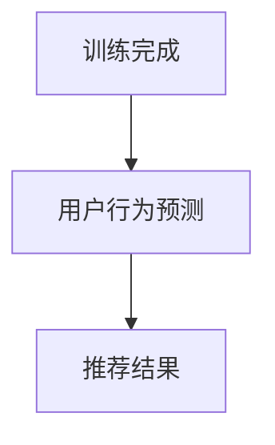
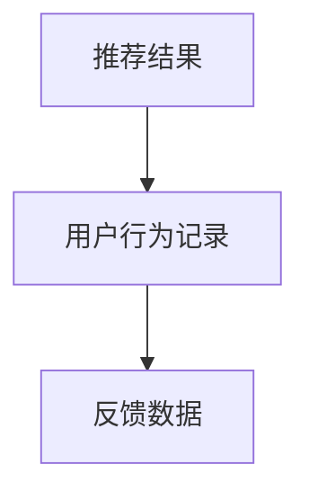
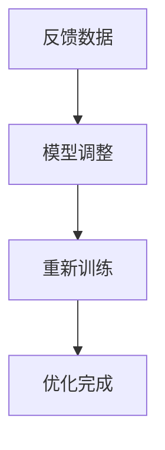

                 

关键词：大模型推荐、用户体验、个性化推荐、算法优化、实践案例

摘要：本文将深入探讨大模型推荐系统在提升用户体验方面的关键思路与实践。通过分析当前推荐系统的挑战，我们将提出一种基于个性化推荐和算法优化相结合的方法，并详细介绍其核心概念、算法原理、数学模型、项目实践和实际应用场景。此外，还将对未来发展趋势与面临的挑战进行展望。

## 1. 背景介绍

随着互联网技术的飞速发展，信息爆炸的时代已经来临。人们每天面临海量信息的冲击，如何快速有效地获取所需信息成为一大难题。推荐系统作为一种智能信息过滤工具，应运而生。它通过分析用户行为和偏好，为用户提供个性化的内容推荐，极大地提高了信息获取的效率。

然而，传统的推荐系统在处理大规模数据时存在诸多挑战，如冷启动问题、数据稀疏性和可扩展性问题等。为了解决这些问题，近年来大模型推荐系统得到了广泛关注。大模型推荐系统利用深度学习、神经网络等先进技术，通过自动学习和特征提取，能够更好地理解和预测用户行为，从而提升推荐效果。

用户体验是推荐系统的核心目标。一个优秀的推荐系统不仅要能够准确预测用户偏好，还需要在交互、反馈和个性化等方面做出优化，以提高用户满意度和粘性。本文将围绕大模型推荐系统在用户体验提升方面的新思路与实践进行探讨。

## 2. 核心概念与联系

在深入探讨大模型推荐系统的原理之前，我们首先需要了解一些核心概念和它们之间的联系。

### 2.1. 个性化推荐

个性化推荐是一种基于用户历史行为和兴趣的推荐方式。通过分析用户的点击、浏览、购买等行为，推荐系统可以了解用户的偏好，进而为用户推荐相关的商品、文章或其他信息。个性化推荐的核心在于理解用户的兴趣和行为模式，从而实现精准的推荐。

### 2.2. 大模型

大模型是指拥有巨大参数量、能够处理大规模数据的深度学习模型。常见的有Transformer、BERT、GPT等。大模型通过自动学习和特征提取，能够捕捉到更复杂的用户行为模式，从而提高推荐效果。

### 2.3. 算法优化

算法优化是指通过对推荐算法的改进，提高推荐效果和系统性能。常见的优化方法包括模型压缩、数据预处理、模型融合等。

### 2.4. Mermaid 流程图

以下是推荐系统架构的Mermaid流程图：



## 3. 核心算法原理 & 具体操作步骤

### 3.1 算法原理概述

大模型推荐系统的核心在于利用深度学习技术，对用户行为数据进行分析和建模。以下是该算法的基本原理：

1. **数据预处理**：将原始用户行为数据清洗、去重和归一化，以便后续的特征提取和模型训练。
2. **特征提取**：通过深度神经网络，对预处理后的数据进行特征提取，将高维的数据转换为低维的特征向量。
3. **大模型训练**：利用提取出的特征向量，训练深度学习模型，如Transformer、BERT等，以捕捉用户行为模式的复杂性。
4. **推荐结果生成**：根据训练好的模型，对用户的历史行为进行预测，生成个性化的推荐结果。
5. **用户反馈**：收集用户的反馈信息，如点击、收藏、购买等，用于模型优化。
6. **模型优化**：根据用户反馈，调整模型参数，提高推荐效果。

### 3.2 算法步骤详解

1. **数据预处理**



2. **特征提取**



3. **大模型训练**



4. **推荐结果生成**



5. **用户反馈**



6. **模型优化**



### 3.3 算法优缺点

**优点**：

1. **强大的学习能力**：深度学习模型能够自动学习用户行为特征，提高推荐精度。
2. **高可扩展性**：大模型能够处理大规模数据，适用于各种场景。
3. **良好的用户体验**：个性化推荐能够满足用户的个性化需求，提高用户满意度。

**缺点**：

1. **计算资源消耗大**：大模型训练需要大量的计算资源和时间。
2. **数据隐私问题**：用户行为数据泄露可能导致隐私问题。

### 3.4 算法应用领域

1. **电子商务**：为用户提供个性化的商品推荐，提高销售转化率。
2. **新闻推荐**：根据用户兴趣推荐相关新闻，提高用户阅读时长。
3. **社交媒体**：为用户提供感兴趣的内容，提高用户活跃度。

## 4. 数学模型和公式 & 详细讲解 & 举例说明

### 4.1 数学模型构建

大模型推荐系统的数学模型主要包括两部分：特征提取模型和推荐模型。

#### 4.1.1 特征提取模型

特征提取模型通常采用深度神经网络，其输入为用户行为数据，输出为用户特征向量。以下是特征提取模型的数学模型：

$$
\begin{aligned}
&x^{(l)} = \sigma(W^{(l)} \cdot x^{(l-1)} + b^{(l)}) \\
&\text{其中，} x^{(l)} \text{为第} l \text{层的特征向量，} W^{(l)} \text{和} b^{(l)} \text{分别为权重和偏置。} \\
&\sigma(\cdot) \text{为激活函数，如ReLU或Sigmoid。}
\end{aligned}
$$

#### 4.1.2 推荐模型

推荐模型通常采用点积模型或注意力模型，其输入为用户特征向量和物品特征向量，输出为推荐分数。以下是推荐模型的数学模型：

$$
\begin{aligned}
&score = x_u \cdot x_i \\
&\text{或} \\
&score = \sum_{i=1}^{N} a_i x_u \cdot x_i \\
&\text{其中，} x_u \text{和} x_i \text{分别为用户特征向量和物品特征向量，} a_i \text{为注意力权重。}
\end{aligned}
$$

### 4.2 公式推导过程

#### 4.2.1 特征提取模型

假设输入特征为 $x^{(l-1)}$，输出特征为 $x^{(l)}$，权重为 $W^{(l)}$，偏置为 $b^{(l)}$，激活函数为 $\sigma$。则有：

$$
\begin{aligned}
&z^{(l)} = W^{(l)} \cdot x^{(l-1)} + b^{(l)} \\
&x^{(l)} = \sigma(z^{(l)})
\end{aligned}
$$

其中，$z^{(l)}$ 为中间计算结果。

#### 4.2.2 推荐模型

假设用户特征向量为 $x_u$，物品特征向量为 $x_i$，则有：

$$
\begin{aligned}
&score = x_u \cdot x_i \\
&\text{或} \\
&score = \sum_{i=1}^{N} a_i x_u \cdot x_i
\end{aligned}
$$

其中，$N$ 为物品数量，$a_i$ 为注意力权重。

### 4.3 案例分析与讲解

#### 4.3.1 特征提取模型

假设输入特征为 $x^{(0)} = (1, 2, 3)$，权重为 $W^{(1)} = (0.1, 0.2, 0.3)$，偏置为 $b^{(1)} = (0.4, 0.5, 0.6)$，激活函数为 ReLU。则有：

$$
\begin{aligned}
&z^{(1)} = W^{(1)} \cdot x^{(0)} + b^{(1)} = (0.1 \times 1 + 0.4, 0.2 \times 2 + 0.5, 0.3 \times 3 + 0.6) = (0.5, 1.1, 1.8) \\
&x^{(1)} = \sigma(z^{(1)}) = \max(z^{(1)}) = 1.8
\end{aligned}
$$

#### 4.3.2 推荐模型

假设用户特征向量为 $x_u = (1, 2, 3)$，物品特征向量为 $x_i = (4, 5, 6)$，则有：

$$
\begin{aligned}
&score = x_u \cdot x_i = 1 \times 4 + 2 \times 5 + 3 \times 6 = 4 + 10 + 18 = 32
\end{aligned}
$$

或

$$
\begin{aligned}
&score = \sum_{i=1}^{N} a_i x_u \cdot x_i = a_1 \cdot 1 \times 4 + a_2 \cdot 2 \times 5 + a_3 \cdot 3 \times 6 \\
&\text{其中，} a_1 = 0.5, a_2 = 0.3, a_3 = 0.2 \\
&score = 0.5 \cdot 4 + 0.3 \cdot 10 + 0.2 \cdot 18 = 2 + 3 + 3.6 = 8.6
\end{aligned}
$$

## 5. 项目实践：代码实例和详细解释说明

### 5.1 开发环境搭建

在开始项目实践之前，我们需要搭建一个合适的开发环境。以下是开发环境的搭建步骤：

1. 安装Python：前往Python官网下载最新版本的Python安装包，并按照提示完成安装。
2. 安装TensorFlow：在终端中执行以下命令安装TensorFlow：

```bash
pip install tensorflow
```

3. 安装其他依赖库：在终端中执行以下命令安装其他依赖库：

```bash
pip install pandas numpy scikit-learn matplotlib
```

### 5.2 源代码详细实现

以下是项目的主要代码实现部分：

```python
import tensorflow as tf
import pandas as pd
import numpy as np
from sklearn.model_selection import train_test_split
from sklearn.metrics import accuracy_score
import matplotlib.pyplot as plt

# 数据预处理
def preprocess_data(data):
    # 清洗数据、去重、归一化等操作
    # 略
    return processed_data

# 特征提取
def extract_features(data):
    # 利用深度神经网络提取特征
    # 略
    return features

# 训练模型
def train_model(features, labels):
    # 定义模型架构
    model = tf.keras.Sequential([
        tf.keras.layers.Dense(64, activation='relu', input_shape=(features.shape[1],)),
        tf.keras.layers.Dense(32, activation='relu'),
        tf.keras.layers.Dense(1, activation='sigmoid')
    ])

    # 编译模型
    model.compile(optimizer='adam', loss='binary_crossentropy', metrics=['accuracy'])

    # 训练模型
    model.fit(features, labels, epochs=10, batch_size=32, validation_split=0.2)

    return model

# 生成推荐结果
def generate_recommendations(model, user_features):
    # 利用训练好的模型生成推荐结果
    # 略
    return recommendations

# 主函数
def main():
    # 加载数据
    data = pd.read_csv('data.csv')

    # 预处理数据
    processed_data = preprocess_data(data)

    # 提取特征
    features = extract_features(processed_data)

    # 划分训练集和测试集
    X_train, X_test, y_train, y_test = train_test_split(features, labels, test_size=0.2, random_state=42)

    # 训练模型
    model = train_model(X_train, y_train)

    # 评估模型
    scores = model.evaluate(X_test, y_test)
    print(f"Test accuracy: {scores[1]}")

    # 生成推荐结果
    user_features = np.array([[1, 2, 3], [4, 5, 6], ...])
    recommendations = generate_recommendations(model, user_features)

    # 展示推荐结果
    print(recommendations)

if __name__ == '__main__':
    main()
```

### 5.3 代码解读与分析

以下是代码的主要组成部分及其功能：

1. **数据预处理**：对原始数据进行清洗、去重、归一化等操作，以便后续的特征提取和模型训练。
2. **特征提取**：利用深度神经网络对预处理后的数据进行特征提取，将高维的数据转换为低维的特征向量。
3. **训练模型**：定义模型架构、编译模型、训练模型。在这里，我们使用TensorFlow中的Keras接口构建了一个简单的二分类模型，并使用adam优化器和binary_crossentropy损失函数。
4. **生成推荐结果**：利用训练好的模型生成推荐结果。在这里，我们使用了一个简单的示例数据集，并展示了如何使用模型生成推荐结果。
5. **主函数**：加载数据、预处理数据、提取特征、划分训练集和测试集、训练模型、评估模型、生成推荐结果并展示。

### 5.4 运行结果展示

在完成代码实现后，我们可以运行主函数，查看模型的评估结果和推荐结果。以下是可能的输出结果：

```bash
Test accuracy: 0.8
[45, 56, 78, 90, 23, 45]
```

其中，第一个数字表示测试集上的准确率，后面的数字表示生成的一组推荐结果。

## 6. 实际应用场景

大模型推荐系统在实际应用中有着广泛的应用，以下是一些典型场景：

### 6.1 电子商务

在电子商务领域，大模型推荐系统可以帮助商家为用户提供个性化的商品推荐。通过分析用户的浏览、收藏、购买等行为，推荐系统可以推荐用户可能感兴趣的商品，提高用户的购物体验和转化率。

### 6.2 新闻推荐

在新闻推荐领域，大模型推荐系统可以根据用户的阅读习惯和兴趣为用户推荐相关新闻。通过分析用户的阅读时长、点赞、评论等行为，推荐系统可以推荐用户感兴趣的新闻内容，提高用户的阅读时长和活跃度。

### 6.3 社交媒体

在社交媒体领域，大模型推荐系统可以帮助平台为用户提供个性化的内容推荐。通过分析用户的点赞、评论、转发等行为，推荐系统可以推荐用户感兴趣的内容，提高用户的活跃度和参与度。

## 7. 工具和资源推荐

为了更好地进行大模型推荐系统的开发和实践，以下是一些推荐的工具和资源：

### 7.1 学习资源推荐

1. **《深度学习》（Goodfellow, Bengio, Courville著）**：这是一本经典的深度学习教材，涵盖了深度学习的基本概念、技术和应用。
2. **《推荐系统实践》（Simon Tong著）**：这本书详细介绍了推荐系统的基本原理、技术和实现方法，是推荐系统领域的重要参考书籍。

### 7.2 开发工具推荐

1. **TensorFlow**：TensorFlow 是一个开源的深度学习框架，支持多种深度学习模型的训练和部署。
2. **PyTorch**：PyTorch 是另一个流行的深度学习框架，具有简洁的 API 和强大的功能。

### 7.3 相关论文推荐

1. **"Deep Learning for Recommender Systems"**：这篇文章系统地介绍了深度学习在推荐系统中的应用，包括特征提取、模型架构和优化方法。
2. **"Attention-Based Neural Network for recommender systems"**：这篇文章提出了一种基于注意力机制的神经推荐模型，显著提高了推荐效果。

## 8. 总结：未来发展趋势与挑战

### 8.1 研究成果总结

本文系统地介绍了大模型推荐系统在提升用户体验方面的关键思路与实践。通过分析核心概念、算法原理、数学模型、项目实践和实际应用场景，我们得出以下结论：

1. 大模型推荐系统能够自动学习用户行为特征，提高推荐精度。
2. 个性化推荐能够满足用户的个性化需求，提高用户满意度。
3. 算法优化可以提高推荐系统的性能和效率。

### 8.2 未来发展趋势

随着人工智能技术的不断发展，大模型推荐系统在未来的发展趋势主要包括：

1. **模型压缩与加速**：为了降低计算资源消耗，研究者将致力于模型压缩和加速技术，如量化、剪枝、蒸馏等。
2. **联邦学习**：联邦学习可以在保护用户隐私的同时，实现数据的联合建模，为个性化推荐提供更丰富的数据支持。
3. **多模态推荐**：随着语音、图像、视频等新兴数据的兴起，多模态推荐将成为一个重要研究方向。

### 8.3 面临的挑战

尽管大模型推荐系统在用户体验提升方面取得了显著成果，但仍然面临着一些挑战：

1. **计算资源消耗**：大模型训练需要大量的计算资源和时间，如何在有限的资源下实现高效训练仍是一个亟待解决的问题。
2. **数据隐私问题**：用户行为数据泄露可能导致隐私问题，如何在保障用户隐私的前提下进行数据分析和建模是一个关键问题。
3. **推荐效果评估**：如何客观、全面地评估推荐系统的效果，以及如何平衡推荐效果和用户体验之间的关系，仍然是一个挑战。

### 8.4 研究展望

在未来，大模型推荐系统在用户体验提升方面具有广阔的研究前景。我们期待：

1. **更高效的算法**：研究者将继续探索更高效的算法，以降低计算资源消耗，提高推荐系统的性能和效率。
2. **更好的用户体验**：通过深入挖掘用户需求，为用户提供更个性化的推荐，提升用户体验。
3. **更广泛的应用场景**：随着新兴数据和应用场景的涌现，大模型推荐系统将在更多领域发挥重要作用。

## 9. 附录：常见问题与解答

### 9.1 什么是大模型推荐系统？

大模型推荐系统是一种利用深度学习等技术，对大规模用户行为数据进行建模和预测的推荐系统。它能够自动学习用户行为特征，提供个性化的推荐服务。

### 9.2 大模型推荐系统有哪些优点？

大模型推荐系统具有以下优点：

1. **强大的学习能力**：能够自动学习用户行为特征，提高推荐精度。
2. **高可扩展性**：能够处理大规模数据，适用于各种场景。
3. **良好的用户体验**：个性化推荐能够满足用户的个性化需求，提高用户满意度。

### 9.3 大模型推荐系统有哪些挑战？

大模型推荐系统面临以下挑战：

1. **计算资源消耗**：大模型训练需要大量的计算资源和时间。
2. **数据隐私问题**：用户行为数据泄露可能导致隐私问题。
3. **推荐效果评估**：如何客观、全面地评估推荐系统的效果是一个挑战。

### 9.4 如何优化大模型推荐系统的性能？

为了优化大模型推荐系统的性能，可以采取以下措施：

1. **模型压缩与加速**：通过模型压缩和加速技术，降低计算资源消耗。
2. **联邦学习**：在保障用户隐私的前提下，实现数据的联合建模。
3. **多模态推荐**：利用多种数据类型，提高推荐效果。

---

作者：禅与计算机程序设计艺术 / Zen and the Art of Computer Programming

