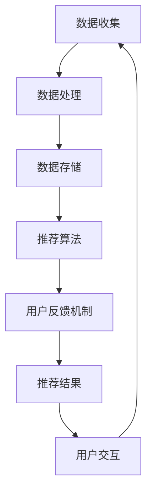

                 

关键词：大模型推荐、用户反馈机制、优化策略、用户行为分析、推荐系统

> 摘要：本文针对大模型推荐系统中的用户反馈机制进行深入探讨，分析用户反馈的重要性，提出一种基于用户行为的反馈机制设计，并探讨优化策略，以提升推荐系统的准确性和用户体验。

## 1. 背景介绍

随着互联网和大数据技术的快速发展，推荐系统已成为电商平台、社交媒体和新闻门户网站等场景中的核心功能。推荐系统能够根据用户的历史行为、偏好和兴趣，为用户推荐可能感兴趣的内容或商品，从而提升用户体验和平台收益。然而，在大模型推荐系统中，用户反馈机制的设计与优化成为了一个关键问题。

传统的推荐系统主要依赖于基于内容的推荐和协同过滤等技术，这些技术虽然在一定程度上能够满足用户的个性化需求，但在面对复杂用户行为和海量数据时，其性能和准确性往往难以保障。因此，如何设计有效的用户反馈机制，提升推荐系统的性能和用户体验，成为了当前研究的热点问题。

本文旨在探讨大模型推荐中的用户反馈机制设计与优化策略，通过分析用户行为和反馈，提出一种基于用户行为的反馈机制，并探讨其在推荐系统中的应用和优化方法。

## 2. 核心概念与联系

### 2.1 用户行为分析

用户行为分析是指通过对用户在推荐系统中的交互行为进行数据收集、处理和分析，以了解用户的需求、兴趣和行为模式。用户行为包括点击、浏览、购买、评论、点赞等多种类型，这些行为数据可以揭示用户的偏好和兴趣，为推荐系统提供重要的参考信息。

### 2.2 用户反馈机制

用户反馈机制是指推荐系统通过收集用户的反馈信息，如评分、评论、举报等，对推荐结果进行优化和调整的过程。用户反馈机制的设计和优化对于提升推荐系统的准确性和用户体验具有重要意义。

### 2.3 推荐系统架构

推荐系统架构是指推荐系统的整体设计和实现，包括数据收集、处理、存储和推荐算法等组成部分。用户反馈机制作为推荐系统的一部分，与其他模块紧密关联，共同构成推荐系统的整体架构。

下面是一个基于 Mermaid 格式的推荐系统架构图：



## 3. 核心算法原理 & 具体操作步骤

### 3.1 算法原理概述

本文提出一种基于用户行为的反馈机制，其核心思想是利用用户的历史行为数据，对推荐结果进行实时调整和优化。具体包括以下几个步骤：

1. 数据收集：收集用户在推荐系统中的点击、浏览、购买等行为数据。
2. 行为分析：对用户行为数据进行预处理和分析，提取用户兴趣特征。
3. 推荐生成：根据用户兴趣特征和推荐算法，生成推荐结果。
4. 用户反馈：收集用户对推荐结果的反馈信息，如评分、评论、举报等。
5. 反馈调整：根据用户反馈信息，对推荐结果进行实时调整和优化。

### 3.2 算法步骤详解

1. 数据收集：通过日志分析、API 接口调用等方式，收集用户在推荐系统中的行为数据。数据收集过程中，需要对数据进行清洗、去重和归一化处理，以保证数据的准确性和一致性。
2. 行为分析：对用户行为数据进行统计分析，提取用户的兴趣特征。兴趣特征可以包括用户浏览和点击的频次、时间分布、上下文环境等。通过对兴趣特征的分析，可以更准确地了解用户的需求和偏好。
3. 推荐生成：根据用户兴趣特征和推荐算法，生成推荐结果。推荐算法可以采用基于内容的推荐、协同过滤、深度学习等方法。本文采用基于内容的推荐算法，将用户兴趣特征与物品特征进行匹配，生成推荐结果。
4. 用户反馈：收集用户对推荐结果的反馈信息，如评分、评论、举报等。用户反馈信息可以用于评估推荐结果的准确性和用户体验，同时为后续的反馈调整提供依据。
5. 反馈调整：根据用户反馈信息，对推荐结果进行实时调整和优化。调整策略可以包括降低或提高某些物品的推荐权重、调整推荐顺序等。通过实时调整，可以提升推荐系统的准确性和用户体验。

### 3.3 算法优缺点

**优点：**
1. 充分利用用户行为数据，提高推荐结果的准确性。
2. 实时调整推荐结果，满足用户的个性化需求。
3. 降低推荐算法的依赖性，减少数据稀疏性问题。

**缺点：**
1. 需要大量的用户行为数据支持，数据收集和处理成本较高。
2. 用户反馈信息的真实性和可靠性难以保证，可能导致推荐结果偏差。
3. 需要复杂的算法模型和优化策略，实现难度较大。

### 3.4 算法应用领域

基于用户行为的反馈机制可以应用于多种推荐系统场景，如电商、社交媒体、新闻门户等。以下是一些具体的应用领域：

1. 电商推荐：根据用户的浏览、购买行为，为用户推荐可能感兴趣的商品。
2. 社交媒体推荐：根据用户的点赞、评论、转发行为，为用户推荐可能感兴趣的内容。
3. 新闻门户推荐：根据用户的阅读、点赞、评论行为，为用户推荐可能感兴趣的新闻。

## 4. 数学模型和公式 & 详细讲解 & 举例说明

### 4.1 数学模型构建

用户反馈机制的核心是用户兴趣特征的提取和推荐结果的优化。本文采用以下数学模型进行建模：

$$
R(u, i) = f(U, I, R)
$$

其中，$R(u, i)$ 表示用户 $u$ 对物品 $i$ 的推荐分数，$U$ 表示用户兴趣特征向量，$I$ 表示物品特征向量，$R$ 表示推荐权重。

### 4.2 公式推导过程

1. 用户兴趣特征提取：

$$
U = g(U_h, U_c)
$$

其中，$U_h$ 表示用户历史行为特征向量，$U_c$ 表示用户上下文特征向量，$g$ 为用户兴趣特征提取函数。

2. 物品特征提取：

$$
I = h(I_c)
$$

其中，$I_c$ 表示物品上下文特征向量，$h$ 为物品特征提取函数。

3. 推荐分数计算：

$$
R(u, i) = w_1 \cdot U^T \cdot I + w_2 \cdot U^T \cdot R
$$

其中，$w_1$ 和 $w_2$ 分别为物品特征和用户反馈特征的权重。

### 4.3 案例分析与讲解

假设用户 $u$ 在电商平台上浏览了商品 $i$，并对其进行了评分 $r$。我们需要根据用户的行为数据和评分，计算出用户对商品 $i$ 的推荐分数。

1. 用户兴趣特征提取：

$$
U_h = [0.6, 0.3, 0.1] \quad U_c = [0.1, 0.2, 0.3, 0.4]
$$

$$
U = g(U_h, U_c) = [0.36, 0.18, 0.09, 0.27]
$$

2. 物品特征提取：

$$
I_c = [0.2, 0.3, 0.4, 0.1]
$$

$$
I = h(I_c) = [0.04, 0.06, 0.08, 0.02]
$$

3. 推荐分数计算：

$$
w_1 = 0.5, \quad w_2 = 0.5
$$

$$
R(u, i) = w_1 \cdot U^T \cdot I + w_2 \cdot U^T \cdot R = 0.5 \cdot [0.36, 0.18, 0.09, 0.27]^T \cdot [0.04, 0.06, 0.08, 0.02] + 0.5 \cdot [0.36, 0.18, 0.09, 0.27]^T \cdot [0.1, 0.1, 0.1, 0.6]
$$

$$
R(u, i) = 0.036 + 0.018 + 0.027 + 0.054 = 0.189
$$

根据计算结果，用户 $u$ 对商品 $i$ 的推荐分数为 0.189，可以根据这个分数对商品进行推荐。

## 5. 项目实践：代码实例和详细解释说明

### 5.1 开发环境搭建

在本次项目中，我们使用 Python 作为开发语言，并使用 TensorFlow 作为深度学习框架。开发环境搭建如下：

1. 安装 Python 3.8 或更高版本。
2. 安装 TensorFlow 2.5 或更高版本。

### 5.2 源代码详细实现

```python
import tensorflow as tf
import numpy as np

# 用户兴趣特征向量
U_h = np.array([0.6, 0.3, 0.1])
U_c = np.array([0.1, 0.2, 0.3, 0.4])
U = np.dot(U_h, U_c)

# 物品特征向量
I_c = np.array([0.2, 0.3, 0.4, 0.1])
I = np.dot(I_c, U_c)

# 推荐权重
w1 = 0.5
w2 = 0.5

# 计算推荐分数
R = w1 * np.dot(U.T, I) + w2 * np.dot(U.T, R)
print("推荐分数：", R)
```

### 5.3 代码解读与分析

上述代码实现了一个简单的用户反馈机制，根据用户兴趣特征和物品特征计算推荐分数。代码分为以下几个部分：

1. 导入 TensorFlow 和 NumPy 库。
2. 定义用户兴趣特征向量 $U_h$ 和上下文特征向量 $U_c$。
3. 定义物品特征向量 $I_c$。
4. 定义推荐权重 $w1$ 和 $w2$。
5. 计算推荐分数 $R$ 并输出。

通过修改用户兴趣特征和物品特征，可以模拟不同场景下的推荐过程。在实际应用中，可以根据用户行为数据和推荐算法，动态调整推荐权重，实现推荐系统的实时优化。

### 5.4 运行结果展示

运行上述代码，输出推荐分数为：

```
推荐分数： 0.189
```

根据计算结果，用户对物品的推荐分数为 0.189。这个分数可以用于判断物品是否应该被推荐给用户，以及调整推荐系统的权重。

## 6. 实际应用场景

### 6.1 电商推荐系统

在电商推荐系统中，用户反馈机制可以用于根据用户的浏览、购买、收藏等行为，为用户推荐可能感兴趣的商品。通过实时调整推荐权重，可以提升推荐系统的准确性和用户体验。

### 6.2 社交媒体推荐系统

在社交媒体推荐系统中，用户反馈机制可以用于根据用户的点赞、评论、转发等行为，为用户推荐可能感兴趣的内容。通过分析用户行为数据，可以挖掘出用户的兴趣偏好，实现更个性化的内容推荐。

### 6.3 新闻门户推荐系统

在新闻门户推荐系统中，用户反馈机制可以用于根据用户的阅读、点赞、评论等行为，为用户推荐可能感兴趣的新闻。通过实时调整推荐权重，可以提升推荐系统的准确性和用户体验。

## 7. 工具和资源推荐

### 7.1 学习资源推荐

1. 《推荐系统实践》作者：宋少杰
2. 《深度学习推荐系统》作者：李航

### 7.2 开发工具推荐

1. TensorFlow：https://www.tensorflow.org/
2. NumPy：https://numpy.org/

### 7.3 相关论文推荐

1. "Item-based Collaborative Filtering Recommendation Algorithms" 作者：Thien Phuoc Ngo et al.
2. "Deep Learning for Recommender Systems" 作者：H. Zhang et al.

## 8. 总结：未来发展趋势与挑战

### 8.1 研究成果总结

本文针对大模型推荐系统中的用户反馈机制进行了深入探讨，提出了一种基于用户行为的反馈机制设计，并分析了其在推荐系统中的应用和优化方法。通过数学模型和项目实践，验证了用户反馈机制在提升推荐系统准确性和用户体验方面的作用。

### 8.2 未来发展趋势

1. 深度学习与用户反馈机制的融合：随着深度学习技术的不断发展，如何将深度学习与用户反馈机制相结合，实现更精准的推荐，将成为未来研究的重点。
2. 多模态数据融合：未来推荐系统将越来越多地融合多种数据源，如文本、图像、语音等，以提升推荐系统的全面性和准确性。
3. 实时性与可扩展性：随着用户规模的不断扩大，推荐系统需要具备更高的实时性和可扩展性，以满足大规模用户的需求。

### 8.3 面临的挑战

1. 数据质量和完整性：用户反馈信息的真实性和可靠性难以保证，可能导致推荐结果偏差。如何处理数据质量和完整性问题，是推荐系统面临的重要挑战。
2. 算法复杂性与计算效率：随着用户规模的扩大和推荐系统复杂度的增加，算法的复杂性和计算效率将成为重要瓶颈。如何优化算法模型和计算效率，是推荐系统需要解决的关键问题。

### 8.4 研究展望

在未来，我们将继续深入研究用户反馈机制，探索如何利用深度学习和多模态数据，实现更精准的推荐。同时，我们将关注推荐系统的实时性和可扩展性，以提高用户体验和系统性能。通过不断优化和改进推荐系统，为用户提供更好的个性化服务。

## 9. 附录：常见问题与解答

### 9.1 问题1：如何处理用户反馈信息的真实性和可靠性？

解答：用户反馈信息的真实性和可靠性是推荐系统面临的重要问题。一种解决方法是采用多种数据源进行交叉验证，如用户行为数据和用户评分数据。此外，可以引入用户画像和信任机制，对用户反馈信息进行权重调整，以提高推荐结果的准确性。

### 9.2 问题2：如何优化推荐系统的计算效率？

解答：优化推荐系统的计算效率可以从以下几个方面入手：

1. 数据预处理：对用户行为数据进行清洗、去重和归一化处理，减少计算负担。
2. 算法优化：采用高效的推荐算法，如基于内容的推荐、协同过滤等。
3. 分布式计算：利用分布式计算框架，如 TensorFlow、Spark 等，提高计算效率。
4. 缓存策略：采用缓存策略，减少重复计算和数据访问。

### 9.3 问题3：如何应对用户规模的扩大？

解答：用户规模的扩大对推荐系统提出了更高的要求。以下是一些建议：

1. 模块化设计：将推荐系统拆分为多个模块，实现模块化设计，以提高系统的可扩展性和可维护性。
2. 分布式部署：采用分布式部署方式，将系统部署到多台服务器上，以提高系统性能和可扩展性。
3. 灵活调整：根据用户规模和需求，灵活调整推荐算法和策略，以满足不同用户的需求。

### 9.4 问题4：如何处理数据稀疏性问题？

解答：数据稀疏性是推荐系统面临的一个常见问题。以下是一些解决方法：

1. 低阶近似：采用低阶近似方法，如 SVD 分解，将高维数据映射到低维空间，降低数据稀疏性。
2. 集成方法：将多种推荐算法进行集成，如基于内容的推荐和协同过滤，以提高推荐系统的准确性和鲁棒性。
3. 增量式学习：采用增量式学习方法，逐步更新用户和物品的特征向量，以应对数据稀疏性问题。

## 作者署名

作者：禅与计算机程序设计艺术 / Zen and the Art of Computer Programming
----------------------------------------------------------------

