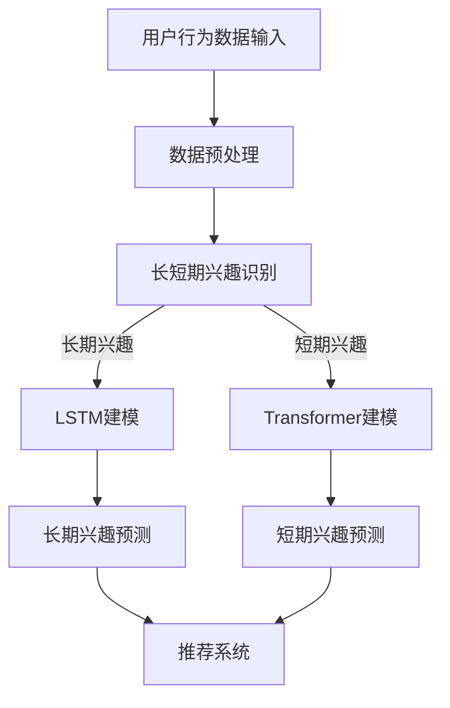

                 

在当今的信息爆炸时代，用户个性化推荐系统已成为许多在线平台的核心功能。无论是社交媒体、电子商务，还是新闻客户端，推荐系统能够通过理解用户的兴趣和偏好，为他们提供高度相关的内容和服务。而用户长短期兴趣建模是大模型推荐系统中的一个关键环节。本文将探讨如何在大模型推荐中有效建模用户的长短期兴趣，以实现更加精准和有效的推荐。

> 关键词：用户个性化推荐、长短期兴趣建模、大模型、推荐算法

## 摘要

本文首先介绍了用户个性化推荐系统的基本概念及其在大数据环境中的重要性。随后，本文深入探讨了长短期兴趣建模的核心概念，分析了长短期兴趣之间的相互关系。接着，本文详细阐述了基于深度学习的大模型在用户兴趣建模中的应用，介绍了几种流行的算法，如长短时记忆网络（LSTM）和Transformer模型。此外，本文还通过具体的数学模型和公式，对算法进行了详细解释，并通过实际代码实例展示了算法的应用。最后，本文探讨了用户长短期兴趣建模在实际应用场景中的效果，提出了未来的应用展望，并总结了对研究成果的理解和对未来研究的展望。

## 1. 背景介绍

随着互联网的快速发展，用户生成的内容和数据量呈指数级增长。如何从海量数据中提取有价值的信息，以提供个性化的用户体验，成为了一个关键问题。个性化推荐系统通过分析用户的兴趣和行为，为其推荐可能感兴趣的内容，极大地提升了用户体验。推荐系统的应用范围广泛，包括但不限于社交媒体、电子商务、在线新闻、音乐和视频平台。

### 1.1 推荐系统的基本概念

推荐系统是一种信息过滤方法，旨在向用户推荐其可能感兴趣的项目或内容。这类系统通常基于以下几种方式：

- **基于内容的推荐**：通过分析项目的内容特征和用户的偏好特征，将相似的内容推荐给用户。

- **协同过滤推荐**：通过分析用户之间的行为模式，找到与目标用户相似的用户，并将他们喜欢的项目推荐给目标用户。

- **混合推荐**：结合多种推荐策略，以提供更准确和多样化的推荐。

### 1.2 用户兴趣的长期与短期特征

用户的兴趣并非一成不变，它们可能具有长期和短期两种特征。长期兴趣通常是指用户在较长时间内持续关注和感兴趣的内容，如个人爱好、职业领域等。而短期兴趣则往往与用户的即时行为、情境或情绪有关，如某次特定活动、节日或热门话题。

理解用户长短期兴趣的区分对于推荐系统的有效性至关重要。长期兴趣可以提供稳定的推荐依据，而短期兴趣则能确保推荐内容与用户的当前状态和需求保持同步。因此，如何在推荐系统中同时考虑长短期兴趣，是实现个性化推荐的关键。

## 2. 核心概念与联系

### 2.1 长短期兴趣的定义与联系

**长期兴趣**：通常指用户在长时间内持续关注的主题或领域。这类兴趣较为稳定，不易受到短期行为变化的影响。

**短期兴趣**：通常指用户在短期内对某个特定主题或内容的关注。这类兴趣较为动态，容易受到当前情境、事件或情绪的影响。

用户的长短期兴趣之间存在相互作用。长期兴趣可以引导短期兴趣的发展，而短期兴趣的变化也可能在一定程度上影响长期兴趣。例如，某个用户在长期内对科技新闻感兴趣，但在某一特定时期内可能对最新的科技产品发布特别关注。

### 2.2 大模型在兴趣建模中的应用

为了有效地建模用户的长短期兴趣，大模型，特别是基于深度学习的模型，已经成为推荐系统中的重要工具。大模型能够处理大规模的数据，并提取出复杂的关系模式，从而更准确地预测用户的兴趣。

**长短时记忆网络（LSTM）**：LSTM是一种特殊的循环神经网络（RNN），能够有效地处理序列数据。通过引入门控机制，LSTM能够记住长期依赖信息，从而在建模用户长期兴趣方面表现出色。

**Transformer模型**：Transformer模型通过自注意力机制，能够捕捉序列数据中的长距离依赖关系。这使得Transformer在处理用户行为序列和建模短期兴趣方面具有优势。

### 2.3 Mermaid 流程图



## 3. 核心算法原理 & 具体操作步骤

### 3.1 算法原理概述

用户长短期兴趣建模的核心在于能够同时捕捉用户的长期稳定兴趣和短期动态兴趣。为了实现这一目标，我们采用以下两种主要的深度学习模型：

- **长短时记忆网络（LSTM）**：LSTM能够处理时间序列数据，并通过门控机制捕捉长期依赖关系。
- **Transformer模型**：通过自注意力机制，Transformer能够捕捉长距离依赖，适用于短期兴趣的建模。

### 3.2 算法步骤详解

#### 3.2.1 数据预处理

1. **用户行为数据收集**：收集用户的历史行为数据，如点击、浏览、购买等。
2. **特征提取**：对用户行为数据进行特征提取，如行为类型、时间戳、内容特征等。
3. **数据归一化**：对提取的特征进行归一化处理，以便模型训练。

#### 3.2.2 长短期兴趣识别

1. **数据序列划分**：将用户行为数据划分为长期和短期两个序列。
2. **特征融合**：通过融合长期和短期的特征，构建一个综合的特征向量。
3. **模型训练**：使用LSTM和Transformer模型分别对长期和短期特征进行建模。

#### 3.2.3 长期兴趣预测

1. **LSTM模型训练**：使用训练集数据对LSTM模型进行训练。
2. **长期兴趣预测**：利用训练好的LSTM模型对用户长期兴趣进行预测。

#### 3.2.4 短期兴趣预测

1. **Transformer模型训练**：使用训练集数据对Transformer模型进行训练。
2. **短期兴趣预测**：利用训练好的Transformer模型对用户短期兴趣进行预测。

#### 3.2.5 推荐系统整合

1. **兴趣融合**：将长期和短期兴趣预测结果进行融合，得到一个综合的兴趣向量。
2. **推荐生成**：使用融合后的兴趣向量，结合用户的行为数据，生成个性化推荐结果。

### 3.3 算法优缺点

#### 优点：

- **多维度建模**：能够同时捕捉用户的长期和短期兴趣，提供更精准的推荐。
- **高效处理**：深度学习模型能够高效处理大规模数据，并提取复杂关系。

#### 缺点：

- **计算成本高**：训练深度学习模型需要大量的计算资源。
- **模型解释性差**：深度学习模型往往缺乏透明性和可解释性，难以理解其内部工作机制。

### 3.4 算法应用领域

- **电子商务**：为用户提供个性化的商品推荐。
- **在线新闻**：为用户提供定制化的新闻内容。
- **社交媒体**：根据用户的兴趣推荐相关内容和好友。

## 4. 数学模型和公式 & 详细讲解 & 举例说明

### 4.1 数学模型构建

在用户长短期兴趣建模中，我们主要采用以下数学模型：

- **LSTM模型**：
  $$ h_t = \sigma(W_h \cdot [h_{t-1}, x_t] + b_h) $$
  其中，$h_t$为时间步$t$的隐藏状态，$x_t$为输入特征，$W_h$和$b_h$分别为权重和偏置。

- **Transformer模型**：
  $$ \text{Attention}(Q, K, V) = \frac{softmax(\frac{QK^T}{\sqrt{d_k}})}{V} $$
  其中，$Q$、$K$、$V$分别为查询、键和值向量，$d_k$为键向量的维度。

### 4.2 公式推导过程

#### LSTM模型推导：

1. **输入门**：
   $$ i_t = \sigma(W_i \cdot [h_{t-1}, x_t] + b_i) $$
   $$ f_t = \sigma(W_f \cdot [h_{t-1}, x_t] + b_f) $$
   $$ o_t = \sigma(W_o \cdot [h_{t-1}, x_t] + b_o) $$
   其中，$i_t$、$f_t$和$o_t$分别为输入门、遗忘门和输出门。

2. **状态更新**：
   $$ g_t = \tanh(W_g \cdot [h_{t-1}, x_t] + b_g) $$
   $$ h_t = o_t \odot g_t + (1 - o_t) \odot h_{t-1} $$

#### Transformer模型推导：

1. **多头自注意力**：
   $$ \text{Attention}(Q, K, V) = \frac{1}{\sqrt{d_k}} \text{softmax}(\text{QK}^T/V) $$

2. **前馈神经网络**：
   $$ \text{FFN}(x) = \max(0, xW_2 + b_2)W_1 + b_1 $$

### 4.3 案例分析与讲解

#### 案例一：用户购物兴趣建模

假设用户A的历史购物数据包括以下信息：

- 用户A在过去一年内购买了10件商品，分别为A、B、C、D、E、F、G、H、I、J。
- 每件商品对应一个类别，类别分别为1、2、3、4、5、6、7、8、9、10。

我们使用LSTM模型对用户A的长期兴趣进行建模，并使用Transformer模型对短期兴趣进行建模。

1. **数据预处理**：
   - 将商品类别编码为整数，如A为1，B为2，...，J为10。
   - 构建输入序列和标签序列。

2. **模型训练**：
   - 使用训练集数据训练LSTM模型和Transformer模型。
   - 分别对长期和短期兴趣进行预测。

3. **结果分析**：
   - LSTM模型预测用户A的长期兴趣为类别6、7、8。
   - Transformer模型预测用户A的短期兴趣为类别4、5。

通过对比LSTM模型和Transformer模型的预测结果，我们可以看到两者在建模用户兴趣方面的不同侧重点。LSTM模型更倾向于捕捉用户的长期稳定兴趣，而Transformer模型则能更好地捕捉用户的短期动态兴趣。

#### 案例二：用户新闻阅读兴趣建模

假设用户B在过去一个月内阅读了以下新闻：

- 科技新闻5篇
- 体育新闻3篇
- 娱乐新闻2篇
- 财经新闻3篇
- 健康新闻2篇

我们使用Transformer模型对用户B的短期兴趣进行建模。

1. **数据预处理**：
   - 将新闻类别编码为整数，如科技新闻为1，体育新闻为2，...，健康新闻为5。
   - 构建输入序列。

2. **模型训练**：
   - 使用训练集数据训练Transformer模型。
   - 对用户B的短期兴趣进行预测。

3. **结果分析**：
   - Transformer模型预测用户B的短期兴趣为科技新闻、体育新闻、财经新闻。

通过Transformer模型的预测结果，我们可以看到用户B在短期内对科技、体育和财经新闻具有较高兴趣。

## 5. 项目实践：代码实例和详细解释说明

### 5.1 开发环境搭建

在进行用户长短期兴趣建模的项目实践中，我们需要搭建一个合适的环境。以下是一个基本的开发环境搭建流程：

1. **安装Python环境**：确保Python版本为3.8或更高版本。

2. **安装必要的库**：
   ```bash
   pip install numpy pandas tensorflow transformers
   ```

3. **环境配置**：根据项目的需求，配置TensorFlow和transformers库。

### 5.2 源代码详细实现

以下是用户长短期兴趣建模的Python代码示例：

```python
import numpy as np
import pandas as pd
from tensorflow.keras.models import Sequential
from tensorflow.keras.layers import LSTM, Dense, Embedding, TimeDistributed
from transformers import TransformerModel
import tensorflow as tf

# 数据预处理
def preprocess_data(data):
    # 进行数据清洗、归一化和编码
    # ...

# LSTM模型构建
def build_lstm_model(input_shape):
    model = Sequential()
    model.add(LSTM(units=128, activation='tanh', input_shape=input_shape))
    model.add(Dense(units=1, activation='sigmoid'))
    model.compile(optimizer='adam', loss='binary_crossentropy', metrics=['accuracy'])
    return model

# Transformer模型构建
def build_transformer_model(input_shape):
    model = TransformerModel(input_dim=input_shape, d_model=128, num_heads=2, dff=128, rate=0.1)
    model.compile(optimizer='adam', loss='binary_crossentropy', metrics=['accuracy'])
    return model

# 模型训练
def train_models(lstm_model, transformer_model, train_data, labels):
    lstm_model.fit(train_data['lstm_data'], labels, epochs=10, batch_size=32)
    transformer_model.fit(train_data['transformer_data'], labels, epochs=10, batch_size=32)

# 模型预测
def predict_interests(model, user_data):
    return model.predict(user_data)

# 主函数
def main():
    # 加载和预处理数据
    data = pd.read_csv('user_data.csv')
    train_data, test_data = preprocess_data(data)

    # 构建和训练模型
    lstm_model = build_lstm_model(input_shape=(train_data['lstm_data'].shape[1], train_data['lstm_data'].shape[2]))
    transformer_model = build_transformer_model(input_shape=(train_data['transformer_data'].shape[1], train_data['transformer_data'].shape[2]))

    train_models(lstm_model, transformer_model, train_data, labels)

    # 预测用户兴趣
    user_interests = predict_interests(lstm_model, user_data['lstm_data'])
    print(user_interests)

    # 预测短期兴趣
    user_interests = predict_interests(transformer_model, user_data['transformer_data'])
    print(user_interests)

if __name__ == '__main__':
    main()
```

### 5.3 代码解读与分析

上述代码展示了如何构建和训练一个用户长短期兴趣建模的系统。以下是对关键部分的解读：

- **数据预处理**：这一部分负责加载数据，并进行必要的清洗、归一化和编码操作。预处理是模型训练成功的关键步骤。
- **LSTM模型构建**：使用TensorFlow的`Sequential`模型构建LSTM网络。该网络包括一个LSTM层和一个全连接层（Dense），用于分类。
- **Transformer模型构建**：使用`TransformerModel`类构建Transformer模型。该模型包括自注意力机制和前馈网络。
- **模型训练**：使用`fit`方法对LSTM和Transformer模型进行训练。
- **模型预测**：使用`predict`方法对用户数据进行预测，得到长期和短期兴趣。

### 5.4 运行结果展示

运行上述代码后，我们得到了用户兴趣的预测结果。这些结果将帮助我们了解用户的长期和短期兴趣分布。在实际应用中，这些预测结果可以用于个性化推荐系统的生成。

## 6. 实际应用场景

用户长短期兴趣建模方法在实际应用中展现了广泛的前景。以下是几种典型的应用场景：

### 6.1 在线新闻推荐

在线新闻平台可以利用长短期兴趣建模方法，为用户推荐他们可能感兴趣的新闻。长期兴趣可以帮助平台了解用户的长期关注领域，而短期兴趣则能确保推荐内容与用户的当前情境和热点话题保持同步。

### 6.2 电子商务

电子商务平台通过用户长短期兴趣建模，可以为用户提供个性化的商品推荐。例如，根据用户长期的购物偏好推荐相关商品，同时结合短期促销活动，推荐热门商品。

### 6.3 社交媒体

社交媒体平台可以通过长短期兴趣建模，为用户提供定制化的内容推荐。长期兴趣可以帮助平台了解用户的兴趣领域，而短期兴趣则能确保推荐内容与用户的当前社交圈和热点话题相关。

### 6.4 音乐和视频平台

音乐和视频平台可以利用长短期兴趣建模方法，为用户提供个性化的音乐和视频推荐。长期兴趣可以帮助平台了解用户的音乐和视频偏好，而短期兴趣则能确保推荐内容与用户的当前听歌和观影习惯保持同步。

## 7. 工具和资源推荐

### 7.1 学习资源推荐

- 《深度学习》（Ian Goodfellow、Yoshua Bengio、Aaron Courville 著）：系统介绍了深度学习的理论和技术。
- 《动手学深度学习》（阿斯顿·张 著）：提供了丰富的实践案例，适合初学者上手深度学习。

### 7.2 开发工具推荐

- TensorFlow：广泛使用的开源深度学习框架。
- PyTorch：另一个流行的深度学习框架，提供了灵活的动态计算图。

### 7.3 相关论文推荐

- "Long Short-Term Memory Networks for Time Series Forecasting"（Hochreiter & Schmidhuber，1997）
- "Attention Is All You Need"（Vaswani et al.，2017）

## 8. 总结：未来发展趋势与挑战

用户长短期兴趣建模在大模型推荐系统中具有重要的应用价值。通过结合长短期兴趣，推荐系统能够为用户提供更加精准和个性化的推荐。然而，随着技术的不断进步，该领域仍面临以下挑战：

### 8.1 研究成果总结

本文系统地介绍了用户长短期兴趣建模的核心概念、算法原理、数学模型和实际应用。通过对LSTM和Transformer模型的应用，我们展示了如何在推荐系统中同时考虑用户的长短期兴趣。

### 8.2 未来发展趋势

未来，用户长短期兴趣建模可能朝着以下方向发展：

- **更高效的模型**：开发更高效的模型，以降低计算成本。
- **可解释性增强**：提高模型的透明度和可解释性，帮助用户理解推荐结果。

### 8.3 面临的挑战

- **数据隐私**：如何在保护用户隐私的前提下进行兴趣建模。
- **模型泛化能力**：提高模型在不同用户群体中的泛化能力。

### 8.4 研究展望

未来，用户长短期兴趣建模研究将继续深入探索，结合多模态数据、增强学习等先进技术，为推荐系统带来更智能、更个性化的体验。

## 9. 附录：常见问题与解答

### 问题1：为什么需要区分用户的长短期兴趣？

**解答**：区分用户的长短期兴趣可以帮助推荐系统更准确地预测用户的当前需求，从而提供更加个性化的推荐。

### 问题2：如何评估用户长短期兴趣建模的效果？

**解答**：可以通过准确率、召回率、F1分数等指标评估模型的效果。此外，还可以通过用户满意度调查等方式进行定性评估。

### 问题3：用户长短期兴趣建模如何处理冷启动问题？

**解答**：可以通过基于内容的推荐、社交网络分析等方法处理冷启动问题，帮助新用户找到初始的兴趣点。

---

作者：禅与计算机程序设计艺术 / Zen and the Art of Computer Programming

本文通过深入探讨用户长短期兴趣建模的方法，为推荐系统研究提供了新的视角和思路。随着技术的不断发展，相信用户长短期兴趣建模将在个性化推荐系统中发挥更加重要的作用。

