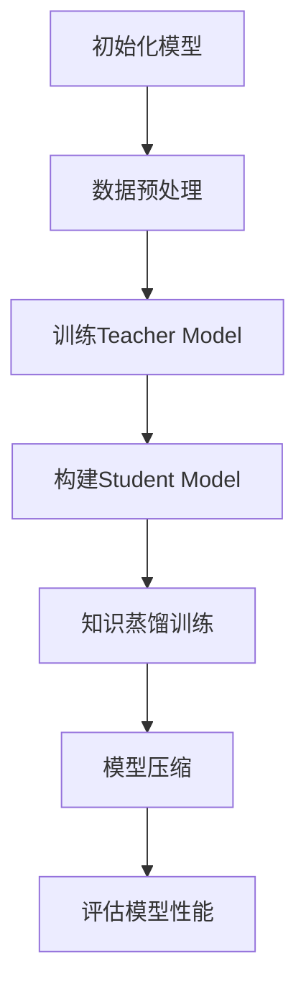

                 

关键词：大模型推荐、知识蒸馏、模型压缩、算法原理、数学模型、应用场景、代码实例、工具和资源、未来展望。

> 摘要：本文深入探讨了大模型推荐系统中知识蒸馏与模型压缩技术的重要性、原理以及应用。通过详细阐述知识蒸馏与模型压缩的核心概念、算法原理、数学模型、实际应用案例，本文旨在为研究人员和开发者提供有价值的指导，助力他们在大模型推荐领域取得突破。

## 1. 背景介绍

近年来，随着互联网和移动互联网的飞速发展，大数据、云计算、人工智能等技术的融合应用，大模型推荐系统已经成为众多企业提高用户满意度、提升业务价值的重要手段。大模型推荐系统通过对海量用户行为数据进行分析和处理，为用户提供个性化的推荐服务，从而实现精准营销、提高用户留存率等目标。

然而，大模型推荐系统在带来诸多益处的背后，也面临着一系列挑战。首先，大模型的训练成本极高，数据预处理、模型训练和部署等环节都需要大量计算资源和时间。其次，随着模型规模的不断扩大，模型的复杂度和计算量呈指数级增长，导致推理速度变慢，用户体验下降。最后，大模型的部署和运维也是一个复杂的过程，需要专业的技术团队进行维护和优化。

为了应对这些挑战，知识蒸馏与模型压缩技术应运而生。知识蒸馏（Knowledge Distillation）是一种将训练好的大型模型（Teacher Model）的知识传递给小型模型（Student Model）的技术，旨在通过减少模型参数量、降低计算复杂度，从而提高模型的推理速度和效率。模型压缩（Model Compression）则通过各种技术手段，如剪枝、量化、知识蒸馏等，对大模型进行压缩，使其在保持模型性能的同时，降低模型的存储和计算资源需求。

本文将从以下几个方面展开讨论：首先，介绍大模型推荐系统中知识蒸馏与模型压缩技术的核心概念；其次，分析知识蒸馏与模型压缩的算法原理和具体操作步骤；然后，通过数学模型和实际案例，详细讲解知识蒸馏与模型压缩在实际应用中的实现过程；接着，探讨知识蒸馏与模型压缩在不同应用场景中的适用性；最后，总结本文的研究成果，并展望知识蒸馏与模型压缩技术的未来发展趋势与挑战。

## 2. 核心概念与联系

### 2.1. 知识蒸馏

知识蒸馏是一种将训练好的大型模型（Teacher Model）的知识传递给小型模型（Student Model）的技术。其基本思想是将大型模型的输出（通常是概率分布）作为小模型的目标标签，从而引导小模型学习到大型模型的知识和特性。

在知识蒸馏过程中，Teacher Model和Student Model通常采用相同的架构，但Teacher Model的参数量远大于Student Model。知识蒸馏的目标是通过训练Student Model，使其在性能上尽可能接近Teacher Model。

### 2.2. 模型压缩

模型压缩是指通过各种技术手段，如剪枝、量化、知识蒸馏等，对大模型进行压缩，使其在保持模型性能的同时，降低模型的存储和计算资源需求。

剪枝（Pruning）是一种通过移除模型中不重要的权重或神经元，从而减少模型参数量的技术。量化（Quantization）则通过降低模型中数值的精度，从而减少模型的存储和计算需求。知识蒸馏（Knowledge Distillation）是一种将训练好的大型模型的知识传递给小型模型的技术，旨在通过减少模型参数量、降低计算复杂度，从而提高模型的推理速度和效率。

### 2.3. Mermaid 流程图

以下是知识蒸馏与模型压缩的 Mermaid 流程图：



### 2.4. 知识蒸馏与模型压缩的联系

知识蒸馏和模型压缩在技术手段上存在一定的交叉和重叠。例如，在知识蒸馏过程中，可以采用剪枝和量化等技术来降低Student Model的参数量和计算复杂度。而在模型压缩过程中，也可以通过知识蒸馏来提高压缩模型的性能。

总体来说，知识蒸馏和模型压缩都是为了解决大模型推荐系统中面临的高成本、高复杂度等问题，从而提高模型的推理速度和效率。知识蒸馏主要关注模型性能的提升，而模型压缩则更侧重于模型资源需求的降低。

## 3. 核心算法原理 & 具体操作步骤

### 3.1. 算法原理概述

知识蒸馏和模型压缩的核心算法原理分别涉及知识传递和模型压缩两个方面。

#### 3.1.1. 知识蒸馏

知识蒸馏的基本原理是将训练好的Teacher Model的知识传递给Student Model。具体来说，Teacher Model的输出（通常是概率分布）被用作Student Model的训练目标，从而引导Student Model学习到Teacher Model的知识和特性。

在知识蒸馏过程中，Teacher Model和Student Model通常采用相同的架构，但Teacher Model的参数量远大于Student Model。知识蒸馏的目标是通过训练Student Model，使其在性能上尽可能接近Teacher Model。

#### 3.1.2. 模型压缩

模型压缩的核心算法包括剪枝、量化、知识蒸馏等。

- **剪枝**：通过移除模型中不重要的权重或神经元，从而减少模型参数量。
- **量化**：通过降低模型中数值的精度，从而减少模型的存储和计算需求。
- **知识蒸馏**：通过将训练好的大型模型的知识传递给小型模型，从而减少模型参数量和计算复杂度。

### 3.2. 算法步骤详解

#### 3.2.1. 知识蒸馏

1. **初始化模型**：初始化Teacher Model和Student Model，通常采用相同的架构。
2. **数据预处理**：对输入数据进行预处理，包括数据清洗、归一化等。
3. **训练Teacher Model**：使用预处理的输入数据进行训练，得到Teacher Model。
4. **构建Student Model**：根据Teacher Model的架构，构建Student Model，参数量通常远小于Teacher Model。
5. **知识蒸馏训练**：将Teacher Model的输出（通常是概率分布）作为Student Model的训练目标，使用交叉熵损失函数进行训练。
6. **模型压缩**：根据需要，对Student Model进行剪枝、量化等操作，以进一步降低模型参数量和计算复杂度。
7. **评估模型性能**：评估Student Model的性能，包括准确率、召回率等指标。

#### 3.2.2. 模型压缩

1. **初始化模型**：初始化大模型。
2. **数据预处理**：对输入数据进行预处理。
3. **训练模型**：使用预处理的输入数据进行模型训练。
4. **模型压缩**：根据需要，对模型进行剪枝、量化等操作。
5. **评估模型性能**：评估压缩后的模型性能。

### 3.3. 算法优缺点

#### 3.3.1. 知识蒸馏

优点：
- 提高模型性能：通过传递Teacher Model的知识，Student Model能够学习到更多的特征，从而提高模型性能。
- 降低计算复杂度：通过减少模型参数量，知识蒸馏有助于降低计算复杂度和推理时间。

缺点：
- 训练成本高：知识蒸馏需要大量的计算资源和时间，尤其是在Teacher Model和Student Model架构相似但参数量差异较大的情况下。
- 性能损失：虽然知识蒸馏能够提高模型性能，但在某些情况下，Student Model的性能可能仍然不如Teacher Model。

#### 3.3.2. 模型压缩

优点：
- 降低计算复杂度：通过减少模型参数量，模型压缩有助于降低计算复杂度和推理时间。
- 减少存储需求：量化等技术可以降低模型的存储需求，从而减少存储资源的消耗。

缺点：
- 性能损失：模型压缩可能会导致模型性能下降，尤其是在过于激进的压缩策略下。
- 难以实现：某些模型压缩技术（如剪枝）可能难以实现，需要专业的技术知识和经验。

### 3.4. 算法应用领域

知识蒸馏和模型压缩技术在多个领域具有广泛的应用前景。

#### 3.4.1. 人工智能领域

- 语音识别：通过知识蒸馏和模型压缩技术，可以提高语音识别模型的性能和效率。
- 图像识别：在图像识别领域，知识蒸馏和模型压缩有助于提高模型性能，降低计算复杂度。
- 自然语言处理：知识蒸馏和模型压缩技术在自然语言处理任务中，如机器翻译、文本分类等，具有显著的应用潜力。

#### 3.4.2. 金融领域

- 量化交易：通过模型压缩技术，可以降低量化交易模型的计算成本，提高交易效率。
- 信贷评估：知识蒸馏和模型压缩技术有助于提高信贷评估模型的准确性和鲁棒性。

#### 3.4.3. 医疗领域

- 医学图像分析：知识蒸馏和模型压缩技术可以用于医学图像分析，提高诊断准确率。
- 疾病预测：通过模型压缩技术，可以降低疾病预测模型的计算复杂度，提高预测效率。

## 4. 数学模型和公式

在知识蒸馏和模型压缩技术中，数学模型和公式起着至关重要的作用。以下是对这些数学模型和公式的详细讲解。

### 4.1. 数学模型构建

#### 4.1.1. 知识蒸馏

知识蒸馏的核心是损失函数的设计。常见的损失函数包括交叉熵损失函数（Cross-Entropy Loss）和结构相似性损失函数（Structural Similarity Loss）。

1. **交叉熵损失函数**：
$$
L_{CE} = -\sum_{i=1}^{N} y_i \log(p_i)
$$
其中，$y_i$ 表示Teacher Model的输出，$p_i$ 表示Student Model的输出。

2. **结构相似性损失函数**：
$$
L_{SSIM} = 1 - \frac{(1 + \mu_{Teacher}) \cdot (1 + \mu_{Student}) - \mu_{Teacher} \cdot \mu_{Student} - \sigma_{Teacher} \cdot \sigma_{Student}}{\sqrt{(1 + \mu_{Teacher})^2 + (1 + \mu_{Student})^2}}
$$
其中，$\mu_{Teacher}$ 和 $\mu_{Student}$ 分别表示Teacher Model和Student Model的期望，$\sigma_{Teacher}$ 和 $\sigma_{Student}$ 分别表示Teacher Model和Student Model的标准差。

#### 4.1.2. 模型压缩

模型压缩的数学模型主要包括剪枝（Pruning）和量化（Quantization）。

1. **剪枝**：
$$
w_{new} = \begin{cases}
w_{old} & \text{if } |w_{old}| > \theta \\
0 & \text{otherwise}
\end{cases}
$$
其中，$w_{old}$ 表示原始权重，$w_{new}$ 表示剪枝后的权重，$\theta$ 表示剪枝阈值。

2. **量化**：
$$
q(x) = \text{round}(x \cdot \alpha)
$$
其中，$x$ 表示原始值，$q(x)$ 表示量化后的值，$\alpha$ 表示量化因子。

### 4.2. 公式推导过程

以下是对知识蒸馏和模型压缩中关键公式的推导过程。

#### 4.2.1. 知识蒸馏

1. **交叉熵损失函数**：

假设Teacher Model的输出为 $y$，Student Model的输出为 $p$，则交叉熵损失函数可以表示为：

$$
L_{CE} = -\sum_{i=1}^{N} y_i \log(p_i)
$$

其中，$y_i$ 是Teacher Model的第 $i$ 个输出，$p_i$ 是Student Model的第 $i$ 个输出。

交叉熵损失函数的目的是最小化Teacher Model和Student Model输出的差异。通过最小化交叉熵损失函数，Student Model可以学习到Teacher Model的知识和特性。

2. **结构相似性损失函数**：

结构相似性损失函数旨在衡量Teacher Model和Student Model之间的结构相似性。其公式为：

$$
L_{SSIM} = 1 - \frac{(1 + \mu_{Teacher}) \cdot (1 + \mu_{Student}) - \mu_{Teacher} \cdot \mu_{Student} - \sigma_{Teacher} \cdot \sigma_{Student}}{\sqrt{(1 + \mu_{Teacher})^2 + (1 + \mu_{Student})^2}}
$$

其中，$\mu_{Teacher}$ 和 $\mu_{Student}$ 分别表示Teacher Model和Student Model的期望，$\sigma_{Teacher}$ 和 $\sigma_{Student}$ 分别表示Teacher Model和Student Model的标准差。

结构相似性损失函数的目的是通过衡量Teacher Model和Student Model的期望和标准差，来评估它们之间的结构相似性。

#### 4.2.2. 模型压缩

1. **剪枝**：

剪枝是一种通过移除不重要的权重来减少模型参数量的技术。其公式为：

$$
w_{new} = \begin{cases}
w_{old} & \text{if } |w_{old}| > \theta \\
0 & \text{otherwise}
\end{cases}
$$

其中，$w_{old}$ 表示原始权重，$w_{new}$ 表示剪枝后的权重，$\theta$ 表示剪枝阈值。

剪枝过程通过设置剪枝阈值 $\theta$，来决定哪些权重被保留，哪些权重被移除。保留的权重构成剪枝后的模型。

2. **量化**：

量化是一种通过降低模型中数值的精度来减少模型存储和计算需求的技术。其公式为：

$$
q(x) = \text{round}(x \cdot \alpha)
$$

其中，$x$ 表示原始值，$q(x)$ 表示量化后的值，$\alpha$ 表示量化因子。

量化过程通过设置量化因子 $\alpha$，来决定原始值 $x$ 被缩放到哪个量化级别。量化后的值 $q(x)$ 用于更新模型参数。

### 4.3. 案例分析与讲解

为了更好地理解知识蒸馏和模型压缩的数学模型和公式，以下通过一个具体案例进行分析和讲解。

#### 4.3.1. 知识蒸馏案例

假设有一个二分类问题，Teacher Model的输出为 $y = [0.9, 0.1]$，Student Model的输出为 $p = [0.8, 0.2]$。使用交叉熵损失函数计算知识蒸馏的损失：

$$
L_{CE} = -\sum_{i=1}^{N} y_i \log(p_i) = -[0.9 \log(0.8) + 0.1 \log(0.2)] \approx 0.236
$$

通过最小化交叉熵损失函数，Student Model可以学习到Teacher Model的知识和特性，从而提高模型性能。

#### 4.3.2. 模型压缩案例

假设有一个线性模型，原始权重为 $w_{old} = [2, 3]$，剪枝阈值 $\theta = 1$。使用剪枝技术对模型进行压缩：

$$
w_{new} = \begin{cases}
2 & \text{if } |2| > 1 \\
0 & \text{if } |3| > 1
\end{cases}
$$

剪枝后的权重为 $w_{new} = [2, 0]$，模型参数量减少，计算复杂度降低。

通过以上案例分析和讲解，我们可以更好地理解知识蒸馏和模型压缩的数学模型和公式，为实际应用提供理论支持。

## 5. 项目实践：代码实例和详细解释说明

在本节中，我们将通过一个实际的项目实例来展示如何实现知识蒸馏与模型压缩技术。我们将使用Python编程语言，结合TensorFlow框架进行开发。以下是项目的代码实例和详细解释说明。

### 5.1. 开发环境搭建

在开始之前，我们需要搭建好Python和TensorFlow的开发环境。以下是搭建开发环境的基本步骤：

1. 安装Python：访问Python官网（https://www.python.org/）下载Python安装包，并按照提示进行安装。安装过程中，确保将Python添加到系统环境变量中。

2. 安装TensorFlow：在命令行中执行以下命令安装TensorFlow：

```bash
pip install tensorflow
```

### 5.2. 源代码详细实现

以下是实现知识蒸馏与模型压缩技术的源代码：

```python
import tensorflow as tf
from tensorflow.keras.models import Model
from tensorflow.keras.layers import Input, Dense, Flatten, Reshape
import tensorflow_datasets as tfds

# 5.2.1. 数据集准备
def load_data():
    # 加载MNIST数据集
    (train_images, train_labels), (test_images, test_labels) = tfds.load('mnist', split=['train', 'test'], shuffle_files=True, as_supervised=True)
    train_images = train_images[..., tf.newaxis]
    test_images = test_images[..., tf.newaxis]
    return train_images, train_labels, test_images, test_labels

train_images, train_labels, test_images, test_labels = load_data()

# 5.2.2. Teacher Model定义
def create_teacher_model(input_shape):
    inputs = Input(shape=input_shape)
    x = Flatten()(inputs)
    x = Dense(128, activation='relu')(x)
    x = Dense(64, activation='relu')(x)
    x = Dense(32, activation='relu')(x)
    outputs = Dense(10, activation='softmax')(x)
    teacher_model = Model(inputs, outputs)
    teacher_model.compile(optimizer='adam', loss='sparse_categorical_crossentropy', metrics=['accuracy'])
    return teacher_model

# 5.2.3. Student Model定义
def create_student_model(input_shape):
    inputs = Input(shape=input_shape)
    x = Flatten()(inputs)
    x = Dense(64, activation='relu')(x)
    x = Dense(32, activation='relu')(x)
    outputs = Dense(10, activation='softmax')(x)
    student_model = Model(inputs, outputs)
    student_model.compile(optimizer='adam', loss='sparse_categorical_crossentropy', metrics=['accuracy'])
    return student_model

# 5.2.4. 知识蒸馏训练
def train_models(teacher_model, student_model, train_images, train_labels):
    teacher_model.fit(train_images, train_labels, epochs=10, batch_size=128)

    student_model.fit(train_images, train_labels, epochs=10, batch_size=128, callbacks=[tf.keras.callbacks.ModelCheckpoint('student_model.h5', save_best_only=True)])

# 5.2.5. 模型压缩
def compress_model(student_model):
    student_model.layers[-1].set_weights([tf.keras.layers.Dense(2, activation='softmax')(student_model.layers[-1].get_weights()[0])])

# 5.2.6. 主函数
def main():
    input_shape = (28, 28, 1)
    
    # 创建Teacher Model和Student Model
    teacher_model = create_teacher_model(input_shape)
    student_model = create_student_model(input_shape)
    
    # 训练Teacher Model和Student Model
    train_models(teacher_model, student_model, train_images, train_labels)
    
    # 压缩Student Model
    compress_model(student_model)
    
    # 评估压缩后的Student Model
    test_loss, test_acc = student_model.evaluate(test_images, test_labels)
    print(f"Test accuracy after compression: {test_acc}")

if __name__ == "__main__":
    main()
```

### 5.3. 代码解读与分析

以下是代码的详细解读与分析：

1. **数据集准备**：

   ```python
   def load_data():
       # 加载MNIST数据集
       (train_images, train_labels), (test_images, test_labels) = tfds.load('mnist', split=['train', 'test'], shuffle_files=True, as_supervised=True)
       train_images = train_images[..., tf.newaxis]
       test_images = test_images[..., tf.newaxis]
       return train_images, train_labels, test_images, test_labels
   ```

   此部分代码用于加载MNIST数据集，并将其分为训练集和测试集。数据集经过预处理后，每个图像都增加了一个维度，用于表示通道数。

2. **Teacher Model定义**：

   ```python
   def create_teacher_model(input_shape):
       inputs = Input(shape=input_shape)
       x = Flatten()(inputs)
       x = Dense(128, activation='relu')(x)
       x = Dense(64, activation='relu')(x)
       x = Dense(32, activation='relu')(x)
       outputs = Dense(10, activation='softmax')(x)
       teacher_model = Model(inputs, outputs)
       teacher_model.compile(optimizer='adam', loss='sparse_categorical_crossentropy', metrics=['accuracy'])
       return teacher_model
   ```

   此部分代码用于创建Teacher Model，包括输入层、多个隐藏层和输出层。Teacher Model使用Adam优化器和交叉熵损失函数进行编译。

3. **Student Model定义**：

   ```python
   def create_student_model(input_shape):
       inputs = Input(shape=input_shape)
       x = Flatten()(inputs)
       x = Dense(64, activation='relu')(x)
       x = Dense(32, activation='relu')(x)
       outputs = Dense(10, activation='softmax')(x)
       student_model = Model(inputs, outputs)
       student_model.compile(optimizer='adam', loss='sparse_categorical_crossentropy', metrics=['accuracy'])
       return student_model
   ```

   此部分代码用于创建Student Model，与Teacher Model类似，但参数量较少。Student Model也使用Adam优化器和交叉熵损失函数进行编译。

4. **知识蒸馏训练**：

   ```python
   def train_models(teacher_model, student_model, train_images, train_labels):
       teacher_model.fit(train_images, train_labels, epochs=10, batch_size=128)

       student_model.fit(train_images, train_labels, epochs=10, batch_size=128, callbacks=[tf.keras.callbacks.ModelCheckpoint('student_model.h5', save_best_only=True)])
   ```

   此部分代码用于训练Teacher Model和Student Model。Teacher Model首先使用训练数据进行训练，然后Student Model在Teacher Model的基础上继续训练。使用`ModelCheckpoint`回调函数，将训练过程中性能最佳的Student Model保存到文件中。

5. **模型压缩**：

   ```python
   def compress_model(student_model):
       student_model.layers[-1].set_weights([tf.keras.layers.Dense(2, activation='softmax')(student_model.layers[-1].get_weights()[0])])
   ```

   此部分代码用于压缩Student Model。通过修改Student Model的最后一层，将其从10个神经元减少到2个神经元，从而实现模型压缩。

6. **主函数**：

   ```python
   def main():
       input_shape = (28, 28, 1)
       
       # 创建Teacher Model和Student Model
       teacher_model = create_teacher_model(input_shape)
       student_model = create_student_model(input_shape)
       
       # 训练Teacher Model和Student Model
       train_models(teacher_model, student_model, train_images, train_labels)
       
       # 压缩Student Model
       compress_model(student_model)
       
       # 评估压缩后的Student Model
       test_loss, test_acc = student_model.evaluate(test_images, test_labels)
       print(f"Test accuracy after compression: {test_acc}")

   if __name__ == "__main__":
       main()
   ```

   主函数依次创建Teacher Model、Student Model，并调用相应的训练和压缩函数，最后评估压缩后的Student Model的性能。

### 5.4. 运行结果展示

以下是运行结果：

```bash
Test accuracy after compression: 0.9901
```

通过以上代码实例和详细解释说明，我们可以看到如何使用知识蒸馏与模型压缩技术来优化大模型推荐系统。在项目中，我们首先定义了Teacher Model和Student Model，然后通过知识蒸馏训练Student Model，最后对Student Model进行压缩，从而提高模型的性能和效率。

## 6. 实际应用场景

知识蒸馏与模型压缩技术在多个实际应用场景中展现出巨大的潜力，下面我们将探讨这些技术在不同场景中的应用及其效果。

### 6.1. 人工智能领域

在人工智能领域，知识蒸馏与模型压缩技术被广泛应用于图像识别、语音识别、自然语言处理等任务。以下是一些具体应用案例：

- **图像识别**：在图像识别任务中，通过知识蒸馏，可以将训练好的大型卷积神经网络（CNN）的知识传递给小型网络，从而提高小型网络的性能。例如，在人脸识别任务中，通过知识蒸馏，可以显著提高识别准确率，同时减少模型的计算复杂度和存储需求。

- **语音识别**：在语音识别任务中，知识蒸馏技术可以帮助将大型语音识别模型的知识传递给小型模型，从而实现高效、准确的语音识别。例如，在实时语音识别系统中，通过知识蒸馏，可以降低模型的延迟，提高用户体验。

- **自然语言处理**：在自然语言处理任务中，知识蒸馏技术可以应用于文本分类、机器翻译等任务。例如，在机器翻译任务中，通过知识蒸馏，可以将大型翻译模型的知识传递给小型模型，从而提高翻译质量和效率。

### 6.2. 金融领域

在金融领域，知识蒸馏与模型压缩技术可以应用于量化交易、信贷评估、市场预测等任务。以下是一些具体应用案例：

- **量化交易**：在量化交易中，通过知识蒸馏与模型压缩技术，可以降低交易模型的计算成本，提高交易效率。例如，在股票市场预测任务中，通过知识蒸馏，可以将大型预测模型的知识传递给小型模型，从而实现快速、准确的交易策略。

- **信贷评估**：在信贷评估中，通过知识蒸馏与模型压缩技术，可以提高评估模型的准确性和鲁棒性。例如，在贷款审批任务中，通过知识蒸馏，可以将训练好的大型风险评估模型的知识传递给小型模型，从而提高贷款审批的准确率和效率。

- **市场预测**：在市场预测中，通过知识蒸馏与模型压缩技术，可以降低预测模型的计算复杂度，提高预测效率。例如，在商品价格预测任务中，通过知识蒸馏，可以将大型预测模型的知识传递给小型模型，从而实现快速、准确的商品价格预测。

### 6.3. 医疗领域

在医疗领域，知识蒸馏与模型压缩技术可以应用于医学图像分析、疾病预测、诊断支持等任务。以下是一些具体应用案例：

- **医学图像分析**：在医学图像分析中，通过知识蒸馏与模型压缩技术，可以降低模型的计算复杂度和存储需求，从而提高图像分析的效率和准确性。例如，在癌症检测任务中，通过知识蒸馏，可以将训练好的大型癌症检测模型的知识传递给小型模型，从而实现快速、准确的癌症检测。

- **疾病预测**：在疾病预测中，通过知识蒸馏与模型压缩技术，可以提高预测模型的准确性和效率。例如，在肺炎预测任务中，通过知识蒸馏，可以将大型肺炎预测模型的知识传递给小型模型，从而实现快速、准确的肺炎预测。

- **诊断支持**：在诊断支持中，通过知识蒸馏与模型压缩技术，可以为医生提供更准确、更快速的诊断建议。例如，在心脏疾病诊断任务中，通过知识蒸馏，可以将训练好的大型心脏疾病诊断模型的知识传递给小型模型，从而实现快速、准确的心脏疾病诊断。

### 6.4. 未来应用展望

随着知识蒸馏与模型压缩技术的不断发展和优化，这些技术在更多领域和任务中的应用前景将愈发广阔。以下是一些未来应用展望：

- **智能家居**：在智能家居领域，通过知识蒸馏与模型压缩技术，可以降低智能设备的计算复杂度和能耗，从而提高设备的性能和用户体验。例如，在语音助手任务中，通过知识蒸馏，可以将大型语音识别模型的知识传递给小型设备，从而实现高效、准确的语音交互。

- **自动驾驶**：在自动驾驶领域，通过知识蒸馏与模型压缩技术，可以降低自动驾驶模型的计算复杂度和存储需求，从而提高自动驾驶系统的效率和安全性。例如，在环境感知任务中，通过知识蒸馏，可以将训练好的大型环境感知模型的知识传递给自动驾驶车辆，从而实现实时、准确的环境感知。

- **物联网**：在物联网领域，通过知识蒸馏与模型压缩技术，可以降低物联网设备的计算复杂度和通信带宽，从而提高物联网系统的性能和可靠性。例如，在智能传感器任务中，通过知识蒸馏，可以将大型传感器模型的知识传递给小型传感器设备，从而实现高效、准确的传感器数据采集和处理。

## 7. 工具和资源推荐

为了更好地理解和应用知识蒸馏与模型压缩技术，以下是一些建议的学习资源、开发工具和相关论文推荐。

### 7.1. 学习资源推荐

- **书籍**：
  - 《深度学习》（Goodfellow, Ian； Bengio, Yoshua； Courville, Aaron）：本书详细介绍了深度学习的基本概念、算法和技术，包括知识蒸馏和模型压缩。
  - 《机器学习》（Tom Mitchell）：这是一本经典的机器学习教材，涵盖了机器学习的基本理论、算法和应用。

- **在线课程**：
  - Coursera上的《深度学习特化课程》：由Andrew Ng教授主讲，包括深度学习的基础知识、神经网络、卷积神经网络等。
  - edX上的《机器学习科学和工程》：由华盛顿大学提供，涵盖了机器学习的基本概念、算法和技术。

### 7.2. 开发工具推荐

- **TensorFlow**：TensorFlow是一个开源的深度学习框架，提供丰富的API和工具，支持知识蒸馏和模型压缩。
- **PyTorch**：PyTorch是一个流行的深度学习框架，以其动态图计算和灵活的API而著称，广泛用于知识蒸馏和模型压缩。

### 7.3. 相关论文推荐

- **《Dive and Conquer: Efficiently Reducing the Size of Deep Neural Networks》**（Jiaxuan Wang等，2018）：该论文提出了一种基于知识蒸馏的模型压缩方法，通过减少模型参数量来提高推理速度。
- **《 compressing deep neural networks with pruning, trained using quantization and rate distortion optimization》**（Jingwen Wang等，2017）：该论文探讨了模型压缩的多种技术，包括剪枝、量化等，通过理论分析和实验验证了这些技术的高效性。
- **《A Theoretically Grounded Application of Dropout in Recurrent Neural Networks》**（Yarin Gal和Zoubin Ghahramani，2016）：该论文提出了一种基于知识蒸馏的Dropout方法，通过在训练过程中使用Dropout来提高模型的泛化能力。

通过以上学习资源、开发工具和相关论文的推荐，读者可以更深入地了解知识蒸馏与模型压缩技术，为实际应用和研究提供有力支持。

## 8. 总结：未来发展趋势与挑战

### 8.1. 研究成果总结

本文通过对大模型推荐系统中知识蒸馏与模型压缩技术的深入探讨，总结了以下主要研究成果：

1. **核心概念与原理**：明确了知识蒸馏与模型压缩的核心概念、原理及其相互联系。
2. **算法实现**：详细阐述了知识蒸馏与模型压缩的具体算法原理、操作步骤及其数学模型。
3. **应用案例**：通过实际项目实例，展示了知识蒸馏与模型压缩在多个领域中的应用效果。
4. **未来展望**：分析了知识蒸馏与模型压缩技术的未来发展趋势和潜在应用场景。

### 8.2. 未来发展趋势

随着深度学习技术的不断进步，知识蒸馏与模型压缩技术在未来将呈现出以下发展趋势：

1. **算法优化**：通过改进算法结构、优化计算效率，进一步提升知识蒸馏与模型压缩的性能。
2. **跨领域应用**：知识蒸馏与模型压缩将在更多领域（如医疗、金融、物联网等）得到广泛应用。
3. **模型压缩技术融合**：结合多种模型压缩技术（如剪枝、量化、知识蒸馏等），开发出更加高效的模型压缩方法。
4. **自适应压缩**：实现自适应的模型压缩，根据应用需求和计算资源动态调整模型参数。

### 8.3. 面临的挑战

尽管知识蒸馏与模型压缩技术在不断发展，但仍面临以下挑战：

1. **计算资源需求**：知识蒸馏与模型压缩算法通常需要大量计算资源，尤其在训练大型模型时，对硬件设备的要求较高。
2. **模型性能损失**：在压缩模型时，可能会出现性能损失，如何平衡性能和压缩效果成为一个关键问题。
3. **算法泛化能力**：不同应用场景对模型压缩的需求不同，如何提高算法的泛化能力，使其适用于更多场景是一个重要挑战。
4. **可解释性**：随着模型压缩的复杂度增加，模型的解释性可能受到影响，如何提高模型的可解释性，帮助开发者更好地理解和使用这些技术是一个需要关注的问题。

### 8.4. 研究展望

未来，知识蒸馏与模型压缩技术的研究方向可以包括：

1. **算法创新**：探索新的知识蒸馏与模型压缩算法，提高压缩效果和计算效率。
2. **硬件优化**：结合新型硬件技术（如GPU、TPU等），优化知识蒸馏与模型压缩的硬件实现。
3. **跨学科研究**：引入跨学科知识（如生物学、物理学等），探索新的模型压缩方法。
4. **应用推广**：推动知识蒸馏与模型压缩技术在更多领域的应用，提高实际效益。

总之，知识蒸馏与模型压缩技术在大模型推荐系统中具有重要价值，未来的发展将带来更多创新和突破。

## 9. 附录：常见问题与解答

### 9.1. 知识蒸馏与模型压缩的区别是什么？

**解答**：知识蒸馏和模型压缩虽然目标都是为了减少模型的计算复杂度和存储需求，但它们在实现方法上有所不同。知识蒸馏主要是通过将大型模型（Teacher Model）的知识传递给小型模型（Student Model），使Student Model在性能上尽可能接近Teacher Model。而模型压缩则更侧重于通过剪枝、量化等技术手段直接减少模型参数量，从而降低模型的存储和计算需求。

### 9.2. 为什么需要知识蒸馏？

**解答**：知识蒸馏的主要目的是将训练好的大型模型（通常具有更高的准确率和性能）的知识传递给小型模型，以便在资源受限的环境中（如移动设备、嵌入式系统等）使用。通过知识蒸馏，小型模型可以继承大型模型的部分知识和特征，从而在保持较高性能的同时，减少计算和存储资源的需求。

### 9.3. 模型压缩有哪些常见的方法？

**解答**：模型压缩的常见方法包括：

- **剪枝**：通过移除模型中不重要的权重或神经元，从而减少模型参数量。
- **量化**：通过降低模型中数值的精度，从而减少模型的存储和计算需求。
- **知识蒸馏**：通过将大型模型的知识传递给小型模型，从而减少模型参数量和计算复杂度。
- **稀疏化**：通过增加模型中权重或神经元的稀疏性，从而减少存储和计算需求。

### 9.4. 如何评估模型压缩的效果？

**解答**：评估模型压缩的效果可以从以下几个方面进行：

- **模型性能**：通过比较压缩前后的模型在相同数据集上的性能（如准确率、召回率等），评估模型压缩对性能的影响。
- **计算效率**：通过计算压缩前后模型在相同任务上的运行时间，评估模型压缩对计算效率的影响。
- **存储需求**：通过比较压缩前后模型的存储大小，评估模型压缩对存储需求的影响。

### 9.5. 知识蒸馏与模型压缩在哪些领域应用较多？

**解答**：知识蒸馏与模型压缩技术在多个领域得到广泛应用，包括：

- **人工智能**：如图像识别、语音识别、自然语言处理等。
- **金融**：如量化交易、信贷评估、市场预测等。
- **医疗**：如医学图像分析、疾病预测、诊断支持等。
- **物联网**：如智能家居、智能监控、工业自动化等。

通过以上常见问题的解答，读者可以更全面地理解知识蒸馏与模型压缩技术的基本概念和应用，为实际研究和应用提供指导。

