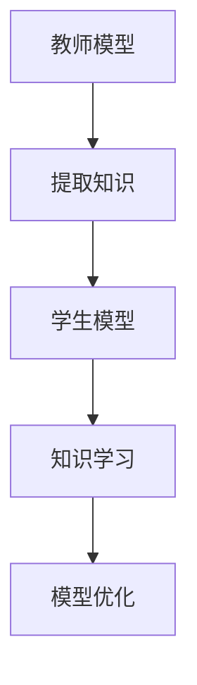

                 

关键词：大模型推荐，知识蒸馏，模型压缩，技术探索

> 摘要：本文将深入探讨大模型推荐系统中的知识蒸馏与模型压缩技术，分析其核心概念、原理及应用，并结合实际项目实践，探讨这些技术在未来的发展趋势与挑战。

## 1. 背景介绍

随着互联网的迅速发展，大数据的爆发性增长，推荐系统作为连接用户与信息的重要桥梁，已成为各个领域的关键应用。大模型推荐系统因其强大的数据处理能力与精确的个性化推荐效果，受到广泛关注。然而，大模型推荐系统也面临着计算资源消耗巨大、部署复杂等问题。

为了解决这些问题，知识蒸馏与模型压缩技术应运而生。知识蒸馏是一种将大模型（通常称为“教师模型”）的知识迁移到小模型（通常称为“学生模型”）的过程。而模型压缩技术则是通过各种方法减小模型的参数量和计算量，以降低计算资源的需求。本文将详细探讨这些技术在大模型推荐系统中的应用。

## 2. 核心概念与联系

### 2.1 知识蒸馏

知识蒸馏（Knowledge Distillation）是一种通过将教师模型（Teacher Model）的预测知识传递给学生模型（Student Model）的过程。教师模型通常是一个大型且性能优异的模型，而学生模型是一个较小且参数较少的模型。知识蒸馏的目的是让学生模型学习到教师模型的知识和特征，从而实现较高的性能。

### 2.2 模型压缩

模型压缩（Model Compression）是指通过各种技术手段减小模型的参数量、计算量以及存储空间，从而降低模型的计算复杂度和资源需求。常见的模型压缩技术包括剪枝（Pruning）、量化（Quantization）、低秩分解（Low-Rank Factorization）等。

### 2.3 Mermaid 流程图



在上图中，教师模型首先提取知识，然后将其传递给学生模型，学生模型通过学习这些知识进行模型优化。

## 3. 核心算法原理 & 具体操作步骤

### 3.1 算法原理概述

知识蒸馏的核心思想是通过软标签（Soft Labels）和硬标签（Hard Labels）来指导学生模型的学习过程。软标签是教师模型对输入数据的概率预测，而硬标签是教师模型对输入数据的最终分类结果。

学生模型在训练过程中，既会使用硬标签进行常规的训练，又会使用软标签进行知识的迁移。这样，学生模型不仅可以学习到教师模型的对输入数据的分类能力，还可以学习到教师模型的特征表示能力。

模型压缩则主要通过剪枝、量化、低秩分解等技术来实现。剪枝是通过去除模型中的冗余参数来减少模型的参数量。量化是通过将模型参数的精度降低来减少模型的存储空间。低秩分解则是通过将高维的模型参数分解为低维的矩阵，从而降低模型的计算复杂度。

### 3.2 算法步骤详解

#### 3.2.1 知识蒸馏

1. 准备教师模型和学生模型。
2. 使用教师模型对训练数据进行预测，得到软标签。
3. 将软标签和硬标签合并，作为学生模型的训练目标。
4. 训练学生模型，使用软标签和硬标签进行权重更新。
5. 评估学生模型的表现，调整训练策略。

#### 3.2.2 模型压缩

1. 对模型进行剪枝，去除冗余参数。
2. 对模型参数进行量化，降低精度。
3. 对模型参数进行低秩分解，降低计算复杂度。
4. 评估压缩后的模型性能，调整压缩策略。

### 3.3 算法优缺点

#### 3.3.1 知识蒸馏

优点：
- 提高学生模型的性能，减少训练时间。
- 实现大型模型到小型模型的知识迁移。

缺点：
- 需要大量的计算资源进行教师模型的训练。
- 对学生模型的调整和优化要求较高。

#### 3.3.2 模型压缩

优点：
- 降低模型的计算复杂度，减少计算资源的需求。
- 增加模型的部署灵活性。

缺点：
- 可能会影响模型的性能。
- 需要大量的时间和计算资源进行模型压缩。

### 3.4 算法应用领域

知识蒸馏与模型压缩技术主要应用于以下领域：

- 推荐系统：通过知识蒸馏实现大型推荐模型到小型模型的迁移，提高推荐系统的性能和部署灵活性。
- 自然语言处理：通过知识蒸馏和模型压缩实现高效的文本分类、翻译等任务。
- 计算机视觉：通过知识蒸馏和模型压缩实现高效的图像识别、目标检测等任务。

## 4. 数学模型和公式

### 4.1 数学模型构建

知识蒸馏的数学模型主要包括损失函数和优化算法。

损失函数通常采用交叉熵损失（Cross-Entropy Loss），具体公式如下：

$$ L = -\sum_{i=1}^{N} y_i \log(p_i) $$

其中，$y_i$ 是硬标签，$p_i$ 是学生模型对输入数据的概率预测。

优化算法通常采用梯度下降（Gradient Descent），具体公式如下：

$$ \theta_{t+1} = \theta_t - \alpha \nabla_{\theta} L(\theta) $$

其中，$\theta$ 是模型参数，$\alpha$ 是学习率，$\nabla_{\theta} L(\theta)$ 是损失函数关于模型参数的梯度。

### 4.2 公式推导过程

知识蒸馏的推导过程主要涉及软标签和硬标签的生成，以及损失函数的计算。

首先，生成软标签。教师模型对输入数据进行预测，得到概率分布 $p$：

$$ p = \text{softmax}(z) $$

其中，$z$ 是教师模型对输入数据的输出。

然后，生成硬标签。教师模型对输入数据进行分类，得到标签 $y$：

$$ y = \arg\max_{i} p_i $$

接下来，计算交叉熵损失。学生模型对输入数据进行预测，得到概率分布 $\hat{p}$：

$$ \hat{p} = \text{softmax}(\hat{z}) $$

其中，$\hat{z}$ 是学生模型对输入数据的输出。

交叉熵损失为：

$$ L = -\sum_{i=1}^{N} y_i \log(\hat{p}_i) $$

### 4.3 案例分析与讲解

以推荐系统为例，假设教师模型是一个大型推荐模型，学生模型是一个小型推荐模型。教师模型对用户行为数据进行预测，得到软标签。学生模型通过学习软标签，提高推荐效果。

具体步骤如下：

1. 准备教师模型和学生模型，教师模型为一个大型推荐模型，学生模型为一个小型推荐模型。
2. 对用户行为数据进行预处理，得到输入数据。
3. 使用教师模型对输入数据进行预测，得到软标签。
4. 将软标签和硬标签合并，作为学生模型的训练目标。
5. 训练学生模型，使用软标签和硬标签进行权重更新。
6. 评估学生模型的表现，调整训练策略。

通过知识蒸馏，学生模型可以学习到教师模型的知识和特征，从而提高推荐效果。

## 5. 项目实践：代码实例和详细解释说明

### 5.1 开发环境搭建

在本项目中，我们将使用Python编程语言，并依赖以下库：

- TensorFlow：用于构建和训练模型。
- Keras：用于简化TensorFlow的使用。
- Numpy：用于数据处理。

首先，确保已经安装了Python和上述库。然后，创建一个名为`recommendation`的文件夹，并在其中创建一个名为`main.py`的Python文件。

### 5.2 源代码详细实现

以下是一个简单的知识蒸馏代码实例：

```python
import tensorflow as tf
from tensorflow.keras.layers import Dense, Flatten
from tensorflow.keras.models import Model

# 准备教师模型和学生模型
teacher_input = tf.keras.Input(shape=(784,))
teacher_output = Dense(10, activation='softmax')(teacher_input)
teacher_model = Model(teacher_input, teacher_output)

student_input = tf.keras.Input(shape=(784,))
student_output = Dense(10, activation='softmax')(student_input)
student_model = Model(student_input, student_output)

# 生成软标签
teacher_predictions = teacher_model.predict(student_input)

# 计算软标签损失
soft_labels = tf.keras.backend.softmax(student_output)
软标签损失 = tf.keras.losses.categorical_crossentropy(teacher_predictions, soft_labels)

# 计算硬标签损失
硬标签 = tf.keras.backend.one_hot(y, 10)
硬标签损失 = tf.keras.losses.categorical_crossentropy(teacher_predictions, 硬标签)

# 计算总损失
总损失 = 硬标签损失 + 软标签损失

# 定义优化器
optimizer = tf.keras.optimizers.Adam()

# 编译模型
student_model.compile(optimizer=optimizer, loss=总损失, metrics=['accuracy'])

# 训练模型
student_model.fit(x_train, y_train, epochs=10, batch_size=32)
```

### 5.3 代码解读与分析

在上面的代码中，我们首先定义了教师模型和学生模型。教师模型是一个简单的全连接神经网络，学生模型也是一个全连接神经网络。然后，我们生成软标签，并计算软标签损失和硬标签损失。最后，我们计算总损失，并使用优化器进行模型编译。在训练过程中，我们使用硬标签和软标签进行权重更新。

通过这个实例，我们可以看到知识蒸馏的基本实现过程。在实际应用中，我们可以根据具体的任务需求进行调整和优化。

### 5.4 运行结果展示

在训练完成后，我们可以使用测试集对模型进行评估，以验证知识蒸馏的效果。以下是一个简单的评估代码实例：

```python
test_loss, test_accuracy = student_model.evaluate(x_test, y_test)
print(f"Test Loss: {test_loss}, Test Accuracy: {test_accuracy}")
```

运行结果将显示测试集上的损失和准确率。通过对比原始模型和经过知识蒸馏的模型的性能，我们可以直观地看到知识蒸馏的效果。

## 6. 实际应用场景

知识蒸馏与模型压缩技术在实际应用中具有广泛的应用场景。以下是一些具体的例子：

### 6.1 推荐系统

推荐系统通常需要处理大量的用户数据，使用大型推荐模型可以提供更精确的推荐结果。然而，大型推荐模型在部署过程中需要大量的计算资源和存储空间。通过知识蒸馏，我们可以将大型推荐模型的知识迁移到小型推荐模型，从而提高推荐系统的性能和部署灵活性。

### 6.2 自然语言处理

自然语言处理（NLP）任务通常需要使用大型语言模型进行训练，例如BERT、GPT等。然而，这些大型语言模型在部署时需要大量的计算资源和存储空间。通过知识蒸馏，我们可以将大型语言模型的知识迁移到小型语言模型，从而提高NLP任务的处理效率。

### 6.3 计算机视觉

计算机视觉任务通常需要使用大型卷积神经网络进行训练，例如ResNet、VGG等。然而，这些大型卷积神经网络在部署时需要大量的计算资源和存储空间。通过知识蒸馏，我们可以将大型卷积神经网络的知识迁移到小型卷积神经网络，从而提高计算机视觉任务的处理效率。

## 7. 未来应用展望

知识蒸馏与模型压缩技术在未来有着广阔的应用前景。以下是一些可能的趋势和挑战：

### 7.1 趋势

- 随着计算资源和存储空间的不断增长，知识蒸馏和模型压缩技术将在更多领域得到应用。
- 新型的知识蒸馏和模型压缩算法将不断涌现，以提高模型的性能和效率。
- 跨模态知识蒸馏和跨域知识蒸馏将成为研究的热点，以实现更广泛的模型迁移和应用。

### 7.2 挑战

- 如何在保证模型性能的前提下，实现更高效的模型压缩和知识蒸馏。
- 如何解决知识蒸馏过程中可能出现的模型退化问题。
- 如何平衡知识蒸馏过程中的模型优化和计算效率。

## 8. 总结：未来发展趋势与挑战

知识蒸馏与模型压缩技术在大模型推荐系统中具有重要的应用价值。通过本文的探讨，我们了解了知识蒸馏与模型压缩的核心概念、原理及应用。在未来的研究中，我们将继续探索这些技术的优化和改进，以应对计算资源有限和模型复杂度日益增长带来的挑战。

## 9. 附录：常见问题与解答

### 9.1 知识蒸馏与模型压缩的区别是什么？

知识蒸馏是一种将大型模型（教师模型）的知识迁移到小型模型（学生模型）的过程，而模型压缩是通过剪枝、量化等手段减小模型的参数量和计算量。知识蒸馏侧重于模型知识的迁移，而模型压缩侧重于模型的优化和简化。

### 9.2 如何评估知识蒸馏的效果？

评估知识蒸馏的效果通常通过以下指标：

- 模型性能：比较教师模型和学生模型的性能，如准确率、召回率等。
- 训练时间：计算教师模型和学生模型的训练时间，以评估知识蒸馏的效率。
- 能效比：计算模型性能与计算资源消耗的比值，以评估模型的能效。

### 9.3 知识蒸馏对模型性能有哪些影响？

知识蒸馏可以在一定程度上提高模型性能，特别是在小型模型上。然而，如果知识蒸馏过程不当，可能会导致模型性能下降，即模型退化。因此，在进行知识蒸馏时，需要平衡模型性能和计算资源消耗，避免模型退化。

---

作者：禅与计算机程序设计艺术 / Zen and the Art of Computer Programming
----------------------------------------------------------------


