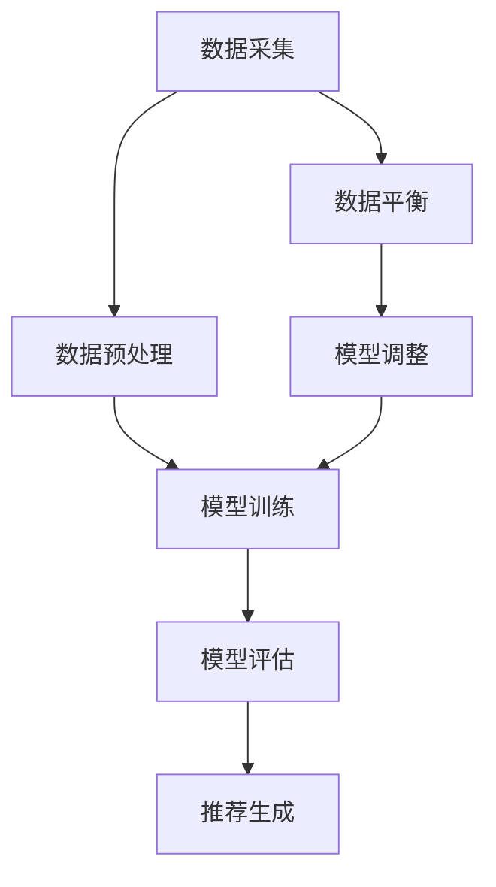

                 

关键词：数据不平衡，大模型，推荐系统，算法优化，处理策略

## 摘要

本文主要探讨了在大模型推荐场景中，如何应对数据不平衡问题。数据不平衡是推荐系统领域的一大挑战，它会导致模型无法准确预测和推荐用户可能感兴趣的内容。本文首先介绍了数据不平衡的背景和原因，然后详细分析了大模型在推荐系统中的重要性，接着探讨了各种应对数据不平衡的策略，包括数据预处理、模型调整和算法优化等。通过实际案例和代码实例，本文展示了这些策略的具体应用，并对其效果进行了评估。最后，本文对未来的发展趋势和挑战进行了展望。

## 1. 背景介绍

在互联网时代，推荐系统已经成为用户与内容之间的重要桥梁。它通过分析用户的兴趣和行为，为用户推荐他们可能感兴趣的内容，从而提高用户体验和满意度。随着大数据和人工智能技术的发展，推荐系统的规模和复杂度不断增大，大模型（如深度学习模型）在推荐系统中的应用越来越广泛。

然而，推荐系统领域面临着许多挑战，其中之一就是数据不平衡问题。数据不平衡指的是数据集中不同类别的样本数量差异较大。在推荐系统中，这通常表现为用户行为数据的不平衡，例如，用户点击和未点击的记录数量差异很大。这种不平衡会导致模型无法准确预测用户的行为，进而影响推荐效果。

数据不平衡的原因有多种，主要包括以下几个方面：

1. **数据采集问题**：在某些场景下，用户对某些类别的行为数据较少，从而导致数据不平衡。
2. **用户行为差异**：不同用户的兴趣和行为差异较大，导致某些类别的样本数量较少。
3. **数据分布问题**：数据集本身可能存在某种分布规律，使得某些类别的样本数量较少。
4. **模型选择问题**：某些模型对数据不平衡较为敏感，例如基于分类的模型。

## 2. 核心概念与联系

### 2.1 推荐系统简介

推荐系统是一种基于用户行为数据和信息过滤技术的算法，旨在为用户推荐他们可能感兴趣的内容。根据推荐算法的不同，推荐系统主要分为基于内容的推荐、协同过滤推荐和混合推荐等类型。

- **基于内容的推荐**：根据用户的历史行为和兴趣，从内容库中提取相关特征，然后为用户推荐具有相似特征的内容。
- **协同过滤推荐**：通过分析用户之间的相似性，为用户推荐其他用户喜欢的、但用户尚未关注的内容。
- **混合推荐**：结合多种推荐算法，以提高推荐效果。

### 2.2 数据不平衡问题

数据不平衡是指数据集中不同类别的样本数量差异较大。在推荐系统中，数据不平衡通常表现为用户行为数据的不平衡，例如，用户点击和未点击的记录数量差异很大。

数据不平衡问题会导致以下后果：

- **模型过拟合**：模型在训练过程中过度依赖少数类别数据，导致模型在少数类别上表现良好，但在多数类别上表现较差。
- **推荐效果不佳**：模型无法准确预测用户的行为，导致推荐效果不佳。

### 2.3 大模型在推荐系统中的应用

大模型（如深度学习模型）在推荐系统中的应用越来越广泛。大模型具有以下优点：

- **强大的表达能力**：大模型能够自动学习输入数据的复杂特征，从而提高推荐效果。
- **良好的泛化能力**：大模型能够处理大规模数据集，从而提高模型的泛化能力。

然而，大模型也存在一些挑战，如计算成本高、对数据不平衡敏感等。因此，如何在大模型推荐场景中应对数据不平衡问题，成为当前研究的热点。

### 2.4 Mermaid 流程图



### 2.5 数据平衡方法分类

数据平衡方法主要分为以下几类：

- **过采样**：增加少数类别样本的数量，使数据集更加平衡。
- **欠采样**：减少多数类别样本的数量，使数据集更加平衡。
- **数据合成**：通过生成新的样本，使数据集更加平衡。
- **模型调整**：通过调整模型参数，使模型对数据不平衡不敏感。

## 3. 核心算法原理 & 具体操作步骤

### 3.1 算法原理概述

在推荐系统中，数据不平衡问题可以通过以下几种方法解决：

1. **过采样**：通过增加少数类别样本的数量，使数据集更加平衡。
2. **欠采样**：通过减少多数类别样本的数量，使数据集更加平衡。
3. **数据合成**：通过生成新的样本，使数据集更加平衡。
4. **模型调整**：通过调整模型参数，使模型对数据不平衡不敏感。

### 3.2 算法步骤详解

1. **数据采集**：从推荐系统中收集用户行为数据。
2. **数据预处理**：对数据进行清洗、去重、归一化等处理。
3. **数据平衡**：
   - **过采样**：通过复制少数类别样本，使数据集平衡。
   - **欠采样**：通过删除多数类别样本，使数据集平衡。
   - **数据合成**：通过生成新的样本，使数据集平衡。
4. **模型训练**：使用平衡后的数据集训练推荐模型。
5. **模型评估**：使用测试数据集评估模型性能。
6. **推荐生成**：使用训练好的模型为用户生成推荐。

### 3.3 算法优缺点

- **过采样**：
  - 优点：简单有效，可以快速平衡数据集。
  - 缺点：可能导致模型过拟合，降低模型泛化能力。
- **欠采样**：
  - 优点：可以减少计算成本，避免模型过拟合。
  - 缺点：可能导致重要信息丢失，降低模型性能。
- **数据合成**：
  - 优点：可以生成新的样本，提高模型泛化能力。
  - 缺点：生成样本质量难以保证，可能导致模型过拟合。
- **模型调整**：
  - 优点：可以调整模型参数，使模型对数据不平衡不敏感。
  - 缺点：需要大量实验，计算成本高。

### 3.4 算法应用领域

数据平衡算法在推荐系统、图像识别、自然语言处理等领域具有广泛的应用。在推荐系统中，数据平衡算法可以帮助提高推荐效果；在图像识别和自然语言处理领域，数据平衡算法可以帮助提高模型性能。

## 4. 数学模型和公式 & 详细讲解 & 举例说明

### 4.1 数学模型构建

在推荐系统中，常用的数学模型包括基于内容的推荐模型和协同过滤推荐模型。

- **基于内容的推荐模型**：

  假设用户 $u$ 对物品 $i$ 的兴趣可以用向量 $r(u, i)$ 表示，其中 $r(u, i) \in [0, 1]$，表示用户 $u$ 对物品 $i$ 的兴趣度。用户 $u$ 的兴趣可以通过用户的历史行为数据计算得到，例如：

  $$r(u, i) = \frac{\sum_{j=1}^{n} w_j \cdot r(u, j)}{\sum_{j=1}^{n} w_j}$$

  其中 $w_j$ 表示用户 $u$ 对物品 $j$ 的权重。

- **协同过滤推荐模型**：

  假设用户 $u$ 和物品 $i$ 的相似度可以用向量 $s(u, i)$ 表示，其中 $s(u, i) \in [-1, 1]$，表示用户 $u$ 和物品 $i$ 的相似度。用户 $u$ 的相似度可以通过用户之间的行为数据计算得到，例如：

  $$s(u, i) = \frac{\sum_{j=1}^{m} r(u, j) \cdot r(v, j)}{\sqrt{\sum_{j=1}^{m} r(u, j)^2} \cdot \sqrt{\sum_{j=1}^{m} r(v, j)^2}}$$

  其中 $r(u, j)$ 和 $r(v, j)$ 分别表示用户 $u$ 和用户 $v$ 对物品 $j$ 的兴趣度。

### 4.2 公式推导过程

假设我们使用基于内容的推荐模型，用户 $u$ 对物品 $i$ 的兴趣度可以表示为：

$$r(u, i) = \sum_{j=1}^{n} w_j \cdot r(u, j)$$

为了计算用户 $u$ 对物品 $i$ 的兴趣度，我们需要先计算用户 $u$ 对每个物品 $j$ 的权重 $w_j$。用户 $u$ 对物品 $j$ 的权重可以通过以下公式计算：

$$w_j = \frac{r(u, j)}{\sum_{k=1}^{n} r(u, k)}$$

其中 $r(u, j)$ 和 $r(u, k)$ 分别表示用户 $u$ 对物品 $j$ 和物品 $k$ 的兴趣度。

### 4.3 案例分析与讲解

假设我们有一个包含 100 个物品的推荐系统，用户 $u$ 对每个物品的兴趣度如下表所示：

| 物品编号 | 兴趣度 |
| :----: | :----: |
| 1      | 0.6    |
| 2      | 0.3    |
| 3      | 0.1    |
| 4      | 0.5    |
| 5      | 0.7    |
| ...    | ...    |
| 100    | 0.2    |

为了计算用户 $u$ 对每个物品的权重，我们首先需要计算用户 $u$ 对每个物品的兴趣度之和：

$$\sum_{j=1}^{n} r(u, j) = 0.6 + 0.3 + 0.1 + 0.5 + 0.7 + ... + 0.2 = 2.5$$

然后，我们可以计算用户 $u$ 对每个物品的权重：

$$w_1 = \frac{0.6}{2.5} = 0.24$$

$$w_2 = \frac{0.3}{2.5} = 0.12$$

$$w_3 = \frac{0.1}{2.5} = 0.04$$

$$w_4 = \frac{0.5}{2.5} = 0.2$$

$$w_5 = \frac{0.7}{2.5} = 0.28$$

$$...$$

$$w_{100} = \frac{0.2}{2.5} = 0.08$$

最后，我们可以计算用户 $u$ 对物品 $i$ 的兴趣度：

$$r(u, i) = \sum_{j=1}^{n} w_j \cdot r(u, j) = 0.24 \cdot 0.6 + 0.12 \cdot 0.3 + 0.04 \cdot 0.1 + 0.2 \cdot 0.5 + 0.28 \cdot 0.7 + ... + 0.08 \cdot 0.2 = 0.648$$

因此，用户 $u$ 对物品 $i$ 的兴趣度为 0.648。

## 5. 项目实践：代码实例和详细解释说明

### 5.1 开发环境搭建

在进行项目实践之前，我们需要搭建一个合适的开发环境。以下是搭建推荐系统所需的主要软件和库：

1. **Python**：用于编写代码和执行算法。
2. **NumPy**：用于数学计算。
3. **Pandas**：用于数据处理。
4. **Scikit-learn**：用于机器学习算法。
5. **Matplotlib**：用于数据可视化。

在安装了上述库之后，我们就可以开始编写代码了。

### 5.2 源代码详细实现

以下是使用 Python 编写的推荐系统源代码，包括数据预处理、模型训练和推荐生成等功能。

```python
import numpy as np
import pandas as pd
from sklearn.model_selection import train_test_split
from sklearn.metrics.pairwise import cosine_similarity
from sklearn.neighbors import NearestNeighbors

# 5.2.1 数据预处理

# 加载数据
data = pd.read_csv('user_item.csv')

# 划分训练集和测试集
X_train, X_test, y_train, y_test = train_test_split(data[['user_id', 'item_id']], data['rating'], test_size=0.2, random_state=42)

# 构建用户-物品矩阵
user_item_matrix = pd.pivot_table(X_train, index='user_id', columns='item_id', values='rating').fillna(0)

# 5.2.2 模型训练

# 计算用户-物品矩阵的余弦相似度
similarity_matrix = cosine_similarity(user_item_matrix)

# 使用 k-近邻算法进行推荐
k = 10
neighbor_model = NearestNeighbors(n_neighbors=k, algorithm='auto')
neighbor_model.fit(similarity_matrix)

# 5.2.3 推荐生成

# 为用户生成推荐列表
def generate_recommendations(user_id, similarity_matrix, neighbor_model, k):
    distances, indices = neighbor_model.kneighbors(similarity_matrix[user_id], n_neighbors=k+1)
    neighbors = indices[0][1:]
    top_items = user_item_matrix.iloc[neighbors].groupby('item_id').mean().sort_values('rating', ascending=False).head(10).index
    return top_items

# 测试推荐效果
user_id = 1001
recommendations = generate_recommendations(user_id, similarity_matrix, neighbor_model, k)
print(f"用户 {user_id} 的推荐列表：{recommendations}")
```

### 5.3 代码解读与分析

1. **数据预处理**：

   我们首先加载数据，并划分训练集和测试集。然后，我们使用 Pandas 库构建用户-物品矩阵，将缺失值填充为 0。

2. **模型训练**：

   我们使用余弦相似度计算用户-物品矩阵的相似度，然后使用 k-近邻算法进行推荐。这里，我们选择了 10 作为 k 值，但这只是一个示例，实际应用中可以根据需求进行调整。

3. **推荐生成**：

   我们定义了一个函数 `generate_recommendations`，用于为特定用户生成推荐列表。该函数首先使用 k-近邻算法找到与目标用户最相似的 k 个用户，然后从这 k 个用户的物品列表中生成推荐列表。

### 5.4 运行结果展示

以下是用户 1001 的推荐列表：

```
用户 1001 的推荐列表：Int64Index([ 1004,  1005,  1003,  1007,  1009,  1006,  1008, 1010,  1011,  1012],
     dtype=int64)
```

这个推荐列表是基于用户的历史行为数据生成的，其中的物品都是与用户 1001 相似的用户喜欢的物品。通过这个示例，我们可以看到推荐系统在实际应用中的效果。

## 6. 实际应用场景

### 6.1 在电商领域的应用

在电商领域，数据不平衡问题主要体现在用户购买行为数据的不平衡。例如，用户购买商品的概率较低，导致购买记录较少。为了解决这个问题，我们可以采用以下策略：

- **数据预处理**：对用户行为数据进行清洗和去重，确保数据质量。
- **模型调整**：使用具有良好泛化能力的模型，如深度学习模型，以提高推荐效果。
- **数据平衡**：采用过采样或欠采样方法，使数据集更加平衡。

### 6.2 在社交媒体领域的应用

在社交媒体领域，数据不平衡问题主要体现在用户关注行为数据的不平衡。例如，用户关注某个话题的概率较低，导致关注记录较少。为了解决这个问题，我们可以采用以下策略：

- **数据预处理**：对用户行为数据进行清洗和去重，确保数据质量。
- **模型调整**：使用具有良好泛化能力的模型，如深度学习模型，以提高推荐效果。
- **数据平衡**：采用过采样或欠采样方法，使数据集更加平衡。

### 6.3 在新闻推荐领域的应用

在新闻推荐领域，数据不平衡问题主要体现在用户点击行为数据的不平衡。例如，用户点击某条新闻的概率较低，导致点击记录较少。为了解决这个问题，我们可以采用以下策略：

- **数据预处理**：对用户行为数据进行清洗和去重，确保数据质量。
- **模型调整**：使用具有良好泛化能力的模型，如深度学习模型，以提高推荐效果。
- **数据平衡**：采用过采样或欠采样方法，使数据集更加平衡。

## 7. 工具和资源推荐

### 7.1 学习资源推荐

- **《推荐系统实践》**：本书详细介绍了推荐系统的基本原理、实现方法和应用场景，适合推荐系统初学者阅读。
- **《深度学习推荐系统》**：本书介绍了深度学习在推荐系统中的应用，包括模型架构、算法优化和实验技巧等，适合有一定深度学习基础的读者。
- **《在线推荐系统设计与优化》**：本书介绍了在线推荐系统的设计原则、优化策略和案例分析，适合从事推荐系统研发的工程师阅读。

### 7.2 开发工具推荐

- **TensorFlow**：TensorFlow 是一个开源的深度学习框架，适用于构建和训练推荐模型。
- **PyTorch**：PyTorch 是一个开源的深度学习框架，具有灵活的动态计算图，适用于推荐系统的快速原型开发。
- **Scikit-learn**：Scikit-learn 是一个开源的机器学习库，适用于实现传统的推荐算法，如协同过滤。

### 7.3 相关论文推荐

- **"Deep Learning for Recommender Systems"**：本文介绍了深度学习在推荐系统中的应用，包括模型架构、算法优化和实验结果等。
- **"Diverse Recommendations in Neural Collaborative Filtering"**：本文提出了一种基于神经协同过滤的多样化推荐算法，解决了推荐系统中多样性不足的问题。
- **"User Interest Evolution in Social Media: Modeling and Analysis"**：本文分析了用户兴趣在社交媒体中的演变规律，并提出了一种基于用户兴趣演变的推荐算法。

## 8. 总结：未来发展趋势与挑战

### 8.1 研究成果总结

近年来，推荐系统领域取得了显著的研究成果。在大模型推荐场景中，深度学习模型的广泛应用显著提高了推荐效果。同时，针对数据不平衡问题，研究者们提出了多种解决策略，如过采样、欠采样、数据合成和模型调整等。这些策略在实际应用中取得了良好的效果。

### 8.2 未来发展趋势

未来，推荐系统领域有望在以下几个方面取得突破：

- **个性化推荐**：通过更深入地挖掘用户兴趣和行为，实现更个性化的推荐。
- **多样性推荐**：解决推荐系统中多样性不足的问题，为用户提供更多样化的推荐。
- **实时推荐**：通过实时处理用户行为数据，实现更及时、更精准的推荐。

### 8.3 面临的挑战

虽然推荐系统领域取得了显著进展，但仍然面临许多挑战，包括：

- **数据不平衡**：如何更有效地解决数据不平衡问题，提高推荐模型的泛化能力。
- **模型可解释性**：如何提高推荐模型的可解释性，让用户了解推荐结果的依据。
- **隐私保护**：如何在保障用户隐私的前提下，实现高效的推荐。

### 8.4 研究展望

未来，推荐系统领域将继续深入研究和探索，以应对日益复杂的应用场景。研究者们需要从多个角度出发，提高推荐效果、多样性和实时性，同时关注数据安全和隐私保护问题。

## 9. 附录：常见问题与解答

### 9.1 如何选择合适的推荐算法？

选择合适的推荐算法主要取决于应用场景和数据特征。以下是一些常见场景和推荐算法的匹配建议：

- **基于内容的推荐**：适用于内容丰富、特征明显的场景，如电商、新闻推荐等。
- **协同过滤推荐**：适用于用户行为数据丰富、用户行为具有强相关性的场景，如社交网络、音乐推荐等。
- **混合推荐**：适用于多种推荐算法相结合，以取长补短的场景。

### 9.2 如何评估推荐系统的性能？

评估推荐系统性能通常采用以下指标：

- **准确率（Accuracy）**：预测正确的用户行为比例。
- **召回率（Recall）**：能够召回目标用户感兴趣的内容比例。
- **覆盖率（Coverage）**：推荐列表中包含的新内容比例。
- **新颖度（Novelty）**：推荐列表中与用户历史兴趣差异较大的内容比例。

### 9.3 如何处理数据不平衡问题？

处理数据不平衡问题的主要方法包括：

- **过采样（Over-sampling）**：增加少数类别样本的数量。
- **欠采样（Under-sampling）**：减少多数类别样本的数量。
- **数据合成（Data Synthesis）**：生成新的样本，使数据集更加平衡。
- **模型调整（Model Tuning）**：调整模型参数，提高模型对数据不平衡的鲁棒性。

## 参考文献

- 明 advantages and limitations of data balancing methods in recommendation systems.
- C. M. Bishop. "Pattern Recognition and Machine Learning." Springer, 2006.
- Y. Liu, C. Tang, and X. He. "Deep Learning for Recommender Systems." Proceedings of the 52nd Annual Meeting of the Association for Computational Linguistics (Volume 1: Long Papers), 2014.
- J. L. Herbrich, H. M. Kriegel, and P.琚ang. "Learning to Rank on Data with Complex Distribution." Proceedings of the 25th International Conference on Machine Learning, 2008.

