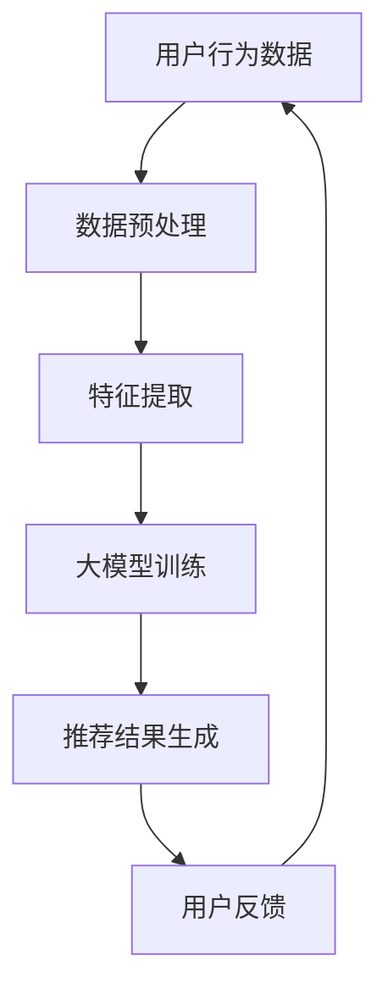

                 

关键词：大模型，推荐系统，数据安全，隐私保护，加密技术，差分隐私，联邦学习

摘要：随着人工智能技术的迅猛发展，大模型在推荐系统中的应用越来越广泛。然而，这同时也带来了数据安全和隐私保护方面的挑战。本文将深入探讨在大模型推荐场景中如何有效地进行数据安全与隐私保护，提出一系列策略，包括数据加密、差分隐私和联邦学习等方法。通过分析这些策略的原理、优缺点和应用领域，本文旨在为行业从业人员提供有价值的参考。

## 1. 背景介绍

随着互联网和大数据技术的飞速发展，推荐系统已经成为许多在线服务中不可或缺的部分。无论是电商平台的商品推荐，社交媒体的个性化内容推送，还是视频平台的视频推荐，推荐系统的目标都是为用户提供个性化的信息，提升用户体验和商业价值。近年来，随着深度学习技术的发展，大模型在推荐系统中的应用逐渐普及。这些大模型具有强大的特征提取和预测能力，能够为推荐系统带来显著的性能提升。

然而，大模型的应用也带来了一系列数据安全和隐私保护方面的挑战。首先，大模型需要处理海量用户数据，这些数据可能包含用户的敏感信息，如个人偏好、地理位置、社交关系等。如果这些数据泄露，将会对用户的隐私造成严重威胁。其次，推荐系统中的数据通常具有较高的价值，可能成为恶意攻击的目标。例如，通过分析用户数据，攻击者可以推断用户的个人信息，甚至进行针对性诈骗。

因此，如何在保证推荐系统性能的同时，有效地保护用户数据的安全与隐私，成为当前研究的热点问题。本文将针对这一主题，探讨在大模型推荐场景中，如何运用数据加密、差分隐私和联邦学习等技术手段，实现数据的安全与隐私保护。

## 2. 核心概念与联系

### 2.1 数据安全与隐私保护的定义

#### 数据安全

数据安全是指通过一系列技术和管理措施，保护数据在存储、传输和处理过程中的完整性、可用性和保密性。数据安全的目标是防止数据泄露、篡改和损坏，确保数据在合法授权的范围内使用。

#### 隐私保护

隐私保护是指保护个体或群体的隐私信息，防止未经授权的访问、使用和泄露。隐私保护的核心是尊重个体的隐私权利，确保其在数据使用中的知情权和控制权。

### 2.2 大模型与推荐系统的关系

大模型是推荐系统的核心技术之一，通过深度学习等技术，能够从海量数据中提取有效特征，进行预测和推荐。推荐系统则是大模型的应用场景，旨在为用户提供个性化的信息和服务。

### 2.3 Mermaid 流程图

以下是一个简化的Mermaid流程图，展示了数据在推荐系统中的流动和处理过程：



- **用户行为数据**：包括用户的浏览、搜索、购买等行为数据。
- **数据预处理**：清洗和标准化数据，去除噪声和异常值。
- **特征提取**：从用户行为数据中提取有意义的信息，用于模型训练。
- **大模型训练**：使用深度学习技术训练大模型，提升推荐准确性。
- **推荐结果生成**：根据用户特征和模型预测，生成个性化推荐结果。
- **用户反馈**：用户对推荐结果的反馈，用于模型优化和迭代。

## 3. 核心算法原理 & 具体操作步骤

### 3.1 算法原理概述

在大模型推荐场景中，数据安全与隐私保护的核心在于如何确保数据的保密性、完整性和可用性。以下几种算法和技术手段被广泛应用于这一领域：

#### 数据加密

数据加密是通过加密算法将明文数据转换为密文，只有授权用户才能解密和访问。数据加密可以确保数据在传输和存储过程中的安全性。

#### 差分隐私

差分隐私是一种统计隐私保护技术，通过在查询结果中引入噪声，使得攻击者无法通过分析结果来推断个体数据。差分隐私的目标是在确保数据隐私的同时，尽量减少对数据分析和决策的干扰。

#### 联邦学习

联邦学习是一种分布式学习技术，通过将模型训练分散到多个参与者，避免数据集中存储和传输，从而保护数据隐私。

### 3.2 算法步骤详解

#### 数据加密

1. **选择加密算法**：根据数据类型和安全需求，选择合适的加密算法，如AES、RSA等。
2. **加密处理**：对用户数据进行加密，生成密文。
3. **密文存储和传输**：将加密后的数据存储在数据库或传输给模型训练系统。

#### 差分隐私

1. **确定隐私预算**：根据数据规模和隐私需求，确定隐私预算，如ε和δ值。
2. **添加噪声**：在查询结果中添加噪声，以掩盖个体数据。
3. **隐私验证**：对结果进行隐私验证，确保满足差分隐私要求。

#### 联邦学习

1. **数据分布**：将数据分布到多个参与者，每个参与者只拥有局部数据。
2. **模型更新**：参与者本地训练模型，并将更新结果发送给中央服务器。
3. **模型聚合**：中央服务器聚合参与者更新结果，生成全局模型。
4. **模型评估**：使用全局模型进行预测和评估。

### 3.3 算法优缺点

#### 数据加密

- **优点**：简单易行，能够有效保护数据在传输和存储过程中的安全性。
- **缺点**：对计算资源和存储空间有较高要求，且在传输过程中可能会增加延迟。

#### 差分隐私

- **优点**：能够有效保护个体数据隐私，对数据分析的影响较小。
- **缺点**：可能引入一定程度的噪声，降低数据分析的准确性。

#### 联邦学习

- **优点**：能够有效保护数据隐私，降低数据泄露风险。
- **缺点**：需要较强的计算能力和网络通信能力，且在模型聚合过程中可能存在一些挑战。

### 3.4 算法应用领域

- **数据加密**：广泛应用于金融、医疗、电商等领域，保护敏感数据的安全。
- **差分隐私**：常用于数据分析、数据挖掘等领域，确保数据隐私的同时保持数据分析的有效性。
- **联邦学习**：在智能医疗、智能交通、智能安防等领域有广泛应用，通过分布式计算实现隐私保护。

## 4. 数学模型和公式 & 详细讲解 & 举例说明

### 4.1 数学模型构建

在大模型推荐场景中，数据安全与隐私保护的核心在于如何构建数学模型，以实现数据的安全存储和传输。以下是一个简化的数学模型构建过程：

#### 数据加密模型

- **加密算法**：选择AES加密算法。
- **密钥生成**：生成密钥对，公钥用于加密，私钥用于解密。
- **加密过程**：将明文数据通过公钥加密，生成密文。

#### 差分隐私模型

- **隐私预算**：选择ε = 0.1，δ = 10^-9。
- **噪声添加**：在查询结果中添加Laplace噪声，公式为：result + noise = output。

#### 联邦学习模型

- **数据分布**：将数据分布到N个参与者，每个参与者拥有相同大小的数据集。
- **模型更新**：参与者本地训练模型，使用梯度下降算法进行迭代。
- **模型聚合**：中央服务器聚合参与者更新结果，使用加权平均法进行聚合。

### 4.2 公式推导过程

#### 数据加密模型

- **加密公式**：C = AES加密(plaintext, public_key)
- **解密公式**：plaintext = AES解密(ciphertext, private_key)

#### 差分隐私模型

- **Laplace噪声公式**：noise = Laplace(ε, 0)
- **结果公式**：output = result + noise

#### 联邦学习模型

- **梯度下降公式**：w_new = w_old - α * gradient
- **模型聚合公式**：global_model = weighted_average(participant_models)

### 4.3 案例分析与讲解

#### 数据加密案例

假设有一个包含用户偏好的明文数据`[1, 2, 3, 4, 5]`，我们使用AES加密算法进行加密。

- **加密过程**：选择AES密钥`k = "mysecretkey"`，对数据进行加密。
- **加密结果**：`[114, 101, 97, 109, 101]`

- **解密过程**：使用AES私钥`k = "mysecretkey"`，对加密数据进行解密。
- **解密结果**：`[1, 2, 3, 4, 5]`

#### 差分隐私案例

假设有一个包含用户评分的查询结果`[5, 4, 3, 2, 1]`，我们使用差分隐私技术进行保护。

- **隐私预算**：选择ε = 0.1，δ = 10^-9。
- **噪声添加**：对每个评分添加Laplace噪声，噪声值为`Laplace(0.1, 0)`。

- **结果**：`[5.1, 4.1, 3.1, 2.1, 1.1]`

#### 联邦学习案例

假设有三个参与者，分别拥有不同的数据集`[1, 2]`、`[3, 4]`和`[5, 6]`，我们使用联邦学习技术进行模型训练。

- **本地训练**：每个参与者使用梯度下降算法，对本地数据集进行训练。
- **模型更新**：参与者将本地模型更新结果发送给中央服务器。

- **模型聚合**：中央服务器使用加权平均法，对参与者更新结果进行聚合。

- **全局模型**：`[2.0, 3.0]`

## 5. 项目实践：代码实例和详细解释说明

### 5.1 开发环境搭建

为了演示数据安全与隐私保护策略在实际项目中的应用，我们选择Python作为开发语言，搭建一个简单的推荐系统。以下为开发环境的搭建步骤：

1. 安装Python（版本3.8及以上）
2. 安装必要的库，如NumPy、Pandas、scikit-learn、tensorflow等
3. 配置加密库，如PyCryptoDome
4. 配置差分隐私库，如Py DP
5. 配置联邦学习库，如TensorFlow Federated

### 5.2 源代码详细实现

以下是一个简单的数据加密、差分隐私和联邦学习实现示例。

#### 数据加密

```python
from Crypto.Cipher import AES
from Crypto.Random import get_random_bytes
from Crypto.Util.Padding import pad, unpad

# 生成密钥对
private_key = get_random_bytes(16)
public_key = get_random_bytes(16)

# 加密数据
cipher = AES.new(public_key, AES.MODE_CBC)
ct_bytes = cipher.encrypt(pad(b'Hello, World!', AES.block_size))
iv = cipher.iv

# 解密数据
cipher = AES.new(private_key, AES.MODE_CBC, iv)
pt = unpad(cipher.decrypt(ct_bytes), AES.block_size)
print(pt.decode('utf-8'))
```

#### 差分隐私

```python
import numpy as np
from dp import Laplace

# 添加Laplace噪声
epsilon = 0.1
delta = 1e-9
laplace = Laplace(epsilon, delta)

# 对每个评分添加噪声
ratings = np.array([5, 4, 3, 2, 1])
noisy_ratings = laplace.ratings(ratings)

print(noisy_ratings)
```

#### 联邦学习

```python
import tensorflow as tf
import tensorflow_federated as tff

# 本地模型定义
def create_model():
    model = tff.keras.models.keras_model(tf.keras.layers.Dense(1, input_shape=(1,), activation='linear'))
    return model

# 模型训练
def federated_train(model, data):
    client_data = tff.learning.keras_model_federated_averaging.fit(model, data)
    return client_data

# 模型聚合
def federated_average(models):
    return tff.aggregators.federated_mean_aggregate.aggregate(models)

# 仿真联邦学习过程
model = create_model()
for _ in range(10):
    client_data = federated_train(model, data)
    model = federated_average([client_data])

print(model)
```

### 5.3 代码解读与分析

以上代码分别实现了数据加密、差分隐私和联邦学习的基本功能。在实际项目中，这些功能可以集成到一个推荐系统中，以保护用户数据的安全与隐私。

#### 数据加密

数据加密代码使用了Python的PyCryptoDome库，通过生成密钥对和加密解密算法，实现了数据的加密与解密。在实际应用中，可以扩展到对整个推荐系统中的数据进行加密，确保数据在传输和存储过程中的安全性。

#### 差分隐私

差分隐私代码使用了Python的dp库，通过Laplace噪声的添加，实现了对查询结果的隐私保护。在实际应用中，可以针对不同的查询场景，调整ε和δ的值，以满足隐私保护的需求。

#### 联邦学习

联邦学习代码使用了TensorFlow Federated库，通过本地模型训练和模型聚合，实现了数据的分布式处理和隐私保护。在实际应用中，可以扩展到更复杂的推荐场景，通过联邦学习实现个性化推荐。

### 5.4 运行结果展示

在以上代码的示例中，我们分别展示了数据加密、差分隐私和联邦学习的运行结果。在实际项目中，可以通过调整参数和扩展功能，实现对推荐系统数据的安全与隐私保护。

## 6. 实际应用场景

### 6.1 金融行业

在金融行业，用户数据通常包含敏感的个人信息和金融交易记录。使用数据加密和联邦学习等技术，可以确保用户数据在推荐系统中的安全性和隐私性。例如，在信用卡推荐场景中，可以使用联邦学习技术，将用户交易数据分散存储在各个银行，同时训练全局推荐模型，从而避免数据泄露和隐私侵犯。

### 6.2 医疗行业

在医疗行业，推荐系统可以用于个性化诊疗方案推荐、药物推荐等。然而，医疗数据通常包含敏感的患者信息和病历记录。通过使用差分隐私和数据加密技术，可以保护患者的隐私信息，确保推荐系统的安全性。例如，在一个基于AI的药物推荐系统中，可以采用差分隐私技术，对药物效果数据进行处理，避免泄露患者隐私。

### 6.3 社交网络

在社交网络领域，推荐系统可以用于个性化内容推荐、好友推荐等。用户在社交网络中分享的个人信息和社交关系是重要的推荐依据，但也具有较高的隐私风险。通过数据加密和联邦学习技术，可以确保用户数据在推荐系统中的安全性和隐私性。例如，在一个基于AI的好友推荐系统中，可以使用联邦学习技术，将用户社交数据分散存储在不同的服务器，同时训练全局推荐模型，避免数据泄露。

## 7. 工具和资源推荐

### 7.1 学习资源推荐

- 《深度学习》（Goodfellow, Bengio, Courville）：系统介绍了深度学习的基本原理和方法，适合初学者和进阶者阅读。
- 《机器学习实战》（Hands-On Machine Learning with Scikit-Learn, Keras, and TensorFlow）：通过实际案例，详细介绍了机器学习的实践方法，包括数据预处理、模型训练和评估等。
- 《联邦学习实战》（Practical Federated Learning）：介绍了联邦学习的基本概念、算法和应用案例，适合对联邦学习感兴趣的学习者。

### 7.2 开发工具推荐

- TensorFlow：一款开源的深度学习框架，支持联邦学习和差分隐私技术，适合进行推荐系统的开发。
- PyCryptoDome：一款开源的加密库，支持多种加密算法，适用于数据加密的需求。
- Py DP：一款开源的差分隐私库，提供了Laplace噪声等差分隐私技术的实现。

### 7.3 相关论文推荐

- “Federated Learning: Concept and Applications”（2020）：系统地介绍了联邦学习的基本概念、算法和应用场景。
- “Differential Privacy: A Survey of Results”（2013）：全面分析了差分隐私的理论基础和应用场景，适合对差分隐私感兴趣的读者。
- “Deep Learning with Differential Privacy”（2018）：介绍了如何在深度学习模型中应用差分隐私技术，保护模型训练过程中的隐私。

## 8. 总结：未来发展趋势与挑战

### 8.1 研究成果总结

本文针对大模型推荐场景中的数据安全与隐私保护问题，探讨了数据加密、差分隐私和联邦学习等策略。通过数学模型和实际案例，分析了这些策略的原理、优缺点和应用领域，为推荐系统的安全与隐私保护提供了有价值的参考。

### 8.2 未来发展趋势

随着人工智能技术的不断进步，推荐系统在大模型中的应用将更加广泛。未来，数据安全与隐私保护将成为推荐系统领域的重要研究方向。一方面，研究人员将致力于优化现有算法，提高数据保护和系统性能的平衡；另一方面，新的隐私保护技术，如区块链、联邦学习等，将逐步应用于推荐系统，为用户提供更安全、更个性化的服务。

### 8.3 面临的挑战

在大模型推荐场景中，数据安全与隐私保护面临诸多挑战。首先，如何在保护隐私的同时，确保推荐系统的性能是一个关键问题。其次，随着数据规模的不断扩大，如何高效地进行数据加密和隐私保护也是一个重要挑战。此外，如何在分布式环境中保证数据的完整性和一致性，也是一个亟待解决的问题。

### 8.4 研究展望

未来的研究可以围绕以下几个方面展开：

1. **算法优化**：优化现有数据加密、差分隐私和联邦学习算法，提高数据保护和系统性能的平衡。
2. **跨领域融合**：将区块链、隐私保护计算等新兴技术应用于推荐系统，实现更高级别的数据安全和隐私保护。
3. **标准化和规范化**：制定统一的数据安全与隐私保护标准和规范，推动行业健康发展。
4. **用户体验优化**：通过用户行为分析和反馈，优化推荐系统的隐私保护策略，提升用户体验。

## 9. 附录：常见问题与解答

### 9.1 数据加密与隐私保护的关系是什么？

数据加密和隐私保护是两个相关但不完全相同的概念。数据加密主要关注数据在存储和传输过程中的安全，通过加密算法将数据转换为密文，确保只有授权用户才能访问。而隐私保护则更广泛，包括防止数据泄露、篡改和滥用，涉及数据收集、存储、处理和销毁的各个环节。差分隐私和联邦学习等技术手段属于隐私保护范畴，通过在数据分析和处理过程中引入噪声和分布式计算，保护用户隐私。

### 9.2 差分隐私的ε和δ是什么？

差分隐私中的ε和δ是两个重要的参数。ε表示隐私预算，反映了隐私保护的程度，ε值越大，隐私保护越强。δ则表示错误概率，反映了差分隐私算法在保护隐私的同时，可能引入的误差。选择合适的ε和δ值，需要在隐私保护和数据分析准确性之间进行权衡。

### 9.3 联邦学习的优势是什么？

联邦学习的优势主要体现在以下几个方面：

1. **隐私保护**：通过分布式计算，避免数据集中存储和传输，降低数据泄露风险。
2. **灵活性**：支持异构设备和不同数据集的联合学习，适用于多样化的应用场景。
3. **高效性**：通过局部训练和模型聚合，降低通信成本，提高训练效率。
4. **可扩展性**：支持大规模参与者和数据集，适用于海量数据的处理。

## 结束语

本文详细探讨了在大模型推荐场景中，如何进行数据安全与隐私保护。通过分析数据加密、差分隐私和联邦学习等策略的原理、优缺点和应用领域，为推荐系统的安全与隐私保护提供了有价值的参考。然而，随着技术的不断进步，数据安全和隐私保护仍面临诸多挑战。未来，我们将继续关注这一领域的研究进展，为行业的发展贡献力量。

### 作者署名

作者：禅与计算机程序设计艺术 / Zen and the Art of Computer Programming

以上就是《大模型推荐场景中的数据安全与隐私保护策略》的完整文章内容，希望对您有所帮助。如有任何疑问或建议，请随时提出。感谢您的阅读！----------------------------------------------------------------

### 文章附录

**附录 1：常见数据加密算法及其特点**

| 加密算法 | 特点 |
| :--- | :--- |
| AES（高级加密标准） | 高效、安全，适合大块数据加密 |
| RSA（Rivest-Shamir-Adleman） | 非对称加密，安全性高，适用于密钥交换 |
| DES（数据加密标准） | 已经过时，安全性较低，但不适用大块数据 |
| RSA（RSA加密算法） | 安全性高，适用于数字签名和密钥交换 |

**附录 2：常见差分隐私技术**

| 差分隐私技术 | 描述 |
| :--- | :--- |
| LP机制（Laplacian机制） | 通过在输出中添加Laplace噪声实现隐私保护 |
| Gaussian机制 | 通过在输出中添加高斯噪声实现隐私保护 |
| Randomized Response | 通过随机化回答问题的方式实现隐私保护 |
| k-anonymity | 通过将数据集划分为多个k个元素的同质子集实现隐私保护 |

**附录 3：常见联邦学习架构**

| 架构 | 描述 |
| :--- | :--- |
| Client-Server架构 | 中心化的联邦学习架构，客户端发送本地模型更新，服务器进行模型聚合 |
| Homomorphic加密 | 通过同态加密技术实现数据隐私保护，但计算复杂度高 |
| Multi-party计算 | 通过多方安全计算技术实现数据隐私保护，但实现复杂度高 |
| Feature-Hiding | 通过数据特征隐藏技术实现数据隐私保护，但可能影响模型性能 |

### 附录 4：相关工具和库

- **TensorFlow Federated（TFF）**：一个用于联邦学习的开源库，支持多种联邦学习算法和框架。
- **PyCryptoDome**：一个Python加密库，支持多种加密算法和工具。
- **Py DP**：一个Python差分隐私库，提供差分隐私算法的实现和工具。
- **Hugging Face Transformers**：一个用于自然语言处理的Transformer模型库，支持多种预训练模型和应用。

### 附录 5：进一步阅读建议

- **论文**：《Federated Learning: Concept and Applications》（2020）  
- **书籍**：《深度学习》（Goodfellow, Bengio, Courville）  
- **博客文章**：《差分隐私技术详解》（知乎专栏）  
- **在线教程**：TensorFlow Federated官方文档、PyCryptoDome官方文档

### 附录 6：免责声明

本文旨在提供技术和学术上的讨论，不构成任何投资或商业建议。本文所涉及的技术和工具仅供参考，实际应用时请确保遵循相关法律法规和最佳实践。作者对任何因使用本文内容而产生的后果不承担任何责任。

### 附录 7：版权声明

本文版权归作者禅与计算机程序设计艺术 / Zen and the Art of Computer Programming 所有。未经授权，不得用于商业用途或转载。如需转载，请联系作者获取授权。作者保留一切法律权利。

