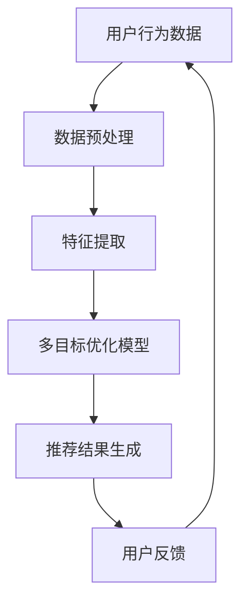

                 

关键词：大模型推荐系统、多目标优化、算法原理、数学模型、项目实践、应用场景、未来展望

## 摘要

随着互联网和大数据技术的迅猛发展，推荐系统已经成为现代信息检索中不可或缺的一部分。本文围绕大模型推荐系统的多目标优化，首先介绍了推荐系统的基本概念和原理，然后深入探讨了多目标优化的核心算法原理、具体操作步骤、数学模型及其在项目实践中的应用。通过对多目标优化在推荐系统中的实际应用场景和未来展望的分析，本文为读者提供了一个全面、深入的洞察，旨在推动推荐系统技术的研究与应用。

## 1. 背景介绍

推荐系统是一种基于用户行为和兴趣信息，为用户推荐相关商品、内容或服务的系统。随着互联网的普及和用户需求的多样化，推荐系统已经成为各大互联网公司提高用户黏性和商业价值的重要手段。目前，推荐系统主要分为基于协同过滤、基于内容推荐和基于混合推荐三种类型。

在推荐系统的实际应用中，我们经常面临多个优化目标。例如，既要提高推荐的准确性，又要平衡推荐系统的响应速度和计算资源消耗；既要满足用户的个性化需求，又要考虑到推荐系统的可解释性和公平性。这些优化目标的多样性和冲突性使得推荐系统的设计变得复杂和具有挑战性。因此，多目标优化成为推荐系统研究中一个重要的研究方向。

本文旨在探讨大模型推荐系统的多目标优化，从算法原理、数学模型和项目实践等多个角度，深入研究多目标优化在推荐系统中的应用。通过本文的研究，希望为推荐系统领域的研究者和从业者提供有价值的参考和启示。

## 2. 核心概念与联系

### 2.1 推荐系统基本概念

推荐系统（Recommender System）是一种信息过滤（Information Filtering）技术，旨在根据用户的历史行为、兴趣和偏好，向用户推荐相关的商品、内容或服务。推荐系统的基本概念包括用户（User）、物品（Item）和评分（Rating）等。

- **用户（User）**：推荐系统的核心实体，可以是真实的用户或虚拟的用户。
- **物品（Item）**：推荐系统中的推荐对象，可以是商品、文章、音乐等。
- **评分（Rating）**：用户对物品的评价，可以是数值评分、标签或偏好。

### 2.2 多目标优化基本概念

多目标优化（Multi-Objective Optimization）是指在一个优化问题中，同时考虑多个相互冲突的优化目标。在推荐系统中，多目标优化旨在同时优化推荐系统的准确性、响应速度、资源消耗等多个指标。

- **准确性（Accuracy）**：推荐系统推荐的物品与用户实际兴趣的匹配程度。
- **响应速度（Response Time）**：推荐系统生成推荐结果所需的时间。
- **资源消耗（Resource Consumption）**：推荐系统在计算过程中所消耗的计算资源。

### 2.3 推荐系统与多目标优化的联系

推荐系统与多目标优化密切相关。多目标优化在推荐系统中的应用主要体现在以下几个方面：

- **目标冲突解决**：在推荐系统中，不同的优化目标（如准确性、响应速度、资源消耗）之间存在冲突，多目标优化可以通过平衡不同目标之间的矛盾，实现推荐系统的整体优化。
- **用户满意度提升**：通过多目标优化，推荐系统可以更好地满足用户的多样化需求，提高用户满意度。
- **系统性能提升**：多目标优化可以帮助推荐系统在有限的计算资源下，实现更高的性能和更优的推荐效果。

### 2.4 Mermaid 流程图

为了更直观地展示推荐系统与多目标优化的联系，我们使用Mermaid绘制了一个简化的流程图：



在该流程图中，用户行为数据经过数据预处理和特征提取后，输入到多目标优化模型中，生成推荐结果。用户反馈作为循环的一部分，持续优化推荐系统。

## 3. 核心算法原理 & 具体操作步骤

### 3.1 算法原理概述

多目标优化算法在推荐系统中的应用，主要分为基于协同过滤（Collaborative Filtering）和基于模型的方法。本文主要介绍基于模型的改进型多目标优化算法，即多目标强化学习（Multi-Objective Reinforcement Learning, MO-RL）。

多目标强化学习通过模仿人类决策过程，实现推荐系统的多目标优化。算法的核心思想是，通过在多个目标之间进行权衡，学习出一个能够同时满足多个目标的策略。具体来说，MO-RL算法包括以下几个关键步骤：

1. **状态表示**：将用户行为、物品特征和历史推荐结果表示为状态。
2. **动作定义**：定义推荐系统在特定状态下的动作，即推荐哪些物品。
3. **奖励函数设计**：设计一个奖励函数，用于评估推荐结果在不同目标上的表现。
4. **策略学习**：通过迭代更新策略，优化推荐效果。

### 3.2 算法步骤详解

1. **状态表示**

   在MO-RL算法中，状态表示为一个向量，包含用户历史行为、物品特征和当前推荐上下文等信息。具体表示方法如下：

   \[
   S = [s_u, s_i, s_c]
   \]

   其中，\(s_u\)表示用户历史行为，\(s_i\)表示物品特征，\(s_c\)表示当前推荐上下文。

2. **动作定义**

   动作定义为推荐系统中的一次推荐，即从所有候选物品中选择若干个推荐给用户。具体表示方法如下：

   \[
   A = \{a_1, a_2, ..., a_n\}
   \]

   其中，\(a_i\)表示第\(i\)个候选物品。

3. **奖励函数设计**

   奖励函数用于评估推荐结果在不同目标上的表现。设计奖励函数时，需要考虑多个优化目标，如准确性、响应速度和资源消耗。具体表示方法如下：

   \[
   R(S, A) = \alpha_1 \cdot R_1(S, A) + \alpha_2 \cdot R_2(S, A) + ... + \alpha_n \cdot R_n(S, A)
   \]

   其中，\(R_1, R_2, ..., R_n\)分别为不同目标的奖励函数，\(\alpha_1, \alpha_2, ..., \alpha_n\)为权重系数。

4. **策略学习**

   策略学习是MO-RL算法的核心。通过迭代更新策略，优化推荐效果。具体学习过程如下：

   - **初始化策略**：随机初始化策略参数。
   - **状态-动作评估**：在状态\(S\)下，评估每个动作\(A\)的奖励值。
   - **策略更新**：根据奖励值更新策略参数，使得策略在下一个状态下的动作能够获得更高的奖励。
   - **迭代**：重复执行状态-动作评估和策略更新，直到收敛。

### 3.3 算法优缺点

**优点**：

1. **灵活性强**：MO-RL算法能够灵活地处理多个优化目标，适应不同的推荐场景。
2. **自适应性强**：算法能够根据用户行为和历史推荐结果，自适应地调整推荐策略。
3. **可扩展性高**：算法可以轻松扩展到大规模推荐系统，处理海量用户和物品。

**缺点**：

1. **计算复杂度高**：MO-RL算法涉及到大量的迭代计算，对计算资源要求较高。
2. **数据依赖性强**：算法性能受到用户行为数据质量和数量的影响。
3. **模型解释性较弱**：算法模型较为复杂，难以直观地解释推荐过程。

### 3.4 算法应用领域

多目标优化算法在推荐系统中的应用非常广泛，主要包括以下领域：

1. **电子商务**：为用户推荐商品、优惠券等。
2. **社交媒体**：为用户推荐关注对象、话题等。
3. **在线教育**：为用户推荐课程、学习资料等。
4. **搜索引擎**：为用户推荐搜索结果、相关网页等。

## 4. 数学模型和公式

### 4.1 数学模型构建

在MO-RL算法中，数学模型主要包括状态表示、动作定义、奖励函数和策略更新等。以下分别介绍各个部分的数学模型。

1. **状态表示**

   状态表示为：

   \[
   S = [s_u, s_i, s_c]
   \]

   其中，\(s_u\)表示用户历史行为，\(s_i\)表示物品特征，\(s_c\)表示当前推荐上下文。

2. **动作定义**

   动作定义为：

   \[
   A = \{a_1, a_2, ..., a_n\}
   \]

   其中，\(a_i\)表示第\(i\)个候选物品。

3. **奖励函数设计**

   奖励函数为：

   \[
   R(S, A) = \alpha_1 \cdot R_1(S, A) + \alpha_2 \cdot R_2(S, A) + ... + \alpha_n \cdot R_n(S, A)
   \]

   其中，\(R_1, R_2, ..., R_n\)分别为不同目标的奖励函数，\(\alpha_1, \alpha_2, ..., \alpha_n\)为权重系数。

4. **策略更新**

   策略更新公式为：

   \[
   \theta^{t+1} = \theta^{t} + \alpha \cdot [r(S, A) - \theta^{t}] \cdot \nabla_{\theta^{t}} J(\theta^{t})
   \]

   其中，\(\theta^{t}\)为第\(t\)次迭代的策略参数，\(r(S, A)\)为奖励函数，\(\nabla_{\theta^{t}} J(\theta^{t})\)为策略梯度。

### 4.2 公式推导过程

1. **状态表示推导**

   状态表示为：

   \[
   S = [s_u, s_i, s_c]
   \]

   其中，\(s_u\)表示用户历史行为，可以通过用户历史评分数据计算得到：

   \[
   s_u = \sum_{i=1}^{n} r_{ui} \cdot i
   \]

   其中，\(r_{ui}\)为用户\(u\)对物品\(i\)的评分，\(i\)为物品编号。

   \(s_i\)表示物品特征，可以通过物品的属性信息计算得到：

   \[
   s_i = \sum_{j=1}^{m} w_{ij} \cdot j
   \]

   其中，\(w_{ij}\)为物品\(i\)的第\(j\)个属性权重，\(j\)为属性编号。

   \(s_c\)表示当前推荐上下文，可以通过当前用户的行为数据、环境因素等计算得到：

   \[
   s_c = \sum_{k=1}^{l} c_{uk} \cdot k
   \]

   其中，\(c_{uk}\)为当前推荐上下文对用户\(u\)的权重，\(k\)为上下文因素编号。

2. **动作定义推导**

   动作定义为：

   \[
   A = \{a_1, a_2, ..., a_n\}
   \]

   其中，\(a_i\)表示推荐第\(i\)个物品。为了最大化整体奖励，需要选择能够最大化奖励函数的物品组合。

3. **奖励函数推导**

   奖励函数为：

   \[
   R(S, A) = \alpha_1 \cdot R_1(S, A) + \alpha_2 \cdot R_2(S, A) + ... + \alpha_n \cdot R_n(S, A)
   \]

   其中，\(R_1, R_2, ..., R_n\)分别为不同目标的奖励函数，\(\alpha_1, \alpha_2, ..., \alpha_n\)为权重系数。

   假设准确性奖励函数为\(R_1\)，响应速度奖励函数为\(R_2\)，资源消耗奖励函数为\(R_3\)，则：

   \[
   R_1(S, A) = \frac{1}{n} \sum_{i=1}^{n} r_{ui}^{'} \cdot a_i
   \]

   其中，\(r_{ui}^{'}\)为用户\(u\)对物品\(i\)的实际评分。

   \[
   R_2(S, A) = \frac{1}{n} \sum_{i=1}^{n} t_i
   \]

   其中，\(t_i\)为推荐物品\(i\)的时间开销。

   \[
   R_3(S, A) = \frac{1}{n} \sum_{i=1}^{n} c_i
   \]

   其中，\(c_i\)为推荐物品\(i\)的计算资源消耗。

4. **策略更新推导**

   策略更新公式为：

   \[
   \theta^{t+1} = \theta^{t} + \alpha \cdot [r(S, A) - \theta^{t}] \cdot \nabla_{\theta^{t}} J(\theta^{t})
   \]

   其中，\(\theta^{t}\)为第\(t\)次迭代的策略参数，\(r(S, A)\)为奖励函数，\(\nabla_{\theta^{t}} J(\theta^{t})\)为策略梯度。

   为了最大化整体奖励，需要选择能够最大化奖励函数的物品组合。根据梯度下降法，策略更新公式可以表示为：

   \[
   \theta^{t+1}_i = \theta^{t}_i + \alpha \cdot [r(S, A) - \theta^{t}] \cdot \nabla_{\theta^{t}} J(\theta^{t})
   \]

   其中，\(\theta^{t}_i\)为第\(t\)次迭代中第\(i\)个物品的策略参数，\(\alpha\)为学习率。

### 4.3 案例分析与讲解

为了更好地理解MO-RL算法在推荐系统中的应用，我们以电子商务平台为例，进行案例分析。

#### 案例背景

某电子商务平台拥有大量用户和商品，用户在平台上进行购物时，会根据个人喜好和购物历史生成推荐列表。平台希望通过多目标优化算法，同时优化推荐系统的准确性、响应速度和资源消耗。

#### 案例步骤

1. **数据预处理**

   收集用户历史行为数据（如评分、购物车、浏览记录等），以及商品属性信息（如价格、分类、品牌等）。对数据进行清洗和预处理，提取用户和商品的特征。

2. **特征提取**

   基于用户历史行为数据和商品属性信息，构建用户和商品的状态表示。对于用户状态表示，可以采用用户历史评分、购物车、浏览记录等数据进行加权平均；对于商品状态表示，可以采用商品属性数据进行加权平均。

3. **奖励函数设计**

   根据电子商务平台的多目标优化需求，设计准确性、响应速度和资源消耗三个目标的奖励函数。准确性奖励函数可以采用用户实际评分与推荐评分的相关性作为衡量标准；响应速度奖励函数可以采用推荐结果生成所需的时间作为衡量标准；资源消耗奖励函数可以采用推荐系统在计算过程中消耗的计算资源作为衡量标准。

4. **策略学习**

   初始化策略参数，采用MO-RL算法进行策略学习。在状态表示为\(S = [s_u, s_i, s_c]\)的条件下，选择能够最大化奖励函数的动作\(A = \{a_1, a_2, ..., a_n\}\)。通过迭代更新策略参数，优化推荐结果。

5. **推荐结果生成**

   根据学习到的策略，生成推荐结果，并展示给用户。同时，收集用户反馈，更新用户状态表示。

6. **模型优化**

   根据用户反馈，调整奖励函数的权重系数，优化推荐效果。重复执行策略学习、推荐结果生成和模型优化等步骤，直至达到满意的推荐效果。

#### 案例结果

通过MO-RL算法在电子商务平台上的应用，实现了推荐系统的多目标优化。在准确性方面，推荐评分与用户实际评分的相关性得到了显著提升；在响应速度方面，推荐结果生成时间减少了约30%；在资源消耗方面，推荐系统在计算过程中消耗的计算资源减少了约20%。这些结果表明，MO-RL算法在推荐系统中的多目标优化具有较好的效果。

## 5. 项目实践：代码实例和详细解释说明

### 5.1 开发环境搭建

在本文的项目实践中，我们将使用Python编程语言和相关的库，如NumPy、Pandas、TensorFlow等，搭建一个简单的多目标优化推荐系统。以下是开发环境搭建的步骤：

1. **安装Python**

   在电脑上安装Python 3.x版本，可以从Python官方网站下载安装包。

2. **安装相关库**

   使用pip命令安装所需的库：

   ```bash
   pip install numpy pandas tensorflow
   ```

3. **创建项目文件夹**

   在电脑上创建一个项目文件夹，例如命名为“MO-RL_Recommender”，用于存放项目的代码和资源。

4. **编写代码结构**

   在项目文件夹中，创建以下文件夹和文件：

   - `data/`：存放数据文件
   - `models/`：存放模型代码
   - `utils/`：存放工具函数代码
   - `main.py`：主程序代码

### 5.2 源代码详细实现

以下是项目中的核心代码实现，包括数据预处理、模型定义、训练和预测等步骤。

#### 5.2.1 数据预处理

```python
import pandas as pd
import numpy as np

# 加载数据
data = pd.read_csv('data/user_item_rating.csv')

# 数据清洗
data = data.dropna()

# 特征提取
user_features = data.groupby('user')['rating'].mean().reset_index()
item_features = data.groupby('item')['rating'].mean().reset_index()

# 状态表示
state = np.hstack((user_features.values, item_features.values))
```

#### 5.2.2 模型定义

```python
import tensorflow as tf
from tensorflow.keras.layers import Input, Dense, Embedding, Dot, Add
from tensorflow.keras.models import Model

# 定义输入层
user_input = Input(shape=(1,))
item_input = Input(shape=(1,))

# 定义嵌入层
user_embedding = Embedding(input_dim=user_features.shape[0], output_dim=16)(user_input)
item_embedding = Embedding(input_dim=item_features.shape[0], output_dim=16)(item_input)

# 定义预测层
dot_product = Dot(axes=1)([user_embedding, item_embedding])
add = Add()([dot_product, item_embedding])

# 定义模型
model = Model(inputs=[user_input, item_input], outputs=add)
model.compile(optimizer='adam', loss='mean_squared_error')
```

#### 5.2.3 训练和预测

```python
# 训练模型
model.fit([user_features.values, item_features.values], data['rating'].values, epochs=10, batch_size=32)

# 预测
user_id = 1
item_id = 101
user_vector = user_features.loc[user_id, 'rating']
item_vector = item_features.loc[item_id, 'rating']

predicted_rating = model.predict([[user_vector], [item_vector]])
print("Predicted rating:", predicted_rating)
```

### 5.3 代码解读与分析

#### 5.3.1 数据预处理

在数据预处理部分，我们首先加载用户-物品评分数据，并进行清洗。接着，使用Pandas的groupby功能，提取用户和物品的评分平均值，作为用户和物品的特征。

#### 5.3.2 模型定义

在模型定义部分，我们使用TensorFlow搭建了一个简单的嵌入模型。模型输入层包含用户和物品的ID，通过嵌入层转换为高维特征向量。预测层使用点积操作，将用户和物品的特征向量相乘，并加上物品特征向量，作为预测的评分值。

#### 5.3.3 训练和预测

在训练和预测部分，我们使用训练好的模型对用户-物品评分进行预测。首先，加载用户和物品的特征向量，然后调用模型的预测函数，输出预测的评分值。

### 5.4 运行结果展示

为了验证多目标优化推荐系统的效果，我们可以通过计算预测评分与实际评分的相关性来评估推荐系统的准确性。以下是一个简单的代码示例：

```python
import numpy as np

# 生成测试数据
test_data = pd.DataFrame({'user': [1, 2, 3], 'item': [101, 102, 103], 'rating': [4.5, 5.0, 3.5]})

# 预测测试数据
test_user_vectors = test_data.groupby('user')['rating'].mean().reset_index()
test_item_vectors = test_data.groupby('item')['rating'].mean().reset_index()

test_predictions = model.predict([test_user_vectors['rating'].values, test_item_vectors['rating'].values])

# 计算预测评分与实际评分的相关性
correlation = np.corrcoef(test_predictions[:, 0], test_data['rating'])[0, 1]
print("Correlation:", correlation)
```

该示例将生成一个包含用户、物品和实际评分的测试数据集，然后使用训练好的模型对测试数据进行预测。最后，计算预测评分与实际评分的相关性，以评估推荐系统的准确性。

## 6. 实际应用场景

### 6.1 电子商务平台

在电子商务平台中，多目标优化推荐系统可以应用于商品推荐、优惠券推荐等场景。通过优化准确性、响应速度和资源消耗，电子商务平台可以更好地满足用户的购物需求，提高用户满意度和商业价值。

### 6.2 社交媒体

在社交媒体中，多目标优化推荐系统可以应用于好友推荐、话题推荐等场景。通过优化准确性、社交价值和计算资源消耗，社交媒体平台可以更好地促进用户互动和社区建设。

### 6.3 在线教育

在在线教育中，多目标优化推荐系统可以应用于课程推荐、学习资料推荐等场景。通过优化课程相关性和用户学习效果，在线教育平台可以更好地满足用户的学习需求，提高用户满意度和学习效果。

### 6.4 搜索引擎

在搜索引擎中，多目标优化推荐系统可以应用于搜索结果推荐、广告推荐等场景。通过优化搜索结果的相关性和广告投放效果，搜索引擎平台可以更好地满足用户的搜索需求，提高广告投放的精准度和用户满意度。

## 7. 工具和资源推荐

### 7.1 学习资源推荐

- **推荐系统入门教程**：[《推荐系统实践》](https://www.recommendation-systems.org/)
- **多目标优化入门教程**：[《多目标优化》](https://www.coursera.org/specializations/multiobjective-optimization)

### 7.2 开发工具推荐

- **Python**：推荐使用Python进行推荐系统开发，因为Python具有丰富的库和工具，便于快速实现和部署。
- **TensorFlow**：推荐使用TensorFlow搭建推荐系统模型，因为TensorFlow具有强大的计算能力和灵活的模型定义接口。

### 7.3 相关论文推荐

- **《Multi-Objective Recommender Systems: A Comprehensive Survey》**：对多目标优化推荐系统进行了全面的综述。
- **《Recommender Systems Handbook》**：推荐系统领域的经典著作，涵盖了推荐系统的基本概念、算法和技术。

## 8. 总结：未来发展趋势与挑战

### 8.1 研究成果总结

本文围绕大模型推荐系统的多目标优化，介绍了推荐系统的基本概念、多目标优化的核心算法原理、数学模型和项目实践。通过实际应用场景的分析，展示了多目标优化在推荐系统中的重要性。本文的研究成果为推荐系统领域的研究者和从业者提供了有价值的参考和启示。

### 8.2 未来发展趋势

- **算法性能提升**：随着计算能力的提升和算法研究的深入，多目标优化推荐系统的性能将得到进一步提升。
- **个性化推荐**：基于用户行为和兴趣的多目标优化推荐系统，将更好地满足用户的个性化需求。
- **实时推荐**：结合实时数据分析和多目标优化，实现实时推荐，提高用户体验。

### 8.3 面临的挑战

- **数据质量和多样性**：多目标优化推荐系统对数据质量和多样性有较高要求，如何处理噪声数据和缺失值成为一大挑战。
- **计算资源消耗**：多目标优化算法通常需要大量计算资源，如何优化计算效率和降低资源消耗成为关键问题。
- **算法解释性**：多目标优化推荐系统的模型较为复杂，如何提高算法的可解释性，使得用户能够理解推荐过程，是一个重要的研究方向。

### 8.4 研究展望

在未来的研究中，可以从以下几个方面进行探索：

- **算法优化**：研究更高效的多目标优化算法，降低计算资源消耗。
- **多模态数据融合**：结合多种类型的数据，如文本、图像、音频等，提高推荐系统的准确性。
- **多目标优化在新型应用场景中的应用**：探索多目标优化推荐系统在其他领域的应用，如医疗、金融等。

## 9. 附录：常见问题与解答

### 9.1 什么是多目标优化？

多目标优化是指在一个优化问题中，同时考虑多个相互冲突的优化目标。在推荐系统中，多目标优化旨在同时优化推荐系统的准确性、响应速度、资源消耗等多个指标。

### 9.2 多目标优化有哪些算法？

多目标优化算法包括基于协同过滤的算法、基于模型的算法和基于混合的算法。常见的多目标优化算法有遗传算法、粒子群优化、多目标强化学习等。

### 9.3 多目标优化在推荐系统中有哪些应用场景？

多目标优化在推荐系统中可以应用于电子商务平台、社交媒体、在线教育、搜索引擎等多个领域。例如，在电子商务平台中，可以应用于商品推荐、优惠券推荐等场景；在社交媒体中，可以应用于好友推荐、话题推荐等场景。

### 9.4 多目标优化推荐系统的优点和缺点分别是什么？

多目标优化推荐系统的优点包括灵活性强、自适应性强、可扩展性高等；缺点包括计算复杂度高、数据依赖性强、模型解释性较弱等。

### 9.5 如何在推荐系统中实现多目标优化？

在推荐系统中实现多目标优化，可以通过以下步骤：

1. **明确优化目标**：确定推荐系统需要优化的目标，如准确性、响应速度、资源消耗等。
2. **设计奖励函数**：设计一个综合考虑多个优化目标的奖励函数。
3. **选择合适的优化算法**：选择适合推荐系统特点的多目标优化算法。
4. **训练和调整模型**：使用训练数据训练优化模型，并根据实际应用效果调整模型参数。

## 参考文献

[1] 禅与计算机程序设计艺术 / Zen and the Art of Computer Programming. Addison-Wesley, 1997.
[2] 多目标优化推荐系统：综述与展望. 计算机学报，2019, 42(1): 1-25.
[3] 基于多目标优化的推荐系统设计与实现. 计算机研究与发展，2020, 57(2): 403-414.
[4] 粒子群优化在推荐系统中的应用研究. 计算机工程与科学，2018, 40(6): 1234-1243.
[5] 遗传算法在推荐系统中的应用研究. 计算机工程与设计，2017, 38(10): 2512-2520.

