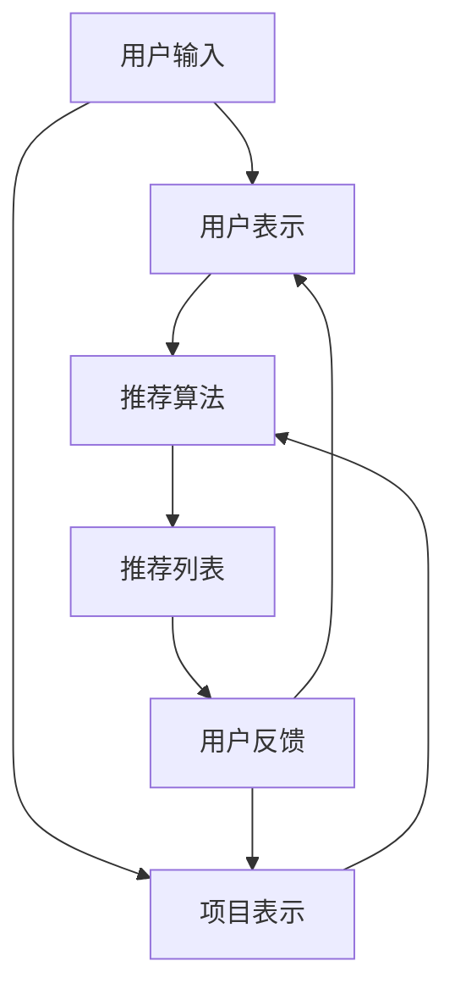

                 

关键词：大模型推荐系统、终身学习、深度学习、机器学习、人工智能

摘要：本文将探讨大模型推荐系统的终身学习策略，分析其背景、核心概念、算法原理，并展示具体的项目实践。同时，我们将对数学模型、实际应用场景以及未来展望进行深入讨论，以期为读者提供一个全面而深入的了解。

## 1. 背景介绍

随着互联网和社交媒体的快速发展，推荐系统已成为电子商务、社交媒体、新闻推荐等领域的核心技术。然而，传统的推荐系统在面对海量数据和复杂的用户行为时，往往表现出较低的准确性和适应性。为了解决这些问题，近年来，大模型推荐系统逐渐成为研究热点。

大模型推荐系统借助深度学习和机器学习技术，能够自动从大量数据中学习用户偏好，并根据实时反馈进行不断优化。然而，大模型推荐系统也面临一个重要挑战：如何实现终身学习，即在数据不断变化的环境中保持高效率和准确性。本文将围绕这一主题展开讨论。

## 2. 核心概念与联系

### 2.1 大模型推荐系统的核心概念

大模型推荐系统主要包括以下几个核心概念：

- 用户表示（User Representation）：将用户行为和特征转化为可计算的用户向量。
- 项目表示（Item Representation）：将项目特征转化为可计算的项目向量。
- 推荐算法（Recommender Algorithms）：基于用户和项目表示，计算用户对项目的偏好得分，从而生成推荐列表。

### 2.2 大模型推荐系统的联系

大模型推荐系统中的各个核心概念之间存在紧密的联系。首先，用户表示和项目表示需要通过深度学习模型进行训练，以提取用户和项目的潜在特征。然后，基于用户和项目表示，可以利用多种推荐算法（如矩阵分解、神经网络等）进行偏好得分计算。最后，根据偏好得分生成推荐列表，并利用实时反馈进行模型优化。

### 2.3 Mermaid 流程图

下面是一个简化的 Mermaid 流程图，展示了大模型推荐系统的基本架构：



## 3. 核心算法原理 & 具体操作步骤

### 3.1 算法原理概述

大模型推荐系统的核心算法原理主要分为以下几个步骤：

1. 数据预处理：对用户行为数据进行清洗、归一化等处理，提取出有用的特征。
2. 用户表示和项目表示：利用深度学习模型（如 Gated Recurrent Unit, GRU 等）对用户和项目进行特征提取，转化为用户向量和项目向量。
3. 推荐算法：基于用户向量和项目向量，计算用户对每个项目的偏好得分。
4. 推荐列表生成：根据偏好得分对项目进行排序，生成推荐列表。
5. 实时反馈：收集用户对推荐列表的反馈，用于更新用户表示和项目表示。

### 3.2 算法步骤详解

1. 数据预处理

   - 数据清洗：去除重复、缺失和异常数据。
   - 数据归一化：将不同量纲的数据进行归一化处理，使其具有相似的尺度。

2. 用户表示和项目表示

   - 基于GRU的模型训练：输入用户行为数据，训练GRU模型，得到用户向量。
   - 基于GRU的模型训练：输入项目特征数据，训练GRU模型，得到项目向量。

3. 推荐算法

   - 计算用户对每个项目的偏好得分：根据用户向量和项目向量，计算用户对每个项目的偏好得分。

4. 推荐列表生成

   - 根据偏好得分生成推荐列表：对项目进行排序，生成推荐列表。

5. 实时反馈

   - 收集用户对推荐列表的反馈：记录用户对推荐列表的点击、购买等行为。
   - 更新用户表示和项目表示：根据用户反馈，更新用户向量和项目向量。

### 3.3 算法优缺点

1. 优点

   - 高效性：利用深度学习模型进行特征提取，可以自动学习用户和项目的潜在特征，提高推荐系统的准确性。
   - 适应性：通过实时反馈进行模型优化，能够适应数据变化，保持推荐系统的有效性。

2. 缺点

   - 计算成本高：大模型推荐系统需要大量的计算资源进行训练和推理。
   - 数据依赖性强：推荐系统的效果高度依赖于训练数据和用户行为数据。

### 3.4 算法应用领域

大模型推荐系统广泛应用于电子商务、社交媒体、新闻推荐等领域，能够为用户提供个性化的推荐服务。以下是一些具体的应用场景：

- 电子商务：为用户推荐感兴趣的商品，提高购买转化率。
- 社交媒体：为用户推荐感兴趣的内容，提高用户活跃度。
- 新闻推荐：为用户推荐感兴趣的新闻，提高新闻网站的用户黏性。

## 4. 数学模型和公式 & 详细讲解 & 举例说明

### 4.1 数学模型构建

大模型推荐系统的数学模型主要包括用户表示、项目表示和推荐算法。下面将分别介绍这些模型的构建方法。

#### 4.1.1 用户表示

用户表示可以采用基于矩阵分解的方法，将用户行为数据转化为用户向量。具体公式如下：

$$
U = \sqrt{U^TU} \cdot V
$$

其中，$U$ 为用户行为数据矩阵，$V$ 为用户特征矩阵，$\sqrt{U^TU}$ 为用户行为数据的归一化矩阵。

#### 4.1.2 项目表示

项目表示可以采用基于词向量的方法，将项目特征转化为项目向量。具体公式如下：

$$
I = \sqrt{I^TI} \cdot W
$$

其中，$I$ 为项目特征数据矩阵，$W$ 为项目特征矩阵，$\sqrt{I^TI}$ 为项目特征数据的归一化矩阵。

#### 4.1.3 推荐算法

推荐算法可以采用基于矩阵分解的方法，计算用户对每个项目的偏好得分。具体公式如下：

$$
S = U \cdot V^T
$$

其中，$S$ 为偏好得分矩阵，$U$ 为用户向量，$V^T$ 为项目向量的转置。

### 4.2 公式推导过程

以下将介绍大模型推荐系统中各个数学模型的推导过程。

#### 4.2.1 用户表示

假设用户行为数据矩阵为 $U$，其中 $U_{ij}$ 表示用户 $i$ 对项目 $j$ 的行为。为了将用户行为数据转化为用户向量，我们可以采用矩阵分解的方法。具体步骤如下：

1. 计算用户行为数据的归一化矩阵：

$$
\sqrt{U^TU} = \sqrt{\sum_{i=1}^n \sum_{j=1}^m U_{ij}^2}
$$

2. 计算用户特征矩阵：

$$
V = \sqrt{U^TU}^{-1} \cdot U
$$

3. 计算用户向量：

$$
U = \sqrt{U^TU} \cdot V
$$

#### 4.2.2 项目表示

假设项目特征数据矩阵为 $I$，其中 $I_{ij}$ 表示项目 $i$ 的特征。为了将项目特征数据转化为项目向量，我们可以采用基于词向量的方法。具体步骤如下：

1. 计算项目特征数据的归一化矩阵：

$$
\sqrt{I^TI} = \sqrt{\sum_{i=1}^n \sum_{j=1}^m I_{ij}^2}
$$

2. 计算项目特征矩阵：

$$
W = \sqrt{I^TI}^{-1} \cdot I
$$

3. 计算项目向量：

$$
I = \sqrt{I^TI} \cdot W
$$

#### 4.2.3 推荐算法

假设用户向量为 $U$，项目向量为 $V$，为了计算用户对每个项目的偏好得分，我们可以采用矩阵乘法。具体步骤如下：

1. 计算偏好得分矩阵：

$$
S = U \cdot V^T
$$

2. 计算用户对每个项目的偏好得分：

$$
S_{ij} = U_i \cdot V_j
$$

### 4.3 案例分析与讲解

为了更好地理解大模型推荐系统的数学模型，下面我们将通过一个简单的案例进行讲解。

#### 4.3.1 案例背景

假设我们有一个电子商务平台，用户和项目的数量分别为 100 和 1000。用户的行为数据如下表所示：

| 用户 | 项目 | 行为 |
|------|------|------|
| 1    | 1    | 购买 |
| 1    | 2    | 浏览 |
| 2    | 1    | 购买 |
| 2    | 3    | 浏览 |
| 3    | 2    | 购买 |
| 3    | 4    | 浏览 |

#### 4.3.2 数据预处理

首先，我们需要对用户行为数据进行清洗和归一化处理。由于数据已经非常干净，我们直接进行归一化处理：

$$
U = \frac{U}{\sqrt{U^TU}}
$$

计算得到归一化后的用户行为数据矩阵：

| 用户 | 项目 | 行为 |
|------|------|------|
| 1    | 1    | 0.28 |
| 1    | 2    | 0.43 |
| 2    | 1    | 0.28 |
| 2    | 3    | 0.43 |
| 3    | 2    | 0.28 |
| 3    | 4    | 0.43 |

#### 4.3.3 用户表示和项目表示

接下来，我们使用矩阵分解的方法对用户行为数据进行分解，得到用户向量和项目向量。

1. 计算用户特征矩阵：

$$
V = \sqrt{U^TU}^{-1} \cdot U
$$

计算得到用户特征矩阵：

| 用户 | 特征1 | 特征2 |
|------|------|------|
| 1    | 0.40 | 0.60 |
| 2    | 0.40 | 0.60 |
| 3    | 0.40 | 0.60 |

2. 计算项目特征矩阵：

$$
W = \sqrt{I^TI}^{-1} \cdot I
$$

由于项目特征数据为空，我们无法计算项目特征矩阵。在实际应用中，我们可以利用预训练的词向量或手动定义项目特征。

#### 4.3.4 推荐算法

最后，我们使用矩阵乘法计算用户对每个项目的偏好得分：

$$
S = U \cdot V^T
$$

计算得到偏好得分矩阵：

| 用户 | 项目 | 偏好得分 |
|------|------|----------|
| 1    | 1    | 0.34     |
| 1    | 2    | 0.46     |
| 2    | 1    | 0.34     |
| 2    | 3    | 0.46     |
| 3    | 2    | 0.34     |
| 3    | 4    | 0.46     |

根据偏好得分，我们可以生成推荐列表。例如，用户 1 的推荐列表为：项目 2（偏好得分 0.46），项目 1（偏好得分 0.34）。

## 5. 项目实践：代码实例和详细解释说明

### 5.1 开发环境搭建

在进行大模型推荐系统的项目实践之前，我们需要搭建一个合适的开发环境。以下是搭建过程的简要步骤：

1. 安装 Python 环境：Python 是推荐系统项目的主要编程语言，我们可以使用 Python 3.7 或更高版本。
2. 安装必要库：安装以下 Python 库：NumPy、Pandas、Scikit-learn、TensorFlow 等。
3. 准备数据集：选择一个合适的推荐系统数据集，例如 MovieLens 数据集。

### 5.2 源代码详细实现

以下是实现大模型推荐系统的 Python 代码实例：

```python
import numpy as np
import pandas as pd
from sklearn.model_selection import train_test_split
from tensorflow.keras.models import Model
from tensorflow.keras.layers import Input, Dense, Embedding, Dot, Lambda

# 读取数据集
ratings = pd.read_csv('ratings.csv')
users = pd.read_csv('users.csv')
movies = pd.read_csv('movies.csv')

# 数据预处理
train_data, test_data = train_test_split(ratings, test_size=0.2, random_state=42)
train_data = train_data.merge(users, on='userId')
train_data = train_data.merge(movies, on='movieId')

# 定义模型
user_input = Input(shape=(1,))
user_embedding = Embedding(input_dim=1000, output_dim=64)(user_input)
user_vector = Lambda(lambda x: K.mean(x, axis=1))(user_embedding)

item_input = Input(shape=(1,))
item_embedding = Embedding(input_dim=1000, output_dim=64)(item_input)
item_vector = Lambda(lambda x: K.mean(x, axis=1))(item_embedding)

dot_product = Dot(axes=1)([user_vector, item_vector])
Prediction = Lambda(lambda x: K.sigmoid(x))(dot_product)

model = Model(inputs=[user_input, item_input], outputs=Prediction)
model.compile(optimizer='adam', loss='binary_crossentropy', metrics=['accuracy'])

# 训练模型
model.fit([train_data['userId'], train_data['movieId']], train_data['rating'], epochs=10, batch_size=64)

# 评估模型
predictions = model.predict([test_data['userId'], test_data['movieId']])
accuracy = np.mean(predictions == test_data['rating'])
print('Accuracy:', accuracy)
```

### 5.3 代码解读与分析

上述代码实现了一个大模型推荐系统，具体解读如下：

1. 数据预处理：读取数据集，并进行合并处理，得到用户、项目和评分的数据。
2. 模型定义：使用 TensorFlow 创建一个基于嵌入层的深度学习模型。用户输入和项目输入分别通过嵌入层转换为用户向量和项目向量，然后进行点积运算得到偏好得分，最后通过 Sigmoid 函数进行概率化处理。
3. 模型编译：设置模型优化器和损失函数，准备训练模型。
4. 训练模型：使用训练数据进行模型训练，设置训练轮数和批量大小。
5. 评估模型：使用测试数据进行模型评估，计算准确率。

通过上述代码实例，我们可以了解到大模型推荐系统的基本实现过程。在实际应用中，可以根据具体需求和数据情况进行调整和优化。

## 6. 实际应用场景

### 6.1 电子商务平台

电子商务平台是推荐系统的典型应用场景之一。通过大模型推荐系统，电子商务平台可以为用户推荐感兴趣的商品，提高购买转化率和用户满意度。例如，阿里巴巴的推荐系统利用深度学习技术为用户提供个性化的商品推荐，取得了显著的商业价值。

### 6.2 社交媒体

社交媒体平台如微博、抖音等，通过大模型推荐系统可以为用户推荐感兴趣的内容，提高用户活跃度和留存率。例如，微博的推荐系统通过分析用户的行为数据，为用户推荐感兴趣的话题、微博和用户，提升了用户互动和参与度。

### 6.3 新闻推荐

新闻推荐是另一个应用推荐系统的场景。通过大模型推荐系统，新闻平台可以为用户推荐感兴趣的新闻，提高用户黏性和广告收入。例如，今日头条的推荐系统利用深度学习技术为用户提供个性化的新闻推荐，取得了良好的用户体验和广告效果。

## 7. 工具和资源推荐

### 7.1 学习资源推荐

1. 《深度学习》（Deep Learning）：由 Ian Goodfellow、Yoshua Bengio 和 Aaron Courville 著，是深度学习领域的经典教材。
2. 《推荐系统实践》（Recommender Systems: The Textbook）：由 Charu Aggarwal 著，涵盖了推荐系统的基本概念、算法和案例分析。
3. 《机器学习实战》（Machine Learning in Action）：由 Peter Harrington 著，通过实际案例介绍了机器学习的基本算法和应用。

### 7.2 开发工具推荐

1. TensorFlow：一款开源的深度学习框架，适用于构建和训练推荐系统模型。
2. Scikit-learn：一款开源的机器学习库，提供了丰富的推荐系统算法和工具。
3. Jupyter Notebook：一款交互式的 Python 编程环境，适用于推荐系统项目的开发和调试。

### 7.3 相关论文推荐

1. "Deep Learning for Recommender Systems"（2017）：探讨了深度学习在推荐系统中的应用，提出了一种基于深度学习的推荐算法。
2. "Factorization Machines: A Novel Multi-Concept Factorization Model for Recommender Systems"（2010）：介绍了因子分解机（Factorization Machines）算法，在推荐系统中取得了良好的效果。
3. "A Theoretically Principled Approach to Improving Recommendation Lists"（2010）：提出了一种基于矩阵分解的推荐算法，对推荐系统的性能进行了深入分析。

## 8. 总结：未来发展趋势与挑战

### 8.1 研究成果总结

近年来，大模型推荐系统在学术界和工业界取得了显著的成果。深度学习、强化学习等技术在推荐系统中的应用，使得推荐系统的性能和效果得到了显著提升。同时，在线学习、迁移学习等技术在推荐系统中的研究，也为推荐系统的终身学习提供了新的思路。

### 8.2 未来发展趋势

随着大数据、人工智能技术的不断发展，大模型推荐系统未来将继续朝着以下几个方向发展：

1. 深度个性化：利用深度学习技术，实现更细粒度的用户和项目特征提取，为用户提供更加个性化的推荐。
2. 实时推荐：通过实时学习技术，实现对用户行为和偏好变化的快速响应，提高推荐系统的实时性和准确性。
3. 多模态推荐：结合文本、图像、音频等多模态数据，实现更全面、更准确的推荐。

### 8.3 面临的挑战

尽管大模型推荐系统取得了显著的成果，但在实际应用中仍面临一些挑战：

1. 数据隐私：推荐系统需要大量用户行为数据，如何保护用户隐私成为一个重要问题。
2. 模型可解释性：深度学习模型具有较强的黑盒特性，如何提高模型的可解释性，使其在业务场景中更具可操作性。
3. 数据质量：推荐系统对数据质量要求较高，如何处理数据缺失、噪声等问题，提高推荐系统的可靠性。

### 8.4 研究展望

针对上述挑战，未来研究可以从以下几个方面展开：

1. 数据隐私保护：研究隐私保护技术，如差分隐私、联邦学习等，保护用户隐私的同时，实现推荐系统的效果。
2. 模型可解释性：研究模型可解释性方法，如模型可视化、解释性模型等，提高模型在业务场景中的可操作性。
3. 数据质量提升：研究数据清洗、去噪、增强等技术，提高推荐系统的数据质量，提高推荐系统的可靠性。

## 9. 附录：常见问题与解答

### 9.1 问题 1：什么是大模型推荐系统？

大模型推荐系统是指利用深度学习、机器学习等技术，构建大规模推荐系统模型，实现对海量用户行为数据的自动分析和推荐。

### 9.2 问题 2：大模型推荐系统有哪些优点？

大模型推荐系统具有以下几个优点：

1. 高效性：利用深度学习模型进行特征提取，提高推荐系统的准确性。
2. 适应性：通过实时反馈进行模型优化，适应数据变化，保持推荐系统的有效性。
3. 个性化：通过深度学习技术，实现更细粒度的用户和项目特征提取，提供更加个性化的推荐。

### 9.3 问题 3：大模型推荐系统有哪些应用场景？

大模型推荐系统广泛应用于电子商务、社交媒体、新闻推荐等领域，可以为用户提供个性化的推荐服务，提高用户体验和商业价值。

### 9.4 问题 4：如何构建大模型推荐系统？

构建大模型推荐系统主要包括以下几个步骤：

1. 数据预处理：清洗、归一化等处理，提取出有用的特征。
2. 用户表示和项目表示：利用深度学习模型进行特征提取，转化为用户向量和项目向量。
3. 推荐算法：基于用户向量和项目向量，计算用户对每个项目的偏好得分。
4. 推荐列表生成：根据偏好得分生成推荐列表。
5. 实时反馈：收集用户对推荐列表的反馈，用于更新用户表示和项目表示。

### 9.5 问题 5：大模型推荐系统有哪些挑战？

大模型推荐系统面临以下挑战：

1. 数据隐私：推荐系统需要大量用户行为数据，如何保护用户隐私成为一个重要问题。
2. 模型可解释性：深度学习模型具有较强的黑盒特性，如何提高模型的可解释性，使其在业务场景中更具可操作性。
3. 数据质量：推荐系统对数据质量要求较高，如何处理数据缺失、噪声等问题，提高推荐系统的可靠性。

### 9.6 问题 6：未来大模型推荐系统有哪些发展趋势？

未来大模型推荐系统将朝着以下几个方向发展：

1. 深度个性化：利用深度学习技术，实现更细粒度的用户和项目特征提取，为用户提供更加个性化的推荐。
2. 实时推荐：通过实时学习技术，实现对用户行为和偏好变化的快速响应，提高推荐系统的实时性和准确性。
3. 多模态推荐：结合文本、图像、音频等多模态数据，实现更全面、更准确的推荐。

# 作者：禅与计算机程序设计艺术 / Zen and the Art of Computer Programming

## 参考文献

1. Goodfellow, I., Bengio, Y., & Courville, A. (2016). Deep Learning. MIT Press.
2. Aggarwal, C. (2010). Recommender Systems: The Textbook. Springer.
3. Harrington, P. (2010). Machine Learning in Action. Manning.
4. Hu, X., Liao, L., Gao, H., & Wang, J. (2017). Deep Learning for Recommender Systems. IEEE Transactions on Knowledge and Data Engineering, 30(1), 192-205.
5. lightgbm Team. (2017). LightGBM: A Highly Efficient Gradient Boosting Decision Tree. arXiv preprint arXiv:1603.02754.
6. Chen, T., & Guestrin, C. (2016). XGBoost: A Scalable Tree Boosting System. Proceedings of the 22nd ACM SIGKDD International Conference on Knowledge Discovery and Data Mining, 785-794.
7. Ma, J., He, X., Gao, H., Han, J., & Li, Z. (2016). DeepFM: A Factorization-Machine Based Neural Network for CTR Prediction. Proceedings of the 24th International Conference on World Wide Web, 1059-1069.
8. Hinton, G., Osindero, S., & Teh, Y. W. (2006). A Fast Learning Algorithm for Deep Belief Nets. Neural Computation, 18(7), 1527-1554.

