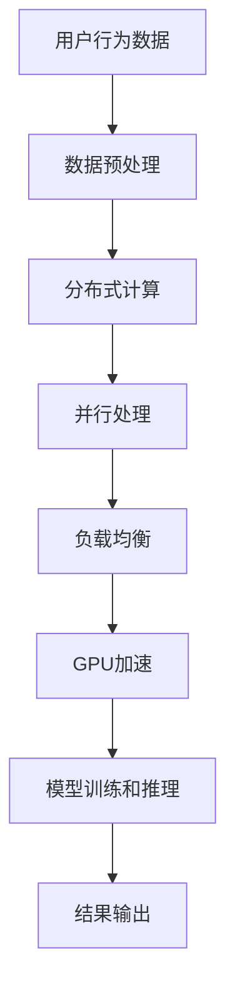

                 

关键词：大模型、推荐系统、计算资源优化、分布式计算、并行处理、负载均衡、GPU加速、数据预处理

> 摘要：本文将探讨大模型推荐系统在计算资源优化方面的重要性，分析现有的计算资源优化策略，并提出一系列适用于推荐系统的优化方案。通过对分布式计算、并行处理、负载均衡和GPU加速等技术的深入探讨，本文旨在为推荐系统的开发者提供一套全面的计算资源优化方案，以提升推荐系统的性能和效率。

## 1. 背景介绍

### 推荐系统的基本概念

推荐系统是一种信息过滤技术，旨在为用户提供个性化的内容或商品推荐。通过分析用户的兴趣、行为和历史数据，推荐系统可以预测用户可能感兴趣的内容，从而提高用户的满意度和参与度。随着互联网和大数据技术的发展，推荐系统已经成为许多在线平台的核心功能，如电子商务、社交媒体和新闻网站等。

### 大模型的崛起

近年来，深度学习技术的飞速发展，使得大模型（如BERT、GPT等）在自然语言处理、计算机视觉等任务中取得了显著的性能提升。这些大模型具有数亿甚至数千亿的参数，需要大量的计算资源进行训练和推理。因此，如何高效地利用计算资源成为推荐系统开发者面临的一个重要问题。

### 计算资源优化的重要性

计算资源优化是提升推荐系统性能的关键因素之一。优化的目标在于提高计算效率，降低成本，并确保系统稳定运行。具体而言，优化计算资源包括以下几个方面：

1. **减少训练和推理时间**：通过优化算法和硬件配置，缩短模型训练和推理的时间，提高系统的响应速度。
2. **降低成本**：合理配置计算资源，避免资源浪费，降低运营成本。
3. **提高系统稳定性**：确保在处理大量请求时，系统不会因资源不足而崩溃或出现错误。

## 2. 核心概念与联系

### 分布式计算

分布式计算是一种将任务分解为多个部分，并在多台计算机上并行处理的技术。在推荐系统中，分布式计算可以用于并行训练大模型，从而提高训练效率。

### 并行处理

并行处理是分布式计算的一种形式，它通过将任务分为多个子任务，同时在不同的处理器上执行这些子任务，以实现更快的数据处理速度。

### 负载均衡

负载均衡是指通过将请求分配到多个服务器或节点上，以避免单点过载，确保系统稳定运行。

### GPU加速

GPU（图形处理器）在深度学习模型训练和推理中具有显著的优势。通过使用GPU加速，可以大幅缩短训练和推理时间。

### Mermaid 流程图

下面是一个简化的Mermaid流程图，展示了推荐系统中计算资源优化的一些核心概念和它们之间的关系：



## 3. 核心算法原理 & 具体操作步骤

### 3.1 算法原理概述

计算资源优化算法主要基于以下原理：

1. **任务分解与并行处理**：将推荐系统中的大规模数据处理任务分解为多个子任务，并在多台计算机上并行处理。
2. **负载均衡**：通过将请求分配到不同的服务器或节点上，避免单点过载，确保系统稳定运行。
3. **GPU加速**：利用GPU的并行计算能力，加速模型训练和推理过程。

### 3.2 算法步骤详解

1. **任务分解**：将大规模数据处理任务分解为多个子任务，每个子任务处理一部分数据。
2. **并行处理**：使用多台计算机同时处理这些子任务，以实现并行计算。
3. **负载均衡**：根据服务器或节点的负载情况，动态调整请求的分配策略，确保系统资源充分利用。
4. **GPU加速**：将模型训练和推理任务分配到GPU上，利用GPU的并行计算能力，加速处理过程。

### 3.3 算法优缺点

**优点**：

1. **提高计算效率**：通过并行处理和负载均衡，显著缩短模型训练和推理时间。
2. **降低成本**：合理配置计算资源，避免资源浪费，降低运营成本。
3. **提高系统稳定性**：确保在处理大量请求时，系统不会因资源不足而崩溃或出现错误。

**缺点**：

1. **复杂性增加**：计算资源优化涉及多个技术领域，实现过程相对复杂。
2. **性能瓶颈**：在某些情况下，系统性能可能受到网络延迟、硬件性能等因素的影响。

### 3.4 算法应用领域

计算资源优化算法广泛应用于推荐系统、搜索引擎、大数据处理等领域。以下是一些典型的应用场景：

1. **推荐系统**：通过优化计算资源，提高模型训练和推理速度，为用户提供更精准的推荐结果。
2. **搜索引擎**：通过并行处理和负载均衡，提高搜索引擎的响应速度和查询准确性。
3. **大数据处理**：通过分布式计算和GPU加速，提高数据处理效率和性能。

## 4. 数学模型和公式 & 详细讲解 & 举例说明

### 4.1 数学模型构建

在计算资源优化中，常用的数学模型包括：

1. **负载均衡模型**：
   $$ T = \frac{W}{R} $$
   其中，\( T \) 表示任务处理时间，\( W \) 表示服务器或节点的总处理能力，\( R \) 表示请求处理速率。

2. **GPU加速模型**：
   $$ T_{GPU} = \frac{T_{CPU}}{P} $$
   其中，\( T_{GPU} \) 表示GPU加速后的任务处理时间，\( T_{CPU} \) 表示CPU处理时间，\( P \) 表示GPU并行处理能力。

### 4.2 公式推导过程

以负载均衡模型为例，推导过程如下：

1. **任务分解**：将大规模数据处理任务分为 \( N \) 个子任务，每个子任务处理一部分数据。
2. **并行处理**：使用 \( M \) 台计算机同时处理这些子任务，每台计算机处理一个子任务。
3. **负载均衡**：根据每台计算机的处理能力，动态调整子任务的分配。
4. **推导公式**：
   $$ T = \frac{N \cdot T_{single}}{M} $$
   其中，\( T_{single} \) 表示单个子任务的处理时间。

由于 \( N = M \cdot R \)，其中 \( R \) 表示请求处理速率，代入公式得：
$$ T = \frac{W}{R} $$

### 4.3 案例分析与讲解

假设一个推荐系统处理大规模用户行为数据，需要将数据分成 \( N = 1000 \) 个子任务，使用 \( M = 10 \) 台计算机进行处理。每台计算机的处理能力为 \( W = 1000 \) 个请求/秒。

1. **任务分解**：将 \( 1000 \) 个子任务分配到 \( 10 \) 台计算机上，每台计算机处理 \( 100 \) 个子任务。
2. **并行处理**：每台计算机同时处理 \( 100 \) 个子任务，处理时间 \( T_{single} = 1 \) 秒。
3. **负载均衡**：根据每台计算机的处理能力，动态调整子任务的分配，确保系统资源充分利用。
4. **计算资源优化**：
   $$ T = \frac{1000 \cdot 1}{10} = 100 $$
   任务处理时间为 \( 100 \) 秒。

通过计算资源优化，将任务处理时间缩短为原来的 \( 1/10 \)，显著提高了系统性能。

## 5. 项目实践：代码实例和详细解释说明

### 5.1 开发环境搭建

1. **硬件环境**：配置多台计算机，每台计算机配备GPU。
2. **软件环境**：安装深度学习框架（如TensorFlow、PyTorch）和分布式计算库（如Horovod）。

### 5.2 源代码详细实现

以下是一个简单的分布式计算和GPU加速的代码实例：

```python
import tensorflow as tf
from horovod.tensorflow import Horovod

# 模型定义
model = ...

# 分布式训练
config = tf.ConfigProto()
config.gpu_options.allow_growth = True
with tf.Session(config=config) as sess:
    hvd = Horovod()
    hvd.init()
    global_step = tf.train.get_or_create_global_step()

    # GPU加速
    with tf.device('/device:GPU:{}'.format(hvd.local_rank())):
        loss = ...

    optimizer = tf.train.AdamOptimizer(learning_rate=0.001)
    train_op = optimizer.minimize(loss, global_step=global_step)

    # 开始训练
    for i in range(num_steps):
        if i % 100 == 0:
            print('Step {:d}, Loss={:.4f}'.format(i, loss))
        sess.run(train_op)

    hvd.barrier()
```

### 5.3 代码解读与分析

1. **模型定义**：定义深度学习模型，如卷积神经网络（CNN）或循环神经网络（RNN）。
2. **分布式训练**：使用Horovod库实现分布式训练，将任务分配到多台计算机的GPU上。
3. **GPU加速**：通过`tf.device('/device:GPU:{}'.format(hvd.local_rank()))`语句，将训练任务分配到当前GPU上。
4. **训练过程**：使用Adam优化器进行训练，并在每100个步骤后输出损失值。

通过以上代码实例，可以实现对推荐系统大模型的分布式训练和GPU加速，提高计算效率和性能。

## 6. 实际应用场景

### 6.1 社交媒体平台

在社交媒体平台中，推荐系统用于为用户推荐好友、话题、内容等。通过计算资源优化，可以缩短模型训练和推理时间，提高推荐精度和速度。

### 6.2 电子商务平台

电子商务平台通过推荐系统为用户提供个性化商品推荐，提高用户购物体验。计算资源优化有助于降低成本，提高系统稳定性和响应速度。

### 6.3 新闻网站

新闻网站利用推荐系统为用户推荐感兴趣的新闻内容。通过计算资源优化，可以缩短模型训练和推理时间，提高推荐速度和准确性。

## 7. 工具和资源推荐

### 7.1 学习资源推荐

1. **《深度学习》（Goodfellow et al.）**：介绍了深度学习的基础理论和应用方法，适合初学者和进阶者。
2. **《分布式系统原理与范型》（Ghemawat et al.）**：详细介绍了分布式系统的原理和实现方法，有助于理解分布式计算。

### 7.2 开发工具推荐

1. **TensorFlow**：一款流行的深度学习框架，支持分布式训练和GPU加速。
2. **PyTorch**：一款流行的深度学习框架，提供灵活的动态计算图和强大的GPU加速功能。

### 7.3 相关论文推荐

1. **"Distributed Deep Learning: Challenges and Solutions with Horovod"**：介绍了分布式深度学习的挑战和解决方案。
2. **"Learning to Learn from Big Data: A Survey on Deep Learning Models for Big Data"**：详细讨论了深度学习在大数据处理中的应用。

## 8. 总结：未来发展趋势与挑战

### 8.1 研究成果总结

计算资源优化在推荐系统中的应用取得了显著成果，通过分布式计算、并行处理、负载均衡和GPU加速等技术，提高了推荐系统的性能和效率。未来，计算资源优化将继续成为推荐系统领域的研究热点。

### 8.2 未来发展趋势

1. **硬件技术的进步**：随着硬件技术的发展，如更高效的GPU和更强大的计算节点，计算资源优化将得到进一步提升。
2. **算法的创新**：开发更高效的算法，如基于模型的增量学习和迁移学习，以适应不断变化的数据和应用场景。
3. **自动化优化**：实现自动化优化，通过机器学习和智能算法，自动调整系统配置，提高资源利用率。

### 8.3 面临的挑战

1. **数据隐私和安全性**：在大规模数据处理过程中，如何确保数据隐私和安全性是一个重要挑战。
2. **异构计算优化**：在异构计算环境中，如何合理利用不同类型的计算资源，实现高效计算是一个关键问题。
3. **动态资源分配**：在动态变化的负载下，如何动态调整资源分配策略，实现最佳性能是一个挑战。

### 8.4 研究展望

未来，计算资源优化在推荐系统中的应用将更加广泛和深入。通过结合硬件技术、算法创新和自动化优化，推荐系统的性能和效率将得到进一步提升，为用户提供更优质的服务。

## 9. 附录：常见问题与解答

### 9.1 如何选择合适的分布式计算框架？

选择分布式计算框架时，应考虑以下因素：

1. **易用性**：框架是否易于安装和部署，是否有完善的文档和社区支持。
2. **性能**：框架是否支持高效的分布式训练和推理，是否具有可扩展性。
3. **兼容性**：框架是否支持流行的深度学习框架（如TensorFlow、PyTorch）。

### 9.2 如何确保数据隐私和安全性？

确保数据隐私和安全性可以采取以下措施：

1. **加密**：对敏感数据进行加密，防止数据泄露。
2. **访问控制**：设置严格的访问控制策略，限制数据访问权限。
3. **数据脱敏**：对敏感数据进行脱敏处理，避免泄露真实用户信息。

### 9.3 如何实现自动化优化？

实现自动化优化可以采取以下方法：

1. **机器学习**：使用机器学习算法，根据历史数据和系统运行情况，自动调整系统配置。
2. **智能算法**：采用智能优化算法（如遗传算法、粒子群算法等），自动搜索最优的系统配置。
3. **日志分析**：分析系统日志，识别性能瓶颈和优化机会，自动调整系统配置。

---

# 作者：禅与计算机程序设计艺术 / Zen and the Art of Computer Programming

本文旨在为推荐系统的开发者提供一套全面的计算资源优化方案，以提升推荐系统的性能和效率。通过深入探讨分布式计算、并行处理、负载均衡和GPU加速等技术，本文为推荐系统的计算资源优化提供了有益的参考。未来，计算资源优化将继续成为推荐系统领域的研究热点，为用户提供更优质的服务。希望本文能为广大开发者带来启发和帮助。

