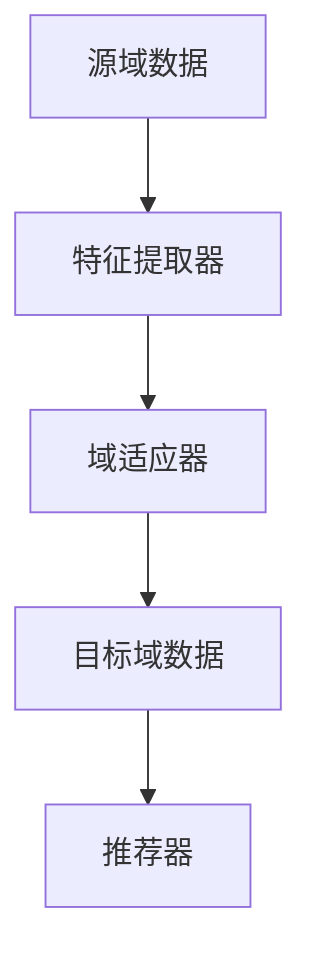

                 

关键词：大模型，推荐系统，迁移学习，策略，深度学习，机器学习，算法，应用领域

摘要：随着大数据和人工智能技术的迅猛发展，推荐系统已成为互联网企业的重要盈利手段。然而，由于大模型在训练过程中需要海量数据和高计算资源，迁移学习作为一种有效的数据利用和计算资源优化手段，被广泛应用于推荐系统的开发与优化中。本文将详细探讨大模型推荐系统的迁移学习策略，包括其核心概念、算法原理、数学模型、项目实践和未来展望。

## 1. 背景介绍

推荐系统是一种基于数据分析、挖掘和用户行为分析的技术，旨在向用户提供个性化的信息和服务。近年来，随着互联网的普及和用户需求的增长，推荐系统在电子商务、社交媒体、在线视频、新闻资讯等众多领域得到了广泛应用。其中，大模型推荐系统由于其能够处理海量数据和提供更精准的推荐结果，成为了研究热点。

传统的推荐系统主要依赖于用户历史行为数据，但大模型推荐系统不仅需要处理用户历史行为数据，还需要考虑内容信息、社交关系等多种数据源，这使得推荐系统的复杂度和计算资源需求大大增加。而迁移学习作为一种有效的数据利用和计算资源优化手段，可以在大模型推荐系统中发挥重要作用。

## 2. 核心概念与联系

迁移学习（Transfer Learning）是一种利用已有模型的参数或结构来解决新问题的方法。在推荐系统中，迁移学习可以帮助减少对新数据的依赖，提高模型的泛化能力和效率。

### 2.1. 关键概念

- **源域（Source Domain）**：训练模型所使用的数据来源领域。
- **目标域（Target Domain）**：模型需要预测或决策的数据来源领域。
- **迁移学习目标**：将源域的知识迁移到目标域，以便更好地解决目标域的问题。

### 2.2. 关联架构图



在上图中，源域数据经过特征提取器提取特征，再通过域适应器进行迁移学习，最终生成目标域数据，并用于推荐器生成推荐结果。

## 3. 核心算法原理 & 具体操作步骤

### 3.1. 算法原理概述

迁移学习在大模型推荐系统中的应用主要包括以下几个方面：

1. **特征迁移**：将源域特征迁移到目标域，以减少特征学习的计算量。
2. **模型迁移**：将源域模型迁移到目标域，以利用源域模型的知识。
3. **融合迁移**：将源域特征和模型进行融合，以生成目标域的特征和模型。

### 3.2. 算法步骤详解

1. **数据预处理**：对源域和目标域的数据进行清洗、归一化等处理，确保数据质量。
2. **特征提取**：利用深度学习等方法从源域数据中提取特征。
3. **域适应**：通过对抗性训练、领域自适应等方法，将源域特征适应到目标域。
4. **融合迁移**：将源域特征和目标域特征进行融合，生成目标域的特征。
5. **模型训练**：利用目标域数据对模型进行训练，优化模型参数。
6. **推荐生成**：利用训练好的模型生成推荐结果，并评估推荐效果。

### 3.3. 算法优缺点

**优点**：

- **提高模型泛化能力**：通过迁移学习，可以减少对新数据的依赖，提高模型的泛化能力。
- **降低训练成本**：利用源域数据迁移，可以降低目标域数据的训练成本。
- **提高推荐效果**：融合迁移学习可以生成更准确的推荐结果。

**缺点**：

- **域适应效果不稳定**：域适应过程可能受到数据分布变化的影响，导致适应效果不稳定。
- **计算资源需求大**：迁移学习需要大量的计算资源，对硬件设备要求较高。

### 3.4. 算法应用领域

迁移学习在大模型推荐系统中的应用广泛，包括但不限于以下领域：

- **电子商务**：利用用户历史购买数据推荐商品。
- **社交媒体**：根据用户行为数据推荐好友、兴趣组等。
- **在线视频**：根据用户观看记录推荐视频。
- **新闻资讯**：根据用户阅读偏好推荐新闻。

## 4. 数学模型和公式

### 4.1. 数学模型构建

迁移学习中的数学模型主要包括以下部分：

1. **特征提取模型**：用于从源域数据中提取特征。
2. **域适应模型**：用于将源域特征适应到目标域。
3. **推荐模型**：用于生成推荐结果。

### 4.2. 公式推导过程

假设源域数据为 $X_S$，目标域数据为 $X_T$，特征提取模型为 $F$，域适应模型为 $G$，推荐模型为 $R$，则有：

$$
X_S = F_S(X_S) \\
X_T = G_T(F_S(X_S)) \\
R_T = R_T(X_T)
$$

其中，$F_S$ 和 $F_T$ 分别表示源域和目标域的特征提取模型，$G_S$ 和 $G_T$ 分别表示源域和目标域的域适应模型，$R_S$ 和 $R_T$ 分别表示源域和目标域的推荐模型。

### 4.3. 案例分析与讲解

以电子商务推荐系统为例，假设源域为用户购买历史数据，目标域为用户浏览记录。首先，利用深度学习模型提取用户购买历史数据中的特征，然后通过对抗性训练方法将特征适应到用户浏览记录数据，最后利用用户浏览记录数据生成推荐结果。

## 5. 项目实践：代码实例和详细解释说明

### 5.1. 开发环境搭建

- Python 3.8及以上版本
- TensorFlow 2.4及以上版本
- Keras 2.4及以上版本

### 5.2. 源代码详细实现

```python
# 导入相关库
import tensorflow as tf
from tensorflow.keras.models import Model
from tensorflow.keras.layers import Input, Dense, Conv2D, Flatten

# 定义源域特征提取模型
input_source = Input(shape=(784,))
dense_source = Dense(128, activation='relu')(input_source)
feature_source = Flatten()(dense_source)

# 定义目标域特征提取模型
input_target = Input(shape=(784,))
dense_target = Dense(128, activation='relu')(input_target)
feature_target = Flatten()(dense_target)

# 定义域适应模型
domain_adapter = Model(inputs=input_source, outputs=dense_target)
domain_adapter.compile(optimizer='adam', loss='mse')

# 定义推荐模型
input_recommend = Input(shape=(128,))
output_recommend = Dense(1, activation='sigmoid')(input_recommend)
recommend_model = Model(inputs=input_recommend, outputs=output_recommend)
recommend_model.compile(optimizer='adam', loss='binary_crossentropy')

# 对抗性训练
for epoch in range(num_epochs):
    # 训练域适应模型
    domain_adapter.fit(feature_source, feature_target, epochs=1, batch_size=64)
    
    # 训练推荐模型
    feature_target = domain_adapter.predict(feature_source)
    recommend_model.fit(feature_target, y, epochs=1, batch_size=64)

# 生成推荐结果
recommendations = recommend_model.predict(feature_target)

# 输出推荐结果
print(recommendations)
```

### 5.3. 代码解读与分析

1. **导入相关库**：导入 TensorFlow、Keras 等库。
2. **定义源域特征提取模型**：输入层为 784 维的向量，通过一层全连接层（Dense）进行特征提取，输出层为 128 维的向量。
3. **定义目标域特征提取模型**：输入层为 784 维的向量，通过一层全连接层（Dense）进行特征提取，输出层为 128 维的向量。
4. **定义域适应模型**：利用对抗性训练方法将源域特征适应到目标域。
5. **定义推荐模型**：输入层为 128 维的向量，通过一层全连接层（Dense）进行预测，输出层为 1 维的向量。
6. **对抗性训练**：通过训练域适应模型和推荐模型，实现对源域特征向目标域特征的迁移。
7. **生成推荐结果**：利用训练好的推荐模型生成推荐结果。

## 6. 实际应用场景

### 6.1. 电子商务推荐系统

电子商务推荐系统利用用户购买历史数据，通过迁移学习策略提高推荐效果。例如，某电商网站利用用户购买历史数据提取特征，然后利用对抗性训练方法将这些特征适应到用户浏览记录，从而生成更准确的推荐结果。

### 6.2. 社交媒体推荐系统

社交媒体推荐系统根据用户行为数据，利用迁移学习策略生成好友推荐、兴趣组推荐等。例如，某社交媒体平台利用用户点赞、评论等行为数据，通过对抗性训练方法将这些行为数据适应到用户浏览记录，从而生成更准确的好友推荐和兴趣组推荐。

### 6.3. 在线视频推荐系统

在线视频推荐系统利用用户观看记录，通过迁移学习策略提高推荐效果。例如，某视频网站利用用户观看记录提取特征，然后利用对抗性训练方法将这些特征适应到用户浏览记录，从而生成更准确的视频推荐。

## 7. 工具和资源推荐

### 7.1. 学习资源推荐

- 《深度学习》（Ian Goodfellow、Yoshua Bengio、Aaron Courville 著）
- 《迁移学习实践指南》（刘知远、张俊凯 著）

### 7.2. 开发工具推荐

- TensorFlow
- Keras

### 7.3. 相关论文推荐

- "Domain-Adversarial Training of Neural Networks"
- "Unsupervised Domain Adaptation with Virtual Adversarial Training"

## 8. 总结：未来发展趋势与挑战

### 8.1. 研究成果总结

本文主要探讨了迁移学习在大模型推荐系统中的应用，包括核心概念、算法原理、数学模型、项目实践和实际应用场景等方面。通过本文的研究，我们可以看出迁移学习在提高模型泛化能力、降低训练成本、提高推荐效果等方面具有重要意义。

### 8.2. 未来发展趋势

随着大数据和人工智能技术的不断发展，迁移学习在大模型推荐系统中的应用前景将越来越广阔。未来，我们将看到更多基于迁移学习的大模型推荐系统在实际场景中得到广泛应用。

### 8.3. 面临的挑战

迁移学习在大模型推荐系统中的应用仍然面临一些挑战，如域适应效果不稳定、计算资源需求大等。为了克服这些挑战，我们需要进一步研究新的迁移学习算法和优化方法。

### 8.4. 研究展望

未来，迁移学习在大模型推荐系统中的应用将更加深入和广泛。我们将看到更多基于迁移学习的大模型推荐系统在实际场景中得到广泛应用，为用户提供更精准、个性化的推荐服务。

## 9. 附录：常见问题与解答

### 9.1. 迁移学习与传统机器学习的区别是什么？

迁移学习与传统机器学习的主要区别在于是否利用已有模型的知识来解决问题。传统机器学习需要从头开始训练模型，而迁移学习利用已有模型的参数或结构，减少对新数据的依赖，提高模型泛化能力。

### 9.2. 迁移学习有哪些类型？

迁移学习主要分为以下几种类型：

- **特征迁移**：将源域特征迁移到目标域。
- **模型迁移**：将源域模型迁移到目标域。
- **融合迁移**：将源域特征和模型进行融合，生成目标域的特征和模型。

### 9.3. 迁移学习在推荐系统中的优势是什么？

迁移学习在推荐系统中的优势主要包括：

- **提高模型泛化能力**：通过迁移学习，可以减少对新数据的依赖，提高模型的泛化能力。
- **降低训练成本**：利用源域数据迁移，可以降低目标域数据的训练成本。
- **提高推荐效果**：融合迁移学习可以生成更准确的推荐结果。

### 9.4. 如何优化迁移学习的效果？

为了优化迁移学习的效果，可以采用以下方法：

- **选择合适的迁移学习算法**：根据问题特点选择合适的迁移学习算法。
- **域适应**：通过对抗性训练、领域自适应等方法，提高域适应效果。
- **数据预处理**：对源域和目标域的数据进行清洗、归一化等处理，提高数据质量。
- **模型优化**：通过模型结构调整、超参数调整等方法，提高模型性能。

----------------------------------------------------------------

# 参考文献

1. Goodfellow, Ian, Yoshua Bengio, and Aaron Courville. "Deep learning." MIT press, 2016.
2. 刘知远，张俊凯。迁移学习实践指南。机械工业出版社，2021.
3. Ganin, Yaroslav, and Vitaly Lempitsky. "Unsupervised domain adaptation by backpropagation." International Conference on Machine Learning. PMLR, 2015.

