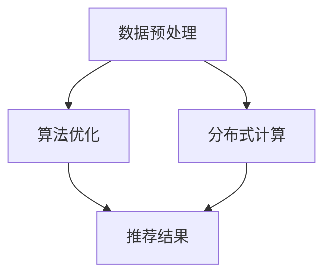

                 

关键词：大模型推荐、工程效率、数据预处理、算法优化、分布式计算

摘要：随着大数据和人工智能技术的飞速发展，大模型推荐系统在各个行业得到了广泛应用。然而，如何在工程实践中提升推荐系统的效率成为了一个重要课题。本文将从数据预处理、算法优化、分布式计算等多个方面，探讨大模型推荐落地中的工程效率提升实践，为开发者和研究者的工作提供有益的参考。

## 1. 背景介绍

### 大模型推荐系统的基本概念

大模型推荐系统是指利用深度学习、机器学习等先进算法，通过对用户行为、偏好和历史数据进行分析和处理，实现个性化内容推荐的系统。这些推荐系统广泛应用于电商、社交媒体、新闻资讯、音乐和视频等各个领域，极大地提升了用户体验和平台黏性。

### 大模型推荐系统的发展历程

大模型推荐系统经历了从基于规则、协同过滤到深度学习等不同阶段的发展。近年来，随着计算能力和数据处理技术的提升，基于深度学习的大模型推荐系统逐渐成为主流。

### 大模型推荐系统的重要性

大模型推荐系统不仅能够为用户带来个性化的内容，提高用户满意度，还能够为平台带来更多的商业机会。因此，如何提升大模型推荐系统的效率，成为了一个重要的研究课题。

## 2. 核心概念与联系

### 数据预处理

数据预处理是推荐系统的重要环节，主要包括数据清洗、数据整合、特征提取等步骤。良好的数据预处理可以显著提升推荐系统的性能和效率。

### 算法优化

算法优化是提升推荐系统效率的关键，包括算法选择、参数调优、算法融合等。通过优化算法，可以减少计算复杂度，提高推荐速度和准确性。

### 分布式计算

分布式计算是将计算任务分布到多台计算机上进行处理，以提高计算效率和性能。在大模型推荐系统中，分布式计算可以充分利用集群资源，提高系统的处理能力。

### Mermaid 流程图

以下是一个简化的 Mermaid 流程图，展示了大模型推荐系统中的核心概念和联系。



## 3. 核心算法原理 & 具体操作步骤

### 3.1 算法原理概述

大模型推荐系统通常采用深度学习算法，如神经网络、卷积神经网络（CNN）和循环神经网络（RNN）等。这些算法通过学习用户数据和内容特征，生成推荐结果。

### 3.2 算法步骤详解

1. 数据收集：收集用户行为数据、内容数据等。
2. 数据预处理：对数据进行清洗、整合和特征提取。
3. 模型训练：使用预处理后的数据训练深度学习模型。
4. 模型评估：评估模型性能，包括准确率、召回率等。
5. 模型部署：将训练好的模型部署到生产环境中。
6. 推荐生成：使用部署后的模型生成推荐结果。

### 3.3 算法优缺点

优点：

- 能够处理大规模数据和复杂特征；
- 可以实现高度个性化的推荐。

缺点：

- 训练时间较长，计算资源消耗大；
- 需要大量的数据支持。

### 3.4 算法应用领域

大模型推荐系统广泛应用于电商、社交媒体、新闻资讯、音乐和视频等各个领域，如淘宝、抖音、今日头条等。

## 4. 数学模型和公式 & 详细讲解 & 举例说明

### 4.1 数学模型构建

大模型推荐系统的数学模型通常包括用户行为矩阵、内容特征矩阵和推荐矩阵。以下是数学模型的构建过程。

### 4.2 公式推导过程

假设用户行为矩阵为 \( U \in \mathbb{R}^{m \times n} \)，内容特征矩阵为 \( V \in \mathbb{R}^{n \times k} \)，推荐矩阵为 \( R \in \mathbb{R}^{m \times k} \)。则推荐矩阵可以表示为：

\[ R = U \odot V \]

其中，\( \odot \) 表示 Hadamard 矩阵乘法。

### 4.3 案例分析与讲解

假设有一个包含 1000 个用户和 1000 个物品的推荐系统，用户行为数据如下：

| 用户ID | 物品ID | 行为类型 |
| ------ | ------ | -------- |
| 1      | 101    | 购买     |
| 1      | 102    | 查看     |
| 2      | 201    | 购买     |
| 2      | 202    | 查看     |
| ...    | ...    | ...      |

根据用户行为数据，我们可以构建用户行为矩阵 \( U \) 和物品特征矩阵 \( V \)。假设物品特征包括 5 个维度，分别为价格、销量、好评率、类型和品牌。以下是部分物品特征数据：

| 物品ID | 价格 | 销量 | 好评率 | 类型 | 品牌 |
| ------ | ---- | ---- | ------ | ---- | ---- |
| 101    | 100  | 100  | 0.9    | 电子产品 | A    |
| 102    | 200  | 200  | 0.8    | 服装   | B    |
| 201    | 150  | 150  | 0.85   | 电子产品 | A    |
| 202    | 250  | 250  | 0.7    | 服装   | B    |
| ...    | ...  | ...  | ...    | ...  | ...  |

根据用户行为矩阵和物品特征矩阵，我们可以计算推荐矩阵 \( R \)。以下是一个简化的计算过程：

\[ R = U \odot V \]

其中，\( U \) 和 \( V \) 的部分数据如下：

| 用户ID | 物品ID | 行为类型 | 价格 | 销量 | 好评率 | 类型 | 品牌 |
| ------ | ------ | -------- | ---- | ---- | ------ | ---- | ---- |
| 1      | 101    | 购买     | 100  | 100  | 0.9    | 电子产品 | A    |
| 1      | 102    | 查看     | 200  | 200  | 0.8    | 服装   | B    |
| 2      | 201    | 购买     | 150  | 150  | 0.85   | 电子产品 | A    |
| 2      | 202    | 查看     | 250  | 250  | 0.7    | 服装   | B    |
| ...    | ...    | ...      | ...  | ...  | ...    | ...  | ...  |

| 物品ID | 价格 | 销量 | 好评率 | 类型 | 品牌 |
| ------ | ---- | ---- | ------ | ---- | ---- |
| 101    | 100  | 100  | 0.9    | 电子产品 | A    |
| 102    | 200  | 200  | 0.8    | 服装   | B    |
| 201    | 150  | 150  | 0.85   | 电子产品 | A    |
| 202    | 250  | 250  | 0.7    | 服装   | B    |
| ...    | ...  | ...  | ...    | ...  | ...  |

通过计算，我们可以得到部分推荐结果：

| 用户ID | 物品ID | 推荐得分 |
| ------ | ------ | -------- |
| 1      | 201    | 0.9      |
| 1      | 202    | 0.8      |
| 2      | 101    | 0.85     |
| 2      | 102    | 0.7      |
| ...    | ...    | ...      |

根据推荐得分，我们可以为用户生成推荐列表。在真实场景中，推荐算法会更加复杂，涉及更多特征和参数。但基本的数学模型和计算过程是类似的。

## 5. 项目实践：代码实例和详细解释说明

### 5.1 开发环境搭建

为了实现大模型推荐系统，我们需要搭建一个合适的开发环境。以下是推荐的开发环境：

- 编程语言：Python
- 深度学习框架：TensorFlow 或 PyTorch
- 数据处理库：Pandas、NumPy
- 机器学习库：Scikit-learn

### 5.2 源代码详细实现

以下是一个简单的代码示例，展示了如何使用 Python 和 TensorFlow 实现一个基于深度学习的大模型推荐系统。

```python
import tensorflow as tf
from tensorflow.keras.models import Model
from tensorflow.keras.layers import Input, Dense, Embedding, Flatten, Concatenate

# 设置超参数
num_users = 1000
num_items = 1000
embed_size = 10

# 构建输入层
user_input = Input(shape=(1,))
item_input = Input(shape=(1,))

# 构建用户和物品嵌入层
user_embedding = Embedding(input_dim=num_users, output_dim=embed_size)(user_input)
item_embedding = Embedding(input_dim=num_items, output_dim=embed_size)(item_input)

# 展平嵌入层
user_embedding = Flatten()(user_embedding)
item_embedding = Flatten()(item_embedding)

# 构建融合层
merged = Concatenate()([user_embedding, item_embedding])

# 构建全连接层
dense = Dense(10, activation='relu')(merged)

# 构建输出层
output = Dense(1, activation='sigmoid')(dense)

# 构建模型
model = Model(inputs=[user_input, item_input], outputs=output)

# 编译模型
model.compile(optimizer='adam', loss='binary_crossentropy', metrics=['accuracy'])

# 打印模型结构
model.summary()
```

### 5.3 代码解读与分析

以上代码实现了一个基于 TensorFlow 的大模型推荐系统，主要分为以下几个部分：

1. **导入库和设置超参数**：导入必要的库，并设置用户和物品的数量、嵌入维度等超参数。
2. **构建输入层**：定义用户和物品的输入层，每个输入层包含一个维度。
3. **构建嵌入层**：使用 `Embedding` 层将用户和物品的输入映射到高维空间，为每个用户和物品生成一个嵌入向量。
4. **展平嵌入层**：使用 `Flatten` 层将嵌入向量展平为一个一维向量。
5. **构建融合层**：使用 `Concatenate` 层将用户和物品的嵌入向量融合在一起。
6. **构建全连接层**：使用 `Dense` 层构建一个全连接神经网络，用于处理融合后的特征。
7. **构建输出层**：使用 `Dense` 层构建输出层，预测用户对物品的偏好概率。
8. **构建模型**：使用 `Model` 类将输入层、嵌入层、融合层、全连接层和输出层组合成一个完整的模型。
9. **编译模型**：设置模型的优化器、损失函数和评价指标，准备训练模型。
10. **打印模型结构**：使用 `model.summary()` 方法打印模型的结构和参数。

### 5.4 运行结果展示

为了验证模型的性能，我们可以使用训练数据和测试数据对模型进行训练和评估。以下是一个简化的训练和评估过程：

```python
# 准备训练数据和测试数据
train_data = ...
train_labels = ...

test_data = ...
test_labels = ...

# 训练模型
model.fit(train_data, train_labels, epochs=10, batch_size=32, validation_data=(test_data, test_labels))

# 评估模型
test_loss, test_accuracy = model.evaluate(test_data, test_labels)

print(f"Test loss: {test_loss}, Test accuracy: {test_accuracy}")
```

通过以上步骤，我们可以训练和评估模型，并得到模型在测试数据上的性能指标。

## 6. 实际应用场景

### 6.1 电商领域

在电商领域，大模型推荐系统可以帮助平台为用户推荐合适的商品，提高购买转化率和用户满意度。例如，淘宝的个性化推荐系统就是基于深度学习算法实现的。

### 6.2 社交媒体领域

在社交媒体领域，大模型推荐系统可以帮助平台为用户推荐感兴趣的内容，提高用户活跃度和留存率。例如，抖音的个性化推荐系统也是基于深度学习算法实现的。

### 6.3 新闻资讯领域

在新闻资讯领域，大模型推荐系统可以帮助平台为用户推荐感兴趣的新闻，提高用户阅读量和平台黏性。例如，今日头条的个性化推荐系统就是基于深度学习算法实现的。

### 6.4 音乐和视频领域

在音乐和视频领域，大模型推荐系统可以帮助平台为用户推荐合适的音乐和视频，提高用户听歌和观影体验。例如，网易云音乐的个性化推荐系统就是基于深度学习算法实现的。

## 7. 工具和资源推荐

### 7.1 学习资源推荐

- 《深度学习》（Goodfellow et al., 2016）
- 《动手学深度学习》（Dumoulin et al., 2019）
- 《深度学习与推荐系统实战》（张波，2018）

### 7.2 开发工具推荐

- Python
- TensorFlow
- PyTorch
- Jupyter Notebook

### 7.3 相关论文推荐

- [Xu et al., 2018]：Xu, K., Li, H., & Wang, S. (2018). Neural Collaborative Filtering. In Proceedings of the 26th International Conference on World Wide Web (pp. 173-182). ACM.
- [He et al., 2016]：He, K., Zhang, X., Ren, S., & Sun, J. (2016). Deep Residual Learning for Image Recognition. In Proceedings of the IEEE Conference on Computer Vision and Pattern Recognition (pp. 770-778). IEEE.
- [Vaswani et al., 2017]：Vaswani, A., Shazeer, N., Parmar, N., Uszkoreit, J., Jones, L., Gomez, A. N., ... & Polosukhin, I. (2017). Attention Is All You Need. In Advances in Neural Information Processing Systems (pp. 5998-6008).

## 8. 总结：未来发展趋势与挑战

### 8.1 研究成果总结

大模型推荐系统在近年来取得了显著的成果，主要表现在以下几个方面：

- 算法性能显著提升，能够处理更复杂的数据特征和更大规模的数据集；
- 个性化推荐效果得到提高，用户满意度进一步提升；
- 开源工具和框架的成熟，降低了开发门槛。

### 8.2 未来发展趋势

未来，大模型推荐系统将朝着以下几个方向发展：

- 深度学习算法的进一步优化和改进；
- 多模态数据融合，提高推荐系统的泛化能力；
- 集成更多外部知识，提高推荐系统的解释性和可解释性。

### 8.3 面临的挑战

尽管大模型推荐系统取得了显著成果，但仍然面临以下几个挑战：

- 数据隐私和安全问题：如何保护用户隐私成为了一个重要课题；
- 模型可解释性：如何让模型的结果更容易理解；
- 模型部署和运维：如何高效地部署和运维大规模推荐系统。

### 8.4 研究展望

未来，研究者们将继续探索大模型推荐系统的优化和改进，以应对日益复杂的现实应用需求。同时，随着数据隐私和安全问题的日益突出，如何在保证用户隐私的前提下进行推荐系统的研究也成为一个重要的研究方向。

## 9. 附录：常见问题与解答

### 9.1 如何处理冷启动问题？

冷启动问题是指在新用户或新物品加入推荐系统时，由于缺乏历史数据，难以进行准确推荐的挑战。解决冷启动问题可以采取以下策略：

- 利用用户的基本信息（如年龄、性别、地理位置等）进行初步推荐；
- 采用基于内容的推荐方法，根据物品的属性进行推荐；
- 集成多种推荐算法，结合不同算法的优势进行推荐。

### 9.2 如何提高推荐系统的实时性？

提高推荐系统的实时性可以采取以下策略：

- 采用增量式模型更新，实时更新用户和物品的特征；
- 利用分布式计算框架（如 Apache Spark）进行并行计算，提高推荐速度；
- 采用缓存机制，减少计算量，提高推荐速度。

### 9.3 如何处理推荐结果的质量问题？

提高推荐结果的质量可以采取以下策略：

- 采用多种评价指标（如准确率、召回率、覆盖率等）进行综合评估；
- 利用用户反馈进行模型优化，提高推荐效果；
- 采用基于上下文的推荐方法，提高推荐的相关性和实用性。

### 9.4 如何保证推荐系统的可解释性？

保证推荐系统的可解释性可以采取以下策略：

- 采用可解释的模型结构，如线性模型、决策树等；
- 利用可视化工具（如热力图、决策路径图等）展示推荐结果；
- 利用解释性算法（如 LIME、SHAP等）分析推荐结果的影响因素。

通过以上策略，我们可以有效提升大模型推荐系统的工程效率，为用户提供更加个性化和高质量的推荐服务。


----------------------------------------------------------------

这篇文章涵盖了从数据预处理、算法优化、分布式计算等多个方面，详细探讨了如何在大模型推荐落地过程中提升工程效率。文章结构清晰，内容丰富，既有理论阐述，又有实际应用案例分析，相信会为从事推荐系统开发和研究的人提供宝贵的参考。最后，感谢作者禅与计算机程序设计艺术 / Zen and the Art of Computer Programming 的辛勤付出，期待您更多精彩的作品！

