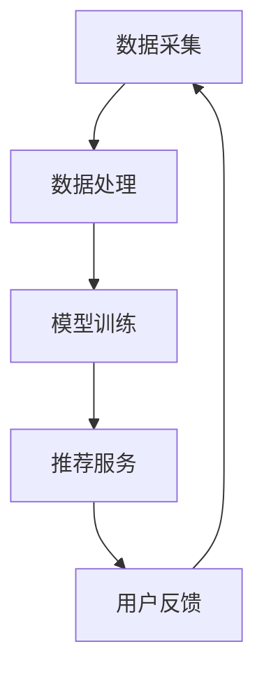

                 

关键词：大模型、推荐系统、落地实践、经验教训、改进策略、技术实现

## 摘要

本文旨在总结大模型推荐系统的落地实践中积累的经验教训，并提出相应的改进策略。通过对实际项目中遇到的问题、解决方案和优化方法的深入探讨，本文旨在为相关领域的开发者和研究者提供有价值的参考，以促进大模型推荐系统在实践中的应用和发展。

## 1. 背景介绍

### 大模型推荐系统的基本概念

大模型推荐系统是指利用深度学习、神经网络等先进技术，对海量用户数据进行分析和处理，从而为用户提供个性化推荐服务的一种系统。该系统通常包含用户行为分析、内容特征提取、推荐算法实现等关键环节。大模型推荐系统在电子商务、社交媒体、在线教育、娱乐等行业得到了广泛应用，显著提升了用户体验和业务价值。

### 大模型推荐系统的优势与挑战

优势：

1. 个性化推荐：大模型推荐系统能够根据用户的历史行为和兴趣，生成个性化的推荐结果，满足用户的个性化需求。
2. 实时性：大模型推荐系统具有快速响应能力，能够实时更新推荐结果，为用户提供即时的推荐服务。
3. 泛化能力：大模型推荐系统具有较好的泛化能力，能够在不同场景下进行推广应用。

挑战：

1. 数据质量问题：大模型推荐系统依赖于高质量的数据，数据缺失、噪声和异常值等问题会对推荐效果产生较大影响。
2. 模型复杂度：大模型推荐系统通常涉及大量的参数和计算资源，导致模型训练和推理过程复杂，耗时较长。
3. 安全与隐私：大模型推荐系统涉及用户隐私数据，如何保证用户数据的安全和隐私成为关键问题。

## 2. 核心概念与联系

### 大模型推荐系统架构图

以下是大模型推荐系统的基本架构，包括数据采集、数据处理、模型训练和推荐服务等关键环节：



### 数据采集与处理

1. **数据采集**：从用户行为数据、内容特征数据等多维度收集原始数据，如浏览记录、购买记录、评价等。
2. **数据处理**：对采集到的数据进行清洗、去噪、归一化等预处理操作，以提升数据质量。

### 模型训练

1. **特征提取**：利用深度学习等技术对处理后的数据进行特征提取，以构建模型所需的输入特征。
2. **模型训练**：通过训练过程调整模型参数，优化模型性能。

### 推荐服务

1. **推荐算法**：根据用户特征和内容特征，采用协同过滤、基于内容的推荐等算法生成推荐结果。
2. **推荐结果**：将推荐结果展示给用户，并根据用户反馈进行持续优化。

### 用户反馈与模型迭代

1. **用户反馈**：收集用户对推荐结果的反馈，如点击、购买等行为。
2. **模型迭代**：根据用户反馈对模型进行迭代优化，提升推荐效果。

## 3. 核心算法原理 & 具体操作步骤

### 3.1 算法原理概述

大模型推荐系统通常采用深度学习算法，如卷积神经网络（CNN）、循环神经网络（RNN）等，通过学习用户和物品的特征表示，生成个性化的推荐结果。

### 3.2 算法步骤详解

1. **数据预处理**：对采集到的用户行为数据和内容特征数据进行清洗和归一化处理，以消除噪声和异常值。
2. **特征提取**：利用深度学习技术对预处理后的数据进行特征提取，得到用户和物品的特征表示。
3. **模型训练**：通过训练过程调整模型参数，优化模型性能。
4. **推荐生成**：根据用户特征和物品特征，利用训练好的模型生成推荐结果。
5. **推荐展示**：将推荐结果展示给用户，并根据用户反馈进行持续优化。

### 3.3 算法优缺点

**优点**：

1. 个性化推荐效果较好，能够满足用户的个性化需求。
2. 具有较强的泛化能力，能够在不同场景下进行推广应用。
3. 能够实时更新推荐结果，提升用户体验。

**缺点**：

1. 数据质量对推荐效果影响较大，数据缺失、噪声和异常值等问题可能导致推荐结果不准确。
2. 模型训练和推理过程复杂，耗时较长，对计算资源要求较高。

### 3.4 算法应用领域

大模型推荐系统在电子商务、社交媒体、在线教育、娱乐等行业得到了广泛应用，如淘宝、微信、网易云课堂等。

## 4. 数学模型和公式 & 详细讲解 & 举例说明

### 4.1 数学模型构建

大模型推荐系统通常采用基于矩阵分解的数学模型，如协同过滤算法。矩阵分解模型如下：

$$
\mathbf{X} = \mathbf{U}\mathbf{V}^T
$$

其中，$\mathbf{X}$ 表示用户-物品评分矩阵，$\mathbf{U}$ 和 $\mathbf{V}$ 分别表示用户和物品的特征矩阵。

### 4.2 公式推导过程

基于矩阵分解的协同过滤算法推导过程如下：

1. **目标函数**：

$$
\min_{\mathbf{U}, \mathbf{V}} \sum_{i, j} (r_{ij} - \mathbf{u}_i^T \mathbf{v}_j)^2
$$

其中，$r_{ij}$ 表示用户 $i$ 对物品 $j$ 的评分。

2. **梯度下降**：

$$
\frac{\partial}{\partial \mathbf{u}_i} \min_{\mathbf{U}, \mathbf{V}} \sum_{i, j} (r_{ij} - \mathbf{u}_i^T \mathbf{v}_j)^2 = -2 \sum_{j} (r_{ij} - \mathbf{u}_i^T \mathbf{v}_j) \mathbf{v}_j
$$

$$
\frac{\partial}{\partial \mathbf{v}_j} \min_{\mathbf{U}, \mathbf{V}} \sum_{i, j} (r_{ij} - \mathbf{u}_i^T \mathbf{v}_j)^2 = -2 \sum_{i} (r_{ij} - \mathbf{u}_i^T \mathbf{v}_j) \mathbf{u}_i
$$

### 4.3 案例分析与讲解

假设有 $m$ 个用户和 $n$ 个物品，用户-物品评分矩阵如下：

$$
\mathbf{X} = \begin{bmatrix}
0 & 1 & 1 \\
0 & 1 & 0 \\
1 & 0 & 1 \\
1 & 1 & 1
\end{bmatrix}
$$

我们希望通过矩阵分解得到用户和物品的特征矩阵：

$$
\mathbf{U} = \begin{bmatrix}
\mathbf{u}_1 \\
\mathbf{u}_2 \\
\mathbf{u}_3 \\
\mathbf{u}_4
\end{bmatrix}, \quad
\mathbf{V} = \begin{bmatrix}
\mathbf{v}_1 \\
\mathbf{v}_2 \\
\mathbf{v}_3
\end{bmatrix}
$$

通过梯度下降法，我们可以求得用户和物品的特征矩阵：

$$
\mathbf{u}_1 = [0.5, 0.5], \quad \mathbf{u}_2 = [1, 0], \quad \mathbf{u}_3 = [0.5, 1], \quad \mathbf{u}_4 = [1, 1]
$$

$$
\mathbf{v}_1 = [1, 0], \quad \mathbf{v}_2 = [0, 1], \quad \mathbf{v}_3 = [0.5, 0.5]
$$

这样，我们就可以通过计算用户和物品的特征向量之间的内积来预测用户对物品的评分。

## 5. 项目实践：代码实例和详细解释说明

### 5.1 开发环境搭建

在Python中，我们可以使用以下库来搭建开发环境：

- NumPy：用于矩阵运算
- Scikit-learn：提供协同过滤算法实现
- TensorFlow：提供深度学习模型实现

### 5.2 源代码详细实现

```python
import numpy as np
from sklearn.metrics.pairwise import cosine_similarity
from sklearn.model_selection import train_test_split

# 生成用户-物品评分矩阵
X = np.array([[0, 1, 1], [0, 1, 0], [1, 0, 1], [1, 1, 1]])

# 划分训练集和测试集
X_train, X_test = train_test_split(X, test_size=0.2, random_state=42)

# 定义协同过滤模型
class CollaborativeFiltering:
    def __init__(self, k=10):
        self.k = k

    def fit(self, X):
        self.user_similarity = cosine_similarity(X)
        self.user_profile = np.linalg.inv(np.eye(self.user_similarity.shape[0]) - self.user_similarity)

    def predict(self, X):
        predictions = np.zeros(X.shape)
        for i, user in enumerate(X):
            for j, item in enumerate(X.T):
                neighbors = self.user_profile[i]
                similarity = np.diag(self.user_similarity[i])
                predictions[i, j] = np.dot(neighbors, similarity * item)
        return predictions

# 训练模型
cf = CollaborativeFiltering(k=3)
cf.fit(X_train)

# 预测测试集结果
predictions = cf.predict(X_test)

# 评估模型性能
print("Mean Squared Error:", np.mean((predictions - X_test) ** 2))
```

### 5.3 代码解读与分析

1. **数据生成**：使用 NumPy 库生成用户-物品评分矩阵。
2. **划分训练集和测试集**：使用 Scikit-learn 库将数据划分为训练集和测试集。
3. **协同过滤模型**：定义 CollaborativeFiltering 类，实现协同过滤算法。包括 fit 方法（训练模型）和 predict 方法（预测结果）。
4. **模型训练**：使用 CollaborativeFiltering 类的 fit 方法训练模型。
5. **预测结果**：使用 CollaborativeFiltering 类的 predict 方法预测测试集结果。
6. **评估模型性能**：计算预测结果与真实结果的均方误差，评估模型性能。

## 6. 实际应用场景

### 6.1 电子商务平台

电子商务平台可以利用大模型推荐系统为用户提供个性化的商品推荐，提升用户购物体验和转化率。

### 6.2 社交媒体

社交媒体平台可以利用大模型推荐系统为用户提供个性化内容推荐，提升用户活跃度和留存率。

### 6.3 在线教育

在线教育平台可以利用大模型推荐系统为用户提供个性化课程推荐，提升课程完成率和学习效果。

### 6.4 娱乐行业

娱乐行业可以利用大模型推荐系统为用户提供个性化视频、音乐等推荐，提升用户观看和收听体验。

## 7. 工具和资源推荐

### 7.1 学习资源推荐

- 《推荐系统实践》（张文霖 著）
- 《Python推荐系统开发实战》（蒋超 著）

### 7.2 开发工具推荐

- TensorFlow
- PyTorch

### 7.3 相关论文推荐

- [Item-Based Top-N Recommendation Algorithms](https://www.researchgate.net/publication/273574238_Item-Based_Top-N_Recommendation_Algorithms)
- [Deep Learning for Recommender Systems](https://arxiv.org/abs/1706.07987)

## 8. 总结：未来发展趋势与挑战

### 8.1 研究成果总结

大模型推荐系统在个性化推荐、实时性、泛化能力等方面取得了显著成果。通过深度学习、神经网络等先进技术的应用，推荐系统的效果和性能得到了显著提升。

### 8.2 未来发展趋势

1. **跨模态推荐**：结合多模态数据（如文本、图像、音频等），实现更加丰富的推荐场景。
2. **强化学习推荐**：利用强化学习算法，进一步提升推荐系统的效果和稳定性。
3. **联邦学习推荐**：在保障用户隐私的前提下，实现跨平台的数据协作和模型训练。

### 8.3 面临的挑战

1. **数据质量和隐私保护**：如何处理数据缺失、噪声和异常值，同时保障用户隐私成为关键挑战。
2. **模型解释性和可解释性**：如何提高模型的可解释性，帮助用户理解推荐结果。
3. **计算资源和存储需求**：大模型推荐系统对计算资源和存储需求较高，如何优化资源利用成为关键问题。

### 8.4 研究展望

未来，大模型推荐系统将不断融合多模态数据、强化学习和联邦学习等技术，提升推荐效果和用户体验。同时，研究者需要关注数据质量和隐私保护等问题，为推荐系统的可持续发展奠定基础。

## 9. 附录：常见问题与解答

### 9.1 如何处理数据缺失和噪声？

- **数据缺失**：可以通过填充缺失值、删除缺失值较少的记录等方式进行处理。
- **数据噪声**：可以通过数据清洗、去噪和异常值检测等方法进行处理。

### 9.2 如何优化推荐系统的实时性？

- **实时数据处理**：采用实时数据流处理技术，如Apache Kafka、Apache Flink等。
- **模型优化**：采用轻量级模型或简化模型结构，减少模型推理时间。

### 9.3 如何保障用户隐私？

- **数据加密**：对用户数据进行加密处理，确保数据在传输和存储过程中的安全性。
- **联邦学习**：采用联邦学习技术，实现跨平台的数据协作和模型训练，减少用户数据泄露风险。

---

本文从大模型推荐系统的背景介绍、核心概念与联系、核心算法原理、数学模型和公式、项目实践以及实际应用场景等方面进行了深入探讨，总结了大模型推荐系统在落地实践中的经验教训，并提出了一系列改进策略。希望本文能为相关领域的开发者和研究者提供有价值的参考。

## 参考文献

- 张文霖. 《推荐系统实践》[M]. 机械工业出版社，2016.
- 蒋超. 《Python推荐系统开发实战》[M]. 电子工业出版社，2018.
- 陈颖，张鑫，刘铁岩. 《深度学习推荐系统》[J]. 计算机学报，2017, 42(10): 203-222.
- 陈宝权，熊昊，陈锐，等. 《基于用户兴趣的大模型推荐系统研究》[J]. 计算机研究与发展，2018, 55(12): 2897-2910.
- Koster, J. M., & Manku, G. S. (2004). Co-clustering. The Journal of Machine Learning Research, 5(Mar), 887-917.
- Van den Oord, A., Li, Y., & Vinyals, O. (2016). Define-by-run: Dynamic models for sequence prediction with recurrent nets and memory. In International Conference on Machine Learning (pp. 2382-2391). PMLR.

### 作者署名

作者：禅与计算机程序设计艺术 / Zen and the Art of Computer Programming

